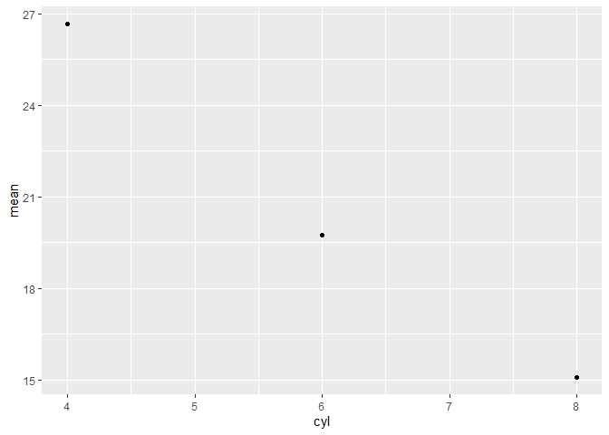

Advanced R 2nd ed
================
true
2020-01-10

R의 OOP는 최소한만 공부하였다.

R에서는 OOP보다 함수형 프로그래밍이 훨씬 더 중요하지만 그럼에도 불구하고, 학습해야할 중요한 이유가 있다.

-   S3는 함수의 결과물을 유저에게 친숙하도록 더욱 풍부하게 반환하고 내부는 프로그래머에게 친숙하도록 반환한다. S3는 베이스 R전체에서 이용되므로 베이스 R 함수를 확장시키고 싶다면 숙달하는 것이 중요하다.

-   R6는 R의 copy-on-modify 문법을 탈출하는 표준화된 방법을 제공한다. R과 독립적으로 존재하는 모델 객체를 원한다면 특히 중요하다. 오늘날, R6에 대한 수요는 웹 API로부터 왔거나 R의 내부와 외부에서 온 변화인 모델 데이터이다.

-   S4는 프로그램 디자인에 관해 신중하게 생각하도록 하는 엄격한 시스템이다. 시간에 따라 진화하는 대규모 시스템을 개발하는데에 잘 어울리고 많은 프로그래머로부터 기여를 받는다.

OOP의 주된 사용 이유는 다형성이다. 다형성은 개발자가 함수의 인터페이스를 구현으로부터 분리하여 고려하고 다른 타입의 인풋으로부터 같은 함수의 사용을 가능하게 한다. 이것은 캡슐화와 면밀하게 연관되어 있다: 유저는 세부사항이 표준 인터페이스에 캡슐화되어있기 때문에 세부사항을 걱정할 필요가 없다.

구체적으로 다형성은 `summary()`가 수치와 팩터 변수에 대해 다른 아웃풋을 생성하도록 허용한다.

``` r
summary(diamonds$carat)
```

    ##    Min. 1st Qu.  Median    Mean 3rd Qu.    Max. 
    ##  0.2000  0.4000  0.7000  0.7979  1.0400  5.0100

``` r
summary(diamonds$cut)
```

    ##      Fair      Good Very Good   Premium     Ideal 
    ##      1610      4906     12082     13791     21551

`summary()`가 if-else 구문을 포함하고 있다고 생각할 수 있지만, 새로운 구현에 더한 것 뿐이다. 하나의 OOP시스템은 새로운 타입의 인풋에 대한 구현을 가진 인터페이스로 확장시키도록 할 수 있다.

좀 더 정확하게 OO 시스템은 객체의 타입을 **class**로 부르고 구체적인 클래스에 대한 구현은 메소드로 불린다. 엄밀히 말해서, 클래스는 객체가 무엇인지 정의하고 메소드는 객체의 할 수 있는 일을 정의한다. 클래스는 **field**를 정의하는데 이 필드는 클래스의 모든 인스턴스에 의해 처리되는 데이터이다. 클래스들은 계층적으로 정의되는데 만약 메소드가 하나의 클래스에 존재하지 않는다면, 부모메소드가 이용되고 자식메소드는 상속이라고 이야기된다. 예를 들어, R에서 순서형 팩터는 보통의 팩터를 상속하고 GLM모델은 linear모델로부터 상속받는다. 특정 클래스에서 올바른 메소드를 찾는 것에 대한 과정을 **method dispatch**라고 불린다.

-   캡슐화된 OOP, 메소드는 객체나 클래스에 속해있고 메소드는 전형적으로 `object.method(arg1, arg2)`처럼 보인다. 이것을 캡슐화되어 있다고 불리는데 객체는 데이터와 그 행동양식을 둘 다 캡슐화하고 이것은 대부분의 대중적인 언어에서 찾아지는 패러다임이다.

-   함수형 OOP, 메소드는 제네릭 함수에 속해있고 메소드는 보통의 함수 호출(`generic(object, arg2, arg3))`과 같은 호출이다. 이것을 functional이라고 불리는데 외부에서 보기에는 보통의 함수 호출처럼 보이고 내부적인 구성 또한 함수이다.

**OOP in R **

베이스 R에서 제공하는 OOP 시스템

-   **S3**는 R의 첫 번째 OOP시스템이다. S3는 함수형 OOP의 비공식 구현이고 보통의 관습에 의존한다. 시작하기에 쉽고 많은 간단한 문제를 해결하는 데에 값싼 방법을 제공한다.

-   **S4**는 공식적이고 엄격한 S3의 재구성이다. 좀더 보장되고 더 좋은 캡슐화를 제공한다. S4는 베이스 **methods**패키지에 구현되어 있다. 이것은 항상 R과 함께 설치된다.

-   **RC**(reference class)는 캡슐화된 OO를 구현한다. RC 객체는 S4객체의 특별한 타입이다. 또한 **mutable**하다. 즉, R의 보통의 copy-on-modify 문법을 사용하는 대신에, 제자리에서 수정될 수 있다. S3와 S4에서 해결하기 어려운 문제를 해결할 수 있게 한다.

CRAN 패키지에서 제공되는 OOP 시스템

-   **R6**는 RC같은 캡슐화된 OOP를 구현하지만 몇 가지 중요한 문제를 해결한다. 이 책에서는 RC대신 R6를 학습할 것이다.

-   **R.oo**는 S3의 형식주의를 제공하고 mutable한 S3 객체를 가지도록 할 수 있다.

-   **proto**는 **prototypes**의 아이디어를 기반으로 한 또다른 OOP시스템을 구현하고 클래스와 클래스의 인스턴스(객체)사이의 차이를 흐릿하게 만든다.

``` r
library(sloop)
```

``` r
otype(1:10)
```

    ## [1] "base"

``` r
otype(mtcars)
```

    ## [1] "S3"

``` r
mle_obj <- stats4::mle(function(x = 1) (x - 2) ^ 2)
otype(mle_obj)
```

    ## [1] "S4"

Base types
==========

여기서는 base 객체와 OO 객체를 구분하겠다.

Base versus OO objects
----------------------

``` r
# A base object
is.object(1:10)
```

    ## [1] FALSE

``` r
otype(1:10)
```

    ## [1] "base"

``` r
# An OO object
is.object(mtcars)
```

    ## [1] TRUE

``` r
otype(mtcars)
```

    ## [1] "S3"

엄밀히 따지면, base와 OO객체 사이의 차이는 OO 객체는 "class"속성을 가진다.

``` r
attr(1:10, "class")
```

    ## NULL

``` r
attr(mtcars, "class")
```

    ## [1] "data.frame"

`class()`함수는 S3와 S4객체에 적용하기에 아전하지만 베이스 객체에 적용하면 잘못된 결과를 반환한다. `sloop::s3_class()`를 사용하자.

``` r
x <- matrix(1:4, nrow = 2)
class(x)
```

    ## [1] "matrix"

``` r
s3_class(x)
```

    ## [1] "matrix"  "integer" "numeric"

OO객체만 오직 class속성을 가지는 반면에 모든 객체는 base타입을 가진다.

base타입은 OOP시스템을 구성하지 않는다. 왜냐하면 다른 베이트 타입에서 다르게 행동하고 주로switch구문을 사용하는 C코드에서 작성되기 때문이다. 이것은 R-core는 새로운 타입을 생성할 수 있고 새로운 타입을 생성하는 것은 많은 작업이다. 왜냐하면 모든 switch구문은 새로운 케이스를 다루기 위해서 수정될 필요가 있기 때문이다. 결과적으로, 새로운 베이스 타입은 잘 더해지지 않는다. 대부분의 최근 변화는 두 개의 R자체에서는 볼 수 없었던 이국적인 타입을 더했다. 하지만 메모리 문제를 진단하는 데에 필요하다.그 전에, 더해진 마지막 타입은 2005년에 더해진 S4객체의 특별한 타입이다.

총 25개의 다른 베이스 타입이 있다. 이러한 타입들은 가장 주요한 C코드에 있고 C 타입 이름에 의해 호출되는 것을 볼 수 있다.

-   벡터

``` r
typeof(NULL)
```

    ## [1] "NULL"

``` r
typeof(1L)
```

    ## [1] "integer"

``` r
typeof(1i)
```

    ## [1] "complex"

-   함수

``` r
typeof(mean) # closure: regular r 함수
```

    ## [1] "closure"

``` r
typeof(`[`) # special
```

    ## [1] "special"

``` r
typeof(sum) # builtin 원시함수
```

    ## [1] "builtin"

-   환경

``` r
typeof(globalenv())
```

    ## [1] "environment"

-   S4타입

``` r
mle_obj <- stats4::mle(function(x = 1) (x - 2) ^ 2)
typeof(mle_obj)
```

    ## [1] "S4"

-   언어 성분

``` r
typeof(quote(a))
```

    ## [1] "symbol"

``` r
typeof(quote(a + 1))
```

    ## [1] "language"

``` r
typeof(formals(mean))
```

    ## [1] "pairlist"

`expression`은 오직 `parse()`와 `expression()`에 의해 반환되는 특별한 목적이다. 표현식은 일반적으로 유저 코드에 필요하지는 않다.

-   나머지 타입은 R에서는 거의 볼 수 없고 C코드 구현에 주로 중요하다.

### Numeric type

수치형 타입에 대해 말할 때 조심하자. 왜냐하면 R은 수치를 세 가지 다른 것을 의미하기 때문이다.

1.  몇 곳에서는 수치는 dobule 타입의 가명이다. 예를 들어, `as.numeric()`은 `as.double()`과 동일하며 `numeric()`은 `double()`과 같다.
2.  S3과 S4시스템에서는 수치는 integer나 double타입의 shorthand이다.

``` r
s3_class(1)
```

    ## [1] "double"  "numeric"

``` r
s3_class(1L)
```

    ## [1] "integer" "numeric"

1.  `is.numeric()`은 숫자 같이 행동하는 객체를 검정한다. 예를 들어, 팩터는 integer타입이지만 숫자처럼 행동하지는 않는다.

``` r
typeof(factor("x"))
```

    ## [1] "integer"

``` r
is.numeric(factor("x"))
```

    ## [1] FALSE

S3
==

S3은 base와 stats패키지에서만 사요된다. S3은 매우 유연하다.

Basics
------

S3객체는 최소한 `class`속성을 가지는 base타입이다.

``` r
f <- factor(c("a", "b", "c"))

typeof(f)
```

    ## [1] "integer"

``` r
attributes(f)
```

    ## $levels
    ## [1] "a" "b" "c"
    ## 
    ## $class
    ## [1] "factor"

``` r
unclass(f)
```

    ## [1] 1 2 3
    ## attr(,"levels")
    ## [1] "a" "b" "c"

S3객체는 제네릭에 전달할 때 마다 베이스타입으로부터 다르게 행동한다. 함수가 제네릭인지 말하는 가장 쉬운 방법은 `ftype()`을 사용하고 아웃풋에서 generic인지 확인하는 것이다.

``` r
ftype(print)
```

    ## [1] "S3"      "generic"

``` r
ftype(str)
```

    ## [1] "S3"      "generic"

``` r
ftype(unclass)
```

    ## [1] "primitive"

제네릭함수는 인터페이스를 정의하고 인자의 클래스에 따라 다른 구현을 사용한다. 많은 알 함수는 중요한 `print()`를 포함하는 제네릭이다.

``` r
print(f)
```

    ## [1] a b c
    ## Levels: a b c

``` r
# stripping class reverts to integer behaviour
print(unclass(f))
```

    ## [1] 1 2 3
    ## attr(,"levels")
    ## [1] "a" "b" "c"

`str()`이 제네릭인 것을 인지하고 몇 가지 S3클래스들은 내부 디테일을 숨기고자 제네렉을 사요한다. 예를 들어, `POSIXlt`클래스는 실제로 리스트의 최상에 만들어 졌다.

``` r
time <- strptime(c("2017-01-01", "2020-05-04 03:21"), "%Y-%m-%d")
str(time)
```

    ##  POSIXlt[1:2], format: "2017-01-01" "2020-05-04"

``` r
str(unclass(time))
```

    ## List of 11
    ##  $ sec   : num [1:2] 0 0
    ##  $ min   : int [1:2] 0 0
    ##  $ hour  : int [1:2] 0 0
    ##  $ mday  : int [1:2] 1 4
    ##  $ mon   : int [1:2] 0 4
    ##  $ year  : int [1:2] 117 120
    ##  $ wday  : int [1:2] 0 1
    ##  $ yday  : int [1:2] 0 124
    ##  $ isdst : int [1:2] 0 0
    ##  $ zone  : chr [1:2] "KST" "KST"
    ##  $ gmtoff: int [1:2] NA NA

특정 클래스의 구현을 메소드라고 부르고 제네릭은 method dispatch를 수행함으로써 메소드를 찾는다.

``` r
s3_dispatch(print(f))
```

    ## => print.factor
    ##  * print.default

일반적으로, 함수 이름에 `.`이 있으면 메소드인지 확인할 수 있지만 S3전에 쓰여진 base R함수가 있어서 `.`을 단어의 연결을 위해 사용했었다.

``` r
ftype(t.test)
```

    ## [1] "S3"      "generic"

``` r
ftype(t.data.frame)
```

    ## [1] "S3"     "method"

대부분의 함수와는 달리 대부분의 S3메소드의 소스코드를 볼 수 없다. 전역환경에서 이요가능하지 않고 패키지 내에 있다. 대신에 `sloop::s3_get_method()`사용

``` r
weighted.mean.Date
```

    ## Error in eval(expr, envir, enclos): 객체 'weighted.mean.Date'를 찾을 수 없습니다

``` r
s3_get_method(weighted.mean.Date)
```

    ## function (x, w, ...) 
    ## structure(weighted.mean(unclass(x), w, ...), class = "Date")
    ## <bytecode: 0x00000000177e6fb8>
    ## <environment: namespace:stats>

Classes
-------

S3는 클래스를 정의하기 위한 형태가 없다.

제네릭 함수는 인풋의 타입에 따라 결과를 생성하는 인풋의 다른 타입에 적용된다. `plot()`과 `summary()`같은 함수가 있다.

------------------------------------------------------------------------

OOP는 여기까지만 공부

\*\*Metaprograaming

메타프로그래밍은 코드가 프로그램스럽게 데이터가 점검되고 수정될 수 있는 데이터라는 생각이다.

메타프로그래밍과 밀접하게 연결되어 있는 것은 **non-standard evaluation**(줄여서 NSE)이다. R함수의 행동양식을 설명하기 위해 흔히 이용된다. 먼저, NSE는 실제로 함수 인자의 특성이므로 NSE함수를 취하는 것은 약간 엉성하다. 둘째로, standard가 아닌 것에 의해 정의하는 것은 혼란스러우므로 이 책에서는 어휘에 대해 좀 더 정확하게 도입하겠다.

tidy evaluation은 rlang 패키지에 구현되어 있다.

Big picture
===========

``` r
library(rlang)
```

    ## 
    ## Attaching package: 'rlang'

    ## The following objects are masked from 'package:purrr':
    ## 
    ##     %@%, as_function, flatten, flatten_chr, flatten_dbl, flatten_int,
    ##     flatten_lgl, flatten_raw, invoke, list_along, modify, prepend,
    ##     splice

``` r
library(lobstr)
```

Code is data
------------

첫 번째 빅 아이디어는 코드는 데이터이다: 코드를 캡처해서 다른 타입의 데이터를 가지고 계산할 수 있다.

``` r
expr(mean(x, na.rm = TRUE))
```

    ## mean(x, na.rm = TRUE)

``` r
expr(10 + 100 + 1000)
```

    ## 10 + 100 + 1000

좀 더 공식적으로, 캡쳐된 코드를 **expression**이라고 부른다. 표현식은 하나의 객체 타입은 아니지만 네 개의 타입의 집합 단어이다(call, symbol, constant, or pairlist)

`expr()`은 타이핑한 코드를 캡처한다. 함수에 전달한 코드를 캡처하는 다른 도구가 필요하다.

``` r
capture_it <- function(x) {
  expr(x)
}
capture_it(a + b + c)
```

    ## x

`enexpr()`은 lazily evaluated 인자를 취하고 표현식으로 바꾼다.

``` r
capture_it <- function(x) {
  enexpr(x)
}
capture_it(a + b + c)
```

    ## a + b + c

표현식을 캡처하면 점검하거나 수정할 수 있다.

``` r
f <- expr(f(x = 1, y = 2))

# Add a new argument
f$z <- 3
f
```

    ## f(x = 1, y = 2, z = 3)

``` r
# Or remove an argument:
f[[2]] <- NULL
f
```

    ## f(y = 2, z = 3)

Code is a tree
--------------

표현식에 대한 복잡한 조작을 하기 위해 구조에 대해 완전히 이해할 필요가 있다. 대부분의 모든 프로그래밍 언어는 코드를 나무로 표현하는데 이를 **abstract syntax tree**(AST)라고 부른다.

``` r
ast(f(a, "b"))
```

    ## o-f 
    ## +-a 
    ## \-"b"

``` r
ast(f1(f2(a, b), f3(1, f4(2))))
```

    ## o-f1 
    ## +-o-f2 
    ## | +-a 
    ## | \-b 
    ## \-o-f3 
    ##   +-1 
    ##   \-o-f4 
    ##     \-2

``` r
ast(1 + 2*3)
```

    ## o-`+` 
    ## +-1 
    ## \-o-`*` 
    ##   +-2 
    ##   \-3

Code can generate code
----------------------

사람의 타이핑에 의한 코드로부터 보여지는 나무 뿐만이 아니라 새로운 나무를 생성하기 위해 코드를 사용할 수 있다.

`rlang::call2()`는 성분으로부터 함수로출을 구성한다.

``` r
call2("f", 1, 2, 3)
```

    ## f(1, 2, 3)

``` r
call2("+", 1, call2("*", 2, 3))
```

    ## 1 + 2 * 3

`!!` : **unsquote operaotr**

``` r
xx <- expr(x + x)
yy <- expr(y + y)

expr(!!xx / !!yy)
```

    ## (x + x)/(y + y)

`x + x / y + y` (i.e. `x + (x / y) + y)`.가 아니라 `(x + x) / (y + y)`인 것에 주목하자.

``` r
cv <- function(var) {
  var <- enexpr(var)
  expr(sd(!!var) / mean(!!var))
}

cv(x)
```

    ## sd(x)/mean(x)

``` r
cv(x + y)
```

    ## sd(x + y)/mean(x + y)

``` r
cv(`)`)
```

    ## sd(`)`)/mean(`)`)

이상한 이름을 처리하는 것은 `paste()`를 피하는 좋은 이유이다.

Evaluation runs code
--------------------

코드를 점검하고 수정하는 것은 강력한 도구를 준다. 평가할 때 강력한 도구를 가진다. 표현식을 평가하는 것은 환경을 필요로 하고, R에게 표현식에서 심볼이 의미하는 것을 말해준다.

``` r
eval(expr(x + y), env(x = 1, y = 10))
```

    ## [1] 11

``` r
eval(expr(x + y), env(x = 1, y = 100))
```

    ## [1] 101

환경을 생략하면 `eval`은 현재환경을 사용한다.

``` r
x <- 10
y <- 100
eval(expr(x + y))
```

    ## [1] 110

Customising evaluation with functions
-------------------------------------

위 예제는 x와 y가 벡터로묶는 환경을 사용했다. 함수를 이름으로 묶으면 덜 분명하고 존재하는 함수의 행동양식을 오버라이딩 할 수 있다.

``` r
string_math <- function(x) {
  e <- env(
    caller_env(), # caller_env(): 함수의 실행환경
    `+` = function(x, y) paste0(x, y),
    `*` = function(x, y) strrep(x, y)
  )
  
  eval(enexpr(x), e)
}

name <- "Hadley"
string_math("Hello " + name)
```

    ## [1] "Hello Hadley"

``` r
string_math(("x" * 2 + "-y") * 3)
```

    ## [1] "xx-yxx-yxx-y"

db에서 실행을 위한 SQL을 생성하는 환경에서의 코드를 실행한다.

``` r
con <- DBI::dbConnect(RSQLite::SQLite(), filename = ":memory:")
mtcars_db <- copy_to(con, mtcars)

mtcars_db %>%
  filter(cyl > 2) %>%
  select(mpg:hp) %>%
  head(10) %>%
  show_query()
```

    ## <SQL>
    ## SELECT `mpg`, `cyl`, `disp`, `hp`
    ## FROM `mtcars`
    ## WHERE (`cyl` > 2.0)
    ## LIMIT 10

``` r
DBI::dbDisconnect(con)
```

Customising evaluation with data
--------------------------------

함수를 리바인딩 하는 것은 매우 강력한 기술이지만 많은 투자를 요구한다. 좀 더 즉각적인 실전 응용은 환경 대신에 데이터프레임에서 변수를 찾도록 연산을 수정하는 것이다. 베이스의 `subset()` 그리고 `transform()`함수가 있고 tidyverse의 `ggplot2::aes()` 그리고 `dplyr::mutate()`가 있다. `eval()`을 사용하는 것이 가능하지만, 몇 가지 잠재적 위험이 있으므로 `rlang::eval_ridy()`를 대신 사용한다.

표현식과 환경 뿐 아니라 `eval_tidy()`는 또한 **data mask**를 취한다. 이것은 전형적으로 데이터프레임이다.

``` r
df <- data.frame(x = 1:5, y = sample(5))
eval_tidy(expr(x + y), df)
```

    ## [1] 5 4 8 5 8

데이터 마스크와 함께 연산하는 것은 상호작용 분석에서 유용한 기술이다. 왜냐하면 `df$x + df$y` 대신에 `x + y`로 쓸 수 있기 때문이다. 그러나, 이런 편리함은 비용이 있다: 모호함.

``` r
with2 <- function(df, expr) {
  eval_tidy(enexpr(expr), df)
}

with2(df, x + y)
```

    ## [1] 5 4 8 5 8

불행하게도, 이 함수는 약간의 버그가 있어서 처리하는데 도움을 주는 새로운 자료구조를 필요로 한다.

Quosures
--------

``` r
with2 <- function(df, expr) {
  a <- 1000
  eval_tidy(enexpr(expr), df)
}

df <- data.frame(x = 1:3)
a <- 10
with2(df, x + a)
```

    ## [1] 1001 1002 1003

`a`가 10이 되야하는데 함수 내부의 1000이 되었다. 이 문제는 `with2()` 환경 내부가 아니라, 쓰여진 환경에서의 캡쳐된 표현식을 평하가는 것을 필요하기 때문에 발생하는 문제이다.

새로윤 자료구조를 사용해서 이 문제를 해결할 수 있다: **quosure** 이란, 환경을 가진 표현식을 가진다. `eval_tidy` 우리가 필요로 하는 모든 것을 quosure과 함께 작업하는 방법을 알기 때문에 `enexpr()`대신 `enquo()`를 사용한다.

``` r
with2 <- function(df, expr) {
  a <- 1000
  eval_tidy(enquo(expr), df)
}

with2(df, x + a)
```

    ## [1] 11 12 13

Expression
==========

Introduction
------------

언어를 계산하기 위해서는 먼저, 구조를 이해할 필요가 있다. 새로운 어휘, 새로운 도구, R코드에 관해 생각하는 새로운 방법을 필요로 한다. 이것의 첫 번째는 연산과 연산의 결과 사이의 구별이다.

``` r
rm(x)
y <- x * 10
```

    ## Error in eval(expr, envir, enclos): 객체 'x'를 찾을 수 없습니다

x가 정의되지 않았기 때문에 실행되지 않는다. 액션 그 자체로부터 액션의 설명을 분리하는 건 어떻게 하면 될까?

``` r
z <- rlang::expr(y <- x * 10)
z
```

    ## y <- x * 10

`expr()`은 표현식을 반환하고, 평가하지 않고 코드의 구조를 캡쳐하는 객체이다.

``` r
x <- 4
eval(z)
y
```

    ## [1] 40

Abstract syntax trees
---------------------

표현식은 AST라고도 불린다. 왜냐하면 코드의 구조가 계층적이고 나무로 자연스럽게 표현될 수 있기 때문이다. 이런 나무 구조를 이해하는 것은 표현식을 점검하고 수정하는 데에 결정적이다.

### Drawing

생략

Expressions
-----------

**expression**은 스칼라 상수, 심폴, 객체 호출, 그리고 pairlist 중 하나이다.

### Constants

스칼라 상수는 AST의 가장 간단하다. 상수는 `NULL`이거나 길이 1의 원자 벡터이다.

``` r
identical(expr(TRUE), TRUE)
```

    ## [1] TRUE

``` r
#> [1] TRUE
identical(expr(1), 1)
```

    ## [1] TRUE

``` r
#> [1] TRUE
identical(expr(2L), 2L)
```

    ## [1] TRUE

``` r
#> [1] TRUE
identical(expr("x"), "x")
```

    ## [1] TRUE

### Symbols

심볼은 `x` `mtcars` 또는 `mean`같은 객체의 이름을 나타낸다. 베이스 R에서는 심볼과 이름은 상호교환가능하다. 즉, `is.name()`과 `is.symbol()`은 동일하다. 이름은 많은 다른 의미를 가지므로 심볼을 사용하겠다.

심볼을 두 가지 방법으로 만들 수 있다: `expr()`을 가진 객체를 참조하는 코드를 포착하거나 `rlang::sym()`을 가진 심볼로 문자열을 바꾸기

``` r
expr(x)
```

    ## x

``` r
sym("x")
```

    ## x

다시 심볼로 바꿔주는 `as.character()` `rlang::as_string()`이 있다.

``` r
as_string(expr(x))
```

    ## [1] "x"

``` r
str(expr(x))
```

    ##  symbol x

``` r
is.symbol(expr(x))
```

    ## [1] TRUE

심볼타입은 벡터화되지 않았으므로 항상 길이가 1이다. 다수의 심볼을 원한다면, 리스트를 필요로 한다.

### Calls

**call object**는 포착된 함수 호출을 나타낸다. 호출 객체는 리스트의 특별한 타입이다. 첫 번째 성분이 호출하는 함수를 명시하고, 남아있는 성분이 호출한 인자를 명시한다. 호출 객체는 AST의 가지를 생성하는데 호출들이 다른 호출 내에 포함되어 있기 때문이다.

``` r
lobstr::ast(read.table("important.csv", row.names = FALSE))
```

    ## o-read.table 
    ## +-"important.csv" 
    ## \-row.names = FALSE

``` r
x <- expr(read.table("important.csv", row.names = FALSE))

typeof(x)
```

    ## [1] "language"

``` r
is.call(x)
```

    ## [1] TRUE

첫 번째 호출 객체의 성분은 호출된 함수이고 보통 심볼이다.

``` r
x[[1]]
```

    ## read.table

``` r
is.symbol(x[[1]])
```

    ## [1] TRUE

성분의 나머지는 인자이다.

``` r
as.list(x[-1])
```

    ## [[1]]
    ## [1] "important.csv"
    ## 
    ## $row.names
    ## [1] FALSE

``` r
x[[2]]
```

    ## [1] "important.csv"

``` r
x$row.names
```

    ## [1] FALSE

인자의 수를 다음과 같이 계산할 수 있다.

``` r
length(x) - 1
```

    ## [1] 2

R의 유연한 인자 매칭 규칙 때문에 호출로부터 특정 인자를 추출하는 것은 어렵다. 그래서 전체 이름을 사용하기 위한 모든 인자를 표준화하는 `rlang::call_standardise()`를 사용하자.

``` r
call_standardise(x)
```

    ## read.table(file = "important.csv", row.names = FALSE)

``` r
x$header <- TRUE
x
```

    ## read.table("important.csv", row.names = FALSE, header = TRUE)

`call2()`를 이용하여 호출 객체를 구성할 수 있다. 첫 번째 인자는 호출한 함수의 이름이고 나머지 성분은 인자이다.

``` r
call2("mean", x = expr(x), na.rm = TRUE)
```

    ## mean(x = x, na.rm = TRUE)

``` r
call2(expr(base::mean), x = expr(x), na.rm = TRUE)
```

    ## base::mean(x = x, na.rm = TRUE)

``` r
call2("<-", expr(x), 10)
```

    ## x <- 10

Parsing and grammar
-------------------

AST에 관해 많은 걸 이야기했지만, 표현식이 코드로부터 어떻게 생성되는 지를 말하지 않았다. 언어가 문자열을 취해서 표현식을 구성하는 것을 **parsing**이라고 한다. 알려진 문법에 의해 통제된다.

### Operator precedence

생략

### Associativity

생략

### Parsing and deparsing

생략

Walking AST with recursive functions
------------------------------------

생략

Specialised data strucutures
----------------------------

생략

Quasiquotation
==============

tidy evaluation에서는 모든 인용 함수들은 실제로 유사인용 함수이다. 왜냐하면 unquoting함수를 또한 지원하기 때문이다. 인용은 평가되지 않은 표현식을 캡쳐하는 행위이고 unquotation은 선택적으로 달리 인용된 표현식의 부분을 평가하는 능력이다. 이걸 합쳐서 유사인용이라고 부른다. 유사인용은 함수의 사용자로부터 쓰여진 코드와 함수의 사용자에 의해 쓰여진 코드를 조합하는 것을 쉽게 만든다.

유사인용은 tidy evaluation의 세 가지 기둥 중 하나이다. 단독으로 쓰일 때 유사 인용은 특히 코드를 생성하는 프로그래밍에서 가장 유용하다. 하지만, 다른 기술들과 조합될 때 tidy evaluation은 데이터 분석에서 강력한 도구가 된다.

Motivation
----------

``` r
paste("Good", "morning", "Hadley")
```

    ## [1] "Good morning Hadley"

``` r
paste("Good", "afternoon", "Alice")
```

    ## [1] "Good afternoon Alice"

따옴표 쓰기 귀찮다.

``` r
cement <- function(...) {
  args <- ensyms(...)
  paste(purrr::map(args, as_string), collapse = " ")
}

cement(Good, morning, Hadley)
```

    ## [1] "Good morning Hadley"

``` r
cement(Good, afternoon, Alice)
```

    ## [1] "Good afternoon Alice"

``` r
name <- "Hadley"
time <- "morning"

paste("Good", time, name)
```

    ## [1] "Good morning Hadley"

기존의 함수는 이런 문제가 생기지만

``` r
cement(Good, time, name)
```

    ## [1] "Good time name"

만든 함수는 생기지 않는다.

``` r
cement(Good, !!time, !!name)
```

    ## [1] "Good morning Hadley"

유사인용은 표준 도구를 제공한다. `!!`은 unquote이고 bang-bang이라고 발음한다.

Vocaburary
----------

인용된 인자와 평가된 인자 사이의 차이는 중요하다.

-   An evaluated argument obeys R's ususal evaluation rules.
-   A quoted argument is captured by the function, and is processed in some custom way.

`paste()`는 모든 인자를 평가하는 반면, `cement()`는 모든 인자를 인용한다.

### Exercises

1.  For each function in the following base R code, identify which arguments are quoted and which are evaluated.

``` r
library(MASS)
```

    ## 
    ## Attaching package: 'MASS'

    ## The following object is masked from 'package:dplyr':
    ## 
    ##     select

``` r
mtcars2 <- subset(mtcars, cyl == 4)

with(mtcars2, sum(vs))
```

    ## [1] 10

``` r
sum(mtcars2$am)
```

    ## [1] 8

``` r
rm(mtcars2)
```

1.  For each function in the following tidyverse code, identify which arguments are quoted and which are evaluated.

``` r
library(dplyr)
library(ggplot2)

by_cyl <- mtcars %>%
  group_by(cyl) %>%
  summarise(mean = mean(mpg))

ggplot(by_cyl, aes(cyl, mean)) + geom_point()
```



Quoting
-------

유사인요의 첫 번째 파트는 인용이다. 평가하지 않고 표현식을 포착한다. 표현식이 직접적으로 또는 간접적으로 제공되기 때문에 함수쌍이 필요하다.

### Capturing expressions

네 가지 중요한 인용 함수가 있다. 가장 중요한 것은 `expr()`이고 이것은 제공된 인자를 정확하게 포착한다.

``` r
expr(x + y)
```

    ## x + y

``` r
expr(1/ 2/ 3)
```

    ## 1/2/3

(공백과 코멘트는 표현식이 아니므로 인용함수에 의해 포착되지 않음을 기억하자)

``` r
f1 <- function(x) expr(x)
f1(a + b + c)
```

    ## x

함수 내에서는 그렇게 유용하지 않으므로 `enexpr()`을 사용한다.

``` r
f2 <- function(x) enexpr(x)
f2(a + b + c)
```

    ## a + b + c

lazy evaluation에 권한을 부여하는 내부 promise 객체를 찾음으로써 호출자가 함수에 제공하는것ㄱ을 포착한다.

``` r
f <- function(...) enexprs(...)
f(x = 1, y = 10 * z)
```

    ## $x
    ## [1] 1
    ## 
    ## $y
    ## 10 * z

``` r
exprs(x = x ^ 2, y = y ^ 3, z = z ^ 4)
```

    ## $x
    ## x^2
    ## 
    ## $y
    ## y^3
    ## 
    ## $z
    ## z^4

``` r
# shorthand for
# list(x = expr(x ^ 2), y = expr(y ^ 3), z = expr(z ^ 4))
```

간략히 말해서, `enexpr()`과 `enexprs()`를 유저에 의해 인자로서 제공된 표현식을 포착하기 위해 사용하라. `expr()`과 `exprs()`는 당신이 제공한 표현식을 포착하기 위해 사용하라.

### Capturing symbols

임의의 표현식이 아니라 변수 이름을 명시하기를 원할 수 있다. `ensym()`과 `ensyms()`는 심볼 또는 문자열임을 확인하는 `enexpr()`과 `enexprs()`의 변형이다.

### With base R

생략

### Exercises

1.  Compare and contrast the following two functions. Can you predict the output before running them?

``` r
f1 <- function(x, y) {
  exprs(x = x, y = y)
}
f2 <- function(x, y) {
  enexprs(x = x, y = y)
}
f1(a + b, c + d)
```

    ## $x
    ## x
    ## 
    ## $y
    ## y

``` r
f2(a + b, c + d)
```

    ## $x
    ## a + b
    ## 
    ## $y
    ## c + d

Unquoting
---------

### Unquoting one argument

``` r
mean_rm <- function(var) {
  var <- ensym(var)
  expr(mean(!!var, na.rm = true))
}
expr(!!mean_rm(x) + !!mean_rm(y))
```

    ## mean(x, na.rm = true) + mean(y, na.rm = true)

``` r
x1 <- expr(x + 1)
x2 <- expr(x + 2)

expr(!!x1 / !!x2)
```

    ## (x + 1)/(x + 2)

### Unquoting a function

`!!`은 함수에 인자를 대체하기 위해 주로 사용되지만 함수를 대체하기위해 사용할 수도 있다.

``` r
f <- expr(foo)
expr((!!f)(x, y))
```

    ## foo(x, y)

### Unquoting a missing argument

``` r
arg <- missing_arg()
expr(foo(!!arg, !!arg))
```

    ## Error in enexpr(expr): 기본값이 없는 인수 "arg"가 누락되어 있습니다

``` r
expr(foo(!!maybe_missing(arg), !!maybe_missing(arg)))
```

    ## foo(, )

### Unquoting in special forms

``` r
expr(df$!!x)
```

    ## Error: <text>:1:9: 예기치 않은 '!'입니다
    ## 1: expr(df$!
    ##             ^

$뒤에는 반드시 변수의 이름이 나와야 한다.

``` r
x <- expr(x)
expr(`$`(df, !!x))
```

    ## df$x

### Unquoting many arguments

`!!`는 one-to-one replacement이고 `!!!`는 one-to-mnay replacement이다.

``` r
xs <- exprs(1, a, -b)
expr(f(!!!xs, y))
```

    ## f(1, a, -b, y)

``` r
# Or with names
ys <- set_names(xs, c("a", "b", "c"))
expr(f(!!!ys, d = 4))
```

    ## f(a = 1, b = a, c = -b, d = 4)

### The polite fiction of `!!`

`!!`와 `!!!`는 rlang에사 ㅅ용하자.

Non-quoting
-----------

`...`(dot-dot-dot)
------------------

-   리스트에 이미 저장되어 있는 `...`을 원할 때 `rbind(dfs$a, dfs$b)`같은 문제에서 임의의 길이의 리스트는?

``` r
dfs <- list(
  a = data.frame(x = 1, y = 2),
  b = data.frame(x = 3, y = 4)
)
```

-   인자의 이름을 간접적으로 제공하기를 원한다면? 예를 들어, 변수에서 명시된 열의 이름 데이터프레임을 생성하기를 원하는 것을 상상해보라.

``` r
var <- "x"
val <- c(4, 3, 9)
```

해결법

-   

``` r
bind_rows(!!!dfs)
```

    ##   x y
    ## 1 1 2
    ## 2 3 4

파이썬의 `*args` `**kwarg`와 비슷

-   R은 표현식을 인자의 이름으로 쓸 수 없기 때문에 `:=`를 사용해야한다.

``` r
tibble(!!var := val)
```

    ## # A tibble: 3 x 1
    ##       x
    ##   <dbl>
    ## 1     4
    ## 2     3
    ## 3     9

``` r
tibble(!!var = value)
```

    ## Error: <text>:1:14: 예기치 않은 '='입니다
    ## 1: tibble(!!var =
    ##                  ^

이러한 툴들을 지원하는 함수들은 `tidy dot`을 가지고 있다. 함수에 tidy dot 행동양식을 얻기위해 `list2()`를 사요하면 된다.

### Examples

``` r
set_attr <- function(.x, ...) {
  attr <- rlang::list2(...)
  attributes(.x) <- attr
  .x
}

attrs <- list(x = 1, y = 2)
attr_name <- "z"

1:10 %>%
  set_attr(w = 0, !!!attrs, !!attr_name := 3) %>% 
  str()
```

    ##  int [1:10] 1 2 3 4 5 6 7 8 9 10
    ##  - attr(*, "w")= num 0
    ##  - attr(*, "x")= num 1
    ##  - attr(*, "y")= num 2
    ##  - attr(*, "z")= num 3

`exec()`
--------

tidy dot을 가지지 않는 함수에 대해서는 `rlang::exec()`를 사용하자.

``` r
args <- list(x = 1:10, na.rm = TRUE, trim = 0.1)
mean(!!!args)
```

    ## Error in !args: 잘못된 인자의 유형입니다

``` r
# Directly
exec("mean", x = 1:10, na.rm = TRUE, trim = 0.1)
```

    ## [1] 5.5

``` r
# Indirectly
args <- list(x = 1:10, na.rm = TRUE, trim = 0.1)
exec("mean", !!!args)
```

    ## [1] 5.5

``` r
# Mixed
params <- list(na.rm = TRUE, trim = 0.1)
exec("mean", x = 1:10, !!!params)
```

    ## [1] 5.5

``` r
arg_name <- "na.rm"
arg_val <- TRUE
exec("mean", 1:10, !!arg_name := arg_val)
```

    ## [1] 5.5

마지막으로, 같은 인자를 가지기를 원하는 함수를 호출하고자 할 때 함수이름의 벡터나 함수 리스트를 가진다면 유용하다.

``` r
x <- c(runif(10), NA)
funs <- c("mean", "median", "sd")
arg_name <- "na.rm"
arg_val <- TRUE

map_dbl(funs, exec, x, !!arg_name := arg_val) %>% 
  set_names(funs)
```

    ##      mean    median        sd 
    ## 0.5976542 0.6336722 0.2894062

``` r
# map_dbl(funs, exec, x, na.rm = TRUE) %>% 
#  set_names(funs)
```

``` r
funs <- list(mean = "mean", median = "median", sd = "sd")
arg_name <- "na.rm"
arg_val <- TRUE

map_dbl(funs, exec, x, !!arg_name := arg_val) 
```

    ##      mean    median        sd 
    ## 0.5976542 0.6336722 0.2894062

다른 방법은

``` r
funs <- list(
  mean = mean,
  median = median,
  sd = sd
)
map_dbl(funs, function(f) f(x, na.rm = TRUE))
```

    ##      mean    median        sd 
    ## 0.5976542 0.6336722 0.2894062

`dots_list()`
-------------

`list2()`는 손쉬운 특징을 제공한다: 디폴트로 빈 인자를 무시한다. 마지막 콤마를 걱정하지 않고 변수의 순서를 바꾸기에 쉽다는 걸 의미하기 때문에 `tibble()`과 같은 함수에서 유용하다.

``` r
# Can easily move x to first entry:
tibble::tibble(
  y = 1:5,
  z = 3:-1,
  x = 5:1,
)
```

    ## # A tibble: 5 x 3
    ##       y     z     x
    ##   <int> <int> <int>
    ## 1     1     3     5
    ## 2     2     2     4
    ## 3     3     1     3
    ## 4     4     0     2
    ## 5     5    -1     1

``` r
# Need to remove comma from z and add comma to x
data.frame(
  y = 1:5,
  z = 3:-1,
  x = 5:1
)
```

    ##   y  z x
    ## 1 1  3 5
    ## 2 2  2 4
    ## 3 3  1 3
    ## 4 4  0 2
    ## 5 5 -1 1

Case studies
------------

### Map-reduce to generate code

계수가 명시된 선형 모델을 생각해보자.

``` r
intercept <- 10
coefs <- c(x1 = 5, x2 = -4)
```

`10 + (x1 * 5) + (x2 * -4)`같은 표현식으로 변환하기를 원한다고 하자. 먼저, 문자 이름 벡터에서 심볼 리스트로 바꿀 필요가 있다.

``` r
coef_sym <- syms(names(coefs))
```

다음으로 변수 이름을 계수와 조합한다.

``` r
summands <- map2(coef_sym, coefs, ~ expr((!!.x * !!.y)))
```

``` r
summands <- c(intercept, summands)
```

``` r
eq <- reduce(summands, ~expr(!!.x + !!.y))
eq
```

    ## 10 + (x1 * 5) + (x2 * -4)

계수의 이름을 제공하도록함으로써 좀 더 일반화할 수 있다.

``` r
var <- expr(y)
coef_sym <- map(seq_along(coefs), ~ expr((!!var)[[!!.x]]))
```

``` r
linear <- function(var, val) {
  var <- ensym(var)
  coef_name <- map(seq_along(val[-1]), ~ expr((!!var)[[!!.x]]))
  
  summands <- map2(val[-1], coef_name, ~ expr((!!.x) * (!!.y)))
  summands <- c(val[[1]], summands)
  
  reduce(summands, ~ expr(!!.x + !!.y))
}

linear(x, c(10, 5, -4))
```

    ## 10 + 5 * x[[1L]] + -4 * x[[2L]]

### Slicing an array

``` r
indices <- rep(list(missing_arg()), 3)
expr(x[!!!indices])
```

    ## x[, , ]

``` r
indices[[2]] <- 1
expr(x[!!!indices])
```

    ## x[, 1, ]

``` r
slice <- function(x, along, index) {
  stopifnot(length(along) == 1)
  stopifnot(length(index) == 1)
    
  nd <- length(dim(x))
  indices <- rep(list(missing_arg()), nd)
  indices[[along]] <- index
  
  expr(x[!!!indices])
}

x <- array(sample(30), c(5, 2, 3))
slice(x, 1, 3)
```

    ## x[3, , ]

``` r
slice(x, 2, 2)
```

    ## x[, 2, ]

``` r
slice(x, 3, 1)
```

    ## x[, , 1]

### Creating functions

또 다른 인용의 강력한 응용흔 직접 함수를 생성하것 이다. 함수의 세 가지 요소로부터 함수를 생성하는 함수이다.

``` r
new_function(
  exprs(x = , y = ),
  expr({x + y})
)
```

    ## function (x, y) 
    ## {
    ##     x + y
    ## }

`new_function()`의 사용법 중 하나는 스클라 또는 심볼 인자를 가진 함수 공장의 대안이다.

``` r
power <- function(exponent) {
  new_function(
    exprs(x = ),
    expr({
      x ^ !!exponent
    }),
    caller_env()
  )
}
power(0.5)
```

    ## function (x) 
    ## {
    ##     x^0.5
    ## }

Exercises
---------

1.  Re-implement the Box-Cox transform defined below using unquoting and `new_function()`:

``` r
bc <- function(lambda) {
  if (lambda == 0) {
    function(x) log(x)
  } else {
    function(x) (x ^ lambda - 1) / lambda
  }
}
```

``` r
bc2 <- function(lambda){
  lambda <- enexpr(lambda)

  if (!!lambda == 0) {
    new_function(exprs(x = ), expr(log(x)))
  } else {
    new_function(exprs(x = ), expr((x ^ (!!lambda) - 1) / !!lambda))
  }
}

bc2(0)
```

    ## function (x) 
    ## log(x)
    ## <environment: 0x0000000016a7f098>

``` r
bc2(2)
```

    ## function (x) 
    ## (x^2 - 1)/2
    ## <environment: 0x0000000016b18810>

``` r
bc2(2)(2)
```

    ## [1] 1.5

Evaluation
==========

-   quosure: 함수 인자에서 찾아지는 연관된 환경에 따라 표현식을 캡쳐하는 자료구조
-   data mask: 데이터프레임에서 표현식을 평가하기 쉽게 만든다. 이것은 잠재적 평가 모호함을 도입하는데 이 모호함은 데이터 대명사로 해결한다.

quasiquotation, quosure, 그리고 tidy evaluation이라고 부르는 것으로부터의 데이터 마스크.

Evaluation basics
-----------------

``` r
x <- 10
eval(expr(x))
```

    ## [1] 10

``` r
y <- 2
eval(expr(x + y))
```

    ## [1] 12

현재 환경이지만 오버라이딩 할 수 있다.

``` r
eval(expr(x + y), env(x = 1000))
```

    ## [1] 1002

``` r
eval(print(x + 1), env(x = 1000))
```

    ## [1] 11

    ## [1] 11

``` r
eval(expr(print(x + 1)), env(x = 1000))
```

    ## [1] 1001

첫 번째 인자는 연산이 되기때문에 인용을 하지 않는다면 혼란스러운 결과를 초래할 수 있다.

### Application: `local()`

중간 과정 변수들을 생성할 수 있다. `rm()`으로 삭제를 해줘야한다.

``` r
# Clean up variables created earlier
rm(x, y)

foo <- local({
  x <- 10
  y <- 200
  x + y
})

foo
```

    ## [1] 210

대신에, 아래와 같이 수정할 수 있다.

``` r
local2 <- function(expr) {
  env <- env(caller_env())
  eval(enexpr(expr), env)
}

foo <- local2({
  x <- 10
  y <- 200
  x + y
})

foo
```

    ## [1] 210

### Application: `source()`

``` r
source2 <- function(path, env = caller_env()) {
  file <- paste(readLines(path, warn = FALSE), collapse = "\n")
  exprs <- parse_exprs(file)
  print(exprs)
  
  res <- NULL
  for (i in seq_along(exprs)) {
    res <- eval(exprs[[i]], env)
  }
  
  invisible(res)
}
```

``` r
source("foo.r", encoding = "utf8")
foo(1)
```

    ## [1] 3

``` r
source2("foo.r")
```

    ## [[1]]
    ## foo <- function(x) {
    ##     x <- x * 2
    ##     x + 1
    ## }

### Gotcha: `function()`

``` r
x <- 10
y <- 20
f <- eval(expr(function(x, y) !!x + !!y))
f
```

    ## function(x, y) !!x + !!y

`srcref`속성을 제거하거나 `new_function()`을 사용하라.

``` r
attr(f, "srcref") <- NULL
f
```

    ## function (x, y) 
    ## 10 + 20

Quosures
--------

`eval()`의 거의 모든 사용은 표현식과 환경을 둘 다 포함한다. 베이스 R은 이러한 구조를 가지고있지 않아서 rlang은 quosure를 제공한다. quosure은 quoting과 closure을 합친 이름이다.(quotes the expression and encloses the environment)

### Creating

quosure를 만드는 세 가지 방법이 있다.

-   `enquo()`또는 `enquos()`를 사용한다.

``` r
foo <- function(x) enquo(x)
foo(a + b)
```

    ## <quosure>
    ## expr: ^a + b
    ## env:  global

-   `quo()`와 `quos()`는 `expr()`과 `exprs()`에 매칭된다. 하지만 완벽함을 위해서만 포함되고 거의 필요로 하지 않는다.

-   `new_quosure()`는 성분으로부터 quosure를 생성한다: 표현식과 환경. 실제에서는 거의 사용되지 않지만 학습에 유용

``` r
new_quosure(expr(x + y), env(x = 1, y = 10))
```

    ## <quosure>
    ## expr: ^x + y
    ## env:  0000000016361468

### Evaluating

``` r
q1 <- new_quosure(expr(x + y), env(x = 1, y = 10))
eval_tidy(q1)
```

    ## [1] 11

### Dots

``` r
f <- function(...) {
  x <- 1
  g(..., f = x)
}
g <- function(...) {
  enquos(...)
}

x <- 0
qs <- f(global = x)
qs
```

    ## <list_of<quosure>>
    ## 
    ## $global
    ## <quosure>
    ## expr: ^x
    ## env:  global
    ## 
    ## $f
    ## <quosure>
    ## expr: ^x
    ## env:  0000000016B3AF78

``` r
map_dbl(qs, eval_tidy)
```

    ## global      f 
    ##      0      1

### Under the hood

quosure은 R의 포뮬라에 영감을 받았다. 포뮬라는 표현식과 환경을 포착하기 때문이다.

``` r
f <- ~runif(3)
str(f)
```

    ## Class 'formula'  language ~runif(3)
    ##   ..- attr(*, ".Environment")=<environment: R_GlobalEnv>

### Nested quosures

유사인용을 표현식에 quosure에 담는 데에 사용할 수 있다.

``` r
q2 <- new_quosure(expr(x), env(x = 1))
q3 <- new_quosure(expr(x), env(x = 10))

x <- expr(!!q2 + !!q3)
```

Data masks
----------

`eval_tidy()`의 두번째 인자로 데이터 마스크를 제공하면 된다.

``` r
q1 <- new_quosure(expr(x * y), env(x = 100))
df <- data.frame(y = 1:10)

eval_tidy(q1, df)
```

    ##  [1]  100  200  300  400  500  600  700  800  900 1000

``` r
with2 <- function(data, expr) {
  expr <- enquo(expr)
  eval_tidy(expr, data)
}
```

### Pronouns

x가 어디서 왔는지 알지 못한다.

``` r
with(df, x)
```

    ## (~x) + ~x

그래서 `.data`와 `.env`를 제공한다.

-   `.data$x`는 항상 데이터마스크의 `x`를 참조
-   `.env$x`는 항상 환경의 `x`를 참조

``` r
x <- 1
df <- data.frame(x = 2)

with2(df, .data$x)
```

    ## [1] 2

``` r
with2(df, .env$x)
```

    ## [1] 1

### Application: `subset()`

``` r
subset2 <- function(data, rows) {
  rows <- enquo(rows)
  rows_val <- eval_tidy(rows, data)
  stopifnot(is.logical(rows_val))
  
  data[rows_val, , drop = FALSE] # drop = FALSE는 행렬로 차원 유지
}
```

### Application: transform

``` r
transform2 <- function(.data, ...) {
  dots <- enquos(...)
  
  for (i in seq_along(dots)) {
    name <- names(dots)[[i]]
    dot <- dots[[i]]
    
    .data[[name]] <- eval_tidy(dot, .data)
  }

  .data
}
```

### Application: `select()`

``` r
select2 <- function(data, ...) {
  dots <- enquos(...)
  
  vars <- as.list(set_names(seq_along(data), names(data)))
  cols <- unlist(map(dots, eval_tidy, vars))
  
  data[, cols, drop = FALSE]
}
```

### Exercises

1.  Why did I use a for loop in `transform2()` instead of `map()`? Consider `transform2(df, x = x * 2, x = x * 2)`.

A: for루프를 사용함으로써 `.data`를 업데이트하고 같은 변수 이름을 재사용할 수 있다. 또한 뒤의 trnasformation에서 앞에서 만들어진 변수를 참조할수도 있다.

1.  Here’s an alternative implementation of `subset2()`:

``` r
subset3 <- function(data, rows) {
  rows <- enquo(rows)
  eval_tidy(expr(data[!!rows, , drop = FALSE]), data = data)
}
```

Compare and contrast `subset3()` to `subset2()`. What are its advantages and disadvantages?

1.  The following function implements the basics of `dplyr::arrange()`. Annotate each line with a comment explaining what it does. Can you explain why `!!.na.last` is strictly correct, but omitting the `!!` is unlikely to cause problems?

``` r
arrange2 <- function(.df, ..., .na.last = TRUE) {
  args <- enquos(...)

  order_call <- expr(order(!!!args, na.last = !!.na.last))

  ord <- eval_tidy(order_call, .df)
  stopifnot(length(ord) == nrow(.df))

  .df[ord, , drop = FALSE]
}
```

A:

``` r
arrange2 <- function(.df, ..., .na.last = TRUE) {
  # Capture and quote arguments, which determine the order
  args <- enquos(...)  

  # `!!!`: unquote-splice arguments into order()
  # `!!.na.last`: pass option for treatment of NAs to order()
  # return expression-object
  order_call <- expr(order(!!!args, na.last = !!.na.last))

  # Evaluate order_call within .df
  ord <- eval_tidy(order_call, .df)    
  # Ensure that no rows are dropped
  stopifnot(length(ord) == nrow(.df))  

  # Reorder rows via integer subsetting
  .df[ord, , drop = FALSE]  
}
```

Using tidy evaluation
---------------------

### Quoting and qunquoting

``` r
resample <- function(df, n) {
  idx <- sample(nrow(df), n, replace = TRUE)
  df[idx, , drop = FALSE]
}
```

``` r
subsample <- function(df, cond, n = nrow(df)) {
  df <- subset2(df, cond)
  resample(df, n)
}

df <- data.frame(x = c(1, 1, 1, 2, 2), y = 1:5)
subsample(df, x == 1)
```

    ##     x y
    ## 5   2 5
    ## 2   1 2
    ## 2.1 1 2
    ## 4   2 4
    ## 3   1 3

책과 달리 오류는 뜨지 않는데 제대로 subsetting이 되지 않는다. `subsmaple()`이 어떤 인자도 인용하지 않아서 `cond`가 평범하게 연산되어져서 에러가 발생한다.

``` r
subsample <- function(df, cond, n = nrow(df)) {
  cond <- enquo(cond)
  
  df <- subset2(df, !!cond)
  resample(df, n)
}

subsample(df, x == 1)
```

    ##   x y
    ## 2 1 2
    ## 1 1 1
    ## 3 1 3

### Handling ambiguity

``` r
threshold_x <- function(df, val) {
  subset2(df, x >= val)
}
```

위 함수는 잘못된 결과를 초래할 수 있다.

-   `x`가 호출하는 환경에 존재하지만, `df`에는 존재하지 않을 때

``` r
x <- 10
no_x <- data.frame(y = 1:3)
threshold_x(no_x, 2)
```

    ##   y
    ## 1 1
    ## 2 2
    ## 3 3

-   `df`에 `val`존재할 때

``` r
has_val <- data.frame(x = 1:3, val = 9:11)
threshold_x(has_val, 2)
```

    ## [1] x   val
    ## <0 rows> (or 0-length row.names)

이러한 실패는 tidy eval의 모호함 때문에 일어난다: 각 변수는 data mask 또는 환경에서 찾을 수 있다. `.data`와 `.env`대명사를 사용하해 해결하자.

``` r
threshold_x <- function(df, val) {
  subset2(df, .data$x >= .env$val)
}

x <- 10
threshold_x(no_x, 2)
```

    ## Error: Column `x` not found in `.data`

``` r
threshold_x(has_val, 2)
```

    ##   x val
    ## 2 2  10
    ## 3 3  11

### Quoting and ambiguity

``` r
threshold_var <- function(df, var, val) {
  var <- as_string(ensym(var))
  subset2(df, .data[[var]] >= !!val)
}

df <- data.frame(x = 1:10)
threshold_var(df, x, 8)
```

    ##     x
    ## 8   8
    ## 9   9
    ## 10 10

Base evaluation
---------------

### `substitute()`

### `match.call()`

``` r
lm3 <- function(formula, data, env = caller_env()) {
  formulat <- enexpr(formula)
  data <- enexpr(data)
  
  lm_call <- expr(lm(!!formula, data = !!data))
  expr_print(lm_call)
  eval(lm_call, env)
}
```

``` r
resample_lm0 <- function(formula, data, env = caller_env()) {
  formula <- enexpr(formula)
  resample_data <- resample(data, n = nrow(data))

  lm_call <- expr(lm(!!formula, data = resample_data))
  expr_print(lm_call)
  eval(lm_call, env)
}

df <- data.frame(x = 1:10, y = 5 + 3 * (1:10) + round(rnorm(10), 2))
resample_lm0(y ~ x, data = df)
```

    ## lm(y ~ x, data = resample_data)

    ## Error in is.data.frame(data): 객체 'resample_data'를 찾을 수 없습니다

해결방안

1.  데이터프레임을 unquoting

``` r
resample_lm0 <- function(formula, data, env = caller_env()) {
  formula <- enexpr(formula)
  resample_data <- resample(data, n = nrow(data))
  
  lm_call <- expr(lm(!!formula, data = !!resample_data))
  expr_print(lm_call)
  eval(lm_call, env)
}
```

1.  호출자로부터 상속받는 새로운 환경 생성

``` r
resample_lm2 <- function(formula, data, env = caller_env()) {
  formula <- enexpr(formula)
  resample_data <- resample(data, n = nrow(data))

  lm_env <- env(env, resample_data = resample_data)
  lm_call <- expr(lm(!!formula, data = resample_data))
  expr_print(lm_call)
  eval(lm_call, lm_env)
}
resample_lm2(y ~ x, data = df)
```

    ## lm(y ~ x, data = resample_data)

    ## 
    ## Call:
    ## lm(formula = y ~ x, data = resample_data)
    ## 
    ## Coefficients:
    ## (Intercept)            x  
    ##       4.983        3.070

### Exercises

1.  When model building, typically the response and data are relatively constant while you rapidly experiment with different predictors. Write a small wrapper that allows you to reduce duplication in the code below.

``` r
lm(mpg ~ disp, data = mtcars)
```

    ## 
    ## Call:
    ## lm(formula = mpg ~ disp, data = mtcars)
    ## 
    ## Coefficients:
    ## (Intercept)         disp  
    ##    29.59985     -0.04122

``` r
lm(mpg ~ I(1 / disp), data = mtcars)
```

    ## 
    ## Call:
    ## lm(formula = mpg ~ I(1/disp), data = mtcars)
    ## 
    ## Coefficients:
    ## (Intercept)    I(1/disp)  
    ##       10.75      1557.67

``` r
lm(mpg ~ disp * cyl, data = mtcars)
```

    ## 
    ## Call:
    ## lm(formula = mpg ~ disp * cyl, data = mtcars)
    ## 
    ## Coefficients:
    ## (Intercept)         disp          cyl     disp:cyl  
    ##    49.03721     -0.14553     -3.40524      0.01585

A:

``` r
lm_wrap <- function(pred, resp = mpg, data = mtcars, env = caller_env()) {
  pred <- enexpr(pred)
  resp <- enexpr(resp)
  data <- enexpr(data)
  
  formula <- expr(!!resp ~ !!pred)
  lm_call <- expr(lm(!!formula, data = !!data))
  eval(lm_call, envir = env)
}
```
