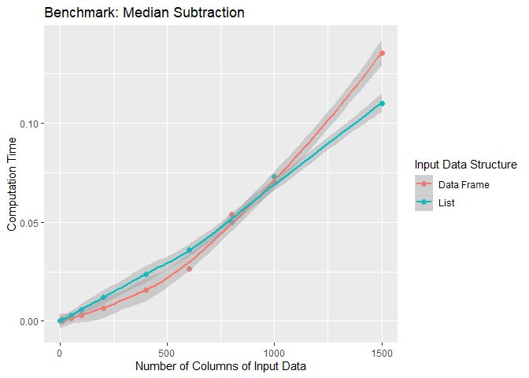

Advanced R 2nd ed
================
true
2020-01-05

복습하는 것이기 때문에 필요한 부분만 정리하였다.

Names and values
================

Binding basics
--------------

[lobstr패키지](https://www.tidyverse.org/blog/2018/12/lobstr/)

``` r
x <- c(1, 2, 3)
y <- x

library(lobstr) 
obj_addr(x) 
```

    ## [1] "0x14b6edd0"

``` r
obj_addr(y)
```

    ## [1] "0x14b6edd0"

이러한 객체 식별자들은 R을 재시작할 때 마다 변경된다.

차후에 함수형 프로그래밍을 공부하는 데에 있어 도움이 되니 이름과 값에 구별에 대해 공부해 보자.

### Non-syntactic names

R은 알맞는 이름을 구성하는 데에 있어 엄격한 규칙을 가지고 있다. 하나의 문법적 이름은 반드시 문자, 숫자, `.` 그리고 `_`로 구성되어 있다. 하지만 문법적 이름은 `_`나 숫자로는 시작할 수 없다. 게다가 `TRUE`, `NULL`, `if`, 그리고 `function`같은 예약어를 사용할 수도 없다.

``` r
_abd <- 1
```

    ## Error: <text>:1:1: 예상하지 못한 입력입니다.
    ## 1: _
    ##     ^

``` r
if <- 10
```

    ## Error: <text>:1:4: 예상하지 못한 할당(assignment)입니다.
    ## 1: if <-
    ##        ^

이러한 이름들에 backtick을 사용하면 객체 할당이 가능은 하다.

``` r
`_abc` <- 1
print(`_abc`)
```

    ## [1] 1

``` r
`if` <- 10
print(`if`)
```

    ## [1] 10

### Exercises

1.  

``` r
obj_addr(mean)
```

    ## [1] "0xf57b3c0"

``` r
obj_addr(base::mean)
```

    ## [1] "0xf57b3c0"

``` r
obj_addr(get("mean")) # get은 객체 이름 탐색 
```

    ## [1] "0xf57b3c0"

``` r
obj_addr(evalq(mean)) # 표현식 평가
```

    ## [1] "0xf57b3c0"

``` r
obj_addr(match.fun("mean"))
```

    ## [1] "0xf57b3c0"

-   `get()`은 객체 이름 탐색
-   `evalq()`은 `eval(quote(expr))`과 동일

Copy-on-modify
--------------

같은 객체를 참조하는 변수들중 하나가 변경되면 그 변경된 객체는 새로운 변경된 객체로 생성되는 것을 말함.

`untracemem()`은 `tracemem()`의 반대. tracing을 꺼주는 역할

``` r
f <- function(a) {
  a
}

x <- c(1, 2, 3)
cat(tracemem(x), "\n")
```

    ## <0000000014A08D68>

``` r
#> <0xa249438>

z <- f(x)
# there's no copy here!

untracemem(x)
```

``` r
obj_addrs(list(x, z))
```

    ## [1] "0x14a08d68" "0x14a08d68"

같은 객체이다.

list, df, 문자형 벡터 모두 같은 방식으로 동작한다.

Object size
-----------

``` r
x <- runif(1e6)
obj_size(x)
```

    ## 8,000,048 B

``` r
y <- list(x, x, x)
obj_size(y)
```

    ## 8,000,128 B

y는 x보다 80바이트만 더 크다. 이것은 세 가지 성분을 가진 빈 리스트의 크기이다.

``` r
obj_size(list(NULL, NULL, NULL))
```

    ## 80 B

마찬가지로 문자열도 생각보다 메모리 소모가 적다.

``` r
banana <- "bananas bananas bananas"
obj_size(banana)
```

    ## 136 B

``` r
obj_size(rep(banana, 100))
```

    ## 928 B

x와 y를 조합해도 y와 같은 크기이다.

``` r
obj_size(x, y)
```

    ## 8,000,128 B

`:`를 사용하여 벡터를 만들면 모든 숫자를 저장하지 않는다. 첫 숫자와 마지막 숫자만 저장한다.

``` r
obj_size(1:3)
```

    ## 680 B

``` r
obj_size(1:1e3)
```

    ## 680 B

``` r
obj_size(1:1e6)
```

    ## 680 B

``` r
obj_size(1:1e9)
```

    ## 680 B

Modify-in-place
---------------

-   single 바인딩을 가지는 객체는 특별한 퍼포먼스 최적화를 가진다.
-   객체의 특별한 타입인 환경은 항상 그 자리에서 수정된다.

### Objects with a single binding

``` r
x <- data.frame(matrix(runif(5 * 1e4), ncol = 5))
medians <- vapply(x, median, numeric(1))

for (i in seq_along(medians)) {
  x[[i]] <- x[[i]] - medians[[i]]
}
```

``` r
cat(tracemem(x), "\n")
```

    ## <0000000014BFC158>

``` r
#> <0x7f80c429e020> 

for (i in 1:5) {
  x[[i]] <- x[[i]] - medians[[i]]
}
```

    ## tracemem[0x0000000014bfc158 -> 0x0000000014c8aa80]: eval eval withVisible withCallingHandlers handle timing_fn evaluate_call <Anonymous> evaluate in_dir block_exec call_block process_group.block process_group withCallingHandlers process_file <Anonymous> <Anonymous> 
    ## tracemem[0x0000000014c8aa80 -> 0x0000000014c8aa10]: [[<-.data.frame [[<- eval eval withVisible withCallingHandlers handle timing_fn evaluate_call <Anonymous> evaluate in_dir block_exec call_block process_group.block process_group withCallingHandlers process_file <Anonymous> <Anonymous> 
    ## tracemem[0x0000000014c8aa10 -> 0x0000000014c8a9a0]: [[<-.data.frame [[<- eval eval withVisible withCallingHandlers handle timing_fn evaluate_call <Anonymous> evaluate in_dir block_exec call_block process_group.block process_group withCallingHandlers process_file <Anonymous> <Anonymous> 
    ## tracemem[0x0000000014c8a9a0 -> 0x0000000014c8a930]: eval eval withVisible withCallingHandlers handle timing_fn evaluate_call <Anonymous> evaluate in_dir block_exec call_block process_group.block process_group withCallingHandlers process_file <Anonymous> <Anonymous> 
    ## tracemem[0x0000000014c8a930 -> 0x0000000014c8a8c0]: [[<-.data.frame [[<- eval eval withVisible withCallingHandlers handle timing_fn evaluate_call <Anonymous> evaluate in_dir block_exec call_block process_group.block process_group withCallingHandlers process_file <Anonymous> <Anonymous> 
    ## tracemem[0x0000000014c8a8c0 -> 0x0000000014c8a7e0]: [[<-.data.frame [[<- eval eval withVisible withCallingHandlers handle timing_fn evaluate_call <Anonymous> evaluate in_dir block_exec call_block process_group.block process_group withCallingHandlers process_file <Anonymous> <Anonymous> 
    ## tracemem[0x0000000014c8a7e0 -> 0x0000000014c8a700]: eval eval withVisible withCallingHandlers handle timing_fn evaluate_call <Anonymous> evaluate in_dir block_exec call_block process_group.block process_group withCallingHandlers process_file <Anonymous> <Anonymous> 
    ## tracemem[0x0000000014c8a700 -> 0x0000000014c8a620]: [[<-.data.frame [[<- eval eval withVisible withCallingHandlers handle timing_fn evaluate_call <Anonymous> evaluate in_dir block_exec call_block process_group.block process_group withCallingHandlers process_file <Anonymous> <Anonymous> 
    ## tracemem[0x0000000014c8a620 -> 0x0000000014c8a540]: [[<-.data.frame [[<- eval eval withVisible withCallingHandlers handle timing_fn evaluate_call <Anonymous> evaluate in_dir block_exec call_block process_group.block process_group withCallingHandlers process_file <Anonymous> <Anonymous> 
    ## tracemem[0x0000000014c8a540 -> 0x0000000014c8a4d0]: eval eval withVisible withCallingHandlers handle timing_fn evaluate_call <Anonymous> evaluate in_dir block_exec call_block process_group.block process_group withCallingHandlers process_file <Anonymous> <Anonymous> 
    ## tracemem[0x0000000014c8a4d0 -> 0x0000000014c8a460]: [[<-.data.frame [[<- eval eval withVisible withCallingHandlers handle timing_fn evaluate_call <Anonymous> evaluate in_dir block_exec call_block process_group.block process_group withCallingHandlers process_file <Anonymous> <Anonymous> 
    ## tracemem[0x0000000014c8a460 -> 0x0000000014c8a3f0]: [[<-.data.frame [[<- eval eval withVisible withCallingHandlers handle timing_fn evaluate_call <Anonymous> evaluate in_dir block_exec call_block process_group.block process_group withCallingHandlers process_file <Anonymous> <Anonymous> 
    ## tracemem[0x0000000014c8a3f0 -> 0x0000000014c8a380]: eval eval withVisible withCallingHandlers handle timing_fn evaluate_call <Anonymous> evaluate in_dir block_exec call_block process_group.block process_group withCallingHandlers process_file <Anonymous> <Anonymous> 
    ## tracemem[0x0000000014c8a380 -> 0x0000000014c8a310]: [[<-.data.frame [[<- eval eval withVisible withCallingHandlers handle timing_fn evaluate_call <Anonymous> evaluate in_dir block_exec call_block process_group.block process_group withCallingHandlers process_file <Anonymous> <Anonymous> 
    ## tracemem[0x0000000014c8a310 -> 0x0000000014c8a2a0]: [[<-.data.frame [[<- eval eval withVisible withCallingHandlers handle timing_fn evaluate_call <Anonymous> evaluate in_dir block_exec call_block process_group.block process_group withCallingHandlers process_file <Anonymous> <Anonymous>

루프의 각 반복마다 데이터프레임을 복사하기 때문에 아주 느리다.

데이터 프레임 대신 list를 사용함으로써 복사 횟수를 줄일 수 있다. 리스트를 수정하는 것은 내부의 C 코드를 사용하므로 참조는 증가되지 않고 단 하나의 복사만 이루어진다.

``` r
y <- as.list(x)
```

    ## tracemem[0x0000000014c8a2a0 -> 0x00000000102c3588]: as.list.data.frame as.list eval eval withVisible withCallingHandlers handle timing_fn evaluate_call <Anonymous> evaluate in_dir block_exec call_block process_group.block process_group withCallingHandlers process_file <Anonymous> <Anonymous>

``` r
cat(tracemem(y), "\n")
```

    ## <00000000102C3588>

``` r
for (i in 1:5) {
  y[[i]] <- y[[i]] - medians[[i]]
}
```

    ## tracemem[0x00000000102c3588 -> 0x0000000014ba5128]: eval eval withVisible withCallingHandlers handle timing_fn evaluate_call <Anonymous> evaluate in_dir block_exec call_block process_group.block process_group withCallingHandlers process_file <Anonymous> <Anonymous>

### Environments

``` r
e1 <- rlang::env(a = 1, b = 2, c = 3)
e2 <- e1
```

``` r
e1$c <- 4
e2$c
```

    ## [1] 4

R6 OOP 시스템에서 이러한 속성이 사용된다.

### Exercises

중앙값을 빼는 두 함수에 대해 열의 수가 증가할수록 퍼포먼스는 어떻게 변화하는가?

``` r
create_random_df <- function(nrow, ncol) {
  random_matrix <- matrix(runif(nrow * ncol), nrow = nrow)
  as.data.frame(random_matrix)
}

subtract_medians <- function(x, medians){
  for (i in seq_along(medians)) {
    x[[i]] <- x[[i]] - medians[[i]]
  }
  x
}

subtract_medians_l <- function(x, medians){
  x <- as.list(x)
  x <- subtract_medians(x, medians)
  as.data.frame(x)
}
```

``` r
compare_speed <- function(ncol){
  df_input   <- create_random_df(nrow = 1e4, ncol = ncol)
  medians <- vapply(df_input, median, numeric(1))

  bench::mark(`Data Frame` = subtract_medians(df_input,   medians),
              List = as.data.frame(subtract_medians(as.list(df_input), medians)))
}
```

``` r
results <- bench::press(
  ncol = c(1, 5, 10, 50, 100, 200, 400, 600, 800, 1000, 1500),
  compare_speed(ncol)
)
```

    ## Running with:
    ##     ncol

    ##  1     1

    ##  2     5

    ##  3    10

    ##  4    50

    ##  5   100

    ##  6   200

    ##  7   400

    ##  8   600

    ##  9   800

    ## 10  1000

    ## 11  1500

``` r
library(ggplot2)
ggplot(results, aes(ncol, median, color = names(expression))) +
  geom_point(size = 2) + 
  geom_smooth() +
  labs(x = "Number of Columns of Input Data", y = "Computation Time",
       color = "Input Data Structure",
       title = "Benchmark: Median Subtraction")
```

    ## `geom_smooth()` using method = 'loess' and formula 'y ~ x'



Unbinding and the garbage collector
-----------------------------------

Vectors
=======

모든 벡터에는 속성이 있다. dimension이라는 속성은 벡터를 행렬로 변환시키고 class라는 속성은 S3 객체 시스템에 권한을 부여한다.

Atomic vectors
--------------

복습이므로 필요한 부분만 공부

### Missing Values

``` r
NA > 5
```

    ## [1] NA

``` r
10 * NA
```

    ## [1] NA

``` r
!NA
```

    ## [1] NA

``` r
NA^0
```

    ## [1] 1

``` r
NA | TRUE
```

    ## [1] TRUE

``` r
NA & FALSE
```

    ## [1] FALSE

``` r
x <- c(NA, 5, NA, 10)
x == NA
```

    ## [1] NA NA NA NA

`NA` (logical), `NA_integer_` (integer), `NA_real_` (double), and `NA_character_`로 구분할 수 있지만 자동으로 변환시키므로 중요하지는 않다.

Atrributes
----------

``` r
a <- 1:3
attr(a, "x") <- "abcdef"
attr(a, "x")
```

    ## [1] "abcdef"

``` r
attr(a, "y") <- 4:6
str(attributes(a))
```

    ## List of 2
    ##  $ x: chr "abcdef"
    ##  $ y: int [1:3] 4 5 6

``` r
a <- structure(
  1:3, 
  x = "abcdef",
  y = 4:6
)
str(attributes(a))
```

    ## List of 2
    ##  $ x: chr "abcdef"
    ##  $ y: int [1:3] 4 5 6

### Dimensions

``` r
# Two scalar arguments specify row and column sizes
a <- matrix(1:6, nrow = 2, ncol = 3)

# One vector argument to describe all dimensions
b <- array(1:12, c(2, 3, 2))

# You can also modify an object in place by setting dim()
c <- 1:6
dim(c) <- c(3, 2)
c
```

    ##      [,1] [,2]
    ## [1,]    1    4
    ## [2,]    2    5
    ## [3,]    3    6

S3 atomic vectors
-----------------

### Factors

factor는 integer vector에 class가 factor이고 level이 정해져있다.

``` r
sex_char <- c("m", "m", "m")
sex_factor <- factor(sex_char, levels = c("m", "f"))

table(sex_char)
```

    ## sex_char
    ## m 
    ## 3

``` r
table(sex_factor)
```

    ## sex_factor
    ## m f 
    ## 3 0

### Dates

``` r
today <- Sys.Date()

typeof(today)
```

    ## [1] "double"

``` r
attributes(today)
```

    ## $class
    ## [1] "Date"

Date-times와 durations는 생략

Lists
-----

``` r
l <- list(1:3, "a", TRUE, 1.0)
dim(l) <- c(2, 2)

l
```

    ##      [,1]      [,2]
    ## [1,] Integer,3 TRUE
    ## [2,] "a"       1

객체를 격자형태의 구조로 배열하고자 할 때 이러한 데이터 구조는 유용하다.

Data Frames and tibbles
-----------------------

``` r
df1 <- data.frame(x = 1:3, y = letters[1:3])
typeof(df1)
```

    ## [1] "list"

``` r
attributes(df1)
```

    ## $names
    ## [1] "x" "y"
    ## 
    ## $class
    ## [1] "data.frame"
    ## 
    ## $row.names
    ## [1] 1 2 3

``` r
library(tibble)

df2 <- tibble(x = 1:3, y = letters[1:3])
typeof(df2)
```

    ## [1] "list"

``` r
attributes(df2)
```

    ## $names
    ## [1] "x" "y"
    ## 
    ## $row.names
    ## [1] 1 2 3
    ## 
    ## $class
    ## [1] "tbl_df"     "tbl"        "data.frame"

입력하는 값의 길이가 다를 때 데이터프레임은 자동적으로 반복시키지만 tibble은 길이가 1일 때만 반복시킨다.

``` r
data.frame(x = 1:4, y = 1:2)
```

    ##   x y
    ## 1 1 1
    ## 2 2 2
    ## 3 3 1
    ## 4 4 2

``` r
data.frame(x = 1:4, y = 1:3)
```

    ## Error in data.frame(x = 1:4, y = 1:3): arguments imply differing number of rows: 4, 3

``` r
tibble(x = 1:4, y = 1)
```

    ## # A tibble: 4 x 2
    ##       x     y
    ##   <int> <dbl>
    ## 1     1     1
    ## 2     2     1
    ## 3     3     1
    ## 4     4     1

``` r
tibble(x = 1:4, y = 1:2)
```

    ## Error: Tibble columns must have consistent lengths, only values of length one are recycled:
    ## * Length 2: Column `y`
    ## * Length 4: Column `x`

`tibble()`은 앞 변수를 참조할 수 있다.

``` r
tibble(
  x = 1:3,
  y = x * 2
)
```

    ## # A tibble: 3 x 2
    ##       x     y
    ##   <int> <dbl>
    ## 1     1     2
    ## 2     2     4
    ## 3     3     6

### Row names

tibble은 rownames를 사용하지 않는다. 대신에 rownames라는 인자를 제공

``` r
df3 <- data.frame(
  age = c(35, 27, 18),
  hair = c("blond", "brown", "black"),
  row.names = c("Bob", "Susan", "Sam")
)

as_tibble(df3, rownames = "name")
```

    ## # A tibble: 3 x 3
    ##   name    age hair 
    ##   <chr> <dbl> <fct>
    ## 1 Bob      35 blond
    ## 2 Susan    27 brown
    ## 3 Sam      18 black

### List columns

``` r
df <- data.frame(x = 1:3)
df$y <- list(1:2, 1:3, 1:4)

data.frame(
  x = 1:3, 
  y = I(list(1:2, 1:3, 1:4))
)
```

    ##   x          y
    ## 1 1       1, 2
    ## 2 2    1, 2, 3
    ## 3 3 1, 2, 3, 4

``` r
tibble(
  x = 1:3, 
  y = list(1:2, 1:3, 1:4)
)
```

    ## # A tibble: 3 x 2
    ##       x y        
    ##   <int> <list>   
    ## 1     1 <int [2]>
    ## 2     2 <int [3]>
    ## 3     3 <int [4]>

NULL
----

``` r
typeof(NULL)
```

    ## [1] "NULL"

``` r
length(NULL)
```

    ## [1] 0

``` r
x <- NULL
attr(x, "y") <- 1
```

    ## Error in attr(x, "y") <- 1: NULL 객체에 속성부여를 시도했습니다

NULL은 어떠한 속성도 가지지 않는다.

`NULL`의 사용법

-   임의의 타입의 빅 벤터를 표현하기 위함이다.

``` r
c()
```

    ## NULL

-   벡터의 부재를 표현한다. `NULL`은 함수 인자의 디폴트로 이용되고 인자가 선택적일대 디폴트 값은 몇 가지 계산을 요구한다. DB의 NULL은 R의 NA와 동일하다.

Subsetting
==========

Selecting multiple elements
---------------------------

### Atomic vectors

``` r
x <- c(2.1, 4.2, 3.3, 5.4)
```

-   양의 정수

``` r
x[c(3, 1)]
```

    ## [1] 3.3 2.1

``` r
x[order(x)]
```

    ## [1] 2.1 3.3 4.2 5.4

``` r
x[c(1, 1)]
```

    ## [1] 2.1 2.1

``` r
x[c(2.1, 2.9)]
```

    ## [1] 4.2 4.2

-   음의 정수는 성분을 제외

``` r
x[-c(3, 1)]
```

    ## [1] 4.2 5.4

``` r
# 양음을 섞을 순 없다
x[-c(-1, 2)]
```

    ## Error in x[-c(-1, 2)]: only 0's may be mixed with negative subscripts

-   논릿값

``` r
x[c(TRUE, TRUE, FALSE, FALSE)]
```

    ## [1] 2.1 4.2

``` r
x[x > 3]
```

    ## [1] 4.2 3.3 5.4

결측치 인덱스는 항상 결측치를 반환함을 기억하자.

``` r
x[c(TRUE, TRUE, NA, FALSE)]
```

    ## [1] 2.1 4.2  NA

-   `[]`는 원래의 벡터를 반환. 행렬, 데이터프레임, 배열에서 유용

``` r
x[]
```

    ## [1] 2.1 4.2 3.3 5.4

-   `0`은 0길이의 벡터를 반환. 보통 고의로 만들지는 않지만, 테스트 데이터를 생성하는데 도움이 된다.

``` r
x[0]
```

    ## numeric(0)

-   벡터에 이름이 있다면 문자형 벡터를 사용해서 슬라이싱 가능

``` r
y <- setNames(x, letters[1:4])
y[c("d", "c", "a")]
```

    ##   d   c   a 
    ## 5.4 3.3 2.1

``` r
y[c("a", "a", "a")]
```

    ##   a   a   a 
    ## 2.1 2.1 2.1

``` r
# When subsetting with [, names are always matched exactly
z <- c(abc = 1, def = 2)
z[c("a", "d")]
```

    ## <NA> <NA> 
    ##   NA   NA

행렬과 배열 둘 다 단순히 특별한 속성을 가진 벡터기 때문에 subset도 1D 벡터처럼 할 수 있다.

``` r
vals <- outer(1:5, 1:5, FUN = "paste", sep = ",")
vals[c(4, 15)]
```

    ## [1] "4,1" "5,3"

정수 행렬 고차원 데이터 구조로 subset을 할 수 있다.

``` r
select <- matrix(ncol = 2, byrow = TRUE, c(
  1, 1,
  3, 1,
  2, 4
))
vals[select]
```

    ## [1] "1,1" "3,1" "2,4"

### Data frames and tibbles

``` r
df <- data.frame(x = 1:3, y = 3:1, z = letters[1:3])

df[df$x == 2, ]
```

    ##   x y z
    ## 2 2 2 b

``` r
df[c(1, 3), ]
```

    ##   x y z
    ## 1 1 3 a
    ## 3 3 1 c

``` r
# There are two ways to select columns from a data frame
# Like a list
df[c("x", "z")]
```

    ##   x z
    ## 1 1 a
    ## 2 2 b
    ## 3 3 c

``` r
# Like a matrix
df[, c("x", "z")]
```

    ##   x z
    ## 1 1 a
    ## 2 2 b
    ## 3 3 c

``` r
# There's an important difference if you select a single 
# column: matrix subsetting simplifies by default, list 
# subsetting does not.
str(df["x"])
```

    ## 'data.frame':    3 obs. of  1 variable:
    ##  $ x: int  1 2 3

``` r
str(df[, "x"])
```

    ##  int [1:3] 1 2 3

tibble에서 `[` subsetting은 항상 tibble을 반환한다.

``` r
df <- tibble::tibble(x = 1:3, y = 3:1, z = letters[1:3])

str(df["x"])
```

    ## Classes 'tbl_df', 'tbl' and 'data.frame':    3 obs. of  1 variable:
    ##  $ x: int  1 2 3

``` r
str(df[, "x"])
```

    ## Classes 'tbl_df', 'tbl' and 'data.frame':    3 obs. of  1 variable:
    ##  $ x: int  1 2 3

Selecting a single element
--------------------------

### \`p\[\[\`\`

list에서는 `[[`를 반드시 사용하자.

재귀적으로 `x[[c(1, 2)]]`는 `x[[1]][[2]]`와 동일하다. 하지만 `purrr::pluck()`를 사용하는 것을 추천한다.

``` r
var <- "cyl"
mtcars$var
```

    ## NULL

``` r
mtcars[[var]]
```

    ##  [1] 6 6 4 6 8 6 8 4 4 6 6 8 8 8 8 8 8 4 4 4 4 8 8 8 8 4 4 4 8 6 8 4

### Missing and out-of-bounds indices

타당하지 않는 인덱스를 사용할 때 `[[`와 함께 일어나는 것을 이해하는 것은 유용하다.


위 테이블의 비일관성때문에 `purrr::pluck()`와 `purrr::chuck()`를 개발하였다. 성분이 missing일 때 `pluck()`는 항상 `NULL`를 반환하고 `chuck()`는 항상 에러를 발생시킨다. `pluck()`의 행동양식은 존재하지 않기를 원하는 성분이 있는 깊게 nested 자료구종에 잘 어울리도록 해준다.(JSON같은) `pluck()`는 또한 정수와 문자 인덱스를 섞을 수 있게 허용해서 항목이 존재하지 않는다면 대체 디폴트 값을 제공한다.

``` r
x <- list(
  a = list(1, 2, 3),
  b = list(3, 4, 5)
)

pluck(x, "a", 1)
```

    ## [1] 1

``` r
pluck(x, "c", 1)
```

    ## NULL

``` r
pluck(x, "c", 1, .default = NA)
```

    ## [1] NA

`purrr::pluck()`을 사용하자.

### `@` and `slot()`

두 가지 추가적인 subsetting 연산이 있고 S4 객체에 필요하다.

Subsetting and assignment
-------------------------

리스트에서 성분을 제거하기 위해 `x[[i]] <- NULL`을 사용할 수 있다.

``` r
mtcars[] <- lapply(mtcars, as.integer)
is.data.frame(mtcars)
```

    ## [1] TRUE

``` r
mtcars <- lapply(mtcars, as.integer)
is.data.frame(mtcars)
```

    ## [1] FALSE

Applications
------------

``` r
df <- data.frame(x = c(1, 2, 3, 1, 2), y = 5:1, z = letters[1:5])

# Randomly reorder
df[sample(nrow(df)), ]
```

    ##   x y z
    ## 4 1 2 d
    ## 3 3 3 c
    ## 1 1 5 a
    ## 2 2 4 b
    ## 5 2 1 e

``` r
# Select 6 bootstrap replicates
df[sample(nrow(df), 6, replace = TRUE), ]
```

    ##     x y z
    ## 4   1 2 d
    ## 2   2 4 b
    ## 4.1 1 2 d
    ## 3   3 3 c
    ## 1   1 5 a
    ## 1.1 1 5 a

Control flow
============

Choices
-------

``` r
if ("x") 1
```

    ## Error in if ("x") 1: argument is not interpretable as logical

``` r
if(logical()) 1
```

    ## Error in if (logical()) 1: 인자의 길이가 0입니다

``` r
if (NA) 1
```

    ## Error in if (NA) 1: TRUE/FALSE가 필요한 곳에 값이 없습니다

논리 벡터의 길이가 1보다 크면 경고가 뜬다

``` r
if (c(TRUE, FALSE)) 1
```

    ## Warning in if (c(TRUE, FALSE)) 1: length > 1 이라는 조건이 있고, 첫번째 요소만이
    ## 사용될 것입니다

    ## [1] 1

R 버전이 3.5이상이면 이러한 경우에 에러를 발생시킬 수 있다.

``` r
Sys.setenv("_R_CHECK_LENGTH_1_CONDITION_" = "true")
if (c(TRUE, FALSE)) 1
```

    ## Error in if (c(TRUE, FALSE)) 1: the condition has length > 1

### Vectorised if

`ifelse()`는 반환되는 두 값의 타입이 동일할 때 사용하자.

``` r
x <- c(1, 2, 3, NA, 4, 5, 6, 7, TRUE)

case_when(
  x %% 35 == 0 ~ "fizz buzz",
  x %% 5 == 0 ~ "fizz",
  x %% 7 == 0 ~ "buzz",
  is.na(x) ~ "???",
  TRUE ~ as.character(x)
)
```

    ## [1] "1"    "2"    "3"    "???"  "4"    "fizz" "6"    "buzz" "1"

### `switch()` statement

``` r
x_option <- function(x) {
  if (x == "a") {
    "option 1"
  } else if (x == "b") {
    "option 2" 
  } else if (x == "c") {
    "option 3"
  } else {
    stop("Invalid `x` value")
  }
}
```

위 코드를 다음과 같이 변형시킬 수 있다.

``` r
x_option <- function(x) {
  switch(x,
    a = "option 1",
    b = "option 2",
    c = "option 3",
    stop("Invalid `x` value")
  )
}
(switch("c", a = 1, b = 2))
```

    ## NULL

``` r
legs <- function(x) {
  switch(x,
    cow = ,
    horse = ,
    dog = 4,
    human = ,
    chicken = 2,
    plant = 0,
    stop("Unknown input")
  )
}
legs("cow")
```

    ## [1] 4

``` r
legs("dog")
```

    ## [1] 4

Loops
-----

``` r
for (i in 1:10) {
  if (i < 3) 
    next

  print(i)
  
  if (i >= 5)
    break
}
```

    ## [1] 3
    ## [1] 4
    ## [1] 5

### Common pitfalls

``` r
means <- c(1, 50, 20)
out <- vector("list", length(means))
for (i in 1:length(means)) {
  out[[i]] <- rnorm(10, means[[i]])
}
```

`1:length(x)`는 x의 길이가 0이라면 문제가 생긴다.

``` r
means <- c()
out <- vector("list", length(means))
for (i in 1:length(means)) {
  out[[i]] <- rnorm(10, means[[i]])
}
```

    ## Error in rnorm(10, means[[i]]): 인자가 올바르지 않습니다.

이것을 방지하기 위해 `seq_along()`을 사용하자.

``` r
seq_along(means)
```

    ## integer(0)

``` r
seq_along(c(1, 50, 20))
```

    ## [1] 1 2 3

``` r
out <- vector("list", length(means))
for (i in seq_along(means)) {
  out[[i]] <- rnorm(10, means[[i]])
}
```

마지막으로, S3 벡터를 반복시킬 때 문제가 생길 있 이다.

``` r
xs <- as.Date(c("2020-01-01", "2010-01-01"))
for (x in xs) {
  print(x)
}
```

    ## [1] 18262
    ## [1] 14610

``` r
for (i in seq_along(xs)) {
  print(xs[[i]])
}
```

    ## [1] "2020-01-01"
    ## [1] "2010-01-01"

Functions
=========

Introduction
------------

### Quiz

1.  How would you usually write this code?

``` r
`+`(1, `*`(2, 3))
```

    ## [1] 7

1.  Does the following code throw an error when executed? Why or why not?

``` r
f2 <- function(a, b) {
  a * 10
}
f2(10, stop("This is an error!"))
```

    ## [1] 100

1.  What is an infix function? How do you write it? What’s a replacement function? How do you write it?

2.  How do you ensure that cleanup action occurs regardless of how a function exits?

Function fundamentals
---------------------

-   함수는 세 가지 요소로 나누어진다: arguments, body, and environment

-   벡터가 객체인것과 마찬가지로 함수도 객체이다.

### Function components

-   `formals()`, 함수를 호출하는 방법을 통제하는 인자 리스트
-   `body()`, 함수 내부의 코드
-   `environment()`, 이름과 연관된 값을 찾는 함수를 결정하는 데이터 구조

``` r
f02 <- function(x, y) {
  x + y
}
formals(f02)
```

    ## $x
    ## 
    ## 
    ## $y

``` r
body(f02)
```

    ## {
    ##     x + y
    ## }

``` r
environment(f02)
```

    ## <environment: R_GlobalEnv>

### Primitive functions

세 가지 성분을 가지는 함수에 한 가지 예외가 있다. C를 직접 호출하는 `sum()` `[`와 같은 원시 함수이다.

``` r
typeof(sum)
```

    ## [1] "builtin"

``` r
typeof(`[`)
```

    ## [1] "special"

이러한 함수들은 주로 C에 존재하므로 다음 호출 값들은 `NULL`이다.

``` r
formals(sum)
```

    ## NULL

``` r
body(sum)
```

    ## NULL

``` r
environment(sum)
```

    ## NULL

원시함수는 base패키지에서만 찾을 수 있다.

### First-class functions

R함수가 객체라는 것을 이해하는 것은 아주 중요하다. 이러한 언어 특성은 "first-class functions"라고 불린다. 다른 많은 언어들과는 달리 함수를 정의하고 이름 붙이는 데에 특별한 문법이 없다: 단순히 함수 객체를 생성하고 `<-`를 사용한다.

### Invoking a function

참고로 함수를 invoking하는 것은 함수가 자동으로 호출될 때를 의미하고 calling하는 것은 프로그램에서 내가 호출하는 것을 의미

보통 함수를 호출 할 때에는 소괄호 속에 인자를 넣고 호출한다. 하지만 만약에 인자가 자료구조 안에 이미 있다면 어떨까?

``` r
args <- list(1:10, na.rm = TRUE)
do.call(mean, args)
```

    ## [1] 5.5

Functions composition
---------------------

`x %>% f()`는 `f(x)`와 동일하고 `x %>% f(y)`는 `f(x, y)`와 동일하다.

Lexical scoping
---------------

쉬우므로 생략

Lazy evaluation
---------------

R에서 함수의 인자는 **laizly evaluated**된다: 접근된다면 평가되어 진다. 예를 들어, 이 코드는 x가 사용되지 않았기 때문에 에러를 발생시키지 않는다.

``` r
h01 <- function(x) {
  10
}
h01(stop("This is an error!"))
```

    ## [1] 10

### Promises

Lazy evaluation은 **promise**라고 불리는 자료구조에 의해 권한을 부여 받았다.

promise는 세 가지 요소를 가진다.

-   표현식(expression)
-   표현식이 연산되어야하는 환경(environment), 즉 함수가 호출 되는 환경.101이 아니라 11이 반환된다.

``` r
y <- 10
h02 <- function(x) {
  y <- 100
  x + 1
}

h02(y)
```

    ## [1] 11

``` r
h02(y <- 1000)
```

    ## [1] 1001

-   값

``` r
double <- function(x) { 
  message("Calculating...")
  x * 2
}

h03 <- function(x) {
  c(x, x)
}

h03(double(20))
```

    ## Calculating...

    ## [1] 40 40

### Default arguments

lazy evaluaion덕분에 디폴값은 다른 인자의 관점에 서 정의될 수 있고 심지어 함수가 정의되고나서 변수의 관점에서 정의될 수도 있다.

``` r
h04 <- function(x = 1, y = x * 2, z = a + b) {
  a <- 10
  b <- 100
  
  c(x, y, z)
}
h04()
```

    ## [1]   1   2 110

evaluation 환경은 디폴트 인자와 사용자가 제공한 인자가 약간 다르다.

``` r
h05 <- function(x = ls()) {
  a <- 1
  x
}

# ls() evaluated inside h05:
h05()
```

    ## [1] "a" "x"

``` r
#> [1] "a" "x"

# ls() evaluated in global environment:
h05(ls())
```

    ##  [1] "_abc"               "a"                  "args"              
    ##  [4] "b"                  "banana"             "c"                 
    ##  [7] "compare_speed"      "create_random_df"   "df"                
    ## [10] "df1"                "df2"                "df3"               
    ## [13] "double"             "e1"                 "e2"                
    ## [16] "f"                  "f02"                "f2"                
    ## [19] "h01"                "h02"                "h03"               
    ## [22] "h04"                "h05"                "i"                 
    ## [25] "if"                 "l"                  "legs"              
    ## [28] "means"              "medians"            "mtcars"            
    ## [31] "out"                "results"            "select"            
    ## [34] "sex_char"           "sex_factor"         "subtract_medians"  
    ## [37] "subtract_medians_l" "today"              "vals"              
    ## [40] "var"                "x"                  "x_option"          
    ## [43] "xs"                 "y"                  "z"

`...`(dot-dot-dot)
------------------

특수한 형태인 `..N`을 사용하면 `...`의 성분 위치를 참조할 수 있다.

``` r
i03 <- function(...) {
  list(first = ..1, third = ..3)
}
str(i03(1, 2, 3))
```

    ## List of 2
    ##  $ first: num 1
    ##  $ third: num 3

좀 더 유용한 것은 `list(...)`이다. 인자를 연산하고 리스트에 저장한다.

``` r
i04 <- function(...){
  list(...)
}
str(i04(a = 1, b = 2))
```

    ## List of 2
    ##  $ a: num 1
    ##  $ b: num 2

`...`은 인자를 타이핑할 때 오타를 치더라도 오류가 발생하지 않으므로 주의하자.

Exiting a function
------------------

``` r
j04 <- function() invisible(1)
j04()
```

``` r
print(j04())
```

    ## [1] 1

``` r
(j04())
```

    ## [1] 1

``` r
str(withVisible(j04()))
```

    ## List of 2
    ##  $ value  : num 1
    ##  $ visible: logi FALSE

### Errors

``` r
j05 <- function() {
  stop("I'm an error")
  return(10)
}
j05()
```

    ## Error in j05(): I'm an error

### Exit handlers

가끔 함수는 전역 상태로의 임시적 변화를 해야할 필요가 있다. 하지만 이러한 변화는 성가시다. 이러한 변화가 행해지고 함수를 어떻게 탈출하든지 간에 전역상태로 복구하는 것을 보장하기 위해 `on.exit()`를 exit handler로서 사용하라. 에러를 발생시키는 것과 관계 없이 함수를 탈출시킨다.

[on.eixt()의 사용](https://stackoverflow.com/questions/28300713/how-and-when-should-i-use-on-exit)

대표적으로 에러를 발생시키더라도 DB 연결이나 파일 연결을 해제하기, 플랏을 파일로 저장시킬 때 그래픽 디바이스가 그 후에 닫기기가 있다.

``` r
j06 <- function(x) {
  cat("Hello\n")
  on.exit(cat("Goodbye!\n"), add = TRUE)
  
  if (x) {
    return(10)
  } else {
    stop("Error")
  }
}

j06(TRUE)
```

    ## Hello
    ## Goodbye!

    ## [1] 10

``` r
j06(FALSE)
```

    ## Hello

    ## Error in j06(FALSE): Error

    ## Goodbye!

`on.exit()`를 사용할 때는 항상 `add = TRUE` 이것을 설정하지 않으면 이전 exit handler를 오버라이팅 한다. 하나의 핸들러를 사용하더라도 이렇게 설정하는 것이 좋은 습관이다.

``` r
cleanup <- function(dir, code) {
  old_dir <- setwd(dir)
  on.exit(setwd(old_dir), add = TRUE)
  
  old_opt <- options(stringsAsFactors = FALSE)
  on.exit(setwd(old_opt), add = TRUE)
}
```

``` r
with_dir <- function(dir, code) {
  old <- setwd(dir)
  on.exit(setwd(old), add = TRUE)
  
  force(code)
}

getwd()
```

    ## [1] "C:/Users/user123/Desktop/programming/R/Advanced R"

``` r
with_dir("~", getwd())
```

    ## [1] "C:/Users/user123/Documents"

`force()`의 이용은 여기서 엄격하게 필요하지는 않다. `code`를 간단히 참조하는 것이 연산을 강요하기 때문이다. 하지만, 의도적으로 실행을 강요한다고 명시할 수 있다.

최근에 쓰여진 표현식을 먼저 실행시키고 싶다면 `after = FALSE`로 설정하자.

``` r
j09 <- function() {
  on.exit(message("a"), add = TRUE, after = FALSE)
  on.exit(message("b"), add = TRUE, after = FALSE)
}
j09()
```

    ## b

    ## a

Function forms
--------------

-   prefix: `foofy(a, b, c)`에서 인자 앞부분. 대부분의 R함수 호출
-   infix: `x + y`에서 인자 사이 부분. 사용자 정의 함수는 `%something%`로 적는다
-   replacement: `names(df) <- c("a", "b", "c")` 할당에 의해 값이 대체되는 함수
-   special: `[[`, `if`, `for`과 같은 함수.

### Rewriting to prefix form

모든 infix, replacement, special form은 prefix형태로 다시 쓸 수 있다.

``` r
x + y
`+`(x, y)

names(df) <- c("x", "y", "z")
`names<-`(df, c("x", "y", "z"))

for(i in 1:10) print(i)
`for`(i, 1:10, print(i))
```

``` r
add <- function(x, y) x + y
lapply(list(1:3, 4:5), add, 3)
```

    ## [[1]]
    ## [1] 4 5 6
    ## 
    ## [[2]]
    ## [1] 7 8

위 코드를 아래와 같이 단순화 시킬 수 있다.

``` r
lapply(list(1:3, 4:5), `+`, 3)
```

    ## [[1]]
    ## [1] 4 5 6
    ## 
    ## [[2]]
    ## [1] 7 8

### Prefix form

생략

### Infix functions

``` r
`%-%` <- function(a, b) paste0("(", a, " %-% ", b, ")")
"a" %-% "b" %-% "c"
```

    ## [1] "((a %-% b) %-% c)"

### Replacement functions

``` r
x <- 1:10

`modify<-` <- function(x, position, value) {
  x[position] <- value
  x
}
modify(x, 1) <- 10
x
```

    ##  [1] 10  2  3  4  5  6  7  8  9 10

Environment
===========

``` r
library(rlang)
```

    ## 
    ## Attaching package: 'rlang'

    ## The following objects are masked from 'package:purrr':
    ## 
    ##     %@%, as_function, flatten, flatten_chr, flatten_dbl, flatten_int,
    ##     flatten_lgl, flatten_raw, invoke, list_along, modify, prepend,
    ##     splice

rlang의 `env_`함수들은 파이프와 함께 작업하도록 설계되었다. 모든 함수들은 첫 번째 인자로서 환경을 취하고 많은 것들은 환경을 반환한다.

Environment basics
------------------

환경은 이름 있는 리스트와 비슷하다. 단, 네 가지 중요한 예외있 있다.

-   모든 이름은 반드시 유일하다.
-   환경의 이름은 정렬되어 있지 않다.
-   환경은 부모를 가진다.
-   환경은 수정될 때 복사되지 않는다.

### Basics

``` r
e1 <- env(
  a = FALSE, 
  b = "a",
  c = 2.3,
  d = 1:3,
)
```

환경을 수정하더라도 제자리에서 수정되고 복사본을 만들지 않는다. 한 가지 중요한 의미는 환경은 환경 자신을 포함할 수 있다는 점이다.

``` r
e1$d <- e1
```

``` r
e1 
```

    ## <environment: 0x000000001bf248c8>

환경을 단순히 출력하는 것은 단지 메모리 주소를 보여줄 뿐이다.

``` r
env_print(e1)
```

    ## <environment: 000000001BF248C8>
    ## parent: <environment: global>
    ## bindings:
    ##  * a: <lgl>
    ##  * b: <chr>
    ##  * c: <dbl>
    ##  * d: <env>

``` r
env_names(e1)
```

    ## [1] "a" "b" "c" "d"

### Important environments

`current_env()`는 코드가 현재 실행되고 있는 환경이다. 전역 환경 `global_env()`는 모든 인터렉티브한 연산이 일어나는 곳이므로 workspace라고도 불리기도 한다.

환경은 벡터가 아니기 때문에 벡터화된 연산인 `==`가 아니라 `identical()`를 사용해야 한다.

``` r
identical(global_env(), current_env())
```

    ## [1] TRUE

``` r
global_env() == current_env()
```

    ## Error in global_env() == current_env(): atomic과 리스트 타입들에 대해서만 비교(1)가 가능합니다

### Parents

모든 환경은 다른 환경인 부모를 가진다. 부모 환경을 인자의 이름을 붙이지 않는 `env()`를 제공함으로써 설정할 수 있다. 제공하지 않는다면 현재 환경을 디폴트로 정한다.

``` r
e2a <- env(d = 4, e = 5)
e2b <- env(e2a, a = 1, b = 2, c = 3)
```

``` r
env_parent(e2b)
```

    ## <environment: 0x0000000012f06a10>

``` r
env_print(e2b)
```

    ## <environment: 0000000012EA0348>
    ## parent: <environment: 0000000012F06A10>
    ## bindings:
    ##  * a: <dbl>
    ##  * b: <dbl>
    ##  * c: <dbl>

``` r
env_parent(e2a)
```

    ## <environment: R_GlobalEnv>

empty 환경은 부모를 가지지 않는다.

``` r
e2c <- env(empty_env(), d = 4, e = 5)
e2d <- env(e2c, a = 1, b = 2, c = 3)
```

``` r
env_parents(e2b)
```

    ## [[1]]   <env: 0000000012F06A10>
    ## [[2]] $ <env: global>

``` r
env_parents(e2d)
```

    ## [[1]]   <env: 00000000120F6028>
    ## [[2]] $ <env: empty>

`env_parents()`는 전역 환경에 도달할 때 멈춘다. 전역 환경의 부모는 모든 첨부된 라이브러리들이기 때문에 유용하다.

``` r
env_parents(e2b, last = empty_env())
```

    ##  [[1]]   <env: 0000000012F06A10>
    ##  [[2]] $ <env: global>
    ##  [[3]] $ <env: package:rlang>
    ##  [[4]] $ <env: package:lobstr>
    ##  [[5]] $ <env: package:forcats>
    ##  [[6]] $ <env: package:stringr>
    ##  [[7]] $ <env: package:dplyr>
    ##  [[8]] $ <env: package:purrr>
    ##  [[9]] $ <env: package:readr>
    ## [[10]] $ <env: package:tidyr>
    ## [[11]] $ <env: package:tibble>
    ## [[12]] $ <env: package:ggplot2>
    ## [[13]] $ <env: package:tidyverse>
    ## [[14]] $ <env: package:stats>
    ## [[15]] $ <env: package:graphics>
    ## [[16]] $ <env: package:grDevices>
    ## [[17]] $ <env: package:utils>
    ## [[18]] $ <env: package:datasets>
    ## [[19]] $ <env: package:methods>
    ## [[20]] $ <env: Autoloads>
    ## ... and 2 more environments

### Super assignment, `<<-`

`<-`는 항상 현재 환경에서 변수를 생성하고 `<<-`는 부모 환경에서 생성한다.

``` r
x <- 0
f <- function() {
  x <<- 1
}
f()
x
```

    ## [1] 1

### Getting and setting

list와 같은 방식으로 `$`와 `[[`를 사용하여 환경의 성분을 가져오거나 설정할 있다.

``` r
e3 <- env(x = 1, y = 2)
e3$x
```

    ## [1] 1

``` r
e3$z <- 3
e3[["z"]]
```

    ## [1] 3

하지만 `[[`를 수치 인덱스와 함께 사용할 수는 없으며, `[`를 사용할 수도 없다.

``` r
e3[[1]]
```

    ## Error in e3[[1]]: wrong arguments for subsetting an environment

``` r
e3[c("x", "y")]
```

    ## Error in e3[c("x", "y")]: 객체의 타입 'environment'는 부분대입할 수 없습니다

`$`와 `[[`는 존재하지 않으면 `NULL`를 반환한다. 에러를 원한다면 `env_get()`를 사용하라.

``` r
e3$xyz
```

    ## NULL

``` r
env_get(e3, "xyz")
```

    ## Error in env_get(e3, "xyz"): 객체 'xyz'를 찾을 수 없습니다

환경에 바인딩 추가

``` r
env_poke(e3, "a", 100)
e3$a
```

    ## [1] 100

``` r
env_bind(e3, a = 10, b = 20)
env_names(e3)
```

    ## [1] "x" "y" "z" "a" "b"

``` r
env_has(e3, "a")
```

    ##    a 
    ## TRUE

리스트와 달리 `NULL`로 성분을 제거할 수 없다.대대신에 `env_unbind()`를 사용하라.

``` r
e3$a <- NULL
env_has(e3, "a")
```

    ##    a 
    ## TRUE

``` r
env_unbind(e3, "a")
env_has(e3, "a")
```

    ##     a 
    ## FALSE

### Advaned bindings

생략

Recursing over enviornments
---------------------------

재귀함수를 쓸 때 유용

생략

Special environments
--------------------

### Package environments and the search path


``` r
search_envs()
```

    ##  [[1]] $ <env: global>
    ##  [[2]] $ <env: package:rlang>
    ##  [[3]] $ <env: package:lobstr>
    ##  [[4]] $ <env: package:forcats>
    ##  [[5]] $ <env: package:stringr>
    ##  [[6]] $ <env: package:dplyr>
    ##  [[7]] $ <env: package:purrr>
    ##  [[8]] $ <env: package:readr>
    ##  [[9]] $ <env: package:tidyr>
    ## [[10]] $ <env: package:tibble>
    ## [[11]] $ <env: package:ggplot2>
    ## [[12]] $ <env: package:tidyverse>
    ## [[13]] $ <env: package:stats>
    ## [[14]] $ <env: package:graphics>
    ## [[15]] $ <env: package:grDevices>
    ## [[16]] $ <env: package:utils>
    ## [[17]] $ <env: package:datasets>
    ## [[18]] $ <env: package:methods>
    ## [[19]] $ <env: Autoloads>
    ## [[20]] $ <env: package:base>

### The function environment

``` r
y <- 1
f <- function(x) x + y
fn_env(f)
```

    ## <environment: R_GlobalEnv>

``` r
e <- env()
e$g <- function() 1
```

### Namespaces

생략

### Execution environments

``` r
g <- function(x) {
  if (!env_has(current_env(), "a")) {
    message("Defining a")
    a <- 1
  }
  else {
    a <- a + 1
  }
  a
}
```

``` r
g(10)
```

    ## Defining a

    ## [1] 1

``` r
g(10)
```

    ## Defining a

    ## [1] 1

함수가 호출될 때 마다 새로 환경이 생성된다. 이것을 실행 환경이라 부르고 부모는 함수의 환경이다.

``` r
h <- function(x) {
  # 1.
  a <- 2 # 2.
  x + a
}
y <- h(1) # 3.
y
```

    ## [1] 3

``` r
h2 <- function(x) {
  a <- x * 2
  current_env()
}

e <- h2(x = 10)
env_print(e)
```

    ## <environment: 00000000139BEC58>
    ## parent: <environment: global>
    ## bindings:
    ##  * a: <dbl>
    ##  * x: <dbl>

``` r
fn_env(h2)
```

    ## <environment: R_GlobalEnv>

Call stacks
-----------

As data structures
------------------

Conditions
==========

``` r
library(rlang)
```

Custom conditions
-----------------

``` r
abort(
  "error_not_found",
  message = "Path `blah.csv` not found", 
  path = "blah.csv"
)
```

    ## Error: Path `blah.csv` not found

### Motivation

``` r
log(letters)
```

    ## Error in log(letters): 수학함수에 숫자가 아닌 인자가 전달되었습니다

``` r
log(1:10, base = letters)
```

    ## Error in log(1:10, base = letters): 수학함수에 숫자가 아닌 인자가 전달되었습니다

어떤 인자가 문제인지 명시하는 것이 좋을 것 같다.

``` r
my_log <- function(x, base = exp(1)) {
  if (!is.numeric(x)) {
    abort(paste0(
      "`x` must be a numeric vector; not ", typeof(x), "."
    ))
  }
  if (!is.numeric(base)) {
    abort(paste0(
      "`base` must be a numeric vector; not ", typeof(base), "."
    ))
  }

  base::log(x, base = base)
}
```

``` r
my_log(letters)
```

    ## Error: `x` must be a numeric vector; not character.

``` r
my_log(1:10, base = letters)
```

    ## Error: `base` must be a numeric vector; not character.

### Signalling

들어가기 전에 `glue::glue()`에 대해 알아보자. 파이썬의 f-string을 떠올리자.

``` r
name <- "Fred"
age <- 50
anniversary <- as.Date("1991-10-12")
glue::glue('My name is {name},',
  'my age next year is {age + 1},',
  'my anniversary is {format(anniversary, "%A, %B %d, %Y")}.')
```

    ## My name is Fred,my age next year is 51,my anniversary is 토요일, 10월 12, 1991.

``` r
abort_bad_argument <- function(arg, must, not = NULL) {
  msg <- glue::glue("`{arg}` must {must}")
  if (!is.null(not)) {
    not <- typeof(not)
    msg <- glue::glue("{msg}; not {not}.")
  }
  
  abort("error_bad_argument",
        message = msg,
        arg = arg,
        must = must,
        not = not
        )
}
```

`my_log()`를 다시 쓸 수 있다.

``` r
my_log <- function(x, base = exp(1)) {
  if (!is.numeric(x)) {
    abort_bad_argument("x", must = "be numeric", not = x)
  }
  if (!is.numeric(base)) {
    abort_bad_argument("base", must = "be numeric", not = base)
  }
  
  base::log(x, base = base)
}
```

``` r
my_log(letters)
```

    ## Error: `x` must be numeric; not character.

``` r
my_log(1:10, base = letters)
```

    ## Error: `base` must be numeric; not character.

### Handling

Applications
------------

### Failure value

``` r
fail_with <- function(expr, value = NULL) {
  tryCatch(
    error = function(cnd) value,
    expr
  )
}

fail_with(log(10), NA_real_)
```

    ## [1] 2.302585

``` r
fail_with(log("x"), NA_real_)
```

    ## [1] NA

나머지 부분은 좀 더 R을 깊게 공부해야할 때 공부하도록 하자.
