Advanced R 2nd ed
================
true
2020-01-10

정말 중요한 부분인 함수형 프로그래밍 파트이다.

Functionals
===========

**functional**은 함수를 인풋으로서 취할 수 있고 아웃풋으로서 벡터를 반환하는 함수이다.

``` r
randomise <- function(f) f(runif(1e3))
randomise(mean)
```

    ## [1] 0.4978914

``` r
randomise(sum)
```

    ## [1] 514.0861

`lapply()`, `map()`, `integrate()`, `optim()`모두 functional이다.

R에서 사람들은 for loop가 느리다고 오해하는 경향이 있지만 실제 for loop의 단점은 너무 유연하다는 것이다: 루프는 반복하는 것을 전달하지만 결과로 행해지는 것을 전달하지 않는다. `while`를 사용하는 것이 `repeat`를 사용하는 것 보다 낫고 `for`를 사요하는 것이 `while`를 사용하는 것 보다 나은 것 처럼 functional를 사용하는 것이 `for`를 사용하는 것 보다 낫다.

My first functional: `map()`
----------------------------

`map(1:3, f)`는 `list(f(1), f(2), f(3))`과 동일하다.

``` r
triple <- function(x) x * 3
map(1:3, triple)
```

    ## [[1]]
    ## [1] 3
    ## 
    ## [[2]]
    ## [1] 6
    ## 
    ## [[3]]
    ## [1] 9

`map()`을 간단하게 구현해보자.

``` r
simple_map <- function(x, f, ...) {
  out <- vector("list", length(x))
  for (i in seq_along(x)) {
    out[[i]] <- f(x[[i]], ...)
  }
  out
}
```

### Producing atomic vectors

`map()`은 list를 반환한다. 이 함수의 반환값을 변경한 변형들이 있다.

``` r
map_chr(mtcars, typeof)
```

    ##      mpg      cyl     disp       hp     drat       wt     qsec       vs 
    ## "double" "double" "double" "double" "double" "double" "double" "double" 
    ##       am     gear     carb 
    ## "double" "double" "double"

``` r
map_lgl(mtcars, is.double)
```

    ##  mpg  cyl disp   hp drat   wt qsec   vs   am gear carb 
    ## TRUE TRUE TRUE TRUE TRUE TRUE TRUE TRUE TRUE TRUE TRUE

``` r
n_unique <- function(x) length(unique(x))
map_int(mtcars, n_unique)
```

    ##  mpg  cyl disp   hp drat   wt qsec   vs   am gear carb 
    ##   25    3   27   22   22   29   30    2    2    3    6

``` r
map_dbl(mtcars, mean)
```

    ##        mpg        cyl       disp         hp       drat         wt       qsec 
    ##  20.090625   6.187500 230.721875 146.687500   3.596563   3.217250  17.848750 
    ##         vs         am       gear       carb 
    ##   0.437500   0.406250   3.687500   2.812500

모든 `map_*()` 함수는 인풋으로 벡터의 타입은 받고 항상 인풋과 같은 길이의 벡터를 반환한다.

``` r
pair <- function(x) c(x, x)
map_dbl(1:2, pair)
```

    ## Error: Result 1 must be a single double, not an integer vector of length 2

`map()`을 사용하면 어던 타입의 아웃풋이든 받아들인다.

``` r
map(1:2, pair)
```

    ## [[1]]
    ## [1] 1 1
    ## 
    ## [[2]]
    ## [1] 2 2

``` r
map(1:2, as.character)
```

    ## [[1]]
    ## [1] "1"
    ## 
    ## [[2]]
    ## [1] "2"

### Anonymous functions and shortcuts

``` r
map_dbl(mtcars, function(x) length(unique(x)))
```

    ##  mpg  cyl disp   hp drat   wt qsec   vs   am gear carb 
    ##   25    3   27   22   22   29   30    2    2    3    6

익명 함수는 매우 유용하지만 문법이 장황하다. 그래서 purrr은 특별한 숏컷을 제공한다.

``` r
map_dbl(mtcars, ~ length(unique(.x)))
```

    ##  mpg  cyl disp   hp drat   wt qsec   vs   am gear carb 
    ##   25    3   27   22   22   29   30    2    2    3    6

모든 purrr함수는 formula(`~`)에서 함수로 번역한다. 배경에서 무슨일이 일어나는 지를 `as_mapper()`로 확인할 수 있다.

``` r
as_mapper(~ length(unique(.x)))
```

    ## <lambda>
    ## function (..., .x = ..1, .y = ..2, . = ..1) 
    ## length(unique(.x))
    ## attr(,"class")
    ## [1] "rlang_lambda_function" "function"

``` r
x <- map(1:3, ~ runif(2))
str(x)
```

    ## List of 3
    ##  $ : num [1:2] 0.8 0.177
    ##  $ : num [1:2] 0.14 0.692
    ##  $ : num [1:2] 0.0304 0.1915

map함수들은 또한 벡터로부터 성분을 추출하는 숏컷(`purrr::pluck()`로 부여된)을 가지고 있다. 이름에 의해 성분을 선택하기 위해 문자형 벡터를 사용할 수 있고 위치에 의해 선택하기 위해 정수형 벡터를 사용할 수 있고 또는 이름과 위치 둘다에 의해 선택하기 위해 리스트를 사용할 수도 있다. 이것들은 깊에 nested된 list나 JSOn에 유용하다.

``` r
x <- list(
  list(-1, x = 1, y = c(2), z = "a"),
  list(-2, x = 4, y = c(5, 6), z = "b"),
  list(-3, x = 8, y = c(9, 10, 11))
)

map_dbl(x, "x")
```

    ## [1] 1 4 8

``` r
map_dbl(x, 1)
```

    ## [1] -1 -2 -3

``` r
map_dbl(x, list("y", 1))
```

    ## [1] 2 5 9

``` r
map_chr(x, "z")
```

    ## Error: Result 3 must be a single string, not NULL of length 0

``` r
map_chr(x, "z", .default = NA)
```

    ## [1] "a" "b" NA

### Passing arguments with `...`

``` r
x <- list(1:5, c(1:10, NA))
map_dbl(x, ~ mean(.x, na.rm = TRUE))
```

    ## [1] 3.0 5.5

``` r
map_dbl(x, mean, na.rm = TRUE)
```

    ## [1] 3.0 5.5


``` r
plus <- function(x, y) x + y

x <- c(0, 0, 0, 0)
map_dbl(x, plus, runif(1))
```

    ## [1] 0.9258911 0.9258911 0.9258911 0.9258911

``` r
map_dbl(x, ~ plus(.x, runif(1)))
```

    ## [1] 0.02747218 0.77826090 0.16823283 0.44355042

### Arguments names

충돌을 방지하기 위해 `f`와 `x`가 아닌 `.f`와 `.x`를 사용함.

### Varying another argument

``` r
trims <- c(0, 0.1, 0.2, 0.5)
x <- rcauchy(1000)

# x와 .x때문에 알아보기 힘들다.
map_dbl(trims, ~ mean(x, trim = .x))
```

    ## [1] -0.40987145  0.02875397  0.02686253  0.02101915

``` r
map_dbl(trims, function(trim) mean(x, trim = trim))
```

    ## [1] -0.40987145  0.02875397  0.02686253  0.02101915

사실 R의 매칭 규칙때문에 다음과 같이 쓸 수는 있지만 추천하지는 않는다.

``` r
map_dbl(trims, mean, x = x)
```

    ## [1] -0.40987145  0.02875397  0.02686253  0.02101915

### Exercises

1.  Use `map()` to fit linear models to the mtcars dataset using the formulas stored in this list:

``` r
formulas <- list(
  mpg ~ disp,
  mpg ~ I(1 / disp),
  mpg ~ disp + wt,
  mpg ~ I(1 / disp) + wt
)
```

``` r
map(formulas, ~ lm(.x, data = mtcars))
```

    ## [[1]]
    ## 
    ## Call:
    ## lm(formula = .x, data = mtcars)
    ## 
    ## Coefficients:
    ## (Intercept)         disp  
    ##    29.59985     -0.04122  
    ## 
    ## 
    ## [[2]]
    ## 
    ## Call:
    ## lm(formula = .x, data = mtcars)
    ## 
    ## Coefficients:
    ## (Intercept)    I(1/disp)  
    ##       10.75      1557.67  
    ## 
    ## 
    ## [[3]]
    ## 
    ## Call:
    ## lm(formula = .x, data = mtcars)
    ## 
    ## Coefficients:
    ## (Intercept)         disp           wt  
    ##    34.96055     -0.01772     -3.35083  
    ## 
    ## 
    ## [[4]]
    ## 
    ## Call:
    ## lm(formula = .x, data = mtcars)
    ## 
    ## Coefficients:
    ## (Intercept)    I(1/disp)           wt  
    ##      19.024     1142.560       -1.798

``` r
map(formulas, function(formula) lm(formula, data = mtcars))
```

    ## [[1]]
    ## 
    ## Call:
    ## lm(formula = formula, data = mtcars)
    ## 
    ## Coefficients:
    ## (Intercept)         disp  
    ##    29.59985     -0.04122  
    ## 
    ## 
    ## [[2]]
    ## 
    ## Call:
    ## lm(formula = formula, data = mtcars)
    ## 
    ## Coefficients:
    ## (Intercept)    I(1/disp)  
    ##       10.75      1557.67  
    ## 
    ## 
    ## [[3]]
    ## 
    ## Call:
    ## lm(formula = formula, data = mtcars)
    ## 
    ## Coefficients:
    ## (Intercept)         disp           wt  
    ##    34.96055     -0.01772     -3.35083  
    ## 
    ## 
    ## [[4]]
    ## 
    ## Call:
    ## lm(formula = formula, data = mtcars)
    ## 
    ## Coefficients:
    ## (Intercept)    I(1/disp)           wt  
    ##      19.024     1142.560       -1.798

``` r
map(formulas, lm, data = mtcars)
```

    ## [[1]]
    ## 
    ## Call:
    ## .f(formula = .x[[i]], data = ..1)
    ## 
    ## Coefficients:
    ## (Intercept)         disp  
    ##    29.59985     -0.04122  
    ## 
    ## 
    ## [[2]]
    ## 
    ## Call:
    ## .f(formula = .x[[i]], data = ..1)
    ## 
    ## Coefficients:
    ## (Intercept)    I(1/disp)  
    ##       10.75      1557.67  
    ## 
    ## 
    ## [[3]]
    ## 
    ## Call:
    ## .f(formula = .x[[i]], data = ..1)
    ## 
    ## Coefficients:
    ## (Intercept)         disp           wt  
    ##    34.96055     -0.01772     -3.35083  
    ## 
    ## 
    ## [[4]]
    ## 
    ## Call:
    ## .f(formula = .x[[i]], data = ..1)
    ## 
    ## Coefficients:
    ## (Intercept)    I(1/disp)           wt  
    ##      19.024     1142.560       -1.798

1.  Fit the model `mpg ~ disp` to each of the bootstrap replicates of `mtcars` in the list below, then extract the *R*<sup>2</sup> of the model fit (Hint: you can compute the *R*<sup>2</sup> with `summary()`.)

``` r
bootstrap <- function(df) {
  df[sample(nrow(df), replace = TRUE), , drop = FALSE]
}

bootstrap <- map(1:10, ~ bootstrap(mtcars))
```

``` r
# map(bootstrap, ~ summary(lm(mpg ~ disp, data = .x))$r.squared)

bootstrap %>% 
  map(~ lm(mpg ~ disp, data = .x)) %>% 
  map(summary) %>% 
  map_dbl("r.squared")
```

    ##  [1] 0.6952911 0.6767078 0.7913532 0.7084235 0.6669320 0.7517415 0.6743417
    ##  [8] 0.6653974 0.6858710 0.6252241

Purrr style
-----------

``` r
by_cyl <- split(mtcars, mtcars$cyl)
```

``` r
by_cyl %>% 
  map(~ lm(mpg ~ wt, data = .x)) %>% 
  map(coef) %>% 
  map_dbl(2) # slope가 두 번째 값 
```

    ##         4         6         8 
    ## -5.647025 -2.780106 -2.192438

``` r
by_cyl %>% 
  lapply(function(data) lm(mpg ~ wt, data = data)) %>% 
  lapply(coef) %>% 
  vapply(function(x) x[[2]], double(1))
```

    ##         4         6         8 
    ## -5.647025 -2.780106 -2.192438

``` r
models <- lapply(by_cyl, function(data) lm(mpg ~ wt, data = data))
vapply(models, function(x) coef(x)[[2]], double(1))
```

    ##         4         6         8 
    ## -5.647025 -2.780106 -2.192438

``` r
intercepts <- double(length(by_cyl))
for (i in seq_along(by_cyl)) {
  model <- lm(mpg ~ wt, data = by_cyl[[i]])
  intercepts[[i]] <- coef(model)[[2]]
}
intercepts
```

    ## [1] -5.647025 -2.780106 -2.192438

Map variants
------------

`map()`의 변형은 23가지나 있다. 하지만 5가지의 새로운 아이디어만 배우면 된다.

-   아웃풋은 인풋과 같은 타입이고 `modify()`를 이용한다.
-   두 가지 인풋은 `map2()`를 사용한다.
-   반복되는 인덱스는 `imap()`을 사용한다.
-   아무것도 아님을 반환하는 `walk()`
-   다수의 인풋인 `pamp()`


### Same type of output as input: `modify()`

데이터프레임의 모든 칼럼을 두 배로 연산한다고 상상해보자. `map()`을 사용하게 되면 항상 리스트를 반환한다.

``` r
df <- data.frame(
  x = 1:3,
  y = 6:4
)
map(df, ~ .x * 2)
```

    ## $x
    ## [1] 2 4 6
    ## 
    ## $y
    ## [1] 12 10  8

데이터프레임과 같은 아웃풋으로 유지하고 싶다면 `modify()`를 사용할 수 있다. 이것은 항상 인풋으로서 같은 타입의 아웃풋을 반환한다.

``` r
modify(df, ~ .x * 2)
```

    ##   x  y
    ## 1 2 12
    ## 2 4 10
    ## 3 6  8

이름과는 달리, `modify()`는 제자리에서 수정하지 않고 수정된 복사본을 반환한다. 그래서 `df`를 영구적으로 수정하기를 원한다면 할당해야 한다.

``` r
df <- modify(df, ~ .x * 2)
```

`modify_if()`도 사용해보자.

``` r
modify_if(df, is.numeric, ~ .x * 2)
```

    ##    x  y
    ## 1  4 24
    ## 2  8 20
    ## 3 12 16

``` r
modify_if(iris, is.factor, as.character)
mutate_if(iris, is.factor, as.character)
```

mutate\_if과 modify\_if의 차이를 모르겠다. 내 생각에는 첫 번째로 modify는 loop문 처럼 반복해서 값을 바꾸는 것 같고 mutate는 벡터화된 연산이다. 두 번째는 modify는 map과 마찬가지로 인덱싱이 가능하다는 점인 것 같다.(연습문제 1번 참고)

첫 번째를 테스트해보겠다.

``` r
create_random_df <- function(nrow, ncol) {
  random_matrix <- matrix(runif(nrow * ncol), nrow = nrow)
  as_tibble(random_matrix)
}

compare_speed <- function(nrow, ncol){
  df_input   <- create_random_df(nrow = nrow, ncol = ncol)

  bench::mark(modify = modify(df_input, ~ .x * 2),
              mutate = mutate_all(df_input, ~ .x * 2))
}

results <- bench::press(
  nrow = c(10, 100, 200, 500, 1000, 10000),
  ncol = c(10, 50, 100, 500, 1000),
  compare_speed(nrow, ncol)
)
```

    ## Running with:
    ##     nrow  ncol

    ##  1    10    10

    ##  2   100    10

    ##  3   200    10

    ##  4   500    10

    ##  5  1000    10

    ##  6 10000    10

    ##  7    10    50

    ##  8   100    50

    ##  9   200    50

    ## 10   500    50

    ## 11  1000    50

    ## 12 10000    50

    ## 13    10   100

    ## 14   100   100

    ## 15   200   100

    ## 16   500   100

    ## 17  1000   100

    ## 18 10000   100

    ## 19    10   500

    ## 20   100   500

    ## 21   200   500

    ## 22   500   500

    ## 23  1000   500

    ## 24 10000   500

    ## 25    10  1000

    ## 26   100  1000

    ## 27   200  1000

    ## 28   500  1000

    ## 29  1000  1000

    ## 30 10000  1000

``` r
ggplot(results, aes(ncol, median, color = names(expression))) +
  geom_point(size = 2) + 
  geom_smooth() +
  facet_wrap(~nrow) + 
  labs(x = "Number of Columns of Input Data", y = "Computation Time",
       color = "Input Data Structure",
       title = "Benchmark: double")
```

    ## `geom_smooth()` using method = 'loess' and formula 'y ~ x'

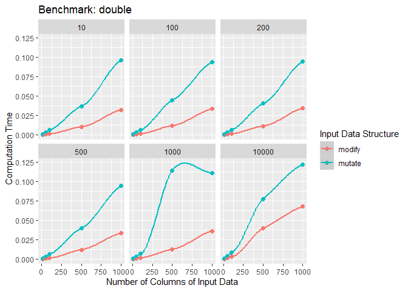

nrow

``` r
iris %>% 
  as_tibble() %>% 
  modify_if(is.numeric, ~ .x / iris$Sepal.Length)
```

    ## # A tibble: 150 x 5
    ##    Sepal.Length Sepal.Width Petal.Length Petal.Width Species
    ##           <dbl>       <dbl>        <dbl>       <dbl> <fct>  
    ##  1            1       0.686        0.275      0.0392 setosa 
    ##  2            1       0.612        0.286      0.0408 setosa 
    ##  3            1       0.681        0.277      0.0426 setosa 
    ##  4            1       0.674        0.326      0.0435 setosa 
    ##  5            1       0.72         0.280      0.04   setosa 
    ##  6            1       0.722        0.315      0.0741 setosa 
    ##  7            1       0.739        0.304      0.0652 setosa 
    ##  8            1       0.68         0.3        0.04   setosa 
    ##  9            1       0.659        0.318      0.0455 setosa 
    ## 10            1       0.633        0.306      0.0204 setosa 
    ## # … with 140 more rows

이유는 모르겠지만 `.x`와 `.`을 동시에 쓸 수가 없다.

``` r
iris %>%  modify_if(is.numeric, function(x) x/.$Sepal.Length)

iris %>%  modify_if(is.numeric, `/`, .$Sepal.Length)
```

### Two inputs: `map2()` and friends

`map()`는 하나의 인자(`.x`)에 대해 벡터화되어 있다. 이것의 의미는 `.x`는 `.f`를 호출할때만 서로 다르고 모든 다른 인자들은 불변인채로 전달된다. 그러므로 몇 가지 문제에 부적절하다. 예를 들어, 관측치 리스트와 가중치 리스트를 가지고 있을 때 가중평균을 구하려고 한다면 어떨까?

``` r
xs <- map(1:8, ~ runif(10))
xs[[1]][[1]] <- NA
ws <- map(1:8, ~ rpois(10, 5) + 1)
```

``` r
map_dbl(xs, mean)
```

    ## [1]        NA 0.5131142 0.3434496 0.4503837 0.4312598 0.4137600 0.5123024
    ## [8] 0.4826913

``` r
map_dbl(xs, weighted.mean, w = ws)
```

    ## Error in weighted.mean.default(.x[[i]], ...): 'x' and 'w' must have the same length

``` r
map2_dbl(xs, ws, weighted.mean, na.rm = TRUE)
```

    ## [1] 0.4955732 0.5599931 0.2959516 0.4787293 0.4462173 0.3838773 0.5088023
    ## [8] 0.4500092


``` r
simple_map2 <- function(x, y, f, ...) {
  out <- vector("list", length(xs))
  for (i in seq_along(x)) {
    out[[i]] <- f(x[[i]], y[[i]], ...)
  }
  out
}
```

위의 심플한 버전과 `map2()`의 차이점은 심플 버전은 두 인풋의 길이가 동일해야한다는 점이다. 만약 길이가 다르다면 OOB이다.

### No outputs: `walk()` and friends

대부분의 함수는 호출될 때 값을 리턴한다. 하지만 몇 가지 함수는 호출될 때 side-effect(`cat()`, `write.csv()`, `ggsave()`) 그리고 함수의 결과를 포착하지 않는다. `cat()`은 `NULL`을 반환한다.

``` r
welcome <- function(x) {
  cat("welcome ", x, "!\n", sep = "")
}
names <- c("Hadley", "Jenny")

map(names, welcome)
```

    ## welcome Hadley!
    ## welcome Jenny!

    ## [[1]]
    ## NULL
    ## 
    ## [[2]]
    ## NULL

이러한 문제를 피하기위해 purrr은 `.f`의 반환값을 무시하고 대신에 `.x`를 보이지 않게 반환한다.

``` r
walk(names, welcome)
```

    ## welcome Hadley!
    ## welcome Jenny!

디스크에 뭔갈 저장할 때 가장 흔한 side-effect이기 때문에 `walk2()`는 아주 유용할 것이다.


데이터프레임 리스트를 가지고 있고, 각각을 별도로 csv파일로 저장하기를 원한다고 하자.

``` r
temp <- tempfile()
dir.create(temp)

# cyls <- split(mtcars, mtcars$cyl)
cyls <- 
  mtcars %>% 
  group_by(cyl) %>% 
  nest()
paths <- file.path(temp, paste0("cyl-", cyls$cyl, ".csv"))

# walk2(cyls, paths, write.csv)
walk2(cyls$data, paths, write.csv)

dir(temp)
```

    ## [1] "cyl-4.csv" "cyl-6.csv" "cyl-8.csv"

### Iterating over values and indices

-   성분에 대해 루프: `for (x in xs)`
-   수치 인덱스에 대해 루프: `for (i in seq_along(xs))`
-   이름에 대해 루프: `for (nm in names(xs))`

첫 번째 형태는 `map()`과 유사하고 세 번째 형태는 `imap()`과 동일하다.

`imap(x, f)`는 x가 이름이라면 map2(x, names(x), f)와 동일하고 x가 이름이 아니라면 `map2(x, seq_along(x), f)`와 동일하다.

`imap()`은 레이블을 구성하는 데에 유용하다.

``` r
imap_chr(iris, ~ paste0("The first value of ", .y, " is ", .x[[1]]))
```

    ##                             Sepal.Length 
    ## "The first value of Sepal.Length is 5.1" 
    ##                              Sepal.Width 
    ##  "The first value of Sepal.Width is 3.5" 
    ##                             Petal.Length 
    ## "The first value of Petal.Length is 1.4" 
    ##                              Petal.Width 
    ##  "The first value of Petal.Width is 0.2" 
    ##                                  Species 
    ##   "The first value of Species is setosa"

벡터에 이름이 없다면 두 번째 인자는 인덱스가 될 것이다.

``` r
x <- map(1:6, ~ sample(1000, 10))
imap_chr(x, ~ paste0("The highest value of ", .y, " is ", max(.x)))
```

    ## [1] "The highest value of 1 is 785" "The highest value of 2 is 924"
    ## [3] "The highest value of 3 is 916" "The highest value of 4 is 987"
    ## [5] "The highest value of 5 is 908" "The highest value of 6 is 923"

공부해보니 파이썬의 enumerate와 살짝 비슷한것 같다.

### Any number of inputs: `pmap()` and friends

위에서 언급한 가중평균을 `pmap()`으로 다음과 같이 쓸 수 있다.

``` r
pmap_dbl(list(xs, ws), weighted.mean, na.rm = TRUE)
```

    ## [1] 0.4955732 0.5599931 0.2959516 0.4787293 0.4462173 0.3838773 0.5088023
    ## [8] 0.4500092

`pmap()`과 다른 map함수들과의 가장 큰 차이점은 리스트의 성분을 이름 지을 수 있기 때문에 인자에 대해 좀 더 세밀한 조정이 가능하다는 점이다.

``` r
trims <- c(0, 0.1, 0.2, 0.5)
x <- rcauchy(1000)

pmap_dbl(list(trim = trims), mean, x = x)
```

    ## [1] -0.22522331 -0.11766513 -0.08199741 -0.06818657

성분의 이름을 짓는 것은 좋은 습관이다.

``` r
params <- tribble(
  ~ n, ~ min, ~ max,
  1L, 0, 1,
  2L, 10, 100,
  3L, 100, 1000
)
pmap(params, runif)
```

    ## [[1]]
    ## [1] 0.1473228
    ## 
    ## [[2]]
    ## [1] 23.61943 72.29887
    ## 
    ## [[3]]
    ## [1] 645.0986 352.6198 101.5966


### Exercises

1.  `modify(mtcars, 1)`

각성분의 첫번째 값으로 모든 값을 수정한다.

1.  Rewrite the following code to use `iwalk()` instead of `walk2()`. What are the advantages and disadvantages?

``` r
cyls <- split(mtcars, mtcars$cyl)
paths <- file.path(temp, paste0("cyl-", names(cyls), ".csv"))
walk2(cyls, paths, write.csv)
```

``` r
names(cyls) <- file.path(temp, paste0("cyl-", names(cyls), ".csv"))
iwalk(cyls, ~ write.csv(.x, .y))
```

pipe를 사용해보자.

``` r
mtcars %>% 
  set_names(~ file.path(temp, paste0("cyl-", names(cyls), ".csv"))) %>% 
  iwalk(~ write.csv(.x, .y))
```

1.  Explain how the following code transforms a data frame using functions stored in a list.

``` r
trans <- list(
  disp = function(x) x * 0.0163871,
  am = function(x) factor(x, labels = c("auto", "manual"))
)

nm <- names(trans)
mtcars[nm] <- map2(trans, mtcars[nm], function(f, var) f(var))

mtcars[vars] <- map(vars, ~ trans[[.x]](mtcars[[.x]]))
```

`mutate()`쓰는게 나아보인다.

Reduce family
-------------

### Basics

`reduce()`는 n길이의 벡터를 취하고 길이 1의 벡터를 생성한다: `reduce(1:4, f)`는 `f(f(f(1, 2), 3), 4)`와 동일하다.


``` r
l <- map(1:4, ~ sample(1:10, 15, replace = T))
out <- l[[1]]
out <- intersect(out, l[[2]])
out <- intersect(out, l[[3]])
out <- intersect(out, l[[4]])
out
```

    ## [1] 6 5 9 7 3

``` r
reduce(l, intersect)
```

    ## [1] 6 5 9 7 3

``` r
simple_reduce <- function(x, f) {
  out <- x[[1]]
  for (i in seq(2, length(x))) {
    out <- f(out, x[[i]])
  }
  out
}
```

### Accumulate

`accumulate()`는 최종결과값 뿐만 아니라 중간에 모든 값도 반환한다.

``` r
accumulate(l, intersect)
```

    ## [[1]]
    ##  [1] 8 1 6 5 2 9 8 7 6 1 7 3 6 5 9
    ## 
    ## [[2]]
    ## [1] 8 1 6 5 9 7 3
    ## 
    ## [[3]]
    ## [1] 8 1 6 5 9 7 3
    ## 
    ## [[4]]
    ## [1] 6 5 9 7 3

``` r
x <- c(4, 3, 10)
reduce(x, `+`)
```

    ## [1] 17

``` r
accumulate(x, `+`)
```

    ## [1]  4  7 17

### Output types

``` r
reduce(1, `+`)
```

    ## [1] 1

인풋이 유효한지 확인할 방법이 없다.

``` r
reduce("a", `+`)
```

    ## [1] "a"

길이가 0이라면 어떨까?

``` r
reduce(integer(), `+`)
```

    ## Error: `.x` is empty, and no `.init` supplied


`reduce(1,`+`, init)`을 하게 되면 결과가 `1 + init`

``` r
reduce(integer(), `+`, .init = 0)
```

    ## [1] 0

이것은 또한 인풋이 유효한지를 검증할 수도 있다.

``` r
reduce("a", `+`, .init = 0)
```

    ## Error in .x + .y: 이항연산자에 수치가 아닌 인수입니다

``` r
sum(integer())
```

    ## [1] 0

``` r
prod(integer())
```

    ## [1] 1

``` r
min(integer())
```

    ## Warning in min(integer()): min에 전달되는 인자들 중 누락이 있어 Inf를 반환합니다

    ## [1] Inf

``` r
max(integer())
```

    ## Warning in max(integer()): max에 전달되는 인자들 중 누락이 있어 -Inf를 반환합니
    ## 다

    ## [1] -Inf

길이가 0이거나 1인 벡터를 전달 할 때 어떤 값을 반환해야하는 지 유의하면서 `.init`을 정하라.

### Multiple inputs

정말 가끔씩 두 가지 인자를 reducing하기 위해 함수에 전달할 수 있다.예를 들어, join하기 위한 데이터프레임의 리스트를 가지고 조인하기 위한 변수(key)가 성분마다 다를때이다.

`reduce2()`를 사용한다.

key를 일치시키는 게 좋을 듯 하다..

### Map-reduce

각 컴퓨터마다 있는 데이터를 map하고 결과물들을 reduce하여 하나의 결과물로 만든다. 엄청나게 큰 벡터에서 평균을 계산하려고 하자. 그래서 다수의 컴퓨터에 데이터가 나눠져있다. 각 컴퓨터마다 길이와 합을 계산하고 조정자에게 반환하여 전체 평균을 계산할 수 있다.

Predicate functionals
---------------------

**predicate**는 `is.character()`, `is.null()`, 또는 `all()`처럼 하나의 `TRUE` 또는 `FALSE`를 반환하는 함수이다.

### Basics

-   `some(.x, .p)`은 어느 성분이 매칭되면 `TRUE`를 반환하고 `every(.x, .p)`는 모든 성분이 매칭되면 `TRUE`를 반환한다.
-   `detect(.x, .p)`는 첫 번째 매칭 값을 반환하고 `detect_index(.x, .p)`는 첫 번째 매칭의 위치를 반환한다.
-   `keep(.x, .p)`는 모든 매칭 성분을 유지하고 `discard(.x, .p)`는 모든 매칭 성분을 버린다.

``` r
df <- data.frame(x = 1:3, y = c("a", "b", "c"))
detect(df, is.factor)
```

    ## [1] a b c
    ## Levels: a b c

``` r
detect_index(df, is.factor)
```

    ## [1] 2

``` r
str(keep(df, is.factor))
```

    ## 'data.frame':    3 obs. of  1 variable:
    ##  $ y: Factor w/ 3 levels "a","b","c": 1 2 3

``` r
str(discard(df, is.factor))
```

    ## 'data.frame':    3 obs. of  1 variable:
    ##  $ x: int  1 2 3

### Map variants

``` r
df <- data.frame(
  num1 = c(0, 10, 20),
  num2 = c(5, 6, 7),
  chr1 = c("a", "b", "c"),
  stringsAsFactors = FALSE
)

str(map_if(df, is.numeric, mean))
```

    ## List of 3
    ##  $ num1: num 10
    ##  $ num2: num 6
    ##  $ chr1: chr [1:3] "a" "b" "c"

``` r
str(modify_if(df, is.numeric, mean))
```

    ## 'data.frame':    3 obs. of  3 variables:
    ##  $ num1: num  10 10 10
    ##  $ num2: num  6 6 6
    ##  $ chr1: chr  "a" "b" "c"

``` r
str(map(keep(df, is.numeric), mean))
```

    ## List of 2
    ##  $ num1: num 10
    ##  $ num2: num 6

### Exercises

1.  Why isn’t is.na() a predicate function? What base R function is closest to being a predicate version of is.na()?

단 하나의 논릿값을 반환하지 않기 때문에 아니다.

`anyNA()`

Function factories
==================

Introduction
------------

**function factory**는 함수를 만드는 함수이다. 함수 공자은 두 개의 자식 함수를 만든다. (`square()`, `cube()`)

``` r
power1 <- function(exp) {
  function(x) {
    x ^ exp
  }
}

square <- power1(2)
cube <- power1(3)
```

함수 공장을 가능하게 만드는 몇 가지 요소를 이미 학습했다.

-   함수를 객체로 할당할 있다.
-   생성된 환경을 캡처(enclose)하는 함수를 학습했다.
-   매번 실행될 때 마다 새로운 실행 환경을 생성하는 함수를 학습했다.

``` r
library(scales)
```

    ## 
    ## Attaching package: 'scales'

    ## The following object is masked from 'package:purrr':
    ## 
    ##     discard

    ## The following object is masked from 'package:readr':
    ## 
    ##     col_factor

``` r
library(rlang)
```

    ## 
    ## Attaching package: 'rlang'

    ## The following objects are masked from 'package:purrr':
    ## 
    ##     %@%, as_function, flatten, flatten_chr, flatten_dbl, flatten_int,
    ##     flatten_lgl, flatten_raw, invoke, list_along, modify, prepend,
    ##     splice

Factory fundamentals
--------------------

> The enclosing environment of the manufactured function is an execution environment of the function factory

### Environments

``` r
square
```

    ## function(x) {
    ##     x ^ exp
    ##   }
    ## <environment: 0x00000000132d9d18>

``` r
cube
```

    ## function(x) {
    ##     x ^ exp
    ##   }
    ## <bytecode: 0x0000000012de5c50>
    ## <environment: 0x00000000131ee3b0>

단순히 출력해서는 만들어진 함수의 차이를 알 수 없다. 왜냐하면 body가 동일하기 때문이다. enclosing 환경의 내용은 중요한 요소이다.

``` r
env_print(square)
```

    ## <environment: 00000000132D9D18>
    ## parent: <environment: global>
    ## bindings:
    ##  * exp: <lazy>

``` r
env_print(cube)
```

    ## <environment: 00000000131EE3B0>
    ## parent: <environment: global>
    ## bindings:
    ##  * exp: <lazy>

같은 부모를 가지는데 이것은 `power1()`의 enclosing 환경(즉, 전역환경)이다.

`env_print()`는 두 개의 환경이 `exp`에 binding됐다는 걸 보여주지만 그것의 값을 보고싶다.

``` r
# fn_env(): 클로져 환경이 함수의 스코프를 함수 호출이 평가될 때 정의한다.
fn_env(square)$exp
```

    ## [1] 2

``` r
fn_env(cube)$exp
```

    ## [1] 3

### Diagram conventions


``` r
square(10)
```

    ## [1] 100

`square()`이 실행될때 `x ^ exp`는 실행 환경에서 `x`를 찾고 `exp`는 enclosing환경에서 찾는다.


### Forcing evaluation

`power1()`에는 lazy evaluation으로 인한 버그가 있다.

``` r
x <- 2
square <- power1(x)
x <- 3

square(2)
```

    ## [1] 8

`x`는 `power1()`이 실행될 때가 아니라 `square()`이 실행될 때 게으르게 연산이 되기 때문이다. 일반적으로, 이 문제는 binding 변화가 함수 공장 호출과 만들어진 함수 호출 사이에서 일어날 때마다 발생한다.

이것을 해결하기 위해 `force()`를 사용하자.

``` r
power2 <- function(exp) {
  force(exp)
  function(x) {
    x ^ exp
  }
}

x <- 2
square <- power2(x)
x <- 3
square(2)
```

    ## [1] 4

함수 공장을 만들 때 마다 모든 인자는 연산되어진다.

### Stateful functions

함수 공장은 함수 호출때 상태를 유지할 있게끔 한다.

-   만들어진 함수의 enclosing 환경이 유일하고 상수이다.
-   R은 enclosing환경에서 binding을 수정하는 `<<-`를 가지고있다.

``` r
new_counter <- function() {
  i <- 0
  
  function() {
    i <<- i + 1
    i
  }
}

counter_one <- new_counter()
counter_two <- new_counter()
```

``` r
counter_one()
```

    ## [1] 1

``` r
counter_one()
```

    ## [1] 2

``` r
counter_two()
```

    ## [1] 1

여러 변수의 상태를 관리할 때는 R6를 이용하는 것이 좋다.

### Garbage collection

``` r
f1 <- function(n) {
  x <- runif(n)
  m <- mean(x)
  function() m
}

g1 <- f1(1e6)
lobstr::obj_size(g1)
```

    ## 8,013,136 B

``` r
f2 <- function(n) {
  x <- runif(n)
  m <- mean(x)
  rm(x)
  function() m
}

g2 <- f2(1e6)
lobstr::obj_size(g2)
```

    ## 12,976 B

### Exercises

1.  Create a function `pick()` that takes an index, `i`, as an argument and returns a function with an argument `x` that subsets `x` with `i`.

``` r
pick(1)(x)
# should be equivalent to
x[[1]]

lapply(mtcars, pick(5))
# should be equivalent to
lapply(mtcars, function(x) x[[5]])
```

``` r
pick <- function(i) {
  force(i)
  
  function(x) x[[i]]
}
```

1.  Create a function that creates functions that compute the *i*<sup>*t**h*</sup> central moment of a numeric vector. You can test it by running the following code:

``` r
m1 <- moment(1)
m2 <- moment(2)

x <- runif(100)
stopifnot(all.equal(m1(x), 0))
stopifnot(all.equal(m2(x), var(x) * 99 / 100))
```

``` r
moment <- function(i) {
  force(i)
  
  function(x) sum((x - mean(x)) ^ i) / length(x)
}
```

Graphical factories
-------------------

### Labelling

scales패키지의 목적 하나는 ggplot의 레이블을 쉽게 조작하기 위함이다.

``` r
y <- c(12345, 123456, 1234567)
comma_format()(y)
```

    ## [1] "12,345"    "123,456"   "1,234,567"

``` r
number_format(scale = 1e-3, suffix = " K")(y)
```

    ## [1] "12 K"    "123 K"   "1 235 K"

ggplot의 스케일은 `label`인자를 함수 인자로 받기 때문에 잘 어울린다.

``` r
df <- data.frame(x = 1, y = y)
core <- ggplot(df, aes(x, y)) +
  geom_point() +
  scale_x_continuous(breaks = 1, labels = NULL) +
  labs(x = NULL, y = NULL)

core
```

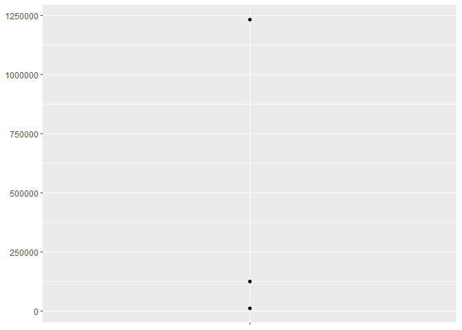

``` r
core + scale_y_continuous(
  labels = comma_format()
)
```

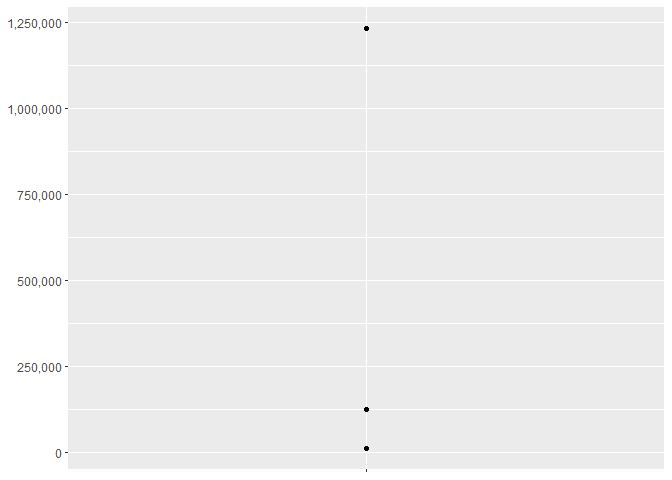

``` r
core + scale_y_continuous(
  labels = number_format(scale = 1e-3, suffix = " K")
)
```

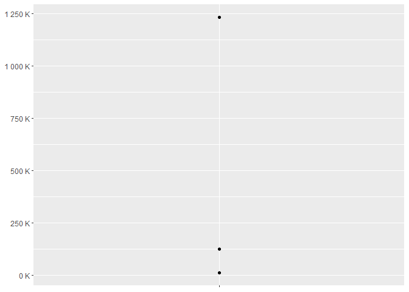

``` r
core + scale_y_continuous(
  labels = scientific_format()
)
```

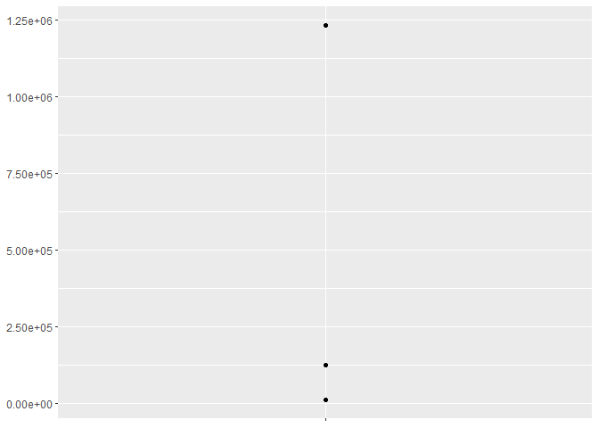

### Histogram bins

`geom_histogram()`의 잘 알려지지 않은 특징은 `binwidth`인자가 함수가 될 수 있다는 것이다. 이것은 특히 유용한데 함수가 각 그룹에서 한번 실행되기 때문이다. 이것은 facet마다 다른 binwidth를 가질 수 있다.

``` r
# construct some sample data with very different numbers in each call
sd <- c(1, 5, 15)
n <- 100

df <- data.frame(x = rnorm(3 * n, sd = sd), sd = rep(sd, n))

ggplot(df, aes(x)) +
  geom_histogram(binwidth = 2) +
  facet_wrap(~ sd, scales = "free_x") +
  labs(x = NULL)
```

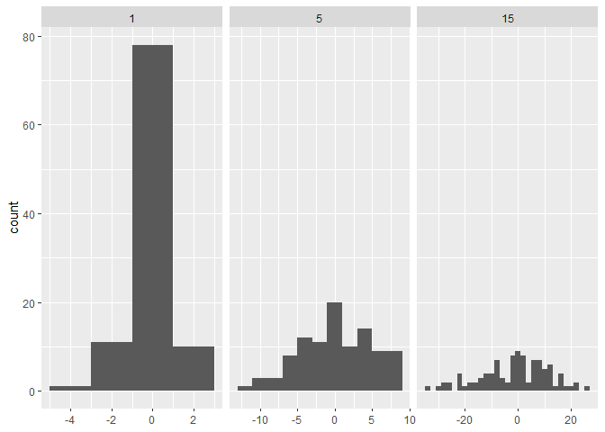 참고로 `rnorm(3, c( 1, 5, 15))`은 차례대로 표준편차 1, 5, 15일 때 난수를 발생시킨다. `rep(sd, 3)`은 `1 5 15 1 5 15 1 5 15`이다.

각 facet는 같은 수의 관측치를 가지지만, 변동성은 매우 다르다. binwidth가 다양해서 각 bin마다 거의 같은 수의 관측치를 얻게 된다면 좋을 것이다. 한 가지 방법은 함수공장을 만드는 것인데 이 함수공장은 인풋이 bin의 수(`n`)이고 아웃풋이 수치형 벡터를 취하고 binwidth를 반환하는 함수를 가진다.

``` r
binwidth_bins <- function(n) {
  force(n)
  
  function(x) {
    (max(x) - min(x)) / n
  }
}

ggplot(df, aes(x)) +
  geom_histogram(binwidth = binwidth_bins(20)) +
  facet_wrap(~ sd, scales = "free_x") +
  labs(x = NULL)
```

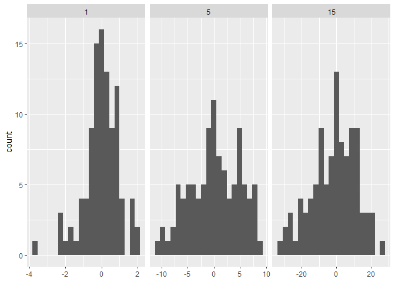

자동으로 최적의 binwidth를 제공하는 베이스 R 함수인 `nclass.Sturges()`, `nclass.scott()`, 그리고 `nclass.FD()`가 있다. 히스토그램의 class 수를 계산한다.

``` r
set.seed(1)
x <- rnorm(1111)
nclass.Sturges(x)
```

    ## [1] 12

``` r
## Compare them:
NC <- function(x) c(Sturges = nclass.Sturges(x),
      Scott = nclass.scott(x), FD = nclass.FD(x))
NC(x)
```

    ## Sturges   Scott      FD 
    ##      12      20      26

``` r
onePt <- rep(1, 11)
NC(onePt) # no longer gives NaN
```

    ## Sturges   Scott      FD 
    ##       5       1       1

``` r
base_bins <- function(type) {
  fun <- switch(type,
    Sturges = nclass.Sturges, # bin의 크기를 데이터의 range에 기반 
    scott = nclass.scott, # bin의 크기를 정규 분포에 기반. 표준편차가 0이면 1을 반환한다.
    FD = nclass.FD, # IQR(Q3 - Q1)에 기반. 차이가 0이라면 1을 반환 
    stop("Unknown type", call. = FALSE)
    )
  
  function(x) {
    (max(x) - min(x)) / fun(x)
  }
}

ggplot(df, aes(x)) +
  geom_histogram(binwidth = base_bins("FD")) +
  facet_wrap(~ sd, scales = "free_x") +
  labs(x = NULL)
```

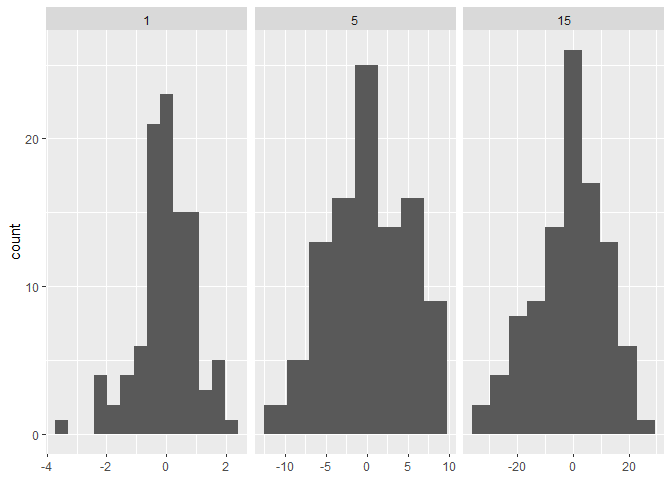

### `ggsave()`

마지막으로, ggplot 내부적으로 함수공장을 사용하는 것이다. `ggplot2:::plot_dev()`는 `ggsave()`에 의해 사용되는데 파일 확장에서 그래픽디바이스 함수로 가기 위함이다. 베이스 그래픽 디바이스는 몇 가지 사소한 비일관성을 가지기 때문에 어려움이 일어난다.

-   대부분은 `filename`을 첫 번째 인자로 가지지만 몇 가지는 `file`을 가진다.
-   래스터 그래픽 디바이스의 `width`와 `height`는 디폴트로 픽셀 단위를 사용하지만 벡터 그래픽 디바이스는 인치를 사용한다.

`plot_dev()`의 수정된 버전은 아래와 같다.

``` r
plot_dev <- function(ext, dpi = 96) {
  force(dpi)
  
  switch(ext,
    eps =  ,
    ps  =  function(path, ...) {
      grDevices::postscript(
        file = filename, ..., onefile = FALSE, 
        horizontal = FALSE, paper = "special"
      )
    },
    pdf = function(filename, ...) grDevices::pdf(file = filename, ...),
    svg = function(filename, ...) svglite::svglite(file = filename, ...),
    emf = ,
    wmf = function(...) grDevices::win.metafile(...),
    png = function(...) grDevices::png(..., res = dpi, units = "in"),
    jpg = ,
    jpeg = function(...) grDevices::jpeg(..., res = dpi, units = "in"),
    bmp = function(...) grDevices::bmp(..., res = dpi, units = "in"),
    tiff = function(...) grDevices::tiff(..., res = dpi, units = "in"),
    stop("Unknown graphics extension: ", ext, call. = FALSE)
  )
}

plot_dev("pdf")
```

    ## function(filename, ...) grDevices::pdf(file = filename, ...)
    ## <bytecode: 0x0000000016542b88>
    ## <environment: 0x0000000017becf98>

``` r
plot_dev("png")
```

    ## function(...) grDevices::png(..., res = dpi, units = "in")
    ## <bytecode: 0x0000000013ab49f0>
    ## <environment: 0x0000000013360ac8>

Statistical factories
---------------------

### Box-Cox transformation

``` r
boxcox1 <- function(x, lambda) {
  stopifnot(length(lambda) == 1)
  
  if (lambda == 0) {
    log(x)
  } else {
    (x ^ lambda - 1) / lambda
  }
}
```

함수공장으로 재구성하는 것은 행동 양식을 탐색하는 것을 쉽게 해준다.[ggplot2::stat\_function](https://ggplot2.tidyverse.org/reference/stat_function.html)

``` r
boxcox2 <- function(lambda) {
  if (lambda == 0) {
    function(x) log(x)
  } else {
    function(x) (x ^ lambda - 1) / lambda
  }
}

stat_boxcox <- function(lambda) {
  stat_function(aes(color = lambda), fun = boxcox2(lambda), size = 1)
}

ggplot(data.frame(x = c(0, 5)), aes(x)) +
  lapply(c(0.5, 1, 1.5), stat_boxcox) +
  scale_color_viridis_c(limits = c(0, 1.5))
```

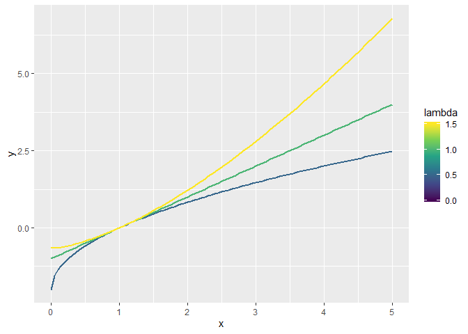

``` r
# visually, Log() does seem to make sense as the transformation
# for Labmda = 0; as values get smaller and smaller, the function
# gets close and closer to a Log transformation
ggplot(data.frame(x = c(0.01, 1)), aes(x)) +
  map(c(0.5, 0.25, 0.1, 0), stat_boxcox) + # map으로도 가능
  scale_color_viridis_c(limits = c(0, 1.5))
```

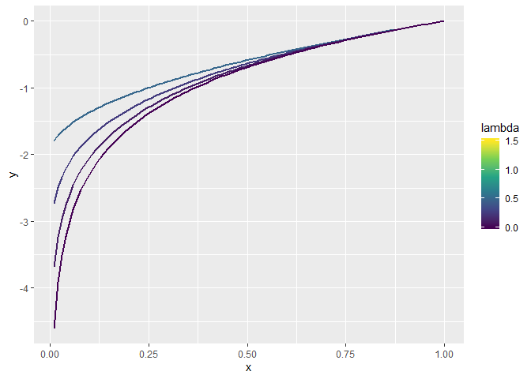

### Bootstrap generators

``` r
boot_permute <- function(df, var) {
  n <- nrow(df)
  force(var)
  
  function() {
    col <- df[[var]]
    col[sample(n, replace = TRUE)]
  }
}

boot_mtcars1 <- boot_permute(mtcars, "mpg")

head(boot_mtcars1())
```

    ## [1] 22.8 19.2 15.5 15.8 10.4 18.7

``` r
head(boot_mtcars1())
```

    ## [1] 19.2 15.0 14.3 30.4 15.0 15.2

함수공자의 이점은 먼저 모델을 적합시켜야하는 모수부트스트랩에서 좀 더 분명해진다는 점이다.

``` r
boot_model <- function(df, formula) {
  mod <- lm(formula, data = df)
  fitted <- unname(fitted(mod))
  resid <- unname(resid(mod))
  rm(mod)
  
  function() {
    fitted + sample(resid)
  }
}

boot_mtcars2 <- boot_model(mtcars, mpg ~ wt)
head(boot_mtcars2())
```

    ## [1] 22.25512 22.78664 27.23591 16.37578 17.01712 19.14968

### Maximum liklihood estimation

``` r
lprob_poisson <- function(lambda, x) {
  n <- length(x)
  (log(lambda) * sum(x)) - (n * lambda) - sum(lfactorial(x))
}

x1 <- c(41, 30, 31, 38, 29, 24, 30, 29, 31, 38)

lprob_poisson(10, x1)
```

    ## [1] -183.6405

``` r
lprob_poisson(20, x1)
```

    ## [1] -61.14028

``` r
lprob_poisson(30, x1)
```

    ## [1] -30.98598

통계학에서는 x가 고정되있 있고 모수가 변수임을 강조하기 위해 *f*(*λ*, **x**)가 아니라 *f*<sub>**x**</sub>(*λ*)라고 쓸 수 있다.

``` r
ll_poisson2 <- function(x) {
  n <- length(x)
  sum_x <- sum(x)
  c <- sum(lfactorial(x))
  
  function(lambda) {
    log(lambda) * sum_x - n * lambda - c
  }
}
```

``` r
ll1 <- ll_poisson2(x1)

optimise(ll1, c(0, 100), maximum = TRUE)
```

    ## $maximum
    ## [1] 32.09999
    ## 
    ## $objective
    ## [1] -30.26755

함수 공장의 이점

-   값을 미리 계산해서 각 반복마다 계산 시간 절약
-   수학적 문제를 더 잘 반영

### Exercises

1.  `boot_model()`, why don’t I need to force the evaluation of `df` or `model`?

``` r
boot_model <- function(df, formula) {
  mod <- lm(formula, data = df)
  fitted <- unname(fitted(mod))
  resid <- unname(resid(mod))
  rm(mod)

  function() {
    fitted + sample(resid)
  }
} 
```

결국에 함수를 반환하는 데 모든 인풋이 명백히 연산이 되어야 함수가 반환되기 때문이다.

1.  Why might you formulate the Box-Cox transformation like this?

``` r
boxcox3 <- function(x) {
  function(lambda) {
    if (lambda == 0) {
      log(x)
    } else {
      (x ^ lambda - 1) / lambda
    }
  }  
}
```

``` r
boxcox_airpassengers <- boxcox3(AirPassengers)

plot(boxcox_airpassengers(0))
```

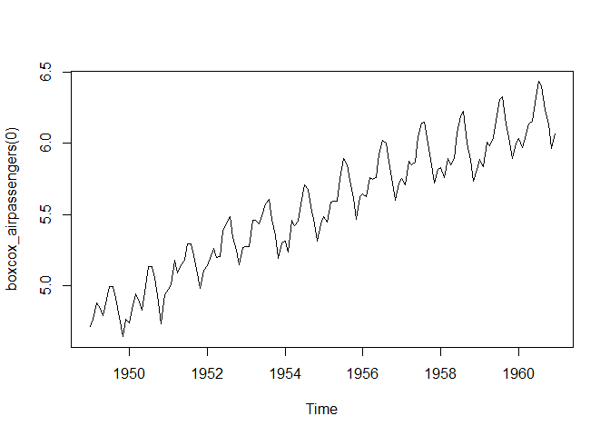

``` r
plot(boxcox_airpassengers(1))
```

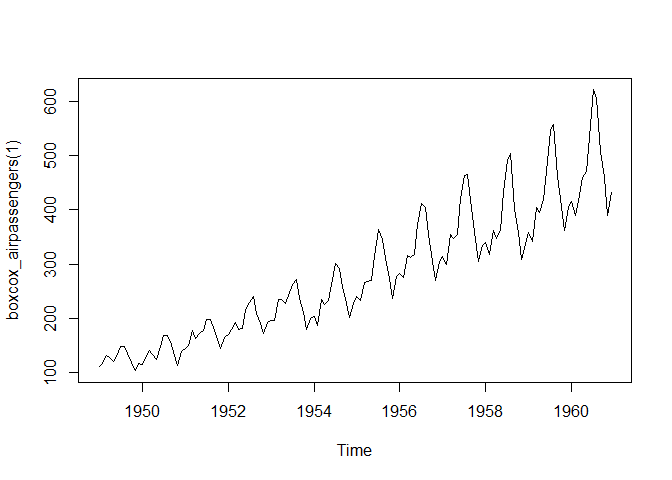

``` r
plot(boxcox_airpassengers(2))
```

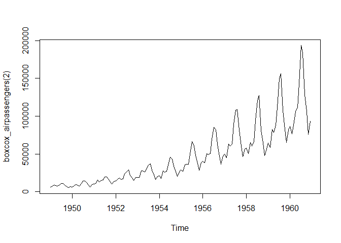 x가 고정되어 있다.

1.  Why don’t you need to worry that `boot_permute()` stores a copy of the data inside the function that it generates?

``` r
boot_permute <- function(df, var) {
  n <- nrow(df)
  force(var)

  function() {
    col <- df[[var]]
    col[sample(n, replace = TRUE)]
  }
}
boot_mtcars1 <- boot_permute(mtcars, "mpg")

lobstr::obj_size(mtcars)
```

    ## 7,208 B

``` r
lobstr::obj_size(boot_mtcars1)
```

    ## 23,256 B

``` r
lobstr::obj_sizes(mtcars, boot_mtcars1)
```

    ## *  7,208 B
    ## * 16,048 B

실제로 복사가 일어나지 않기 때문이다. 메모리에서 같은 객체를 기반으로 한다.

Function factories + functionals
--------------------------------

``` r
names <- list(
  square = 2,
  cube = 3,
  root = 1/2,
  cuberoot = 1/3,
  reciprocal = -1
)
funs <- map(names, power1)

funs$root(64)
```

    ## [1] 8

``` r
funs$root
```

    ## function(x) {
    ##     x ^ exp
    ##   }
    ## <bytecode: 0x0000000012de5c50>
    ## <environment: 0x00000000244f7c30>

`$`를 사용하는 것이 귀찮으므로 세 가지 방법이 있다.

-   `with`사용
-   `attach`사용: 이 경우엔 데이터프레임을 attach하는 것이 아니기 때문에 문제가 생기지 않는다.
-   `env_bind()`를 사용하여 전역환경으로 함수를 복사

``` r
rlang::env_bind(globalenv(), !!!funs)
root(100)
```

    ## [1] 10

``` r
rlang::env_unbind(globalenv(), names(funs))
```

### Exercises

1.  Which of the following commands is equivalent to `with(x, f(z))`?

<!-- -->

1.  `x$f(x$z)`.
2.  `f(x$z)`.
3.  `x$f(z)`.
4.  `f(z)`.
5.  It depends.

``` r
f <- mean
z <- 1
x <- list(f = mean, z = 1)

identical(with(x, f(z)), x$f(x$z))
```

    ## [1] TRUE

``` r
identical(with(x, f(z)), f(x$z))
```

    ## [1] TRUE

``` r
identical(with(x, f(z)), x$f(z))
```

    ## [1] TRUE

``` r
identical(with(x, f(z)), f(z))
```

    ## [1] TRUE

1.  Compare and contrast the effects of env\_bind() vs. attach() for the following code.

``` r
funs <- list(
  mean = function(x) mean(x, na.rm = TRUE),
  sum = function(x) sum(x, na.rm = TRUE)
)

attach(funs)
```

    ## The following objects are masked from package:base:
    ## 
    ##     mean, sum

``` r
mean <- function(x) stop("Hi!")
mean
```

    ## function(x) stop("Hi!")

``` r
detach(funs)
```

``` r
funs <- list(
  mean = function(x) mean(x, na.rm = TRUE),
  sum = function(x) sum(x, na.rm = TRUE)
)

rlang::env_bind(globalenv(), !!!funs)
mean <- function(x) stop("Hi!") 
mean
```

    ## function(x) stop("Hi!")

``` r
rlang::env_unbind(globalenv(), names(funs))
```

Function operators
==================

`function operator`는 함수를 인풋으로 취하고 함수를 아웃풋으로 반환하는 함수이다.

``` r
chatty <- function(f) {
  force(f)
  
  function(x, ...) {
    res <- f(x, ...)
    cat("Processing ", x, "\n", sep = "")
    res
  }
}
f <- function(x) x ^ 2
s <- c(3, 2, 1)

map_dbl(s, chatty(f))
```

    ## Processing 3
    ## Processing 2
    ## Processing 1

    ## [1] 9 4 1

function operator는 인풋이 함수인 function factory이다. 파이썬의 데코레이터와 같은 것이다.

``` r
library(memoise)
```

Existing function operators
---------------------------

흔한 순환 문제를 해결하는 데에 도움을 주는 `purrr::safely()`와 `memoise::memoise()`

### Capturing errors with `purrr::safely()`

``` r
x <- list(
  c(0.512, 0.165, 0.717),
  c(0.064, 0.781, 0.427),
  c(0.890, 0.785, 0.495),
  "oops"
)

out <- rep(NA_real_, length(x))
for (i in seq_along(x)) {
  out[[i]] <- sum(x[[i]])
}
```

    ## Error in sum(x[[i]]): 인자의 'type' (character)이 올바르지 않습니다

``` r
out
```

    ## [1] 1.394 1.272 2.170    NA

``` r
map_dbl(x, sum)
```

    ## Error in .Primitive("sum")(..., na.rm = na.rm): 인자의 'type' (character)이 올바르지 않습니다

`safely()`는 문제에 도움을 주는 툴을 제공한다.

``` r
safe_sum <- safely(sum)
safe_sum
```

    ## function (...) 
    ## capture_error(.f(...), otherwise, quiet)
    ## <bytecode: 0x000000001578c010>
    ## <environment: 0x000000001578c4a8>

``` r
str(safe_sum(x[[1]]))
```

    ## List of 2
    ##  $ result: num 1.39
    ##  $ error : NULL

``` r
str(safe_sum(x[[4]]))
```

    ## List of 2
    ##  $ result: NULL
    ##  $ error :List of 2
    ##   ..$ message: chr "인자의 'type' (character)이 올바르지 않습니다"
    ##   ..$ call   : language .Primitive("sum")(..., na.rm = na.rm)
    ##   ..- attr(*, "class")= chr [1:3] "simpleError" "error" "condition"

`safely()`는 에러가 있으면 `result`와 `error`를 가진 리스트를 반환하고 에러가 없으면 `NULL`를 반환한다.

``` r
out <- map(x, safely(sum))
str(out)
```

    ## List of 4
    ##  $ :List of 2
    ##   ..$ result: num 1.39
    ##   ..$ error : NULL
    ##  $ :List of 2
    ##   ..$ result: num 1.27
    ##   ..$ error : NULL
    ##  $ :List of 2
    ##   ..$ result: num 2.17
    ##   ..$ error : NULL
    ##  $ :List of 2
    ##   ..$ result: NULL
    ##   ..$ error :List of 2
    ##   .. ..$ message: chr "인자의 'type' (character)이 올바르지 않습니다"
    ##   .. ..$ call   : language .Primitive("sum")(..., na.rm = na.rm)
    ##   .. ..- attr(*, "class")= chr [1:3] "simpleError" "error" "condition"

결과물이 네 개의 리스트를 가지고 있고 각각이 `result`와 `error`를 가지고 있어서 약간 불편하다. `purrr::transpose()`를 사용해서 `result`리스트와 `error`리스트를 얻자.

``` r
out <- transpose(map(x, safely(sum)))
str(out)
```

    ## List of 2
    ##  $ result:List of 4
    ##   ..$ : num 1.39
    ##   ..$ : num 1.27
    ##   ..$ : num 2.17
    ##   ..$ : NULL
    ##  $ error :List of 4
    ##   ..$ : NULL
    ##   ..$ : NULL
    ##   ..$ : NULL
    ##   ..$ :List of 2
    ##   .. ..$ message: chr "인자의 'type' (character)이 올바르지 않습니다"
    ##   .. ..$ call   : language .Primitive("sum")(..., na.rm = na.rm)
    ##   .. ..- attr(*, "class")= chr [1:3] "simpleError" "error" "condition"

에러를 쉽게 찾을 있다.

``` r
ok <- map_lgl(out$error, is.null)
x[!ok]
```

    ## [[1]]
    ## [1] "oops"

``` r
out$result[ok]
```

    ## [[1]]
    ## [1] 1.394
    ## 
    ## [[2]]
    ## [1] 1.272
    ## 
    ## [[3]]
    ## [1] 2.17

데이터프레임 리스트에서 GLM을 적합시킨다고 상상해보자. GLM은 최적화 문제때문에 실패할 수 있지만 여전히 적합하기를 원하고 어디서 실패했는지 확인해보고 싶을 수 있다.

``` r
fit_model <- function(df) {
  glm(y ~ x1 + x2 * x3, data = df)
}

models <- transpose(map(datasets, safely(fit_model)))
ok <- map_lgl(models$error, is.null)

# which data failed to converge?
datasets[!ok]

# which models were successful?
models[ok]
```

-   `possibly()`: 에러가 있을 때 디폴트 값을 반환한다. 에러가 발생했는지 여부를 알려주지 않는다. 그래서 명백한 `NA`와 같은 명백한 감시값이 있을 때의 케이스를 갖는다.
-   `quietly()`: `output` `message` `warning` 반환
-   `auto_browswer()`: 자동으로 에러에 대해 `browser()`를 실행한다.

### Caching computations with `memoise::memoise()`

`memoise::memoise()`는 함수를 **memoise**한다. 함수는 이전의 인풋을 기억하고 캐싱된 결과를 반환한다. memoisation은 메모리와 스피드의 트레이드오프 클래식 컴퓨터 과학의 예이다. memoised 함수는 훨씬 빠른데 이 전의 인풋과 아웃풋을 저장하기 때문에 좀 더 많은 메로리를 사용한다.

``` r
slow_function <- function(x) {
  Sys.sleep(1)
  x * 10 * runif(1)
}
system.time(print(slow_function(1)))
```

    ## [1] 0.00656348

    ##    user  system elapsed 
    ##       0       0       1

``` r
system.time(print(slow_function(1)))
```

    ## [1] 8.663884

    ##    user  system elapsed 
    ##    0.01    0.00    1.02

``` r
fast_function <- memoise::memoise(slow_function)
system.time(print(fast_function(1)))
```

    ## [1] 1.010452

    ##    user  system elapsed 
    ##       0       0       1

``` r
system.time(print(fast_function(1)))
```

    ## [1] 1.010452

    ##    user  system elapsed 
    ##    0.02    0.00    0.01

memoisation의 실제 사용은 피보나치 수열을 계산하는 것이다.

``` r
fib <- function(n) {
  if (n < 2) return(1)
  fib(n - 2) + fib(n - 1)
}
system.time(fib(23))
```

    ##    user  system elapsed 
    ##    0.05    0.00    0.05

``` r
system.time(fib(24))
```

    ##    user  system elapsed 
    ##    0.06    0.00    0.07

``` r
fib2 <- memoise::memoise(function(n) {
  if (n < 2) return(1)
  fib2(n - 2) + fib2(n - 1)
})
system.time(fib2(23))
```

    ##    user  system elapsed 
    ##    0.03    0.00    0.03

``` r
system.time(fib2(24))
```

    ##    user  system elapsed 
    ##       0       0       0

dynamic 프로그래밍의 예이다. 다이나믹 프로그래밍은 복잡한 문제를 여러 개의 겹치는 작은 문제들로 분해하고 작은 문제들의 결과를 기억해서 성능을 향상시킨다.
