Practical Statistics for Data Scientists
================

2019년 1월

# Ch1. EDA

## 위치 척도

location measure로 outlier에 robust한 median(or weighted median)이나 trimmed
mean을 mean대신 사용해야 할 수도 있다.

``` r
mean(state[["Population"]])
```

    ## [1] 6162876

``` r
mean(state[["Population"]], trim = 0.1)
```

    ## [1] 4783697

``` r
median(state[["Population"]])
```

    ## [1] 4436370

``` r
# install.packages("matrixStats")
weighted.mean(state[["Murder.Rate"]], w = state[["Population"]])
```

    ## [1] 4.445834

``` r
matrixStats::weightedMedian(state[["Murder.Rate"]], w = state[["Population"]])
```

    ## [1] 4.4

## 분산 척도

  - Mean absolute deviation: \(\frac{\Sigma|x - \bar x|}{n}\)
  - Standard deviation: 원본 데이터와 scale이 동일하므로 해석하기 쉽다. trimmed SD도 있다.
  - median absolute deviation from the median(MAD): 표준편차나 평균절대편차에 비해
    outlier에 대해 robust. \(Median(|X_1 - m|, |X_2 - m|,..., |X_N - m|)\).
    때때로, scale을 조정하기 위해 정규분포일 때 1.4826을 곱해준다.
  - range는 이상치에 극도로 민감하므로 잘 사용하지 않고 interquantile range(IQR)을 사용하기도 한다.

분산과 표준편차는 변동성 통계량중에서 가장 넓게 퍼져있고 outlier에 민감하다.

``` r
sd(state[["Population"]])
```

    ## [1] 6848235

``` r
IQR(state[["Population"]])
```

    ## [1] 4847308

``` r
mad(state[["Population"]])
```

    ## [1] 3849870

## 데이터 분포 탐색

### Percentiles and Boxplots

``` r
quantile(state[["Murder.Rate"]], probs = c(.05, .25, .5, .75, .95))
```

    ##    5%   25%   50%   75%   95% 
    ## 1.600 2.425 4.000 5.550 6.510

``` r
boxplot(state[["Population"]] / 1000000, ylab = "Population (millions)")
```

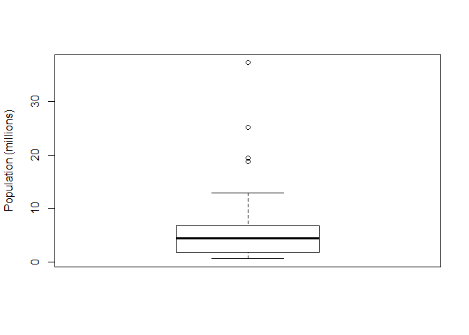<!-- -->

``` r
breaks <- seq(min(state[["Population"]]), max(state[["Population"]]), length.out = 11)
pop_freq <- cut(state[["Population"]], breaks = breaks, right = TRUE, include.lowest = TRUE)
table(pop_freq) # bin의 크기가 첫번째 bin을 제외하고  37로 동일
```

    ## pop_freq
    ## [5.64e+05,4.23e+06]  (4.23e+06,7.9e+06]  (7.9e+06,1.16e+07] 
    ##                  24                  14                   6 
    ## (1.16e+07,1.52e+07] (1.52e+07,1.89e+07] (1.89e+07,2.26e+07] 
    ##                   2                   1                   1 
    ## (2.26e+07,2.62e+07] (2.62e+07,2.99e+07] (2.99e+07,3.36e+07] 
    ##                   1                   0                   0 
    ## (3.36e+07,3.73e+07] 
    ##                   1

빈도표와 백분위수 모두 데이터를 bin을 생성함으로써 요약한다. 차이점은 빈도표는 bin의 크기가 모두 동일한 반면 백분위수는
bin의 크기가 다르고 bin마다 빈도 수가 동일하다.

``` r
hist(state[["Population"]], breaks = breaks)
```

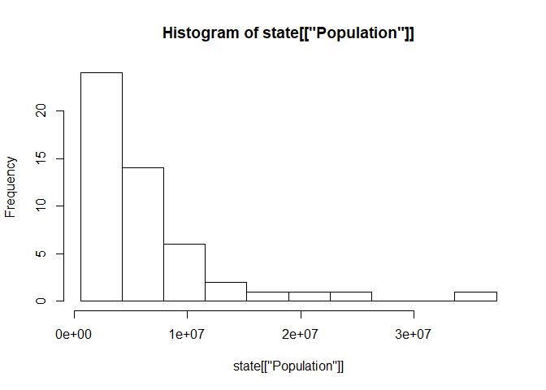<!-- -->

### Density Estimates

``` r
hist(state[["Murder.Rate"]], freq = FALSE)
lines(density(state[["Murder.Rate"]]), lew = 3, col = "blue")
```

    ## Warning in plot.xy(xy.coords(x, y), type = type, ...): "lew"는 그래픽 매개
    ## 변수가 아닙니다

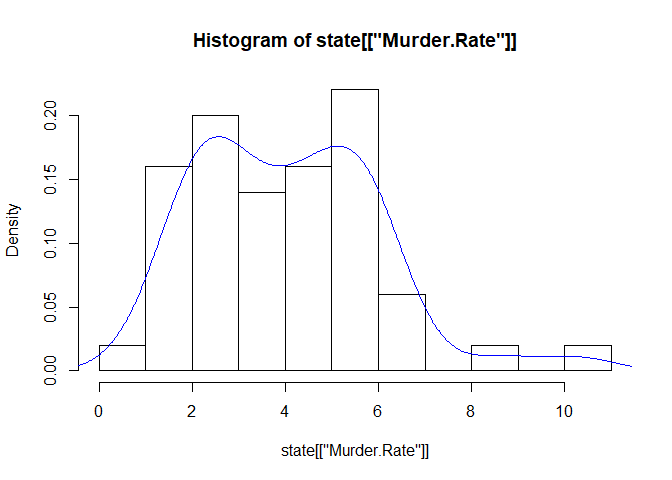<!-- -->

## Exploring Binary and Categorical Data

Converting numeric data to categorical data is an important and widely
used step in data analysis since it reduces the complexity (and size) of
the data

``` r
dfw_airline %>% 
  gather(cause, val) %>% 
  ggplot(aes(cause, val)) +
    geom_col() +
    scale_y_continuous(
      labels = function(y) y / 6 # 6년간 데이터여서
    )
```

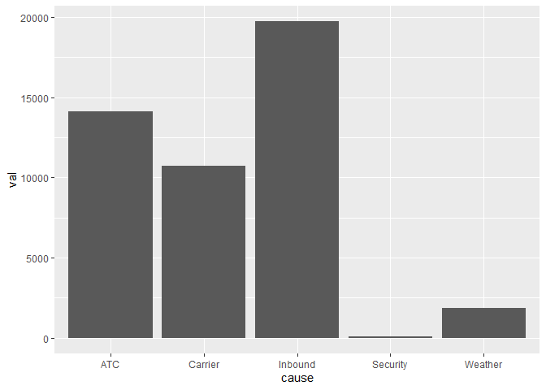<!-- -->

## Correlation

``` r
etfs <- sp500_px[row.names(sp500_px)>"2012-07-01",
sp500_sym[sp500_sym$sector=="etf", 'symbol']]
library(corrplot)
corrplot(cor(etfs), method = "ellipse")
```

`cor`함수도 `trim`인자를 제공한다.

데이터가 작다면 이상치에 robust한 Spearman’s rho or Kendall’s tau도 있다.

주의: 데이터를 랜덤하게 재배치하면 우연히 상관계수가 양수나 음수가 될 수도 있다.

## Exploring Two or More Variables

아주 큰 데이터에서는 산점도 보다는..

``` r
kc_tax0 <- kc_tax %>% 
  filter(TaxAssessedValue < 750000 & SqFtTotLiving>100 & SqFtTotLiving<3500)

ggplot(kc_tax0, aes(SqFtTotLiving, TaxAssessedValue)) +
  geom_hex(color = "white") +
  theme_bw() +
  # scale_fill_viridis_c()
  scale_fill_gradient(low = "white", high = "blue") +
  labs(x = "Finished Squared Feet", y = "Tax Assessed Value")
```

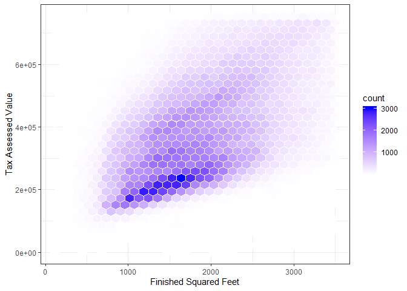<!-- -->
main 구름위에 두번째 구름이 집의 크기는 동일하지만 더 높은 과세 평가액을 갖는다.

``` r
ggplot(kc_tax0, aes(SqFtTotLiving, TaxAssessedValue)) +
  theme_bw() +
  geom_point(alpha = 0.1) +
  geom_density2d(color = "white") +
  labs(x = "Finished Square Feet", y = "Tax Assessed Value")
```

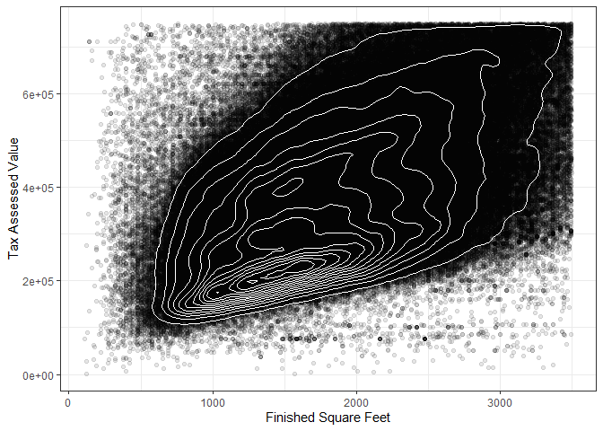<!-- -->
두번째 peak를
주목하자\!

### Two Categorical Variables

``` r
library(descr)
```

    ## Warning: package 'descr' was built under R version 3.5.3

``` r
x_tab <- CrossTable(lc_loans$grade, lc_loans$status, prop.c = FALSE, prop.chisq = FALSE, prop.t = FALSE)
```

### Categorical and Numerical Data

``` r
ggplot(airline_stats, aes(airline, pct_carrier_delay)) +
  geom_boxplot()
```

    ## Warning: Removed 28 rows containing non-finite values (stat_boxplot).

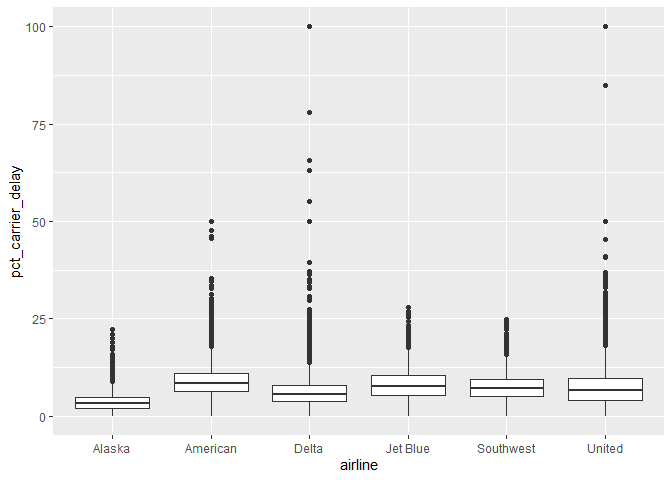<!-- -->

### Visualizing Multiple Variables

``` r
kc_tax0 %>% 
  filter(ZipCode %in% c(98188, 98105, 98108, 98126)) %>% 
  ggplot(aes(SqFtTotLiving, TaxAssessedValue)) +
    geom_hex(color = "white") +
    theme_bw() +
    scale_fill_gradient(low = "white", high = "blue") +
  labs(x="Finished Square Feet", y="Tax Assessed Value") +
facet_wrap("ZipCode")
```

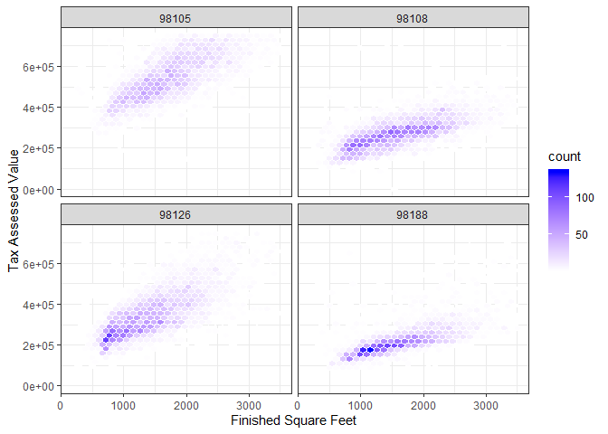<!-- -->

# Ch2. Data and Sampling Distributions

## Random Sampling and Sample Bias

sample bias를 조심하라.

  - self-selection sampling bias: 리뷰는 제출하는 사람이 무작위로 선택되지 않았기 때문에 편향이
    발생하기 쉽다. self-selection sampling bias는 상황을 정확히 파악하기 위한 지표로는
    사용이 어려울 수 있으나, 어떤 시설을 비슷한 시설과 단순 비교할 때는 오히려 더 신뢰할 만하다. 비슷한
    self-selection bias가 각각의 경우에 동일하게 적용될 수 있기 때문이다.

### Bias

random chance에 의한 error와 bias에 의한 error의 구분은 아주 중요하다.

### Random Selection

유동적인 상황에서 표본추출을 해야 할 경우 시기가 중요할 수 있다.(평일 오전 10시의 웹 방문자와 주말 오후 10시의 웹
방문자가 다를 수 있다.)

### Size versus Quality: When Does Size Matter?

빅데이터 시대라고 해도 의외로 데이터 개수가 적을수록 더 유리한 경우가 있다. 랜덤표본추출에 시간과 노력을 기울일수록 편향이 줄
뿐만 아니라 데이터 탐색 및 게이터 품질에 더 집중할 수 있다.

빅데이터의 가치는 데이터가 크고 동시에 희박할 때이다.

  - 임의표본추출은 유용하다
  - bias는 전체 모집단을 대표하지 않기 때문에 일어난다.
  - data quality가 data quantity보다 중요하고 임의표본추출은 bias를 감소시키며 품질향상을 용이하게
    한다.

## Selection Bias

selection bias의 종류 - vast search effect: 큰 데이터 셋에서 반복적으로 다른 모델을 만들고 다른
질문을 하면 흥미로운 것을 찾기 마련이다. 의미가 있는 것일까? 우연히 얻은 것일까? - nonrandom
sampling(self-selection sampling bias) - cherry-picking data - selection
of time intervals that accentuate a particular statistical effect -
stopping an experiment when the results look “interesting”

해결 방안: holdout set, permutation test

### Regression to the Mean

평균으로의 회귀는 어떤 변수를 연속적으로 측정했을 때 나타나는 현상이다. 예외 경우를 특별히 생각하고 의미를 부여하는 것은
선택편향으로 이어진다.

평균으로의 회귀는 선택편향의 특정한 형태의 결과이다.

  - 가설을 구체적으로 명시하고 randomization과 random sampling 원칙에 따라 데이터를 수집하면 편향을
    피할 수 있다.
  - 다른 모든 형태의 데이터 분석은 데이터 수집/ 분석 프로세스에서 생기는 편향의 위험성을 늘 갖고 있다.

## Sampling Distribution of a statistic

우리의 추정치나 모델은 표본에 기반하기 때문에 에러가 있을 수 있다. 우리가 다른 표본을 뽑았다면 결과가 다를 수 있다. 그래서
주된 관심사는 표본 변동성(sampling variability)이다.

``` r
# samp_mean_05 <- loans_income %>% 
#   sample_n(5000) %>% 
#   mutate(idx = rep(1:1000, each = 5)) %>% 
#   group_by(idx) %>% 
#   summarise(mean(x))

loans_income <- loans_income$x
# take a simple random sample
samp_data <- vector("list", 3)
samp_data[[1]] <- tibble(
  income = sample(loans_income, 1000),
  type = "data_dist"
)
samp_data[[2]] <- tibble(
  income = tapply(sample(loans_income, 1000 * 5), rep(1:1000, each = 5), mean),
                       type = "mean_of_5")
samp_data[[3]] <- tibble(
  income = tapply(sample(loans_income, 1000 * 20), rep(1:1000, each = 20), mean),
                       type = "mean_of_20")
income <- bind_rows(samp_data) %>% 
  mutate(type = factor(type, 
                       levels = c("data_dist", "mean_of_5", "mean_of_20"),
                       labels = c("Data", "Mean of 5", "Mean of 20")))

ggplot(income, aes(income)) +
  geom_histogram(bins = 40) +
  facet_wrap(~type, ncol = 1) +
  theme_bw()
```

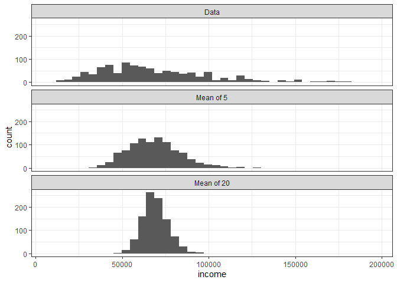<!-- -->

가설검정과 신뢰구간에 있어 CLT의 중요성을 인지하고 있어야 한다. 하지만 표준오차를 추정함에 있어 bootstrap을 사용하면
된다.

  - bootstrap 혹은 CLT에 의존하는 공식을 통해 표본분포를 추정할 수 있다.
  - 표준오차는 표본통계량의 변동성을 요약하는 주요 지표이다.

## The Bootstrap

1.  Draw a sample value, record, replace it.
2.  Repeat n times.
3.  Record the mean of the n resampled values.
4.  Repeat steps 1-3 R times.
5.  Use the R results to:

<!-- end list -->

1.  Calculate their standard deviation(this estimates sample mean
    standard error)
2.  Produce a histogram or boxplot.
3.  Find a confidence interval.

<!-- end list -->

``` r
library(boot)
stat_fun <- function(x, idx) median(x[idx])
boot_obj <- boot(loans_income, R = 1000, statistic = stat_fun)
```

bootstrap의 주의할 점은 최초로 주어진 데이터가 모분포에 근사해야한다는 것이다. 참고로 bias가 양수면 과대추정한다.

<span style="background : yellow">모델 파라미터의 안정성(변동성)을 추정하거나 예측력을 높이기 위해,
bootstrap데이터를 가지고 모델을 돌려볼 수 있다.</span> 분류 및 회귀 트리를 사용할 때, 여러 부트스트랩 샘플을
가지고 트리를 여러 개 만든 다음 각 트리에서 나온 예측값을 평균 내는 것이(분류 문제에서는 과반수 투표를 한다)
일반적으로 단일 트리를 사용하는 것보다 효과적이다. 이 프로세스를 bagging이라고 한다.

주의: 부트스트랩은 표본크기가 작은 것을 보완하기 위한 것이 아니다. 새 데이터를 만드는 것도 아니며 기존 데이터 집합의 빈 곳을
채우는 것도 아니다. 모집단에서 추가적으로 표본을 뽑는다고 할 때, 그 표본이 얼마나 원래 표본과 비슷할지를 알려줄 뿐이다.

  - 부트스트랩은 표본통계량의 변동성을 평가하는 강력한 도구이다.
  - 부트스트랩은 표본분포의 수학적 근사치에 대한 광범위한 연구 없이도 다양한 환경에서 유사한 방식으로 적용될 수 있다.
  - 또한 수학적 근사가 어려운 통계량에 대해서도 샘플링 분포를 추정할 수 있다.
  - 예측 모델을 적용할 때, 여러 부트스트랩 표본들로부터 얻은 예측값을 모아서 결론을 만드는 것(배깅)이 단일 모델을 사용하는
    것보좋 좋다.

부트스트랩 신뢰구간 구하기 1. Draw a radom sample of size n with replacement from
the data 2. Record the statistic of interest for the resample 3. Repeat
steps 1-2 many(R) times. 4. For an x% CI, trim\[(1 - \[x/100\]) / 2\]%
of the R resample results from either end of the distribution. 5. The
trim points are the endpoints of an x% bootstrap CI

## Normal dist & Long-Tailed dist

  - raw data는 보통 정규분포가 아니지만 오차, 평균, 합계는 큰 표본에서 정규분포를 따른다.
  - z-score로 변환하면 데이터가 정규분포를 따르는 것이 아니라 표준정규분포와 비교를 하기 위해 같은 척도로 만들어 줄
    뿐이다.

분포가 소득 데이터와 같이 비대칭하게 기울어져 있거나 이항 데이터같이 이산적일 수 있다. 대칭 및 비대칭 분포 모두 긴 꼬리를
가질 수 있다. Nassim Taleb는 주식시장의 붕괴와 같은 이례적인 사건이, 정규분포로 예측되는 것보다 훨씬 더 자주
일어날 수 있다고 예측하는 black swan theory를 제안했다.

주가 수익률은 데이터의 긴 꼬리 특성을 설명하기 위한 종은 예가 된다.

``` r
nflx <- sp500_data[, "NFLX"]$NFLX
nflx <- diff(log(nflx[nflx > 0]))
qqnorm(nflx)
abline(0, 1, col = "grey")
```


관측된 자료에 적합한 통계 분포를 찾는 작업에 관한 통계적 문헌이 많이 있으므로 너무 데이터만을 보고 판단하지 말자. 예를 들어,
5초마다 연속적으로 서버의 인터넷 트래픽 수준에 대한 데이터를 얻는다고 하자. 포아송 분포가 ’events per time
period’를 모델링하는 데 가장 적합한 분포라는 사전 지식이 있다면 큰 도움이 될 것이다.

  - t분포는 표본평균, 두 표본평균 사이의 차이, 회귀 모수등의 분포를 위한 기준으로 널리 사용된다.
  - 포아송분포는 시간 또는 공간 단위로 표본들을 수집할 때, 그 사건들의 분포를 알려준다.

### Poission & Exponential Dist

  - 지수분포는 사건과 사건 간의 시간 분포를 모델링 할 수 있다.
  - 포아송이나 지수분포에 대한 시뮬레이션 연구에서 핵심은 \(\lambda\)가 해당 기간 동안 일정하게 유지된다는 가정이다.
    전반적으로 이는 거의 적절하지 않다. 그러나 시간 주기 또는 공간을, 일정기간 충분히 동일하도록 영역을 잘 나눈다면, 해당
    기간 내의 분석 및 시뮬레이션이 가능하다.

### Weibull Distribution

사건 발생률은 시간에 따라 일정하지 않다. 하지만 변화 주기가 일반적인 사건 발생 구간보다 훨씬 길다면 문제가 안 된다. 앞서
언급했듯이 비율이 상대적으로 일정한 구간으로 분석을 세분화하면 되기 때문이다. 그러나 사건 발생률이 시간에 따라 지속적으로
변한다면 지수 (또는 포아송)분포는 유용하지 않다. 기계 고장이 대표적이다. 시간이 지날수록 고장 위험은 증가한다. weibull
dist는 지수분포를 확장한 것으로, shape parameter \(\beta\)로 발생률이 달라질 수 있다. \(\beta\)
\> 1 일 경우, 발생률은 시간이 지남에 따라 증가하며, \(\beta\) \< 1이면 감소한다. weibull 분포는 사건
발생률 대신 고장 시간 분석에 사용되기 때문에 두 번째 인자는 구간당 사건 발생률보다는 특성 수명으로 표현된다.

# Ch3. Statistical Experiments and Significance Testing


## A/B Testing

A/B Test는 두 개의 treatments, 제품, 절차 중 어느 쪽이 더 우월한 것을 입증하기 위해 두 개의 그룹으로 나누어
진행하는 실험이다.

Revenue/page-view with price A: mean = 3.87, SD = 51.10
Revenue/page-view with price B: mean = 4.11, SD = 62.98

값이 음수가 될 수 없는데 음수가 될 수 있다고 제안하고 있으므로 표준편차는 유용하지 않다. 이 경우에는 mean absolute
deviation이 더 합리적이다.

  - blind study & double blind study

단일 지표 또는 검정통계량을 사전에 미리 정해놓아야 한다. 실험을 수행한 뒤 나중에 검정통계량을 선택한다면 연구자 편향이라는
함정에 빠지게 된다.

A/B 검정은 마케팅 및 전자 상거래 분야에서 널리 사용되고 있지만 그렇다고 이것이 유일한 통계 실험 유형인 것은 아니다.
추가적인 treatment를 포함할 수 있고, 반복 측정을 할 수 있다. 제약회사의 임상 실험과 같이 대상이 매우
귀하고 비용이 비싸며 측정에 많은 시간이 필요할 경우, 실험을 중간에 중단하고 결론을 얻을 수 있는 장치를 마련해두고 실험을
설계한다.

데이터 과학자는 ‘가격 A와 가격 B의 차이가 통계적으로 유의한가?’ 보다는 ’가능한 여러 가격 중에서 가장 좋은 가격은
얼마일까?’에 관심이 있다. 이러한 실험을 위해서는 Multi-Arm Bandit Algorithm이 필요

  - 연구 대상을 두 가지 이상의 그룹중 하나에 할당한다. 여기서 서로 다른 처리 조건을 제외한 나머지 조건들은 정확히 동일하게
    처리된다.
  - 이상적으로, 대상들은 그룹에 무작위로 배정된다.

사람은 랜덤성을 과소평가하려고 한다. 예를 들어, 동전 던지기에서 앞면이 6번 연속으로 나오면 뭔가 의미 있고 단순한 우연은 아닐
것이다라고 생각하는 경향이 있다는 점이다.

## Resampling

통계학에서 resampling이란 랜덤한 변동성을 알아보자는 일반적인 목표를 가지고, 관찰된 데이터의 값에서 표본을 반복적으로
추출하는 것을 의미한다. 또한 일부 머신러닝 모델의 정확성을 평가하고 향상시키는 데에도 적용할 수 있다.
resamling에는 크게 bootstrap과 permutation test가 있다. bootstrap은 추정치의 신뢰도를
평가하기 위해 이요된다. permutation test는 일반적으로 두 개 이상의 그룹과 관련된 가설을 검증하는 데
사용된다.

### Permutation Test

permutation 과정에서는 두 개 이상의 표본이 관여되며 이들은 통상적으로 A/B 또는 기타 가설검정을 위해 사용되는
그룹들이다.

1.  여러 그룹의 결과를 단일 데이터 집합으로 결합한다.
2.  결합된 데이터를 잘 섞은 후(그러면 이 데이터는 귀무가설 하에서의 분포가 된다.), 그룹 A와 동일한 크기의 표본을 비복원
    추출한다.
3.  나머지 데이터에서 그룹 B와 동일한 크기의 샘플을 비복원 추출한다.
4.  C, D 등의 그룹에 대해서도 동일한 작업을 수행한다.
5.  원래 샘플에 대해 구한 통계량 또는 추정치가 무엇이었든 간에 지금 추출한 재표본에 대해 모두 다시 계산하고 기록한다.
    이것으로 한 번의 permutation 반복이 진행된다.
6.  앞서 단계들을 R번 반복하여 검정통계량의 순열 분포를 얻는다.

관찰된 차이가 순열 분포 바깥에 있다면, 우연 때문이 아니라고 결론 내릴 수 있다: statistically significant

> Example: Web Stickiness

landing page: 온라인광고에 노출된 사용자가 광고메시지에 관심을 가지고 보다 많은 정보 탐색 또는 광고주가 의도한 행동을
하기 위해 광고물을 클릭했을 때 처음 접하게 되는 화면을 랜딩페이지라고 한다.

랜딩페이지의 중요성:

1.  사용자의 의도에 맞는 컨텐츠를 강조하여 방문자에게 확실히 전달 가능
2.  관심 방문자의 상담 또는 문의 내용 DB 수집 용이
3.  유저들의 원하는 정보 및 관심사를 몇 번의 클릭 없이 바로 접근 가능
4.  상세 의도를 가지고 방문한 유저들의 이탈 최소화 기대

<!-- end list -->

``` r
web_page_data <- web_page_data %>% 
  mutate(Time = 60 * Time)
ggplot(web_page_data, aes(Page, Time)) +
  geom_boxplot()
```

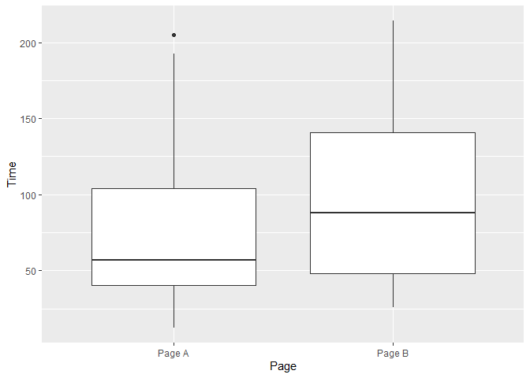<!-- -->

``` r
mean_a <- mean(unlist(web_page_data[web_page_data$Page == "Page A", "Time"]))
mean_b <- mean(unlist(web_page_data[web_page_data$Page == "Page B", "Time"]))
mean_b - mean_a
```

    ## [1] 21.4

``` r
# permutation test
perm_fun <- function(x, n1, n2) {
  n <- n1 + n2
  idx_b <- sample(1:n, n1)
  idx_a <- setdiff(1:n, idx_b)
  mean_diff <- mean(x[idx_b]) - mean(x[idx_a])
  return(mean_diff)
}

perm_diffs <- rep(0, 1000)
for(i in 1:1000)
  perm_diffs[i] <- perm_fun(web_page_data$Time, 21, 15)
hist(perm_diffs, xlab='Session time differences (in seconds)')
abline(v = mean_b - mean_a)
```

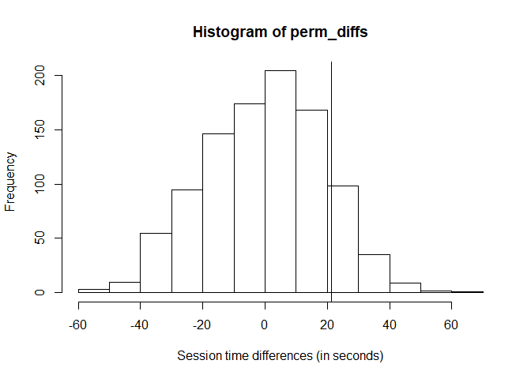<!-- -->

permutation test의 변형

  - An exhaustive permutation test
  - A bootstrap permutation test

exhaustive permutation test = exact test

## Statistical Significance and P-Values

통계적 유의성이란, 통계학자가 자신의 실험 결과가 우연히 일어난 것인지 아니면 우연히 일어날 수 없는 극단적인 건인지를 판단하는
방법이다. 결과가 우연히 벌어질 수 있는 변동성의 바깥에 존재한다면 우리는 이것을 통계적으로 유의하다고 말한다.


가격 A가 가격 B에 비해 0.0368%p 개선되었다. 전환율이 너무 낮아, 실제 필요한 표본크기를 결정하는 데 매우 중요한 값은
200개 정도에 불과하다. 두 전환율 사이에 차이가 있는지를 permutation test를 통해 확인해보자.

1.  Create an urn with all sample results: this represents the supposed
    shared conversion rate of 382 ones and 45945 zeros = 0.8246%
2.  Shuffle and draw out a resample of size 23739 (same n as price A),
    and record how many 1s.
3.  Record the number of 1s in the remaining 22588 (same n as price B).
4.  Record the difference in proportion 1s.
5.  Repeat steps 2-4.
6.  How often was the difference \>= 0.0368?

<!-- end list -->

``` r
obs_pct_diff <- 100*(200/23739 - 182/22588)
conversion <- c(rep(0, 45945), rep(1, 382))
perm_diffs <- rep(0, 1000)
for(i in 1:1000)
  perm_diffs[i] <- 100*perm_fun(conversion, 23739, 22588 )
hist(perm_diffs, xlab='Session time differences (in seconds)')
abline(v = obs_pct_diff)
```

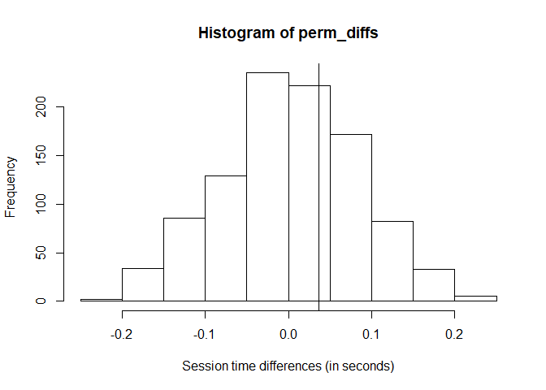<!-- -->

``` r
# p-value
mean(perm_diffs > obs_pct_diff)
```

    ## [1] 0.322

하지만, 이 경우에는 이항분포를 따르기 때문에 정규근사를 이용할 수 있다.

``` r
prop.test(x = c(200, 182), n = c(23739, 22588), alternative = "greater")
```

    ## 
    ##  2-sample test for equality of proportions with continuity
    ##  correction
    ## 
    ## data:  c(200, 182) out of c(23739, 22588)
    ## X-squared = 0.14893, df = 1, p-value = 0.3498
    ## alternative hypothesis: greater
    ## 95 percent confidence interval:
    ##  -0.001057439  1.000000000
    ## sample estimates:
    ##      prop 1      prop 2 
    ## 0.008424955 0.008057376

p 값의 의미: 랜덤 모델이 주어졌을 때, 그 결과가 관찰된 결과보다 더 극단적일 확률

1.  p값은 이 데이터가 특정 통계 모델과 얼마나 상반되는지 나타낼 수 있다.
2.  p값은 연구 가설이 사실일 확률이나, 데이터가 랜덤하게 생성되었을 확률을 측정하는 것이 아니다.
3.  과학적 결론, 비즈니스나 정책 결정은 p값이 특정 임계값을 통과하는지 여부를 기준으로 해서는 안 된다.
4.  적절한 추론을 위해서는 완전한 보고와 투명성이 요구된다.
5.  p값 또는 통계적 유의성은 효과의 크기나 결과의 중요성을 의미하지 않는다.
6.  p값 그 자체는 모델이나 가설에 대한 증거를 측정하기 위한 좋은 지표가 아니다.

다중검정시 \(1 - (1 - \alpha)^n\) 문제에 주의하자. 이것은 오버피팅과 관련이 있다.

## Multiple Testing

중복 문제:

  - 여러 그룹 간의 짝별 차이를 조사하는 것
  - 여러 부분 그룹에서의 결과를 알아보는 것(전반적으로는 아무런 유의미한 결과를 찾을 수 없었다. 하지만 30세 미만 미혼
    여성들에서는 어떤 효과를 발견했다.)
  - 여러 가지 통계 모형을 적용
  - 모델에서 많은 변수들을 사용하는 것
  - 수많은 서로 다른 질문들(서로 다른 가능한 결과들)을 묻는 것

false discovery rate은 원래 주어진 여러 개의 가설검정들 가운데 하나가 유의미한 효과가 있다고 잘못 판단하는
비율을 나타내는 데 사용되었다. 이것은 분류 문제를 다루는 데에도 사용된다. 이때의 false discovery은 한
레코드를 잘못 분류한 것을 의미한다.

  - 연구 조사나 데이터 마이닝 프로젝트에서 다중성은 일부가 우연히 유의미하다는 결론을 내릴 위험을 증가시킨다.
  - 여러 통계 비교와 관련된 상황의 경우 통계적 수정 절차가 필요하다
  - 데이터 마이닝에서, 라벨이 지정된 결과변수가 있는 홀드아웃 표본(즉 분류 결과를 알고 있는)을 사용하면 잘못된 결과를 피할
    수 있다.

[False Discovery
Rate](https://ratsgo.github.io/machine%20learning/2017/05/07/FDR/) \>
\#\# ANOVA

1.  모든 데이터를 한 상자에 모은다.
2.  5개의 값을 갖는 4개의 재표본을 섞어서 추출한다.
3.  각 그룹의 평균을 기록한다
4.  네 그룹 평균 사이의 분산을 기록한다.
5.  2~4단계를 여러 번 반복한다.

<!-- end list -->

``` r
library(lmPerm)
```

    ## Warning: package 'lmPerm' was built under R version 3.5.3

``` r
summary(aovp(Time ~ Page, data = four_sessions))
```

    ## [1] "Settings:  unique SS "

    ## Component 1 :
    ##             Df R Sum Sq R Mean Sq Iter Pr(Prob)  
    ## Page1        3    831.4    277.13 5000   0.0762 .
    ## Residuals   16   1618.4    101.15                
    ## ---
    ## Signif. codes:  0 '***' 0.001 '**' 0.01 '*' 0.05 '.' 0.1 ' ' 1

여기서 p 값은 재표집된 분산이 관찰된 데이터의 분산을 초과하는 비율이다.

``` r
summary(aov(Time ~ Page, data = four_sessions))
```

    ##             Df Sum Sq Mean Sq F value Pr(>F)  
    ## Page         3  831.4   277.1    2.74 0.0776 .
    ## Residuals   16 1618.4   101.2                 
    ## ---
    ## Signif. codes:  0 '***' 0.001 '**' 0.01 '*' 0.05 '.' 0.1 ' ' 1

ANOVA의 결과 중 유용한 점 중 하나는 그룹 처리, 상호작용 효과, 오차와 관련된 분산의 구성 요소들을 구분하는 데 있다.

## Chi-Square Test

1.  Constitute a box with 34 ones and 2966 zeros
2.  Shuffle, take three separate samples of 1000, and count the clicks
    in each.
3.  Find the squared differences between the shuffled counts and the
    expected counts, and sum them.
4.  Repeat steps 2 and 3, say, 1000 times.
5.  How often does the resampled sum of sqared deviations exceed the
    oserved? That’s the p-value.

<!-- end list -->

``` r
clicks <- xtabs(Rate ~ Click + Headline, data = click_rates)
chisq.test(clicks, simulate.p.value = TRUE)
```

    ## 
    ##  Pearson's Chi-squared test with simulated p-value (based on 2000
    ##  replicates)
    ## 
    ## data:  clicks
    ## X-squared = 1.6659, df = NA, p-value = 0.4853

``` r
chisq.test(clicks)
```

    ## 
    ##  Pearson's Chi-squared test
    ## 
    ## data:  clicks
    ## X-squared = 1.6659, df = 2, p-value = 0.4348

``` r
fisher.test(clicks)
```

    ## 
    ##  Fisher's Exact Test for Count Data
    ## 
    ## data:  clicks
    ## p-value = 0.4824
    ## alternative hypothesis: two.sided

대부분의 실험에서 통계적 유의성을 조사하는 것이 목적이 아니라 최적의 treatment를 찾는 것이다. multi-armed
bandits이 더 정확한 해결책이다. 카이제곱 검정의 데이터사이언스로의 응용은 특히 피셔의 정확검정을 활용하는 예로 웹 실험에
적합한 표본크기를 판별하는 일을 들 수 있다. 이러한 실험은 종종 클릭율이 매우 낮기 때문에 수천 번의 싫머에도 불구하고 집계
비율이 너무 낮아 실험을 통해 확실한 결론을 내리기 어렵다. 이러한 경우 피셔의 정확검정, 카이제곱검정, 그리고 기타 검정은
검정력이나 표본크기를 계산하는 데 유용할 수 있다.

## Multi-Arm Bandit Algorithm

MAB알고리즘은 실험설계에 대한 전통적인 통계적 접근 방식보다 명시적인 최적화와 좀 더 빠른 의사 결정을 가능하게 하며, 여러
테스트, 특히 웹 테스트를 위해 이를 사용한다. epsilon-greedy algorithm과 좀 더 복잡한 알고리즘인
Thompson’s samling을 사용하는 알고리즘이 있다. 톰슨 샘플링은 베이지안 방식을 사용한다. beta 분포를 사용하여
수익의 일부 사전 분포를 가정한다. 각 추출 정보가 누적되면서 정보가 업데이트되기 때문에, 다음번에 최고 손잡이를 선택할
확률을 효과적으로 최적화할 수 있다.

  - 전통적 A/B검정은 임의표집 과정을 기본으로 하기 때문에, 수익이 낮은 것을 너무 많이 시도할 수 있다.
  - 이와 대조적으로 MAB는 실험 도중에 얻은 정보를 통합하고 수익이 낮은 것의 빈도를 줄이는 쪽으로 표본추출 과정을
    변경한다.
  - 또한 두 가지 이상의 처리를 효과적으로 다룰 수 있다.
  - 추출 확률을 수익이 낮은 처리에서 수익이 높으리라 추정되는 쪽으로 이동시키기 위한 다양한 알고리즘이 존재한다.

## Power and Sample Size

검정력이란 바로 특정 표본 조건에서 특저안 효과크기를 알아낼 수 있는 확률을 의미한다. A/B test을 위해 데이터를 수집하고
처리하는 데 비용이 발생하는 경우 사용한다. 1. 최대한 (사전 정보를 이용해서) 결과 데이터가 비슷하게 나올 수 있는 가상의
데이터를 생각해보자. 예를 들면 타자를 위해 20개의 1과 80개의 0이 들어 있는 상자를 생각한다든지, 아니면 웹 페이제 방문
시간을 관측한 자료가 담겨 있는 상자를 생각할 수 있다. 2. 첫 표본에서 원하는 효과크기를 더해서 두 번째 표본을 만든다.
예를 들면 33개의 1과 67개의 0을 가진 두 번째 상자, 혹은 각 초기 방문시간에 25초를 더한 두 번째 상자를 만들 수
있다. 3. 각 상자에서 크기 n인 부트스트렙 표본을 추출한다 4. 두 부트스트렙 표본에 대해서 순열 가설검정을 진행한다(혹은
수식 기반의 가설검정). 그리고 여기에 통계적으로 유의미한 차이가 있는지 기록한다. 5. 3~4단계를 여러 번 반복한 후, 얼마나
자주 유의미한 차이가 발견되는지 알아본다. 이 확률이 바로 검정력 추정치다.

``` r
# 표본크기 정하기
pwr.2p.test(h = ..., n = ..., sig.level = ..., power = )
h= effect size (as a proportion)
n = sample size
sig.level = the significance level (alpha) at which the test will be conducted
power = power (probability of detecting the effect size)
```

  - 통계 검정을 수행하기 앞서, 어느 정도의 표본크기가 필요한지 미리 생각할 필요가 있다.
  - 알아내고자 하는 효과의 최소 크기를 지정해야 한다.
  - 또한 효과크기를 알아내기 위해 요구되는 확률(검정력)을 지정해야 한다.
  - 마지막으로, 수행할 가설검정에 필요한 유의수준을 정해야 한다.

# Ch4. Regression and Prediction

> Cross-Validation

1.  1/k의 데이터를 홀드아웃 샘플로 따로 떼어놓는다.
2.  남아 있는 데이터로 모델을 훈련시킨다
3.  모델을 1/k 홀드아웃에 적용하고 필요한 모델 평가 지표를 기록한다.
4.  데이터의 첫 번째 1/k을 복원하고 다음 1/k을 따로 보관한다.
5.  2~3단계를 반복한다.
6.  모든 레코드가 홀드아웃 샘플로 사용될 때까지 반복한다.
7.  모델 평가 지표들을 평균과 같은 방식으로 결합한다.

penalized regression는 개념적으로 AIC와 같다. 개별 모델 집합들을 명시적으로 검색하는 대신 모델 적합 방정식에
많은 변수에 대해 모델에 불이익을 주는 제약 조건을 추가한다. 단계적, 전진선택, 후진선택처럼 예측변수를 완전히 제거하는 대신,
벌정회귀에서는 계수 크기를 감소시키거나 경우에 따라 거의 0으로 만들어 벌점을 적용한다. ridge regression and
lasso regression.

stepwise and all subset regression are in-sample methods to assess and
tune models. 오버피팅 될 수 있으며, 새 데이터를 적용할 때 잘 맞지 않을 수도 있다. In linear
regression, overfitting is typically not a major issue, due to the
simple (linear) global structure imposed on the data. For more
sophisticated types of models, particularly iterative procedures that
respond to local data structure, CV is a very important tool.

> Weighted Regression

복잡한 설문 분석에 중요하다.

  - Inverse-variance weighting when different observations have been
    measured with different precision.
  - Analysis of data in an aggregated form such that the weight variable
    encodes how many original observations each row in the aggregated
    data represents.

<!-- end list -->

``` r
library(lubridate)
house$year <- year(house$DocumentDate)
# 2005년 이래 지난 연수를 가중치로 사용
house$Weight <- house$Year - 2005
house_wt <- lm(AdjSalePrice ~ SqFtTotLiving + SqFtLot + Bathrooms + Bedrooms + BldgGrade, data=house, weight=Weight)
round(cbind(house_lm=house_lm$coefficients,
house_wt=house_wt$coefficients), digits=3)
```

  - Extrapolation beyond the range of the data can lead to error.
  - Confidence intervals quantify uncertainty around regression
    coefficients.
  - Prediction intervals quantify uncertainty in individual predictions.
  - Most software, R included, will produce prediction and confidence
    intervals in default or specified output, using formulas.
  - The bootstrap can also be used; the interpretation and idea are the
    same.

## Factor Variables in Regression

Reference coding: 통계학자들이 많이 사용하는 코딩 형태. 여기서 한 요인을 기준으로 하고 다른 요인들이 이 기준에
따라 비교할 수 있도록 한다(유의어: treatment coding). 첫 번째 팩터 레벨을 reference로 사용한다.
One hot encoder: 머신러닝 분야에서 많이 사용되는 코딩. 모든 요인 수준이 계속 유지된다. 특정 머신러닝 알고리즘에는
유용한 반면, 다중회귀분석에는 적절하지 않다. nearest neighbor와 tree model에서 사용 Deviation
coding: 기준 수준과는 반대로 전체 평균에 대해 각 수준을 비교하는 부호화 방법 Polynomial coding:
ordered factor에 적절하다.

#### Factor Variables with Many Levels

어떤 요인변수는 가능한 수준의 수가 많아, 많은 양의 이진 더미를 생성할 수 있다. 예를 들면, 우편번호는 요인변수이며 미국에는
43000개의 우편번호가 있다. 이러한 경우 데이터와 예측변수와 결과 간의 관계를 탐색하여 유용한 정보가 범주에 포함되는지 여부를
판단하는 것이 유용하다. 그렇다면 모든 요소를 유지하는 것이 좋을지 아니면 수준을 통합하는 것이 나을지를 결정해야 한다.

ZipCode는 주택 가격에 대한 위치의 효과의 proxy이기 때문에 중요한 변수이다. 우편번호 중 몇몇은 매물이 하나뿐인 경우도
있다. 따라서 통합이 필요하다. 대도시 지역의 지리적 위치에 대응되는 처음 두 자리 또는 세 자리만을 사용하여 우편번호를 통합할
수 있다. 하지만 King County에 경우 거의 모든 판매가 980xx 또는 981xx에서 이루어지기 때문에 이런 방법이
큰 도움이 되지 않는다.

대안은 매매 가격과 같은 다른 변수에 따라 우편번호를 그룹으로 묶는 것이다. 아니면 초기 모델의 잔차를 사용하여 우편번호 그룹을
만드는 방법도 좋다.

``` r
zip_groups <- house %>% 
  mutate(resid = residuals(house_lm)) %>% 
  group_by(ZipCode) %>% 
  summarise(med_resid = median(resid), # 이상치에 덜 민감한 중앙값
            cnt = n()) %>% 
  arrange(med_resid) %>% 
  mutate(cum_cnt = cumsum(cnt),
         ZipGroup = ntile(cum_cnt, 5))
house <- house %>% 
  left_join(select(zip_groups, ZipCode, ZipGroup), by = "ZipCode")
```

## Interpreting the Regression Equation

Bedrooms의 계수가 음수이다. 침실 계수를 늘릴수록 그 가치가 감소한다는 것을 의미한다. 이는 예측변수들이 서로 연관되어
있기 때문이다. 집이 클수록 침실이 더 많은 경향이 있으며, 침실 수보다는 주택의 크기가 주택 가격에 더 큰 영향을 준다.
똑같은 크기의 두 집이 있다고 하면, 작은 크기의 침실이 여러 개 있는 것을 선호하지 않는 것이 합리적이다.

이렇게 상호 연관된 예측변수들을 사용하면 회귀계수의 부호와 값의 의미를 해석하기가 어려울 수 있다. 침실 수, 평수, 욕실 수에
대한 변수들은 모두 상관관계가 있다. 이 세 변수를 제거한 후 모형은

`update(step_lm, . ~ . -SqFtTotLiving - SqFtFinBasement - Bathrooms)` 침실
수에 대한 계수가 양수로 바뀐다.

상호 연관된 변수들은 회귀 계수를 해석할 때 한가지 문제일 뿐이다. *house\_lm*에는 주택의 위치를 설명하는 변수가 없어서
모델은 서로 다른 유형의 지역이 섞여 있다. Location은 ***confounding variable***일 지도 모른다.

### Multicollinearity

회귀분석에서는 다중공선성 문제를 반드시 해결해야 한다. 다중공선성이 사라질 때까지 변수를 제거해야 한다. perfect
multicollinearity는 패키지들이 알아서 해결을 해 주지만, nonperfect multicollinearity인
경우는 결과가 불안정할 수 있다.

다중공선성은 tree, clustering, and nearest-neighbors같은 방법에서는 그다지 문제가 되지 않으며,
이들 방법에서는 P-1개 대신에 P개의 dummy variable을 유지하는 것이 좋다. 물론 이러한 방법에서도 예측변수의
비중복성은 유지하자.

### Confounding Variables

house\_lm을 다시 생각해보자. SqFtLot, Bathrooms, and Bedrooms는 모두 음수였다. 이전에 만든
ZipGroup을 포함해보자. 회귀 계수를 보면 ZipGroup이 아주 중요한 변수임을 알 수 있고 SqFtLot and
Bathrooms은 이제 양수이며 Bedroom은 여전히 음수이다. 그렇게 직관적이지는 않지만, 이것은 부동산 업계에서 잘 알려진
현상이다. 살기 좋은 지역에서는 욕실 수가 같은 주택의 경우 작은 침실이 여러 개 있으면 오히려 값어치가 떨어진다.

### Interactions and Main Effects

모델에서 주효과만 사용한다면, 여기에는 예측변수와 응답변수 간의 관계가 다른 예측변수들에 대해 독립적이라는 암묵적인 가정이 있다.
하지만 이것은 종종 사실이 아니다.

예를 들어, King County 주택 데이터에서, 부동산에서 위치가 가장 중요하다는 사실은 모두 알고 있다. 주택 크기와 매매
가격 간의 관계가 위치에 달려 있다고 가정하는 것은 자연스러운 일이다. 임대료가 싼 지역에 지어진 큰 집은 비싼 지역에 지어진
큰 집과 같은 가치를 유지하기가 어려울 것이다.

#### Model Selection with Interactions Terms

  - In some problems, prior knowledge and intition can guide the choice
    of which interaction terms to include in the model.
  - Stepwise selection can be used to sift through the various models.
  - Penalized regression can automatically fit to a large set of
    possible interaction terms.
  - Perhaps the most common approach is the use tree models, as well as
    their descendents, randomforest and gradient boosted trees. This
    class of models automatically searches for optimal interaction terms

주요 개념

  - 예측변수들 사이의 상관성 때문에, 다중선형회귀에서 계수들을 해석할 때는 주의해야 한다.
  - 다중공선성은 회귀방적식을 적합할 때, 수치 불안정성을 유발할 수 있다.
  - confounding variable이란 모델에서 생략된 중요한 예측변수를 의미하며, 이에 따라 실제로 관계가 없는데
    허위로 있는 것처럼 결과가 나올 수 있다.
  - 변수와 결과가 서로 의존적일 때, 두 변수 사이의 상호작용을 고려할 필요가 있다.

## Testing the Assumptions: Regression Diagnostics

### Outliers

이상치는 사기 사건이나 갑작스러운 사건 발생과도 관련이 있다. 따라서 이상치를 발견하는 것은 아주 중요한 비즈니스 니즈가 될 수
있다.

### Influential Values

회귀모형에서 제외됐을 때 중요한 변화를 가져오는 값을 영향치라고 한다. 회귀분석에서, 잔차가 크다고 해서 모두 이런 값이 되는
것은 아니다. hat-value가 2(p + 1)/n 이상인 값들은 레버리지가 높은 데이터 값을 나타낸다. *Cook’s
distance*는 레버리지와 잔차의 크기를 합쳐서 영향력을 판단한다. 쿡의 거리가 4 / (n - p - 1)보다 크면 영향을
크게 미친다.

회귀모형을 적합하는 목적이 새로 들어오는 값에 대해 믿을 만한 예측값을 얻기 위함이라면, 데이터의 크기가 작을 경우에만 영향력이
큰 관측 데이터를 확인하는 작업이 유용하다. 데이터수가 클 경우, 어떤 한 값이 회귀방정식에 엄청난 변화를 가져오기란 쉽지
않다. 물론 이상 검출이 목적이라면 높은 영향력의 값들을 찾는 것이 도움이 된다.

## Heteroskedasticity, Non-Normality and Correlated Errors

``` r
df <- data.frame(
resid = residuals(lm_98105),
pred = predict(lm_98105))
ggplot(df, aes(pred, abs(resid))) +
  geom_point() +
  geom_smooth()
```


#### scatterplot smoothers

회귀모형을 평가할 때는 두 변수 사이의 관계를 시각적으로 강조하기 위해 scatterplot smoother가 유용하다. 예를
들면 절대잔차와 예측값 간의 관계를 부드럽게 나타낸 곡선을 통해, 잔차의 분산이 잔차의 값에 의존한다는 것을 쉽게 알 수
있다.

이분산성은 예측값이 어떤 경우에는 맞고 어떤 경우에는 틀리다는 것을 나타내며, 얻은 모델이 불완전하다는 것을 알려준다. 예를 들면
lm\_98105의 이분산성은 회귀모형이 가격이 너무 높거나 낮은 주택에 대해서는 잘 설명하지 못한다는 것을 나타낸다.

### Partial Residual Plots and Nonlinearity

\[Partial residual = Residual + \hat b_iX_i\]

``` r
# Partial regression plot(added variable plot)그리기 
# y축이 resid(lm(y ~ . -특정x)) x축이 resid(lm(특정x ~ .))
library(car)
residualPlots()

# 위와는 다른 방법
# 책에서는 y축이 partial residual, x축이 해당 변수
df <- data.frame(SqFtTotLiving = house_98105[, 'SqFtTotLiving'],
Terms = terms[, 'SqFtTotLiving'],
PartialResid = partial_resid[, 'SqFtTotLiving'])
ggplot(df, aes(SqFtTotLiving, PartialResid)) +
  geom_point(shape=1) + scale_shape(solid = FALSE) +
  geom_smooth(linetype=2) +
  geom_line(aes(SqFtTotLiving, Terms))
```


partial residual은 SqFtTotLiving가 주택 가격에 얼마나 영향을 미치는지 보여준다.
SqFtTotLiving와 가격 사이의 관계는 분명히 비선형이다. 회귀선에 따르면 1000제곱피트보다 작은 평슈의 집에
대해서는 가격을 원래보다 낮게 추정하고, 2000~3000제곱피트 집에 대해서는 더 높게 추정하고 있다.
4000제곱피트 이상에 관해서는 데이터 개수가 너무 작아 뭐라고 결론을 내릴 수 없다.

주요 개념

  - 이상치는 데이터 크기가 작을 때 문제를 일으킬 수 있지만 주요 관심사는 데이터에서 문제점을 발견한다든지 이상을 찾아내는
    것이다.
  - 데이터 크기가 작을 때는 단일 레코드가 회귀방정식에 큰 영향을 미치는 경우도 있다. 하지만 빅데이터에서는 이러한 효과가
    대부분 사라진다.
  - 회귀모형을 일반적인 추론(p값 등)을 위해 사용할 경우 잔차 분포에 대한 특정 가정을 확인해야 한다. 하지만 보통 데이터
    과학에서 잔차의 분포는 그렇게 중요하지 않다.
  - partial residuals plot을 사용하여 각 회귀 항의 적합성을 정량적으로 평가할 수 있다. 즉 대체 모델에
    대한 아이디어를 얻을 수 있다.

#### partial residual plot vs partial regression plot

**Def(Partial residual plot)**: In applied statistics, a partial
residual plot is a graphical technique that attempts to show the
relationship between a given independent variable and the response
variable given that other independent variables are also in the model.

주의: Although they can often be useful, they can also fail to indicate
the proper relationship. In particular, if Xi is highly correlated with
any of the other independent variables, the variance indicated by the
partial residual plot can be much less than the actual variance. These
issues are discussed in more detail in the references given below

**Def(Partial regression plot)**: In applied statistics, a partial
regression plot attempts to show the effect of adding another variable
to a model that already has one or more independent variables. Partial
regression plots are also referred to as added variable plots, adjusted
variable plots, and individual coefficient plots.

Partial regression plots are formed by:

1.  Computing the residuals of regressing the response variable against
    the independent variables but omitting \(X_i\)
2.  Computing the residuals from regressing \(X_i\) against the
    remaining independent variables
3.  Plotting the residuals from (1) against the residuals from (2).

Velleman and Welsch\[1\] list the following useful properties for this
plot:

1.  The least squares linear fit to this plot has the slope \(\beta_i\)
    and intercept zero.
2.  The residuals from the least squares linear fit to this plot are
    identical to the residuals from the least squares fit of the
    original model (Y against all the independent variables including
    Xi).
3.  The influences of individual data values on the estimation of a
    coefficient are easy to see in this plot.
4.  It is easy to see many kinds of failures of the model or violations
    of the underlying assumptions (nonlinearity, heteroscedasticity,
    unusual patterns). .

**차이점**: partial regression plot은 대부분 큰 레버리지 점과 크지 않는 레버리지 영향점을 확인하는데
이용된다. 반면에, partial residual plot은 대부분 \(Y\)와 \(X_i\)의 관계를 확인하기 위해
사용된다. 잔차 플랏의 두 셋 사이의 단순 상관관계가 반응변수와 \(X_i\)사이의 부분 상관관계와 동일하기 때문에,
partial regression plot은 반응변수와 \(X_i\)사이의 선형 관계의 정확한 정도를 보여줄 수 있다. (실제로,
`lm(resid(lm(y ~ . -특정x)) ~ resid(lm(특정x ~ .)))`의 \(R^2\)만큼 변이를 설명한다.)
이것은 partial residual plot에서는 사실이아니다. 반면에, partial regression plot에서
x축은 \(X_i\)가 아니다. 이것은 변수변환을 위한 필요를 결정하는 데에 유용함을 제한한다.(변수변환은 partial
residual plot의 주요 사용 목적)

## Polynomial and Spline Regression

통계학자들이 비선형 회귀에대해 이야기할 때 최소제곱법으로 적합할 수 없는 모델을 나타낸다. 설명변수들 또는 변환한 설명변수들의
선형 결합으로 표현될 수 없는 반응변수를 가지는 모델을 말한다. 비선형모델은 수치적 최적화를 필요로 하기 때문에 적합이
어렵고 더 많은 계산을 필요로 한다. 이러한 이유로 일반적으로 가능하면 선형 모형을 선호한다.

### Polynomial


### Splines

spline에 대한 기술적 정의는 일련의 조각별 연속 다항식을 뜻한다. 구간별 다항식은 예측변수를 위한 일련의 고정된
점(knot)사이를 부드럽게 연결한다. spline을 구하는 것은 polynomail regression보다 훨씬 복잡하다.
cf. [Introduction to
spline2](https://cran.r-project.org/web/packages/splines2/vignettes/splines2-intro.html)

``` r
library(splines)
knots <- quantile(house_98105$SqFtTotLiving, p=c(.25, .5, .75))
lm_spline <- lm(AdjSalePrice ~ bs(SqFtTotLiving, knots=knots, degree=3) +
SqFtLot + Bathrooms + Bedrooms + BldgGrade, data=house_98105)
```

다항식의 차수와 knot를 설정해야 한다.

선형 항에서는 계수가 변수에 대한 직접적인 의미를 갖는 반면, spline 항에서는 해석이 힘들다. 대신, spline의 적합도를
확인하기 위해 시각화를 하자. polynomial에 비해 spline이 좀 더 매끄럽게 매칭되며 유연성이 뛰어나다. 하지만 이것이
spline regression 이 더 좋다는 것을 의미하지는 않는다. 크기가 아주 작은 주택이 약간 큰 주택보다 더 높은 가치를
가질 것이라는 예측 결과는 경제적으로 맞지 않다. 이것은 confounding variable 때문일 수 있다.


### Generalized Additive Models

GAM은 spline회귀를 자동으로 적합하는 기술이다.

``` r
library(mgcv)
lm_gam <- gam(AdjSalePrice ~ s(SqFtTotLiving) + SqFtLot + Bathrooms + Bedrooms + BldgGrade,
data=house_98105)
```


주요 개념

  - 회귀분석에서 이상치는 잔차가 큰 레코드를 말한다
  - 다중공선성은 회귀식을 적합할 때 수치적 불안정성을 가져올 수 있다.
  - confounding variable은 모델에서 생략된 중요한 예측변수이며 허위 관계를 보여주는 회귀 결과를 낳을 수
    있다.
  - 한 변수의 효과가 다른 변수의 수준에 영향을 받는다면 두 변수 사이의 상호작용을 고려할 항이 필요하다.
  - 다항회귀분석은 예측변수와 결과변수 간의 비선형 관계를 검증할 수 있다.
  - spline은 knot들로 함께 묶여 있는 일련의 구간별 다항식을 말한다.
  - GAM은 spline의 knot를 자동으로 결정하는 프로세스를 가지고 있다.

# Ch5. Classification

1.  어떤 레코드가 속할 거라고 생각되는 관심 클래스에 대한 cutoff 확률을 정한다.
2.  레코드가 관심 클래스에 속할 확률을 (모든 모델과 함께) 추정한다.
3.  그 확률이 컷오프 확률 이상이면 관심 클래스에 이 레코드를 할당한다.

#### More than two categories?

결과가 세 개 이상인 경우도, 조건부확률을 사요하여 여러 개의 이진 문제로 돌려서 생각해볼 수 있다. 예를 들면 앞의 재계약의
문제의 경우도, 두 가지 이진 예측 문제로 볼 수 있다.

1.  Y = 0인지 아니면 Y \> 0인지 예측한다
2.  Y \> 0 이면, Y = 1인지 Y = 2인지를 예측한다

이 경우 문제를 두 가지 경우, 고객이 계약을 해지하는 경우와 재계약에 동의하는 경우(동의할 경우 어떤 재계약을 원하는지)로
나누는 것이 좋다. 모델 피팅 관점에서도, 다중 분류 문제를 일련의 이진 문제로 변환하는 것이 종종 유리하다.
<span style="background : yellow">하나의 범주가 다른 범주보다 훨씬 더 일반적인 경우 특히
그렇다.</span>

## Naive Bayes

[나이브 베이즈 -
위키](https://ko.wikipedia.org/wiki/%EB%82%98%EC%9D%B4%EB%B8%8C_%EB%B2%A0%EC%9D%B4%EC%A6%88_%EB%B6%84%EB%A5%98)

``` r
is_loan_char <- vapply(loan_data, is.character, logical(1))
loan_data[, is_loan_char] <- lapply(loan_data[, is_loan_char], as.factor)
library(klaR)
```

    ## Warning: package 'klaR' was built under R version 3.5.3

    ## Loading required package: MASS

    ## Warning: package 'MASS' was built under R version 3.5.3

    ## 
    ## Attaching package: 'MASS'

    ## The following object is masked from 'package:dplyr':
    ## 
    ##     select

``` r
naive_model <- NaiveBayes(outcome ~ purpose_ + home_ + emp_len_, data = na.omit(loan_data))
naive_model$tables # P(X_j | Y = i)
```

    ## $purpose_
    ##           var
    ## grouping   credit_card debt_consolidation home_improvement major_purchase
    ##   default   0.15151515         0.57571347       0.05981209     0.03727229
    ##   paid off  0.18759649         0.55215915       0.07150104     0.05359270
    ##           var
    ## grouping      medical      other small_business
    ##   default  0.01433549 0.11561025     0.04574126
    ##   paid off 0.01424728 0.09990737     0.02099599
    ## 
    ## $home_
    ##           var
    ## grouping    MORTGAGE       OWN      RENT
    ##   default  0.4313440 0.0832782 0.4853778
    ##   paid off 0.4894800 0.0808963 0.4296237
    ## 
    ## $emp_len_
    ##           var
    ## grouping     < 1 Year   > 1 Year
    ##   default  0.04728508 0.95271492
    ##   paid off 0.03105289 0.96894711

naive Bayesian classifier은 biased 추정치를 구한다. 하지만, 목적이 Y = 1일 확률에 따라 레코드들에
순위를 메기는 것이 목적이므로 확률의 비편향된 추정치가 필요로하지 않아서 나이브베이즈는 나름 우수한 결과를 보인다.

## Discriminant Analysis

``` r
# MASS는 dplyr의 select와 충돌
loan_lda <- MASS::lda(outcome ~ borrower_score + payment_inc_ratio, data=loan3000)
loan_lda$scaling
```

    ##                           LD1
    ## borrower_score     7.17583880
    ## payment_inc_ratio -0.09967559

``` r
pred <- predict(loan_lda)
head(pred$posterior)
```

    ##     default  paid off
    ## 1 0.5535437 0.4464563
    ## 2 0.5589534 0.4410466
    ## 3 0.2726962 0.7273038
    ## 4 0.5062538 0.4937462
    ## 5 0.6099525 0.3900475
    ## 6 0.4107406 0.5892594

``` r
lda_df <- cbind(loan3000, prob_default=pred$posterior[,'default'])
ggplot(data=lda_df, aes(x=borrower_score, y=payment_inc_ratio, color=prob_default)) +
  geom_point(alpha=.6) +
  scale_color_gradient2(low='white', high='blue') +
  geom_line(data=lda_df0, col='green', size=2, alpha=.8) 
```


일부 응용 분야에서 LAD를 사용하고 있으며, PCA와 같이 아직도 많이 사용되는 다른 방법들과도 연결된다. 설명변수의 중요도나
feature selectiion에도 사용된다.

다변량 분석에서 변수들을 표준화하기 위해 공분산 행렬 사용. 마할라노비스 거리(Mahalanobis distance)라고 부른다.

피셔의 선형판별: \(SS_{between} / SS_{within}\)을 최대화하는 설명변수들의 선형결합을 찾는다.

  - 판별분석은 예측변수나 결과변수가 범주형이든 연속형이든 상관없이 잘 동작한다.
  - 공분산행렬을 사용하여 선형판별함수를 계산할 수 있다.
  - 이 함수를 통해 각 레코드가 어떤 클래스에 속할 가중치 혹은 점수를 구한다.

## Logistic Regression

희귀한 클래스에 속한 구성원을 확인하는 것이 목표라면 이 기준값을 더 낮게 할수록 좋은 경우가 종종 있다.

선형회귀에 적용되었던 많은 개념이 로지스틱 회귀(그리고 다른 GLM들)에도 똑같이 이어진다. 예를 들면 여기에도 stepwise,
interaction term, spline term등을 모두 사용할 수 있다. confounding variable이나
correlated variable과 관련한 문제들도 동일하게 고려해야 한다.

``` r
# GAM도 사용 가능
logistic_gam <- gam(outcome ~ s(payment_inc_ratio) + purpose_ + home_ + emp_len_ + s(borrower_score),
data=loan_data, family='binomial')

# partial residual plot
terms <- predict(logistic_gam, type='terms')
partial_resid <- resid(logistic_model) + terms
df <- data.frame(payment_inc_ratio = loan_data[, 'payment_inc_ratio'],
                 terms = terms[, 's(payment_inc_ratio)'],
                 partial_resid = partial_resid[, 's(payment_inc_ratio)'])
ggplot(df, aes(x = payment_inc_ratio, y = partial_resid, solid = FALSE)) +
  geom_point(shape = 46, alpha=.4) +
  geom_line(aes(x = payment_inc_ratio, y = terms),
  color = 'red', alpha = .5, size = 1.5) +
  labs(y = 'Partial Residual')
```


위쪽 구름은 1의 응답(연체)을 의미하고 아래쪽 구름은 0의 응답(대출 상환)을 의미한다. 결과변수가 이진형이기 때문에, 로지스틱
회귀에서 얻은 잔차는 보통 이러한 형태를 띄게 된다. 로지스틱 회귀에서 편잔차는 회귀에서보다 덜 중요하긴 하지만, 비선형성을
검증하고 영향력이 큰 레코드들을 확인하는데 여전히 유용하다.

## Evaluating Classification Models

``` r
pred <- predict(logistic_gam, newdata=train_set)
pred_y <- as.numeric(pred > 0)
true_y <- as.numeric(train_set$outcome=='default')
true_pos <- (true_y==1) & (pred_y==1)
true_neg <- (true_y==0) & (pred_y==0)
false_pos <- (true_y==0) & (pred_y==1)
false_neg <- (true_y==1) & (pred_y==0)
conf_mat <- matrix(c(sum(true_pos), sum(false_pos),
sum(false_neg), sum(true_neg)), 2, 2)
colnames(conf_mat) <- c('Yhat = 1', 'Yhat = 0')
rownames(conf_mat) <- c('Y = 1', 'Y = 0')
conf_mat
```


cf. [F1-Score](https://www.youtube.com/watch?v=8DbC39cvvis)

cf. [분류모델의 성능 평가](http://bcho.tistory.com/tag/F1%20score)

  - precision: 양성 결과의 정확도.
    \[\frac{\Sigma TruePositive}{\Sigma TruePositive + \Sigma FalsePositive}\]
  - Recall(Sensitivity or True Positive Rate): 양성 결과를 예측하는 모델의 성능을 평가한다.
    \[\frac{\Sigma TruePositive}{\Sigma TruePositive + \Sigma FalseNegative} = \frac{\Sigma TruePositive}{Positive}\]
  - False Positive Rate:
    \[\frac{\Sigma FalsePositive}{\Sigma FlasePositive + \Sigma TrueNegative} = \frac{\Sigma FalsePositive}{Negative}\]
    원래는 negative인데 positive로 잘못 판단
  - Specificity(True Negative rate):
    \[\frac{\Sigma TrueNegative}{\Sigma TrueNegative + \Sigma FalsePositive}\]
  - accuracy: balanced data에서 유용.
    \[\frac{\Sigma TruePositive + \Sigma TrueNegative}{SampleSize}\]
  - Error Rate: 전체 데이터 중에서 잘못 분류한 비율.
    \[\frac{\Sigma FalseNegative + \Sigma FalsePositive}{SampleSize}\]
  - f1-score: precision과 recall의 조화평균. 조화평균은 큰 값에 패널티를 준다. 따라서
    imbalanced데이터에 적절.
    \[2 * \frac{Precision * Recall}{Precision + Recall}\]

### The Rare Class Problem

일반적으로 1이 더 중요한 사건이다. 예를 들면 사기성 보험 청구를 정확히 잡아내는 것은 몇 천 달러의 돈을 아끼는 결과를
가져다준다. 반대로 사기성이 아닌 보험 청구를 정확하게 파악하는 것은, 사기성으로 의심되는 보험 청구를 일일이
손으로 확인하는 데 드는 비용과 노력만을 절약해줄 뿐이다.

클래스를 쉽게 분리하기 어려운 경우에는, 가장 정확도가 높은 모델은 모든 것을 무조건 0으로 분류하는 모델일 수도 있다. 그러나
이 모델은 결국 있으나 마나다. 대신, 전반적인 정확도가 떨어지더라도 1을 잘 분류해 내는 모델이 있다면 그 모델을 선호할
것이다.

단순히 cutoff를 희귀 클래스의 비율로 정할 수도 있다.

### ROC Curve

Receiver Operation Characteristics

``` r
idx <- order(-pred)
recall <- cumsum(true_y[idx] == 1) / sum(true_y == 1)
specificity <- (sum(true_y == 0) - cumsum(true_y[idx] == 0)) / sum(true_y == 0)
roc_df <- data.frame(recall = recall, specificity = sepcificity)
ggplot(roc_df, aes(specificity, recall)) +
  geom_line(color = "blue") +
  scale_x_reverse(expaned = c(0, 0)) +
  scale_y_continuous(expand = c(0, 0)) +
  geom_line(data = data.frame(x = (0:100) / 100), aes(x, 1 - x), linetype = "dotted", color = "red")
```

클래스 불균형이 심하다면 ROC curve대신에 PR(precision-recall) curve

cf. [Business
Value](https://statkclee.github.io/model/model-business-value.html)

### lift

cf. [Lift
Analysis](https://www.kdnuggets.com/2016/03/lift-analysis-data-scientist-secret-weapon.html)

모델의 전반적인 성능을 알 수 있다. slope of lift chart가 not monotonic이면 결함을 빠르게 찾을 수
있다.

분류기 성능을 평가하는 지표로 AUC를 사용하면 단순히 정확도만을 사용하는 것보다는 나은 결과를 얻을 수 있따. 전체적인 정확도도
높이면서 실무에서 중요한 1을 더 정확히 분류해야 하는 trade-off를 얼마나 잘 처리하는지 평가할 수 있기 때문이다. 하지만
희귀 케이스 문제에서는 모든 레코드를 0으로 분류하지 않도록 하려면 모델의 확률 cut-off를 0.5미만으로 낮춰야 하는 문제가
있따. 즉, 1의 중요성을 너무 크게 반영하여 1을 과대평가하는 결과를 낳을 수 있다.

리프트 차트를 계산하려면 y축에 recall, x축에 총 레코드 수를 나타내는 cumulative gains chart를 작성해야
한다.

리프트 곡선은 레코드를 1로 분류하기 위한 확률 컷오프 값에 따른 결과의 변화를 한눈에 볼 수 있게 해준다.

#### uplift

가끔 리프트와 동일한 의미로 uplift라는 표현을 사용한다. 하지만 이 용어는 좀 더 제한적인 상황에서 사용된다. A/B검정을
수행하고, 처리 A나 B 가운데 하나를 예측변수로 사용하는 예측 모델에서 사용된다. 업리프트는 처리 A와 처리 B 사이의
개별적인 한 케이스에 대해 예측된 결과의 향상을 의미한다. 처음에는 예측변수를 A로 놓고 개별 데이터를 점수화하고
그리고 다시 예측 변수를 B로 바꿔서 한 다음 점수를 보고 결정한다. 영업 담당자나 정치 선거 컨설턴트가 고객이나
유권자를 대상으로 한 두 메시지 중에 어느 것이 더 효과적인지를 결정하는 데 등에 이 방법을 사용한다.

## Strategies for Imbalanced Data

### Undersampling

다수의 클래스에 해당하는 데이터에 대한 정보를 더 많이 사용하여 소수 클래스에 대한 예측 값이 과소추정된다. 일반적으로 소수
클래스의 데이터가 수만 개 정도 있따면 충분하다. 물론 1과 0을 분리하기가 쉽다면, 더 적은 데이터로 충분할 수도
있다.

### Oversampling and Up/Down Weighting

undersampling의 단점으로 일부 데이터가 버려지기 떄문에 모든 정보를 활용하지 못한다는 점이다. 상대적으로 작은 데이터
집합에서, 희귀 클래스 경우의 레코드가 몇백 혹은 몇천 개라면, 다수 클래스에 대한 과소표본추출은 정말 유용한 정보까지 버리게
되는 결과를 초래할 수 있다. 이럴 경우, 복원추출 방식(bootstrap)으로 희귀 클래스의 데이터를 Oversampling해야
한다.

데이터에 가중치를 적용하는 방식으로 이와 비슷한 효과를 얻을 수 있다. 많은 분류 알고리즘에서 상향/하향 가중치를 데이터에
적용하기 위해 weight라는 인수를 지원한다. 예를 들면 glm함수에서 weight라는 인수를 사용해서 대출
데이터에 가중치 벡터를 적용해보자.

``` r
wt <- ifelse(loan_all_data$outcome =='default',
1/mean(loan_all_data$outcome == 'default'), 1)
full_model <- glm(outcome ~ payment_inc_ratio + purpose_ + home_ + emp_len_+ dti + revol_bal + revol_util, data=loan_all_data, weight=wt, family='binomial')
pred <- predict(full_model)
mean(pred > 0)
```

연체에 대한 가중치를 1/p로 두었다. 여기서 p는 연체의 확률값이다. 그리고 대출 상환에 대한 가중치는 1로 두었다. 연체와
상환의 가중치 합은 거의 동일하다.

가중치를 적용하는 방식은 up/under sampling 모두 적용할 수 있다.

#### Adapting the Loss Function

많은 분류/회귀 알고리즘은 어떤 기준 혹은 loss function을 최적화한다. 예를 들어, 로지스틱 회귀분석은
deviance를 최소화한다. 어떤 자료에서는 희귀 클래스에 의해 발생하는 문제를 피하기 위한 loss function의
수정을 제안한다. 실무에서는 이것이 어렵다. 분류 알고리즘은 복잡하고 어려워서 수정하기 어렵다. 가중치를 두는 것은
가중치가 높은 데이터를 선호하고 가중치가 낮은 데이터의 오류를 줄여주는 식으로 loss function를 변경하는 쉬운
방법이다.

### Data Generation

부트스트랩을 통한 업샘플링 방식의 변형으로 기존에 존재하는 데이터를 살짝 바꿔 새로운 데이터를 만드는 data generation
방법이 있다. 이 방법에는 데이ㅌ의 개수가 제한적이기 떄문에 알고리즘을 통해 분류 “규칙”을 세우기에는 정보가 충분하지 않다는
직관이 바탕에 깔려 있다. 비슷하지만 기존의 데이터와 다른 데이터를 생성해서 좀 더 로버스트한 분류 규칙을 배울 수 있는
기회를 주고자 하는 것이다. 이는 앙상블 모델에 담겨 있는 개념과 매우 비슷하다.

***SMOTE(Synthetic Minority Oversampling Technique)***알고리즘은 업샘플링된 레코드와
비슷한 레코드를 찾고, 원래 레코드와 이웃 레코드의 랜덤 가중평균으로 새로운 합성 레코드를 만든다. 여기에 대해 각각의
예측변수에 대해 개별적으로 가중치를 생성한다. 새로 합성된 업샘플 레코드의 개수는 데이터의 균형을 맞추기 위해 필요한
업샘플링 비율에 따라 달라진다.

### Cost-Based Classification

신규 대출에서 연체로 인해 예상되는 비용이 C라고 하고 대출 상환을 통해 얻을 수 있는 수익을 R라고 하자. 이때 신규 대출의
기대 수익은

\(기대 수익 = P(Y = 0)*R + P(Y = 1)*C\)

여기서 대출 결과를 단순히 연체나 상환, 둘 중 하나로 결정하는 대신에, 대출을 통해 얻을 수 있는 기대 수익이 있는지 없는지를
결정하는 것이 더 말이 된다. 대출을 갚지 않을 확률을 예측하는 것은 중간 단계이고, 결국은 사업의 목적인 기대 수익을
결정하기 위해 대출의 전체적인 가치를 얻어내야 한다. 예를 들면, 가치가 적은 대출보다는 연체 확률이 더 높더라도
가치가 더 큰 대출을 선호하는 편이 나을 수도 있는 것이다.

기억: 예측값에 대한 탐색적 분석은 필요하다.

# Ch6. Statistical Machine Learning

## K-Nearest Neighbors

[K-Nnearest Neighbor
Algorithm](https://ratsgo.github.io/machine%20learning/2017/04/17/KNN/)

1.  피쳐들이 가장 유사한 k개의 레코드를 찾는다.
2.  분류: 이 유사한 레코드들 중에 다수가 속한 클래스가 무엇인지 찾은 후에 새로운 레코드를 그 클래스에 할당한다.
3.  예측: 유사한 레코드들의 평균을 찾아서 새로운 레코드에 대한 예측값으로 사용한다.

#### Distance Metrics

  - Manhattan distance: \(\Sigma|x_i - u_i|\). 맨하탄 거리는 점과 점 사이의 이동 시간으로
    근접성을 따질 때 좋은 지표가 된다.
  - Mahalanobis distance: 두 변수 사이에 높은 상관관계가 있다면 아주 유용하다.

#### One Hot Encoder

이진 가변수의 집합으로 변환한다. 원핫인코딩이라는 용어는 디지털 회로 분야에서 유래한 것으로, 하나의 비트만 양수(hot)가
허용되는 회로 설정을 말한다.

### Standardization

``` r
loan_std <- scale(loan_df)
knn_pred <- knn(train=loan_std, test=newloan_std, cl=outcome, k=5)
loan_df[attr(knn_pred,"nn.index"),]
```

각 변수가 예측력 측면에서 갖는 중요성이 모두 같다는 것을 의미한다. 일부 변수가 다른 변수보다 중요하다는 주관지 지식이 있는
경우, 조정할 수 있따. 예를 들면 대출 데이터의 경우, 소득 대비 상환 비율이 매우 중요하다고 판단하는 것이 합리적이다.

### Choosing K

일반적으로 K가 너무 작으면 데이터의 노이즈 성분까지 고려하는 오버피팅 문제가 발생한다. K값이 클수록 훈련 데이터에서 오버피팅의
리스크를 감소시키는 smoothing 제공한다. 반면에, K가 너무 크면 데이터를 oversmooth해서 주요 이점중 하나인
데이터의 지역 정보를 포착하는 능력을 놓친다.

CV를 사용하여 K를 결정하자. 데이터에 노이즈가 거의 없고 아주 잘 구조화된 데이터의 경우 K값이 작을수록 잘 동작한다.
신호처리 분야에서 사용하는 전문 용어를 잠시 빌려오자면, signal-to-noise ratio(SNR)가 높은
데이터라는 의미이다. 일반적으로 손글씨 데이터 또는 음성 데이터가 SNR이 높은 데이터라고 할 수 있다. 반면에 대출
데이터와 같이 노이즈가 많아 SNR이 낮은 데이터의 경우, K가 클수록 좋다. 보통 K를 1에서 20사이에 놓는다.
동률이 나오는 경우를 막기 위해 보통은 홀수를 사용한다.

#### Bias-Variance Tradeoff

[Bias-Variance
Decompoisition](https://ratsgo.github.io/machine%20learning/2017/05/19/biasvar/)

분산은 학습 데이터 선정에 따라 발생하는 모델링 오차를 말한다. 즉 다른 학습 데이터를 사용할 경우 모델이 달라지는 정도를
의미한다. 편향은 실제 세계를 잘 반영하지 못하기 떄문에 일어나는 모델링 오차를 의미한다. 이러한 오차는 추가적인
훈련 데이터셋을 더해도 사라지지 않는다. 유연한 모델이 오버피팅 될 때 분산은 증가한다. CV를 사용하자.

### KNN as a Feature Engine

다른 분류 방법들의 특정 단계에서 사용할 수 있게 local knowledge를 추가하기 위해 KNN을 사용할 수 있다.

1.  KNN은 데이터에 기반하여 분류결과(클래스에 속할 준확률)을 얻는다.
2.  이 결과는 해당 레코드에 새로운 피처로 추가된다. 이 결과를 다른 분류 방법에 사용한다. 원래의 예측변수들을 두 번씩
    사용하는 셈이 된다.

여기서 다중공선성은 문제가 되지 않는다. 위의 2단계에서 얻은 정보는 소수의 근접한 레코드들로부터 얻은 매우 지협적인 정보이기
때문이다. 따라서 새로 얻은 정보는 불필요하거나, 중복석이 있지 않다.

이러한 단계의 KNN사용은 다수의 예측 모델 방법은 서로서로 함께 사용되는 앙상블 학습의 형태로 볼 수
있다.

``` r
borrow_df <- model.matrix(~ -1 + dti + revol_bal + revol_util + open_acc + delinq_2yrs_zero + pub_rec_zero, data=loan_data)
borrow_knn <- knn(borrow_df, test=borrow_df, cl=loan_data[, 'outcome'], prob=TRUE, k=10)
prob <- attr(borrow_knn, "prob")
borrow_feature <- ifelse(borrow_knn=='default', prob, 1-prob)
summary(borrow_feature)
```

## Tree Models

용어 정리

  - Recursive partioning: 마지막 분할 영역에 해당하는 출력이 최대한 비슷한 결과를 보이도록 데이터를 반복적으
    분할하는 것.
  - Split value: split value를 기준으로 예측변수를 그 값보다 작은 영역과 큰 영역으로 나눈다.
  - Leaf: if-then 규칙의 가장 마지막 부분, 혹은 트리의 마지막 가지(branch)부분을 의미한다. 트리 모델에서
    잎 노드는 어떤 레코드에 적용할 최종적인 분류 규칙을 의미한다.
  - Loss: 분류하는 과정에서 발생하는 오분류의 수. 손실이 클수록 불순도가 높다고 할 수 있다.
  - Impurity: 데이터를 분할한 집합에서 서로 다른 클래스의 데이터가 얼마나 섞여 있는지를 나타난대ㅏ. 더 많이 섞여
    있을수록 불순도가 높다고 할 수 있다.
  - Pruning: 학습이 끝난 트리 모델에서 오버피팅을 줄이기 위해 가지들을 하나씩 잘라내는 과정

트리 모델이란 if-then-else 규칙의 집합체라 할 수 있다. 단순 회귀나 로지스틱 회귀와는 반대로 트리는 데이터에 복잡한
상호작용에 대응하는 숨겨진 패턴을 발견하는 능력이 있다. KNN이나 naive Bayes와는 달리 단순한 트레 모델은 쉽게
해석 가능한 예측변수의 관계로 표현될 수
있다.

cf. <https://cran.r-project.org/web/packages/rpart/vignettes/longintro.pdf>

``` r
library(rpart)
loan_tree <- rpart(outcome ~ borrower_score + payment_inc_ratio, data = loan_data, control = rpart.control(cp = .005)) # cp의 default는 0.01
plot(loan_tree, uniform = TRUE, .05)
text(loan_tree)
loan_tree
```


트리의 깊이를 들여쓰기의 정도로 쉽게 파악할 수 있다. 각 노드는 해당 분할 규칙에 대해 우세한 쪽으로 결정하는 임시 분류를
의미한다. ’손실’은 이러한 임시 분할에서 발생하는 오분류의 개수를 의미한다. 노드, (실제)분류, (실제)오분류,
(예측한)분류, 해당 데이터에서 클래스별 비율.

### The Recursive Partitioning Algorithm

의사 결정 트리를 만들 때는 재귀 분할이라고 하는 알고리즘을 사용한다. 예측변수 값을 기준으로 데이터를 반복적으로 분할해나간다.


1.  각 예측 변수 \(X_j\)에 대해,

<!-- end list -->

1.  \(X_j\)에 해당하는 각 변수 \(s_j\) 에 대해 i. A에 해당하는 모든 레코드를 \(X_j > s_j\)인
    부분과 나머지 \(X_j \geq s_j\)인 부분으로 나눈다. ii. A의 각 하위 분할 영역 안에 해당
    클래스의 동질성을 측정한다.
2.  하위 분할 영역 내에서의 클래스 동질성이 가장 큰 \(s_j\)값을 선택한다.

<!-- end list -->

2.  클래스 동질성이 가장 큰 변수 \(X_j\)와 \(s_j\)값을 선택한다.

알고리즘의 재귀 부분은 1. 전체 데이터를 가지고 A를 초기화한다. 2. A를 두 부분 \(A_1\)과 \(A_2\)로 나누기
위해 분할 알고리즘을 적용한다. 3. \(A_1\)과 \(A_2\) 각각에서 2번 과정을 반복한다. 4. 분할을 해도 더
이상 하위 분할 영역의 동질성이 개선되지 않을 정도로 충분히 분할을 진행했을 때, 알고리즘을
종료한다.

\(P(Y = 1) = \frac{Number of 1s in the partition}{Size of the partition}\)

### Measuring Homogeneity or Impurity

accuracy는 impurity를 측정하는 데에 썩 좋지 않으므로 *Gini impurity*.와 *entropy*가 대표적인
impurity 측정 지표이다. 클래스가 2개 이상인 분류 문제에도 적용가능하다.

cf. [결정 트리와 불순도에 대한 궁금증](https://tensorflow.blog/tag/gini-impurity/)

주의: gini impurity와 gini coefficient를 혼동하지 말자. 지니 계수는 이진 분류 문제로 한정되며,
AUC지표와 관련이 있는 용어다.

앞에서 설명한 분할 알고리즘에서 이 불순도 측정 지표를 사요했다. 분할로 만들어지는 각 영역에 대해 불순도를 측정한 다음,
가중평균을 계산하고 (단계마다) 가장 낮은 가중평균을 보이는 분할 영역을 선택했다.

### Stopping the Tree from Growing

#### Pruning

holdout data에서의 에러가 최소가 되는 지점까지 가지치기를 진행한다. 여러 트리에서 얻은 예측 결과를 하나로 합칠 때에도
마찬가지로 성장을 멈추는 방법이 필요하다. 가지치기는 앙상블 기법에서 사용할 트리들을 얼마나 크게 만들지 결정하기 위한
교차타당성검사에서 중요한 역할을 담당한다.

가지 분할을 멈추는 대표적인 두 가지 방법

  - minsplit이나 minbucket같은 인자를 이용해 최소 분할 영역 크기나 말단 잎의 크기를 조절할 수 있다.
  - 새로운 분할 영역이 ’유의미’한 정도로 불순도를 줄이지 않는다면 굳이 분할하지 않는다. rpart 함수에서 트리의 복잡도를
    의미하는 complexity parameter인 cp를 이용해 이를 조절한다. 트리가 복잡해질수록 cp의 값이 증가한다.
    실무에서는 트리의 복잡도가 추가적으로 늘어나는 만큼 cp를 벌점으로 간주해 트리 성장을 제한하는 데 사용된다.

다소 임의적이라고 할 수 있는 첫 번째 방법은 탐색 작업에 유용할 수 있지만 최적값을 결정하기가 매우 어렵다. cp를 이용하면
어떤 크기의 트리가 새로운 데이터에 대해 가장 좋은 성능을 보일지 추정할 수 있다.

cp가 매우 작다면 트리는 실제 의미 있는 신호뿐 아니라 노이즈까지 학습하여 오버피팅되는 문제가 발생하게 될 것이다. 반면에
cp가 너무 크다면 트리가 너무 작아 예측 능력을 거의 갖지 못할 것이다. rpart함수의 기본 설정은 0.01로 다소 큰
값이다. 이전 예제에서 기본값을 그대로 사용하면 트리 분할이 단 한 번만 일어나므로, 예제에서는 cp를 0.005로
지정했다. 보통은 사전 탐색 분석에서 몇 가지 값을 테스트해보는 것으로도 충분하다.

최적의 cp를 결정하는 것은 bias-variance tradeoff를 보여주는 하나의 대표적인 예라고 할 수 있다. cp를
추정하는 가장 일반적인 방법은 교차타당성 검정을 이용하는 것이다.

1.  데이터를 train set과 validation set(holout) set으로 나눈다.
2.  train set을 이용해 트리를 키운다.
3.  트리를 단계적으로 계속해서 가지치기한다. 매 단계마다 학습 데이터를 이용해 cp를 기록한다.
4.  validation set에서 최소 에러를 보이는 cp를 기록한다.
5.  데이터를 다시 train, validation set으로 나누고, 마찬가지로 트리를 만들고 가지치기하고 cp를 기록하는
    과정을 반복한다.
6.  이를 여러 번 반복한 후 각 트리에서 최소 에러를 보이는 cp값의 평균을 구한다.
7.  원래 데이터를 이용해 위에서 구한 cp의 최적값을 가지고 트리를 만든다.

### Predicting a Continuous Value

차이점은 각 하위 분할 영역에서 squared deviations from the mean(squared errors) 값을
이용해 불순도를 측정한다는 점과 RMSE를 이용해 예측 성능을 평가한다는 점이다.

### How Trees Are Used

트리 모델은 아래 두 가지 장점을 갖는다.

  - 트리 모델은 데이터 탐색을 위한 시각화가 가능하다. 이는 어떤 변수가 중요하고 변수 간에 어떤 관계가 있는지를 보여준다.
    트리 모델은 예측변수들 간의 비선형 관계를 담아낼 수 있다.
  - 트리 모델은 set of rules이라고 볼 수 있다. 따라서 실제 구현 방법에 대해서, 아니면 데이터 마이닝 프로젝트
    홍보에 대해서 비전문가들과 대화하는 데 아주 효과적이라고 할 수 있다.

cf. [A Complete Tutorial on Tree Based Modeling from
Scratch](https://www.analyticsvidhya.com/blog/2016/04/complete-tutorial-tree-based-modeling-scratch-in-python/)

## Bagging and the Random Forest

앙상블 방법의 간단한 버전 1. 주어진 데이터에 대해 예측 모델을 만들고 예측 결과를 기록한다. 2. 같은 데이터에 대해 여러
모델을 만들고 결과를 기록한다. 3. 각 레코드에 대해 예측된 결과들의 평균(또는 가중평균, 다수결 투표)을 구한다.

### Bagging

Bootstrap aggregating

1.  만들 모델의 개수 M과 모델을 만드는 데 사용할 레코드의 개수 n (n \< N)의 값을 초기화한다. 반복 변수 m =
    1로 놓는다.
2.  훈련 데이터로부터 복원추출 방법으로 n개의 부분 데이터 \(Y_m\)과 \(X_m\)을 부트스트랩 재표본 추출한다.
3.  의사 결정 규칙 \(\hat f_m(X)\)를 얻기 위해, \(Y_m\)과 \(X_m\)을 이용해 모델을 학습한다.
    4.If \(m \ge M\) , then \(m = m + 1\) and go to step 1.
    \(\hat f = \frac{1}{M}(\Sigma_{i = 1}^{M} \hat f_i(X))\)

### Random Forest

랜덤 포레스트는 의사 결정 나무 모형에서 한 가지 중요한 요소가 추가된 배깅 방법을 적용한 모델이다. 레코드를 표본추출할 때,
변수 역시 샘플링하는 것이다. 일반적인 의사 결정 트리에서는 하위 분할 영역 A를 만들 때, 지니 불순도와 같은 기준값이
최소화되도록 변수와 분할지점을 결정했다. 랜덤 포레스트에서는 알고리즘의 각 단계마다, 고를 수 있는 변수가 랜덤하게 결정된
전체 변수들의 부분집합에 한정된다.

1.  Take a bootstrap(with replacement) subsample from the records.
2.  For the first split, sample p \< P variables at random without
    replacement.
3.  For each of the sampled variables
    \(X_{j(1)}, X_{j(2)}, ..., X_{j(p)}\), apply the splitting
    algorithm:

<!-- end list -->

1.  For each value \(s_{j(k)}\) of \(X_{j(k)}\): i. Split the records in
    partition A with \(X_{j(k)} < s_{j(k)}\) as one partition, and the
    remaining records where \(X_{j(k)} \ge s_{j(k)}\) as another
    partition ii. Measure the homogeneity of classes within each
    subpartition of A.
2.  Select the value of \(s_{j(k)}\) that produces maximum
    within-partiton homogenity of class.

<!-- end list -->

4.  Select the variable \(X_{j(k)}\) and the split value \(s_{j(k)}\)
    that produces maximum within-partition homogeneity of class.
5.  Proceed to the next split and repeat the previous steps, starting
    with step 2.
6.  Continue with additional splits following the same procedure until
    the tree is grown.
7.  Go back to step 1, take another bootstrap subsample, and start the
    process over again.

각 단계에서 샘플링하는 변수의 수는 보통 \(\sqrt P\).

``` r
library(randomForest)
```

    ## randomForest 4.6-14

    ## Type rfNews() to see new features/changes/bug fixes.

    ## 
    ## Attaching package: 'randomForest'

    ## The following object is masked from 'package:dplyr':
    ## 
    ##     combine

    ## The following object is masked from 'package:ggplot2':
    ## 
    ##     margin

``` r
loan3000$outcome <- as.factor(loan3000$outcome)
(rf <- randomForest(outcome ~ borrower_score + payment_inc_ratio, data=loan3000))
```

    ## 
    ## Call:
    ##  randomForest(formula = outcome ~ borrower_score + payment_inc_ratio,      data = loan3000) 
    ##                Type of random forest: classification
    ##                      Number of trees: 500
    ## No. of variables tried at each split: 1
    ## 
    ##         OOB estimate of  error rate: 39.03%
    ## Confusion matrix:
    ##          default paid off class.error
    ## default      864      581   0.4020761
    ## paid off     590      965   0.3794212

여기서는 예측 변수를 두 개만 사용했기 때문에, 알고리즘은 매 단계마다 둘 중 한 변수를 랜덤하게 선택하게 된다.

The *out-of-bag*(OOB) estimate of error is the error rate for the
trained models, applied to the data left out of the training set for
that
tree.

``` r
error_df <- tibble(error_rate = rf$err.rate[, "OOB"], num_trees = 1:rf$ntree)
ggplot(error_df, aes(num_trees, error_rate)) +
  geom_line() + theme_bw()
```


``` r
pred <- predict(loan_lda)
pred_df <- 
  pred$posterior %>% 
  as.tibble() %>% 
  mutate(class = factor(pred$class, level = c("paid off", "default")))
```

    ## Warning: `as.tibble()` is deprecated, use `as_tibble()` (but mind the new semantics).
    ## This warning is displayed once per session.

``` r
rf_df <- cbind(loan3000, pred_df)
ggplot(rf_df, aes(borrower_score, payment_inc_ratio, color = class, shape = class)) +
  geom_point(alpha = .6, size = 2) +
  scale_shape_manual(values = c(46, 4)) +
  theme_bw()
```

 일반적이지 않은
예외 사항까지 학습해서 생기는 결과로, 랜덤 포레스트에 의한 오버피팅의 위험성을
보여준다.

### Variable Importance

``` r
rf_all <- randomForest(outcome ~ . -status -home_ownership -purpose -emp_length , data = loan_data, importance = TRUE)
rf_all

varImpPlot(rf_all, type=1)
varImpPlot(rf_all, type=2)
```

  - 변수의 값을 랜덤하게 섞었다면, 모델의 accuracy가 감소하는 정도를 측정한다(type = 1). 변수를 랜덤하게
    섞는다는 것은 해당 변수가 예측에 미치는 모든 영향력을 제거하는 것을 의미한다. accuracy는
    OOB데이터로부터 얻는다.(결국 CV와 같은 효과)
  - 특정 변수를 기준으로 분할이 일어난 모든 노드에서 impurity 점수의 평균 감소량을 측정한다(type = 2). 이
    지표는 해당 변수가 노드의 순도를 개선하는 데 얼마나 기여했는지를 나타낸다. 물론 이 지표는 학습 데이터를 기반으로
    측정되기 때문에, OOB데이터를 가지고 계산한 것에 비해 믿을 만하지 않다.

gini impurity를 굳이 고려할 필요가 있을까? 기본적으로 randomforest함수는 지니 불순도만을 활용한다. 모델의
정확도는 추가적인 계산(랜덤 순열 조합으로 데이터를 뽑고 이 데이터를 이용해 예측 결과를 구하는 일련의 과정)이 필요한 반면,
지니 불순도는 알고리즘상에서 부차적으로 얻어지는 결과물이다. 예를 들어 몇천 개의 모델을 만들어야 해서 계산 복잡도가 중요하다면,
프로덕션 상황에서는 계산을 더 해서 얻는 이득이 거의 없을 수 있다. 또한 지니 불순도의 감소를 통해 분할 규칙을 만드는 데 어떤
변수를 사용하는 것이 좋을지를 더욱 분명히 알 수 있다. 물론 간단한 트리 모델이 갖고 있는 쉽게 해석이 가능하다는 장점을 랜덤
포레스트에서는 찾아볼 수 없다. 지니 계수 감소와 모델 정확도 감소 사이의 차이를 잘 조사해보면, 변수 중요도를 통해 모델을
개선할 수 있는 몇 가지 아이디어들을 얻을 수 있을 것이다.

### Hyperparameters

오버피팅을 피하기 위해서 매우 중요하다

  - nodesize: 말단 노드의 크기를 의미한다. 분류 문제를 위한 기본설정은 1이며, 회귀 문제에서는 5이다.
  - maxnodes: 각 결정 트리에서 전체 노드의 최대 개수를 의미한다. 기본적으로는 제한이 없고 다만 nodesize 제한
    설정에 따라 가장 큰 트리의 크기가 결정된다.

랜덤 포레스트를 노이즈가 많은 데이터에 적용할 때, 기본 설정으로는 오버피팅에 빠질 수 있다. nodesize와 maxnodes를
크게 하면 더 작은 트리를 얻게 되고 거짓 예측 규칙들을 만드는 것을 피할 수 있게 된다. 하이퍼파라미터에 다른 값들을 적용했을
때의 효과를 알아보려면 CV를 이용할 수 있다.

## Boosting

용어 정리

  - Adaboost: An early version of boosting based on reweighting the data
    based on the residuals.
  - Gradient boosting: A more general form of boosting that is cast in
    terms of minimizing a cost function.
  - Stochastic gradient boosting: The most general algorithm for
    boosting that incorporates resampling of records and columns in each
    round.
  - Regularization: A technique to avoid overfitting by adding a penalty
    term to the cost function on the number of parameters in the model.
  - Hyperparameters: Parameters that need to be set before fitting the
    algorithm.

파라미터를 잘 선택하면 랜덤 포레스트를 그대로 모방(emulate) 할 수 있다.

### The Boosting Algorithm

Adaboost의 알고리즘

1.  Initialize M, the maximum number of models to be fit, and set the
    iteration counter \(m = 1\). Initialize the observation weights
    \(w_i = 1 / N\) for \(i = 1, 2, ..., N\). Initialize the ensemble
    model \(\hat F_0 = 0\).
2.  Train a model using \(\hat f_m\) using the observation weights
    \(w_1, w_2, ..., w_N\) that minimizes the weighted error \(e_m\)
    defined by summing the weights for the misclassified observation.
3.  Add the model to the ensemble:
    \(\hat F_m = \hat F_{m-1} + \alpha_m \hat f_m\) where
    \(\alpha_m = \frac{log(1-e_m)}{e_m}\)
4.  Update the weights \(w_1, w_2, ..., w_N\) so that the weights are
    increased for the observations that were that misclassified. The
    size of the increase depends on \(\alpha_m\) with larger values of
    \(\alpha_m\) leading to bigger weights.
5.  Increment the model counter \(m = m + 1\). If \(m \le M\), go to
    step 1.

The boosted estimate is given by:
\[\hat F = \sum_{i = 1}^M\alpha_i\hat f_i\]

잘못 분류된 관측 데이터에 가중치를 증가시킴으로써, 현재 성능이 제일 떨어지는 데이터에 대해 더 집중해서 학습을 하도록 하는
효과를 가져온다. \(\alpha_m\)값을 이용해 모델의 오차가 낮을수록 더 큰 가중치를 부여한다.

gradient boosting은 adaboosting과 거의 비슷하지만, 비용함수를 최적화하는 접근법을 사용했다는 점에서 차이가
있다. gradient boosting에서는 가중치를 조정하는 대신에 모델이 pseudo-residual를 학습하도록 한다. 이는
잔차가 큰 데이터를 더 집중적으로 학습하는 효과를 가져온다. stochastic gradient boosting에서는 랜덤
포레스트에서와 유사하게, 매 단계마다 데이터와 예측변수를 샘플링하는 식으로 그레디언트 부스팅에 랜덤한 요소를
추가한다.

### XGBoost

``` r
library(xgboost)
```

    ## Warning: package 'xgboost' was built under R version 3.5.3

    ## 
    ## Attaching package: 'xgboost'

    ## The following object is masked from 'package:dplyr':
    ## 
    ##     slice

``` r
loan_data$X1 <- NULL
predictors <- data.matrix(loan3000[, c('borrower_score', 'payment_inc_ratio')])
label <- as.numeric(factor(loan3000$outcome, level = c("paid off", "default"))) - 1
xgb <- xgboost(data=predictors, label=label,
objective = "binary:logistic",
params=list(subsample=.63, eta=0.1), nrounds=100)
```

    ## [1]  train-error:0.366333 
    ## [2]  train-error:0.350000 
    ## [3]  train-error:0.341000 
    ## [4]  train-error:0.341000 
    ## [5]  train-error:0.341333 
    ## [6]  train-error:0.334333 
    ## [7]  train-error:0.331000 
    ## [8]  train-error:0.330667 
    ## [9]  train-error:0.329333 
    ## [10] train-error:0.326333 
    ## [11] train-error:0.326667 
    ## [12] train-error:0.324000 
    ## [13] train-error:0.317333 
    ## [14] train-error:0.316667 
    ## [15] train-error:0.319000 
    ## [16] train-error:0.317667 
    ## [17] train-error:0.314667 
    ## [18] train-error:0.315667 
    ## [19] train-error:0.314667 
    ## [20] train-error:0.314333 
    ## [21] train-error:0.313667 
    ## [22] train-error:0.315000 
    ## [23] train-error:0.313000 
    ## [24] train-error:0.311000 
    ## [25] train-error:0.311333 
    ## [26] train-error:0.311667 
    ## [27] train-error:0.310667 
    ## [28] train-error:0.314333 
    ## [29] train-error:0.310333 
    ## [30] train-error:0.312667 
    ## [31] train-error:0.312000 
    ## [32] train-error:0.309667 
    ## [33] train-error:0.309667 
    ## [34] train-error:0.306667 
    ## [35] train-error:0.305333 
    ## [36] train-error:0.301667 
    ## [37] train-error:0.300667 
    ## [38] train-error:0.299667 
    ## [39] train-error:0.297333 
    ## [40] train-error:0.294667 
    ## [41] train-error:0.297333 
    ## [42] train-error:0.295667 
    ## [43] train-error:0.294000 
    ## [44] train-error:0.292667 
    ## [45] train-error:0.293667 
    ## [46] train-error:0.287667 
    ## [47] train-error:0.290667 
    ## [48] train-error:0.291667 
    ## [49] train-error:0.291667 
    ## [50] train-error:0.290333 
    ## [51] train-error:0.286000 
    ## [52] train-error:0.286000 
    ## [53] train-error:0.284667 
    ## [54] train-error:0.284333 
    ## [55] train-error:0.284667 
    ## [56] train-error:0.286000 
    ## [57] train-error:0.284667 
    ## [58] train-error:0.283000 
    ## [59] train-error:0.278000 
    ## [60] train-error:0.275333 
    ## [61] train-error:0.275333 
    ## [62] train-error:0.276000 
    ## [63] train-error:0.275333 
    ## [64] train-error:0.274000 
    ## [65] train-error:0.274333 
    ## [66] train-error:0.271000 
    ## [67] train-error:0.272333 
    ## [68] train-error:0.268000 
    ## [69] train-error:0.266667 
    ## [70] train-error:0.266667 
    ## [71] train-error:0.265333 
    ## [72] train-error:0.266000 
    ## [73] train-error:0.266333 
    ## [74] train-error:0.266000 
    ## [75] train-error:0.266000 
    ## [76] train-error:0.264333 
    ## [77] train-error:0.266000 
    ## [78] train-error:0.266000 
    ## [79] train-error:0.263667 
    ## [80] train-error:0.263667 
    ## [81] train-error:0.264667 
    ## [82] train-error:0.260000 
    ## [83] train-error:0.257000 
    ## [84] train-error:0.256333 
    ## [85] train-error:0.254667 
    ## [86] train-error:0.255000 
    ## [87] train-error:0.253667 
    ## [88] train-error:0.248667 
    ## [89] train-error:0.245667 
    ## [90] train-error:0.244667 
    ## [91] train-error:0.247000 
    ## [92] train-error:0.249333 
    ## [93] train-error:0.249667 
    ## [94] train-error:0.247667 
    ## [95] train-error:0.245667 
    ## [96] train-error:0.245333 
    ## [97] train-error:0.243667 
    ## [98] train-error:0.243333 
    ## [99] train-error:0.243667 
    ## [100]    train-error:0.243667

``` r
pred <- predict(xgb, newdata = predictors)
xgb_df <- cbind(loan3000, pred_default = pred >.5, prob_default = pred)
ggplot(xgb_df, aes(borrower_score, payment_inc_ratio, color = pred_default, shape = pred_default)) +
  geom_point(alpha = .6, size = 2)
```

 전체적으로 랜덤 포레스트를
이용했을 때와 예측 결과가 비슷한 것을 볼 수 있다. 예측 결과가 다소 복잡하고, 아직도 신용점수가 높은 경우인데도 가끔
예측 결과가 연체로 나오기도 한다.

### Regularization: Avoiding Overfiting

[Regularized Linear
Regression](https://ratsgo.github.io/machine%20learning/2017/05/22/RLR/)

Blind application of xgboost can lead to unstable models as a result of
overfitting to the training data. The problem with overfitting is
twofold:

  - The accuracy of the model on new data not in the training set will
    be degraded.
  - The predictions from the model are highly variable, leading to
    unstable results.

어떤 모델링 기법이든 오버피팅에 바지기 쉽다. 예를 들어 회귀에서 너무 많은 변수를 고려하다 보면 결국 모델은 잘못된 예측 결과를
만들어 낼 수 있다. 하지만 대부분의 통계적인 기법들은 예측변수들을 까다롭게 걸러내는 과정을 통해 오버피팅을 피할 수 있다.
심지어 랜덤포레스트는 별다른 파라미터 튜닝 없이도 상당히 괜찮은 모델을 만들곤 한다. 하지만 xgboost의 경우는
그렇지 않다. 대출 데이터에서 모든 변수를 고려해 xgboost를 학습해 보자.

``` r
library(Matrix)
```

    ## Warning: package 'Matrix' was built under R version 3.5.3

    ## 
    ## Attaching package: 'Matrix'

    ## The following object is masked from 'package:tidyr':
    ## 
    ##     expand

``` r
library(caret)
```

    ## Warning: package 'caret' was built under R version 3.5.3

    ## Loading required package: lattice

    ## Warning: package 'lattice' was built under R version 3.5.3

    ## 
    ## Attaching package: 'caret'

    ## The following object is masked from 'package:purrr':
    ## 
    ##     lift

``` r
#status는 빼자
ohe_feats <- colnames(loan_data[, vapply(loan_data, is.factor, logical(1))])[-c(1, 5)] 
dummies <- dummyVars(~., data = loan_data[, ohe_feats])
df_all_ohe <- as.data.frame(predict(dummies, newdata = loan_data))
df_all_combined <- 
  loan_data %>% 
  dplyr::select(-which(colnames(loan_data) %in% ohe_feats), -status, -outcome) %>% 
  bind_cols(df_all_ohe)
predictors <- df_all_combined %>% as.matrix()

label <-  as.numeric(factor(loan_data$outcome, level = c("paid off", "default"))) - 1
test_idx <- sample(nrow(predictors), 10000)
xgb_default <- xgboost(data = predictors[-test_idx, ], label=label[-test_idx],
objective = "binary:logistic", nrounds=250, verbose = 0)
pred_default <- predict(xgb_default, predictors[test_idx,])
error_default <- abs(label[test_idx] - pred_default) > 0.5
xgb_default$evaluation_log[250,]
```

    ##    iter train_error
    ## 1:  250    0.129223

``` r
mean(error_default)
```

    ## [1] 0.3595

전체 데이터 가운데 랜덤하게 테스트를 위한 10000개를 데이터를 선별하고, 나머지 데이터를 학습데이터로 사용했다. 부스팅 모델을
학습한 결과, 학습 데이터에 대한 오차율은 250, 0.129223 였지만, 테스트 데이터에 대한 오차율은 그것보다 훨씬 높은
0.3595 였다. 이는 오버피팅의 결과이다.

앞서 살펴본 것처럼 subsample이나 eta같은 파라미터를 통해 부스팅 시 오버피팅을 방지할 수 있다. 여기에서 소개할 또
다른 방법은 refularization방법이다. 이는 모델의 복잡도에 따라 벌점을 추가하는 형태로 비용함수를 변경하는
방법이다. 의사 결정 트리에서는 지니 불순도와 같은 비용 기준값을 최소화하는 쪽으로 모델을 피팅했다.
xgboost에서는 모델의 복잡도를 의미하는 항을 추가하는 형태로 비용함수를 변경할 수 있다.

xgboost에는 모델을 정규화하기 위한 두 파라미터 alpha와 lambda가 존재한다. 이는 각각 맨하탄 거리와 유클리드
거리를 의미한다. 이 파라미터들을 크게 하면, 모델이 복잡해질수록 더 많은 벌점을 부여하게 되고 결과적으로 얻어지는
트리의 크기가 작아지게 된다. 예를 들어 lambda의 값을 1000으로 하면 무슨 일이 벌어지는지 알아보자.

``` r
#verbose = 0 이면 message출력 x
xgb_penalty <- xgboost(data=predictors[-test_idx,], 
                       label=label[-test_idx], 
                       params=list(eta=.1, subsample=.63, lambda=1000),
                      objective = "binary:logistic", nrounds=250, verbose=0)
pred_penalty <- predict(xgb_penalty, predictors[test_idx,])
error_penalty <- abs(label[test_idx] - pred_penalty) > 0.5
xgb_penalty$evaluation_log[250,]
```

    ##    iter train_error
    ## 1:  250    0.308358

predict함수는 좀 더 편리한 파라미터 ntreelimit를 제공한다. 이는 예측을 위해 첫 i개의 트리 모델만을 사용하는
것을 가능하게 한다. 이를 통해 예측을 위해 사용하는 모델의 개수에 따른 표본 내 오차율과 표본 밖 오차율을 더 쉽게
비교할 수 있다.

``` r
error_default <- rep(0, 250)
error_penalty <- rep(0, 250)
for(i in 1:250){
  pred_def <- predict(xgb_default, predictors[test_idx,], ntreelimit=i)
  error_default[i] <- mean(abs(label[test_idx] - pred_def) >= 0.5)
  pred_pen <- predict(xgb_penalty, predictors[test_idx,], ntreelimit = i)
  error_penalty[i] <- mean(abs(label[test_idx] - pred_pen) >= 0.5)
}
```

모델 출력에서 xgb\_default$evaluation\_log은 학습 데이터에 대한 오차를 알려준다. 이를 표본 밖 오차와
결합하여 반복 횟수에 따른 오차율에 대한 그래프를 구할 수 있다.

``` r
errors <- bind_rows(xgb_default$evaluation_log,
xgb_penalty$evaluation_log,
data.frame(iter=1:250, train_error=error_default),
data.frame(iter=1:250, train_error=error_penalty))
errors$type <- rep(c('default train', 'penalty train',
'default test', 'penalty test'), rep(250, 4))
ggplot(errors, aes(x=iter, y=train_error, group=type)) +
  geom_line(aes(linetype=type, color=type)) +
  theme_bw() +
  labs(x = "Iterations", y = "Error")
```


#### RIDGE REGRESSION AND THE LASSO

ridge regression에서는 잔차제곱합에 회귀계수의 개수와 크기에 따라 벌점을 추가한 값을 최소화한다.


\(\lambda\)는 계수에 대해 어느 정도 벌점을 부여할 것인가를 결정한다. 이 값이 클수록 모델이 데이터에 오버피팅할
가능성이 낮아진다. lasso회귀 역시 이와 비슷한데, 다만 벌점 항에 유클리드 거리 대신 맨하탄 거리를 이용한다.


\[L_p = (\sum_{i = 1}^n|x_i|^p)^{\frac{1}{p}}\]

***lambda*** \[default = 1\]

  - L2 regularization term on weights (analogous to Ridge regression)
  - This used to handle the regularization part of XGBoost. Though many
    data scientists don’t use it often, it should be explored to reduce
    overfitting.

***alpha*** \[default = 0\]

  - L1 regularization term on weight (analogous to Lasso regression)
  - Can be used in case of very high dimensionality so that the
    algorithm runs faster when implemented

cf. [Differences between L1 and L2 as Loss Function and
Regularization](http://www.chioka.in/differences-between-l1-and-l2-as-loss-function-and-regularization/)

### Hyperparameters and Cross-Validation

``` r
create_five_fold_cv <- function() {
  set.seed(20190112)
  lapply(createFolds(label, 5), function(idx) {
    return(list(train = predictors[-idx, ],
                validation = predictors[idx, ],
                label_train = label[-idx],
                label_val = label[idx]))
  })
}

data_cv <- create_five_fold_cv()
params <- tibble(
  eta = rep(c(.1, .5, .9), 3), 
  max_depth = rep(c(3, 6, 12), rep(3, 3))
  )

xgb_avg_accuracy <- function(eta, max_depth) {
  xgb_accuracy <- function(data) {
    xgb <- xgboost(
      data$train, 
      data$label_train, 
      params = list(
        eta = eta, 
        max_depth = max_depth
        ),
      objective = "binary:logistic",
      nrounds = 100, 
      verbose = 0)
    pred <- predict(xgb, data$validation)
    mean(abs(data$label_val - pred) >= 0.5)
  }
  lapply(data_cv, xgb_accuracy)
}

avg_error <- 
  params %>% 
  mutate(
    param_type = LETTERS[1:9],
    avg_error = pmap(params, xgb_avg_accuracy)
    ) %>% 
  unnest(avg_error) %>% 
  mutate(avg_error = flatten_dbl(avg_error)) %>% 
  group_by(param_type) %>% 
  summarise(avg_error = mean(avg_error)) %>%
  bind_cols(params, .) %>% 
  dplyr::select(-param_type) %>% 
  print()
```

    ## # A tibble: 9 x 3
    ##     eta max_depth avg_error
    ##   <dbl>     <dbl>     <dbl>
    ## 1   0.1         3     0.329
    ## 2   0.5         3     0.334
    ## 3   0.9         3     0.343
    ## 4   0.1         6     0.331
    ## 5   0.5         6     0.355
    ## 6   0.9         6     0.375
    ## 7   0.1        12     0.347
    ## 8   0.5        12     0.372
    ## 9   0.9        12     0.385

#### XGBOOST HYPERPARAMETERS

[xgboost 문서. 알고리즘,
코드](https://xgboost.readthedocs.io/en/latest/index.html)

xgboost 함수의 하이퍼파라미터들은 주로, 오버피팅, 정확도, 계산 복잡도 사이의 균형을 잡기 위해 사용된다.

  - eta: The shirinkage factor between 0 and 1 applied to in the
    boosting algorithm. The default is 0.3, but for noisy data, smaller
    values are recommended
  - nrounds: The number of boosting rounds. If eta is set to a small
    value, it is important to increase the number of rounds since the
    algorithm learns more slowly. As long as some parameters are
    included to prevent overfiting, having more rounds doesn’t hurt.
  - max\_depth: The maximum depth of the tree(the default is 6). In
    contrast to the random forest, which fits very deep trees, boosting
    usually fits shallow trees. This has the advantage of avoiding
    spurious complex interactions in the model that can arise from noisy
    data.
  - subsample and colasmple\_bytree: Fraction the records to sample
    without replacement and the fraction of predictors to sample for use
    in fitting the trees. These parameters, which are similar to those
    in random forests, help avoid overfitting
  - lambda and alpha: The regularization parameters to help control
    overfitting

# Ch7. Unsupervised Learning

비지도 학습은 여러 가지 서다 ㄷ른 목표들이 있을 수 있다. 어떤 경우에는 레이블이 정해진 응답변수가 없는는 상태에서 예측 규칙을
만드는 데 사용할 수 있다. 데이터의 의미 있는 그룹들을 찾기 위해 클러스터링을 사용할 수 있다. 예를 들면 웹사이트에서 사용자의
클릭 데이터와 인구통계 정보를 이용해 서로 다른 성격의 사요자들을 그룹화할 수 있을 것이다.

또 어떤 경우에는 데이터의 변수들을 관리할 수 있을 만한 수준으로 차원을 줄이는 것이 목표가 될 수도 있다. 이렇게 줄인 데이터는
회귀 혹은 분류 같은 예측 모델에 입력으로 사용할 수 있을 것이다.

마지막으로 변수와 레코드의 수가 아주 큰 상황이라면, 데이터 비지도 학습을 탐색적 데이터 분석의 연장으로 볼 수도 있다. 이때는
데이터와 다른 변수들 사이에 서로 어떤 관계가 있는지에 대한 통찰을 얻는 것이 목적이 된다. 비지도 학습은 변수들을 정밀하게
조사하고 관계를 밝혀내는 데 유용한 방법들을 제시한다.

#### Unsupervised Learning and Prediction

비지도 학습은 회귀와 분류에 대한 예측에 중요한 역할을 할 수 있다. 레이블이 없는 데이터에 대한 분류를 예측하기를 원할 수
있다. 예를 들어 위성 센서 데이터로부터 어떤 지역의 식생 유형을 예측하기를 원할 수 있다. 모델을 훈련시킬 반으변수가
없기 때문에 클러스터링은 지역을 분류하고 공통적인 패턴을 식별하기 위한 방법을 제공한다.

클러스터링은 특히 “cold-start problem”에 중요한 도구이다. 새로운 마케팅 홍보를 론칭하거나 잠재거인 새로운 형태의
사기나 스팸을 식별하는 캠페인에서는 모델을 훈련시킬 어떠한 반응변수도 가지고 있지 않다. 시간이 지나서 데이터가 모이면 시스템에
대해 좀 더 이해하고 전형적인 예측 모델을 학습할 수 있다. 하지만 클러스터링은 학습 프로세스를 좀 더 빨리 시작하도록
population segment를 식별함으로써 도와준다.

비지도 학습은 회귀와 분류 기술을 위한 block을 생성하는데에 중요하다. 빅 데이터를 가지고 만약 작은
subpopulation이 전반적인 population을 잘 대표하지 못한다면 훈련된 모델은 subpopulation에 대해
좋은 성능을 보이지 못한다. 클러스터링을 이용하여 subpopulation을 식별하고 식별하고 레이블을 지정할 수 있다.
그러면 서로 분리된 subpopualion들을 각각 다른 모델에 적합할 수 있다. 아니면 반대로,
subpopulation 자체로 피쳐를 대표할 수 있어서 전체 모델이 subpopulation 정보를 명시적으로 예측변수로
고려하도록 하는 방법도 가능하다.

## Principal Components Analysis

PCA은 수치형 변수가 어떻게 covery하는지 알아내는 방법이다. PCA는 선형판별분석의 비지도학습 버전이다.

``` r
oil_px <- sp500_data[, c("CVX", "XOM")]
pca <- princomp(oil_px)
pca$loadings
```

    ## 
    ## Loadings:
    ##     Comp.1 Comp.2
    ## CVX  0.747  0.665
    ## XOM  0.665 -0.747
    ## 
    ##                Comp.1 Comp.2
    ## SS loadings       1.0    1.0
    ## Proportion Var    0.5    0.5
    ## Cumulative Var    0.5    1.0

첫 번째 주성분은 두 석유 회사 사이의 상관관계를 반영하는 CVX와 XOM의 평균을 의미한다. 반면 두 번째 성분은 CVX와
XOM의 주가가 달라지는 지점을 반영한다.

``` r
loadings <- pca$loadings
ggplot(oil_px, aes(CVX, XOM)) +
  geom_point(alpha = .3) +
  stat_ellipse(type = "norm", level = .99, size = 1) +
  geom_abline(intercept = 0, slope = loadings[2, 1] / loadings[1, 1], linetype = "dashed", size = 1) +
  geom_abline(intercept = 0, slope = loadings[2, 2] / loadings[1, 2], linetype = "dashed", size = 1) +
  scale_x_continuous(breaks = -3:3, expand = c(0, 0)) +
  scale_y_continuous(breaks = -3:3, expand = c(0, 0)) +
  coord_fixed(xlim = c(-3, 3), ylim = c(-3, 3)) +
  theme_bw() +
  theme(
    panel.grid.minor = element_line(color = "grey80", linetype = "dotted")
  )
```

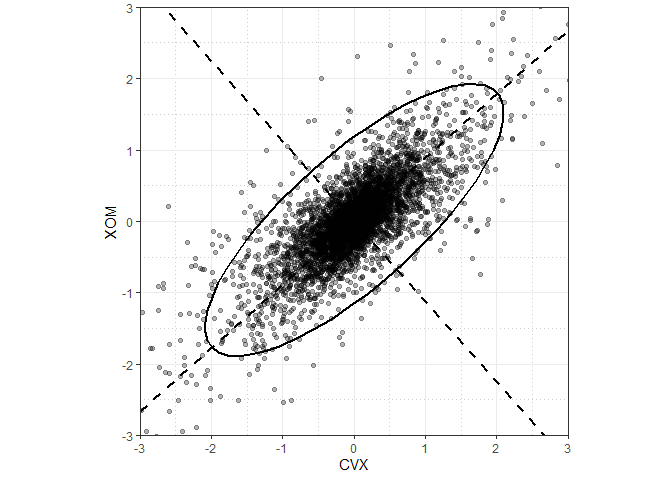<!-- -->

### Computing the Principal Components

1.  In creating the first principal component, PCA arrives at the linear
    combination of predictor variables that maximizes the percent of
    total variance explained.

2.  This linear combination then becomes the first “new” predictor,
    \(Z_1\)

3.  PCA repeats this process, using the same variables, with different
    weights to create a second new predictor \(Z_2\). The weighting is
    done such that \(Z_1\) and \(Z_2\) are uncorrelated.

4.  The process continues until you have as many new variables, or
    components, \(Z_i\) as original variables \(X_i\).

5.  Choose to retain as many components as are needed to account for
    most of the variance.

6.  The result so far is a set of weights for each compoent. The final
    step is to convert the original data into new principal component
    scores by applying the weights to the original values. These new
    scores and then be used as the reduced set of preditor
variables.

### Interpreting Principal Components

``` r
syms <- c( 'AAPL', 'MSFT', 'CSCO', 'INTC', 'CVX', 'XOM', 'SLB', 'COP', 'JPM', 'WFC', 'USB', 'AXP', 'WMT', 'TGT', 'HD', 'COST')
top_sp <- sp500_data[sp500_data$X1 >= '2005-01-01', syms]
sp_pca <- princomp(top_sp)
screeplot(sp_pca)
```


``` r
loadings <- 
  sp_pca$loadings[, 1:5] %>% 
  as.tibble() %>% 
  mutate(Symbol = rownames(sp_pca$loadings)) %>% 
  gather("Component", "Weight", -Symbol) %>% 
  mutate(positive = ifelse(Weight > 0, TRUE, FALSE))
# 책이랑 데이터가 다른 것 같다.
ggplot(loadings, aes(Symbol, Weight, fill = positive)) +
  geom_bar(stat = "identity") +
  facet_grid(Component ~ ., scales = "free_y") +
  scale_fill_discrete(guide = FALSE) +
  # guides(fill = FALSE) 특정 범례 제거 
  # theme(legend.position = "none") 모든 범례 제거
  ylab("Component Loading") +
  theme_bw() +
  theme(axis.text.x = element_text(angle = -30, vjust = 1, hjust = 0)) 
```


## K-Means Clusering

[K-means
Clustering](https://ratsgo.github.io/machine%20learning/2017/04/19/KC/)

x와 y를 k = 4인 클러스터로 나눈다고 가정해보자.

\[\bar x_k = \frac{1}{n_k}\sum_{i \in Cluster k}x_i\]

\[\bar y_k = \frac{1}{n_k}\sum_{i \in Cluster k}y_i\] The sum of squares
within a cluster is given by:
\[SS_k = \sum_{i \in Cluster k}(x_i - \bar x_k)^2 + (y_i - \bar y_k)^2\]
k-means는 \(SS_k\)를 최소가 되도록 레코드를 클러스터에 할당하는 방법이다.

``` r
df <- sp500_data[sp500_data$X1 >='2011-01-01', c('XOM', 'CVX')]
km <- kmeans(df, centers=4)
df$cluster <- factor(km$cluster)
centers <- data.frame(cluster = factor(1:4), km$centers)

ggplot(df, aes(XOM, CVX, color = cluster, shape = cluster)) +
  geom_point(alpha = .3) +
  geom_point(data = centers, aes(XOM, CVX), size = 3, stroke = 3) +
  theme_bw()
```


### K-Means Algorithm

정확한 k-means해는 계산하기 어려우므로, heuristic algorithm

사용자가 미리 정해준 K값과 클러스터 평균의 초깃값을 가지고 알고리즘을 시작하며, 아래 과정을 반복한다.

1.  각 레코드를 거리가 가장 가까운 평균을 갖는 클러스터에 할당한다.
2.  새로 할당된 레코드들을 가지고 새로운 클러스터 평균을 계산한다.

알고리즘은 각 레코드에 대한 클러스터 할당이 더 이상 변화가 없을 때 수렴한다. 첫 번째 단계에서 클러스터 평균의 초깃값을 설정할
필요가 있다. 보통은 각 레코드를 K개의 클러스터들 가운데 하나에 랜덤하게 할당한 후 그렇게 얻은 클러스터들의 평균을 사용한다.

이 방법이 항상 최적의 답을 준다는 보장이 없기 때문에, 랜덤하게 초깃값을 변화시켜가며 알고리즘을 여러 번 돌려봐야 한다. 일단
초깃값이 정해지게 되면 반복 루프를 통해 K-menas는 클러스터 내 제곱합이 최소가 되도록 하는 해를 얻게 된다.

R에서 `kmeans`함수의 `nstart` 인자를 이용해 랜덤하게 초깃값을 다르게 설정해 알고리즘을 시행할 횟수를 설정할 수
있다. 다음은 5개의 클러스터를 찾기 위해 K평균 알고리즘을 서로 다른 초깃값을 이용해 10번 수행하는 코드이다.

``` r
syms <- c( 'AAPL', 'MSFT', 'CSCO', 'INTC', 'CVX', 'XOM', 'SLB', 'COP',
'JPM', 'WFC', 'USB', 'AXP', 'WMT', 'TGT', 'HD', 'COST')
df <- sp500_data[sp500_data$X1 >= '2011-01-01', syms]
km <- kmeans(df, centers=5, nstart=10)
```

10번의 시도 가운데 가장 좋은 성능을 보인 결과를 볼 수 있다. `iter.max`변수를 이용해 각 초기 설정별 알고리즘의 최대
반복 횟수를 설정할 수 있다.

### Interpreting the Clusters

`kmeans`함수에서 가장 중요한 두 아웃풋은 클러스터의 크기와 클러스터 평균이다.

``` r
km$size
```

    ## [1] 106 265 288 290 182

``` r
km$centers %>% 
  as.tibble() %>% 
  gather("Symbol", "Mean") %>% 
  mutate(cluster = paste("Cluster", rep(1:5, length(as.data.frame(km$centers)))),
         is_positive = Mean > 0) %>% 
  ggplot(aes(Symbol, Mean, fill = is_positive)) +
  geom_bar(stat = "identity") +
  facet_grid(cluster ~., scale = "free_y") +
  ylab("Component Loading") + 
  theme_bw()
```


### Selecting the Number of Clusters

K 평균 알고리즘을 사용하려면 클러스터의 개수를 지정해야한다. 클러스터 개수는 응용 분야에 따라 결정되기도 한다. 고객들을 분류할
때 관리를 위 한 고려 사항에 따라 고객들을 분류할 그룹의 개수를 미리 결정할 수 있다.

실무 혹은 관리상의 고사 사항에 따라 클러스터 개수를 미리 결정하기가 어려울 경우, 통계적 접근 방식을 사용할 수 있다.

elbow method은 언제 클러스터 세트가 데이터의 분산의 ’대부분’을 설명하는지를 알려준다. CV를 사용하여 부분적으로
평가할 수 있다.

``` r
kmean_betweenss <- function(k) {
  cluster <- kmeans(df, k, nstart = 50, iter.max = 100)
  cluster$betweenss
}
# total all SS
tot_all_SS <- kmeans(df, 14, nstart = 50, iter.max = 100)$totss

# Set maximum cluster
max_k <- 14
# Run algorithm over a range of k
bss <- sapply(2:max_k, kmean_betweenss)

# Create a data frame to plot the graph
elbow <- tibble(num_clusters = 2:max_k, var_explained = bss / tot_all_SS)

# Plot the graph
ggplot(elbow, aes(num_clusters, var_explained)) +
  geom_point() +
  geom_line() +
  scale_x_continuous(breaks = seq(1, max_k, by = 1)) +
  labs(x = "% Variance Explained", y = "Number of Clusters") +
  theme_bw()
```


클러스터 개수를 결정하는 데에는 통계 이론이나 정보이론에 바탕을 둔 좀 더 형식적인 방법들도 있다. 예를 들어 “gap”
statistic을 사용하여 클러스터 개수를 결정하는 데에 이용하기도 한다. 하지만 이러한 이론적 접근법은 대부분의 응용 분야에서
필요하지 않고, 심지어 적합하지 않을 수도 있다.

## Hierarchical Clustering

[The 5 Clustering Algorithms Data Scientists Need to
Know](https://towardsdatascience.com/the-5-clustering-algorithms-data-scientists-need-to-know-a36d136ef68)

K-means보다 유연하고, 수치형 변수가 아니어도 쉽게 적용이 가능하다. 이상치나 비정상적이 그룹 또는 레코드를 발견하는 데에
좀 더 민감하다. 계층적 클러스터링은 또한 직관적인 시각화가 가능하여 클러스터를 해석하기가 수월하다.

계층적 클러스터링의 유연성에는 비용이 따른다. 다시 말해서 계층적 클러스터링은 수백만 개의 레코드가 있는 데이터에는 적용할 수
없다. 수만 개의 레코드로 이루어진 적당한 크기의 데이터의 경우에도 계층적 클러스터링을 위해서는 상대적으로 많은
computing resource가 필요할 수 있다. 실제로, 계층적 클러스터링은 대부분 상대적으로 데이터 크기가 작은 문제에
적용된다.

### A Simple Example

아래 두 가지 기본 구성 요소를 기반으로 한다.

  - A distance metric \(d_{i,j}\) to measure the distance between two
    records i and j.
  - A dissimilarity metric \(D_{A,B}\) to measure the difference between
    two clusters A and B based on the distances \(d_{i,j}\) between the
    members of each cluster.

데이터 자체보다 쌍 거리 \(d_{i,j}\)에 따라 동작한다.

``` r
syms1 <- c('GOOGL', 'AMZN', 'AAPL', 'MSFT', 'CSCO', 'INTC', 'CVX',
'XOM', 'SLB', 'COP', 'JPM', 'WFC', 'USB', 'AXP', 'WMT', 'TGT', 'HD', 'COST')
# take transpose: to cluster companies, we need the stocks along the rows
df <- t(sp500_data[sp500_data$X1 >= '2011-01-01', syms1])
d <- dist(df)
hcl <- hclust(d)
```

### The Dendrogram

``` r
plot(hcl)
```

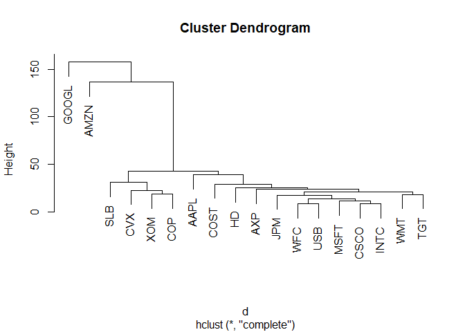<!-- -->

나무의 잎은 레코드에 대응한다. 나뭇가지의 길이는 클러스터 간의 비유사성 정도를 나타낸다. 구글과 아마존에 대한 수익률은 다른
주식대 대한 수익률과 상당히 다른 것을 볼 수 있다. 다른 주식들을 자연스럽게 그룹으로 형성된다. 에너지, 금융,
소매기업들이 각각 하위 트리로 구분된 것을 볼 수 있다.

``` r
# 클러스터의 구체적인 수
cutree(hcl, k = 4)
```

    ## GOOGL  AMZN  AAPL  MSFT  CSCO  INTC   CVX   XOM   SLB   COP   JPM   WFC 
    ##     1     2     3     3     3     3     4     4     4     4     3     3 
    ##   USB   AXP   WMT   TGT    HD  COST 
    ##     3     3     3     3     3     3

구글과 아마존은 각자 자신만의 독자적인 클러스터에 속해 있음을 볼 수 있다. 석유 주식((XOM, CVS, SLB, COP))은
모두 한 클러스터에 속한다. 마지막으로 나머지 주식들이 남은 하나의 클러스터에 속한다.

### The Agglomerative Algorithm

거리로 유클리드 거리를 사용한다고 하자. 비유사도를 측정하는 한 가지 방법은 A와 B 사이의 모든 레코드 쌍의 최대 거리를
사용하는 ***complete
linkage***

\[D(A, B) = max\space d(a_i, b_j)\space for\space all\space pairs\space i, j\]
1. 데이터의 모든 레코드에 대해, 단일 레코드로만 구성된 클러스터들로 초기 클러스터 집합을 만든다. 2. 모든 쌍의 클러스터
\(k, l\)사이의 비유사도 \(D(C_k, C_l)\)을 계산한다. 3. \(D(C_k, C_l)\)에 따라 가장 가까운 두
클러스터 \(C_k\)와 \(C_l\)을 병합한다. 4. 둘 이상의 클러스터가 남아 있으면 2단계로 다돌 돌아간다. 그렇지
않고 클러스터가 하나 남는다면 알고리즘을 멈춘다.

### Measure of Dissimilarity

비유사도를 측정하는 네 가지 일반적인 지표는 ***complete linkage, single linkage, average
linkage, and minimum variance*** ***single linkage***방법은 두 클러스터에 레코드 사이의
거리를 최소화 한다.
\[D(A, B) = min\space d(a_i, b_j)\space for\space all\space pairs\space i, j\]
이는 greedy방법이며, 결과로 나온 클러스터는 서로 크게 다른 요소들을 포함하는 일도 생길 수 있다. average
linkage method는 모든 거리 쌍의 평균을 사용하는 방법으로 이는 single linkage method와
complete linkage method사이를 절충한 방법이다. 마지막으로 Ward’s method이라고도 하는 최소분산 방법은
클러스터 내의 제곱합을 최소화하므로 k-means와 유사하다고 할 수
있다.

<!-- 탐욕 알고리즘 혹은 그리디 알고리즘이라고도 부른다. 반복 수행을 기반으로 하는 알고리즘에서 전체 혹은 나중을 생각하지 않고 각 단계마다 주어진 정보 내에서 최선의 선택을 하는 방법을 말한다. 하지만 각 단계에서 지역적으로(locally) 최선의 선택을 했다고 해서 전체적으로(globally) 최적의 답을 얻는다는 보장은 없다. -->

``` r
df <- sp500_data[sp500_data$X1 >='2011-01-01', c('XOM', 'CVX')]
d <- dist(df)
hclust_single <- cutree(hclust(d, method = "single"), k = 4)
hclust_avg <- cutree(hclust(d, method = "average"), k = 4)
hclust_complete <- cutree(hclust(d, method = "complete"), k = 4)
hclust_ward <- cutree(hclust(d, method = "ward.D"), k = 4)
df <- 
  df %>% 
  mutate(
    hclust_single = hclust_single,
    hclust_avg = hclust_avg,
    hclust_complete = hclust_complete,
    hclust_ward = hclust_ward
    ) %>% 
  gather("cluster_method", "cluster_class", -XOM, -CVX) %>% 
  mutate(cluster_method = factor(cluster_method, labels = c("average", "complete", "single", "ward.D")),
         cluster_class = as.factor(cluster_class))

ggplot(df, aes(XOM, CVX, color = cluster_class, shape = cluster_class)) +
  geom_point(alpha = .3) +
  guides(color = guide_legend(override.aes = list(alpha = 1),
                              title = "cluster"),
         shape = guide_legend(title = "cluster")) +
  # labs(color = "cluster", shape = "cluster") + # color shape 둘 다 바꿔야한다!!
  facet_wrap(~cluster_method) +
  theme_bw()
```


single linkage는 거의 모든 점을 하나의 클러스터에 할당했다. 최소분산 방법(Ward.D)을 제외한 다른 방법은 외곽에
요소가 몇 없는 특이값들로 이루어진 작은 클러스터를 만들었다. 최소분산 방법은 k-means와 가장 유사한 결과를 보인다.

## Model-Based Clustering

예를 들어, 전반적으로는 서로 비슷하지만 모든 데이터가 반드시 서로 가까울 필요는 없는 그룹(예를 들어 수익의 분산이 큰 기술
주식들)과 서로 비슷하면서 데이터들이 아주 가까이에 있는 또 다른 그룹(예를 들어 분산이 적은 유틸리티 주식)이 함께 있는
경우에 사용할 수 있다.

### Mixtures of Normals

모델 기반 크러스터링의 핵심 아이디어는 각 레코드가 K개의 다변량정규분포 중 하나로부터 발생했다고 가정하는 것이다. 여기서 K가
클러스터의 개수를 의미한다. 각 분포는 서로 다른 평균 \(\mu\)와 공분산행렬 \(\Sigma\)를 갖는다. 예를 들어
X와 Y라는 두 개의 변수가 있는 경우 각 행\(X_i, Y_i\)은 K개의 분포
\(N_2(\mu_1, \Sigma_1),N_2(\mu_2, \Sigma_2), ..., N_2(\mu_K, \Sigma_K)\)
중 하나에서 샘플링된 것으로 모델링된다.

``` r
library(mclust)
```

    ## Warning: package 'mclust' was built under R version 3.5.3

    ## Package 'mclust' version 5.4.5
    ## Type 'citation("mclust")' for citing this R package in publications.

    ## 
    ## Attaching package: 'mclust'

    ## The following object is masked from 'package:purrr':
    ## 
    ##     map

``` r
df <- sp500_data[sp500_data$X1>='2011-01-01', c('XOM', 'CVX')]
mcl <- Mclust(df)
summary(mcl)
```

    ## ---------------------------------------------------- 
    ## Gaussian finite mixture model fitted by EM algorithm 
    ## ---------------------------------------------------- 
    ## 
    ## Mclust VEE (ellipsoidal, equal shape and orientation) model with 2
    ## components: 
    ## 
    ##  log-likelihood    n df       BIC       ICL
    ##       -2255.125 1131  9 -4573.528 -5075.657
    ## 
    ## Clustering table:
    ##   1   2 
    ## 168 963

``` r
cluster <- as.factor(predict(mcl)$classification)
ggplot(df, aes(XOM, CVX, color = cluster)) +
  geom_point(size = 0.75) +
  theme_bw()
```


``` r
summary(mcl, parameters = TRUE)
```

    ## ---------------------------------------------------- 
    ## Gaussian finite mixture model fitted by EM algorithm 
    ## ---------------------------------------------------- 
    ## 
    ## Mclust VEE (ellipsoidal, equal shape and orientation) model with 2
    ## components: 
    ## 
    ##  log-likelihood    n df       BIC       ICL
    ##       -2255.125 1131  9 -4573.528 -5075.657
    ## 
    ## Clustering table:
    ##   1   2 
    ## 168 963 
    ## 
    ## Mixing probabilities:
    ##         1         2 
    ## 0.2739885 0.7260115 
    ## 
    ## Means:
    ##            [,1]       [,2]
    ## XOM -0.04362218 0.05792282
    ## CVX -0.21109525 0.07375447
    ## 
    ## Variances:
    ## [,,1]
    ##          XOM      CVX
    ## XOM 1.044671 1.065190
    ## CVX 1.065190 1.912748
    ## [,,2]
    ##           XOM       CVX
    ## XOM 0.2998935 0.3057838
    ## CVX 0.3057838 0.5490920

`predict.Mclust, summary.Mclust` 참고

플랏을 보면 주식 데이터는 정규분포 모양을 갖고 있는 것 처럼 보인다. 사실 더 정확히는, 주식 수익률은 정규분포보다 긴 꼬리
분포를 따른다고 볼 수 있다. 이를 처리하기 위해 mclust는 데이터의 대부분에 대한 분포를 피팅하려고 하고 그 결과 두
번째 분포가 더 큰 분산을 갖도록 피팅된다.

### Selecting the Number of Clusters

k-means와 hierachical 클러스터링과 달리 mclust는 클러스터 수(이 경우 2)를 자동으로 선택한다. 바로
Bayesian information criteria(BIC)값이 가장 큰 클러스터의 개수를 선택하도록 동작하기 때문이다.

``` r
plot(mcl, what = "BIC", ask = FALSE)
```


k-means의 클러스터 개수를 선택하는데 사용한 elbow plot과 유사하지만, 여기서는 설명되는 분산 비율 대신 BIC가
사용되었다. 한 가지 큰 차이점은 선이 하나가 아니라, mclust 함수가 무려 14개의 다른 선을 동시에 보여준다는
것이다\! 이는 mclust가 실제로 각 클러스터 크기에 대해 14개의 다른 모델을 피팅했고 궁극적으로 가장 적합한
모델을 선택했다는 것을 잘 보여준다.

모델 기반 클러스터링에는 몇 가지 한계가 있다. 이 방법은 기본적으로 데이터들이 모델을 따른다는 가정이 필요하며, 클러스터링
결과는 이 가정에 따라 매우 다르다. 필요한 계산량 역시 계층적 클러스터링보다 높으므로 대용량 데이터로 확장하기가
어렵다. 마지막으로 알고리즘이 다른 방법들보다 더 복잡하고 이용하기가 어렵다.

[mclust
documentation](https://www.stat.washington.edu/sites/default/files/files/reports/2012/tr597.pdf)

## Scaling and Categorical Variables

데이터의 크기가 조정되지 않으면 PCA, K-means, 혹은 기타 클러스터링 방법은 큰 값을 갖는 변수들에 의해 결과가 좌우되고
작은 값을 갖는 변수들은 무시된다.

범주형 데이터는 일부 클러스터링 과정에서 특별한 문제를 일으킬 수 있다. KNN에서와 마찬가지로, 순서가 없는 요인변수는
일반적으로 one-hot encoding을 사용하여 이진(0/1) 변수 집합으로 변 환한다. 이러한 이진변수는
다른 데이터와 스케일이 다를 뿐만 아니라 PCA와 K-means 같은 기법을 사용할 때 이진변수가 두 가지의 값만 가질 수
있다는 것 때문에 문제가 될 수 있다.

PCA에서 상관행렬을 사용하면 z점수를 사용하는 것과 같은 효과이다.

### Dominant Variables

변수들이 서로 동일한 규모로 측정되고 상대적 중요성을 정확하게 반영하는 경우(예를 들어 주가 변동)조차도 변수의 스케일을
재조정하는 것이 유용할 수
있다.

``` r
syms <- c('AMZN', 'GOOGL', 'AAPL', 'MSFT', 'CSCO', 'INTC', 'CVX', 'XOM', 'SLB', 'COP', 'JPM', 'WFC', 'USB', 'AXP', 'WMT', 'TGT', 'HD', 'COST')
top_sp1 <- sp500_data[sp500_data$X1 >='2005-01-01', syms]
sp_pca1 <- princomp(top_sp1)
screeplot(sp_pca1)
```


``` r
round(sp_pca1$loadings[, 1:2], 3)
```

    ##       Comp.1 Comp.2
    ## AMZN   0.445  0.874
    ## GOOGL  0.857 -0.478
    ## AAPL   0.072  0.021
    ## MSFT   0.036  0.006
    ## CSCO   0.029  0.003
    ## INTC   0.027  0.006
    ## CVX    0.090  0.037
    ## XOM    0.080  0.021
    ## SLB    0.110  0.030
    ## COP    0.058  0.024
    ## JPM    0.071  0.009
    ## WFC    0.053  0.009
    ## USB    0.042  0.006
    ## AXP    0.079  0.024
    ## WMT    0.040  0.007
    ## TGT    0.064  0.025
    ## HD     0.051  0.033
    ## COST   0.071  0.034

처음 두 가지 주성분이 거의 완전히 GOOGL과 AMZN에 의해 지배되고 있다. 이는 GOOGL과 AMZN의 주가 움직임이 전체
변동성의 대부분을 지배하기 때문이다.

이러한 상황에서는 변수를 스케일링 해서 포함하거나 dominant 변수를 분석으로부터 제외하고 별도로 처리할 수 있다. 어떤
방법이 항상 옳다고는 볼 수 없으며 응용 분야에 따라 달라진다.

### Categorical Data and Gower’s Distance

범주형 데이터가 있는 경우에는 순서형 변수 또는 이진형(더미) 변수를 사용하여 수치형 데이터로 변환해야 한다. 데이터를 구성하는
변수들에 연속형과 이진형 변수가 섞여 있는 경우에는 비슷한 스케일이 되도록 변수의 크기를 조정해야 한다. 이를 위한 대표적인
방법은 Gower’s Distance를 사용하것 ㄱ이다.

고워 거리의 기본 아이디어는 각 변수의 데이터 유형에 따라 거리 지표를 다르게 적용하는 것이다.

  - 수치형 변수나 순서형 요소에서 두 레코드 간의 거리는 차이의 절댓값(맨하탄 거리)으로 계산한다.
  - 범주형 변수의 경우 두 레코드 사이의 범주가 서로 다르면 거리가 1이고 범주가 동일하면 거리는 0이다.

고워 거리는 다음과 같이 계산한다.

1.  각 레코드의 변수 i와 j의 모든 쌍에 대해 거리 \(d_{i, j}\)를 계산한다.
2.  각 \(d_{i, j}\)의 크기를 최솟값이 0이고 최댓값이 1이 되도록 스케일을 조정한다.
3.  거리 행렬을 구하기 위해 변수 간에 스케일된 거리를 모두 더한 후 평균 혹은 가중평균을 계산한다.

<!-- end list -->

``` r
x <- defaults[1:5, c('dti', 'payment_inc_ratio', 'home', 'purpose')]
x
```

    # A tibble: 5 × 4
    dti payment_inc_ratio home purpose
    <dbl> <dbl> <fctr> <fctr>
    1 1.00 2.39320 RENT car
    2 5.55 4.57170 OWN small_business
    3 18.08 9.71600 RENT other
    4 10.08 12.21520 RENT debt_consolidation
    5 7.06 3.90888 RENT other

cluster패키지의 `daisy`함수를 사용하면 고워 거리를 계산할 수 있다.

``` r
library(cluster)
daisy(x, metric='gower')
```

    Dissimilarities :
    1 2 3 4
    2 0.6220479
    3 0.6863877 0.8143398
    4 0.6329040 0.7608561 0.4307083
    5 0.3772789 0.5389727 0.3091088 0.5056250

거리가 모두 0과 1사이인 것을 볼 수 있다. 가장 거리가 먼 레코드 쌍은 2번과 3번 레코드이다. 이 둘은 home\_변수나
purpose 변수에 대해서도 값이 다르며 dti 변수와 payment\_inc\_ratio 변수 역시 차이가 크다. 반면
home\_변수나 purpose 변수가 동일한 값을 갖는 레코드 3번과 5번은 거리가 가장 적다.

daisy함수의 거리 행렬 결과에 hclust 함수를 이용하여 계층적 클러스터링을 적용해볼 수 있다.

``` r
df <- defaults[sample(nrow(defaults), 250),
c('dti', 'payment_inc_ratio', 'home', 'purpose')]
d = daisy(df, metric='gower')
hcl <- hclust(d)
dnd <- as.dendrogram(hcl)
plot(dnd, leaflab='none')
```


다음 코드를 사용하면 하위 트리 중 하나(cut을 사용해 0.5를 기준으로 잘랐을 때 가장 왼쪽에 있는 그룹)에 포함된 레코드들을
살펴볼 있다.

``` r
dnd_cut <- cut(dnd, h = .5)
df[labels(dnd_cut$lower[[1]]),]
```

    # A tibble: 9 × 4
    dti payment_inc_ratio home purpose
    <dbl> <dbl> <fctr> <fctr>
    1 24.57 0.83550 RENT other
    2 34.95 5.02763 RENT other
    3 1.51 2.97784 RENT other
    4 8.73 14.42070 RENT other
    5 12.05 9.96750 RENT other
    6 10.15 11.43180 RENT other
    7 19.61 14.04420 RENT other
    8 20.92 6.90123 RENT other
    9 22.49 9.36000 RENT other

이 하위 트리에 속한 레코드들은 모두 대출 목적이 other이고 주거 형태가 RENT이다. 모든 하위 트리에서 이러한 형태의
구분이 이루어지는 것은 아니지만 이는 범주형 변수 값이 비슷한 데이터들이 한 클러스터로 그룹화되는 경향이 있다는 것을
보여준다.

### Problems with Clustering Mixed Data

k-means와 PCA는 연속형 변수에 가장 적합하다. 데이터 집합의 크기가 더 작아질수록 고워 거리를 사용하여 계층적
클러스터링을 하는 것이 좋다. 원친적으로는 이진형 혹은 범주형 데이터에도 K-means를 적용할 수 있다.
범주형 데이터의 경우에는 일반적으로 one-hot encoding 방법을 이용해 수치형으로 변환할 수 있다. 하지만 실무에서는
k-means와 PCA를 이진형 데이터와 함께 사용하는 것은 어려울 있다.

표준 z점수를 사용할 경우, 이진형 변수가 클러스터 결과에 지대한 영향을 미치게 된다. 0/1변수의 경우, 0 또는 1의 값인
레코드를 모두 한 클러스터에 포함되므로 K-means평균에서 클러스터내 제곱합이 작아지기
때문이다.

``` r
df <- model.matrix(~ -1 + dti + payment_inc_ratio + home + pub_rec_zero, data=defaults)
df0 <- scale(df)
km0 <- kmeans(df0, centers=4, nstart=10)
centers0 <-scale(km0$centers, center=FALSE,
scale=1/attr(df0, 'scaled:scale'))
scale(centers0, center=-attr(df0, 'scaled:center'), scale=F)
```

    dti payment_inc_ratio homeMORTGAGE homeOWN homeRENT pub_rec_zero
    1 17.02 9.10 0.00 0 1.00 1.00
    2 17.47 8.43 1.00 0 0.00 1.00
    3 17.23 9.28 0.00 1 0.00 0.92
    4 16.50 8.09 0.52 0 0.48 0.00

상위 4개 클러스터가 요인변수들과 밀접한 관련이 있다는 것을 볼 수 있다. 이러한 문제를 피하기 위해 이진형 변수의 크기를 다른
변수들보다 작은 값으로 조정할 수 있다. 이러한 문제를 피하기 위해 이진형 변수의 크기를 다른 변수들보다 작은 값으로 조정할
수 있다. 아니면 데이터의 그기가 아주 큰 경우에는 특정 범주 값들에 따라 서로 다른 하위 집합에 클러스터링을 적용할 수도
있다. 예를 들어, 주택 담보 대출이 있는 사람인지, 주택을 완전히 소유한 사람인지, 주택을 임대하고 있는 사람인지에 따라
대출 데이터를 쪼개서 각각의 하위 그룹에 클러스터링을 개별적으로 적용할 수 있다.

## Summary

주성분분석와 k-means 클러스터링은 수치형 데이터의 차원을 축소하기 위해 주로 사용되는 방법들이다. 의미 있는 데이터 축소를
보장하기 위해서는 데이터의 스케일을 적절히 조정해야 한다.

그룹들 간의 구분이 분명하고 고도로 구조화된 데이터를 클러스터링할 경우, 어떤 방법을 사용하든 결과는 비슷할 가능성이 높다. 물론
방법마다 장점이 있다. K-means은 매우 큰 데이터로 확장이 가능하고 이해하기 쉽다. 계층적 클러스터링은 수치형과 범주형이
혼합된 데이터 유형에 적용이 가능하며 직관적인 시각화 방법이 존재한다. 모델 기반 클러스터링은 휴리스틱한 방법들과 달리
통계 이론에 기초를 두고 있으며 더 엄밀한 접근 방식을 제시한다. 그러나 데이터가 커지면 K-means가 가장 많이
사용되는 방법이다.

대출이나 주식 데이터, 그리고 데이터 과학자가 직면할 대다수 데이터는 노이즈가 많다. 이런 경우, 사용 기법에 따라 결과에 극명한
차이를 가져온다. K-means, 계층적 클러스터링, 그리고 특히 모델 기반 클러스터링은 모두 매우 다른 솔루션을 생성한다.
데이터 과학자는 이럴 때 어떻게 해야 할까? 불행하게도 선택을 돕는 간단한 법칙 따위는 없다. 궁극적으로 데이터 크기나
응용 분야의 목표에 따라 사용되는 방법은 달라지게 된다.
