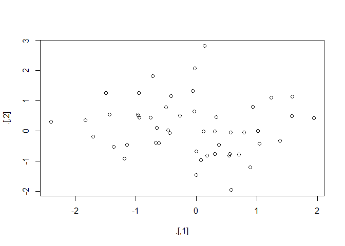
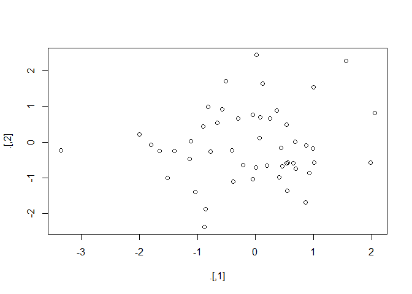

R for Data Science
================
true
2019년 7월

<style>
mystyle{
    font-family :  Georgia;
    font-size : 26px;
    color : PaleVioletRed  ;
}
</style>

> <mystyle> Part 3 </mystyle>  
> <mystyle> Program </mystyle>

rewriting은 명료하기 위한 중요한 포인트이다. 먼저 데이터 분석 문제를 해결하고나서, 코드에 대해서 들여다보고 분명한지
안한지 생각해보자. 아이디어가 신선한 동안 코드를 다시 쓰는데 시간을 조금 투자하면, 코드를 다시 작성하는데에 많은 시간을
아낄 수 있다. 모든 함수를 다시 쓰라는 말은 아니다. 장기간 시간을 절약하는 것과 현재 성취하는 것 사이의 벨런스를 맞춰라.

# Chapter14: Pipes with magrittr

## Piping Alternatives

a little bunny named Foo Foo시 :

Little bunny Foo Foo

Went hopping through the forest

Scooping up the field mice

And bopping them on the head

little bunny foo foo를 나타내는 객체를 정의하자. `foo_foo <- little_bunny()`

중요한 동사인 hop(), scoop(), and bop()를 함수로 사용하자. 이 객체와 이 동사들을 사용하여 코드로 스토리를
다시 말해보자.

• Save each intermediate step as a new object. • Overwrite the original
object many times. • Compose functions. • Use the pipe.

### Intermediate Steps

`foo_foo_1 <- hop(foo_foo, through = forest)`

`foo_foo_2 <- scoop(foo_foo_1, up = field_mice)`

`foo_foo_3 <- bop(foo_foo_2, on = head)`

이 형태의 주된 단점은 중간 성분에 이름을 부여한다는 것이다. 자연스로운 이름이면 좋은 생각이고 그렇게 해야한다. 하지만 매번
자연스로운 이름이 아니고, 수치적 접두사를 추가해야한다. 이건 두가지 문제가 있다.

  - 코드가 중요하지 않은 이름으로 마구 채워진다
  - 라인마다 접두사를 조심스럽게 추가해야한다

메모리는 코드 작성 이전에 걱정하지말고 문제가 되고 나서 걱정하라.

``` r
diamonds <- ggplot2::diamonds
diamonds2 <- diamonds %>% 
  mutate(price_per_carat = price / carat)
pryr::object_size(diamonds)
```

    ## 3.46 MB

``` r
pryr::object_size(diamonds2)
```

    ## 3.89 MB

``` r
pryr::object_size(diamonds, diamonds2)
```

    ## 3.89 MB

공통된 열을 복제할 필요가 없기 때문에 이것들을 공유하고 수정할 때는 복사한다. 다음 예에서 하나의 열 carat을 수정한다.
이것은 carat변수가 더이상 두 데이터프레임 사이에서 공유될 수 없고 복사가 반드시 행해져야한다. 각 데이터프레임의
크기는 변하지 않지만 공통의 사이즈는 커진다.

``` r
diamonds$carat[1] <- NA
pryr::object_size(diamonds)
```

    ## 3.46 MB

``` r
pryr::object_size(diamonds2)
```

    ## 3.89 MB

``` r
pryr::object_size(diamonds, diamonds2)
```

    ## 4.32 MB

### Overwrite the Original

각 단계의 중간 객체를 생성하는 대신에, 원래의 객체를 덧쓰겠다.

`foo_foo <- hop(foo_foo, through = forest)`

`foo_foo <- scoop(foo_foo, up = field_mice)`

`foo_foo <- bop(foo_foo, on = head)`

타이핑은 줄여주지만 두가지 문제가 있다.

  - 디버깅이 골치 아프다. 실수를 하면 처음부터 다시 실행해야한다.
  - 변환된 객체의 반복이 각 라인에서 변화하는 것을 애매모호하게 한다.

### Function Composition

다른 접근법은 할당을 버리고 단순히 함수를 같이 호출하는 것이다.

``` r
bop(
  scoop(
    hop(foo_foo, through = forest),
    up = field_mice
  ),
  on = head
)
```

단점은 안밖, 좌우로 읽어야 해서 결국 인자가 멀리 떨어져서 퍼져 버린다.

### Use the Pipe

``` r
foo_foo %>%
  hop(through = forest) %>%
  scoop(up = field_mouse) %>%
  bop(on = head)
```

이것은 명사가 아니라 동사에 집중할 수 있어서 좋은 형태다. pipe는 “lexical transformation”에 의해
수행되어 진다. 이전과 같은 pipe를 실행하면 magrittr은 이와 같이 호출한다.

이것은 pipe가 함수의 두가지 클래스에서는 작동하지 않는다는 것을 의미한다.

``` r
my_pipe <- function(.) {
  . <- hop(., through = forest)
  . <- scoop(., up = field_mice)
  bop(., on = head)
}
my_pipe(foo_foo)
```

  - <span style="background : yellow">현재 환경을 사용하는 함수.</span> 예를 들어,
    `assign()`은 현재 환경에서 주어진 이름으로 새로운 변수를 생성한다. assign의 documentaion을
    참고하라.

만약 `assign()`으로 전역환경에 변수를 할당하고 싶다면 다음과 같다.

``` r
f <- function() {
  assign("x", 1, envir = globalenv())
}
```

<https://stackoverflow.com/questions/17559390/why-is-using-assign-bad> 이
글을 읽어보면 객체를 여러 변수에 할당하는 것 보다 FP를 위해 이름이 있는 리스트를 하나 만드는 것이 좋다고 적혀있다.

``` r
assign("x", 10)
"x" %>% assign(100) # 작동하지 않는다.
```

assign을 pipe와 함께 사용하는 것은 %\>%에 의해 임시 환경에 할당하기 때문에 작동하지 않는다. 만약 assign을
pipe와 함께 사용하고 싶다면, 현재 환경을 명시해 주어야 한다.

``` r
env <- environment()
"x" %>% assign(100, envir = env)
x
```

    ## [1] 100

`get()` and `load()`도 같은 문제가 있다.

  - <span style="background : yellow">lazy evaluation을 사용하는 함수 </span>.
    함수의 인자가 함수 호출이전이 아닌 함수가 사용되어 질때 계산되어진다. pipe가 결국 각 성분을 계산하기 때문에
    이러한 행동을 의존할 수 없다.

`tryCatch()` 에러를 캡쳐하고 다룰 수 있다.

``` r
tryCatch(stop("!"), error = function(e) "An error")
```

    ## [1] "An error"

``` r
stop("!") %>%
  tryCatch(error = function(e) "An error")
```

`try()`, `suppressMessages()`, and `suppressWarnings()`이 이러한 문제가 있다.

adv-R을 참고하여 try(), tryCatch()에 대해 공부해보자.

## When Not to Use th Pipe

pipe는 유용한 도구지만 모든 문제를 해결하지는 않는다. 다음과 같은 상황에서는 다른 도구를 사용하라.

  - pipe가 (말하자면)10단계 이상. 이런 상황에서는, 중간 객체를 의미있는 이름과 함께 생성하라. 이렇게 하는것이 중간
    결과를 확인하기 쉽게 하고, 변수 이름을 소통하기에 도움을 줘서 코드를 쉽게 이해하게 하기 때문에 디버깅을 쉽게한다.
  - 다수의 입력과 출력을 가질 수 있다. 변환된 주요한 하나의 객체가 아니지만 여러개의 객체가 함께 조합됐다면, pipe를
    사용하지 마라.
  - 복잡한 종속 구조를 가진 지시된 그래프를 고려하기 시작할때이다. pipe는 근본적으로 선형이고 복잡한 관계를 전형적으로
    복잡한 코드를 생성하는것을 표현한다.

## Other Tools from magrittr

tidyverse()에서는 명시적으로 pipe를 자동적으로 만들기 때문에 magrittr를 로드할 필요는 없지만
magrittr내부에 유용한 도구가 있다.

``` r
library(magrittr)
```

    ## 
    ## Attaching package: 'magrittr'

    ## The following object is masked from 'package:purrr':
    ## 
    ##     set_names

    ## The following object is masked from 'package:tidyr':
    ## 
    ##     extract

  - 좀 더 복잡한 pipe를 가지고 작업할 때, 부작용을 위해 함수를 호출하는 것이 유용하다. 현재 객체를 출력하거나 플랏을
    그리거나 disk에 저장하기를 원할 수 있다. 많은 경우에,
    <span style="background : yellow">그러한 함수들은 어느것도 반환하지 않고 효과적으로 pipe를
    종료한다. 이 문제를 작업하기 위해, “tee” pipe를 사용할 수 있다.</span> %T\>% 는 %\>% 와
    같이 작동되지만 오른쪽 대신에 왼쪽에 반환한다.

<!-- end list -->

``` r
rnorm(100) %>% 
  matrix(ncol = 2) %>% 
  plot() %>% 
  str()
```

<!-- -->

    ##  NULL

``` r
rnorm(100) %>% 
  matrix(ncol = 2) %T>%
  plot() %>% 
  str()
```

<!-- -->

    ##  num [1:50, 1:2] 0.085 0.123 -0.0411 1.98 0.9277 ...

  - API(즉, 개별 벡터를 전달하고, 데이터프레임에서 연산되지 않는 표현식과 데이터 프레임이 아니라)에 기반한 데이터프레임을
    가지지 않는 함수로 작업한다면, %$%가 유용하다. 명시적으로 언급하기 위해 데이터프레임에서 변수를 폭발시킨다. base
    R함수로 작업할 때 유용하다.

<!-- end list -->

``` r
mtcars %$%
  cor(disp, mpg)
```

    ## [1] -0.8475514

``` r
flights %>% 
  filter(!is.na(dep_time), !is.na(arr_time)) %$%
  cor(dep_time, arr_time)
```

    ## [1] 0.6607789

  - magrittr 할당을 위해 %\<\>% 연산자를 제공하는데 코드를 대체하는 것을 허용한다

<!-- end list -->

``` r
mtcars <- mtcars %>% 
  transform(cyl = cyl * 2)
```

``` r
mtcars %<>% transform(cyl = cyl * 2) 
```

지은이가 이건 별로란다.

# Chapter15 : Functions

## When should you write a function?

2번이상 코드블락을 복붙해야할 때 함수 사용을 고려해야한다.

``` r
rescale01 <- function(x) {
  rng <- range(x, na.rm = TRUE)
  (x - rng[1]) / (rng[2] - rng[1])
}
```

새로운 함수를 만들기 위한 세가지 중요한 단계

1.  함수의 이름이 필요하다.
2.  함수의 인자를 열거하라.
3.  함수의 몸체에서 개발한 코드를 두어라.

간단한 입력으로 어떻게 작업할 것인지 이해한 후 함수를 작성한다.

몇가지 다른 입력을 함수에 넣어서 확인해보는 것은 좋은 생각이다.

``` r
rescale01(c(-10, 0, 10))
```

    ## [1] 0.0 0.5 1.0

``` r
rescale01(c(1, 2, 3, NA, 5))
```

    ## [1] 0.00 0.25 0.50   NA 1.00

함수를 작성하면 할수록 결국 비공식적이고 상호작용하는 테스트를 공식적이고 자동적인 테스트로 변환시키기를 원할 것이다. 이것을 유닛
테스트라고 부른다.

함수의 또다른 이점은 요구사항이 변하면 오직 한 곳에서 변화를 만들 필요가 있다는 것이다. 예를 들어, 무한값이 포함되어 있다면

``` r
x <- c(1:10, Inf)
rescale01(x) # 실패
```

    ##  [1]   0   0   0   0   0   0   0   0   0   0 NaN

단지 하나만 수정하면 된다.

``` r
rescale01 <- function(x) {
  rng <- range(x, na.rm = TRUE, finite = TRUE)
  (x - rng[1]) / (rng[2] - rng[1])
}
rescale01(x)
```

    ##  [1] 0.0000000 0.1111111 0.2222222 0.3333333 0.4444444 0.5555556 0.6666667
    ##  [8] 0.7777778 0.8888889 1.0000000       Inf

## Exercises

1.  Why is TRUE not a parameter to rescale01()? What would happen if x
    contained a single missing value, and na.rm was FALSE?

인자로 주지 않는것은 변경을 원치 않기 때문이다. na.rm = FALSE를 하면 모든 반환값이 NA

2.  In the second variant of rescale01(), infinite values are left
    unchanged. Rewrite rescale01() so that -Inf is mapped to 0, and Inf
    is mapped to 1.

<!-- end list -->

``` r
rescale01 <- function(x) {
  # x <- ifelse(x == Inf, 1, 
  #             ifelse(x == -Inf, 0, x))
  x[x == -Inf] <- 0
  x[x == Inf] <- 1
  rng <- range(x, na.rm = TRUE)
  (x - rng[1]) / (rng[2] - rng[1])
}
x <- c(1:10, Inf, -Inf)

rescale01(x)
```

    ##  [1] 0.1 0.2 0.3 0.4 0.5 0.6 0.7 0.8 0.9 1.0 0.1 0.0

3.  Practice turning the following code snippets into functions. Think
    about what each function does. What would you call it? How many
    arguments does it need? Can you rewrite it to be more expressive or
    less duplicative?

<!-- end list -->

``` r
mean(is.na(x))
x / sum(x, na.rm = TRUE)
sd(x, na.rm = TRUE) / mean(x, na.rm = TRUE)
```

``` r
f <- function(x, type) {
  weights <- paste(x / sum(x, na.rm = TRUE),collapse = " ")
  list(
  sprintf("결측치 비율: %f", mean(is.na(x))),
  sprintf("가중치에 의한 표준화: %s",  weights),
  sprintf("변동계수: %f", sd(x, na.rm = TRUE) / mean(x, na.rm = TRUE))
  )
}
f(c(1:10, NA, NA))
```

    ## [[1]]
    ## [1] "결측치 비율: 0.166667"
    ## 
    ## [[2]]
    ## [1] "가중치에 의한 표준화: 0.0181818181818182 0.0363636363636364 0.0545454545454545 0.0727272727272727 0.0909090909090909 0.109090909090909 0.127272727272727 0.145454545454545 0.163636363636364 0.181818181818182 NA NA"
    ## 
    ## [[3]]
    ## [1] "변동계수: 0.550482"

5.  Write both\_na(), a function that takes two vectors of the same
    length and returns the number of positions that have an NA in both
    vectors.

<!-- end list -->

``` r
both_na <- function(x, y) {
  if(length(x) == length(y)) {
    sum(which(is.na(x)) == which(is.na(y)))
  }
  else
    stop("두 벡터의 길이가 다릅니다.")
}

both_na(sample(c(1:5, NA), 100, replace = TRUE), sample(c(1:5, NA),100, replace =TRUE))
```

    ## Warning in which(is.na(x)) == which(is.na(y)): 두 객체의 길이가 서로 배수관
    ## 계에 있지 않습니다

    ## [1] 0

6.  What do the following functions do? Why are they useful even though
    they are so short?

<!-- end list -->

``` r
is_directory <- function(x) file.info(x)$isdir 
is_readable <- function(x) file.access(x, 4) == 0
```

isdir : logical, Is the file a directory?

file.access 두번째 인자 mode : integer specifying access mode required 0 :
test for existence 1 : test for execute permission 2 : test for write
permission 4 : test for read permission

## Functions Are for Humans and Computers

함수의 이름은 동사이여야하고, 인자는 명사이여야 한다. 잘 알려진 명사는 함수의 이름으로 사용해도 된다. mean()보다는
compute\_mean()이나 coef()보다 get\_coefficients()가 좋다.

“get,” “compute,” “calculate,” “determine.”, “drop.”, “has.”

``` r
# Too short
f()
# Not a verb, or descriptive
my_awesome_function()
# Long, but clear
impute_missing()
collapse_years()
```

함수이름이 여러개의 단어들로 구성되 었다면, “snake\_case” 사용을 추천한다. 또는 camelCase가 인기있는
대안이다. 둘 중 어느것을 사용해도 상관없지만 일관성을 유지하라.

``` r
# Never do this!
col_mins <- function(x, y) {} # snake_case
rowMaxes <- function(y, x) {} # camelCase
```

비슷한 행동을 하는 함수족이 있다면 일관성 있는 이름과 인자를 적어라. 그것들을 연결하는 공통의 접두사를 사용하라. 예를 들어
stringr패키지처럼.

``` r
# Good
input_select()
input_checkbox()
input_text()

# Not so good
select_input()
checkbox_input()
text_input()
```

가능하다면 이미 존재하는 함수와 변수를 오버라이딩 하지마라.

``` r
# Don't do this!
T <- FALSE
c <- 10
mean <- function(x) sum(x)
```

코드의 “이유”를 설명하기 위해 코멘트를 사용하라. “무엇”이나 “어떻게”를 설명하기 위해서 사용하는 코멘트를 피하라. 코드를
이해하지 못한다면, 좀 더 분명하게 하기 위해 다시 쓰는 방법을 고려하라. 유용한 이름을 가진 중간 변수를 추가할 필요가
있는가? 큰 함수를 조각내어서 이름을 지을 필요가 있는가? 하지만, 코드가 당신의 결정에서 추론을 포착하지 못할 수 있다. :
왜 다른 방법 대신 이 접근법을 선택했는가? 작동하지 않는 다른 시도할 방법은 무엇인가? 코멘트에서 생각의 종류를 포착하는것은
좋은 생각이다.

다른 코멘트의 중요한 사용법은 읽을 수 있는 청크로 나누는것이다. -또는 =의 긴 라인을 사용하라.

``` r
# Load data --------------------------------------

# Plot data --------------------------------------
```

Rstudio는 코드 네비게이션을 보여준다.

Read the source code for each of the following three functions, puzzle
out what they do, and then brainstorm better names:

``` r
has_prefix <- function(string, prefix) {
  substr(string, 1, nchar(prefix)) == prefix
}
drop_last <- function(x) {
  if (length(x) <= 1) return(NULL)
  x[-length(x)]
}
rep_max <- function(x, y) {
  rep(y, length.out = length(x))
}
```

## Conditional Execution

### Conditions

조건은 반드시 TRUE or FALSE를 연산한다. 벡터라면 경고 메시지를 내보낸다. NA라면 에러가 일어난다.

``` r
if(c(TRUE, FALSE)) {}
```

    ## Warning in if (c(TRUE, FALSE)) {: length > 1 이라는 조건이 있고, 첫번째 요
    ## 소만이 사용될 것입니다

    ## NULL

``` r
if(NA) {}
```

    ## Error in if (NA) {: TRUE/FALSE가 필요한 곳에 값이 없습니다

||나 &&를 여러개의 논리 표현식을 조합하기 위해 사용할 수 있다. ||가 첫번째 TRUE를 보자마자 다른 것들은 연산하지
않는다. &&가 첫번째 FALSE를 보자마자 FALSE를 반환한다.
<span style="background : yellow">|나 &는 if statement에서 사용하지 마라\!</span>
이것들은 여러 값에 적용되는 벡터화된 연산자이다.(filter()를 사용하는 이유) 만약 논리형 벡터를 가지고 있다면
`any()` or `all()`를 단 하나의 값으로 붕괴하기 위해 사용할 수 있다.

`==`를 사용하는데 주의하라. 하나 이상의 출력값을 반환하기 쉽다. 길이가 1인지 확인하거나 `all()`또는 `any()`로
collapse하거나 벡터화되지 않은 `identical()`을 사용하라. `identical()`은 매우 엄밀해서 항상 단
하나의 TRUE나 FALSE를 반환하고 자료형을 변환시키지 않는다. 이것은 integer과 double을 비교할 때
주의해야 한다는 것이다.

``` r
identical(0L, 0)
```

    ## [1] FALSE

소수점 숫자를 조심할 필요가 있다.

``` r
x <- sqrt(2) ^ 2
x
```

    ## [1] 2

``` r
x == 2
```

    ## [1] FALSE

``` r
x - 2
```

    ## [1] 4.440892e-16

``` r
near(x, 2)
```

    ## [1] TRUE

### Multiple Conditions

`switch()`와 `cut()`을 활용하자. `cut()`은 연속형 변수를 이산화하는데에 사용한다.

### Code Style

if과 함수 둘 다 항상 {}가 뒤이어 나오고, 내용은 두 칸 들여쓰기 된다.

``` r
# Good
if (y < 0 && debug) {
  message("Y is negative")
}
if (y == 0) {
  log(x)
} else {
  y ^ x
}
# Bad
if (y < 0 && debug)
  message("Y is negative")
if (y == 0) {
  log(x)
}
else {
  y ^ x
}
```

## Exercises

1.  Write a greeting function that says “good morning,” “good
    afternoon,” or “good evening,” depending on the time of day.
    (Hint: use a time argument that defaults to lubridate::now(). That
    will make it easier to test your function.)

<!-- end list -->

``` r
greet <- function(time = lubridate::now()) {
  hr <- hour(time)
  # I don't know what to do about times after midnight,
  # are they evening or morning?
  if (hr < 12) {
    print("good morning")
  } else if (hr < 17) {
    print("good afternoon")
  } else {
    print("good evening")
  }
}
```

3.  Implement a fizzbuzz function. It takes a single number as input. If
    the number is divisible by three, it returns “fizz”. If it’s
    divisible by five it returns “buzz”. If it’s divisible by three and
    five, it returns “fizzbuzz”. Otherwise, it returns the number. Make
    sure you first write working code before you create the function.

<!-- end list -->

``` r
fizzbuzz <- function(x) {
  stopifnot(length(x) == 1)
  stopifnot(is.numeric(x))
  # this could be made more efficient by minimizing the
  # number of tests
  if (!(x %% 3) & !(x %% 5)) {
    print("fizzbuzz")
  } else if (!(x %% 3)) {
    print("fizz")
  } else if (!(x %% 5)) {
    print("buzz")
  } else {
    print(x)
  }
}
```

4.  How could you use cut() to simplify this set of nested if-else
    statements?

<!-- end list -->

``` r
if (temp <= 0) {
  "freezing"
} else if (temp <= 10) {
  "cold"
} else if (temp <= 20) {
  "cool"
} else if (temp <= 30) {
  "warm"
} else {
  "hot"
}
```

``` r
temp <- seq(-10, 50, by = 5)
cut(temp, c(-Inf, 0, 10, 20, 30, Inf), right = TRUE,
    labels = c("freezing", "cold", "cool","warm","hot"))
```

    ##  [1] freezing freezing freezing cold     cold     cool     cool    
    ##  [8] warm     warm     hot      hot      hot      hot     
    ## Levels: freezing cold cool warm hot

How would you change the call to cut() if I’d used \< instead of \<=?
What is the other chief advantage of cut() for this problem? (Hint: what
happens if you have many values in temp?)

\<는 right = FALSE로 바꿔주기만 하면 된다.

cut을 사용하게 되면 벡터에 작동하는 것과 수정할 때 right인자만 건드리면 된다는 것이다. if문은 4개나 바꿔야한다.

5.  What happens if you use switch() with numeric values?

<!-- end list -->

``` r
switch(2, "one", "two", "three")
```

    ## [1] "two"

6.  What does this switch() call do? What happens if x is “e”?
    Experiment, then carefully read the documentation.

<!-- end list -->

``` r
switcheroo <- function(x) {
  switch(x,
  a = ,
  b = "ab",
  c = ,
  d = "cd"
  )
}
switcheroo("a")
```

    ## [1] "ab"

``` r
switcheroo("b")
```

    ## [1] "ab"

``` r
switcheroo("c")
```

    ## [1] "cd"

``` r
switcheroo("d")
```

    ## [1] "cd"

``` r
switcheroo("e") # NULL 반환
```

## Function Arguments

함수의 인자는 전형적으로 두가지 넓은 집합으로 나뉜다. : 하나는 계산하기 위한 데이터를 제공하는 것이고, 또다른 하나는 계산의
detail을 제공하는 것이다.

  - `log()`, the data is x, and the detail is the base of the logarithm
  - `mean()` : the data is x, and the details are how much data to trim
    from the ends (Trim) and how to handle missing values(na.rm)
  - `t.test()`: the data x and y, and the details of the test are
    alternative, mu, paired, var.equal, and conf.level.
  - `str_c()` : 문자열의 수를 …로 제공하고, details of the connections are
    controlled by sep and collapse

일반적으로, 데이터 인자는 반드시 첫번째에 와야한다. detail인자는 끝까지가고, 보통 디폴트 값을 가져야 한다. 이름있는
인자를 가진 함수를 호충하는 것과 같은 방식으로 디폴트값을 명시한다.

``` r
# Compute confidence interval around
# mean using normal approximation
mean_ci <- function(x, conf = 0.95) {
  se <- sd(x) / sqrt(length(x))
  alpha <- 1 - conf
  mean(x) + se * qnorm(c(alpha / 2, 1 - alpha / 2))
}
x <- runif(100)

mean_ci(x)
```

    ## [1] 0.4292866 0.5432595

``` r
mean_ci(x, conf = 0.99)
```

    ## [1] 0.4113801 0.5611660

디폴트값은 반드시 거의 항상 가장 흔한 값이 되어야 한다. 몇가지 이 규칙의 예외는 안전을 위해서이다. 예를 들어, na.rm의
디폴트는 FALSE인데 이것은 결측값이 중요하기 때문이다. na.rm = TRUE가 보통 코드에 입력하는 것이라 할지라도
결측값을 조요히 무시해버리는 것은 나쁜 생각이다.

함수를 호출할때, 전형적으로 데이터 인자의 이름을 생략하는데, 흔히 사용되기 때문이다. detail 인자의 디폴트 값을 오버라이딩
한다면 반드시 완전한 이름을 써줘라.

``` r
# Good
mean(1:10, na.rm = TRUE)
# Bad
mean(x = 1:10, , FALSE)
mean(, TRUE, x = c(1:10, NA))
```

### Choosing Names

인자의 이름 또한 중요하다. R은 신경쓰지 않지만 코드를 읽는 사람은 신경쓸 것이다. 일반적으로 길고 좀 더 서술적인 이름을 더
선호해야하지만, 매우 흔하고 매우 짧은 한줌의 이름도 있다. 이것들을 암기하면 좋다.

  - x, y, z: vectors.
  - w: a vector of weights.
  - df: a data frame.
  - i, j: numeric indices (typically rows and columns).
  - n: length, or number of rows.
  - p: number of columns.

### Checking Values

함수를 쓰기 시작하자마자 결국 함수 작동 방식을 정확하게 기억하지 못하는 시점이 올 수 있다. 이 시점에서 잘못된 입력을 호출하기
쉽다. 이 문제를 피하기 위해, 종종 제약을 명백히 만드는 것이 유용하다. 예를 들어, 가중 요약 통계량을 계산하는 함수를 작성
하는 것을 상상해보라.

``` r
wt_mean <- function(x, w) {
  sum(x * w) / sum(x)
}
wt_var <- function(x, w) {
  mu <- wt_mean(x, w)
  sum(w * (x - mu) ^ 2) / sum(w)
}
wt_sd <- function(x, w) {
  sqrt(wt_var(x, w))
}
```

만약 x 와 w가 같은 길이가 아니라면 무슨 일이 일어날까?

``` r
wt_mean(1:6, 1:3)
```

    ## [1] 2.190476

이런 경우에는 R은 순환 규칙 때문에 에러를 발생시키지 않는다.

중요한 전제조건을 확인하는 것은 좋은 습관이고, `stop()`으로 거짓일 때, 에러를 발생시켜라

``` r
wt_mean <- function(x, w) {
  if (length(x) != length(w)) {
    stop("`x and `w` must be the same length", call. = FALSE) 
  }
  sum(w * x) / sum(x)
}
```

너무 멀리 이것을 취하지 않도록 조심하라. 함수를 로버스트 하게 만들기 위한 시간과 함수를 작성하는 시간 사이의 균형이 있다.
예를 들어, na.rm인자를 추가한다면 나는 아마도 조심히 이것을 확인하지 않을 것이다.

``` r
wt_mean <- function(x, w, na.rm = FALSE) {
  if (!is.logical(na.rm)) {
    stop("`na.rm` must be logical")
  }
  if (length(na.rm) !=  1) {
    stop("`na.rm` must be length 1")
  }
  if (length(x) != length(w)) {
     stop("`x and `w` must be the same length", call. = FALSE) 
  }
  
  if(na.rm) {
    miss <- is.na(x) | is.na(w)
    x <- x[!miss]
    w <- w[!miss]
  }
  sum(x * w) / sum(x)
}
```

이것은 많은 작업이 있다. 유용한 타협은 내장된 `stopifnot()`을 사용하는 것이다. 이것은 각각의 인자가 TRUE인지
확인하고 제네릭 에러 메시지를 그렇지 않다면 반환한다.

``` r
wt_mean <- function(x, w, na.rm = FALSE) {
  stopifnot(is.logical(na.rm), length(na.rm) == 1)
  stopifnot(length(x) == length(w))
  if (na.rm) {
    miss <- is.na(x) | is.na(w)
    x <- x[!miss]
    w <- w[!miss]
  }
  sum(w * x) / sum(x)
}
wt_mean(1:6, 6:1, na.rm = "foo")
```

    ## Error in wt_mean(1:6, 6:1, na.rm = "foo"): is.logical(na.rm) is not TRUE

`stopifnot()`을 사용할때 잘못된 것을 체크하기 보다 true를 주장하는 것임을 주의하라.

### Dot-Dot-Dot(…)

많은 R 함수는 임의의 입력값을 취한다. `...`은 유용한데 이것을 사용해서 다른 함수에 전달할 수 있기 때문이다. 만약 함수가
주로 다른 함수를 둘러 싼다면 catch-all하기 유용하다. 예를 들어, 흔히 이러한 헬퍼 함수를 str\_c()로 둘러 싼다.

``` r
commas <- function(...) stringr::str_c(..., collapse = ", ")
commas(letters[1:10])
```

    ## [1] "a, b, c, d, e, f, g, h, i, j"

``` r
rule <- function(..., pad = "-") {
  title <- paste0(...)
  width <- getOption("width") - nchar(title) - 5
  cat(title, " ", stringr::str_dup(pad, width), "\n", sep = "")
}
rule("Important output")
```

    ## Important output ------------------------------------------------------

주의: …은 잘못 입력해도 에러를 발생시키지 않는다.

### Lazy Evaluation

데이터 분석에서는 일반적으로 중요하지는 않다.

## Exercises

1.  What does commas(letters, collapse = “-”) do? Why?

commas함수가 collapse인자가 없기 때문에 오류.

2.  It’d be nice if you could supply multiple characters to the pad
    argument, e.g., rule(“Title”, pad = “-+”). Why doesn’t this
    currently work? How could you fix it?

<!-- end list -->

``` r
rule <- function(..., pad = "-") {
  title <- paste0(...)
  width <- getOption("width") - nchar(title) - 5
  padchar <- nchar(pad)
  cat(title, " ",
      stringr::str_dup(pad, width %/% padchar),
      # if not multiple, fill in the remaining characters
      stringr::str_sub(pad, 1, width %% padchar),
      "\n", sep = "")
}
rule("Important output")
```

    ## Important output ------------------------------------------------------

``` r
rule("Important output", pad = "-+")
```

    ## Important output -+-+-+-+-+-+-+-+-+-+-+-+-+-+-+-+-+-+-+-+-+-+-+-+-+-+-+

``` r
rule("Important output", pad = "-+-")
```

    ## Important output -+--+--+--+--+--+--+--+--+--+--+--+--+--+--+--+--+--+-

3.  The default value for the method argument to cor() is c(“pear son”,
    “kendall”, “spearman”). What does that mean? What value is used by
    default?

It means that the method argument can take one of those three values.
The first value, “pearson”, is used by default.

## Return Values

함수가 반환해야하는 것을 이해하는 것은 보통 간단하다 : 첫번째 위치에 함수를 생성하는 이유다. 값을 반환할 때 고려해야하는
두가지

  - 일찍 반환하는 것이 함수를 읽기 쉽게 하는가?
  - 함수를 pipeable 하게 만들 수 있는가?

### Explicit Return Statements

보통 마지막 코드가 반환되지만 `return()`으로 일찍 반환할 수 있다. 보통 이것을 하는 이유는 입력값이 비기(empty)
때문이다.

``` r
complicated_function <- function(x, y, z) {
  if(length(x) == 0 || length(y) == 0) {
    return(0)
  }
  # Complicated code here
}
```

또 다른 이유는 if 하나의 복잡한 블락과 하나의 간단한 블락을 가진 statement를 가지기 때문이다. 예를 들어, 이런 if
statement를 작성할 수 있다.

``` r
f <- function() {
  if(x) {
    # Do
    # something
    # that
    # takes
    # many
    # lines
    # to
    # express
  } else {
    # return something short
  }
}
```

하지만 첫번째 블락이 매우 길다면(else 쯤에서) condition을 잊을 수 있다. 다시 쓰는 방법중 하나는 간단한 경우를
반환하는것

``` r
f <- function() {
  if (!x) {
    return(something_short)
  }
  
   # Do
    # something
    # that
    # takes
    # many
    # lines
    # to
    # express
}
```

### Writing Pipeable Functions

pipe를 사용할 수 있는 함수를 작성한다면, 반환값이 중요한 것을 고려하자. 두 가지 유형의 pipe를 사용할 수 있는 함수가
있다: transformation and side-effect

***transformation***함수에서 분명히 첫번째 인자로 전달되는 “primary” 객체가 있고 함수에 의해 반환되는
수정된 버전이 있다. 예를 들어, dplyr과 tidyr에 중요한 객체는 데이터프레임이다. 만약 당신의 영역에 객체 유형을
확인할 수 있다면, pipe와 함께 함수를 작업할 수 있을 것이다.

***Side-effect*** 함수는 주로 행동을 수행한다.(플랏을 그리거나 파일을 저장하는 객체를 변환하는 것이 아닌) 이러한
함수는 눈에 보이지 않게 첫번째 인자를 반환하므로 디폴트로는 출력되지 않지만 여전이 pipeline을 사용할 수 있다. 예를
들어, 이런 간단한 함수는 결측치의 수를 데이터프레임에서 출력한다.

``` r
show_missings <- function(df) {
  n <- sum(is.na(df))
  cat("Missing values : ", n, "\n", sep = "")
  
  invisible(df) # Return a (temporarily) invisible copy of an object
}
```

상호작용하게 호출한다면, `invisible()`은 입력 df가 출력되지 않는 것을 의미한다.:

``` r
show_missings(mtcars)
```

    ## Missing values : 0

하지만 여전히 거기에 있고, 디폴트로는 출력되지 않는다.

``` r
x <- show_missings(mtcars)
```

    ## Missing values : 0

``` r
class(x)
```

    ## [1] "data.frame"

``` r
dim(x)
```

    ## [1] 32 11

``` r
mtcars %>% 
  show_missings() %>% 
  mutate(mpg = ifelse(mpg < 20, NA, mpg)) %>% 
  show_missings()
```

    ## Missing values : 0
    ## Missing values : 18

## Environment

함수의 마지막 구성은 환경이다. 함수가 작동하는 것을 이해하는데에 중요하다. 함수의 환경은 R이 이름과 관련된 값을 찾는 방법을
통제한다.

``` r
f <- function(x) {
  x + y
}
```

많은 프로그래밍 언어에서 y가 정의되지 않아서 오류를 발생시킨다. R에서는 R이 ***lexcial scoping***을 이름과
관련된 값을 찾는데에 사용하므로 유효한 코드이다. y는 함수 내에서 정의되지 않기 때문에 R은 함수가 정의된 환경에서 찾는다.

``` r
y <- 100
f(10)
```

    ## [1] 110

``` r
#> [1] 110
y <- 1000
f(10)
```

    ## [1] 1010

``` r
#> [1] 1010
```

의도적으로 이런 함수를 작성하지는 마라.

이 행동의 이점은 언어의 관점으로 부터 R이 일관적이게 한다.

``` r
`+` <- function(x, y) {
  if (runif(1) < 0.1) {
    sum(x, y)
  } else {
    sum(x, y) * 1.1
  }
}
table(replicate(1000, 1 + 2))
```

    ## 
    ##   3 3.3 
    ##  87 913

``` r
#>
#> 3 3.3
#> 100 900
rm(`+`)
```

# Chapter16: Vectors

## Vector Basics

두 가지 유형의 벡터가 있다.

  - Atomic vectors, 그리고 이것은 6가지 타입이 있다: logical, integer, double,
    character, complex, and raw. integer과 double을 합쳐서 numeric vector라고
    부른다.
  - Lists, 때때로 recursive 벡터라고 불리는데 다른 리스트를 포함할 수 있기 때문이다.

atomic vector는 동질적이지만 반면에 리스트는 이질적이다. NULL은 벡터가 존재하지 않을 때 표현하기 위해 사용된다.
반대로 NA는 종종 벡터 값이 존재하지 않을 때 표현하기 위해 사용된다. NULL은 전형적으로 길이가 0인 벡터처럼 행동한다.

모든 벡터는 중요한 두 가지 특성이 있다.

  - ***type***, `typeof()`로 결정할 수 있다.

<!-- end list -->

``` r
typeof(letters)
```

    ## [1] "character"

``` r
typeof(1:10)
```

    ## [1] "integer"

  - ***length***, `length()`로 결정할 수 있다.

<!-- end list -->

``` r
x <- list("a", "b", 1:10)
length(x)
```

    ## [1] 3

벡터는 또한 attribute의 형태로 임의의 추가적인 메타데이터를 포함할 수 있다. 이러한 속성을 ***augmented
vectors***을 생성하기 위해 이용되고 추가적인 행동을 기반으로 한다. 증가된 벡터의 네가지 속성:

  - 팩터는 정수 벡터 위에 만들어졌다.
  - Dates and date-tiems는 수치형 벡터 위에 만들어졌다.
  - 데이터프레임과 tibble은 리스트 위에 만들어졌다.

## Important Types of Atomic Vector

complex와 raw는 데이터 분석에서는 거의 사용되지 않는다.

### Logical

논리형 벡터는 원자형 벡터에서 가장 간단한 타입이다. 왜냐하면 단지 세가지 가능한 값을 취하기 때문이다: FALSE, TRUE
and NA. 논리형 벡터는 보통 비교 연산자와 함께 구성된다.

### Numeric

<span style="background : yellow">R에서는 숫자는 디폴트로 double이다. </span> 정수를
만들기 위해 L을 숫자뒤에 붙여라.

``` r
typeof(1)
```

    ## [1] "double"

``` r
typeof(1L)
```

    ## [1] "integer"

integer과 double의 구분은 보통 중요하지 않지만, 인식해야 할 중요한 차이가 두가지 있다.

\-<span style="background : yellow"> Dobules은 근사치이다.</span> double은 고정된
메모리를 항상 정확하게 나타내지 못하는 부동소수점 숫자이다.

``` r
x <- sqrt(2) ^ 2
x
```

    ## [1] 2

``` r
x - 2
```

    ## [1] 4.440892e-16

부동소수점 숫자를 비교할때 ==를 사용하는 대신에, `near()`을 사용하라. 수치적 오차를 허용한다.

  - integer은 한자지 특수값 NA를 가지지만 double은 네가지(NA, NaN, Inf, and -Inf)를 가진다.
    모든 세가지 특수값은 나눗셈에서 발생할 수 있다.

<!-- end list -->

``` r
c(-1, 0, 1) / 0
```

    ## [1] -Inf  NaN  Inf

<span style="background : yellow">특수값을 체크하기 위해 ==를 사용하는 것을 피하라.
</span>대신에 is.finite(), is.infinite(), and is.nan()을 사용하자.

### Character

문자형 벡터는 가장 복잡한 원자형벡터의 타입이다. 문자형 벡터의 각 성분은 문자열이고, 문자열은 임의의 데이터 야을 포함할 수
있기 때문이다.

R uses a global string pool. 이것은 각 유일한 문자열이 메모리에 한번 저장되고 모든 문자열의 사용이 그런
표현을 가르킨다. 이것은 문자열 복제에 필요한 메모리의 사용을 줄인다.

``` r
x <- "This is a reasonably long string."
pryr::object_size(x)
```

    ## 152 B

``` r
y <- rep(x, 1000)
pryr::object_size(y)
```

    ## 8.14 kB

y는 x의 1000배를 차지하지 않는다. <span style="background : yellow">각 y의 성분이 단지
문자열의 포인터이기 때문이다.</span> 포인터는 8byte이므로 8\*1000 + 136 = 8.13kB

### Missing Values

원자형벡터의 각 타입은 자신만의 결측치를 가진다.

``` r
NA # logicla
```

    ## [1] NA

``` r
NA_integer_ # integer
```

    ## [1] NA

``` r
NA_real_ # double
```

    ## [1] NA

``` r
NA_character_ # character
```

    ## [1] NA

보통 항상 NA를 사용하고 자동적으로 적절할 자료형으로 변환되기 때문에 다른 유형의 결측치를 알 필요가 없다. 하지만 입력값을
엄밀히 정의해 줘야하는 함수들이 있어서 이런 사실을 알고 있으면 유용하다.

## Exercises

1.  Describe the difference between is.finite(x) and \!is.infin ite(x).

<!-- end list -->

``` r
is.finite(c(Inf, -Inf, NaN, NA, 1))
```

    ## [1] FALSE FALSE FALSE FALSE  TRUE

``` r
!is.infinite(c(Inf, -Inf, NaN, NA, 1))
```

    ## [1] FALSE FALSE  TRUE  TRUE  TRUE

<span style="background : yellow">So NA and NaN are neither finite or
infinite</span>

## Using Atomic Vectors

  - 하나의 타입에서 다른 타입으로 변환시키는 방법, 언제 자동적으로 변환이 일어나는가
  - 객체가 특정한 벡터의 타입이라는 것을 어떻게 말할 수 있는가
  - 다른 길이의 벡터를 작접할 때 무슨 일이 일어나는가
  - 벡터의 성분에 이름을 붙이는 방법
  - 관심있는 성분을 꺼내는 방법

### Coercion

두가지 변환 방법이 있다.

  - 명시적 변환은 as.logical(), as.integer(), as.double(), or as.character()와
    같은 함수를 호출할 때 일어난다. 명시적 변환을 사용하는 당신을 찾을때마다 당신은 항상 upstream을 수정했는지
    확인해야한다. 그래서 벡터는 첫번째 장소에 잘못된 유형을 가지지 못한다. 예를 들어, rear::col\_types

  - 암시적 변환은 특정 유형의 벡터가 기대하는 구체적인 상황에서 벡터를 사용할 때 일어난다. 예를 들어, 수치 요약 함수와
    함께 논리형 벡터를 사용하거나 정수형 벡터가 기대되는 곳에 수치형 벡터를 사용할 때.

TRUE는 1로 FALSE는 0으로 변환된다. 논리형 벡터의 합은 true의 합이고 평균은 true의 비율이다.

코드가 암시적 변환에 의존할 수 있다. 정수에서 논리형으로

``` r
if(length(x)) {
  # do something
}
```

여기서 0은 FALSE로 변환되고 다른 것들은 TRUE로 변환된다. 이해하기 어려워서 추천하지는 않는다. 대신에 명백히
length(x) \> 0 사용

다수의 타입을 포함하는 벡터를 생성할 때 일어나느 것을 이해하는 것은 중요하다

### Test Functions

purrr패키지에 is\_\*함수를 사용하는 것이 안전하다

이 밖에 길이가 1인 벡터를 체크하는 scalar버전이 있다.

``` r
is_scalar_character("악")
```

    ## [1] TRUE

### Scalars and Recycling Rules

암시적 자료형 변환 뿐만 아니라 R은 벡터의 길이도 암시적으로 변환시킨다. 이것을 ***vector recycling***이라고
부른다. 짧은 벡터는 반복되고 순환된다.

이것은 일반적으로 벡터와 스칼라를 혼합할 때 가장 유용하다. R은 사실 스칼라를 가지고 있지는 않다. 대신에 단 하나의 숫자는
길이가 1인 벡터이다. 스칼라가 없기 때문에 대부분의 내장된 함수는 ***vectorized***되어 있고 벡터의 수에
의해 작동할 것이다.

``` r
sample(10) + 100
```

    ##  [1] 106 104 109 107 102 110 105 101 108 103

``` r
runif(10) > 0.5
```

    ##  [1] FALSE  TRUE FALSE  TRUE  TRUE FALSE FALSE FALSE FALSE  TRUE

R은 기본 수치 연산을 벡터와 함께 작업한다. 이것은 당신이 간단한 수치 계산을 할 때 명시적 반복을 수행할 필요가 없다는 것을
의미한다.

같은 길이의 두 벡터를 더하는 것은 직관적이지만 길이가 다르면?

``` r
1:10 + 1:2
```

    ##  [1]  2  4  4  6  6  8  8 10 10 12

R은 가장 짧은 길이의 벡터를 같은 길이의 벡터로 확장시키고 이것은 recycling이라고 한다.

``` r
1:10 + 1:3
```

    ## Warning in 1:10 + 1:3: 두 객체의 길이가 서로 배수관계에 있지 않습니다

    ##  [1]  2  4  6  5  7  9  8 10 12 11

벡터 recycling은 간결하고 명료한 코드를 만드는데에 사용될 수 있음에도 불구하고 문제를 조용하게 숨긴다. 이러한 이유로
tidyverse의 벡터화 함수는 스칼라를 제외하고 recycle할 때 에러를 반환한다. recycle을 원할 때, rep()를
사용할 필요가
    잇다.

``` r
tibble(x = 1:4, y = 1:2)
```

    ## Tibble columns must have consistent lengths, only values of length one are recycled:
    ## * Length 2: Column `y`
    ## * Length 4: Column `x`

``` r
tibble(x = 1:4, y = rep(1:2, 2))
```

    ## # A tibble: 4 x 2
    ##       x     y
    ##   <int> <int>
    ## 1     1     1
    ## 2     2     2
    ## 3     3     1
    ## 4     4     2

``` r
tibble(x = 1:4, y = rep(1:2, each = 2))
```

    ## # A tibble: 4 x 2
    ##       x     y
    ##   <int> <int>
    ## 1     1     1
    ## 2     2     1
    ## 3     3     2
    ## 4     4     2

### Naming Vectors

모든 유형의 벡터는 이름을 붙일 수 있다.

``` r
c(x = 1, y = 2, z = 4)
```

    ## x y z 
    ## 1 2 4

``` r
set_names(1:3, c("a", "b", "c"))
```

    ## a b c 
    ## 1 2 3

이름을 붙인 벡터는 서브세팅에 가장 유용하다.

### Subsetting

  - 수치형 벡터는 오직 정수를 포함한다.

<!-- end list -->

``` r
x <- c("one", "two", "three", "four", "five")
x[c(3, 2, 5)]
```

    ## [1] "three" "two"   "five"

``` r
x[c(1, 1, 5, 5, 5, 2)]
```

    ## [1] "one"  "one"  "five" "five" "five" "two"

``` r
x[c(-1, -3, -5)]
```

    ## [1] "two"  "four"

``` r
x[c(1, -1)] # 에러
```

    ## Error in x[c(1, -1)]: only 0's may be mixed with negative subscripts

``` r
x[0] # 비정상적 데이터 구조를 함수를 테스트하기 위해 만들면 유용
```

    ## character(0)

  - 논리형벡터와 함께 서브세팅은 TRUE값에 상응하는 모든 값을 유지한다. 비교 함수와 함께 사용하면 가장 유용하다.

<!-- end list -->

``` r
x <- c(10, 3, NA, 5, 8, 1, NA)

# All non-missing values of x
x[!is.na(x)]
```

    ## [1] 10  3  5  8  1

``` r
# All even (or missing!) values of x
x[x %% 2 == 0]
```

    ## [1] 10 NA  8 NA

  - 이름있는 벡터를 가지고 있다면, 문자형 벡터와 함께 subset할 수 있다.

<!-- end list -->

``` r
x <- c(abc = 1, def = 2, xyz = 5)
x[c("xyz", "def")]
```

    ## xyz def 
    ##   5   2

  - 가장 간단한 서브세팅은 아무것도 하지 않고 ,`x[]`, 완전한 x를 반환하는 것이다. 서브세팅 벡터에는 유용하지 않지만
    서브세팅 메트릭스에는 유용하다. 빈 인덱스로 모든 행과 모든 열을 선택하도록 할 수 있다.

중요한 변형인 \[\[가 있다. \[\[는 오직 단 하나의 성분을 추출하고 항상 이름을 제거한다. for loop에서 단 하나의
항목을 추출하고 싶을 때 좋다. \[와 \[\[의 차이는 가장 list에서 중요하다

<span style="background : yellow">공백을 이용한 서브세팅은 원복 객체의 클래스와 구조를 유지하기 때문에
할당과 혼용할 때 유용하다.</span>

``` r
mtcars[] <- lapply(mtcars, f) # df!
mtcars <- lapply(mtcars, f) # list!
```

서브세팅, 할당, NULL을 결합하여 리스트에서 요소를 제거할 수 있다. 리스트에 NYLL문자를 추가하려면 \[과
list(NULL)을 사용하라.

``` r
x <- list(a = 1, b = 2)
x[["b"]] <- NULL
str(x)
```

    ## List of 1
    ##  $ a: num 1

``` r
y <- list(a = 1)
y["b"] <- list(NULL)
str(y)
```

    ## List of 2
    ##  $ a: num 1
    ##  $ b: NULL

## Exercises

1.  Carefully read the documentation of is.vector(). What does it
    actually test for? Why does is.atomic() not agree with the
    definition of atomic vectors above?

`is.vector()`은 단지 이름을 제외하고 속성을 가지고 있는지만 체크한다.

``` r
x <- 1:10
attr(x, "something") <- TRUE
is.vector(x)
```

    ## [1] FALSE

2.  Why is x\[-which(x \> 0)\] not the same as x\[x \<= 0\]?

<!-- end list -->

``` r
x <- c(-5:5, Inf, -Inf, NaN, NA)
x[-which(x > 0)]
```

    ## [1]   -5   -4   -3   -2   -1    0 -Inf  NaN   NA

``` r
-which(x > 0)
```

    ## [1]  -7  -8  -9 -10 -11 -12

``` r
x[x <= 0]
```

    ## [1]   -5   -4   -3   -2   -1    0 -Inf   NA   NA

``` r
x <= 0
```

    ##  [1]  TRUE  TRUE  TRUE  TRUE  TRUE  TRUE FALSE FALSE FALSE FALSE FALSE
    ## [12] FALSE  TRUE    NA    NA

which함수는 NA를 무시한다.

## Recursive Vectors (Lists)

### Subsetting

``` r
a <- list(a = 1:3, b = "a string", c = pi, d = list(-1, -5))

str(a[1:2])
```

    ## List of 2
    ##  $ a: int [1:3] 1 2 3
    ##  $ b: chr "a string"

``` r
str(a[4])
```

    ## List of 1
    ##  $ d:List of 2
    ##   ..$ : num -1
    ##   ..$ : num -5

\[\[\]\]는 리스트의 단 하나의 구성을 추출한다. 위계 수준을 제거한다.

``` r
y <- list("a", 1L, 1.5, TRUE)
str(y[[1]])
```

    ##  chr "a"

``` r
str(y[[4]])
```

    ##  logi TRUE

``` r
a$a
```

    ## [1] 1 2 3

``` r
a[["a"]]
```

    ## [1] 1 2 3

\[와 \[\[를 구분하는것은 리스트에서 중요하다.

### Lists of Condiments

\[ 와 \[\[의 차이를 이해하는 것은 매우 중요하다.

## Exercises

2.  What happens if you subset a tibble as if you’re subsetting a list?
    What are the key differences between a list and a tibble?

데이터프레임도 리스트라서 큰 차이는 없다.

``` r
x <- tibble(a = 1:2, b = 3:4)
x[["a"]]
```

    ## [1] 1 2

``` r
x["a"]
```

    ## # A tibble: 2 x 1
    ##       a
    ##   <int>
    ## 1     1
    ## 2     2

``` r
x[1]
```

    ## # A tibble: 2 x 1
    ##       a
    ##   <int>
    ## 1     1
    ## 2     2

``` r
x[1, ]
```

    ## # A tibble: 1 x 2
    ##       a     b
    ##   <int> <int>
    ## 1     1     3

## Atrributes

어느 벡터나 attributes를 통하여 임의의 메타데이터를 포함할 수 있다. attributes를 이름있는 벡터의 리스트를 생각
할 수 있다.

``` r
x <- 1:10
attr(x, "greeting")
```

    ## NULL

``` r
attr(x, "greeting") <- "Hi!"
attr(x, "farewell") <- "Bye!"
attributes(x)
```

    ## $greeting
    ## [1] "Hi!"
    ## 
    ## $farewell
    ## [1] "Bye!"

R의 기본적인 파트를 이행하는데 사용되는 중요한 세가지 속성이 있다.

  - ***Names***는 벡터의 성분에 이름을 붙이기 위해 사용
  - ***Dimensions***는 행렬과 배열처럼 벡터를 만들기 위해 사용
  - ***Class***는 S3 객체지향 시스템을 이행하는데 사용

Class는 제네릭 함수의 작동 방식을 통제한다. 제네릭 함수는 R의 OOP에 중요하다. 왜냐하면 다른 입력의 클래스에 대해
다르게 함수가 행동한다.

전형적인 제네릭 함수는

``` r
as.Date
```

    ## function (x, ...) 
    ## UseMethod("as.Date")
    ## <bytecode: 0x0000000011783c70>
    ## <environment: namespace:base>

“UseMethod”를 호출하는데 의미는 이것은 제네릭 함수이며 첫번째 인자에 기반하여 특정한 메소드를 호출한다. (모든 메소드는
함수이지만 모든 함수는 메소드가 아니다.) `methods()`로 모든 제네릭을 위한 메소드를 열거할 수 있다.

``` r
methods("as.Date")
```

    ## [1] as.Date.character   as.Date.default     as.Date.factor     
    ## [4] as.Date.numeric     as.Date.POSIXct     as.Date.POSIXlt    
    ## [7] as.Date.vctrs_sclr* as.Date.vctrs_vctr*
    ## see '?methods' for accessing help and source code

For example, if x is a character vector, as.Date() will call
as.Date.character(); if it’s a factor, it’ll call as.Date.factor()

`getS3method()`로 특정한 메소드의 이행을 볼 수 있다.

``` r
getS3method("as.Date", "default")
```

    ## function (x, ...) 
    ## {
    ##     if (inherits(x, "Date")) 
    ##         x
    ##     else if (is.logical(x) && all(is.na(x))) 
    ##         .Date(as.numeric(x))
    ##     else stop(gettextf("do not know how to convert '%s' to class %s", 
    ##         deparse(substitute(x)), dQuote("Date")), domain = NA)
    ## }
    ## <bytecode: 0x0000000011789228>
    ## <environment: namespace:base>

``` r
getS3method("as.Date", "numeric")
```

    ## function (x, origin, ...) 
    ## {
    ##     if (missing(origin)) 
    ##         stop("'origin' must be supplied")
    ##     as.Date(origin, ...) + x
    ## }
    ## <bytecode: 0x000000001063ecf8>
    ## <environment: namespace:base>

가장 종유한 S3 제네릭은 `print()`이다 : 콘솔에 이름을 입력할 때 객체가 어떻게 출력되는지를 통제한다. 다른 중요한
제네릭은 \[, \[\[, and $

## Augmented Vectors

원자형 벡터와 리스트는 다른 중요한 팩터와 날짜같은 벡터 타입을 위한 블락을 만든다. 이것을 ***augmented
vectors***라고 부르는데 클래스를 포함해서 추가적인 속성을 가지기 때문이다. augmented vectors는 클래스를
가지기 때문에, 원자형 벡터와는 다르게 행동한다. 이 책에서는 네가지 중요한 augmented vectors를 이용한다.

  - Factors
  - Date-times and times
  - Tibbles

### Factors

팩터는 가능한 값의 고정된 집합을 취할 수 있는 범주형 데이터를 표현하는데에 설계되어 있다. 팩터는 정수위에 만들어 졌으며
levels 속성을 가진다.

``` r
x <- factor(c("ab", "cd", "ab"), levels = c("ab", "cd", "ef"))
typeof(x)
```

    ## [1] "integer"

``` r
attributes(x)
```

    ## $levels
    ## [1] "ab" "cd" "ef"
    ## 
    ## $class
    ## [1] "factor"

### Dates and Date-Times

R의 Dates는 1970년 1월부터의 날의 수를 표현한다.

``` r
x <- as.Date("1971-01-01")
unclass(x)
```

    ## [1] 365

``` r
typeof(x)
```

    ## [1] "double"

``` r
attributes(x)
```

    ## $class
    ## [1] "Date"

Date-tims는 POSIXct(1970년 1월부터의 초의 수를 표현하는) 클래스를 가진 수치형 벡터이다. Potable
Operating System Interface calendar time

``` r
x <- lubridate::ymd_hm("1970-01-01 01:00")
unclass(x)
```

    ## [1] 3600
    ## attr(,"tzone")
    ## [1] "UTC"

``` r
typeof(x)
```

    ## [1] "double"

``` r
attributes(x)
```

    ## $class
    ## [1] "POSIXct" "POSIXt" 
    ## 
    ## $tzone
    ## [1] "UTC"

tzone 속성은 선택사항이다. 이것은 시간이 출력되는 방식을 통제하고 절대적 시간은 아니다.

``` r
attr(x, "tzone") <- "US/Pacific"
x
```

    ## [1] "1969-12-31 17:00:00 PST"

``` r
attr(x, "tzone") <- "US/Eastern"
x
```

    ## [1] "1969-12-31 20:00:00 EST"

또 다른 data-time의 유형인 POSIXlt가 있다. 이름있는 리스트 위에 만들어 진다.

``` r
y <- as.POSIXlt(x)
typeof(x)
```

    ## [1] "double"

``` r
attributes(y)
```

    ## $names
    ##  [1] "sec"    "min"    "hour"   "mday"   "mon"    "year"   "wday"  
    ##  [8] "yday"   "isdst"  "zone"   "gmtoff"
    ## 
    ## $class
    ## [1] "POSIXlt" "POSIXt" 
    ## 
    ## $tzone
    ## [1] "US/Eastern" "EST"        "EDT"

POSIXlt는 tidyverse내부에는 거의 없다. base R에서 년도와 월 같은 날짜의 성분을 추출하기 위해 필요하다.
lubridate가 대신에 헬퍼를 제공하기 때문에 필요없다. POSIXct가 작업하기 쉽기 때문에 POSIXlt를
`lubridate::as_date_time()` 로 변환시켜라.

### Tibbles

Tibbles는 augmented list이다. 세 가지 클래스를 가진다. : tbl\_df, tbl, and
data.frame. 그들은 두가지 속성을 가진다 : (column) names and row.names.

``` r
tb <- tibble(x = 1:5, y = 5:1)
typeof(tb)
```

    ## [1] "list"

``` r
attributes(tb)
```

    ## $names
    ## [1] "x" "y"
    ## 
    ## $row.names
    ## [1] 1 2 3 4 5
    ## 
    ## $class
    ## [1] "tbl_df"     "tbl"        "data.frame"

전동적인 데이터 프레임은 비슷한 구조를 가진다.

``` r
df <- data.frame(x = 1:5, y = 5:1)
typeof(df)
```

    ## [1] "list"

``` r
attributes(df)
```

    ## $names
    ## [1] "x" "y"
    ## 
    ## $class
    ## [1] "data.frame"
    ## 
    ## $row.names
    ## [1] 1 2 3 4 5

주요 차이는 클래스이다. 티블의 클래스는 데이터 프레임을 포함하고 tibbles은 정규 데이터 프레임의 행동을 디폴트로 상속한다.

tibble, data frame and list의 차이는 tibble또는 data frame의 모든 성분이 반드시 같은 길이의
벡터여야 한다는 것이다. tibble로 작동하는 모든 함수는 이런 제약을 강요한다.

## Exercises

1.  What does hms::hms(3600) return? How does it print? What primitive
    type is the augmented vector built on top of? What attributes does
    it use?

<!-- end list -->

``` r
(x <- hms::hms(3600))
```

    ## 01:00:00

``` r
typeof(x)
```

    ## [1] "double"

``` r
attributes(x)
```

    ## $units
    ## [1] "secs"
    ## 
    ## $class
    ## [1] "hms"      "difftime"

2.  Try and make a tibble that has columns with different lengths. What
    happens?

스칼라는 반복이되지만 다른 길이는 에러.

``` r
tibble(x = 1, y = 1:5) 
```

    ## # A tibble: 5 x 2
    ##       x     y
    ##   <dbl> <int>
    ## 1     1     1
    ## 2     1     2
    ## 3     1     3
    ## 4     1     4
    ## 5     1     5

``` r
tibble(x = 1:5, y = letters[1:4])
```

    ## Tibble columns must have consistent lengths, only values of length one are recycled:
    ## * Length 4: Column `y`
    ## * Length 5: Column `x`

3.  Based of the previous definition, is it OK to have a list as a
    column of a tibble?

<!-- end list -->

``` r
tb <- tibble(x = 1:3, y = list("a", 1, list(1:3)))
tb[[2]][[3]][[1]] 
```

    ## [1] 1 2 3

# Summary

  - `assign()`, `get()`을 pipe와 함께 사용하려면, 현재 환경을 명시해 주자.
  - lazy evaluation을 사용하는 `try()`, `tryCatch()`는 pipe를 사용할 수 없다.
  - `%T>%`를 side-effect에 사용하고 df를 가지지 않는 함수로 작업할 때 `%$%`가 유용할 수 있다.
  - `|`와 `&`를 if()에 사용하지 말자.
  - `==`대신에 `all()`과 `any()`사용을 고려하자.
  - `function(...) stringr::str_c(..., collapse = ", ")`
  - is.()함수 대신에 is\_()를 사용해보자.
  - 공백을 이용한 서브세팅은 원본 객체의 클래스와 구조를 유지하기 때문에 할당과 혼용하면 유용하다.
  - 팩터는 정수위에 만들어졌으며 levels 속성을 가진다.
  - POSIXlt를 POSIXct로 변환시키기 위해 `lubridate::as_date_time()`사용
