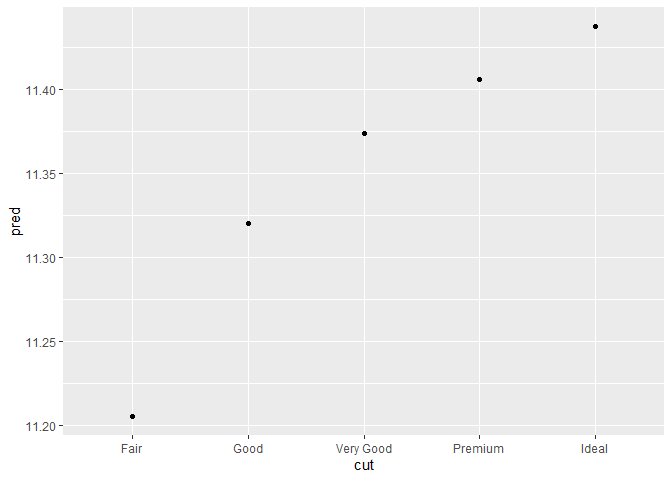
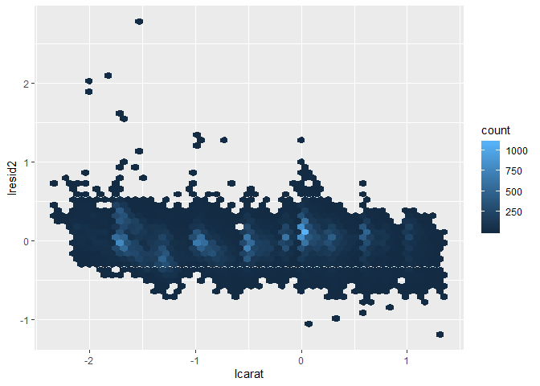

R for Data Science
================
true
2019년 7월

<style>
mystyle{
    font-family :  Georgia;
    font-size : 26px;
    color : PaleVioletRed  ;
}
</style>

> <mystyle> Part 4 </mystyle>  
> <mystyle> Model </mystyle>

모델의 목적은 데이터 셋의 한 가지 간단한 저차원의 요약을 제공하는 것이다. 이상적으로, 모델은 관심있는 현상에 의해 만들어진
사실 신호 패턴을 잡을 것이고 노이즈(관심 없는 임의 변동)를 무시할 것이다. 여기서는 예측 모델만 다룰 것이다. 또 다른
모델은 “data discovery”모델이다. 첫번째를 supervised라고 하고 두번째를 unsupervised라고 한다.

> Hypothesis Generation Versus Hypothesis Confirmation

전통적으로 모델은 추론에 집중하거나 가설이 사실인지 확인한다. 이것을 올바르게 하는 것은 복잡하지는 않지만 어렵다. 추론을
올바르게 하기 위해 반드시 알아야 할 몇가지 생각이 있다.

  - 각 관측은 탐색에 이용되거나 확인이지, 둘 다 사용 될 수는 없다.
  - 탐색을 위해 좋아하는 만큼 관측을 사용할 수 있지만, 확인에는 한번만 사용할 수 있다. 관측을 두번 사용하자마자, 확인에서
    탐색으로 바뀌어 버린다.

이것은 가설을 확인하기 위해 가설을 생성하기 위해 이용되는 데이터와 독립적인 데이터를 반드시 이용해야 하기 때문에 필요하다.
탐색에 절대적으로 잘못된 것은 없지만 기본적으로 오해의 소지가 있기 때문에 탐색 분석을 확인 분석으로 팔아선 안된다.

확인 분석을 하는 것에 대해서 진지해져야 한다면, 한가지 접근법은 분석을 시작하기 전에 데이터를 세 가지 조각으로 나누는 것이다.

  - <span style="background : yellow">데이터의 60%는 ***training(or
    exploration) set***. 이 데이터로는 어떤 것을 해도 허용된다. : 시각화를 하거나 엄청난 수의 모델을
    적합하거나.</span>
  - <span style="background : yellow">20%는 ***query set***. 모델을 비교하는데
    데이터를 이용할 수 있거나 직접 시각화에 이용할 수 있지만, 자동화된 프로세스의 일부로서 사용되기를 허용하면
    안된다.</span>
  - <span style="background : yellow">20%는 ***test set***. 이 데이터는 최종 모형을
    테스트 하기 위해, 단지 한번만 사용할 수 있다. </span>

이러한 구분은 훈련 데이터를 탐색하기 위해 허용되고 때때로 query set과 함께 확인하는 가설 후보를 생성할 수 있다. 올바른
모델을 가지는데 자신감이 있을 때 테스트 데이터와 함께 한번 확인할 수 있다.

확인 모델링을 할 때에도 당신은 여전히 EDA를 할 필요가 있다. 만약 어떤 EDA도 하지 않는다면, 데이터에 품질 문제에
맹인인채로 있을 것이다.

# Chapter18: Model Basics with modelr

모델의 목적은 데이터 셋의 간단한 저차원 요약을 제공하는 것이다. 책에서는 모델을 패턴과 잔차로 나는데에 이용할 것이다. 강한
패턴은 희미한 경향을 숨길 것이므로 데이터 셋을 탐색함으로써 구조층을 벗기는데 도움을 주기 위해 모델을 사용할 것이다.

하지만, 흥미있는 실제 데이터 셋에 모델을 사용하기 시작하기 전에, 모델이 어떻게 작동하는지의 기본을 이해해야 한다. 이 이유
때문에 책의 챕터는 시뮬레이션 된 데이터셋만을 이용하므로 독특하다. 이러한 데이터 셋은 매우 간단하고 모두 흥미롭지는
않지만 다음 챕터에서 실제 데이터에 같은 기술을 적용하기 전에 모델릴의 핵심을 이해하는 데에 도움을 줄 것이다.

모델에는 두가지 파트가 있다:

1.  먼저, 포착하고 싶은 패턴을 정확하게 표현하는 ***family of models***를 정의하라. 예를 들어, 패턴은
    직선이 될 수도 2차 곡선이 될 수도 있다. 함수로서 모델족을 $ y = a\_1 \* x + a\_2 or y =
    a\_1 \* x ^ a\_2$와 같이 표현할 수 있다. 여기에서 x와 y는 데이터로부터 알려진 변수이고 a\_1과
    a\_2는 다른 패턴을 포착하면 다양할 수 있는 모수이다.

2.  다음으로 데이터에 가장 가까운 족으로 부터 모델을 찾음으로써 적합된 모델을 생성한다. $ y = 3 \* x + 7 or
    y = 9 \* x ^ $ 와 같이 일반적인 모델족을 취하고 구체화한다.

적합된 모델이 단지 모델 족의 가장 가까운 모델이라는 것을 이해하는 것은 중요하다. 당신이 최적의 모델을 가지는 것을 의미한다.
이것은 좋은 모델을 가지는 것을 의미하지 않고 확실히 모델이 “true”라는 것을 의미하지는 않는다. 조지 박스(통계학자) 는
유명한 격언을 말하였다.

All models are wrong, but some are useful.

실제 세계에서 존재하는 시스템이 정확히 어느 간단한 모델로 표현될 수 있다면 매우 놀라울 것이다. 하지만 교활하게 선택된 지독하게
인색한 모델은 종종 놀라울 만하게 유용한 근사치를 제공한다. 예를 들어, PV = RT 법칙은 이상적인 기체가 상수 R을 통해
실제 기체엣너느 정확하게 사실은 아니지만 종종 유용한 근사를 제공하고 게다가 기체 분자의 행동에 대한 물리적 관점으로 부터
튀어 오르므로 구조가 유익하다.

그러한 모델을 위해 “모델이 진실인가?”하는 질문을 할 필요는 전혀 없다. 만약 “truth”이 “whole truth”가 된다면
답은 “아니요”이다. 오직 흥미있는 질문은 “모델이 이해를 돕고 유용한가?”

모델의 목적은 진실을 밝히는 것이 아니라 여전히 유용한 간단한 근사를 발견하는 것이다.

## A Simple Model

``` r
ggplot(sim1, aes(x, y)) + # simulated dataset sim1
  geom_point()
```

<!-- -->

데이터의 강한 패턴을 볼 수 있다. 패턴을 포착하고 명백히 하기 위해 모델을 사용하자. 모델의 기본을 제공하는 것이 우리의
일이다. 이 경우에, 선형 관계 처럼 보인다. 즉, $ y = a\_0 + a\_1 x$. 임의로 소수를 생성하고 이를
데이터에 오버레이 함으로써 패밀리로부터 족이 어떤가를 느끼기 시작한다.

``` r
models <- tibble(
  a1 = runif(250, -20, 40),
  a2 = runif(250, -5, 5)
)

ggplot(sim1, aes(x, y)) +
  geom_abline(
    aes(intercept = a1, slope = a2),
    data = models, alpha = 1/4
  ) +
  geom_point()
```

<!-- -->

좋은 모델을 찾자.

``` r
model1 <- function(a, data) {
  a[1] + data$x * a[2]
}
model1(c(7, 1.5), sim1)
```

    ##  [1]  8.5  8.5  8.5 10.0 10.0 10.0 11.5 11.5 11.5 13.0 13.0 13.0 14.5 14.5
    ## [15] 14.5 16.0 16.0 16.0 17.5 17.5 17.5 19.0 19.0 19.0 20.5 20.5 20.5 22.0
    ## [29] 22.0 22.0

``` r
measure_distance <- function(mod, data) {
  diff <- data$y - model1(mod, data)
  sqrt(mean(diff ^ 2))
}
measure_distance(c(7, 1.5), sim1)
```

    ## [1] 2.665212

purrr을 사용해서 이전에 정의된 모든 모델의 거리를 계산할 수 있다. 길이가 2인 수치 벡터로서 모델을 기대하는 함수 거리이기
때문에 헬퍼 함수가 필요하다.

``` r
sim1_dist <- function(a1, a2) {
  measure_distance(c(a1, a2), sim1)
}

models <- models %>% 
  mutate(dist = map2_dbl(a1, a2, sim1_dist))
models
```

    ## # A tibble: 250 x 3
    ##        a1      a2  dist
    ##     <dbl>   <dbl> <dbl>
    ##  1  13.2   4.48   23.5 
    ##  2   7.18  3.49   11.8 
    ##  3 -19.6   2.49   21.5 
    ##  4  28.8  -3.45   16.9 
    ##  5  15.9   0.0115  6.25
    ##  6 -15.6  -4.07   56.4 
    ##  7  13.9   1.81    8.64
    ##  8 -18.7  -0.551  38.0 
    ##  9   5.44  1.04    5.63
    ## 10   5.08  3.61   10.7 
    ## # ... with 240 more rows

다음으로 데이터에 10개의 최적 모델을 오버레이하자. `-dist` : 최적의 모델이 가장 밝은 색을 얻는 것을 보장하기 위한
쉬운 방법

``` r
ggplot(sim1, aes(x, y)) +
  geom_point(size = 2, color = "grey30") +
  geom_abline(
    aes(intercept = a1, slope = a2, color = -dist), # 거리가 작은 모델을 밝게하기 위해
    data = filter(models, rank(dist) <= 10)
  )
```

<!-- -->

우리는 또한 이 모델들을 관측치라고 생각할 수 있고 a1, a2와 -dist에 대해 산점도를 그릴 수 있다. 우리는 더이상
직접적으로 모델을 데이터와 비교할 방법을 보지 않지만 많은 모델을 한번에 볼 수 있다.

``` r
ggplot(models, aes(a1, a2)) +
  geom_point(
    data = filter(models, rank(dist) <= 10),
    size = 4, color = "red"
  ) +
  geom_point(aes(color = -dist))
```

<!-- -->

많은 임의 모델을 시도하는 대신에, 좀 더 체계적이고 균등하게 간격을 둔 그리드 점을 생성한다. 최적의 모델이 선행하는 플랏에
있는 것을 봄으로써 그리드의 모수를 골랐다.

``` r
grid <- expand.grid(
  a1 = seq(-5, 20, length = 25),
  a2 = seq(1, 3, length = 25)
) %>%
  mutate(dist = map2_dbl(a1, a2, sim1_dist))

grid %>% 
  ggplot(aes(a1, a2)) +
  geom_point(
    data = filter(grid, rank(dist) <= 10),
    size = 4, color = "red"
  ) +
  geom_point(aes(color = -dist))
```

<!-- -->

``` r
ggplot(sim1, aes(x, y)) +
  geom_point(size = 2, color = "grey30") +
  geom_abline(
    aes(intercept = a1, slope = a2, color = -dist),
    data = filter(grid, rank(dist) <= 10)
  )
```

<!-- -->

이 작업을 반복적으로 할 수 있겠지만 뉴턴-랩슨 방법이라 불리는 수치적 최적화가 있다.

``` r
best <- optim(c(0, 0), measure_distance, data = sim1)
best$par
```

    ## [1] 4.222248 2.051204

``` r
ggplot(sim1, aes(x, y)) +
  geom_point(size = 2, color = "grey30") +
  geom_abline(intercept = best$par[1], slope = best$par[2])
```

<!-- -->

``` r
sim1_mod <- lm(y ~ x, data = sim1)
coef(sim1_mod)
```

    ## (Intercept)           x 
    ##    4.220822    2.051533

## Exercises

1.  One downside of the linear model is that it is sensitive to unusual
    values because the distance incorporates a squared term. Fit a
    linear model to the following simulated data, and visualize the
    results. Rerun a few times to generate different simulated datasets.
    What do you notice about the model?

<!-- end list -->

``` r
sim1a <- tibble(
  x = rep(1:10, each = 3),
  y = x * 1.5 + 6 + rt(length(x), df = 2)
)
```

``` r
simt <- function(i) {
  tibble(
      x = rep(1:10, each = 3),
  y = x * 1.5 + 6 + rt(length(x), df = 2),
  .id = i
  )
}

sims <- map_df(1:12, simt)

ggplot(sims, aes(x, y)) +
  geom_point() +
  geom_smooth(method = "lm", color = "red") +
  facet_wrap(~ .id, ncol = 4)
```

<!-- --> 정규분포에 같은
방식을 취하면

``` r
sim_norm <- function(i) {
  tibble(
    x = rep(1:10, each = 3),
    y = x * 1.5 + 6 + rnorm(length(x)),
    .id = i
  )
}

simdf_norm <- map_df(1:12, sim_norm)

ggplot(simdf_norm, aes(x = x, y = y)) +
  geom_point() +
  geom_smooth(method = "lm", colour = "red") +
  facet_wrap(~ .id, ncol = 4)
```

<!-- --> 큰 이상치는
없어보이고 기울기가 비슷해 보인다.

``` r
tibble(
  x = seq(-5, 5, length.out = 100),
  normal = dnorm(x),
  student_t = dt(x, df = 2)
) %>% 
  gather(distribution, density, -x) %>% 
  ggplot(aes(x, density, color = distribution)) +
  geom_line()
```

<!-- --> 꼬리가 두터워서
그렇다.

2.  One way to make linear models more robust is to use a different
    distance measure. For example, instead of root-mean-squared
    distance, you could use mean-absolute distance:

<!-- end list -->

``` r
measure_distance <- function(mod, data) {
  diff <- data$y - make_prediction(mod, data)
  mean(abs(diff))
}
```

Use optim() to fit this model to the previous simulated data and compare
it to the linear model.

``` r
make_prediction <- function(mod, data) {
  mod[1] + mod[2] * data$x
}

best <- optim(c(0, 0), measure_distance, data = sim1a)
best$par
```

    ## [1] 6.539645 1.423841

``` r
measure_distance_ls <- function(mod, data) {
  diff <- data$y - (mod[1] + mod[2] * data$x)
  sqrt(mean(diff ^ 2))
}

best <- optim(c(0, 0), measure_distance_ls, data = sim1a)
best$par
```

    ## [1] 6.028930 1.501781

he MASS package’s rlm and lqs functions for more information and
functions to fit robust and resistant linear models.

3.  One challenge with performing numerical optimization is that it’s
    only guaranteed to find a local optimum. What’s the problem with
    optimizing a three parameter model like this?

he problem is that you for any values a\[1\] = a1 and a\[3\] = a3, any
other values of a\[1\] and a\[3\] where a\[1\] + a\[3\] == (a1 + a3)
will have the same fit.

## Visualizing Models

예측치를 봄으로써 모델을 이해하는 데에 집중할 것이다. 이것은 큰 이점이다: 예측 모델의 모든 유형은 예측치를 만들어서 예측
모델의 유형을 이해하는 기술의 같은 집합을 사용할 수 있다.

어느 모델이 포착하지 못하는지를 보는 것은 유용하다(잔차). 잔차는 강력한데 강력한 패턴을 제거해서 남아있는 희미한 경향을 볼 수
있기 때문이다.

### Predictions

모델로부터 예측치를 시각화하기 위해 데이터가 있는 지역을 다루는 균등하게 간격을 둔 값을 생성해서 시작한다. 가장 쉬운 방법은
`modelr::data_grid()`를 사용한다. 첫 번째 인자는 df이고 이어지는 각 인자는 유일한 값을 찾고 모든 조합을
생성한다.

``` r
grid <- sim1 %>% 
  data_grid(x)
grid
```

    ## # A tibble: 10 x 1
    ##        x
    ##    <int>
    ##  1     1
    ##  2     2
    ##  3     3
    ##  4     4
    ##  5     5
    ##  6     6
    ##  7     7
    ##  8     8
    ##  9     9
    ## 10    10

(이것은 모델에 변수를 추가하기 시작할 때 좀 더 흥미로워 질 것이다.)

다음으로 예측치를 추가한다. `modelr::add_predictions()`를 사용하고 이것은 df와 model을 취한다.
모델로부터 예측치를 df의 새로운 열에 추가한다.

``` r
grid <- grid %>% 
  add_predictions(sim1_mod)
```

다음으로 예측치를 플랏으로 그릴 것이다. `geom_abline()`과 비교해서 추가적인 작업에 대해 궁굼할지도 모른다. 하지만
이 접근의 이점은 가장 간단 모형에서 가장 족잡한 모형으로 R의 어느 모형과 작업할 것이다. 단지 시각화 기술에 의해
제한된다. 복잡한 모델 유형을 시각화 하는 방법에 관한 아이디어에 대해서
<http://vita.had.co.nz/papers/model-vis.html>

``` r
ggplot(sim1, aes(x)) +
  geom_point(aes(y = y)) +
  geom_line(
    aes(y = pred),
    data = grid,
    color = "red",
    size = 1
  )
```

<!-- -->

### Residuals

예측치의 뒤집힌 면은 잔차이다. 예측치는 모델이 포착한 패턴을 말해주고 잔차는 어떤 모델이 놓쳤는지를 알려준다. 잔차는 단지 먼저
계산된 관측값과 예측값 사이의 거리이다.

잔차는 `add_residuals()`로 추가할 수 있다. 하지만 원본 데이터셋을 사용하지 만들어진 grid를 사용하지 않는다.
왜냐하면 잔차를 계산하기 위해 실제 y값을 필요로 하기 때문이다.

``` r
sim1 <- sim1 %>% 
  add_residuals(sim1_mod)
sim1
```

    ## # A tibble: 30 x 3
    ##        x     y    resid
    ##    <int> <dbl>    <dbl>
    ##  1     1  4.20 -2.07   
    ##  2     1  7.51  1.24   
    ##  3     1  2.13 -4.15   
    ##  4     2  8.99  0.665  
    ##  5     2 10.2   1.92   
    ##  6     2 11.3   2.97   
    ##  7     3  7.36 -3.02   
    ##  8     3 10.5   0.130  
    ##  9     3 10.5   0.136  
    ## 10     4 12.4   0.00763
    ## # ... with 20 more rows

잔차가 모델에 대해서 말해주는 것을 이해하는 데에는 몇가지 다른 방식이 있다. 한가지 방식은 우리가 잔차의 분산을 이해하는데
도움을 주는 도수 다각형을 그리는 것이다.

``` r
ggplot(sim1, aes(resid)) +
  geom_freqpoly(binwidth = 0.5)
```

<!-- -->

모형의 품질을 눈금을 메기는 데에 도움을 준다. 관측값으로부터 얼마나 멀리 예측치가 떨어져 있는가? 잔차의 평균은 항상 0이 될
것이다.

원본 예측을 대신해서 잔차를 이용해서 플랏을 다시 그리기를 원할 수 있다.

``` r
ggplot(sim1, aes(x, resid)) +
  geom_ref_line(h = 0) +
  geom_point()
```

<!-- -->

## Exercises

1.  Instead of using lm() to fit a straight line, you can use loess() to
    fit a smooth curve. Repeat the process of model fitting, grid
    generation, predictions, and visualization on sim1 using loess()
    instead of lm(). How does the result compare to geom\_smooth()?

<!-- end list -->

``` r
sim1_loess <- loess(y ~ x, data = sim1)
sim1_lm <- lm(y ~ x, data = sim1)

grid_loess <- sim1 %>% 
  add_predictions(sim1_loess)

sim1 <- sim1 %>%
  add_residuals(sim1_lm) %>%
  add_predictions(sim1_lm) %>%
  add_residuals(sim1_loess, var = "resid_loess") %>%
  add_predictions(sim1_loess, var = "pred_loess")

plot_sim1_loess <-
  ggplot(sim1, aes(x = x, y = y)) +
  geom_point() +
  geom_line(aes(x = x, y = pred), data = grid_loess, colour = "red")
plot_sim1_loess
```

<!-- -->

``` r
ggplot(sim1, aes(x = x)) +
  geom_ref_line(h = 0) +
  geom_point(aes(y = resid)) +
  geom_point(aes(y = resid_loess), colour = "red")
```

<!-- -->

2.  add\_predictions() is paired with gather\_predictions() and
    spread\_predictions(). How do these three functions differ?

<!-- end list -->

``` r
sim1_mod <- lm(y ~ x, data = sim1)
grid <- sim1 %>%
  data_grid(x)

grid %>%
  add_predictions(sim1_mod, var = "pred_lm") %>%
  add_predictions(sim1_loess, var = "pred_loess")
```

    ## # A tibble: 10 x 3
    ##        x pred_lm pred_loess
    ##    <int>   <dbl>      <dbl>
    ##  1     1    6.27       5.34
    ##  2     2    8.32       8.27
    ##  3     3   10.4       10.8 
    ##  4     4   12.4       12.8 
    ##  5     5   14.5       14.6 
    ##  6     6   16.5       16.6 
    ##  7     7   18.6       18.7 
    ##  8     8   20.6       20.8 
    ##  9     9   22.7       22.6 
    ## 10    10   24.7       24.0

``` r
grid %>%
  gather_predictions(sim1_mod, sim1_loess)
```

    ## # A tibble: 20 x 3
    ##    model          x  pred
    ##    <chr>      <int> <dbl>
    ##  1 sim1_mod       1  6.27
    ##  2 sim1_mod       2  8.32
    ##  3 sim1_mod       3 10.4 
    ##  4 sim1_mod       4 12.4 
    ##  5 sim1_mod       5 14.5 
    ##  6 sim1_mod       6 16.5 
    ##  7 sim1_mod       7 18.6 
    ##  8 sim1_mod       8 20.6 
    ##  9 sim1_mod       9 22.7 
    ## 10 sim1_mod      10 24.7 
    ## 11 sim1_loess     1  5.34
    ## 12 sim1_loess     2  8.27
    ## 13 sim1_loess     3 10.8 
    ## 14 sim1_loess     4 12.8 
    ## 15 sim1_loess     5 14.6 
    ## 16 sim1_loess     6 16.6 
    ## 17 sim1_loess     7 18.7 
    ## 18 sim1_loess     8 20.8 
    ## 19 sim1_loess     9 22.6 
    ## 20 sim1_loess    10 24.0

``` r
grid %>%
  spread_predictions(sim1_mod, sim1_loess)
```

    ## # A tibble: 10 x 3
    ##        x sim1_mod sim1_loess
    ##    <int>    <dbl>      <dbl>
    ##  1     1     6.27       5.34
    ##  2     2     8.32       8.27
    ##  3     3    10.4       10.8 
    ##  4     4    12.4       12.8 
    ##  5     5    14.5       14.6 
    ##  6     6    16.5       16.6 
    ##  7     7    18.6       18.7 
    ##  8     8    20.6       20.8 
    ##  9     9    22.7       22.6 
    ## 10    10    24.7       24.0

4.  Why might you want to look at a frequency polygon of absolute
    residuals? What are the pros and cons compared to looking at the raw
    residuals?

<!-- end list -->

``` r
sim1 %>% 
  add_residuals(sim1_mod) %>% 
  ggplot(aes(abs(resid))) +
    geom_freqpoly(binwidth = 0.5)
```

<!-- -->

잔차의 퍼짐을 보는 것을 쉽게 한다. 잔차의 수를 두배 늘려준다. 하지만 잔차의 절대값을 사용하면 부호에 대한 정보를 잃어서 도수
다각형은 모델이 대칭적인지 알 수 없다.

## Formulas and Model Families

R에서 formula는 “특별한 행동”을 얻는 일반적인 방법을 제공한다. 변수의 값을 연산하기 보다 포착해서 함수에 의해 해석되게
한다.

R의 대다수의 모델링 함수는 formula에서 함수로 표준 변환을 이용한다. \(y ~ x가 y = a_1 + a_2 * x\)로
번역됨을 봤다. R이 실제로 하는것을 보고싶다면, `model_matrix()`함수를 사용할 수 있다. df와 formula를
취하고 모델 연산을 정의하는 tibble을 반환한다: 출력의 각각의 열은 모델의 계수와 관련되고 함수는 항상
\(y = a_1 *out1 + a_2 * out_2\)

``` r
df <- tribble(
  ~y, ~x1, ~x2,
  4, 2, 5,
  5, 1, 6
)
model_matrix(df, y ~ x1)
```

    ## # A tibble: 2 x 2
    ##   `(Intercept)`    x1
    ##           <dbl> <dbl>
    ## 1             1     2
    ## 2             1     1

``` r
model_matrix(df, y ~ x1 - 1)
```

    ## # A tibble: 2 x 1
    ##      x1
    ##   <dbl>
    ## 1     2
    ## 2     1

``` r
model_matrix(df, y ~ x1 + x2)
```

    ## # A tibble: 2 x 3
    ##   `(Intercept)`    x1    x2
    ##           <dbl> <dbl> <dbl>
    ## 1             1     2     5
    ## 2             1     1     6

### Categorical Variables

formula로부터 생성한 함수는 예측변수가 연속일 때 간단하지만 범주 면 조금 더 복잡하다.

``` r
df <- tribble(
  ~ sex, ~ response,
  "male", 1,
  "female", 2,
  "male", 1
)
model_matrix(df, response ~ sex)
```

    ## # A tibble: 3 x 2
    ##   `(Intercept)` sexmale
    ##           <dbl>   <dbl>
    ## 1             1       1
    ## 2             1       0
    ## 3             1       1

왜 R이 sexfemale 열을 만들지 않는지 궁굼할 수 있다. 문제는 다른 열에 기반한 완전히 예측가능한 열을 만드는 것이다.
(즉, sexfemale = 1 - sexmale). <생략>

시각화에 집중하는 것은 정확한 모수화를 걱정하지 않아도 된다.

``` r
ggplot(sim2) +
  geom_point(aes(x, y))
```

<!-- -->

``` r
mod2 <- lm(y ~ x, data = sim2)
grid <- sim2 %>% 
  data_grid(x) %>% 
  add_predictions(mod2)
grid
```

    ## # A tibble: 4 x 2
    ##   x      pred
    ##   <chr> <dbl>
    ## 1 a      1.15
    ## 2 b      8.12
    ## 3 c      6.13
    ## 4 d      1.91

효과적으로 범주 x는 각 범주의 평균 값을 예측할 것이다.

``` r
ggplot(sim2, aes(x)) +
  geom_point(aes(y = y)) +
  geom_point(
    data = grid,
    aes(y = pred),
    color = "red",
    size = 4
  )
```

<!-- -->

관측하지 않은 레벨에 대해 예측치를 만들 수 없다. 때때로 우연히 이것을 할 수 있어서 에러 메시지를 인식하는 것이 좋다.

``` r
tibble(x = "e") %>% 
  add_predictions(mod2)
```

    ## Error in model.frame.default(Terms, newdata, na.action = na.action, xlev = object$xlevels): factor x has new level e

### Interactions(Continuous and Categorical)

sim3은 연속형변수와 범주형 변수를 포함하고 있다.

``` r
ggplot(sim3, aes(x1, y)) +
  geom_point(aes(color = x2))
```

<!-- -->

두 가지 가능한 모델이 있다.

``` r
mod1 <- lm(y ~ x1 + x2, data = sim3)
mod2 <- lm(y ~ x1 * x2, data = sim3)
```

이 모델들을 시각화 하기 위해 두가지 새로욱 기술을 필요로 한다.

  - 두 가지 예측변수를 가져서 `data_grid()`를 양쪽 변수에 필요로 할 수 있다. 모든 유일한 x1과 x2그리고 모든
    조합을 생성한다.
  - 두 모델로부터 예측치를 동시에 생성하기 위해 `gather_predictions()`를 사용해서 각 예측치를 추가할 수
    있다. `gather_predictions()`의 상호보완은 `spread_predictions()`이고 새로운
    열에 각 예측치를 추가한다.

<!-- end list -->

``` r
grid <- sim3 %>% 
  data_grid(x1, x2) %>% 
  gather_predictions(mod1, mod2)
grid
```

    ## # A tibble: 80 x 4
    ##    model    x1 x2     pred
    ##    <chr> <int> <fct> <dbl>
    ##  1 mod1      1 a      1.67
    ##  2 mod1      1 b      4.56
    ##  3 mod1      1 c      6.48
    ##  4 mod1      1 d      4.03
    ##  5 mod1      2 a      1.48
    ##  6 mod1      2 b      4.37
    ##  7 mod1      2 c      6.28
    ##  8 mod1      2 d      3.84
    ##  9 mod1      3 a      1.28
    ## 10 mod1      3 b      4.17
    ## # ... with 70 more rows

``` r
ggplot(sim3, aes(x1, y, color = x2)) +
  geom_point() +
  geom_line(data = grid, aes(y = pred)) +
  facet_wrap(~ model)
```

<!-- -->

첫 번째는 절편만 다르지만 두 번째는 기울기 절편 둘다 다르다. 어느 모델이 더 좋은가? 잔차를 살펴볼 수 있다.

``` r
sim3 <- sim3 %>% 
  gather_residuals(mod1, mod2)

ggplot(sim3, aes(x1, resid, color = x2)) +
  geom_point() +
  facet_grid(model ~ x2)
```

<!-- -->

mod2에는 명백한 패턴이 거의 보이지 않는다. mod1의 잔차는 모델이 분명히 b에서 패턴을 가지고 있다.

### Interactions(Two Continuous)

두 연속형 변수에 동일한 모형을 보자. 처음에는 거의 동일하게 이전 예제와 같이 진행한다.

``` r
mod1 <- lm(y ~ x1 + x2, data = sim4)
mod2 <- lm(y ~ x1 * x2, data = sim4)

grid <- sim4 %>% 
  data_grid(
    x1 = seq_range(x1, 5),
    x2 = seq_range(x2, 5)
  ) %>% 
  gather_predictions(mod1, mod2)
grid
```

    ## # A tibble: 50 x 4
    ##    model    x1    x2   pred
    ##    <chr> <dbl> <dbl>  <dbl>
    ##  1 mod1   -1    -1    0.996
    ##  2 mod1   -1    -0.5 -0.395
    ##  3 mod1   -1     0   -1.79 
    ##  4 mod1   -1     0.5 -3.18 
    ##  5 mod1   -1     1   -4.57 
    ##  6 mod1   -0.5  -1    1.91 
    ##  7 mod1   -0.5  -0.5  0.516
    ##  8 mod1   -0.5   0   -0.875
    ##  9 mod1   -0.5   0.5 -2.27 
    ## 10 mod1   -0.5   1   -3.66 
    ## # ... with 40 more rows

모든 유일한 x를 사용하는 대신에 최솟값과 최댓값 사이의 동일하게 간격을 둔 5개의 값을 사용할 것이다. 아마 여기서 중요하지는
않지만 일반적으로는 유용한 기술이다. `seq_range()`에는 4가지 유용한 인자가 있다.

  - `pretty = TRUE`는 이쁜 수열을 생성할 것이다. 사람의 눈에 멋지다.

<!-- end list -->

``` r
seq_range(c(0.0123, 0.923423), n = 5)
```

    ## [1] 0.0123000 0.2400808 0.4678615 0.6956423 0.9234230

``` r
seq_range(c(0.0123, 0.923423), n = 5, pretty = TRUE)
```

    ## [1] 0.0 0.2 0.4 0.6 0.8 1.0

  - `trim = 0.1`은 꼬리의 10%값을 잘라낸다. 만약 변수가 꼬리가 긴 분포이고 중심에 있는 값 생성에 집중하고
    싶다면 유용하다.

<!-- end list -->

``` r
x1 <- rcauchy(100)
seq_range(x1, n = 5)
```

    ## [1] -48.679629 -23.101643   2.476343  28.054330  53.632316

``` r
seq_range(x1, n = 5, trim = 0.1)
```

    ## [1] -5.296845  1.850271  8.997386 16.144501 23.291616

``` r
seq_range(x1, n = 5, trim = 0.25)
```

    ## [1] -2.3301945 -0.8513928  0.6274088  2.1062105  3.5850121

``` r
seq_range(x1, n = 5, trim = 0.5)
```

    ## [1] -0.9313463 -0.3836127  0.1641208  0.7118543  1.2595879

  - `expand = 0.1`은 `trim()`의 반대이다. 10%만큼 범위를 확장시킨다.

<!-- end list -->

``` r
x2 <- c(0, 1)
seq_range(x2, n = 5)
```

    ## [1] 0.00 0.25 0.50 0.75 1.00

``` r
seq_range(x2, n = 5, expand = 0.10)
```

    ## [1] -0.050  0.225  0.500  0.775  1.050

``` r
seq_range(x2, n = 5, expand = 0.25)
```

    ## [1] -0.1250  0.1875  0.5000  0.8125  1.1250

``` r
seq_range(x2, n = 5, expand = 0.50)
```

    ## [1] -0.250  0.125  0.500  0.875  1.250

``` r
ggplot(grid, aes(x1, x2)) +
  geom_tile(aes(fill = pred)) +
  facet_wrap(~ model)
```

<!-- -->

두 모델은 별로 다르지 않은 것 같다. 하지만 우리의 눈과 뇌는 정확하게 음영을 구분하지 못한다.

``` r
ggplot(grid, aes(x1, pred, color = x2, group = x2)) +
  geom_line() +
  facet_wrap(~ model)
```

<!-- -->

``` r
ggplot(grid, aes(x2, pred, color = x1, group = x1)) +
  geom_line() +
  facet_wrap(~ model)
```

<!-- -->

이것은 교호작용이 두 연속형 변수 사이에서 기본적으로 하나의 범주와 연속형 변수와 같은 방식으로 작용한다는 것을 보여준다. y를
예측하기 위해서 x1와 x2를 동시에 고려할 필요가 있다.

당신은 단지 두 개의 연속형 변수를 볼 수 있다. 좋은 시각화는 어렵다. 하지만 합리적이다. 세개나 그 이상의 변수가 동시에
상호작용 하는 방법을 이해하는 것이 쉽다는 것을 기대하지는 마라. 하지만 또다시, 우리는 탐색을 위해 모델을 이용하고
서서히 시간에 다라 모델을 만들 수 있기 때문에 약간 어려움을 면할 수 있다. 모델은 완벽할 필요가 없고 데이터를 약간 더
밝히는 데에 도움을 줄 수 있다.

만약 mod2가 mod1보다 좋은지 어떤지 확인하기 위해 잔차를 들여다 보는데 시간을 쓸 수 있다. 하지만 아주 미묘하다.

### Trasformations

모델 formula 내에 변환을 수행할 수 있다. 예를 들어, \(log(y) ~ sqrt(x1) + x2\) is
transformed to \(y = a_1 + a_2 * x1 * sqrt(x) + a_3 * x2\) 변환이 연산자를
포함한다면 `I()`를 포함할 필요가 있다. `y ~ x ^ 2 + x`에서 x\*x는 자기 자신에 대한
상호작용을 의미해서 x와 동일하고 x + x에서 x는 불필요하므로 결국 `y ~ x`가 된다.

만약 모델이 하는것에 대해 혼란스럽게 된다면 당신은 항상 `model_matrix()`을 `lm()`이 뭘 하는지 보기 위해
사용할 수 있다.

``` r
df <- tribble(
  ~y, ~x,
  1, 1,
  2, 2,
  3, 3
)
model_matrix(df, y ~ x^2 + x)
```

    ## # A tibble: 3 x 2
    ##   `(Intercept)`     x
    ##           <dbl> <dbl>
    ## 1             1     1
    ## 2             1     2
    ## 3             1     3

``` r
model_matrix(df, y ~ I(x^2) + x)
```

    ## # A tibble: 3 x 3
    ##   `(Intercept)` `I(x^2)`     x
    ##           <dbl>    <dbl> <dbl>
    ## 1             1        1     1
    ## 2             1        4     2
    ## 3             1        9     3

변환은 비선형 함수에 근사하기에 유용하다.

``` r
model_matrix(df, y ~ poly(x, 2))
```

    ## # A tibble: 3 x 3
    ##   `(Intercept)` `poly(x, 2)1` `poly(x, 2)2`
    ##           <dbl>         <dbl>         <dbl>
    ## 1             1     -7.07e- 1         0.408
    ## 2             1     -7.85e-17        -0.816
    ## 3             1      7.07e- 1         0.408

하지만 `poly()`의 문제는 데이터의 범위 밖에서 다항식이 급격히 양,음 무한대로 가버린다. 안전한 대안은 자연스로운
spline을 사용하는 것이다.

``` r
library(splines)
model_matrix(df, y ~ ns(x, 2))
```

    ## # A tibble: 3 x 3
    ##   `(Intercept)` `ns(x, 2)1` `ns(x, 2)2`
    ##           <dbl>       <dbl>       <dbl>
    ## 1             1       0           0    
    ## 2             1       0.566      -0.211
    ## 3             1       0.344       0.771

비선형 함수를 근사해보자.

``` r
sim5 <- tibble(
  x = seq(0, 3.5 * pi, length = 50),
  y = 4 * sin(x) + rnorm(length(x))
)
ggplot(sim5, aes(x, y)) +
  geom_point()
```

<!-- -->

``` r
mod1 <- lm(y ~ ns(x, 1), data = sim5)
mod2 <- lm(y ~ ns(x, 2), data = sim5)
mod3 <- lm(y ~ ns(x, 3), data = sim5)
mod4 <- lm(y ~ ns(x, 4), data = sim5)
mod5 <- lm(y ~ ns(x, 5), data = sim5)

grid <- sim5 %>% 
  data_grid(x = seq_range(x, n = 50, expand = 0.1)) %>% 
  gather_predictions(mod1, mod2, mod3, mod4, mod5, .pred = "y") # .pred인자는 예측값의 이름

ggplot(sim5, aes(x, y)) +
  geom_point() +
  geom_line(data = grid, color = "red") +
  facet_wrap(~ model)
```

<!-- -->

데이터의 범위 밖에서는 extrapolation은 명백히 나쁘다. 다항식을 가지는 함수에 근사하는 단점이다. 하지만 모든 모델이
가지는 실제 문제이다. 모델은 당신이 본 데이터의 범위 밖에서 extrapolate를 시작할 때 행동이 진실이라고 절대
말해주지 않는다. 이론과 과학에 의존해야만 한다.

## Exercises

1.  What happens if you repeat the analysis of sim2 using a model
    without an intercept? What happens to the model equation? What
    happens to the predictions?

<!-- end list -->

``` r
mod2a <- lm(y ~ x - 1, data = sim2)
mod2 <- lm(y ~ x, data = sim2)
grid <- sim2 %>%
  data_grid(x) %>%
  spread_predictions(mod2, mod2a)
grid
```

    ## # A tibble: 4 x 3
    ##   x      mod2 mod2a
    ##   <chr> <dbl> <dbl>
    ## 1 a      1.15  1.15
    ## 2 b      8.12  8.12
    ## 3 c      6.13  6.13
    ## 4 d      1.91  1.91

회귀 계수는 다르지만 예측값은 동일하다. 회귀 계수는 mod2의 계수들에서 절편을 더하면 mod2a의 계수와 정확하게 일치한다.

2.  For sim4, which of mod1 and mod2 is better? I think mod2 does a
    slightly better job at removing patterns, but it’s pretty subtle.
    Can you come up with a plot to support my claim?

솔직히 이건 이 책대로 풀면 안된다. 하지만 일단 풀자..

``` r
mod1 <- lm(y ~ x1 + x2, data = sim4)
mod2 <- lm(y ~ x1 * x2, data = sim4)

sim4_mods <- gather_residuals(sim4, mod1, mod2)

ggplot(sim4_mods, aes(resid, color = model)) +
  geom_freqpoly(binwidth = 0.5) +
  geom_rug()
```

<!-- -->

``` r
ggplot(sim4_mods, aes(abs(resid), color = model)) +
  geom_freqpoly(binwidth = 0.5) +
  geom_rug()
```

<!-- -->

``` r
sim4_mods %>% 
  group_by(model) %>% 
  summarise(resid = sd(resid))
```

    ## # A tibble: 2 x 2
    ##   model resid
    ##   <chr> <dbl>
    ## 1 mod1   2.10
    ## 2 mod2   2.07

## Missing Values

결측값은 명백하게 변수 사이의 관계에 대한 정보를 전달하지 않는다. 모델링 함수는 결측치를 포함하는 행을 제거한다. R의 디폴트
행동은 조용히 제거하지만 `options(na.action = na.warn)`은 경고를 확실히 보여준다.

``` r
df <- tribble(
  ~x, ~y,
  1, 2.2,
  2, NA,
  3, 3.5,
  4, 8.3,
  NA, 10
)
mod <- lm(y ~ x, data = df)
```

    ## Warning: Dropping 2 rows with missing values

``` r
options(na.action = na.warn)
mod <- lm(y ~ x, data = df)
```

    ## Warning: Dropping 2 rows with missing values

경고를 보고싶지 않으면, `na.action = na.exclude`

``` r
mod <- lm(y ~ x, data = df, na.action = na.exclude)
```

사용된 관측치의 수를 보고싶다면

``` r
nobs(mod)
```

    ## [1] 3

# Ohter Model Families

  - ***Generalized linear models***, `stats::glm()`. 선형 모형은 반응변수가 연속이고
    잔차가 정규분포임을 가정한다. 일반화선형모혀선 ㅅ형모형을 연속이 아닌 반응변수(이항 데이터이거나 카운트데이터)까확
    확장한다. 통계적 가능도의 생각에 기반한 거리 측도를 정의함으로써 작동한다.
  - ***Generalized additive models***, `mgcv::gam()`, 일반화 선형 모형을 임의의 평활화
    함수를 포함하도록 확장시킨다. formula를 `y ~ s(x)`와 같이 쓸 수 있고 `y = f(x)`가 된다. 그리고
    이 formula는 `gam()`이 어떤 함수가 될지 정한다. (다룰 수 있는 문제를 만들도록 평활화 제한을
    종속시킨다.)
  - ***Penalized linear models***, `glmnet::glmnet()`, 복잡한 모델을 불리하게 하는
    거리에 패널티 항을 추가한다.(원점과 모수 벡터 사이에 거리에 의해 정의된). 이것은 같은 모집단으로부터 새로운
    데이터셋을 일반화하기 좋게 모델을 만드는 경향이 있다.
  - ***Robust linear models***, `MASS:rlm()`, 아주 멀리 있는 점을 downweight한
    거리를 조정한다. 이상치가 없을 때 좋지 않은 비용으로 이상치에 덜 민감하한 한다.
  - **Trees**, `rpart:rpart()`, 선형모델에 완전히 다른 방식으로 문제 해결에 달려 든다. constant
    model을 낱낱으로 적합하고 데이터를 작고 작은 조각으로 나눈다. 나무는 그 자체로는 끔직하게 효과적이지 않지만,
    *random forests*`randomForest::randomForest()`나 *gradient boosting
    machies* `xgboost::xgboost()`같은 모델에 의해 집계되는데 이용되어졌을 때 매우 강력하다.

이러한 모델은 모두 프로그래밍 관점에서 비슷하게 작동한다. 선형 모델에 숙달하면 다른 모델 클래스에 메커니즘을 쉽게 숙달할 수
있다. 숙련된 모델러는 좋은 일반적인 원리의 혼합이고 기술의 큰 도구상자를 가진다.

# Chapter19: Model Building

이전 챕터에서는 선형 모형이 어떻게 작동하는지와 모델이 당신에게 말해주는 것을 이해하는 기본적인 도구들을 학습했다. 이전 챕터에서
모델의 작동 방식을 학습하는데에 도움을 주는 시뮬레이트된 데이터셋에 집중했었다. 이 챕터에서는 실제데이터에 집중할 것이고 데이터를
이해하는데에 도움을 주는 모델을 진보적으로 개발할 방법을 보여줄 것이다.

모델이 패턴과 잔차로 데이터를 나누는 것에 대해 생각할 수 있는 사실을 이용할 것이다. 시각화로 패턴을 찾을 것이고 패턴을 모델과
함께 구체적이고 정확하게 만들 것이다. 그리고 나서 과정을 반복하고 하지만 기존의 반응 변수를 모델로부터 잔차로 대체할 것이다.
목적은 데이터와 당신의 머리로부터의 암시적 지식으로부터 양적 모델에서의 명시적 지식으로의 이행이다. 이것은 새로운 영역에의
적용을 쉽게 할 것이고, 다른 사람이 사용하기에 쉬울 것이다.

매우 크고 복잡한 데이터셋에서 많은 일이 있을 것이다. 확실히 대안적 접근법이 있다. 머신러닝 접근법이 모델의 예측 능력에
집중하기가 더 간단하다. 이러한 접근법은 블랙 박스를 만드는 경향이 있다. 모델은 예측치를 생성하는데에 좋지만
이유를 알 수 없다. 전적으로 합리적인 접근이지만 모델에 대한 실제 세계의 지식을 적용하기 어렵다. 결국에 모델을
장기적으로 계속 작업할지의 여부에 대해 평가하기 어렵게 한다. 대부분의 실제 모델에서 당신에게 이러한 접근법과 클래식한
자동화된 접근법을 조합하는 것을 기대한다.

어려움은 멈추는 시기를 아는 것이다. 언제 당신의 모델이 충분히 좋고, 언제 추가적 투자가 상과가 없는지를 이해하는 것이
필요하다. 특히 이 인용구를 좋아한다. <생략>

``` r
options(na.action = na.warn)
```

## Why Are Low-Quality Diamonds More Expensive?

``` r
grid.arrange(
ggplot(diamonds, aes(cut, price)) + geom_boxplot(),
ggplot(diamonds, aes(color, price)) + geom_boxplot(),
ggplot(diamonds, aes(clarity, price)) + geom_boxplot(),
ncol = 3)
```

<!-- -->

### Pirce and Carat

중요한 혼합된 변수가 있기 때문에 저품질의 다이아가 가격이 높은 것 처럼 보인다.

``` r
ggplot(diamonds, aes(carat, price)) +
  geom_hex(bins = 50) # bins : 수직,수평 방향에 bin의 수
```

<!-- -->

어떻게 다이아의 다른 속성이 상대 가격에 영향을 미치는지 케럿의 영향을 분리하기 위해 모델을 적합함으로써 쉽게 볼 수 있다.
하지만 먼저, 함게 작업하기 쉽게하는 다이아 데이터셋을 다수 조정하자.

1.  2.5케럿보다 작은 다이아에 집중하자.(데이터의 99.7%)
2.  케럿과 가격의 로그변환

<!-- end list -->

``` r
diamonds2 <- diamonds %>% 
  filter(carat <= 2.5) %>% 
  mutate(lprice = log2(price), lcarat = log2(carat))

ggplot(diamonds2, aes(lcarat, lprice)) +
  geom_hex(bins = 50)
```

<!-- -->

``` r
mod_diamond <- lm(lprice ~ lcarat, data = diamonds2)
```

역변환을 해서 로브 변환을 되돌리고 원본 데이터에 예측치를 겹칠 수 있다.

``` r
grid <- diamonds2 %>% 
  data_grid(carat = seq_range(carat, 20)) %>% 
  mutate(lcarat = log2(carat)) %>% 
  add_predictions(mod_diamond, "lprice") %>% 
  mutate(price = 2 ^ lprice)

ggplot(diamonds2, aes(carat, price)) +
  geom_hex(bins = 50) +
  geom_line(data = grid, color = "red", size = 1)
```

<!-- -->

모델을 믿는다면, 큰 다이아몬드는 기대했던 것 보다 싸다. 19000달러를 넘는 다이아가 없다. 잔차를 살펴보면 강한 선형 패턴을
성공적으로 제거한 것을 검증한다.

``` r
diamonds2 <- diamonds2 %>% 
  add_residuals(mod_diamond, "lresid")

ggplot(diamonds2, aes(lcarat, lresid)) +
  geom_hex(bins = 50)
```

<!-- -->

``` r
grid.arrange(
ggplot(diamonds2, aes(cut, lresid)) + geom_boxplot(),
ggplot(diamonds2, aes(color, lresid)) + geom_boxplot(),
ggplot(diamonds2, aes(clarity, lresid)) + geom_boxplot(),
ncol = 3)
```

<!-- --> y축을 해석하기위해
잔차가 우리에게 말해주는 것과 스케일을 생각할 필요가 있다. -1의 잔차는 lprice가 가중치에 오로지 기반한 예측보다 1 단위
작다는 것이다.-1은 2^-1을 의미해서 예측한 가격의 절반이라는 뜻이다. 잔차가 1은 lprice가 예측한 가격의 두배이다.

### A More Complicated Model

원한다면 모델을 계속해서 개발할 수 있고 모델을 명백하게 해줄 것을 관측하는 영향으로 옮겨간다. 예를 들어, 이러한 범주형 변수의
영향을 명백하게 만들어주기 위해 color, cut, and clarity를 모델에 포함한다.

``` r
mod_diamond2 <- lm(
  lprice ~ lcarat + color + cut + clarity,
  data = diamonds2
)
```

이 모델은 네개의 예측변수를 포함한다. 그래서 시각화하기 어렵다. 다행스럽게도 현재 모두 독립이고 이것은 네 개의 플랏에
개별적으로 플랏을 그릴 수 있다. 과정을 쉽게 하려고 data\_grid의 .model인자를 사용할 것이다.

``` r
grid <- diamonds2 %>% 
  data_grid(cut, .model = mod_diamond2) %>% 
  add_predictions(mod_diamond2)
grid # cut을 제외하고 모두 값을 고정
```

    ## # A tibble: 5 x 5
    ##   cut       lcarat color clarity  pred
    ##   <ord>      <dbl> <chr> <chr>   <dbl>
    ## 1 Fair      -0.515 G     VS2      11.2
    ## 2 Good      -0.515 G     VS2      11.3
    ## 3 Very Good -0.515 G     VS2      11.4
    ## 4 Premium   -0.515 G     VS2      11.4
    ## 5 Ideal     -0.515 G     VS2      11.4

``` r
ggplot(grid, aes(cut, pred)) +
  geom_point()
```

<!-- --> 명백하게 제공하지
않은 값을 모델이 필요로 하면 `data_grid()`는 자동적으로 일반적인 값으로 채워 넣는다. 연속형 변수에서는 중앙값을
사용하고 범주형 변수에서는 가장 흔한 값을 사용한다.

``` r
# If you optionally supply a model, missing predictors will
# be filled in with typical values
mod <- lm(mpg ~ wt + cyl + vs, data = mtcars)
data_grid(mtcars, .model = mod) # 여기서  wt : 중앙 cyl, vs: 빈도수가 가장 큰 값
```

    ## # A tibble: 1 x 3
    ##      wt   cyl    vs
    ##   <dbl> <dbl> <dbl>
    ## 1  3.32     6     0

``` r
data_grid(mtcars, cyl = seq_range(cyl, 9), .model = mod)
```

    ## # A tibble: 9 x 3
    ##     cyl    wt    vs
    ##   <dbl> <dbl> <dbl>
    ## 1   4    3.32     0
    ## 2   4.5  3.32     0
    ## 3   5    3.32     0
    ## 4   5.5  3.32     0
    ## 5   6    3.32     0
    ## 6   6.5  3.32     0
    ## 7   7    3.32     0
    ## 8   7.5  3.32     0
    ## 9   8    3.32     0

``` r
diamonds2 <- diamonds2 %>% 
  add_residuals(mod_diamond2, "lresid2")
ggplot(diamonds2, aes(lcarat, lresid2)) +
  geom_hex(bins = 50)
```

<!-- -->

비정상적인 값을 개별적으로 보는 것은 종종 유용하다.

``` r
diamonds2 %>% 
  filter(abs(lresid2) > 1) %>% 
  add_predictions(mod_diamond2) %>% 
  mutate(pred = round(2 ^ pred)) %>% 
  select(price, pred, carat:table, x:z) %>% 
  arrange(price)
```

    ## # A tibble: 16 x 11
    ##    price  pred carat cut       color clarity depth table     x     y     z
    ##    <int> <dbl> <dbl> <ord>     <ord> <ord>   <dbl> <dbl> <dbl> <dbl> <dbl>
    ##  1  1013   264 0.25  Fair      F     SI2      54.4    64  4.3   4.23  2.32
    ##  2  1186   284 0.25  Premium   G     SI2      59      60  5.33  5.28  3.12
    ##  3  1186   284 0.25  Premium   G     SI2      58.8    60  5.33  5.28  3.12
    ##  4  1262  2644 1.03  Fair      E     I1       78.2    54  5.72  5.59  4.42
    ##  5  1415   639 0.35  Fair      G     VS2      65.9    54  5.57  5.53  3.66
    ##  6  1415   639 0.35  Fair      G     VS2      65.9    54  5.57  5.53  3.66
    ##  7  1715   576 0.32  Fair      F     VS2      59.6    60  4.42  4.34  2.61
    ##  8  1776   412 0.290 Fair      F     SI1      55.8    60  4.48  4.41  2.48
    ##  9  2160   314 0.34  Fair      F     I1       55.8    62  4.72  4.6   2.6 
    ## 10  2366   774 0.3   Very Good D     VVS2     60.6    58  4.33  4.35  2.63
    ## 11  3360  1373 0.51  Premium   F     SI1      62.7    62  5.09  4.96  3.15
    ## 12  3807  1540 0.61  Good      F     SI2      62.5    65  5.36  5.29  3.33
    ## 13  3920  1705 0.51  Fair      F     VVS2     65.4    60  4.98  4.9   3.23
    ## 14  4368  1705 0.51  Fair      F     VVS2     60.7    66  5.21  5.11  3.13
    ## 15 10011  4048 1.01  Fair      D     SI2      64.6    58  6.25  6.2   4.02
    ## 16 10470 23622 2.46  Premium   E     SI2      59.7    59  8.82  8.76  5.25

이것이 모델의 문제를 가르키는지 혹은 데이터에 에러가 있는지를 고려하는데에 시간을 쓰는 것은 가치가 있다.

## Exercises

1.  If log(price) = a\_0 + a\_1 \* log(carat), what does that say about
    the relationship between price and carat?

\(ln(y) = \beta_0 + \beta_1 ln(x) + \epsilon\): $ % y = 1% x$ x가 1% 변하면
y는 beta\_1% 만큼 변한다.

2.  Extract the diamonds that have very high and very low residuals. Is
    there anything unusual about these diamonds? Are they particularly
    bad or good, or do you think these are pricing errors?

<!-- end list -->

``` r
diamonds2 <- 
  diamonds %>% 
  mutate(lprice = log2(price),
         lcarat = log2(carat))

mod1 <- lm(lprice ~ lcarat + color + clarity + cut, data = diamonds2)

bottom <- 
  diamonds2 %>% 
  add_residuals(mod1) %>% 
  arrange(resid) %>% 
  slice(1:10)  

top <-
  diamonds2 %>% 
  add_residuals(mod1) %>% 
  arrange(-resid) %>% 
  slice(1:10)

bind_rows(bottom, top) %>% 
  select(price, carat, resid)
```

    ## # A tibble: 20 x 3
    ##    price carat  resid
    ##    <int> <dbl>  <dbl>
    ##  1  6512 3     -1.46 
    ##  2 10470 2.46  -1.17 
    ##  3 10453 3.05  -1.14 
    ##  4 14220 3.01  -1.12 
    ##  5  9925 3.01  -1.12 
    ##  6 18701 3.51  -1.09 
    ##  7  1262 1.03  -1.04 
    ##  8  8040 3.01  -1.02 
    ##  9 12587 3.5   -0.990
    ## 10  8044 3     -0.985
    ## 11  2160 0.34   2.81 
    ## 12  1776 0.290  2.10 
    ## 13  1186 0.25   2.06 
    ## 14  1186 0.25   2.06 
    ## 15  1013 0.25   1.94 
    ## 16  2366 0.3    1.61 
    ## 17  1715 0.32   1.57 
    ## 18  4368 0.51   1.36 
    ## 19 10011 1.01   1.31 
    ## 20  3807 0.61   1.31

여기서 slice대신 head를 사용해도 되고 filter를 사용해도 되지만 slice는 그룹화 하면 그룹화 되어 있는 상태로
데이터를 잘라준다. 그리고 filter는 row\_number()와 섞으면 되지만 코드가 다소 길다.

4.  Does the final model, mod\_diamonds2, do a good job of predicting
    diamond prices? Would you trust it to tell you how much to spend if
    you were buying a diamond?

se.fit = TRUE를 하게 되면 다음과 같다.

``` r
predict(mod1, se.fit = TRUE) %>% str()
```

    ## List of 4
    ##  $ fit           : Named num [1:53940] 8.11 8.07 8.55 8.71 8.15 ...
    ##   ..- attr(*, "names")= chr [1:53940] "1" "2" "3" "4" ...
    ##  $ se.fit        : num [1:53940] 0.00352 0.00339 0.00411 0.0038 0.00539 ...
    ##  $ df            : int 53921
    ##  $ residual.scale: num 0.193

``` r
diamonds2 %>% 
  add_predictions(mod1) %>% 
  mutate(pred = 2 ^ pred) %>% 
  select(price, pred) %>% 
  mutate(se = predict(mod1, se.fit = TRUE)$se.fit,
         low_ci = pred - se * 2,
         upper_ci = pred + se * 2,
         correct = if_else(price >= low_ci & price <= upper_ci, TRUE, FALSE)) %>% 
  summarise(prop_correct = mean(correct))
```

    ## # A tibble: 1 x 1
    ##   prop_correct
    ##          <dbl>
    ## 1            0

95% 구간에 기반했는데 0%이므로 좋은 모델처럼 보이지는 않는다.

``` r
diamonds2 %>% 
  add_residuals(mod1) %>% 
  mutate(resid = 2 ^ abs(resid)) %>% 
  ggplot(aes(resid)) +
  geom_histogram()
```

    ## `stat_bin()` using `bins = 30`. Pick better value with `binwidth`.

<!-- --> 정확한 예측값을
만드는데에는 좋지 않지만 실제 값에 대부분의 예측값이 가까이있다.

## What Affects the Number of Daily Flights?

``` r
daily <- flights %>% 
  mutate(date = make_date(year, month, day)) %>% 
  group_by(date) %>% 
  summarise(n = n())
daily
```

    ## # A tibble: 365 x 2
    ##    date           n
    ##    <date>     <int>
    ##  1 2013-01-01   842
    ##  2 2013-01-02   943
    ##  3 2013-01-03   914
    ##  4 2013-01-04   915
    ##  5 2013-01-05   720
    ##  6 2013-01-06   832
    ##  7 2013-01-07   933
    ##  8 2013-01-08   899
    ##  9 2013-01-09   902
    ## 10 2013-01-10   932
    ## # ... with 355 more rows

``` r
ggplot(daily, aes(date, n)) +
  geom_line()
```

<!-- -->

### Day of Week

장기간 경향을 이해하는 것은 어렵다. 왜냐하면 매우 강한 요일 영향이 희미한 패턴을 눌러버리기 때문이다. 요일의 항공편 수의 대한
분포를 살펴보는걸로 시작하자.

``` r
daily <- daily %>% 
  mutate(wday = wday(date, label = TRUE))
ggplot(daily, aes(wday, n)) +
  geom_boxplot()
```

<!-- -->

대부분의 이동은 비즈니스를 위한 것이기 때문에 주말의 항공편은 적어보인다. 월요일 출장을 위해 토요일에 떠날 수 있지만 보통은
가족과 같이 집에 있는다.

이러한 강한 경향을 제거하는 것은 모델을 사용하는 것이다. 먼저, 모델을 적합하고 원본데이터에 오버레이 된 예측치를 출력한다.

``` r
mod <- lm(n ~ wday, data = daily)

grid <- daily %>% 
  data_grid(wday) %>% 
  add_predictions(mod, "n")

# 예측치 추가
ggplot(daily, aes(wday, n)) +
  geom_boxplot() +
  geom_point(data = grid, color = "red", size = 4)
```

<!-- -->

다음으로 잔차를 계산하고 시각화한다.

``` r
daily <- daily %>% 
  add_residuals(mod)
daily %>% 
  ggplot(aes(date, resid)) +
  geom_ref_line(h = 0) +
  geom_line()
```

<!-- -->

y축의 변화를 주목하자: 요일이 주어졌을 때 기대하던 항공편의 수의 편차를 볼 수 있다. 요일 효과를 제거해서 남아 있는 감지하기
힘든 패턴을 볼 수 있어서 유용하다.

  - 우리의 모델은 6월에 실패한 것처럼 보인다. 당신은 여전히 모델이 포착하지 못한 강한 규칙적인 패턴을 볼 수 있다. 각
    요일의 한 가지 선을 가진 플랏을 그리는 것은 원인을 보기 쉽게 한다.

<!-- end list -->

``` r
ggplot(daily, aes(date, resid, color = factor(wday, ordered = FALSE))) +
  geom_ref_line(h = 0) +
  geom_line() +
  labs(color = "요일")
```

<!-- --> 모델이 토요일의
항공편의 수를 정확하게 예측하는데 실패했다. 여름동안에 우리가 기대하는 것보다 많은 항공편이 있고 가을에는 반대로 작아져
버린다. 다음 섹션에서 이러한 패턴을 포착하는 더 나은 방법을 볼 것이다.

  - 기대한 것보다 항공편이 더 적은 날이 있다.

<!-- end list -->

``` r
daily %>% 
  filter(resid < -100)
```

    ## # A tibble: 11 x 4
    ##    date           n wday  resid
    ##    <date>     <int> <ord> <dbl>
    ##  1 2013-01-01   842 화    -109.
    ##  2 2013-01-20   786 일    -105.
    ##  3 2013-05-26   729 일    -162.
    ##  4 2013-07-04   737 목    -229.
    ##  5 2013-07-05   822 금    -145.
    ##  6 2013-09-01   718 일    -173.
    ##  7 2013-11-28   634 목    -332.
    ##  8 2013-11-29   661 금    -306.
    ##  9 2013-12-24   761 화    -190.
    ## 10 2013-12-25   719 수    -244.
    ## 11 2013-12-31   776 화    -175.

미국의 국가 공휴일에 친숙하다면 새해, 7월 4일, 추수감사절, 크리스마스를 찾을 수 있을 것이다. 공휴일이 아닌 날도 있는데
연습문제를 풀어보자.

  - 일년도안 장기간 경향을 평활하 해주는 것 처럼 보이는 게 있다.

<!-- end list -->

``` r
daily %>% 
  ggplot(aes(date, resid)) +
  geom_ref_line(h = 0) +
  geom_line(color = "grey50") +
  geom_smooth(se = FALSE, span = 0.2)
```

    ## `geom_smooth()` using method = 'loess' and formula 'y ~ x'

<!-- --> 12월과 1월에는
항공편이 적고 여름에는 많다. 양적으로는 이 패턴에 대해 많은 것을 할 수는 없다. 왜냐하면 데이터가 1년 뿐이기 때문이다.
하지만 상식을 활용하자.

### Seasonal Saturday Effect

토요일에 항공편의 수를 정확하게 예측하는 데에 실패한 것을 다뤄보자. 좋은 시작점은 원본의 숫자로 돌아가서 토요일에
집중하는것이다.

``` r
daily %>%
  filter(wday == "토") %>%
  ggplot(aes(date, n)) +
  geom_point() +
  geom_line() +
  scale_x_date(
    NULL,
    date_breaks = "1 month",
    date_labels = "%B"
  )
```

<!-- -->

많은 사람들은 여름에 휴가중인 토요일에 어디를 간다. 6월초부터 8월 말까지가 여름 휴일이라고 생각할 수 있다. 주의 학교 학기와
비슷하다: 2013년은 6월 26 ~ 9월 9. 왜 가을보다 봄에 더 항공편이 많을까? 가을에는 추수감사절과 크리스마스 때문에
계획 세울 시간이 없다고 한다.

“학기”변수를 만들어서 플랏으로 확인해보자.

``` r
term <- function(date) {
  cut(date,
      breaks = ymd(20130101, 20130605, 20130825, 20140101),
      labels = c("spring", "summer", "fall"))
}

daily <- daily %>% 
  mutate(term = term(date))

daily %>% 
  filter(wday == "토") %>% 
  ggplot(aes(date, n, color = term)) +
  geom_point(alpha = 1/3) +
  geom_line() +
  scale_x_date(
    NULL,
    date_breaks = "1 month",
    date_labels = "%B"
  )
```

<!-- -->

이 새로운 변수는 다른 요일의 영향도 보기에 유용하다

``` r
daily %>% 
  ggplot(aes(wday, n, color = term)) +
  geom_boxplot()
```

<!-- -->

학기간에 유의미한 변동이 있는 것 같으므로 요일 항을 각 학기로 분리하는 것은 합리적이다.

``` r
mod1 <- lm(n ~ wday, data = daily)
mod2 <- lm(n ~ wday * term, data = daily)
```

``` r
daily %>% 
  gather_residuals(without_term = mod1, with_term = mod2) %>% 
  ggplot(aes(date, resid, color = model)) +
    geom_line(alpha = 0.75)
```

<!-- -->

원본 데이터 모델로부터 예측치를 오버레이 함으로써 문제가 보인다.

``` r
grid <- daily %>% 
  data_grid(wday, term) %>% 
  add_predictions(mod2, "n")

ggplot(daily, aes(wday, n)) +
  geom_boxplot() +
  geom_point(data = grid, color = "red") +
  facet_wrap(~ term)
```

<!-- -->

모델은 평균 효과를 찾지만 이상치가 많아서 평균은 전형적인 값으로부터 벗어나 버린다. `MASS::rlm()`으로 이상치의 효과를
로버스트하는 모델을 이용함으로써 이 문제를 완화할 수 있다. 이것은 크게 우리의 추정지에 대한 이상치의 효과를 줄여주고 요일
패턴을 제거해 주는 일을 한다.

``` r
mod3 <- MASS::rlm(n ~ wday * term, data = daily)

daily %>% 
  add_residuals(mod3, "resid") %>% 
  ggplot(aes(date, resid)) +
  geom_hline(yintercept = 0, size = 2, color = "white") +
  geom_line()
```

<!-- -->

### Computed Variables

만약 많은 모델과 많은 시각화로 실험을 해봤다면 변수의 생성을 마구 싸서 함수로 보내는 것은 좋은 아이디어이므로 다른 곳에서 다른
변환을 우연히 적용하는 것은 가능성이 없다. 예를 들어, 코드를 이렇게 쓸 수 있다.

``` r
compute_vars <- function(data) {
  data %>% 
    mutate(
      term = term(date),
      wday = wday(date, label = TRUE)
    )
}
```

다른 옵션은 모델 포뮬라에 직접 변환을 하는 것이다.

``` r
wday2 <- function(x) wday(x, label = TRUE)
mod3 <- lm(n ~ wday2(date) * term(date), data = daily)
```

명시적으로 변환한 변수를 만드는 것은 만약 당신이 작업을 확인하거나 시각화에 사용하기를 원한다면 유용하다. 하지만 다수의 열을
반환하는 변환을 쉽게 사용하지 못할 수 있다.(like splines). 모델 함수에서 변환을 포함하는 것은 모델이
독립적으로 되어 있어서 많은 다른 데이터셋을 가지고 작업할 때 조금 더 삶을 쉽게 한다.

### Time of Year: An Alternative Approach

이전 섹션에서 상식을 이요해 모델을 향상시켰다. 우리의 지식을 모델에 사용하는 것에 대안은 데이터에 말할 수 있는 공간을 더 주는
것이다. 좀 더 유연한 모델을 사용할 수 있고, 흥미있는 패턴을 포착하기 위해 그것을 허용할 수 있다. 간단한 선형 경향은
적절하지 않아서 해에 걸쳐서 평활 곡선을 적합하기 위해 자연스러운 스플라인을 사용할 수 있다.

``` r
library(splines)
mod <- MASS::rlm(n ~ wday * ns(date, 5), data = daily)

daily %>% 
  data_grid(wday, date = seq_range(date, n = 13)) %>% 
  add_predictions(mod) %>% 
  mutate(wday = factor(wday, ordered = FALSE)) %>% 
  ggplot(aes(date, pred, color = wday)) +
    geom_line() +
    geom_point()
```

<!-- --> 토요일 비행의 수에
강한 패턴이 잇다는 것을 볼 수 있다.

## Exercises

2.  What do the three days with high positive residuals represent? How
    would these days generalize to another year?

<!-- end list -->

``` r
daily %>%
  top_n(3, resid)
```

    ## # A tibble: 3 x 5
    ##   date           n wday  resid term 
    ##   <date>     <int> <ord> <dbl> <fct>
    ## 1 2013-11-30   857 토    112.  fall 
    ## 2 2013-12-01   987 일     95.5 fall 
    ## 3 2013-12-28   814 토     69.4 fall

이것은 토요일과 일요일에 대해 모델이 항공편의 수를 제대로 예측하지 못한다는 것을 의미한다. 하지만 이러한 구체적인 다른 해의
요일은 다를 수 있어서, 이러한 높은 비정확성이 날짜 효과인지 주말 효과인지 확실히 보장하는 것이 좋다. 일단 우리가
알면, 계절적 효과의 모델을 조정한다.

3.  Create a new variable that splits the wday variable into terms, but
    only for Saturdays, i.e., it should have Thurs, Fri, but Satsummer,
    Sat-spring, Sat-fall. How does this model compare with the model
    with every combination of wday and term?

<!-- end list -->

``` r
daily <- flights %>% 
  mutate(date = make_date(year, month, day)) %>% 
  group_by(date) %>% 
  summarise(n = n()) %>% 
  mutate(wday = wday(date, label = TRUE))

term <- function(date) {
  cut(date,
      breaks = ymd(20130101, 20130605, 20130825, 20140101),
      labels = c("spring", "summer", "fall"))
}

daily <- daily %>% 
  mutate(term = term(date),
         wday_sat = ifelse(wday == "토", str_c(wday, term, "-"), wday))

mod <- MASS::rlm(n ~ wday * term, data = daily)
mod2 <- MASS::rlm(n ~ wday_sat, data = daily)


daily %>% 
  gather_residuals(mod, mod2) %>% 
  ggplot(aes(date, resid, color = model)) +
    geom_line(alpha = 0.75)
```

<!-- -->

오버래핑 플랏은 이해하기 어렵다. 따라서 두 모델 잔차의 차이를 보겠다.

``` r
daily %>% 
  spread_residuals(sat_term = mod2, all_interact = mod) %>% 
  mutate(resid_diff = sat_term - all_interact) %>% 
  ggplot(aes(date, resid_diff)) +
    geom_line(alpha = 0.75)
```

<!-- -->

``` r
library(broom)
```

    ## Warning: package 'broom' was built under R version 3.5.3

    ## 
    ## Attaching package: 'broom'

    ## The following object is masked from 'package:modelr':
    ## 
    ##     bootstrap

``` r
glance(mod2)
```

    ## # A tibble: 1 x 6
    ##   sigma converged logLik   AIC   BIC deviance
    ##   <dbl> <lgl>      <dbl> <dbl> <dbl>    <dbl>
    ## 1  21.2 TRUE      -1931. 3882. 3921.  841150.

``` r
glance(mod) 
```

    ## # A tibble: 1 x 6
    ##   sigma converged logLik   AIC   BIC deviance
    ##   <dbl> <lgl>      <dbl> <dbl> <dbl>    <dbl>
    ## 1  17.6 TRUE      -1919. 3881. 3967.  786725.

4.  Create a new wday variable that combines the day of week, term (for
    Saturdays), and public holidays. What do the residuals of that model
    look like?

<!-- end list -->

``` r
## All previous code from the book
daily <-
  flights %>% 
  mutate(date = make_date(year, month, day)) %>%
  group_by(date) %>% 
  summarize(n = n()) %>% 
  mutate(wday = wday(date, label = TRUE))

mod <- lm(n ~ wday, data = daily)

daily <- add_residuals(daily, mod)

term <- function(date) {
  cut(date,
      breaks = ymd(20130101, 20130605, 20130825, 20140101),
      labels = c("spring", "summer", "fall")
      )
}

daily <-
  daily %>% 
  mutate(term = term(date))

###

new_daily <-
  daily %>% 
  mutate(wday = as.character(wday),
         term_sat = ifelse(wday == "Sat", paste0(wday, "-", term), wday))

mod1 <- MASS::rlm(n ~ term_sat, data = new_daily)

new_daily %>% 
  add_residuals(mod1) %>% 
  ggplot(aes(date, resid)) +
  geom_line()
```

<!-- -->

5.  What happens if you fit a day-of-week effect that varies by month
    (i.e., n ~ wday \* month)? Why is this not very helpful?

<!-- end list -->

``` r
daily_holidays <-
  new_daily %>% 
  mutate(holidays = case_when(date %in% ymd(c(
                                        20130101, # new years
                                        20130121, # mlk
                                        20130218, # presidents
                                        20130527, # memorial
                                        20130704, # independence
                                        20130902, # labor
                                        20131028, # columbus
                                        20131111, # veterans
                                        20131128, # thanksgiving
                                        20131225)) ~ "holiday",
                              TRUE ~ "None")) %>% 
  unite(new_term, term_sat, holidays)

mod2 <- lm(n ~ new_term, data = daily_holidays)

daily_holidays %>% 
  add_residuals(mod2) %>% 
  ggplot(aes(date, resid)) +
  geom_line()
```

<!-- -->

There are only 4-5 observations per parameter since only there are only
4-5 weekdays in a given month. 따라서 부정확한 예측을 한다.

6.  What would you expect the model n ~ wday + ns(date, 5) to look like?
    Knowing what you know about the data, why would you expect it to be
    not particularly effective?

이 해에서는 전반적인 모델이 될 수 있지만 다른 해로 일반화 하면 유용하지 않을 것 같다. 계절적 영향은 해가 바뀌면 바뀔 수
있다. 특정한 날이나 주의 강한 이상치를 탐지하지 못할 것이다.

7.  We hypothesized that people leaving on Sundays are more likely to be
    business travelers who need to be somewhere on Monday. Explore that
    hypothesis by seeing how it breaks down based on distance and time:
    if it’s true, you’d expect to see more Sunday evening flights to
    places that are far away.

<!-- end list -->

``` r
df <- flights %>% 
  mutate(date = make_date(year, month, day)) %>% 
  select(date, distance, air_time) %>% 
  group_by(date) %>% 
  summarise(avg_dist = mean(distance, na.rm = TRUE),
            avg_airtime = mean(air_time, na.rm = TRUE)) %>% 
  mutate(
    wday = wday(date, label = TRUE),
    is_sat = ifelse(wday == "토", TRUE, FALSE)) 

ggplot(df, aes(date, avg_dist, color = is_sat)) +
  geom_line()
```

<!-- -->

``` r
# 학기적 영향 제거
term <- function(date) {
  #date <- as_date(date)
  cut(date,
      breaks = ymd(20130101, 20130605, 20130825, 20140101),
      labels = c("spring", "summer", "fall")
      )
}
df <- df %>% 
  mutate(term = term(date))
mod <- MASS::rlm(avg_dist ~ wday * term, data = df)

df <- df %>% 
  add_residuals(mod)

ggplot(df, aes(as.Date(date), resid, color = is_sat)) +
  geom_line()
```

<!-- -->

``` r
flights %>%
  mutate(date = make_date(year, month, day),
         wday = wday(date, label = TRUE)) %>%
  group_by(wday, hour) %>%
  summarise(dist_mean =  mean(distance),
            dist_median = median(distance)) %>%
  ggplot(aes(y = dist_mean, x = hour, colour = wday)) +
  geom_point() +
  geom_line()
```

<!-- -->

8.  It’s a little frustrating that Sunday and Saturday are on separate
    ends of the plot. Write a small function to set the levels of the
    factor so that the week starts on Monday

<!-- end list -->

``` r
week_relevel <- function(x) {
  fct_relevel(x, "일", after = 7)
}


daily %>% 
  mutate(wday = week_relevel(wday)) %>% 
  ggplot(aes(wday, n)) +
  geom_boxplot()
```

<!-- -->

# Summary

  - `data = filter(models, rank(dist) <= 10)`
  - 시뮬레이션: `function(i) { tibble( {원본데이터}, .id = i}`와 `map_df(반복수,
    fun)`을 해서 `facet_wrap(~.id)`으로 시각화
  - `model_matrix()`를 사용해서 모델에서 변수가 어떻게 사용되는지를 본다.
  - `gather_predictions(mod1, mod2)`, `gather_residuals(mod1, mod2)`
  - `data_grid(x1 = seq_range(x1, 5))`
  - `options(na.action = na.warn)`은 경고를 보여준다.
  - data\_grid()로 생성하고 mutate로 변환한 후 add\_predictions으로 예측치 추가하고 다시
    mutate로 역변환하고나서 시각화
  - `slice(1:10)`
  - `geom_hex(bins = 50)`
  - `splines::ns(x, 5)`을 흥미있는 패턴을 포착하기 위해 사용할 수 있다.
  - `cut(data, breaks, labels)`의 활용
