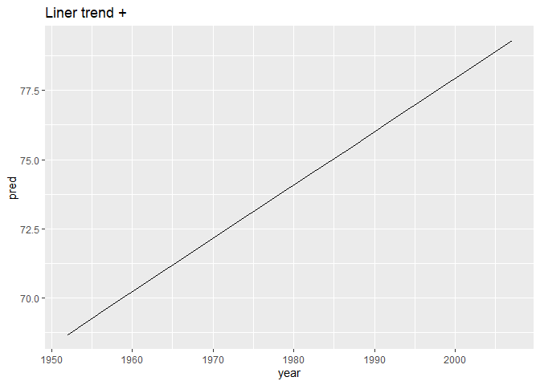

R for Data Science
================
true
2019년 7월

<style>
mystyle{
    font-family :  Georgia;
    font-size : 26px;
    color : PaleVioletRed  ;
}
</style>

> <mystyle> Part 4 </mystyle>  
> <mystyle> Model </mystyle>

# Chapter20: Many Models with purrr and broom

  - 복잡한 데이터 셋을 더 잘 이해하기 위해 많은 간단한 모형을 사용한다.
  - 데이터프레임에서 임의의 데이터 구조를 저장하는 리스트-열을 사용
  - broom패키지를 사용해서 모델을 tidy 데이터로 바꾼다.

가장 강한 신호중 몇으로 나누는 간단한 모형 다수를 사용해서 남아있는 희미한 신호를 볼 수 있다. 모델 요약이 우리에게 이상치를
찾고 비정상적 경향을 찾는데 도움을 준다.

## Gapminder

``` r
library(gapminder)
gapminder
```

    ## # A tibble: 1,704 x 6
    ##    country     continent  year lifeExp      pop gdpPercap
    ##    <fct>       <fct>     <int>   <dbl>    <int>     <dbl>
    ##  1 Afghanistan Asia       1952    28.8  8425333      779.
    ##  2 Afghanistan Asia       1957    30.3  9240934      821.
    ##  3 Afghanistan Asia       1962    32.0 10267083      853.
    ##  4 Afghanistan Asia       1967    34.0 11537966      836.
    ##  5 Afghanistan Asia       1972    36.1 13079460      740.
    ##  6 Afghanistan Asia       1977    38.4 14880372      786.
    ##  7 Afghanistan Asia       1982    39.9 12881816      978.
    ##  8 Afghanistan Asia       1987    40.8 13867957      852.
    ##  9 Afghanistan Asia       1992    41.7 16317921      649.
    ## 10 Afghanistan Asia       1997    41.8 22227415      635.
    ## # ... with 1,694 more rows

나라별 기대수명의 변화는?

``` r
gapminder %>% 
  ggplot(aes(year, lifeExp, group = country)) +
    geom_line(alpha = 1/3)
```

<!-- -->

전체적으로는 기대수명이 증가하지만 몇몇 이러한 패턴을 따르지 않는 국가들이 보인다. 어떻게 이런 국가들을 쉽게 볼 수 있을까?

``` r
nz <- filter(gapminder, country == "New Zealand")
nz %>% 
  ggplot(aes(year, lifeExp)) +
  geom_line() +
  ggtitle("Full data = ")
```

<!-- -->

``` r
nz_mod <- lm(lifeExp ~ year, data = nz)
nz %>% 
  add_predictions(nz_mod) %>% 
  ggplot(aes(year, pred)) +
  geom_line() +
  ggtitle("Liner trend + ")
```

<!-- -->

``` r
nz %>% 
  add_residuals(nz_mod) %>% 
  ggplot(aes(year, resid)) +
  geom_hline(yintercept = 0, color = "white", size = 3) +
  geom_line() +
  ggtitle("Remaining pattern")
```

<!-- --> 어떻게 모든 나라에
모델을 쉽게 적합할 수 있을까?

### Nested Data

각 변수에 행동을 반복하는 대신에 각 나라에 행동을 반복한다. 이것을 하기위해, 새로운 데이터 구조가 필요하다: the
***nested data frame***. nested df를 만들기위해 그룹화된 데이터 프레임을 가지고 “nest”한다.

``` r
by_country <- gapminder %>% 
  group_by(country, continent) %>% 
  nest()
```

그룹마다 하나의 행을 가지는 데이터프레임을 생성하고 다소 흔치 않은 열을 생성한다.: **data.data**는 데이터 프레임의
리스트이다. **data**열은 보통 복잡한 열이라서 보기 어렵고 객체를 탐색하는데에 좋은 도구로 작업한다. 불행하게도
str()을 사용하는것은 매우 긴 출력을 생성하기 때문에 추천하지는 않는다. 하지만 만약 데이터 열로부터 단 하나의 성분을
뽑는다면 국가에 대해 모든 데이터를 포함하는 것을 볼 것이다.

``` r
by_country$data[[1]]
```

    ## # A tibble: 12 x 4
    ##     year lifeExp      pop gdpPercap
    ##    <int>   <dbl>    <int>     <dbl>
    ##  1  1952    28.8  8425333      779.
    ##  2  1957    30.3  9240934      821.
    ##  3  1962    32.0 10267083      853.
    ##  4  1967    34.0 11537966      836.
    ##  5  1972    36.1 13079460      740.
    ##  6  1977    38.4 14880372      786.
    ##  7  1982    39.9 12881816      978.
    ##  8  1987    40.8 13867957      852.
    ##  9  1992    41.7 16317921      649.
    ## 10  1997    41.8 22227415      635.
    ## 11  2002    42.1 25268405      727.
    ## 12  2007    43.8 31889923      975.

표준 그룹화된 데이터 프레임과 nested 데이터프레임의 차이를 주목하라: 그룹화된 데이터 프레임에서 각 행은 관측치이다.
nested 데이터 프레임에서 각 행은 그룹이다. nested 데이터프레임을 생각하는 다른 방식은 메타 관측치를 가지는 것이다.
하나의 행이 시간의 한 점이 아니라 국가의 완전한 시간 코스를 나타낸다.

### List-Columns

``` r
country_model <- function(df) {
  lm(lifeExp ~ year, data = df)
}
```

데이터프레임은 리스트라서 `map()`을 `country_model`의 각 요소에 적용할 수 있다.

``` r
models <- map(by_country$data, country_model)
```

하지만, 모델의 리스트를 free-floating object로서 두는 대신에 ***by\_country*** 데이터 프레임에
열로서 저장하는 것이 더 좋다. 열에 관련된 객체를 저장하는 것은 데이터 프레임 값의 중요한 부분이고
list-columns가 좋은 아이디어라고 생각하는 이유다. 이러한 나라에서 작업하는 코스에서 국가마다 한가지 성분을 가지는 많은
리스트를 가질 수 있다.

다시 말해서, 전역 환경에 새로운 객체를 생성하는 대신에, by\_country에 새로운 변수를 추가한다.

``` r
by_country <- by_country %>% 
  mutate(model = map(data, country_model))
by_country
```

    ## # A tibble: 142 x 4
    ##    country     continent data              model 
    ##    <fct>       <fct>     <list>            <list>
    ##  1 Afghanistan Asia      <tibble [12 x 4]> <lm>  
    ##  2 Albania     Europe    <tibble [12 x 4]> <lm>  
    ##  3 Algeria     Africa    <tibble [12 x 4]> <lm>  
    ##  4 Angola      Africa    <tibble [12 x 4]> <lm>  
    ##  5 Argentina   Americas  <tibble [12 x 4]> <lm>  
    ##  6 Australia   Oceania   <tibble [12 x 4]> <lm>  
    ##  7 Austria     Europe    <tibble [12 x 4]> <lm>  
    ##  8 Bahrain     Asia      <tibble [12 x 4]> <lm>  
    ##  9 Bangladesh  Asia      <tibble [12 x 4]> <lm>  
    ## 10 Belgium     Europe    <tibble [12 x 4]> <lm>  
    ## # ... with 132 more rows

``` r
by_country %>% 
  filter(continent == "Europe")
```

    ## # A tibble: 30 x 4
    ##    country                continent data              model 
    ##    <fct>                  <fct>     <list>            <list>
    ##  1 Albania                Europe    <tibble [12 x 4]> <lm>  
    ##  2 Austria                Europe    <tibble [12 x 4]> <lm>  
    ##  3 Belgium                Europe    <tibble [12 x 4]> <lm>  
    ##  4 Bosnia and Herzegovina Europe    <tibble [12 x 4]> <lm>  
    ##  5 Bulgaria               Europe    <tibble [12 x 4]> <lm>  
    ##  6 Croatia                Europe    <tibble [12 x 4]> <lm>  
    ##  7 Czech Republic         Europe    <tibble [12 x 4]> <lm>  
    ##  8 Denmark                Europe    <tibble [12 x 4]> <lm>  
    ##  9 Finland                Europe    <tibble [12 x 4]> <lm>  
    ## 10 France                 Europe    <tibble [12 x 4]> <lm>  
    ## # ... with 20 more rows

``` r
by_country %>% 
  arrange(continent, country)
```

    ## # A tibble: 142 x 4
    ##    country                  continent data              model 
    ##    <fct>                    <fct>     <list>            <list>
    ##  1 Algeria                  Africa    <tibble [12 x 4]> <lm>  
    ##  2 Angola                   Africa    <tibble [12 x 4]> <lm>  
    ##  3 Benin                    Africa    <tibble [12 x 4]> <lm>  
    ##  4 Botswana                 Africa    <tibble [12 x 4]> <lm>  
    ##  5 Burkina Faso             Africa    <tibble [12 x 4]> <lm>  
    ##  6 Burundi                  Africa    <tibble [12 x 4]> <lm>  
    ##  7 Cameroon                 Africa    <tibble [12 x 4]> <lm>  
    ##  8 Central African Republic Africa    <tibble [12 x 4]> <lm>  
    ##  9 Chad                     Africa    <tibble [12 x 4]> <lm>  
    ## 10 Comoros                  Africa    <tibble [12 x 4]> <lm>  
    ## # ... with 132 more rows

만약 모델과 데이터프레임이 분리되어 있는 객체라면 정렬하거나 서브세팅을 할 때마다 기억해야만 한다.

### Unnesting

단 하나의 데이터 셋으로 단 하나의 모델의 잔차를 계산했다. 142개의 데이터프레임을 가지고 142모델을 가지게 되었다. 잔차를
계산하기 위해, 각 모델 쌍에 `add_residuals()`를 호출할 필요가 있다.

``` r
by_country <- by_country %>% 
  mutate(
    resids = map2(data, model, add_residuals)
  )
by_country
```

    ## # A tibble: 142 x 5
    ##    country     continent data              model  resids           
    ##    <fct>       <fct>     <list>            <list> <list>           
    ##  1 Afghanistan Asia      <tibble [12 x 4]> <lm>   <tibble [12 x 5]>
    ##  2 Albania     Europe    <tibble [12 x 4]> <lm>   <tibble [12 x 5]>
    ##  3 Algeria     Africa    <tibble [12 x 4]> <lm>   <tibble [12 x 5]>
    ##  4 Angola      Africa    <tibble [12 x 4]> <lm>   <tibble [12 x 5]>
    ##  5 Argentina   Americas  <tibble [12 x 4]> <lm>   <tibble [12 x 5]>
    ##  6 Australia   Oceania   <tibble [12 x 4]> <lm>   <tibble [12 x 5]>
    ##  7 Austria     Europe    <tibble [12 x 4]> <lm>   <tibble [12 x 5]>
    ##  8 Bahrain     Asia      <tibble [12 x 4]> <lm>   <tibble [12 x 5]>
    ##  9 Bangladesh  Asia      <tibble [12 x 4]> <lm>   <tibble [12 x 5]>
    ## 10 Belgium     Europe    <tibble [12 x 4]> <lm>   <tibble [12 x 5]>
    ## # ... with 132 more rows

하지만 데이터프레임의 리스트를 어떻게 그릴 것인가? 이 문제에 답하기 위해 고분분투하는 대신에, 데이터프레임의 리스트를 정규
데이터 프레임으도 되돌리자.

``` r
resids <- unnest(by_country, resids) # nest의 반대
resids
```

    ## # A tibble: 1,704 x 7
    ##    country     continent  year lifeExp      pop gdpPercap   resid
    ##    <fct>       <fct>     <int>   <dbl>    <int>     <dbl>   <dbl>
    ##  1 Afghanistan Asia       1952    28.8  8425333      779. -1.11  
    ##  2 Afghanistan Asia       1957    30.3  9240934      821. -0.952 
    ##  3 Afghanistan Asia       1962    32.0 10267083      853. -0.664 
    ##  4 Afghanistan Asia       1967    34.0 11537966      836. -0.0172
    ##  5 Afghanistan Asia       1972    36.1 13079460      740.  0.674 
    ##  6 Afghanistan Asia       1977    38.4 14880372      786.  1.65  
    ##  7 Afghanistan Asia       1982    39.9 12881816      978.  1.69  
    ##  8 Afghanistan Asia       1987    40.8 13867957      852.  1.28  
    ##  9 Afghanistan Asia       1992    41.7 16317921      649.  0.754 
    ## 10 Afghanistan Asia       1997    41.8 22227415      635. -0.534 
    ## # ... with 1,694 more rows

각 정규 열은 nested 열에서 각 행에 한번씩 반복된다는 것에 주목해라.

이제 플랏을 그릴 수 있다.

``` r
resids %>% 
  ggplot(aes(year, resid)) +
  geom_line(aes(group = country), alpha = 1/3) +
  geom_smooth(se = FALSE)
```

    ## `geom_smooth()` using method = 'gam' and formula 'y ~ s(x, bs = "cs")'

<!-- -->

``` r
resids %>% 
  ggplot(aes(year, resid, group = country)) +
  geom_line(alpha = 1/3) +
  facet_wrap(~continent)
```

<!-- --> 몇가지 부드러운
패턴을 놓친 것 같다. 아프리카에 흥미로운 것이 있다. 굉장히 큰 잔차를 볼 수 있고 우리의 모델이 잘 적합하지 못한다는
것을 보여준다.

### Model Quality

모델의 잔차를 보는 대신에 모델 품질의 일반적인 척도를 보자.

``` r
glance(nz_mod)
```

    ## # A tibble: 1 x 11
    ##   r.squared adj.r.squared sigma statistic p.value    df logLik   AIC   BIC
    ##       <dbl>         <dbl> <dbl>     <dbl>   <dbl> <int>  <dbl> <dbl> <dbl>
    ## 1     0.954         0.949 0.804      205. 5.41e-8     2  -13.3  32.6  34.1
    ## # ... with 2 more variables: deviance <dbl>, df.residual <int>

각 나라의 행을 데이터프레임으로 만들 수 있다.

``` r
by_country %>%
  mutate(glance = map(model, glance)) %>%
  unnest(glance)
```

    ## # A tibble: 142 x 16
    ##    country continent data  model resids r.squared adj.r.squared sigma
    ##    <fct>   <fct>     <lis> <lis> <list>     <dbl>         <dbl> <dbl>
    ##  1 Afghan~ Asia      <tib~ <lm>  <tibb~     0.948         0.942 1.22 
    ##  2 Albania Europe    <tib~ <lm>  <tibb~     0.911         0.902 1.98 
    ##  3 Algeria Africa    <tib~ <lm>  <tibb~     0.985         0.984 1.32 
    ##  4 Angola  Africa    <tib~ <lm>  <tibb~     0.888         0.877 1.41 
    ##  5 Argent~ Americas  <tib~ <lm>  <tibb~     0.996         0.995 0.292
    ##  6 Austra~ Oceania   <tib~ <lm>  <tibb~     0.980         0.978 0.621
    ##  7 Austria Europe    <tib~ <lm>  <tibb~     0.992         0.991 0.407
    ##  8 Bahrain Asia      <tib~ <lm>  <tibb~     0.967         0.963 1.64 
    ##  9 Bangla~ Asia      <tib~ <lm>  <tibb~     0.989         0.988 0.977
    ## 10 Belgium Europe    <tib~ <lm>  <tibb~     0.995         0.994 0.293
    ## # ... with 132 more rows, and 8 more variables: statistic <dbl>,
    ## #   p.value <dbl>, df <int>, logLik <dbl>, AIC <dbl>, BIC <dbl>,
    ## #   deviance <dbl>, df.residual <int>

이것은 여전히 list-columns를 가지고 있기 때문에 우리가 원하는 출력값이 아니다. (기억)이것이 `unnest()`가 단
하나의 행인 데이터 프레임에 작업할 때 디폴트 행동이다. 이것을 억제하기 위해 `.drop = TRUE`를 설정해주자.

``` r
glances <- by_country %>% 
  mutate(glance = map(model, glance)) %>% 
  unnest(glance, .drop = TRUE)
glances
```

    ## # A tibble: 142 x 13
    ##    country continent r.squared adj.r.squared sigma statistic  p.value    df
    ##    <fct>   <fct>         <dbl>         <dbl> <dbl>     <dbl>    <dbl> <int>
    ##  1 Afghan~ Asia          0.948         0.942 1.22      181.  9.84e- 8     2
    ##  2 Albania Europe        0.911         0.902 1.98      102.  1.46e- 6     2
    ##  3 Algeria Africa        0.985         0.984 1.32      662.  1.81e-10     2
    ##  4 Angola  Africa        0.888         0.877 1.41       79.1 4.59e- 6     2
    ##  5 Argent~ Americas      0.996         0.995 0.292    2246.  4.22e-13     2
    ##  6 Austra~ Oceania       0.980         0.978 0.621     481.  8.67e-10     2
    ##  7 Austria Europe        0.992         0.991 0.407    1261.  7.44e-12     2
    ##  8 Bahrain Asia          0.967         0.963 1.64      291.  1.02e- 8     2
    ##  9 Bangla~ Asia          0.989         0.988 0.977     930.  3.37e-11     2
    ## 10 Belgium Europe        0.995         0.994 0.293    1822.  1.20e-12     2
    ## # ... with 132 more rows, and 5 more variables: logLik <dbl>, AIC <dbl>,
    ## #   BIC <dbl>, deviance <dbl>, df.residual <int>

잘 적합되지 않은 모델들.

``` r
glances %>% 
  arrange(r.squared)
```

    ## # A tibble: 142 x 13
    ##    country continent r.squared adj.r.squared sigma statistic p.value    df
    ##    <fct>   <fct>         <dbl>         <dbl> <dbl>     <dbl>   <dbl> <int>
    ##  1 Rwanda  Africa       0.0172      -0.0811   6.56     0.175  0.685      2
    ##  2 Botswa~ Africa       0.0340      -0.0626   6.11     0.352  0.566      2
    ##  3 Zimbab~ Africa       0.0562      -0.0381   7.21     0.596  0.458      2
    ##  4 Zambia  Africa       0.0598      -0.0342   4.53     0.636  0.444      2
    ##  5 Swazil~ Africa       0.0682      -0.0250   6.64     0.732  0.412      2
    ##  6 Lesotho Africa       0.0849      -0.00666  5.93     0.927  0.358      2
    ##  7 Cote d~ Africa       0.283        0.212    3.93     3.95   0.0748     2
    ##  8 South ~ Africa       0.312        0.244    4.74     4.54   0.0588     2
    ##  9 Uganda  Africa       0.342        0.276    3.19     5.20   0.0457     2
    ## 10 Congo,~ Africa       0.348        0.283    2.43     5.34   0.0434     2
    ## # ... with 132 more rows, and 5 more variables: logLik <dbl>, AIC <dbl>,
    ## #   BIC <dbl>, deviance <dbl>, df.residual <int>

R2가 음수가 되는 것은 다음을 참고. <http://www.fairlynerdy.com/what-is-r-squared/>

``` r
glances %>% 
  ggplot(aes(continent, r.squared)) +
  geom_jitter(width = 0.5)
```

<!-- --> R2가 특히 나쁜
나라들을 보자.

``` r
bad_fit <- filter(glances, r.squared < 0.25)

gapminder %>% 
  semi_join(bad_fit, by = "country") %>% 
  ggplot(aes(year, lifeExp, colour = country)) +
    geom_line()
```

<!-- --> 여기서 두가지 주
효과를 볼 수 있다. HIV/AIDS 전염병과 94년에 일어난 르완다 집단 학살이다.

## Exercises

1.  A linear trend seems to be slightly too simple for the overall
    trend. Can you do better with a quadratic polynomial? How can you
    interpret the coefficients of the quadratic? (Hint: you might want
    to transform year so that it has mean zero.)

<!-- end list -->

``` r
country_model <- function(df) {
  lm(lifeExp ~ splines::ns(year, 2), data = df)
}

by_country2 <- gapminder %>% 
  group_by(continent, country) %>% 
  nest() %>% 
  mutate(models = map(data, country_model),
         resids = map2(data, models, add_residuals),
         glance = map(models, glance))
```

``` r
by_country2 %>% 
  unnest(resids) %>% 
  ggplot(aes(year, resid)) +
    geom_line(aes(group = country), alpha = 1/4) +
    geom_smooth(se = FALSE)
```

    ## `geom_smooth()` using method = 'gam' and formula 'y ~ s(x, bs = "cs")'

<!-- -->

0에 좀 더 가까워졌다.

``` r
by_country2 %>% 
  unnest(glance, .drop = TRUE) %>% 
  ggplot(aes(continent, r.squared)) +
  geom_jitter(width = 0.5)
```

<!-- -->

``` r
by_country2 %>% 
  unnest(glance, .drop = TRUE) %>% 
  filter(r.squared < 0.25)
```

    ## # A tibble: 1 x 13
    ##   continent country r.squared adj.r.squared sigma statistic p.value    df
    ##   <fct>     <fct>       <dbl>         <dbl> <dbl>     <dbl>   <dbl> <int>
    ## 1 Africa    Rwanda     0.0175        -0.201  6.91    0.0803   0.923     3
    ## # ... with 5 more variables: logLik <dbl>, AIC <dbl>, BIC <dbl>,
    ## #   deviance <dbl>, df.residual <int>

R2도 마찬가지로 커짐.

2.  Explore other methods for visualizing the distribution of R2 per
    continent. You might want to try the ggbeeswarm package, which
    provides similar methods for avoiding overlaps as jitter, but uses
    deterministic methods.

<!-- end list -->

``` r
by_country2 %>% 
  unnest(glance, .drop = TRUE) %>% 
  ggplot(aes(continent, r.squared)) +
    ggbeeswarm::geom_quasirandom()
```

<!-- -->

3.  To create the last plot (showing the data for the countries with the
    worst model fits), we needed two steps: we created a data frame with
    one row per country and then semi-joined it to the original dataset.
    It’s possible avoid this join if we use unnest() instead of
    unnest(.drop = TRUE). How?

<!-- end list -->

``` r
by_country %>% 
  mutate(glance = map(model, glance)) %>% 
  unnest(glance) %>% 
  filter(r.squared < 0.25) %>% 
  unnest(data) %>% 
  ggplot(aes(year, lifeExp, color = country)) +
    geom_line()
```

<!-- -->

## List\_columns

많은 모델을 다루는데에 기본적인 워크플로를 봤으므로 좀 더 디테일을 살펴보자. 리스트-열 데이터 구조를 좀 더 자세하게 살펴볼
것이다.

base R은 list-column을 만들기 쉽지 않다. data.frame()은 열의 리스트를 리스트로 다룬다.

``` r
data.frame(x = list(1:3, 3:5))
```

    ##   x.1.3 x.3.5
    ## 1     1     3
    ## 2     2     4
    ## 3     3     5

결과가 잘 출력되지 않는다.

``` r
data.frame(
  x = I(list(1:3, 3:5)),
  y = c("1,2", "3, 4, 5")
)
```

    ##         x       y
    ## 1 1, 2, 3     1,2
    ## 2 3, 4, 5 3, 4, 5

``` r
tibble(
  x = list(1:3, 3:5),
  y = c("1, 2", "3, 4, 5")
)
```

    ## # A tibble: 2 x 2
    ##   x         y      
    ##   <list>    <chr>  
    ## 1 <int [3]> 1, 2   
    ## 2 <int [3]> 3, 4, 5

``` r
tribble(
  ~x, ~y,
  1:3, "1, 2",
  3:5, "3, 4, 5"
)
```

    ## # A tibble: 2 x 2
    ##   x         y      
    ##   <list>    <chr>  
    ## 1 <int [3]> 1, 2   
    ## 2 <int [3]> 3, 4, 5

리스트-열은 종종 중간 데이터 구조에 가장 유용하다. 직접적으로 작업하기는 어려운데 대부분의 R함수는 원자벡터나 데이터프레임으로
작업하기 때문이다. 하지만 하나의 데이터프레임에 관련된 항목을 함께 두는 것의 이점은 약간 귀찮은 일에 가치가 있다.

일반적으로 효과적인 리스트-열 파이프라인의 세가지 파트가 있다.

1.  nest(), summarize() + list(), or mutate() + a map function을 사용해서
    list-columns를 만들 수 있다.
2.  map(), map2(), or pmap()과 함께 기존의 리스트 열을 변환시킴으로써 다른 중간의 리스트-열을 만들 수
    있다. 예를 들어, 이전 사례 연구에서, 데이터프레임의 리스트-열을 변환시킴으로써 모델의 리스트-열을 생성했다.
3.  리스트-열을 데이터프레임이나 원자벡터로 단순화 시킬 수 있다.

## Creating List-Columns

1.  `tydr::nest()`으로 그룹화된 데이터프레임을 리스트-열이 있는 nested데이터프레임으로 변환
2.  `mutate()`와 벡터화된 함수로 리스트를 반환
3.  `summarize()`와 요약 함수로 다수의 결과를 반환

named list로부터 만들려고 하면 `tibble::enframe()`사용

일반적으로, 리스트-열을 생성할 때, 동질적인지를 확실히 해야한다. 각 성분은 같은 유형의 것을 포함 해야한다. 확실히 사실이라고
체크 할 만한 것은 없지만 purrr을 사용한다면 type-stable 함수에 대해 학습한 것을 기억해라.

### With Nesting

nest()는 nested data frame을 생성하고 그리고 이것은 데이터 프레임의 리스트 열을 가진 데이터 프레임이다.
nested데이터 프레임의 각 행은 메타 관측치이다. 다른 열은 변수에 관측치를 정의하고 데이터프레임의 리스트 열은 개별 관측치에
메타-관측치를 구성한다.

nest()를 사용한느 두가지 방법이 있다. 현재까지는 그룹화된 데이터프레임에서 사용을 보았다. 그룹화된 데이터 프레임에서
적용될때 nest()는 그룹화 열을 유지하고 리스트-열로 모든 것을 묶는다.

``` r
gapminder %>% 
  group_by(country, continent) %>% 
  nest()
```

    ## # A tibble: 142 x 3
    ##    country     continent data             
    ##    <fct>       <fct>     <list>           
    ##  1 Afghanistan Asia      <tibble [12 x 4]>
    ##  2 Albania     Europe    <tibble [12 x 4]>
    ##  3 Algeria     Africa    <tibble [12 x 4]>
    ##  4 Angola      Africa    <tibble [12 x 4]>
    ##  5 Argentina   Americas  <tibble [12 x 4]>
    ##  6 Australia   Oceania   <tibble [12 x 4]>
    ##  7 Austria     Europe    <tibble [12 x 4]>
    ##  8 Bahrain     Asia      <tibble [12 x 4]>
    ##  9 Bangladesh  Asia      <tibble [12 x 4]>
    ## 10 Belgium     Europe    <tibble [12 x 4]>
    ## # ... with 132 more rows

그룹화되지 않은 데이터 프레임에 nest하기를 원하는 열을 구체화 함으로써 이것을 사용할 수 있다.

``` r
gapminder %>% 
  nest(year:gdpPercap)
```

    ## # A tibble: 142 x 3
    ##    country     continent data             
    ##    <fct>       <fct>     <list>           
    ##  1 Afghanistan Asia      <tibble [12 x 4]>
    ##  2 Albania     Europe    <tibble [12 x 4]>
    ##  3 Algeria     Africa    <tibble [12 x 4]>
    ##  4 Angola      Africa    <tibble [12 x 4]>
    ##  5 Argentina   Americas  <tibble [12 x 4]>
    ##  6 Australia   Oceania   <tibble [12 x 4]>
    ##  7 Austria     Europe    <tibble [12 x 4]>
    ##  8 Bahrain     Asia      <tibble [12 x 4]>
    ##  9 Bangladesh  Asia      <tibble [12 x 4]>
    ## 10 Belgium     Europe    <tibble [12 x 4]>
    ## # ... with 132 more rows

### From Vectorized Functions

몇몇 유용한 함수는 원자형 벡터를 취하고 리스트를 반환한다. 예를 들어, `str_split()`은 문자형 벡터를 취하고 문자
벡터의 리스트를 반환한다. 이걸 mutate의 내부에 사용하면 리스트-열을 얻는다.

``` r
df <- tribble(
  ~x1,
  "a,b,c",
  "d,e,f,g"
)

df %>% 
  mutate(x2 = str_split(x1, ","))
```

    ## # A tibble: 2 x 2
    ##   x1      x2       
    ##   <chr>   <list>   
    ## 1 a,b,c   <chr [3]>
    ## 2 d,e,f,g <chr [4]>

unnest()는 이러한 벡터 리스트를 다루는 방법을 안다.

``` r
df %>% 
  mutate(x2 = str_split(x1, ",")) %>% 
  unnest()
```

    ## # A tibble: 7 x 2
    ##   x1      x2   
    ##   <chr>   <chr>
    ## 1 a,b,c   a    
    ## 2 a,b,c   b    
    ## 3 a,b,c   c    
    ## 4 d,e,f,g d    
    ## 5 d,e,f,g e    
    ## 6 d,e,f,g f    
    ## 7 d,e,f,g g

이러한 패턴을 많이 사용한다면 이 함수를 사용하자

``` r
df <- data.frame(
  x = 1:3,
  y = c("a", "d,e,f", "g,h"),
  z = c("1", "2,3,4", "5,6"),
  stringsAsFactors = FALSE
)
df %>% 
  as.tibble() %>% 
  mutate(u = str_split(y, ","),
         w = str_split(z, ",")) %>%
  unnest()
```

    ## Warning: `as.tibble()` is deprecated, use `as_tibble()` (but mind the new semantics).
    ## This warning is displayed once per session.

    ## # A tibble: 6 x 5
    ##       x y     z     u     w    
    ##   <int> <chr> <chr> <chr> <chr>
    ## 1     1 a     1     a     1    
    ## 2     2 d,e,f 2,3,4 d     2    
    ## 3     2 d,e,f 2,3,4 e     3    
    ## 4     2 d,e,f 2,3,4 f     4    
    ## 5     3 g,h   5,6   g     5    
    ## 6     3 g,h   5,6   h     6

``` r
separate_rows(df, y, z, convert = TRUE)
```

    ##   x y z
    ## 1 1 a 1
    ## 2 2 d 2
    ## 3 2 e 3
    ## 4 2 f 4
    ## 5 3 g 5
    ## 6 3 h 6

이러한 패턴의 다른 예는 map(), map2(), pmap()함수를 purrr에서 사용하는 것이다.

``` r
sim <- tribble(
  ~f, ~params,
  "runif", list(min = -1, max = -1),
  "rnorm", list(sd = 5),
  "rpois", list(lambda = 10)
)

sim %>% 
  mutate(sims = invoke_map(f, params, n = 10))
```

    ## # A tibble: 3 x 3
    ##   f     params           sims      
    ##   <chr> <list>           <list>    
    ## 1 runif <named list [2]> <dbl [10]>
    ## 2 rnorm <named list [1]> <dbl [10]>
    ## 3 rpois <named list [1]> <int [10]>

sims의 데이터 타입이 동질적이지는 않지만 double과 integer둘 다 수치형 벡터이기 때문에 문제를 야기할 가능성은
낮다.

### From Multivalued Summaries

summarize()의 한가지 제한은 단 하나의 값을 반환하는 요약함수와 오직 작업한다. 임의의 길이를 갖는 벡터를 반환하는
quantile()같은 함수는 사용할 수 없다.

``` r
mtcars %>% 
  group_by(cyl) %>% 
  summarise(q = quantile(mpg))
```

    ## Error: Column `q` must be length 1 (a summary value), not 5

하지만 리스트 반환을 wrap할 수 있다. summarize()의 계약을 따르는데 각 요약은 길이가 1인 리스트이다.

``` r
mtcars %>% 
  group_by(cyl) %>% 
  summarise(q = list(quantile(mpg)))
```

    ## # A tibble: 3 x 2
    ##     cyl q        
    ##   <dbl> <list>   
    ## 1     4 <dbl [5]>
    ## 2     6 <dbl [5]>
    ## 3     8 <dbl [5]>

unnest()와 함께 유용한 결과를 만들기 위해, 당신은 또한 확률을 포착할 필요가 있을 것이다.

``` r
probs <- c(0.01, 0.25, 0.5, 0.75, 0.99)
mtcars %>% 
  group_by(cyl) %>% 
  summarize(p = list(probs),
            q = list(quantile(mpg, probs))) %>% 
  unnest()
```

    ## # A tibble: 15 x 3
    ##      cyl     p     q
    ##    <dbl> <dbl> <dbl>
    ##  1     4  0.01  21.4
    ##  2     4  0.25  22.8
    ##  3     4  0.5   26  
    ##  4     4  0.75  30.4
    ##  5     4  0.99  33.8
    ##  6     6  0.01  17.8
    ##  7     6  0.25  18.6
    ##  8     6  0.5   19.7
    ##  9     6  0.75  21  
    ## 10     6  0.99  21.4
    ## 11     8  0.01  10.4
    ## 12     8  0.25  14.4
    ## 13     8  0.5   15.2
    ## 14     8  0.75  16.2
    ## 15     8  0.99  19.1

### From a Named List

리스트-열을 가진 데이터프레임은 흔한 문제를 해결할 방법을 제공한다. 리스트와 리스트의 성분 둘 다에 대해 반복하기를 원하면
어떻게 해야 할까? 하나의 객체로 집어 넣는 대신에 데이터프레임을 만드는 것이 쉽다. 하나의 열은 성분을 포함할 수
있고 하나의 열은 리스트를 포함 할 수 있다.

``` r
x <- list(
  a = 1:5,
  b = 3:4,
  c = 5:6
)
df <- enframe(x)
df
```

    ## # A tibble: 3 x 2
    ##   name  value    
    ##   <chr> <list>   
    ## 1 a     <int [5]>
    ## 2 b     <int [2]>
    ## 3 c     <int [2]>

이 구조의 이점은 간단하게 일반화 하는 것이다. 이름은 만약 메타 데이터의 문자형 벡터를 가진다면 유용하지만 다른 데이터의
타입이나 다수의 벡터는 도움이 되지 않는다.

이름과 값을 동시에 반복하기를 원한다면 map2()를 사용하라.

``` r
df %>% 
  mutate(
    smry = map2_chr(
      name,
      value,
      ~str_c(.x, ": ", .y[1])
    )
  )
```

    ## # A tibble: 3 x 3
    ##   name  value     smry 
    ##   <chr> <list>    <chr>
    ## 1 a     <int [5]> a: 1 
    ## 2 b     <int [2]> b: 3 
    ## 3 c     <int [2]> c: 5

## Exercises

1.  List all the functions that you can think of that take an atomic
    vector and return a list.

stringr패키지의 있는 함수들이 많다. `str_extract_all()` `str_split()`
`str_locate_all()` 일반적으로 all함수들이 리스트일 가능성이 높다.

2.  Brainstorm useful summary functions that, like quantile(), return
    multiple values.

<!-- end list -->

``` r
x <- rnorm(100)
range(x)
```

    ## [1] -2.749565  1.600256

``` r
fivenum(x)
```

    ## [1] -2.74956547 -0.69345235 -0.02176741  0.59520706  1.60025611

``` r
quantile(x)
```

    ##          0%         25%         50%         75%        100% 
    ## -2.74956547 -0.69194604 -0.02176741  0.59501199  1.60025611

``` r
fit <- lm(100/mpg ~ disp + hp + wt + am, data = mtcars)
confint(fit, level = 0.99) # 첫번째 인자에 모델객체
```

    ##                    0.5 %     99.5 %
    ## (Intercept) -1.305763263 2.78705858
    ## disp        -0.004819755 0.01022561
    ## hp          -0.003739190 0.01428828
    ## wt           0.162448204 1.84015807
    ## am          -0.884617388 1.19624697

3.  What’s missing in the following data frame? How does quantile()
    return that missing piece? Why isn’t that helpful here?

<!-- end list -->

``` r
mtcars %>%
  group_by(cyl) %>%
  summarize(q = list(quantile(mpg))) %>%
  unnest()
```

    ## # A tibble: 15 x 2
    ##      cyl     q
    ##    <dbl> <dbl>
    ##  1     4  21.4
    ##  2     4  22.8
    ##  3     4  26  
    ##  4     4  30.4
    ##  5     4  33.9
    ##  6     6  17.8
    ##  7     6  18.6
    ##  8     6  19.7
    ##  9     6  21  
    ## 10     6  21.4
    ## 11     8  10.4
    ## 12     8  14.4
    ## 13     8  15.2
    ## 14     8  16.2
    ## 15     8  19.2

quantile의 이름이 사라졌다. 이걸 해결하기 위해 `enframe()`사용

``` r
x <- 1:10; names(x) <- letters[1:10] # 이름이 있는 객체 생성
enframe(x)
```

    ## # A tibble: 10 x 2
    ##    name  value
    ##    <chr> <int>
    ##  1 a         1
    ##  2 b         2
    ##  3 c         3
    ##  4 d         4
    ##  5 e         5
    ##  6 f         6
    ##  7 g         7
    ##  8 h         8
    ##  9 i         9
    ## 10 j        10

``` r
mtcars %>% 
  group_by(cyl) %>% 
  summarise(q = list(enframe(quantile(mpg)))) %>% 
  unnest()
```

    ## # A tibble: 15 x 3
    ##      cyl name  value
    ##    <dbl> <chr> <dbl>
    ##  1     4 0%     21.4
    ##  2     4 25%    22.8
    ##  3     4 50%    26  
    ##  4     4 75%    30.4
    ##  5     4 100%   33.9
    ##  6     6 0%     17.8
    ##  7     6 25%    18.6
    ##  8     6 50%    19.7
    ##  9     6 75%    21  
    ## 10     6 100%   21.4
    ## 11     8 0%     10.4
    ## 12     8 25%    14.4
    ## 13     8 50%    15.2
    ## 14     8 75%    16.2
    ## 15     8 100%   19.2

4.  What does this code do? Why might might it be useful?

<!-- end list -->

``` r
mtcars %>%
  group_by(cyl) %>%
  summarize_all(funs(list))
```

    ## Warning: funs() is soft deprecated as of dplyr 0.8.0
    ## Please use a list of either functions or lambdas: 
    ## 
    ##   # Simple named list: 
    ##   list(mean = mean, median = median)
    ## 
    ##   # Auto named with `tibble::lst()`: 
    ##   tibble::lst(mean, median)
    ## 
    ##   # Using lambdas
    ##   list(~ mean(., trim = .2), ~ median(., na.rm = TRUE))
    ## This warning is displayed once per session.

    ## # A tibble: 3 x 11
    ##     cyl mpg    disp   hp     drat   wt     qsec   vs     am     gear  carb 
    ##   <dbl> <list> <list> <list> <list> <list> <list> <list> <list> <lis> <lis>
    ## 1     4 <dbl ~ <dbl ~ <dbl ~ <dbl ~ <dbl ~ <dbl ~ <dbl ~ <dbl ~ <dbl~ <dbl~
    ## 2     6 <dbl ~ <dbl ~ <dbl ~ <dbl ~ <dbl ~ <dbl ~ <dbl ~ <dbl ~ <dbl~ <dbl~
    ## 3     8 <dbl ~ <dbl ~ <dbl ~ <dbl ~ <dbl ~ <dbl ~ <dbl ~ <dbl ~ <dbl~ <dbl~

``` r
mpg %>% 
  summarise_all(is.numeric)
```

    ## # A tibble: 1 x 11
    ##   manufacturer model displ year  cyl   trans drv   cty   hwy   fl    class
    ##   <lgl>        <lgl> <lgl> <lgl> <lgl> <lgl> <lgl> <lgl> <lgl> <lgl> <lgl>
    ## 1 FALSE        FALSE TRUE  TRUE  TRUE  FALSE FALSE TRUE  TRUE  FALSE FALSE

do를 사용하면 좀 더 간단히 되지만 추가적으로 열을 만들기 힘들다.

``` r
mtcars %>% 
  group_by(cyl) %>%
  do(mod = lm(mpg ~ disp, data = .))
```

    ## Source: local data frame [3 x 2]
    ## Groups: <by row>
    ## 
    ## # A tibble: 3 x 2
    ##     cyl mod   
    ## * <dbl> <list>
    ## 1     4 <lm>  
    ## 2     6 <lm>  
    ## 3     8 <lm>

``` r
mtcars %>% 
  group_by(cyl) %>%
  nest() %>% 
  mutate(model = map(data, ~lm(mpg ~ disp, data = .)),
         resid = map2(data, model, add_residuals)) 
```

    ## # A tibble: 3 x 4
    ##     cyl data               model  resid             
    ##   <dbl> <list>             <list> <list>            
    ## 1     6 <tibble [7 x 10]>  <lm>   <tibble [7 x 11]> 
    ## 2     4 <tibble [11 x 10]> <lm>   <tibble [11 x 11]>
    ## 3     8 <tibble [14 x 10]> <lm>   <tibble [14 x 11]>

## Simplifying List-Columns

  - 단 하나의 값을 원하면 원자형 벡터로 만들기 위해 `mutate()`와 `map_lgl()`, `map_int()`,
    `map_dbl()`, and `map_chl()`을 결합하라.
  - 많은 값을 원한다면, `unnest()`로 리스트-열에서 정상적인 열로 변환하고 필요한만큼 행을 반복한다.

### List to Vector

타입과 길이를 가진 객체를 항상 요약할 수 있어서 이 코드는 리스트-열의 종류에 관계 없이 작동할 것이다.

``` r
df <- tribble(
  ~x,
  letters[1:5],
  1:3,
  runif(5)
)
df %>% mutate(
  type = map_chr(x, typeof),
  length = map_int(x, length)
)
```

    ## # A tibble: 3 x 3
    ##   x         type      length
    ##   <list>    <chr>      <int>
    ## 1 <chr [5]> character      5
    ## 2 <int [3]> integer        3
    ## 3 <dbl [5]> double         5

이것은 디폴트 tbl print 메소드로부터 얻을 수 있는 동일한 기본 정보이지만, 필터링에 사용할 수 있다. 이질적은 리스트를
가지고 작동하지 않는 파트를 필터링하기를 원한다면 유용한 기술이다.

`map_*()`숏컷에 관해 잊지 마라. `map_chr(x, "apple")`을 x의 각 성분에 apple이 저장되어 있는
문자열을 추출할 수 있다. 이것은 정규열에 nested된 파트를 추출하기에 유용하다. `.null`인자를 성분이
결측이라면 사용하는 값을 제공하라.

``` r
df <- tribble(
  ~x,
  list(a = 1, b = 2),
  list(a = 2, c = 4)
)
df %>% mutate(
  a = map_dbl(x, "a"),
  b = map_dbl(x, "b", .null = NA_real_)
)
```

    ## # A tibble: 2 x 3
    ##   x                    a     b
    ##   <list>           <dbl> <dbl>
    ## 1 <named list [2]>     1     2
    ## 2 <named list [2]>     2    NA

### Unnesting

리스트-열의 각 성분에 정규 열을 반복함으로서 unnest()는 작동한다. 예를 들어, 첫번째 행을 4번 반복하고 2번째 행을 한
번 반복한다.

``` r
tibble(x = 1:2, y = list(1:4, 1)) %>% unnest(y)
```

    ## # A tibble: 5 x 2
    ##       x     y
    ##   <int> <dbl>
    ## 1     1     1
    ## 2     1     2
    ## 3     1     3
    ## 4     1     4
    ## 5     2     1

이것은 다른 성분의 수를 포함하는 두 개의 열을 동시에 unnest할 수 없다는 뜻이다.

``` r
# Ok, because y and z have the same number of elements in
# every row
df1 <- tribble(
  ~x, ~y, ~z,
  1, c("a", "b"), 1:2,
  2, "c", 3
)
df1
```

    ## # A tibble: 2 x 3
    ##       x y         z        
    ##   <dbl> <list>    <list>   
    ## 1     1 <chr [2]> <int [2]>
    ## 2     2 <chr [1]> <dbl [1]>

``` r
df1 %>% unnest(y, z)
```

    ## # A tibble: 3 x 3
    ##       x y         z
    ##   <dbl> <chr> <dbl>
    ## 1     1 a         1
    ## 2     1 b         2
    ## 3     2 c         3

``` r
# Doesn't work because y and z have different number of elements
df2 <- tribble(
  ~x, ~y, ~z,
  1, "a", 1:2,
  2, c("b", "c"), 3
)
df2
```

    ## # A tibble: 2 x 3
    ##       x y         z        
    ##   <dbl> <list>    <list>   
    ## 1     1 <chr [1]> <int [2]>
    ## 2     2 <chr [2]> <dbl [1]>

``` r
df2 %>% unnest(y, z)
```

    ## All nested columns must have the same number of elements.

You can unnest multiple list-columns as long as all the data frames in
each row have the same number of rows

## Exercises

1.  Why might the lengths() function be useful for creating atomic
    vector columns from list-columns?

리스트 열이 같은 길이의 행을 가지는지 확인할 때 유용하다.

``` r
new_df <-
  by_country %>% 
  mutate(glance = map(model, broom::glance)) %>% 
  select(country, data, resids) %>% 
  add_row(country = "random",
          data = list(tibble(a = "hey")),
          resids = list(tibble(b = c("hey", "ho"))))  
new_df %>% 
  unnest()
```

    ## All nested columns must have the same number of elements.

리스트 사이의 같은 길이를 가지는 행을 서브세팅 함으로써 고친다.

``` r
new_df %>% 
  mutate(first_len = map_dbl(data, nrow),
         second_len = map_dbl(resids, nrow)) %>% 
  filter(first_len == second_len) %>% 
  unnest()
```

    ## # A tibble: 1,704 x 12
    ##    country first_len second_len  year lifeExp    pop gdpPercap year1
    ##    <fct>       <dbl>      <dbl> <int>   <dbl>  <int>     <dbl> <int>
    ##  1 Afghan~        12         12  1952    28.8 8.43e6      779.  1952
    ##  2 Afghan~        12         12  1957    30.3 9.24e6      821.  1957
    ##  3 Afghan~        12         12  1962    32.0 1.03e7      853.  1962
    ##  4 Afghan~        12         12  1967    34.0 1.15e7      836.  1967
    ##  5 Afghan~        12         12  1972    36.1 1.31e7      740.  1972
    ##  6 Afghan~        12         12  1977    38.4 1.49e7      786.  1977
    ##  7 Afghan~        12         12  1982    39.9 1.29e7      978.  1982
    ##  8 Afghan~        12         12  1987    40.8 1.39e7      852.  1987
    ##  9 Afghan~        12         12  1992    41.7 1.63e7      649.  1992
    ## 10 Afghan~        12         12  1997    41.8 2.22e7      635.  1997
    ## # ... with 1,694 more rows, and 4 more variables: lifeExp1 <dbl>,
    ## #   pop1 <int>, gdpPercap1 <dbl>, resid <dbl>

만약 다수의 열을 unnest하게되면 이름이 같은 열은 뒤에 1이 붙는다.

``` r
new_df <-
  by_country %>% 
  mutate(glance = map(model, glance)) %>% 
  select(country, data, resids) %>% 
  add_row(country = "random",
          data = list(tibble(a = letters[1:12])),
          resids = list(tibble(b = letters[1:12])))
new_df %>% 
  unnest()
```

    ## # A tibble: 1,716 x 12
    ##    country  year lifeExp    pop gdpPercap a     year1 lifeExp1   pop1
    ##    <fct>   <int>   <dbl>  <int>     <dbl> <chr> <int>    <dbl>  <int>
    ##  1 Afghan~  1952    28.8 8.43e6      779. <NA>   1952     28.8 8.43e6
    ##  2 Afghan~  1957    30.3 9.24e6      821. <NA>   1957     30.3 9.24e6
    ##  3 Afghan~  1962    32.0 1.03e7      853. <NA>   1962     32.0 1.03e7
    ##  4 Afghan~  1967    34.0 1.15e7      836. <NA>   1967     34.0 1.15e7
    ##  5 Afghan~  1972    36.1 1.31e7      740. <NA>   1972     36.1 1.31e7
    ##  6 Afghan~  1977    38.4 1.49e7      786. <NA>   1977     38.4 1.49e7
    ##  7 Afghan~  1982    39.9 1.29e7      978. <NA>   1982     39.9 1.29e7
    ##  8 Afghan~  1987    40.8 1.39e7      852. <NA>   1987     40.8 1.39e7
    ##  9 Afghan~  1992    41.7 1.63e7      649. <NA>   1992     41.7 1.63e7
    ## 10 Afghan~  1997    41.8 2.22e7      635. <NA>   1997     41.8 2.22e7
    ## # ... with 1,706 more rows, and 3 more variables: gdpPercap1 <dbl>,
    ## #   resid <dbl>, b <chr>

# broom package

<http://varianceexplained.org/r/broom-intro/>

``` r
fit <- lm(mpg ~ wt + qsec, mtcars)
summary(fit)
```

    ## 
    ## Call:
    ## lm(formula = mpg ~ wt + qsec, data = mtcars)
    ## 
    ## Residuals:
    ##     Min      1Q  Median      3Q     Max 
    ## -4.3962 -2.1431 -0.2129  1.4915  5.7486 
    ## 
    ## Coefficients:
    ##             Estimate Std. Error t value Pr(>|t|)    
    ## (Intercept)  19.7462     5.2521   3.760 0.000765 ***
    ## wt           -5.0480     0.4840 -10.430 2.52e-11 ***
    ## qsec          0.9292     0.2650   3.506 0.001500 ** 
    ## ---
    ## Signif. codes:  0 '***' 0.001 '**' 0.01 '*' 0.05 '.' 0.1 ' ' 1
    ## 
    ## Residual standard error: 2.596 on 29 degrees of freedom
    ## Multiple R-squared:  0.8264, Adjusted R-squared:  0.8144 
    ## F-statistic: 69.03 on 2 and 29 DF,  p-value: 9.395e-12

``` r
tidy(fit)
```

    ## # A tibble: 3 x 5
    ##   term        estimate std.error statistic  p.value
    ##   <chr>          <dbl>     <dbl>     <dbl>    <dbl>
    ## 1 (Intercept)   19.7       5.25       3.76 7.65e- 4
    ## 2 wt            -5.05      0.484    -10.4  2.52e-11
    ## 3 qsec           0.929     0.265      3.51 1.50e- 3

``` r
head(augment(fit))
```

    ## # A tibble: 6 x 11
    ##   .rownames   mpg    wt  qsec .fitted .se.fit  .resid   .hat .sigma .cooksd
    ##   <chr>     <dbl> <dbl> <dbl>   <dbl>   <dbl>   <dbl>  <dbl>  <dbl>   <dbl>
    ## 1 Mazda RX4  21    2.62  16.5    21.8   0.683 -0.815  0.0693   2.64 2.63e-3
    ## 2 Mazda RX~  21    2.88  17.0    21.0   0.547 -0.0482 0.0444   2.64 5.59e-6
    ## 3 Datsun 7~  22.8  2.32  18.6    25.3   0.640 -2.53   0.0607   2.60 2.17e-2
    ## 4 Hornet 4~  21.4  3.22  19.4    21.6   0.623 -0.181  0.0576   2.64 1.05e-4
    ## 5 Hornet S~  18.7  3.44  17.0    18.2   0.512  0.504  0.0389   2.64 5.29e-4
    ## 6 Valiant    18.1  3.46  20.2    21.1   0.803 -2.97   0.0957   2.58 5.10e-2
    ## # ... with 1 more variable: .std.resid <dbl>

``` r
glance(fit)
```

    ## # A tibble: 1 x 11
    ##   r.squared adj.r.squared sigma statistic  p.value    df logLik   AIC   BIC
    ##       <dbl>         <dbl> <dbl>     <dbl>    <dbl> <int>  <dbl> <dbl> <dbl>
    ## 1     0.826         0.814  2.60      69.0 9.39e-12     3  -74.4  157.  163.
    ## # ... with 2 more variables: deviance <dbl>, df.residual <int>

`tidy`는 ggplot2를 사용해서 계수플랏을 좀 더 쉽게 구성하게 해준다.

``` r
td <- tidy(fit, conf.int = TRUE)
ggplot(td, aes(estimate, term, color = term)) +
    geom_point() +
    geom_errorbarh(aes(xmin = conf.low, xmax = conf.high)) + # horizontal errorbar
    geom_vline(xintercept = 0)
```

<!-- -->

``` r
mtcars %>% group_by(am) %>% do(tidy(lm(mpg ~ wt, .)))
```

    ## # A tibble: 4 x 6
    ## # Groups:   am [2]
    ##      am term        estimate std.error statistic       p.value
    ##   <dbl> <chr>          <dbl>     <dbl>     <dbl>         <dbl>
    ## 1     0 (Intercept)    31.4      2.95      10.7  0.00000000601
    ## 2     0 wt             -3.79     0.767     -4.94 0.000125     
    ## 3     1 (Intercept)    46.3      3.12      14.8  0.0000000128 
    ## 4     1 wt             -9.08     1.26      -7.23 0.0000169

``` r
library(glmnet)
```

    ## Warning: package 'glmnet' was built under R version 3.5.3

    ## Loading required package: Matrix

    ## Warning: package 'Matrix' was built under R version 3.5.3

    ## 
    ## Attaching package: 'Matrix'

    ## The following object is masked from 'package:tidyr':
    ## 
    ##     expand

    ## Loading required package: foreach

    ## Warning: package 'foreach' was built under R version 3.5.3

    ## 
    ## Attaching package: 'foreach'

    ## The following objects are masked from 'package:purrr':
    ## 
    ##     accumulate, when

    ## Loaded glmnet 2.0-18

``` r
nobs <- 100
nvar <- 50
real <- 5
x <- matrix(rnorm(nobs * nvar), nobs)
beta <- c(rnorm(real, 0, 1), rep(0, nvar - real))
y <- c(t(beta) %*% t(x)) + rnorm(nvar, sd = 3)

glmnet_fit <- cv.glmnet(x,y)

tidied_cv <- tidy(glmnet_fit)
glance_cv <- glance(glmnet_fit)

ggplot(tidied_cv, aes(lambda, estimate)) + geom_line(color = "red") +
    geom_ribbon(aes(ymin = conf.low, ymax = conf.high), alpha = .2) +
    scale_x_log10() +
    geom_vline(xintercept = glance_cv$lambda.min) +
    geom_vline(xintercept = glance_cv$lambda.1se, lty = 2)
```

<!-- -->

``` r
library(survival)
```

    ## Warning: package 'survival' was built under R version 3.5.3

``` r
surv_fit <- survfit(coxph(Surv(time, status) ~ age + sex, lung))

td <- tidy(surv_fit)
ggplot(td, aes(time, estimate)) + geom_line() +
    geom_ribbon(aes(ymin = conf.low, ymax = conf.high), alpha = .2)
```

<!-- -->

<https://cran.r-project.org/web/packages/broom/vignettes/broom.html>

``` r
glmfit <- glm(am ~ wt, mtcars, family="binomial")
tidy(glmfit)
```

    ## # A tibble: 2 x 5
    ##   term        estimate std.error statistic p.value
    ##   <chr>          <dbl>     <dbl>     <dbl>   <dbl>
    ## 1 (Intercept)    12.0       4.51      2.67 0.00759
    ## 2 wt             -4.02      1.44     -2.80 0.00509

``` r
augment(glmfit)
```

    ## # A tibble: 32 x 10
    ##    .rownames    am    wt .fitted .se.fit .resid   .hat .sigma .cooksd
    ##    <chr>     <dbl> <dbl>   <dbl>   <dbl>  <dbl>  <dbl>  <dbl>   <dbl>
    ##  1 Mazda RX4     1  2.62   1.50    0.918  0.635 0.126   0.803 0.0184 
    ##  2 Mazda RX~     1  2.88   0.471   0.676  0.985 0.108   0.790 0.0424 
    ##  3 Datsun 7~     1  2.32   2.70    1.28   0.360 0.0963  0.810 0.00394
    ##  4 Hornet 4~     0  3.22  -0.897   0.601 -0.827 0.0744  0.797 0.0177 
    ##  5 Hornet S~     0  3.44  -1.80    0.749 -0.553 0.0681  0.806 0.00647
    ##  6 Valiant       0  3.46  -1.88    0.767 -0.532 0.0674  0.807 0.00590
    ##  7 Duster 3~     0  3.57  -2.33    0.878 -0.432 0.0625  0.809 0.00348
    ##  8 Merc 240D     0  3.19  -0.796   0.593 -0.863 0.0755  0.796 0.0199 
    ##  9 Merc 230      0  3.15  -0.635   0.586 -0.922 0.0776  0.793 0.0242 
    ## 10 Merc 280      0  3.44  -1.80    0.749 -0.553 0.0681  0.806 0.00647
    ## # ... with 22 more rows, and 1 more variable: .std.resid <dbl>

``` r
glance(glmfit)
```

    ## # A tibble: 1 x 7
    ##   null.deviance df.null logLik   AIC   BIC deviance df.residual
    ##           <dbl>   <int>  <dbl> <dbl> <dbl>    <dbl>       <int>
    ## 1          43.2      31  -9.59  23.2  26.1     19.2          30

lm은 \(R^2\)를 보여주지만 대신에 glm은 deviance를 보여준다.

``` r
# nonlinear model
nlsfit <-  nls(mpg ~ k / wt + b, mtcars, start=list(k=1, b=0))
tidy(nlsfit)
```

    ## # A tibble: 2 x 5
    ##   term  estimate std.error statistic  p.value
    ##   <chr>    <dbl>     <dbl>     <dbl>    <dbl>
    ## 1 k        45.8       4.25     10.8  7.64e-12
    ## 2 b         4.39      1.54      2.85 7.74e- 3

``` r
augment(nlsfit)
```

    ## # A tibble: 32 x 4
    ##      mpg    wt .fitted .resid
    ##    <dbl> <dbl>   <dbl>  <dbl>
    ##  1  21    2.62    21.9 -0.878
    ##  2  21    2.88    20.3  0.673
    ##  3  22.8  2.32    24.1 -1.34 
    ##  4  21.4  3.22    18.6  2.76 
    ##  5  18.7  3.44    17.7  0.991
    ##  6  18.1  3.46    17.6  0.468
    ##  7  14.3  3.57    17.2 -2.92 
    ##  8  24.4  3.19    18.8  5.65 
    ##  9  22.8  3.15    18.9  3.86 
    ## 10  19.2  3.44    17.7  1.49 
    ## # ... with 22 more rows

``` r
glance(nlsfit)
```

    ## # A tibble: 1 x 8
    ##   sigma isConv       finTol logLik   AIC   BIC deviance df.residual
    ##   <dbl> <lgl>         <dbl>  <dbl> <dbl> <dbl>    <dbl>       <int>
    ## 1  2.77 TRUE   0.0000000288  -77.0  160.  164.     231.          30

``` r
chit <- chisq.test(xtabs(Freq ~ Sex + Class, data = as.data.frame(Titanic)))
tidy(chit)
```

    ## # A tibble: 1 x 4
    ##   statistic  p.value parameter method                    
    ##       <dbl>    <dbl>     <int> <chr>                     
    ## 1      350. 1.56e-75         3 Pearson's Chi-squared test

``` r
wt <- wilcox.test(wt ~ am, mtcars)
```

    ## Warning in wilcox.test.default(x = c(3.215, 3.44, 3.46, 3.57, 3.19, 3.15, :
    ## cannot compute exact p-value with ties

``` r
tidy(wt)
```

    ## # A tibble: 1 x 4
    ##   statistic   p.value method                                    alternative
    ##       <dbl>     <dbl> <chr>                                     <chr>      
    ## 1      230. 0.0000435 Wilcoxon rank sum test with continuity c~ two.sided

# Summary

  - nested df를 시각화하기위해서 `unnest()`하자.
  - `glance()`를 사용한 데이터에서 `unnest(glance)`의 `.drop = TRUE`를 사용해서 원래의
    데이터와 `semi_join()`으로 필터링해서 시각화 하거나 `unnest(glance)`에서
    `filter()`을 사용한 뒤, `unnest(data)`로 시각화 가능
  - 범주, 연속형 산점도를 시각화 할 때, `ggbeeswarm::geom_quasirandom()`를 사용해보자.
  - list-columns를 생성할 때는 반드시 `tibble()`
  - `summarize(quantile())`과 같이 임의의 길이를 갖는 벡터를 반환할 때는
    `summarize(list(quantile()))`
  - 리스트와 리스트의 성분에 둘 다 반복하기를 원할때는 `enframe()`을 사용하여 list-columns로 만든 후
    `map2(name, value)`를 사용하면 편하다.
  - `enfram()`은 또한 이름 속성이 있는 객체에 사용해서 `unnest()`와 함께 사용하면 이름 열도 같이 추가된다.
  - mutate와 summarize의 at, all, if
  - 단 하나의 값을 원하면 `mutate()`와 `map_*`의 결합. - nested된 파트를 추출하기 위해
    `unnest()`대신 `map_dbl(x, "x의 성분이름", .null = NA_real_)` 사용
  - 다른 성분의 수를 포함하는 다수의 열은 동시에 unnest할 수 없다. -`add_row(열 이름 = "값")`
