ggplot2 Elegant Graphics for Data Analysis
================
true
2018년 2월

<style>
mystyle{
    font-family :  Georgia;
    font-size : 26px;
    color : PaleVioletRed  ;
}
</style>

> <mystyle> Chapter 2 </mystyle>  
> <mystyle>Getting Started with ggplot2 </mystyle>

  - Data that you want to visualise and a set of aesthetic mappings
    describing how variables in the data are mapped to aesthetic
    attributes that you can perceive
  - Layes는 기하학적 요소와 통계적 변환으로 구성되어 있다.
  - The scales map values in the data space to values in an aesthetic
    space, wheter it be colour, or size, or shape. Scales draw a legend
    or axes, which provide an <span style="background : yellow">inverse
    mapping </span>to make it possible to read the original data values
    from the data.
  - A coordinate system, coord for short, describes how data coordinates
    are mapped to the plane of the graphic. It also provide axes and
    gridlines to make it possible to read the graph.
  - A faceting specification describes how to break up the data into
    subsets and how to display those subsets as small multiples.
  - A theme which controls the fincer points of display, like the font
    size and background colour.

# Exercies

1.  Which manufacturer has the most the models in this dataset? Which
    model has the most variations? Does your answer change if you remove
    the redundant specification of drive train (e.g. “pathfinder 4wd”,
    “a4 quattro”) from the model name?

Sol) 첫번째 문제에서 가장 많은 모델을 가진 제조사를 찾으라고 하였는데 모델의 종류를 살펴보면 a4, a4 quattro 같은
데이터들이 많기 때문에 저렇게 하면 충분한 정보를 얻을 수 없다.

``` r
q4_1 <- mpg %>% 
  count(manufacturer, sort = TRUE)
q4_1
```

    ## # A tibble: 15 x 2
    ##    manufacturer     n
    ##    <chr>        <int>
    ##  1 dodge           37
    ##  2 toyota          34
    ##  3 volkswagen      27
    ##  4 ford            25
    ##  5 chevrolet       19
    ##  6 audi            18
    ##  7 hyundai         14
    ##  8 subaru          14
    ##  9 nissan          13
    ## 10 honda            9
    ## 11 jeep             8
    ## 12 pontiac          5
    ## 13 land rover       4
    ## 14 mercury          4
    ## 15 lincoln          3

두번째 문제에서 modlel의 variation을 찾는 문제에서 명목변수의 variation을 찾으라는 말은 이해가 되지 않는다.
대신 앞 문제와 연결지어서 생각해서 제조사 별로 모델의 종류의 개수를 생각하였다.

``` r
q4_2 <- mpg %>% 
  group_by(manufacturer) %>% 
  transmute(n = length(unique(model))) %>% #여기서 unique를 사용하지 않으면 q4_1과 동일한 결과
  unique() %>% 
  ungroup() %>% 
  arrange(desc(n))
#각 제조사의 model종류의 개수를 알 수 있는 코드. factor의 level이 15, n은 각 레벨의 데이터 수라고 봐도 될 것 같다.
```

세번째 문제에서 불필요한 사양을 제거하기 위해 4wd, quattro등을
제거하였다.

``` r
df <- data.frame(rbind(q4_1, q4_2), type = as.factor(rep(c("overall", "unique"), each = nrow(q4_1))))
mpg2 <- mpg 

mpg2$model <- str_trim(str_replace_all(mpg2$model, c("quattro" = "", "2wd" = "", "4wd" = "", "awd" = "", "solara" = "" ))) #str_replace_all로 제거하면 빈문자가 남기 때문에 str_trim으로 빈문자를 제거하였다.
q4_3 <- mpg2 %>% 
  group_by(manufacturer) %>% 
  transmute(n = length(unique(model))) %>% 
  unique() %>% 
  arrange(desc(n))
q4_3$type <- as.factor(rep("unique_after", 15))
df <- bind_rows(df, q4_3) # type이 factor에서 char로 변환됨
```

    ## Warning in bind_rows_(x, .id): Unequal factor levels: coercing to character

    ## Warning in bind_rows_(x, .id): binding character and factor vector,
    ## coercing into character vector
    
    ## Warning in bind_rows_(x, .id): binding character and factor vector,
    ## coercing into character vector

``` r
df$type <- as.factor(df$type)
ggplot(df, aes(reorder(manufacturer, n), n, fill = type)) +
  geom_bar(stat = "identity", position = "dodge") +
  coord_flip() +
  labs(x = "제조사", y = "Count") + ggtitle("Numbers of modles per manufacturer") +
  theme(panel.grid.major.y = element_blank(),
        panel.grid.minor.y = element_blank())
```

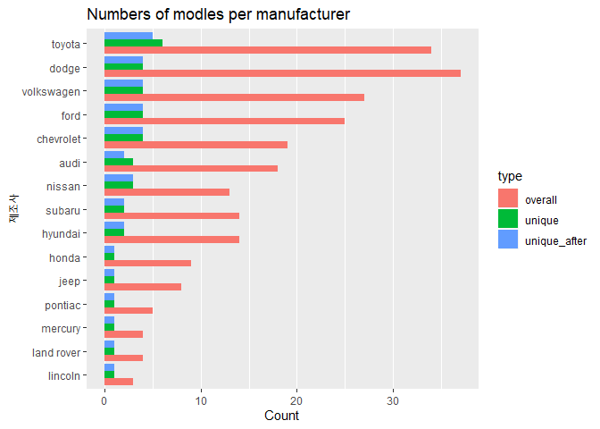<!-- -->

2.  What does ggplot(mpg, aes(model, manufacturer)) + geom point() show?
    Is it useful? How could you modify the data to make it more
    informative?

<!-- end list -->

``` r
 ggplot(mpg, aes(model, manufacturer)) + geom_point()
```

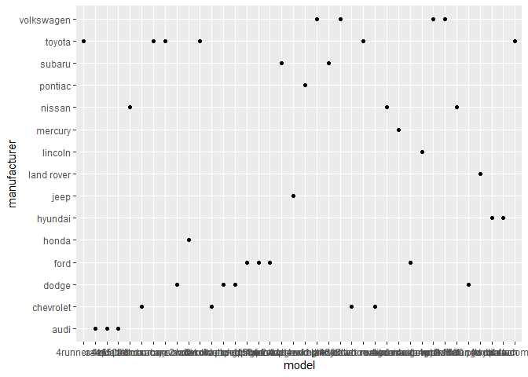<!-- --> 이 플랏이
유용하지 않은 이유

  - Each dot represents a different manufacturer-model combination that
    we observe in the data. There is no inherent hierarchy so this is
    just a nominal scale.

  - As there is no interpretable relationship between the points, there
    is no inside to be gained from comparing positions(which is the very
    reason for a scatterplot)

  - Some of the data is hidden as some manufacturer-model combinations
    appear more than once in the data(e.g. audi a4)

  - Even if overplotting wouldn’t concern us, it is very likely that
    each unique model only pairs with one manufacturer such that a two
    dimensional plot is redundant.

<!-- end list -->

``` r
head(mpg$model)
```

    ## [1] "a4" "a4" "a4" "a4" "a4" "a4"

``` r
df <- mpg %>% 
  transmute(model = str_trim(str_replace_all(mpg$model, c("quattro" = "", "2wd" = "", "4wd" = "", "awd" = "", "solara" = "" ))), man_mod = paste(manufacturer, model, sep = ""))
ggplot(df, aes(man_mod)) +
  geom_bar() +
  coord_flip()
```

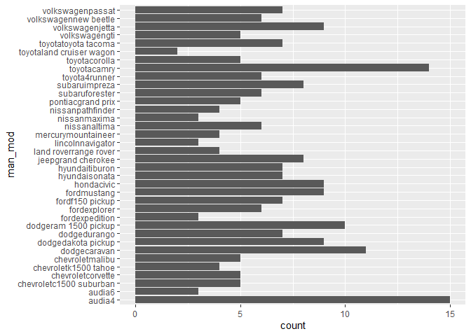<!-- -->

3.  Describe the data, aesthetic mappings and layers used for each of
    the following plots. You’ll need to guess a little because you
    haven’t seen all the datasets and functions yet, but use your
    common sense\! See if you can predict what the plot will look like
    before running the code.

<!-- end list -->

``` r
summary(ggplot(economics, aes(date, unemploy)) + geom_line())
```

    ## data: date, pce, pop, psavert, uempmed, unemploy [574x6]
    ## mapping:  x = ~date, y = ~unemploy
    ## faceting: <ggproto object: Class FacetNull, Facet, gg>
    ##     compute_layout: function
    ##     draw_back: function
    ##     draw_front: function
    ##     draw_labels: function
    ##     draw_panels: function
    ##     finish_data: function
    ##     init_scales: function
    ##     map_data: function
    ##     params: list
    ##     setup_data: function
    ##     setup_params: function
    ##     shrink: TRUE
    ##     train_scales: function
    ##     vars: function
    ##     super:  <ggproto object: Class FacetNull, Facet, gg>
    ## -----------------------------------
    ## geom_line: na.rm = FALSE
    ## stat_identity: na.rm = FALSE
    ## position_identity

색과 모양은 범주형 변수에 잘 어울리고 size는 연속형 변수에 잘 어울린다. 데이터의 양이 많아지면 그룹별로 구분하기 어려울 수
있으므로 facetting을 사용해보라. 한 번에 복잡한 플랏으로 모든 것을 보여주려 하지 말고 스토리를 말하는 일련의 간단한
플랏을 만들어라.

4.  How is drive train related to fuel economy? How is drive train
    related to engine size and class?

<!-- end list -->

``` r
ggplot(mpg, aes(drv, cty)) +
  geom_boxplot()
```

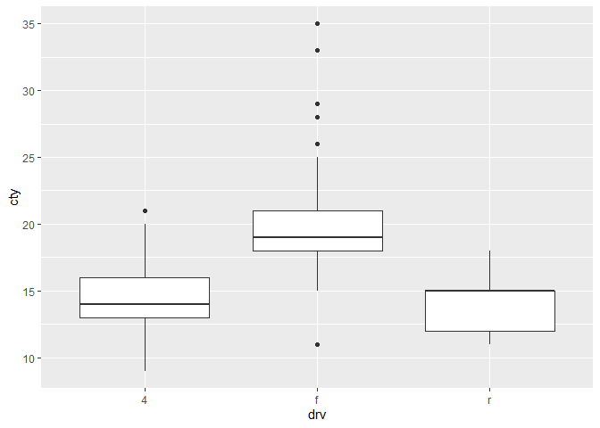<!-- -->

``` r
ggplot(mpg, aes(reorder(class, displ, FUN = median), displ, colour = drv)) +
  geom_jitter(width = .5, height = 0) # height은 데이터를 왜곡한다.
```

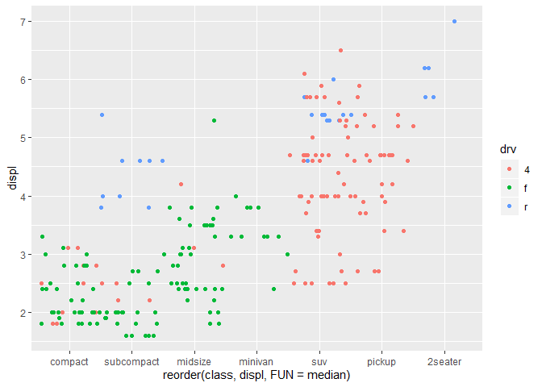<!-- --> 이 문제에서
jitter를 사용한 이유는 point를 사용했을 때 생기는 overplotting 문제를 해결하기 위해서이다. 만약 x축이
범주형이 아니라 연속형일 경우에는 height뿐만이 아니라 width또한 데이터를 왜곡하므로 jitter 사용에는
주의하자.

5.  Use facetting to explore the three-way relationship between fuel
    economy, engine size, and number of cylinders. How does facetting by
    number of cylinders change your assessment of the relationship
    between engine size and fuel economy?

<!-- end list -->

``` r
ggplot(mpg, aes(displ, cty)) +
  geom_point() +
  stat_smooth(method = "lm") +
  facet_wrap(~cyl, nrow = 1)
```

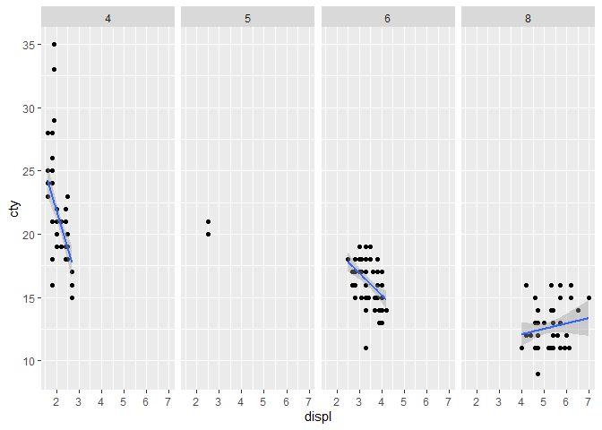<!-- -->

# Plot Geoms

``` r
ggplot(mpg, aes(displ, hwy)) +
  geom_point() +
  geom_smooth(span = 0.2) # wiggliness(꾸불꾸불함)는 span매개변수에 의해 제어된다. 범위는 0(지나치게 꾸불꾸불) ~ 1(꾸불꾸불하지 않음)
```

    ## `geom_smooth()` using method = 'loess' and formula 'y ~ x'

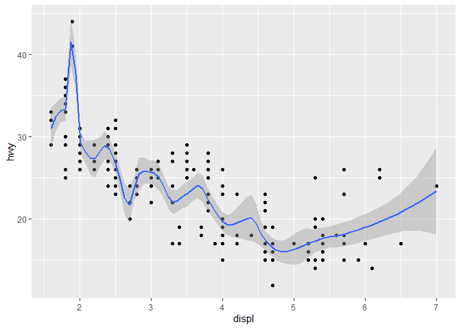<!-- -->

``` r
ggplot(mpg, aes(displ, hwy)) +
  geom_point() +
  geom_smooth(span = 1)
```

    ## `geom_smooth()` using method = 'loess' and formula 'y ~ x'

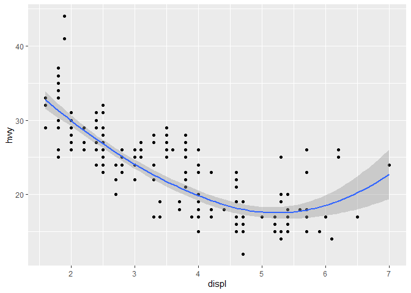<!-- -->

method = “loess”는 n이 1000보다 크면 제대로 작동하지 않으므로 다른 smoothing 알고리즘을 사용하라. n이
1000보다 크면 다음 방법을 사용하라. mehtod = “gam” (gam = generalized additive
model). formula = y ~ s(x) or formula = y ~ s(x, bs = “cs”) (for large
data)

``` r
library(mgcv)
```

    ## Warning: package 'mgcv' was built under R version 3.5.3

    ## Loading required package: nlme

    ## Warning: package 'nlme' was built under R version 3.5.3

    ## 
    ## Attaching package: 'nlme'

    ## The following object is masked from 'package:dplyr':
    ## 
    ##     collapse

    ## This is mgcv 1.8-28. For overview type 'help("mgcv-package")'.

``` r
ggplot(mpg, aes(displ, hwy)) +
  geom_point() +
  geom_smooth(method = "gam", formula = y ~ s(x, bs = "cs"))
```

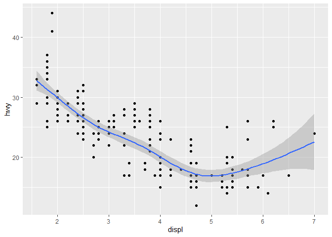<!-- -->

method = “rlm”은 이상치가 크게 영향을 미치지 않는 robust fitting algorithm이다.

``` r
library(MASS) #method = "rlm" 을 위한 패키지 로드
```

    ## Warning: package 'MASS' was built under R version 3.5.3

    ## 
    ## Attaching package: 'MASS'

    ## The following object is masked from 'package:dplyr':
    ## 
    ##     select

``` r
ggplot(mpg, aes(displ, hwy)) +
  geom_point() +
  geom_smooth(method = "rlm")
```

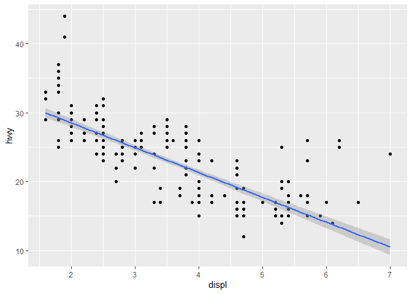<!-- -->

``` r
ggplot(mpg, aes(displ, hwy)) +
  geom_point() +
  geom_smooth(method = "lm")
```

<!-- -->

jitter가 상대적으로 작은 플랏에 작동함을 기억하자.

## Histograms and Frequency Polygons

히스토그램과 도수다각형은 data를 default로 30개의 bin으로 쪼갠다. binwidth와 breaks(간격을 균등하게
두지 않으려는 경우)를
    사용하자.

``` r
ggplot(mpg, aes(hwy)) + geom_histogram()
```

    ## `stat_bin()` using `bins = 30`. Pick better value with `binwidth`.

<!-- -->

``` r
ggplot(mpg, aes(hwy)) +
geom_freqpoly(binwidth = 2.5)
```

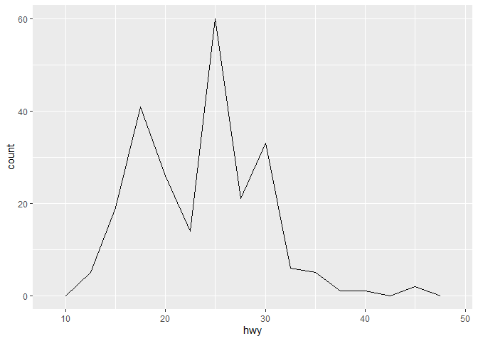<!-- -->

``` r
ggplot(mpg, aes(hwy)) +
geom_freqpoly(binwidth = 1)
```

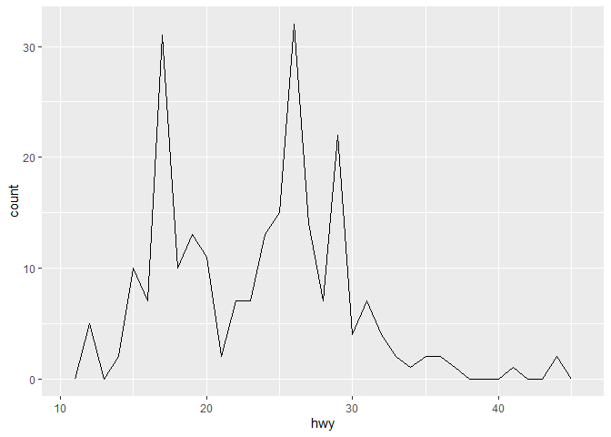<!-- -->

geom\_density가 있지만 모든 데이터가 연속이고 bound가 없으며 smooth하다는 사실이 아닌 가정을 하고 해석하기
어렵다.

``` r
ggplot(mpg, aes(displ, colour = drv)) +
  geom_freqpoly(binwidth = 0.5)
```

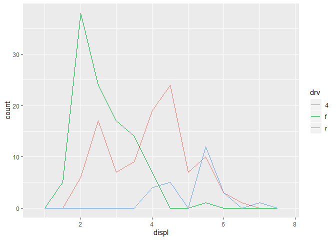<!-- -->

``` r
ggplot(mpg, aes(displ, fill = drv)) +
  geom_histogram(binwidth = 0.5) +
  facet_wrap(~drv, ncol = 1)
```

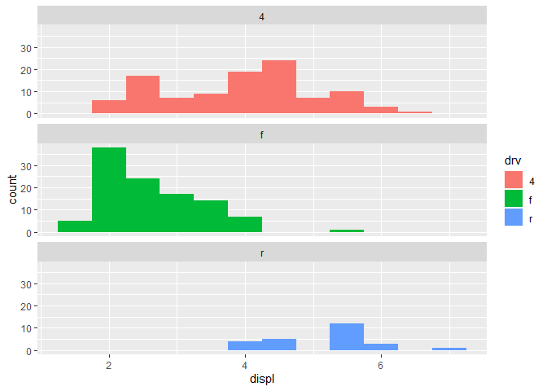<!-- -->

you might have three drugs with their average effect: drugs \<-
data.frame( drug = c(“a”, “b”, “c”), effect = c(4.2, 9.7, 6.1) ) 이런 데이터는
막대그래프 보단 산점도가 공간을 덜 차지하고 y축에 0이 포함되지 않아도 되므로 더 낫다.

# Time Series Line and Path Plots

``` r
head(economics)
```

    ## # A tibble: 6 x 6
    ##   date         pce    pop psavert uempmed unemploy
    ##   <date>     <dbl>  <dbl>   <dbl>   <dbl>    <dbl>
    ## 1 1967-07-01  507. 198712    12.6     4.5     2944
    ## 2 1967-08-01  510. 198911    12.6     4.7     2945
    ## 3 1967-09-01  516. 199113    11.9     4.6     2958
    ## 4 1967-10-01  512. 199311    12.9     4.9     3143
    ## 5 1967-11-01  517. 199498    12.8     4.7     3066
    ## 6 1967-12-01  525. 199657    11.8     4.8     3018

``` r
ggplot(economics, aes(date, pop/unemploy)) +
  geom_line()
```

<!-- -->

``` r
ggplot(economics, aes(date, uempmed)) +
  geom_line()
```

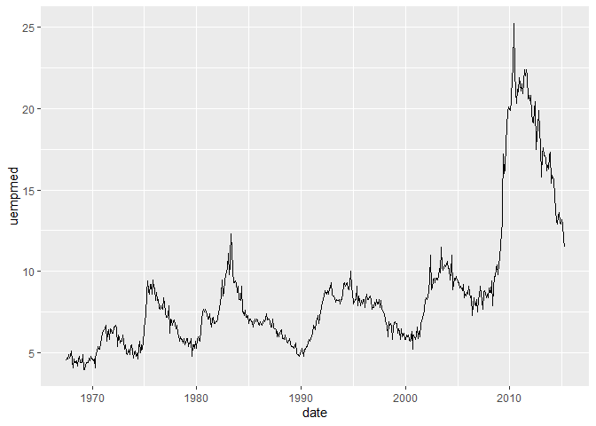<!-- -->

이 관계를 더 자세하게 조사하기 위해 동일한 플랏에서 두 시계열을 모두 그려내고자 한다.

``` r
ggplot(economics, aes(unemploy / pop, uempmed)) +
  geom_path() +
  geom_point()
```

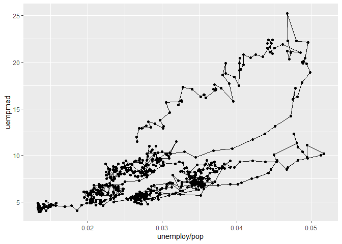<!-- -->

``` r
year <- function(x) as.POSIXlt(x)$year + 1900
ggplot(economics, aes(unemploy / pop, uempmed)) +
  geom_path(colour = "grey50") +
  geom_point(aes(colour = year(date)))
```

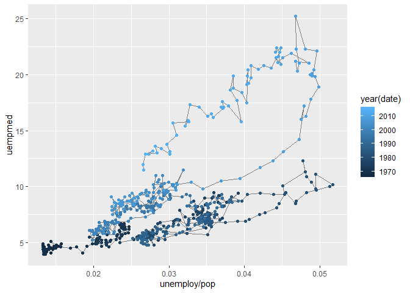<!-- -->

# Exercises

1.  What’s the problem with the plot created by ggplot(mpg, aes(cty,
    hwy)) + geom point()? Which of the geoms described above is most
    effective at remedying the problem?

<!-- end list -->

``` r
ggplot(mpg, aes(cty, hwy)) +
  geom_jitter() #첫번째 방법
```

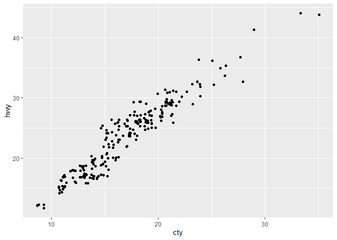<!-- -->

``` r
ggplot(mpg, aes(cty, hwy)) +
  geom_point(alpha = 0.3) # 두번째 방ㅂ
```

<!-- -->

2.  Explore the distribution of the carat variable in the diamonds
    dataset. What binwidth reveals the most interesting patterns?

<!-- end list -->

``` r
ggplot(diamonds, aes(carat)) +
  geom_histogram(binwidth = 0.02) +
  scale_x_continuous(limits = c(0, 2.5), expand = c(0,0), breaks = seq(0, 2.5, 0.1)) # expand는 x축 양쪽에 여백이 없도록 설정
```

    ## Warning: Removed 126 rows containing non-finite values (stat_bin).

    ## Warning: Removed 2 rows containing missing values (geom_bar).

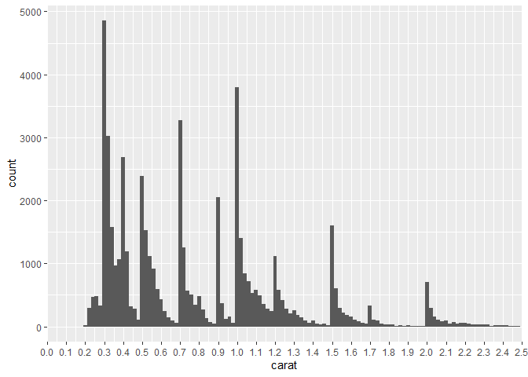<!-- -->

3.  Explore the distribution of the price variable in the diamonds data.
    How does the distribution vary by cut?

<!-- end list -->

``` r
ggplot(diamonds, aes(price)) +
  geom_histogram() +
  facet_wrap(~cut, scales = "free") # 분포의 형태를 알기위해 scales = "free" 는 필수!
```

    ## `stat_bin()` using `bins = 30`. Pick better value with `binwidth`.

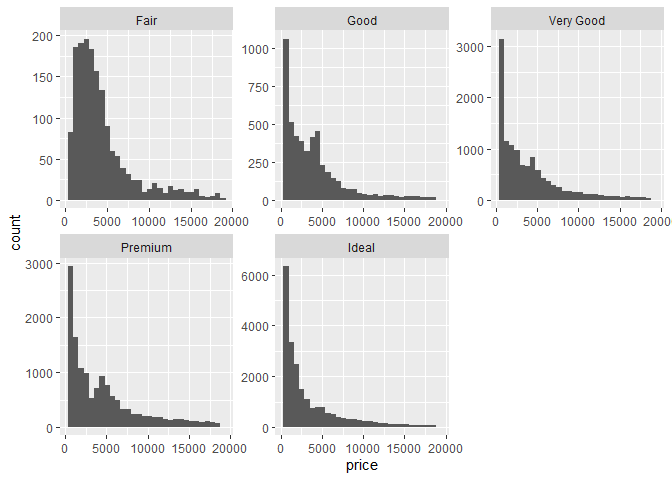<!-- -->

``` r
ggplot(diamonds, aes(price, colour = cut)) +
  geom_freqpoly(binwidth = 200) 
```

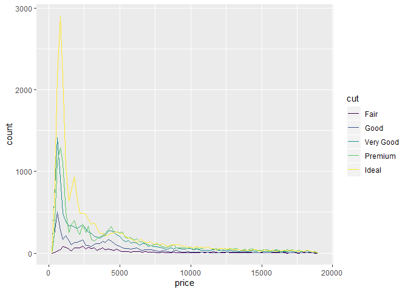<!-- -->

4.  Read the documentation for geom bar().What does the weight aesthetic
    do?

<!-- end list -->

``` r
g <- ggplot(mpg, aes(class))
g + geom_bar() # number of cars in each class
```

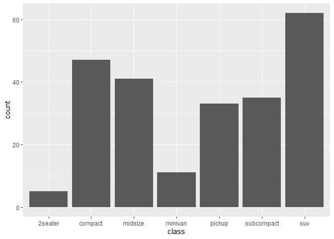<!-- -->

``` r
g + geom_bar(aes(weight = displ)) #total engine displacement of each claass
```

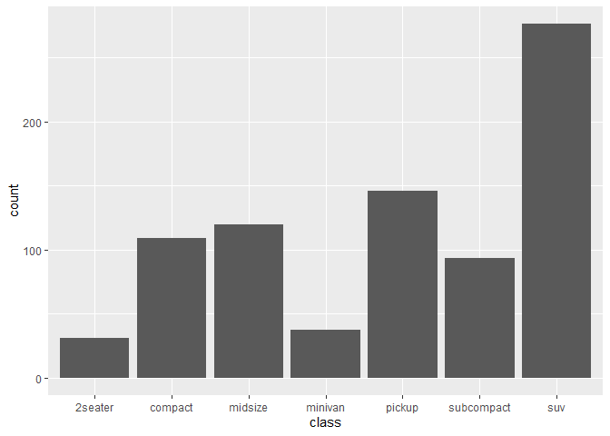<!-- -->

5.  Using the techniques already discussed in this chapter, come up with
    three ways to <span style="background = yellow"> visualise a 2d
    categorical distribution</span>. Try them out by visualising the
    distribution of model and manufacturer, trans and class, and cyl and
    trans.

제조사와 모델같은 경우에는 제조사 - 모델 조합이 겹치는게 없으므로 히트맵은 적절하지 않다. 위에서 풀었던 문제를 참고하자.

``` r
with(mpg, table(trans, class))
```

    ##             class
    ## trans        2seater compact midsize minivan pickup subcompact suv
    ##   auto(av)         0       2       3       0      0          0   0
    ##   auto(l3)         0       1       0       1      0          0   0
    ##   auto(l4)         1       8      14       8     12         11  29
    ##   auto(l5)         0       4       5       0      8          4  18
    ##   auto(l6)         0       0       0       2      0          0   4
    ##   auto(s4)         0       2       1       0      0          0   0
    ##   auto(s5)         0       2       0       0      0          0   1
    ##   auto(s6)         1       5       6       0      0          1   3
    ##   manual(m5)       0      18       9       0      8         16   7
    ##   manual(m6)       3       5       3       0      5          3   0

``` r
df <- as.data.frame(table(mpg$trans, mpg$class))
df <- df %>% 
  mutate(Freq_label = ifelse(Freq == 0, "", Freq)) # 0이 너무 많아 보기 좋게하기 위해 추가함.
 
ggplot(df, aes(Var1, Var2)) +
   geom_tile(aes(fill = Freq), colour = "black") +
   scale_fill_gradient(low = "white", high = "steelblue") +
   geom_text(aes(label = Freq_label), vjust = "bottom") +
   labs(x = "trans", y = "class") +
   theme(axis.text.x = element_text(angle = -30, hjust = 0, vjust = 1))
```

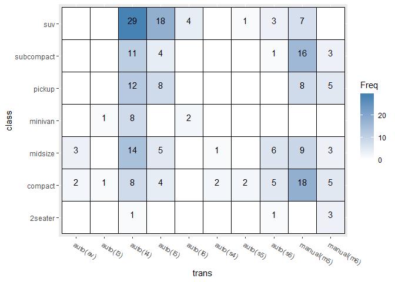<!-- -->

``` r
df <- as.data.frame(table(mpg$cyl, mpg$trans))
ggplot(df, aes(Var1, Var2)) +
  geom_point(aes(size = Freq, colour = Freq, stat = "identity"), shape = 15) +
  scale_size_continuous() + scale_size_area() +
  scale_colour_gradient(low = "white", high = "black") +
  labs(x = "cyl", y = "trans") +
  theme_bw() +
  theme(panel.grid.major.x = element_blank(),
        panel.grid.major.y = element_blank())
```

    ## Warning: Ignoring unknown aesthetics: stat

    ## Scale for 'size' is already present. Adding another scale for 'size',
    ## which will replace the existing scale.

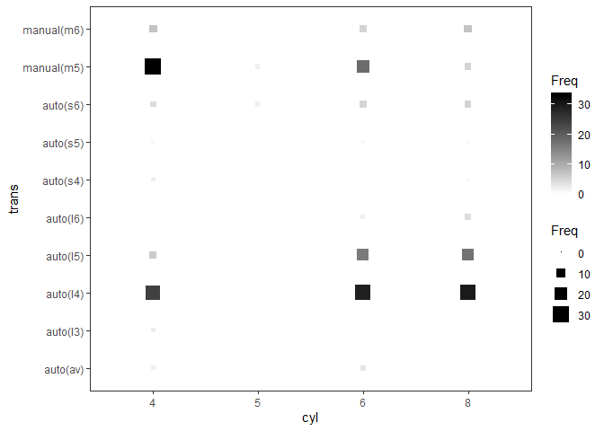<!-- -->

# Modifying the Axes

``` r
ggplot(mpg, aes(drv, hwy)) +
  geom_jitter(width = 0.25, na.rm = TRUE) + # 범위를 지정했을 때 생기는 경고 제거
  xlim("f", "r") + # 범주형일때는 이렇게 
  ylim(NA, 30) + # 30이하
  ylab(NULL) # y축 레이블 제거
```

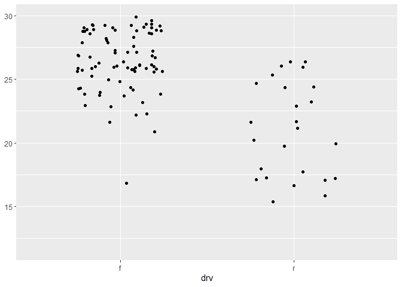<!-- -->

# Output

``` r
p <- ggplot(mpg, aes(displ, hwy, colour = factor(cyl))) +
  geom_point()
print(p) 
```

<span style="backgound = yellow">함수나 루프 안에서는 print()를 사용해야한다.</span>

``` r
ggsave("plot.png", width = 5, height = 5) # Save png to disk
summary(p) # 객체의 구조를 확인할 수 있다.
saveRDS(p, "plot.rds") #플랏 객체의 전체 복사본이 저장된다.
q <- readRDS("plot. rds") # 다시 사용 가능
```
