ggplot2 Elegant Graphics for Data Analysis
================
true
2018년 2월

<style>
mystyle{
    font-family :  Georgia;
    font-size : 26px;
    color : PaleVioletRed  ;
}
</style>

> <mystyle> Chapter 3 </mystyle>  
> <mystyle> Toolbox </mystyle>

레이어의 세가지 목적

  - <span style="background : yellow">To display the data.</span> We
    plot the raw data for many reasons, relying on our skills at pattern
    detection to spot gross structure, local structure, and outliers.In
    the earliest stages of data exploration, it is often the only layer.

  - <span style="background : yellow"> To display a statistical summary
    of the data.</span> As we develop and explore models of the data, it
    is useful to display model predictions in the context of the data.
    Showing the data helps us improve the model, and showing the model
    helps reveal subtleties of the data that we might otherwise miss

  - <span style="background : yellow"> To add additional metadata:
    context, annotations, and references. </span> A metadata layer
    displays background context, annotations that help to give meaning
    to the raw data, or fixed references that aid comparisons across
    panels. Metadata can be useful in the background and foreground. A
    map is often used as a background layer with spatial data.
    Background metadata should be rendered so that it doesn’t interfere
    with your perception of the data, so is usually displayed underneath
    the data and formatted so that it is minimally perceptible. That is,
    if you concentrate on it, you can see it with ease, but it doesn’t
    jump out at you when you are casually browsing the plot.

# Basic Plot Types

``` r
df <- data.frame(
x = c(3, 1, 5),
y = c(2, 4, 6),
label = c("a","b","c")
)
p <- ggplot(df, aes(x, y, label = label)) +
labs(x = NULL, y = NULL) + # Hide axis label
theme(plot.title = element_text(size = 12)) # Shrink plot title
p + geom_point() + ggtitle("point")
```

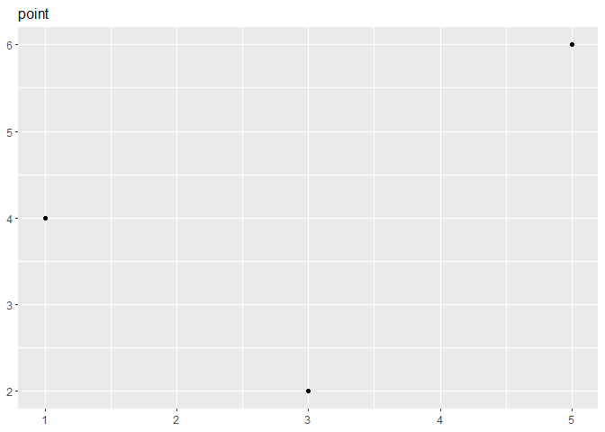<!-- -->

``` r
p + geom_text() + ggtitle("text")
```

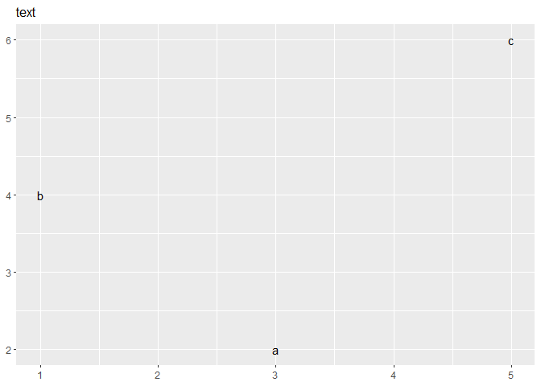<!-- -->

``` r
p + geom_bar(stat = "identity") + ggtitle("bar")
```

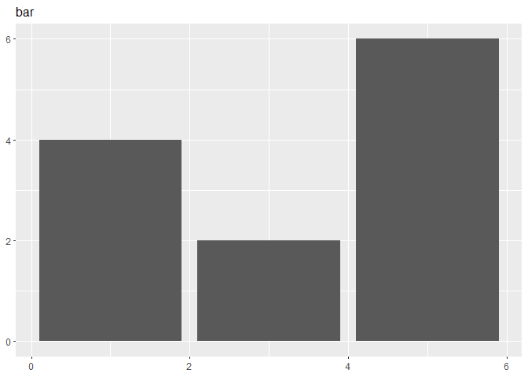<!-- -->

``` r
p + geom_tile() + ggtitle("raster")
```

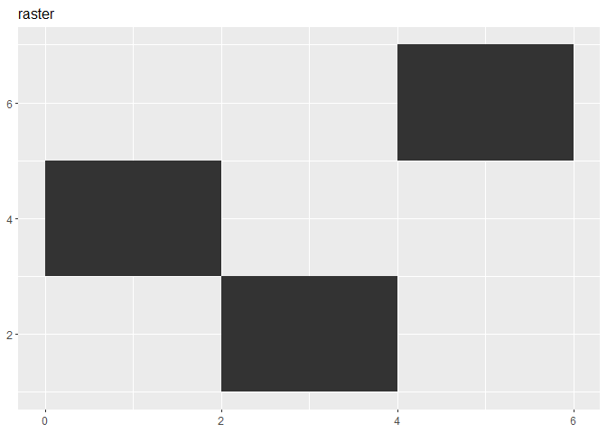<!-- -->

``` r
p + geom_line() + ggtitle("line")
```

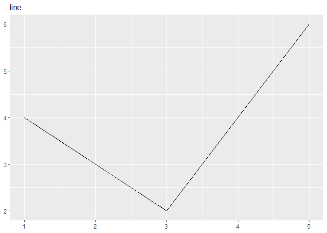<!-- -->

``` r
p + geom_area() + ggtitle("area")
```

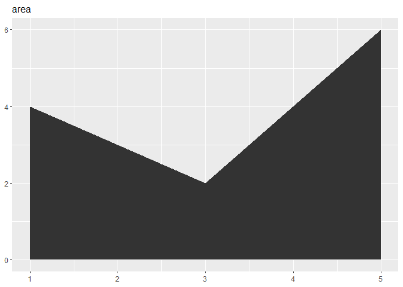<!-- -->

``` r
p + geom_path() + ggtitle("path")
```

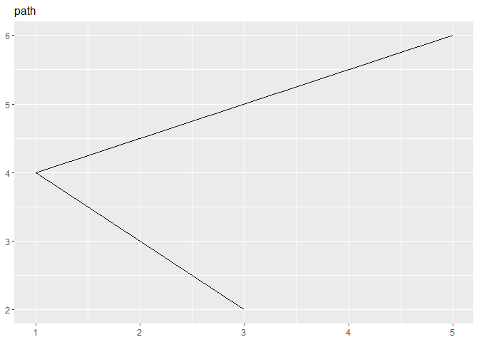<!-- -->

``` r
p + geom_polygon() + ggtitle("polygon")
```

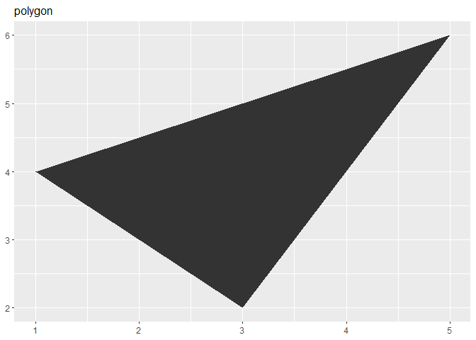<!-- -->

geom\_path() 와 geom\_polygon() 의 차이 : path가 지나간 길의 내부를 색칠 geom\_path() 와
geom\_line()의 차이 : line은 x가 작은것부터 큰것까지 선을 그리는 반면 path는 데이터 x의 순서대로 그린다.

# Labels

``` r
df <- data.frame(x = 1, y = 3:1, family = c("sans", "serif", "mono"))
ggplot(df, aes(x, y)) +
  geom_text(aes(label = family, family = family)) #family는 글꼴을 의미한다.
```

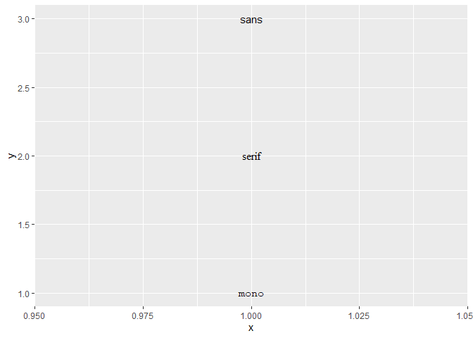<!-- -->

폰트 패키지

  - **showtext**, <https://github.com/yixuan/showtext>, by Yixuan Qiu,
    makes GD-independent plots by rendering all text as polygons.
  - extrafont, <https://github.com/wch/extrafont>, by Winston Chang,
    converts fonts to a standard format that all devices can use.

<!-- end list -->

``` r
library(showtext)
```

    ## Warning: package 'showtext' was built under R version 3.5.3

    ## Loading required package: sysfonts

    ## Warning: package 'sysfonts' was built under R version 3.5.3

    ## Loading required package: showtextdb

    ## Warning: package 'showtextdb' was built under R version 3.5.3

``` r
## Loading Google fonts (http://www.google.com/fonts)
font_add_google("Gochi Hand", "gochi")
font_add_google("Schoolbell", "bell")
font_add_google("Covered By Your Grace", "grace")
font_add_google("Rock Salt", "rock")
## Automatically use showtext to render text for future devices
showtext_auto()
## Tell showtext the resolution of the device,
## only needed for bitmap graphics. Default is 96
## showtext_opts(dpi = 96)
```

<font color = "red"> 주의 </font> `library(cowplot)` 을 사용하면 기본 theme 설정이
바뀐다. `cowplot::`사용

``` r
set.seed(123)
x <- rnorm(10)
y <- 1 + x + rnorm(10, sd = 0.2)
y[1] <- 5
df <- data.frame(x =x , y = y)
mod <- lm(y ~ x, data = df)
std_resid <- MASS::stdres(mod)
outlier <- filter(df, abs(std_resid) > 2)

## Plotting functions as usual
## Open a graphics device if you want, e.g.
## png("demo.png", 700, 600, res = 96)

model_label <-  expression(paste("True model: ", y == x + 1))

ggplot(df, aes(x, y)) +
  geom_point() +
  geom_smooth(method = "lm", se = FALSE, aes(colour = "OLS")) +
  geom_text(data = outlier, aes(label = "This is the outlier"), family = "grace", colour = "steelblue", vjust = "top", nudge_y = -0.1) +
  geom_smooth(data = df[!(df$x %in% outlier$x), ], aes(x, y, colour = "TRUE"), method = "lm", se = FALSE) +
  ggtitle("Draw Plots Before You Fit A Regression") +
  theme(plot.title = element_text(family = "bell")) +
  cowplot::draw_label(model_label, x = 0, y = 2, fontfamily = "rock")
```

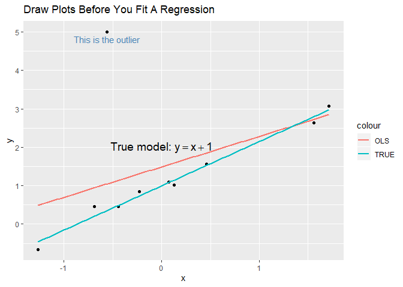<!-- -->

``` r
df <- data.frame(x = 1, y = 3:1, face = c("plain", "bold", "italic"))
ggplot(df, aes(x, y)) +
  geom_text(aes(label = face, fontface = face))
```

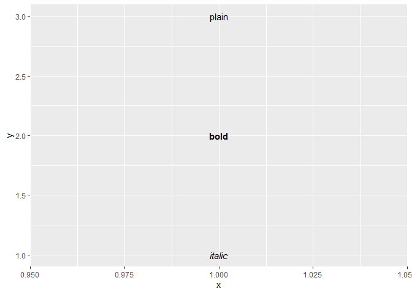<!-- -->

``` r
df <- data.frame(
  x = c(1, 1, 2, 2, 1.5),
  y = c(1, 2, 1, 2, 1.5),
  text = c(
    "bottom-left", "bottom-right",
    "top-left", "top-right", "center"
  )
)
ggplot(df, aes(x, y)) +
  geom_text(aes(label = text))
```

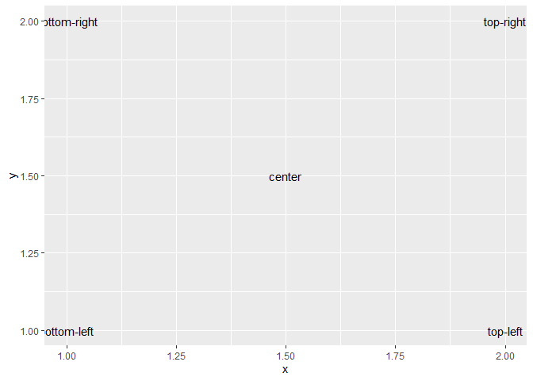<!-- -->

``` r
ggplot(df, aes(x, y)) +
  geom_text(aes(label = text), vjust = "inward", hjust = "inward")
```

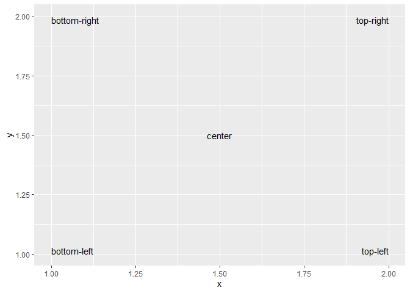<!-- -->

``` r
#"inward"는 기억하자.
```

One of the most useful alignments is “inward” : it aligns text towards
the middle of the plot 이 외에도 size(단위는 mm)와 angle을 조정할 수 있다.

The nudge x and nudge y parameters allow you to nudge the text a little
horizontally or vertically

``` r
df <- data.frame(trt = c("a", "b", "c"), resp = c(1.2, 3.4, 2.5))
ggplot(df, aes(resp, trt)) +
  geom_point() +
  geom_text(aes(label = paste0("(", resp, ")")), nudge_y = -0.25) +
  xlim(1, 3.6)
```

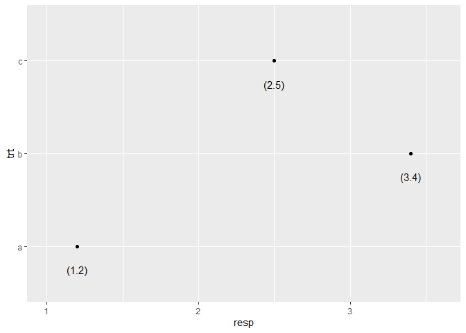<!-- -->

텍스트가 겹치면 check\_overlap = TRUE 기억만 해두자.

``` r
ggplot(mpg, aes(displ, hwy)) +
  geom_text(aes(label = model)) +
  xlim(1, 8)
```

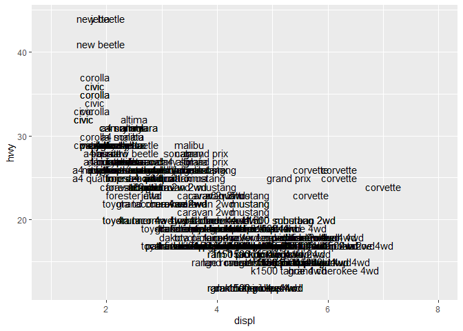<!-- -->

``` r
ggplot(mpg, aes(displ, hwy)) +
  geom_text(aes(label = model), check_overlap = TRUE) +
  xlim(1, 8)
```

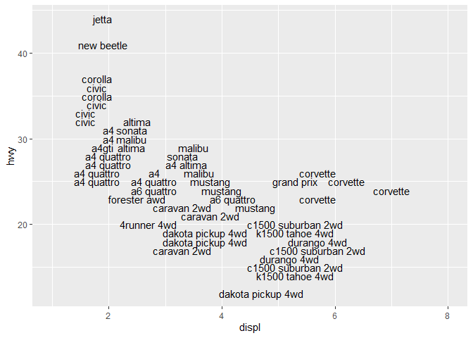<!-- -->

## ggrepel 패키지

여기서 padding 옵션은 text나 label 주변을 둘러싸고 있는 공간을 의미한다.

``` r
mtcars$label <- rownames(mtcars)
mtcars$label[1:15] <- ""

library(ggrepel)
```

    ## Warning: package 'ggrepel' was built under R version 3.5.3

``` r
ggplot(mtcars, aes(wt, mpg)) +
  geom_point(aes(color = factor(cyl)), size = 2) +
  geom_text_repel(
    aes(
      color = factor(cyl), #텍스트의 색을 조정
      size = hp, # 텍스트의 사이즈를 조정할 수 있다.
      label = label
    ),
    point.padding = 0.25,
    box.padding = 0.25,
    nudge_y = 0.1
  ) +
  theme_bw(base_size = 16)
```

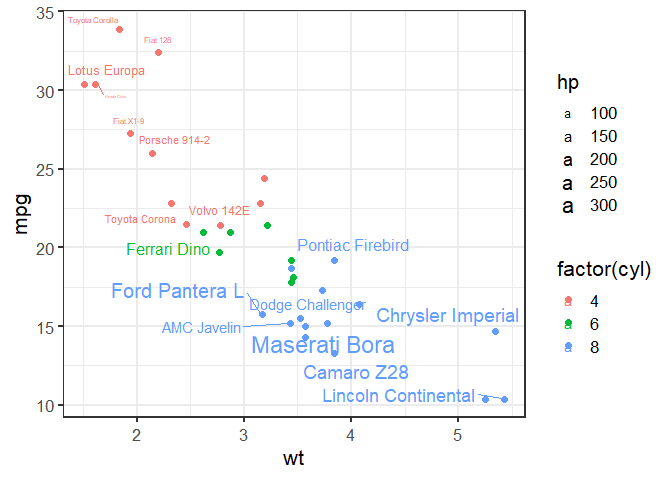<!-- -->

``` r
ggplot(mtcars) +
  geom_point(aes(wt, mpg), size = 5, color = 'grey') +
  geom_label_repel(
    aes(wt, mpg, fill = factor(cyl), label = rownames(mtcars)),
    fontface = 'bold', color = 'white',
    box.padding = 0.35, point.padding = 0.5,
    segment.color = 'grey50' # 선색깔 지정가능
  ) +
  theme_classic(base_size = 16)
```

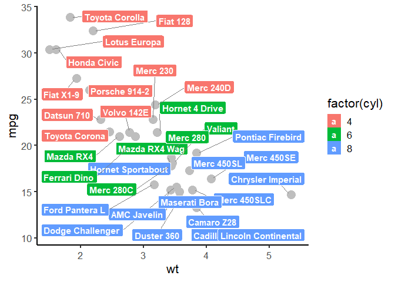<!-- -->

``` r
set.seed(42)
data <- mtcars
mu <- mean(data$wt)

left <- data[data$wt < mu,]
right <- data[data$wt >= mu,]

ggplot() +
  geom_vline(xintercept = mu) +
  geom_point(
    data = data,
    mapping = aes(wt, mpg)
  ) +
  geom_text_repel(
    data = left,
    mapping = aes(wt, mpg, label = rownames(left), colour = 'Left half'),
    # Limit labels to the left of the vertical x=mu line
    xlim = c(NA, mu)
  ) +
  geom_text_repel(
    data = right,
    mapping = aes(wt, mpg, label = rownames(right), colour = 'Right half'),
    # Limit labels to the right of the vertical x=mu line
    xlim = c(mu, NA)
  ) +
  theme_classic(base_size = 16)
```

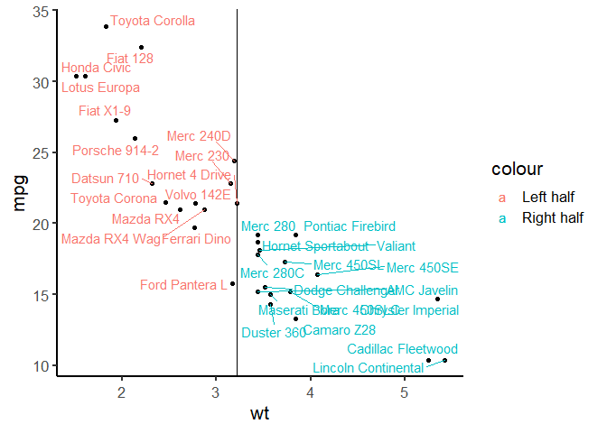<!-- -->

directlabels 패키지를 이용해 라인위에 글자를 적을 수 있지만 난 이 코드가 좀 더 마음에 든다. 기억해 두자.

``` r
ggplot(Orange, aes(age, circumference, color = Tree)) +
  geom_line() +
 coord_cartesian(xlim = c(min(Orange$age), max(Orange$age) + 90)) + #coord_cartesian : 원하는 범위로 zoom-in
  geom_text_repel(
    data = subset(Orange, age == max(age)), #기억!
    aes(label = paste("Tree", Tree)), # 기억!
    size = 6,
    nudge_x = 45,
    segment.color = NA # 선 색깔 없애기 
  ) +
  theme_classic(base_size = 16) +
  theme(legend.position = "none") +
  labs(title = "Orange Trees", x = "Age (days)", y = "Circumference (mm)")
```

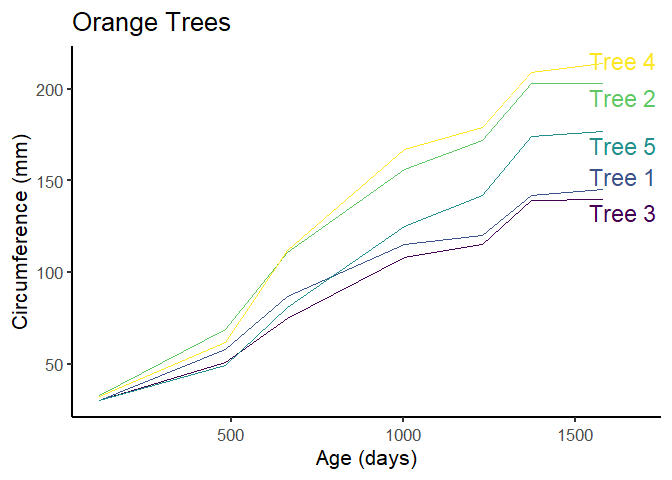<!-- -->

**reference** :
<https://cran.r-project.org/web/packages/ggrepel/vignettes/ggrepel.html>
에서 알고리즘과 예제 참고.

``` r
label <- data.frame(
  waiting = c(55, 80),
  eruptions = c(2, 4.3),
  label = c("peak one", "peak two")
)
ggplot(faithfuld, aes(waiting, eruptions)) +
  geom_tile(aes(fill = density)) +
  geom_label(data = label, aes(label = label))
```

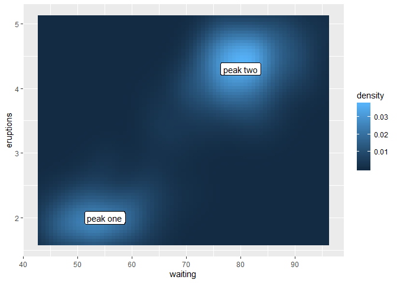<!-- -->

주의해야할 점

  - Text does not affect the limits of the plot. 텍스트가 플랏 밖으로 나갈 수 있으므로
    xlim과 ylim으로 플랏 사이즈를 조절하자.
  - 레이블들이 겹치는 것을 주의하자.

# Annotations

Annotations add metadata to your plot

  - `geom_text()` outelier나 중요한 포인트에 라벨을 추가\!
  - `geom_rect()` 강조하고 싶은 플랏의 구역을 나타내고 싶을때 이용\!
  - `geom_line()`, `geom_path()`, and `geom_segment()` arrow인자를 이용해서 선의
    방향을 나타내자\!
  - `geom_vlin()`, `geom_hline()` and `geom_abline()`을 이용해서 선을 넣어 강조하자\!

<!-- end list -->

``` r
presidential <- subset(presidential, start > economics$date[1])

ggplot(economics) +
  geom_line(aes(date, unemploy)) +
  geom_rect(data = presidential, 
            aes(
              xmin = start, xmax = end, ymin = -Inf, ymax = Inf, fill = party), alpha = 0.2) +
  scale_fill_manual(values = c("blue", "red")) +
  geom_text(
    aes(x = start, y = 2500, label = name),
    data = presidential,
    size = 3, vjust = 0, hjust = 0, nudge_x = 50
  ) +
  geom_vline(data = presidential, aes(xintercept = as.numeric(start)), colour = "grey50", alpha = 0.5)
```

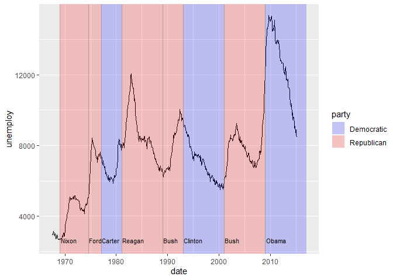<!-- -->

``` r
yrng <- range(economics$unemploy)
xrng <- range(economics$date)
caption <- paste(strwrap("Unemployment rates in the US have
varied a lot over the years", 40), collapse = "\n")
ggplot(economics, aes(date, unemploy)) +
  geom_line() +
    annotate("text", x = xrng[1], y = yrng[2], label = caption,
    hjust = 0, vjust = 1, size = 4
)
```

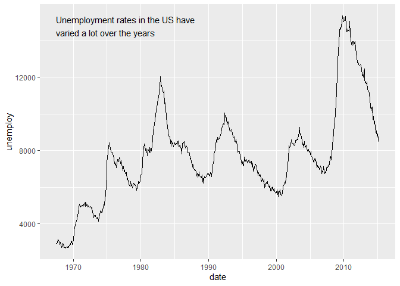<!-- -->

``` r
mod_coef <- coef(lm(log10(price) ~ log10(carat), data = diamonds))
ggplot(diamonds, aes(log10(carat), log10(price))) +
  geom_bin2d() +
  geom_abline(intercept = mod_coef[1], slope = mod_coef[2],
    colour = "white", size = 1) +
  facet_wrap(~cut, nrow = 1)
```

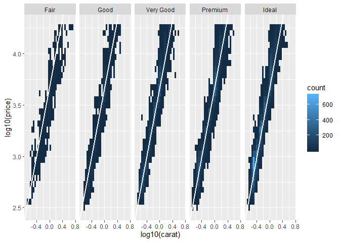<!-- -->

``` r
 # ggplot(diamonds, aes(log10(carat), log10(price))) +
 #   geom_bin2d() +
 #   geom_smooth(method = "lm", colour = "white", size = 1, se = FALSE) +
 #   facet_wrap(~cut, nrow = 1) +
 #  ylim(2.5, 4.3)
```

# Collective Geoms

An individual geom draws a distinct graphical object for each
observation (row) (e.g. geom\_point()). A collective geom displays
multiple observations with one geometric object(e.g. statistical summary
like boxplot, polygon.). 그래픽 요소에 대해 관측치에 할당을 어떻게 통제할까? 이것이 group
aesthetic의 역할이다. 기본값으로 group aesthetic은 플랏에 모든 이산변수에 매핑된다. 이것은 종종 올바르게
데이터를 나누지만, 제대로 나누지 못할 때도 있고 어떠한 이산 변수도 플랏에 사용되지 않을 수도 있다.\<span
style : “background : yellow”\> 각 그룹에 다른 값을 가지는 변수에 그룹을 매핑함으로써 그룹화 구조를
명백하게 정의해야한다.</span> 특히 <font color = "red"> longitudinal data에서
주의한다.</font>

``` r
data(Oxboys, package = "nlme") # 패키지 로드하지않고 패키지 내부 데이터만 로드
ggplot(Oxboys, aes(age, height)) +
  geom_point() +
  geom_line()
```

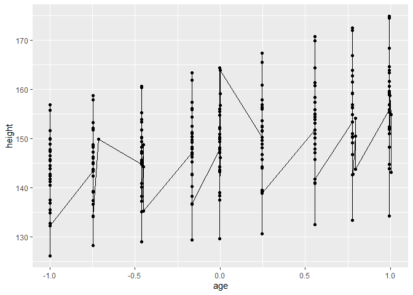<!-- -->

``` r
ggplot(Oxboys, aes(age, height, group = Subject)) +
  geom_point() +
  geom_line()
```

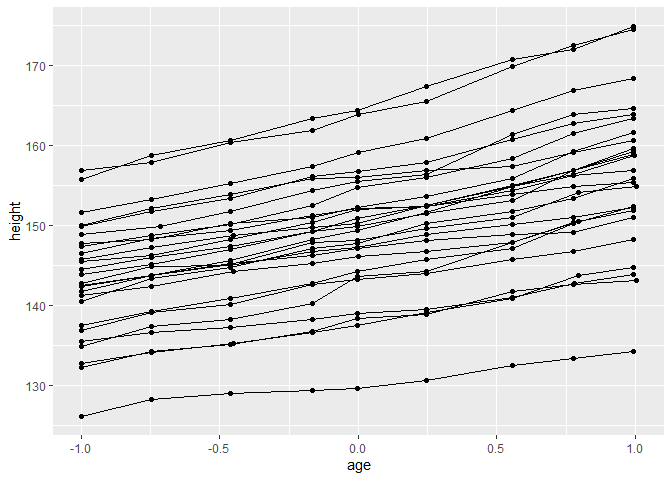<!-- -->

<span style="background : green"> 그룹이 단일 변수에 의해 정의되지 않고 대신에 여러개의 변수의 조합에
의해 정의 되어 진다면 `interaction()` 을 이용하여라. e.g. `aes(group =
interacton(school_id, student_id))` </span>

``` r
ggplot(Oxboys, aes(age, height )) +
  geom_line(aes(group = Subject)) + #data layer에서 그룹을 지정해주면 회귀선이 너무 많이 그려짐
  geom_smooth(method = "lm", size = 2, se = FALSE) 
```

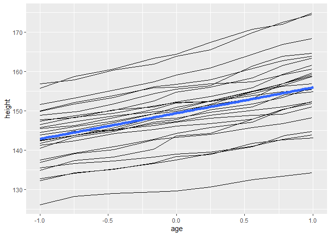<!-- -->

``` r
ggplot(Oxboys, aes(Occasion, height)) +
  geom_boxplot() +
  geom_line(aes(group = Subject), colour = "#3366FF", alpha = 0.5)
```

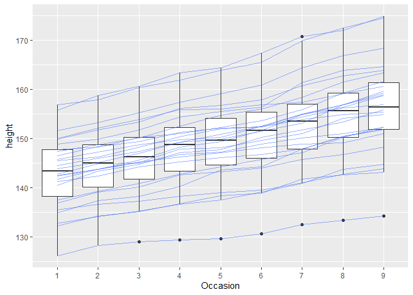<!-- -->

``` r
ggplot(faithfuld, aes(eruptions, waiting)) +
  geom_contour(aes(z = density, colour = ..level..))
```

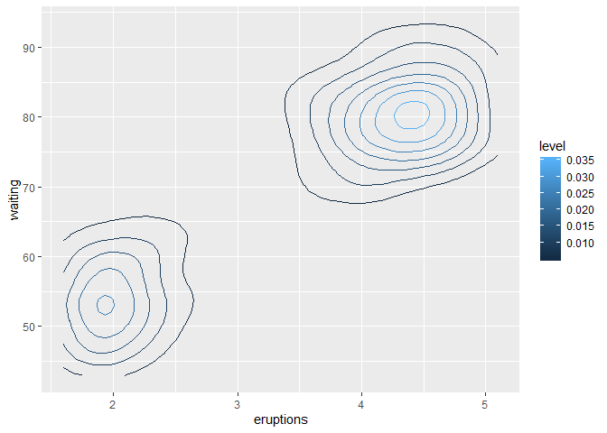<!-- -->

``` r
ggplot(faithfuld, aes(eruptions, waiting)) +
  geom_raster(aes(fill = density))
```

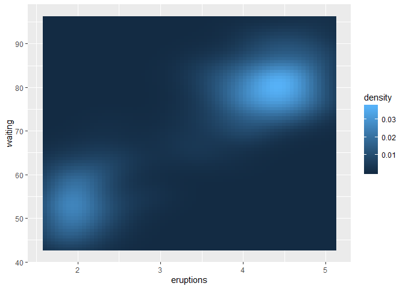<!-- -->

``` r
# Bubble plots work better with fewer observations
small <- faithfuld[seq(1, nrow(faithfuld), by = 10), ] #정렬 되어 있으니까 계통추출로 뽑자.
ggplot(small, aes(eruptions, waiting)) +
  geom_point(aes(size = density), alpha = 1/3) +
  scale_size_area()
```

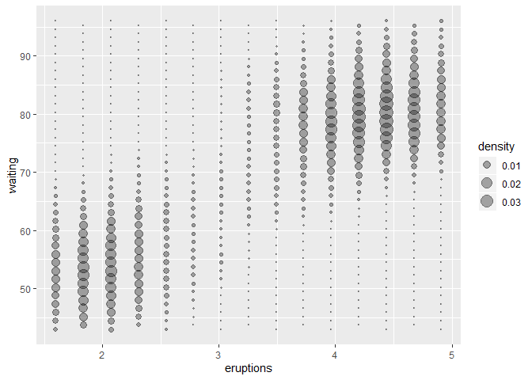<!-- --> Lines
and paths operate on an off-by-one principle: This means that the
aesthetic for the last observation is not used:

``` r
df <- data.frame(x = 1:3, y = 1:3, colour = c(1,3,5))
ggplot(df, aes(x, y, colour = factor(colour))) +
  geom_line(aes(group = 1), size = 2) +
  geom_point(size = 5)
```

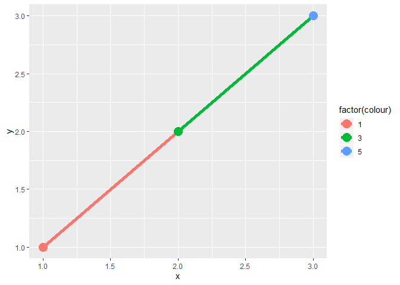<!-- -->

``` r
ggplot(df, aes(x, y, colour = colour)) +
  geom_line(aes(group = 1), size = 2) +
  geom_point(size = 5)
```

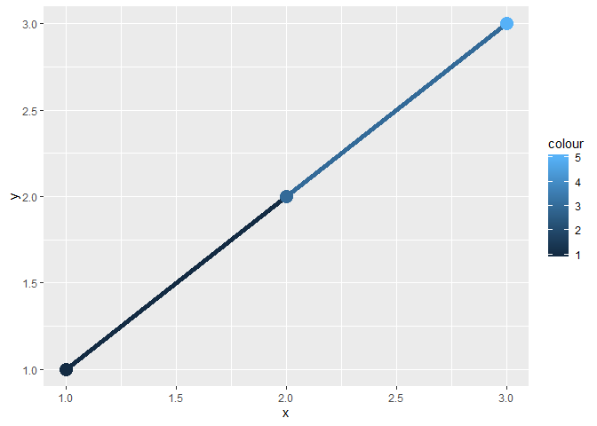<!-- -->

``` r
xgrid <- with(df, seq(min(x), max(x), length = 50))
  interp <- data.frame(
  x = xgrid,
  y = approx(df$x, df$y, xout = xgrid)$y,
  colour = approx(df$x, df$colour, xout = xgrid)$y
)
ggplot(interp, aes(x, y, colour = colour)) +
  geom_line(size = 2) +
  geom_point(data = df, size = 5)
```

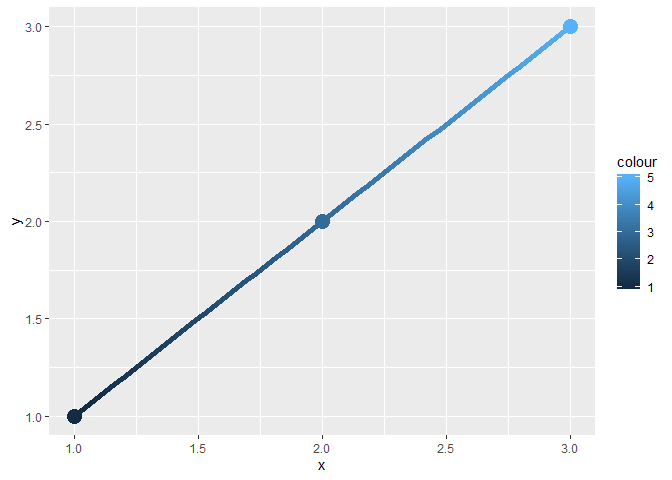<!-- -->

default goruping 이 class(이산형변수)를 바탕으로 하고 있기 때문에 연속형 변수를 fill에 mapping
시킬려면 group을 바꿔줘야
한다.

``` r
ggplot(mpg, aes(class, fill = hwy, group = hwy)) + #group = hwy 를 반드시 설정해준다.
  geom_bar()
```

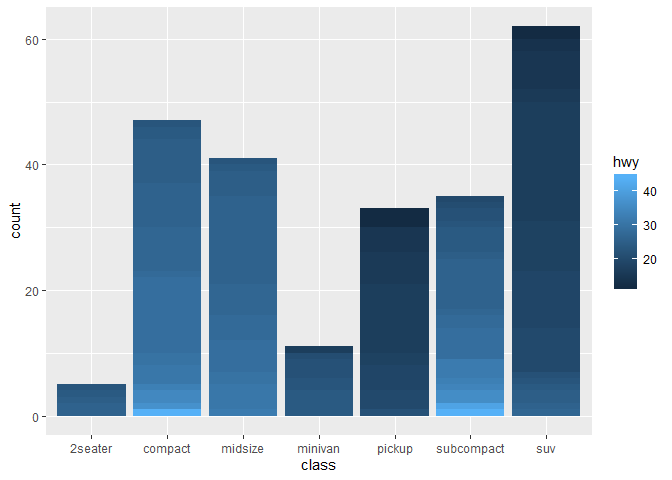<!-- --> 섬세한
컨트롤을 원하면 순서형 펙터를 만들자.

## Exercises

Modify the following plot so that you get one boxplot per integer value
of displ. ggplot(mpg, aes(displ, cty)) + geom\_boxplot()

``` r
ggplot(mpg, aes(as.factor(round(displ)), cty)) + 
 geom_boxplot()
```

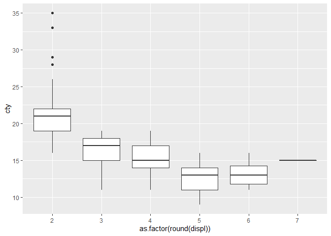<!-- -->

``` r
as.integer(1.6) # 소수점 삭제, integer
```

    ## [1] 1

``` r
floor(1.6)
```

    ## [1] 1

``` r
round(1.6)
```

    ## [1] 2

``` r
class(floor(1.6)) # numeric
```

    ## [1] "numeric"

How many bars are in each of the following plots? ggplot(mpg, aes(drv))
+ geom\_bar() ggplot(mpg, aes(drv, fill = hwy, group = hwy)) +
geom\_bar() library(dplyr) mpg2 \<- mpg %\>% arrange(hwy) %\>% mutate(id
= seq\_along(hwy)) ggplot(mpg2, aes(drv, fill = hwy, group = id)) +
geom\_bar() (Hint: try adding an outline around each bar with colour =
“white”)

``` r
ggplot(mpg, aes(drv)) +
  geom_bar(colour = "white")
```

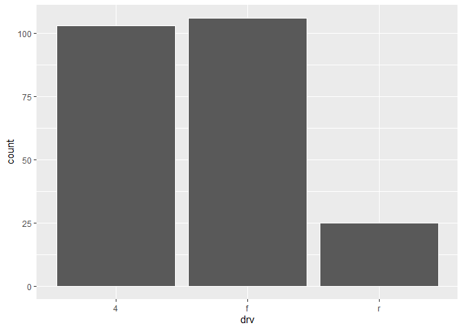<!-- -->

``` r
ggplot(mpg, aes(drv, fill = hwy, group = hwy)) +
  geom_bar(colour = "white")
```

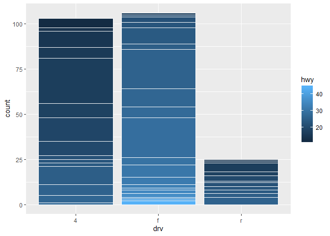<!-- -->

``` r
library(dplyr)
mpg2 <- mpg %>% arrange(hwy) %>% mutate(id = seq_along(hwy))
ggplot(mpg2, aes(drv, fill = hwy, group = id)) +
  geom_bar(colour = "white")
```

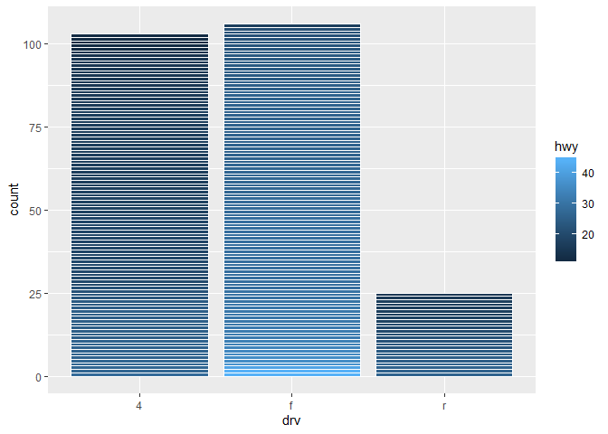<!-- --> 윤곽선으로
응용을 할 수 있을까?

# Drawing Maps

## Vector Boundaries

Vector boundaries are defined by a data frame with one row for each
“corner” of a geographical region like a country, state, or county. It
requires four variables:

  - **lat** and **long**, giving the location of a point
  - **group**, a unique identifier for each contiguous region
  - **id**, the name of the region

<!-- end list -->

``` r
mi_counties <- map_data("county", "michigan") %>%
  select(lon = long, lat, group, id = subregion)
ggplot(mi_counties, aes(lon, lat)) +
  geom_polygon(aes(group = group)) +
  coord_quickmap()
```

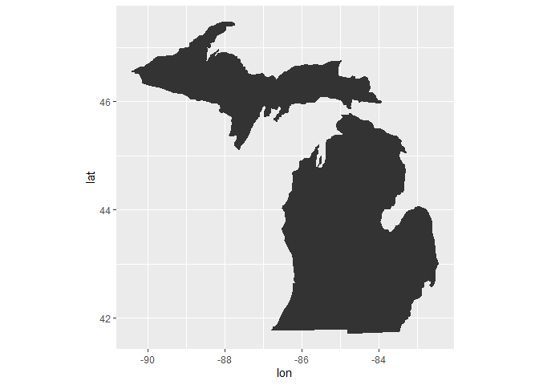<!-- -->

``` r
ggplot(mi_counties, aes(lon, lat)) +
  geom_polygon(aes(group = group), fill = NA, colour = "grey50") +
  coord_quickmap()
```

<!-- -->
USAboundaries package, tigris package, rnaturalearth package and osmar
package

``` r
library(USAboundaries)
c18 <- us_boundaries(as.Date("1820-01-01"))
c18df <- fortify(c18)
head(c18df)
```

## Point Metadata

Point metadata connects locations (defined by lat and lon) with other
variables

``` r
mi_cities <- maps::us.cities %>%
  tbl_df() %>%
  filter(country.etc =="MI") %>%
  select(-country.etc, lon = long) %>%
  arrange(desc(pop))
mi_cities
```

    ## # A tibble: 36 x 5
    ##    name                   pop   lat   lon capital
    ##    <chr>                <int> <dbl> <dbl>   <int>
    ##  1 Detroit MI          871789  42.4 -83.1       0
    ##  2 Grand Rapids MI     193006  43.0 -85.7       0
    ##  3 Warren MI           132537  42.5 -83.0       0
    ##  4 Sterling Heights MI 127027  42.6 -83.0       0
    ##  5 Lansing MI          117236  42.7 -84.6       2
    ##  6 Flint MI            115691  43.0 -83.7       0
    ##  7 Ann Arbor MI        113716  42.3 -83.7       0
    ##  8 Clinton MI          100517  42.6 -82.9       0
    ##  9 Livonia MI           97722  42.4 -83.4       0
    ## 10 Dearborn MI          94681  42.3 -83.2       0
    ## # ... with 26 more rows

``` r
ggplot(mi_cities, aes(lon, lat)) +
  geom_point(aes(size = pop)) +
  scale_size_area() +
  coord_quickmap() #지도가 안그려져 있어서 의미가 없다
```

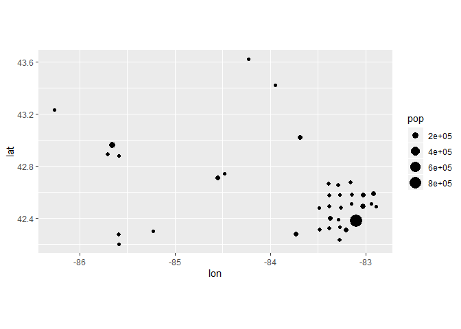<!-- -->

``` r
ggplot(mi_cities, aes(lon, lat)) +
  geom_polygon(aes(group = group), mi_counties, fill = NA, colour = "grey50") +
  geom_point(aes(size = pop), colour = "red") +
  scale_size_area() +
  coord_quickmap()
```

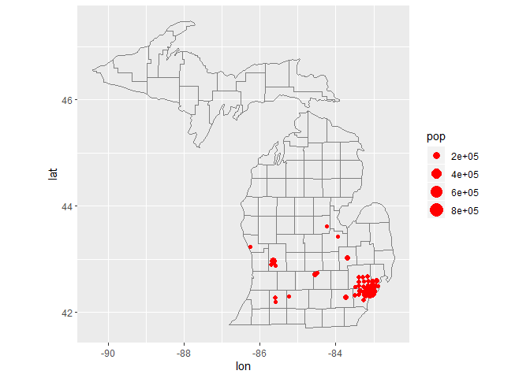<!-- -->

## Raster Images

Instead of displaying context with vector boundaries, you might want to
draw a traditional map underneath

``` r
if (file.exists("mi_raster.rds")) {
  mi_raster <- readRDS("mi_raster.rds")
} else {
  bbox <- c(
    min(mi_counties$lon), min(mi_counties$lat),
    max(mi_counties$lon), max(mi_counties$lat)
  )
  mi_raster <- ggmap::get_openstreetmap(bbox, scale = 8735660)
  saveRDS(mi_raster, "mi_raster.rds")
}
ggmap::ggmap(mi_raster)

ggmap::ggmap(mi_raster) +
  geom_point(aes(size = pop), mi_cities, colour = "red") +
  scale_size_area()
```

``` r
df <- as.data.frame(raster::rasterToPoints(x))
names(df) <- c("lon", "lat", "x")
ggplot(df, aes(lon, lat)) +
  geom_raster(aes(fill = x))
```

## Area Metadata

Sometimes metadata is associated not with a point, but with an area

``` r
mi_census <- midwest %>%
  tbl_df() %>%
  filter(state =="MI") %>%
  mutate(county = tolower(county)) %>%
  select(county, area, poptotal, percwhite, percblack)
mi_census
```

    ## # A tibble: 83 x 5
    ##    county   area poptotal percwhite percblack
    ##    <chr>   <dbl>    <int>     <dbl>     <dbl>
    ##  1 alcona  0.041    10145      98.8    0.266 
    ##  2 alger   0.051     8972      93.9    2.37  
    ##  3 allegan 0.049    90509      95.9    1.60  
    ##  4 alpena  0.034    30605      99.2    0.114 
    ##  5 antrim  0.031    18185      98.4    0.126 
    ##  6 arenac  0.021    14931      98.4    0.0670
    ##  7 baraga  0.054     7954      87.6    0.616 
    ##  8 barry   0.034    50057      98.7    0.208 
    ##  9 bay     0.026   111723      96.4    1.11  
    ## 10 benzie  0.02     12200      97.2    0.246 
    ## # ... with 73 more rows

공간 요소가 없기 때문에 이 데이터로 바로 매핑할 순 없다. 대신에, vector bundaries data에
합친다.

``` r
census_counties <- left_join(mi_census, mi_counties, by = c("county" ="id"))
census_counties
```

    ## # A tibble: 1,472 x 8
    ##    county  area poptotal percwhite percblack   lon   lat group
    ##    <chr>  <dbl>    <int>     <dbl>     <dbl> <dbl> <dbl> <dbl>
    ##  1 alcona 0.041    10145      98.8     0.266 -83.9  44.9     1
    ##  2 alcona 0.041    10145      98.8     0.266 -83.4  44.9     1
    ##  3 alcona 0.041    10145      98.8     0.266 -83.4  44.9     1
    ##  4 alcona 0.041    10145      98.8     0.266 -83.3  44.8     1
    ##  5 alcona 0.041    10145      98.8     0.266 -83.3  44.8     1
    ##  6 alcona 0.041    10145      98.8     0.266 -83.3  44.8     1
    ##  7 alcona 0.041    10145      98.8     0.266 -83.3  44.7     1
    ##  8 alcona 0.041    10145      98.8     0.266 -83.3  44.7     1
    ##  9 alcona 0.041    10145      98.8     0.266 -83.3  44.7     1
    ## 10 alcona 0.041    10145      98.8     0.266 -83.3  44.6     1
    ## # ... with 1,462 more rows

``` r
ggplot(census_counties, aes(lon, lat, group = county)) +
  geom_polygon(aes(fill = poptotal)) +
  coord_quickmap()
```

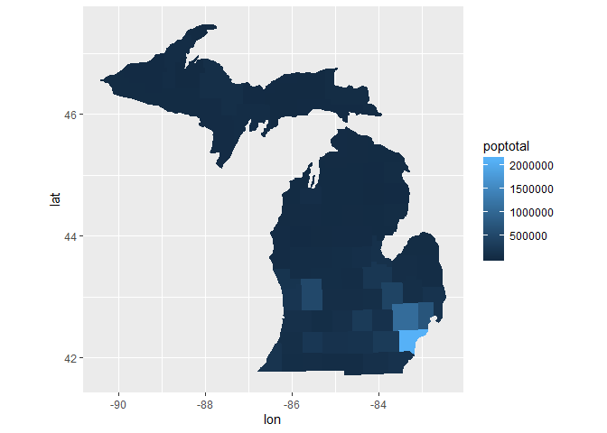<!-- -->

``` r
ggplot(census_counties, aes(lon, lat, group = county)) +
  geom_polygon(aes(fill = percwhite)) +
  coord_quickmap()
```

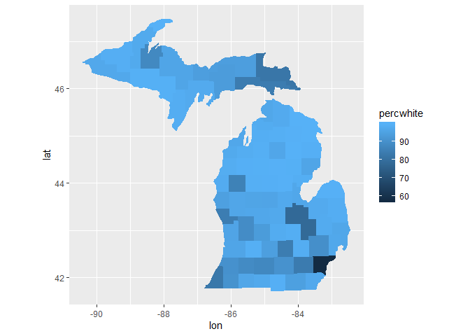<!-- -->

# Revealing Uncertainty

``` r
y <- c(18, 11, 16)
df <- data.frame(x = 1:3, y = y, se = c(1.2, 0.5, 1.0))
base <- ggplot(df, aes(x, y, ymin = y - se, ymax = y + se))
base + geom_crossbar()
```

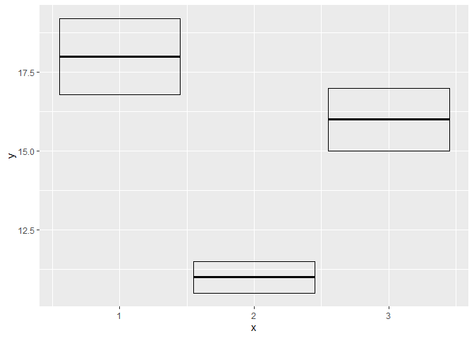<!-- -->

``` r
base + geom_pointrange()
```

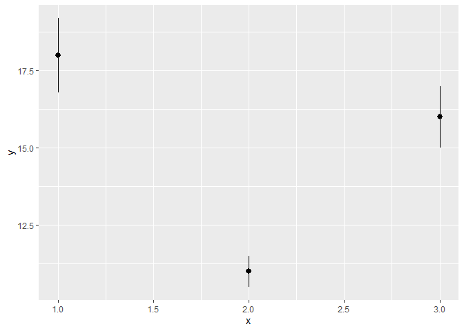<!-- -->

``` r
base + geom_smooth(stat = "identity")
```

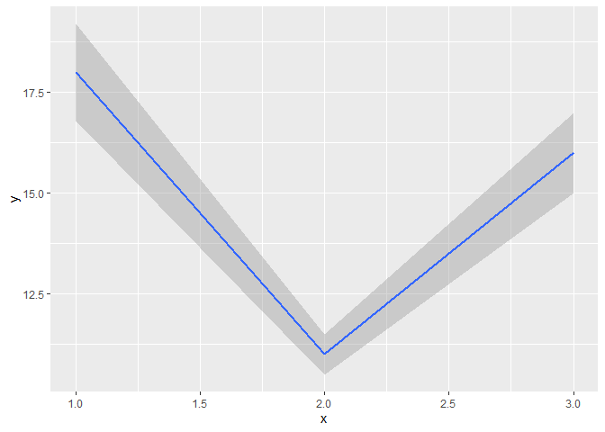<!-- -->

``` r
base + geom_errorbar()
```

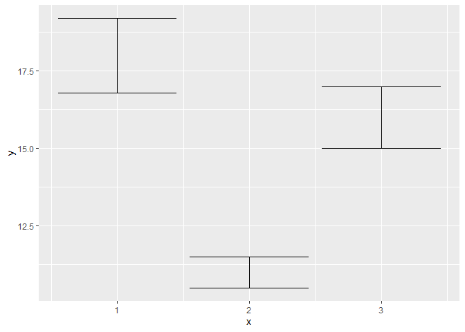<!-- -->

``` r
base + geom_linerange()
```

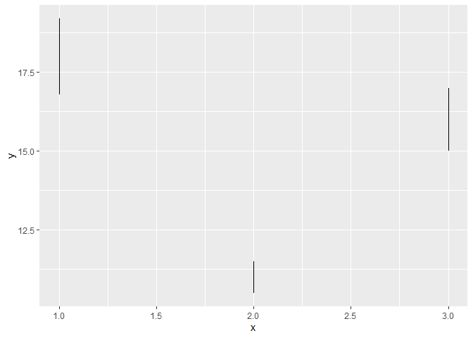<!-- -->

``` r
base + geom_ribbon()
```

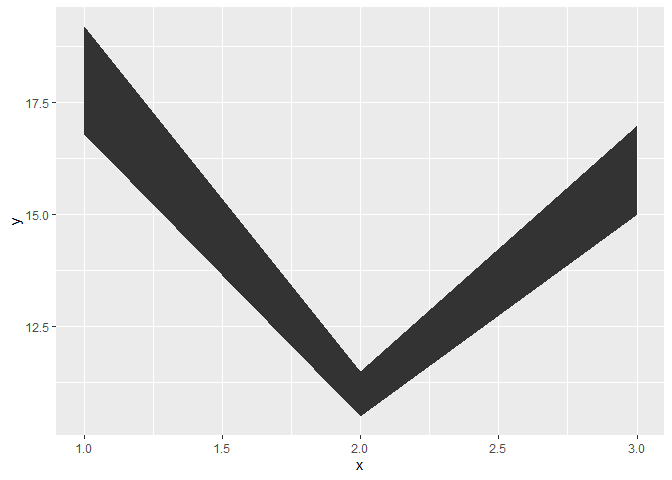<!-- -->

# Weighted Data

When you have aggregated data where each row in the dataset represents
multiple observations, you need some way to take into account the
weighting variable.Weights are supported for every case where it makes
sense: smoothers, quantile regressions, boxplots, histograms, and
density plots.

``` r
# Unweighted
ggplot(midwest, aes(percwhite, percbelowpoverty)) +
  geom_point()
```

<!-- -->

``` r
# Weight by population
ggplot(midwest, aes(percwhite, percbelowpoverty)) +
  geom_point(aes(size = poptotal / 1e6)) +
  scale_size_area("Population\n(millions)", breaks = c(0.5, 1, 2, 4)) # breaks는 poptotal의 분포를 보고 알아서 정하자.
```

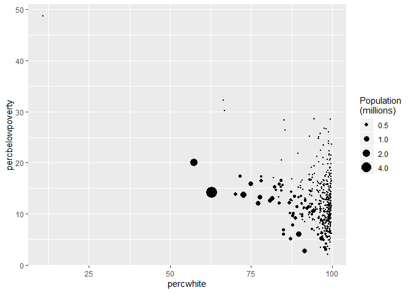<!-- -->

``` r
# Unweighted
ggplot(midwest, aes(percwhite, percbelowpoverty)) +
  geom_point() +
  geom_smooth(method = lm, size = 1)
```

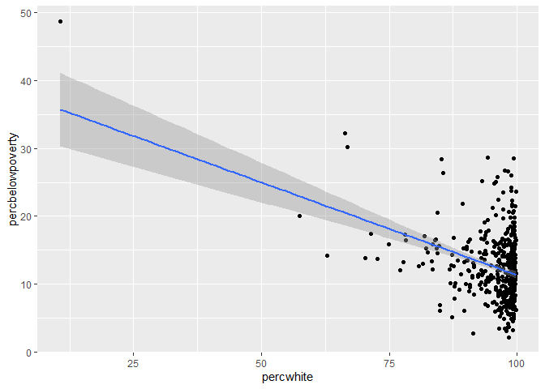<!-- -->

``` r
# Weighted by population
ggplot(midwest, aes(percwhite, percbelowpoverty)) +
  geom_point(aes(size = poptotal / 1e6)) +
  geom_smooth(aes(weight = poptotal), method = lm, size = 1) +
  scale_size_area(guide = "none")
```

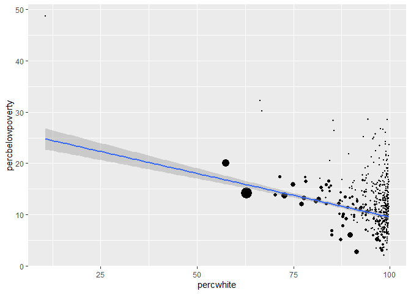<!-- -->

``` r
midwest_model <- lm(percbelowpoverty ~ percwhite, weights =  poptotal, data = midwest)
summary(midwest_model)
```

    ## 
    ## Call:
    ## lm(formula = percbelowpoverty ~ percwhite, data = midwest, weights = poptotal)
    ## 
    ## Weighted Residuals:
    ##     Min      1Q  Median      3Q     Max 
    ## -7300.7  -191.2   282.1   801.8  4754.5 
    ## 
    ## Coefficients:
    ##             Estimate Std. Error t value Pr(>|t|)    
    ## (Intercept) 26.60176    1.18606   22.43   <2e-16 ***
    ## percwhite   -0.17089    0.01376  -12.42   <2e-16 ***
    ## ---
    ## Signif. codes:  0 '***' 0.001 '**' 0.01 '*' 0.05 '.' 0.1 ' ' 1
    ## 
    ## Residual standard error: 1193 on 435 degrees of freedom
    ## Multiple R-squared:  0.2617, Adjusted R-squared:   0.26 
    ## F-statistic: 154.2 on 1 and 435 DF,  p-value: < 2.2e-16

``` r
midwest_model$coefficients #geom_smooth에서 weight는 가중회귀이다.
```

    ## (Intercept)   percwhite 
    ##  26.6017579  -0.1708899

``` r
ggplot(midwest, aes(percbelowpoverty)) +
  geom_histogram(binwidth = 1) +
  ylab("Counties")
```

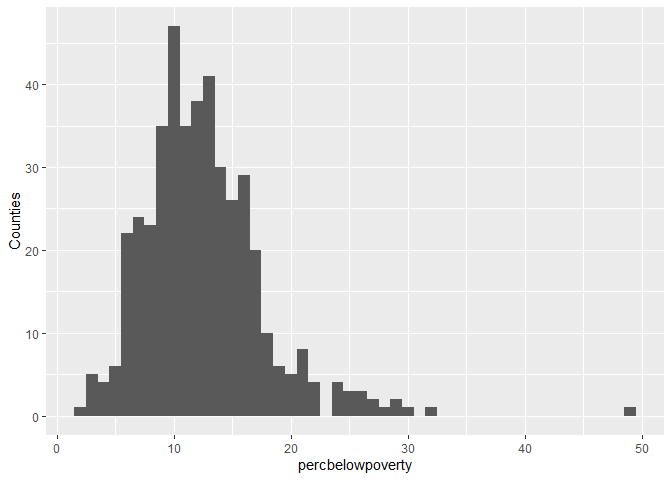<!-- -->

``` r
ggplot(midwest, aes(percbelowpoverty)) +
  geom_histogram(aes(weight = poptotal), binwidth = 1) +
  ylab("Population (1000s)")
```

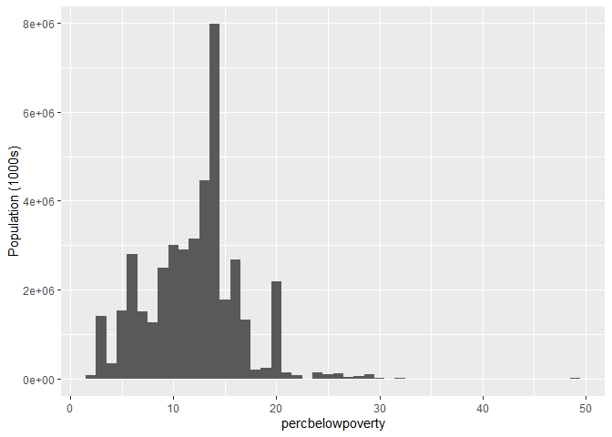<!-- -->

# Displaying Distributions

parameter를 조정하여서 분포를 탐색하자.

``` r
ggplot(diamonds, aes(depth)) +
  geom_histogram() 
```

    ## `stat_bin()` using `bins = 30`. Pick better value with `binwidth`.

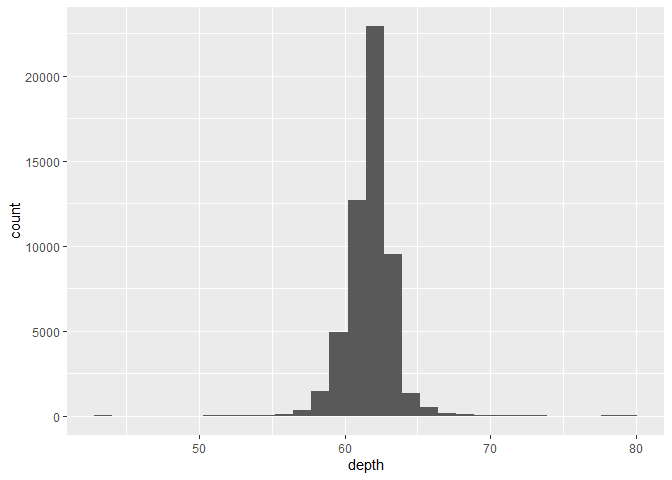<!-- -->

``` r
ggplot(diamonds, aes(depth)) +
  geom_histogram(binwidth = 0.1) +
  xlim(55, 70)
```

    ## Warning: Removed 45 rows containing non-finite values (stat_bin).

    ## Warning: Removed 2 rows containing missing values (geom_bar).

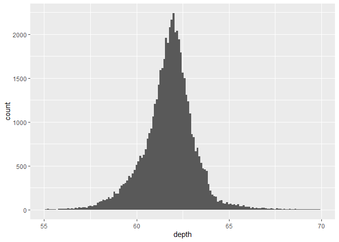<!-- --> The
conditional density plot uses position fill() to stack each bin, scaling
it to the same height. This plot is perceptually challenging because you
need to compare bar heights, not positions, but <u>you can see the
strongest patterns.</u>

``` r
ggplot(diamonds, aes(depth)) +
  geom_freqpoly(aes(colour = cut), binwidth = 0.1, na.rm = TRUE) +
  xlim(58, 68) + # 
  theme(legend.position = "none")
```

<!-- -->

``` r
ggplot(diamonds, aes(depth)) +
  geom_histogram(aes(fill = cut), binwidth = 0.1, position = "fill", na.rm = TRUE) + # conditional density plot, y축은 밀도
  xlim(58, 68) +
  theme(legend.position = "none")
```

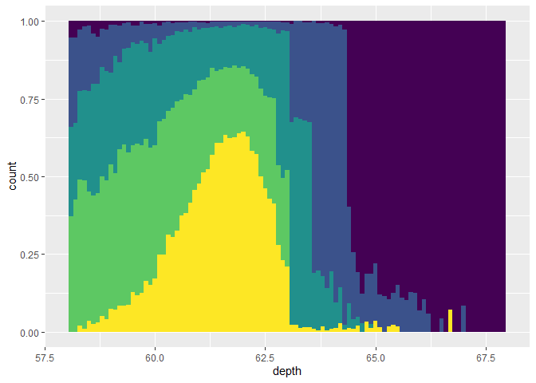<!-- -->

Both the histogram and frequency polygon geom use the same underlying
statistical transformation: stat = “bin”. This statistic produces two
output variables: count and density.

bin-based 시각화의 대안은 밀도추정이다. 기본밀도가 smooth, 연속, 유계하지 않을 때 사용해라. adjust 인자는
밀도의 smooth를 조정한다 각 그룹을 밀도추정하게 되면 각 그룹이 상대적인 크기에 대한 정보는 사라진다는 것에 유의하자.

``` r
ggplot(diamonds, aes(depth)) +
  geom_density(na.rm = TRUE) +
  xlim(58, 68) +
  theme(legend.position = "none")
```

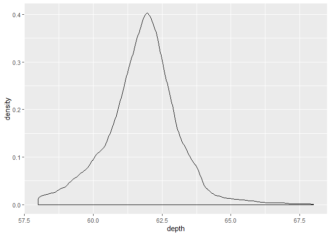<!-- -->

``` r
ggplot(diamonds, aes(depth)) +
  geom_density(na.rm = TRUE, adjust = .4) +
  xlim(58, 68) +
  theme(legend.position = "none")
```

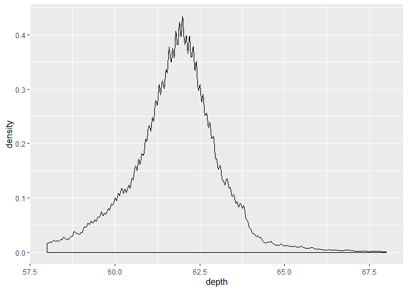<!-- -->

``` r
ggplot(diamonds, aes(depth, fill = cut, colour = cut)) +
  geom_density(alpha = 0.2, na.rm = TRUE) +
  xlim(58, 68) +
  theme(legend.position = "none")
```

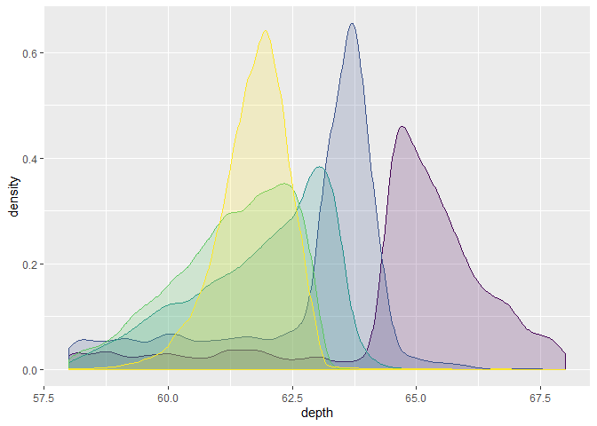<!-- -->

많은 분포들을 비교하기를 원할때는 질을 위하여 양을 희생할 수 있다. 유용한 helper 함수에는 `cut_width()`

``` r
ggplot(diamonds, aes(clarity, depth)) +
geom_boxplot()
```

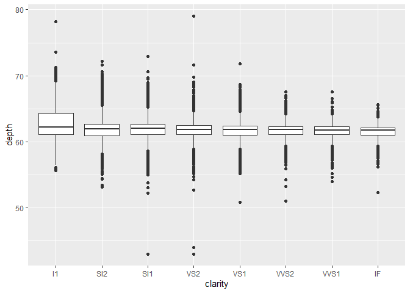<!-- -->

``` r
ggplot(diamonds, aes(carat, depth)) +
geom_boxplot(aes(group = cut_width(carat, 0.1))) + # cut_width는 구간을 나누고 구간마다 레벨을 다르게 준다.
xlim(NA, 2.05)
```

    ## Warning: Removed 997 rows containing missing values (stat_boxplot).

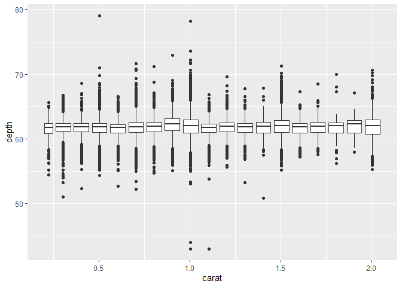<!-- -->

`geom_vilolin()` 밀도 플랏의 압축 버전 `geom_dotplot()` 작은 데이터셋의 유용

## Exercises

1.  What binwidth tells you the most interesting story about the
    distribution of carat?

<!-- end list -->

``` r
ggplot(diamonds, aes(carat)) +
  geom_histogram(binwidth = 0.02)
```

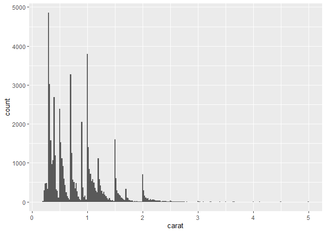<!-- --> 결론 :
histogram을 통해 분포를 확인할 때는 bin을 꼭 적절하게 나눠보는 노력을 하자

2.  How does the distribution of price vary with clarity?

<!-- end list -->

``` r
ggplot(diamonds, aes(price)) +
  geom_density(aes(fill = clarity), alpha = 1/5)
```

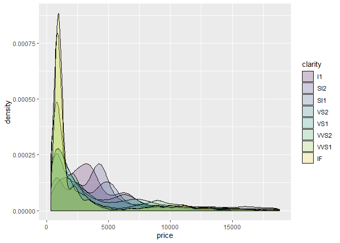<!-- -->
clarity가 좋은 다이아몬드가 오히려 가격이 작아 보인다. 정말로 이런 경향을 띄는지 좀 더 분석해 봐야 알 것 같다.

3.  Overlay a frequency polygon and density plot of depth. What computed
    variable do you need to map to y to make the two plots comparable?
    (You can either modify geom freqpoly() or geom density().)

<!-- end list -->

``` r
ggplot(diamonds) +
  geom_freqpoly(aes(depth, weight = 1/nrow(diamonds)), colour = "red") +
  geom_density(aes(depth), colour = "blue") +
  xlim(54, 70)
```

    ## `stat_bin()` using `bins = 30`. Pick better value with `binwidth`.

    ## Warning: Removed 38 rows containing non-finite values (stat_bin).

    ## Warning: Removed 38 rows containing non-finite values (stat_density).

    ## Warning: Removed 3 rows containing missing values (geom_path).

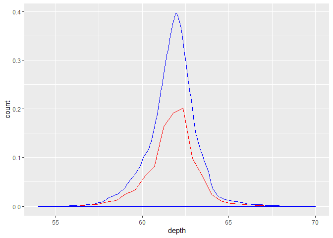<!-- -->

Those are frequency polygons (based on binned counts) & densities from a
kernel density estimator (as from geom\_density).

# Dealing with Overplotting

데이터가 작을 때

``` r
df <- data.frame(x = rnorm(2000), y = rnorm(2000))
norm <- ggplot(df, aes(x, y)) + xlab(NULL) + ylab(NULL)
norm + geom_point()
```

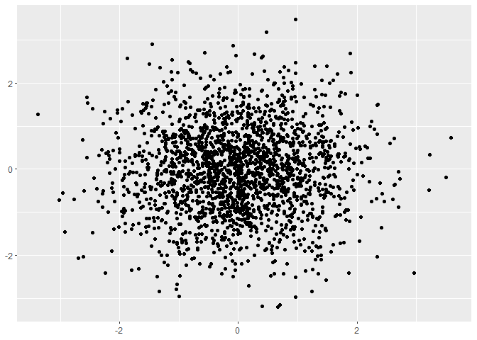<!-- -->

``` r
norm + geom_point(shape = 1) # Hollow circles
```

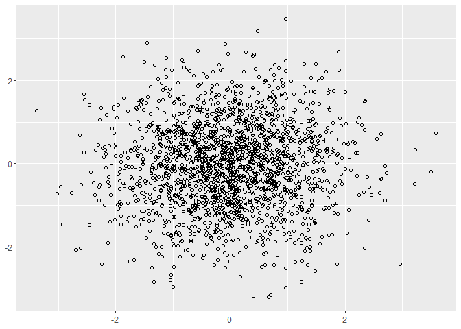<!-- -->

``` r
norm + geom_point(shape = ".") # Pixel sized
```

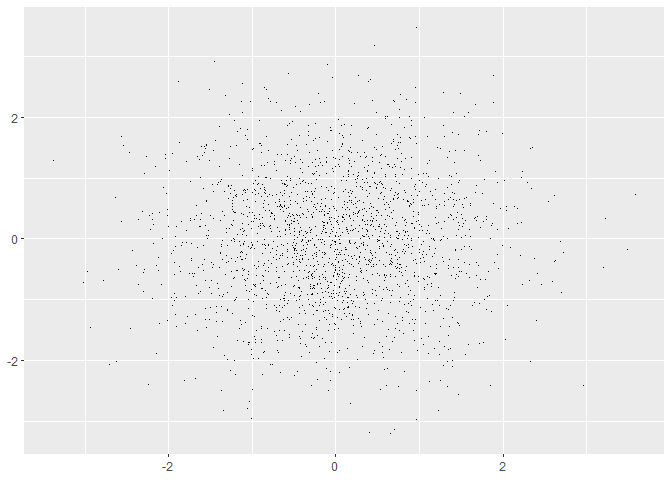<!-- --> 데이터가 클
때

``` r
norm + geom_point(alpha = 1 / 3)
```

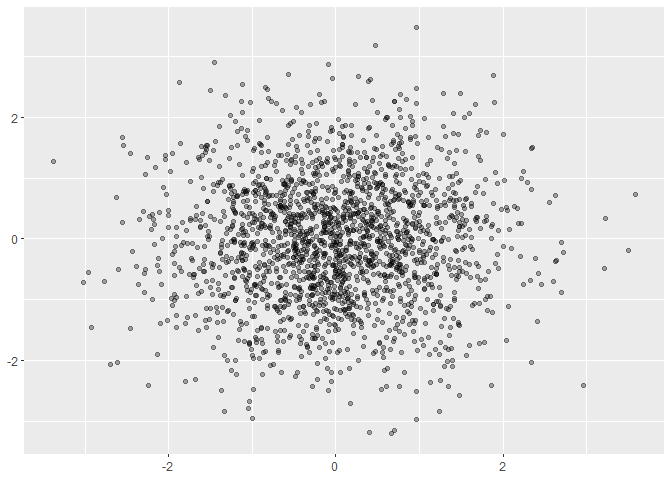<!-- -->

``` r
norm + geom_point(alpha = 1 / 5)
```

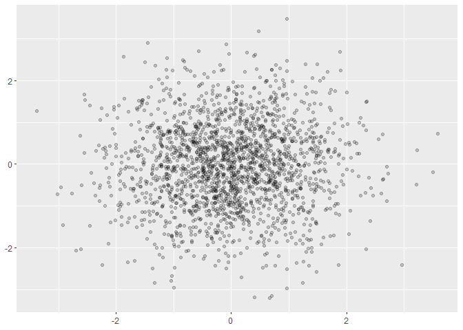<!-- -->

``` r
norm + geom_point(alpha = 1 / 10)
```

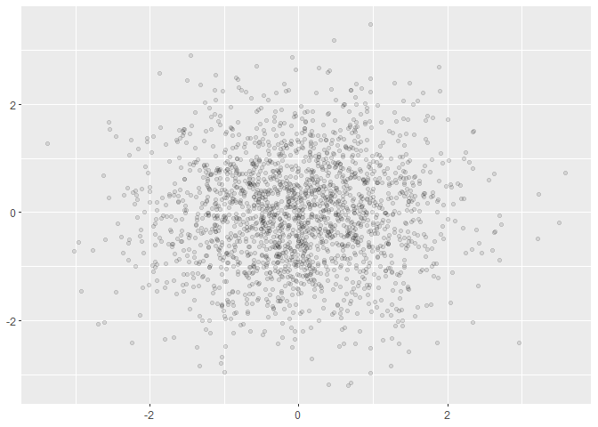<!-- -->

데이터에 약간의 discreteness가 있다면 `geom_jitter()` By default, the amount of
jitter added is 40% of the resolution of the data, which leaves a small
gap between adjacent regions.

``` r
norm + geom_bin2d()
```

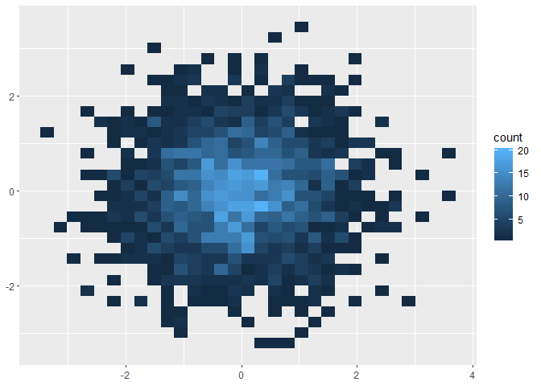<!-- -->

``` r
norm + geom_bin2d(bins = 10) 
```

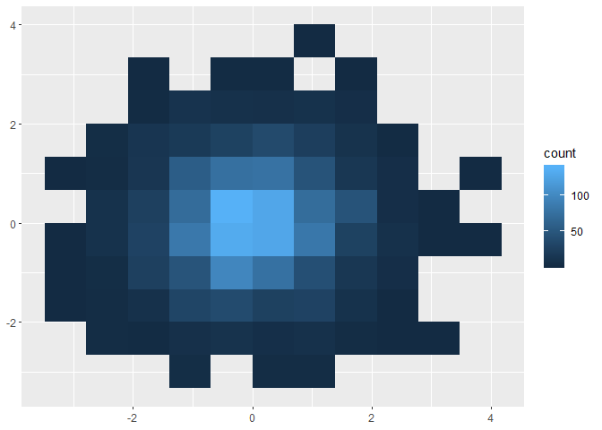<!-- --> bins :
numeric vector giving number of bins in both vertical and horizontal
directions. Set to 30 by default.

육각형이 좀 더 나아보인다.

``` r
#install.packages("hexbin")
norm + geom_hex()
```

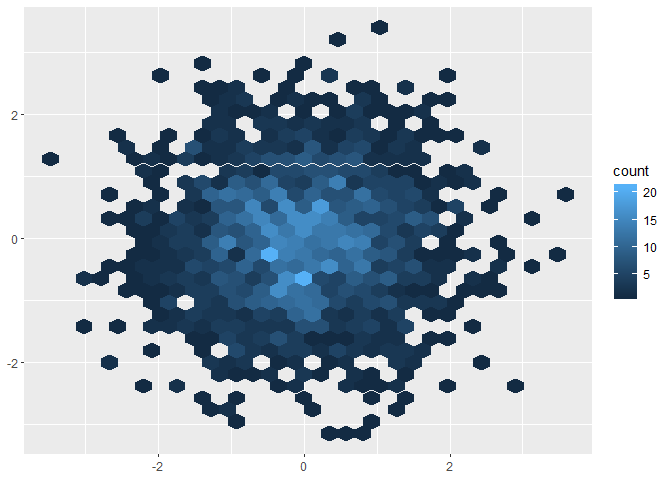<!-- -->

``` r
norm + geom_hex(bins = 10)
```

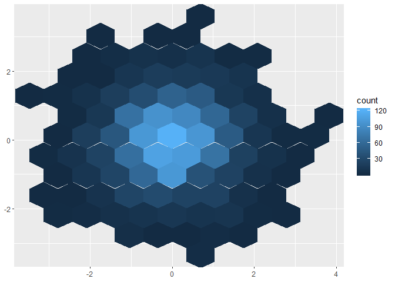<!-- -->

# Statistical Summaries

데이터조작없이 빠르게 그릴 수 있다는 것이 장점이다.

``` r
ggplot(diamonds, aes(color)) +
  geom_bar()
```

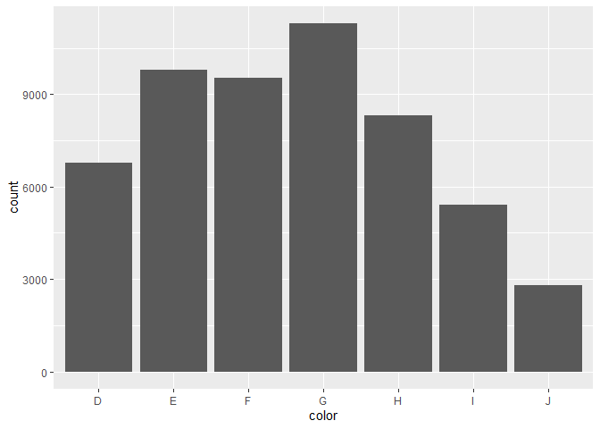<!-- -->

``` r
ggplot(diamonds, aes(color, price)) +
  geom_bar(stat = "summary_bin", fun.y = mean) # 기억해두자
```

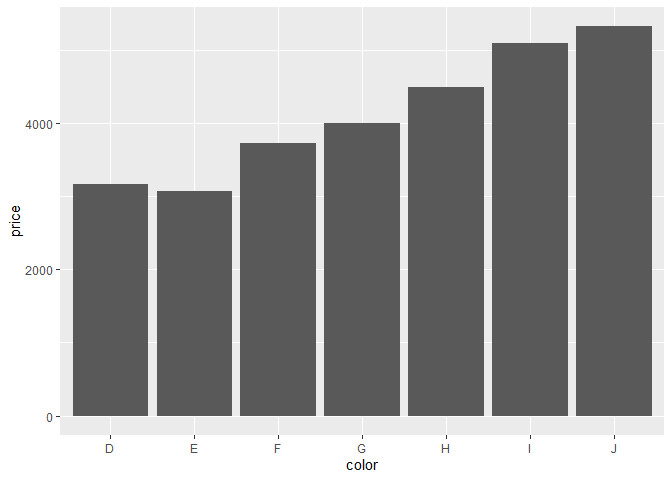<!-- -->

``` r
ggplot(diamonds, aes(table, depth)) +
  geom_bin2d(binwidth = 1, na.rm = TRUE) +
  xlim(50, 70) +
  ylim(50, 70)
```

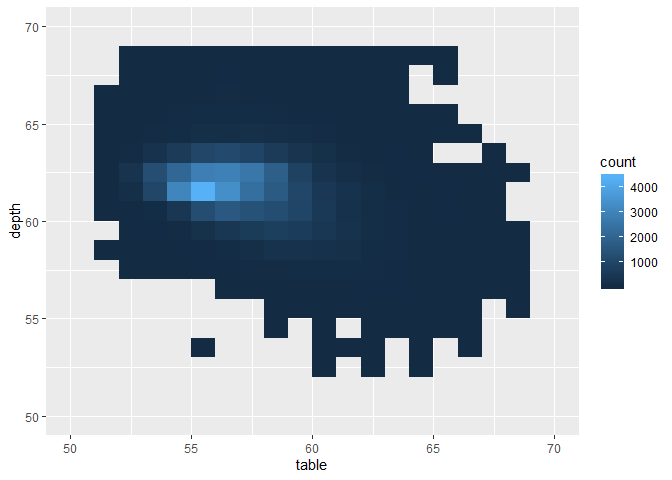<!-- -->

``` r
ggplot(diamonds, aes(table, depth, z = price)) +
  geom_raster(binwidth = 1, stat = "summary_2d", fun = mean,
  na.rm = TRUE) +
  xlim(50, 70) +
  ylim(50, 70)
```

    ## Warning in f(...): Raster pixels are placed at uneven horizontal intervals
    ## and will be shifted. Consider using geom_tile() instead.

    ## Warning in f(...): Raster pixels are placed at uneven vertical intervals
    ## and will be shifted. Consider using geom_tile() instead.

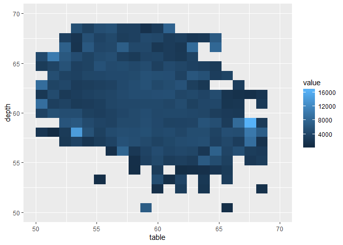<!-- -->

``` r
ggplot(diamonds, aes(table, depth, z = price)) +
  geom_hex(binwidth = 1, stat = "summary_hex", fun = mean,
  na.rm = TRUE) +
  xlim(50, 70) +
  ylim(50, 70)
```

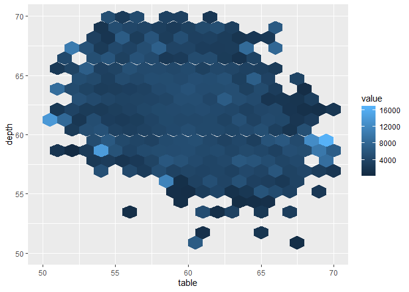<!-- -->

# Summary

  - geom\_text대신 `ggrepel::geom_text_repel()`을 사용해보자. 다른 geom과 마찬가지로
    aes(color, size, label)등 사용가능하다. `ggrepel::geom_label_repel()` 도 있다.
  - 플랏에 메타데이터를 활용해보자
  - 플랏에 회귀선을 넣으면 좀 더 좋을 수 있다.
  - group 인자를 적절하게 사용하자
  - x가 연속형 변수일 때 `cut_width()` 를 사용하여 boxplot을 그릴 수 있다.
  - stat = "", fun = 를 적절히 사용하자
