ggplot2 Elegant Graphics for Data Analysis
================
true
2018년 2월

<style>
mystyle{
    font-family :  Georgia;
    font-size : 26px;
    color : PaleVioletRed  ;
}
</style>

# Chapter 4

> <mystyle> Mastering the Grammar </mystyle>

아래와 같은 산점도를 그릴 때의 과정은 다음과 같다.

``` r
ggplot(mpg, aes(displ, hwy, colour = factor(cyl))) +
  geom_point()
```

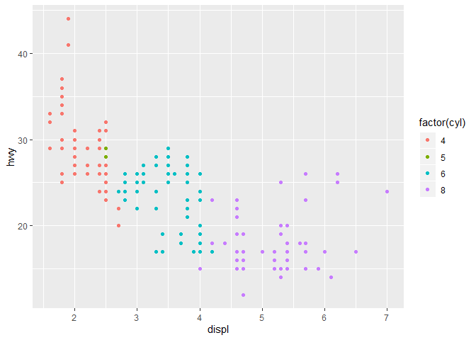<!-- -->

## Mapping Aesthetics to Data

  - 수평, 수직위치뿐만 아니라 각각의 점은 size, colour and shape 도 가진다. 이러한 속성을
    **aesthetics**

  - points, lines and bars는 모두 기하 객체(geom)의 예시이다. Geoms는 플랏의 유형을 결정한다.

데이터를 플로팅 하기 위해 데이터의 각 레코드를 갖고 그래픽 요소에 매핑할 필요가 있다. 이를 **미적 요소
매핑(aesthetic mapping)**이라고 표현하며, aes함수가 이 역할을 한다. ’aes(x = displ, y
= hwy)’코드가 의미하는 바는 x축에 displ컬럼을 미챙시키고, y축에 hwy컬럼을 매칭시키라는 것이다. 미적 요소 매핑은
데이터의 각 속성을 그래프 속성에 매핑을 시킨다. scatter plot의 경우 좌표계 속성에 필요한 x,y, 그리고 점의
모양, 점의 크기, 점의 색깔 등이 그에 해당한다. 이를 위해 ggplot2 내부에서는 다음과 같이 데이터를 변환시킨다.

``` r
kable(df)
```

<table>

<thead>

<tr>

<th style="text-align:right;">

x

</th>

<th style="text-align:right;">

y

</th>

<th style="text-align:right;">

colour

</th>

</tr>

</thead>

<tbody>

<tr>

<td style="text-align:right;">

1.8

</td>

<td style="text-align:right;">

29

</td>

<td style="text-align:right;">

4

</td>

</tr>

<tr>

<td style="text-align:right;">

1.8

</td>

<td style="text-align:right;">

29

</td>

<td style="text-align:right;">

4

</td>

</tr>

<tr>

<td style="text-align:right;">

2.0

</td>

<td style="text-align:right;">

31

</td>

<td style="text-align:right;">

4

</td>

</tr>

<tr>

<td style="text-align:right;">

2.0

</td>

<td style="text-align:right;">

30

</td>

<td style="text-align:right;">

4

</td>

</tr>

<tr>

<td style="text-align:right;">

2.8

</td>

<td style="text-align:right;">

26

</td>

<td style="text-align:right;">

6

</td>

</tr>

<tr>

<td style="text-align:right;">

2.8

</td>

<td style="text-align:right;">

26

</td>

<td style="text-align:right;">

6

</td>

</tr>

<tr>

<td style="text-align:right;">

3.1

</td>

<td style="text-align:right;">

27

</td>

<td style="text-align:right;">

6

</td>

</tr>

<tr>

<td style="text-align:right;">

1.8

</td>

<td style="text-align:right;">

26

</td>

<td style="text-align:right;">

4

</td>

</tr>

</tbody>

</table>

점의 크기나 모양은 매핑 속성에 없으므로 매팽되지 않았으나, 모두 같은 기본 값으로 암묵적으로 생성된다. 모양의 기본값은 속이
꽉찬 점, 점의 크기는 1이 기본 값이다. 미적 요소 매핑은 어느 데이터가 어떤 곳에 쓰일지를 명시하는 작업이라고 생각하면
된다.

## Scaling

미적 매핑을 한 후에 진행되는 작업은 매핑된 데이터를 갖고 컴퓨터가 볼 수 있는 데이터로 변환시키는 것이다. 컴퓨터가 이해할 수
있는 이미지 포맷으로 변환하는 작업이 바로 ggplot2의 **scaling**작업이다.

x, y축 데이터는 이미지를 출력하는 대상에 맞게 변수 변환이 이뤄진다. ggplot2에서는 사용하는 시스템은 **grid**이기
때문에 \[0, 1\] 사이의 값으로 스케일링 된다(즉, 정확한 픽셀 대신에 사용). 마지막 단계는 x와 y가 플랏에 최종 위치를
어떻게 형성하는 가를 결정하는 것이다. 이 작업은 좌표계 즉, **coord**에 의해 이뤄진다. 대부분은 데카르트
좌표계(Cartesian coordinate)지만 극좌표(polar coordinate)나 지도에 이용되는 구면
투영(spherical projection)일 수도 있다.

그리고 colour값은 자동으로 사람의 눈으로 구분하기 쉬운 색상으로 매핑된다. 사람이 구분하기 쉬운 색상을 사용하기 위한 작업도
이뤄지는데 컬러휠(color wheel)을 구분하고 싶은 레벨 개수로 색상과 명암 기준으로 일정하게 분할해 색상을 매칭시킨다.

이러한 변환들의 결과는 다음과 같다. 

마지막으로, 이 데이터를 스크린에 나타나는 그래픽 객체를 만들기위해 랜더링(rendering)시켜야 한다. 완전한 플랏을 그리기
위해 *data*, *scales and coordinate system* 그리고 *plot annotation*을
조합시킨다.

## Adding Complexity

``` r
ggplot(mpg, aes(displ, hwy)) +
  geom_point() +
  geom_smooth() +
  facet_wrap(~year)
```

    ## `geom_smooth()` using method = 'loess' and formula 'y ~ x'

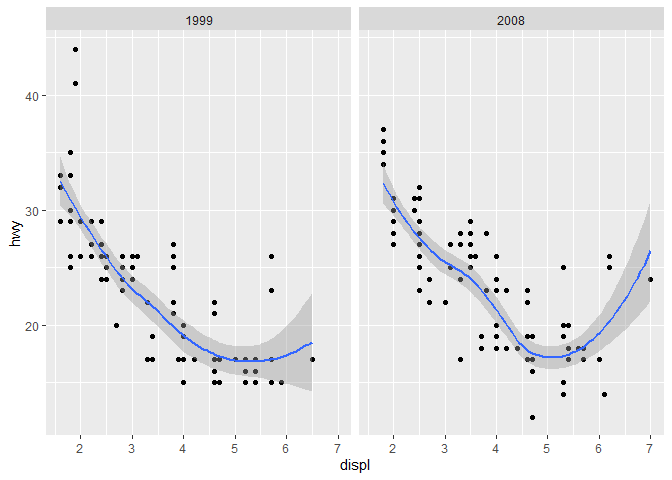<!-- --> 각
레이어의 각각의 facet 패널은 자신의 데이터셋을 가지고 있다. smooth 레이어는 point 레이어와는 다르다.
raw data를 보여주지 않는 대신에 데이터의 통계적 변환을 보여준다. 데이터를 미적요소에 매핑한 후, 데이터는 통계적
변환(*stat*)에 전달된다. scaling은 세 부분에서 일어난다.: transforming, training and
mapping.

  - <span style="background : yellow">Scale transformation은 통계변환 이전에
    일어난다. 따라서 통계량은 scale-transformed 데이터에서 계산되어 진다.</span> 이것은
    log(x) vs. log(y) on linear scales의 플랏이 x vs. y on log scales 처럼 보이게
    한다. @Sect. 6.6.1을 참고하자.

  - 통계량이 계산된 후에, 각 scale은 모든 레이어와 facet으로 부터 모든 데이터셋에 훈련되어 진다. 훈련작업은 개별
    데이터셋의 범위를 조합시켜서 완성된 데이터의 범위를 가져온다. 이 단계가 없다면, sclaes은 단지 극소적으로
    이해하고 다른 layer들을 overlay할 수 없다. 때때로 facet마다 position을 다르게 하기를
    원할 수 있다.(sect 7.2.3참고)

  - 마지막으로 스케일은 데이터 값을 미적요소 값에 매핑시킨다.

## Components of the Layered Grammar

the data, mapping, stat, geom and position adjustment가 레이어를 형성한다.


### Layers

레이어는 5가지의 부분으로 구성된다.

1.  Data
2.  Aesthetic mappings
3.  A statistical transformation (stat)
4.  A geometric object(geom)
5.  A position adjustment

### Scales

스케일은 데이터로부터 미적요소매핑으로의 매핑을 컨트롤 한다. 각 스케일은 플랏의 모든 데이터를 조작하고 일관성 있는 매핑을
보장한다. 스케일은 함수이다. 예를 들어, 색 그래디언트는 선분에 매핑한다. 함수의 모수는 path가 선형인지
곡선인지 정의한다. 역함수는 guide(축과 범례)를 그릴 때 이용된다. 대부분의 매핑은 unique
inverse(one-to-one 함수)를 가진다. unique inverse는 원본 데이터를 복원함을 가능하게 해주지만
single aspect에 초점을 맞추는것을 원할때는 바람직 하지 않다.

### Coordinate System

좌표계는 모든 position 변수들에 동시에 영향을 준다. 좌표계가 기하객체의 모습을 변화시킨다는 점에 있어서는 스케일과
다르다. <span style = "background : yellow">스케일은 통계변환 전에 일어나지만 좌표변환은
통계변환 후에 일어난다. \<\> 좌표계는 축과 격자선(grid line)이 그려지는 방법을 통제한다.


### Facetting

Chap. 7을 참고하자

# Chapter 5

> <mystyle> Build a Plot Layer by Layer </mystyle>

  - mapping : A set of aesthetic mappings
  - data : A dataset which overrides the default plot dataset.
  - geom : The name of the geometric object to use to draw each
    observation. 모든 기하객체는 aes 매개변수를 가지고 있다.
  - stat : The name of statistical transformation to use. 통계적 변환은 유용한
    통계적 요약을 수행한다.
  - position : The method used to adjust overlapping objects, like
    jittering, stacking or dodging

## Data

data는 tidy 데이터프레임 형태여야 한다.

``` r
mod <- loess(hwy ~ displ, data = mpg)
grid <- data_frame(displ = seq(min(mpg$displ), max(mpg$displ), length = 50))
```

    ## Warning: `data_frame()` is deprecated, use `tibble()`.
    ## This warning is displayed once per session.

``` r
grid$hwy <- predict(mod, newdata = grid)
grid
```

    ## # A tibble: 50 x 2
    ##    displ   hwy
    ##    <dbl> <dbl>
    ##  1  1.6   33.1
    ##  2  1.71  32.2
    ##  3  1.82  31.3
    ##  4  1.93  30.4
    ##  5  2.04  29.6
    ##  6  2.15  28.8
    ##  7  2.26  28.1
    ##  8  2.37  27.4
    ##  9  2.48  26.7
    ## 10  2.59  26.1
    ## # ... with 40 more rows

``` r
#아래 코딩은 기억해놓자.
std_resid <- resid(mod) / mod$s # 표준화 잔차 : 잔차/sqrt(mse)
outlier <- filter(mpg, abs(std_resid) > 2) 
outlier
```

    ## # A tibble: 6 x 11
    ##   manufacturer model  displ  year   cyl trans drv     cty   hwy fl    class
    ##   <chr>        <chr>  <dbl> <int> <int> <chr> <chr> <int> <int> <chr> <chr>
    ## 1 chevrolet    corve~   5.7  1999     8 manu~ r        16    26 p     2sea~
    ## 2 pontiac      grand~   3.8  2008     6 auto~ f        18    28 r     mids~
    ## 3 pontiac      grand~   5.3  2008     8 auto~ f        16    25 p     mids~
    ## 4 volkswagen   jetta    1.9  1999     4 manu~ f        33    44 d     comp~
    ## 5 volkswagen   new b~   1.9  1999     4 manu~ f        35    44 d     subc~
    ## 6 volkswagen   new b~   1.9  1999     4 auto~ f        29    41 d     subc~

``` r
ggplot(mpg, aes(displ, hwy)) +
  geom_point() +
  geom_line(data = grid, colour = "blue", size = 1.5) +
  geom_text(data = outlier, aes(label = model))
```

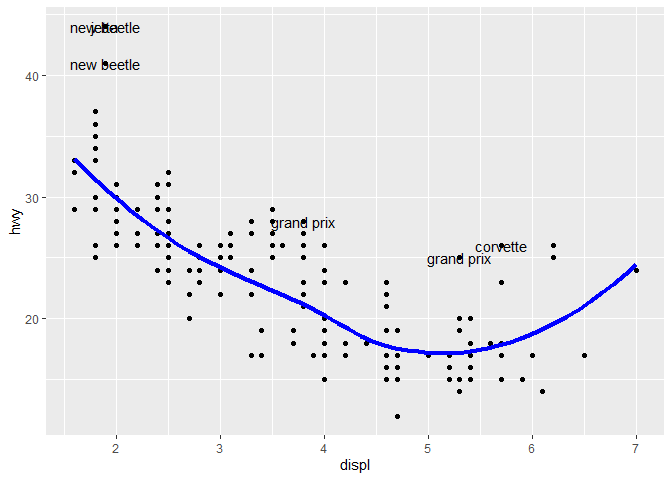<!-- -->

### Exercises

1.  생략

2.  The following code uses dplyr to generate some summary statistics
    about each class of car (you’ll learn how it works in Chap. 10).

<!-- end list -->

``` r
class <- mpg %>%
  group_by(class) %>%
  summarise(n = n(), hwy = mean(hwy))
```

답

``` r
ggplot(mpg, aes(class, hwy)) +
  geom_jitter(height = 0, width = 0.15) +
  geom_point(data = class, colour = "red", size = 4) +
  geom_text(data = class, aes(y = 10, label = paste("n =", n))) # y축 값을 덧씌운다.
```

aes(y= 10)을 하면 y = hwy가 y = 10으로 바뀌겠지? 이때 10의 수는 y의 길이 만큼 있겠지? 따라서 이와 같은
플랏이 출력된다.

## Aesthetic Mappings

### Setting vs. Mapping

We map an aesthetic to a variable(e.g., aes(colour = cut)) or set it to
a constant(e.g., colour = “red”)

``` r
ggplot(mpg, aes(cty, hwy)) +
  geom_point(colour = "darkblue")
```

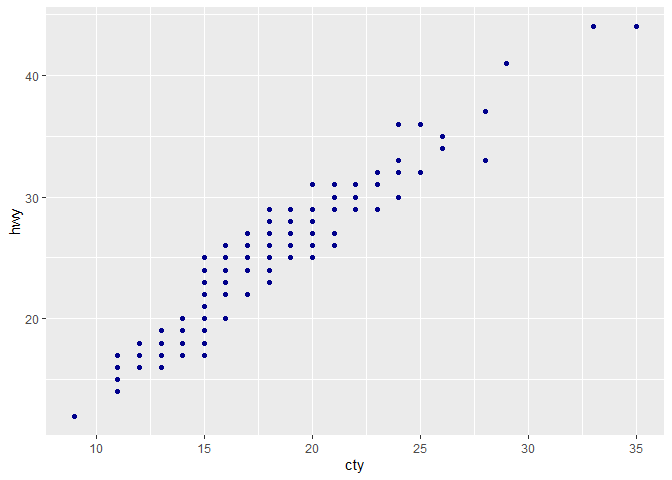<!-- -->

``` r
ggplot(mpg, aes(cty, hwy)) +
  geom_point(aes(colour = "darkblue"))
```

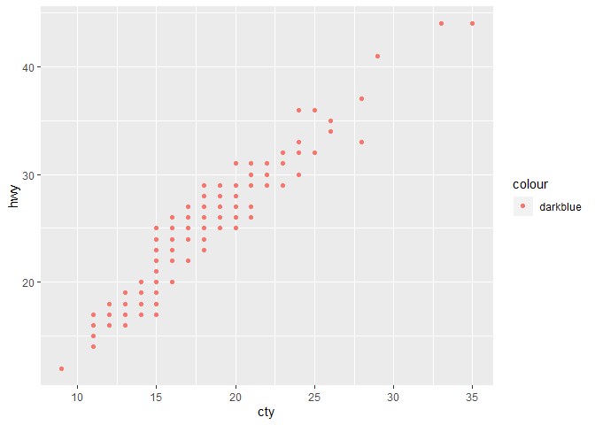<!-- -->

A third approach is to map the value, but
<span style="background : yellow">override the default scale:</span>

``` r
ggplot(mpg, aes(cty, hwy)) +
  geom_point(aes(colour = "darkblue")) +
  scale_colour_identity()
```

<!-- --> 이미
색상들을 포함하는 열을 항상 가진다면 매우 유용하다.

때때로 상수에 미적요소를 매핑할 때 유용하다.

``` r
ggplot(mpg, aes(displ, hwy)) +
  geom_point() +
  geom_smooth(aes(colour = "loess"), method = "loess", se = FALSE) +
  geom_smooth(aes(colour = "lm"), method = "lm", se = FALSE) +
  labs(colour = "Method")
```

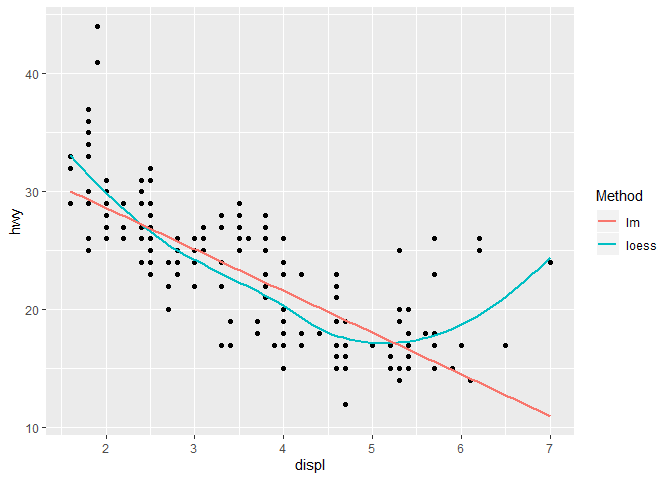<!-- -->

Geoms

• By giving geom tile() the location (x and y) and dimensions (width and
height). • By giving geom rect() top (ymax), bottom (ymin), left (xmin)
and right (xmax) positions. • By giving geom polygon() a four row data
frame with the x and y positions of each corner.

Stats

A statistical transformation, or stat, transforms the data, typically by
summarising it in some manner.

## Generated Variables

To refer to a generated variable like density, “..” must surround the
name. This prevents confusion in case the original dataset includes a
variable with the same name as a generated variable, and it makes it
clear to any later reader of the code that this variable was generated
by a stat

``` r
g1 <- ggplot(diamonds, aes(price)) +
  geom_histogram(binwidth = 500)
g2 <- ggplot(diamonds, aes(price)) +
  geom_histogram(aes(y = ..density..), binwidth = 500)
grid.arrange(g1, g2, ncol = 2)
```

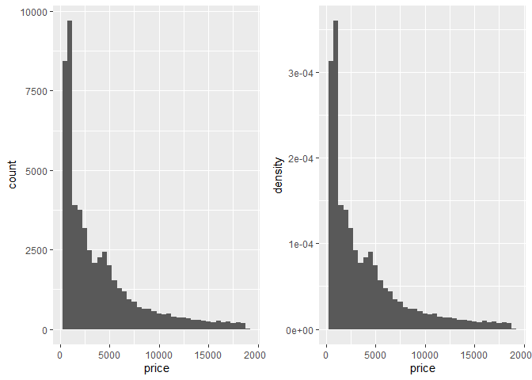<!-- --> 이
기술은 다른 크기의 다수의 그룹의 분포를 비교할 때 유용하다.

``` r
g1 <- ggplot(diamonds, aes(price, colour = cut)) +
  geom_freqpoly(binwidth = 500) +
  theme(legend.position = "none")
g2 <- ggplot(diamonds, aes(price, colour = cut)) +
  geom_freqpoly(aes(y = ..density..), binwidth = 500) +
  theme(legend.position = "none")
grid.arrange(g1, g2, ncol = 2)
```

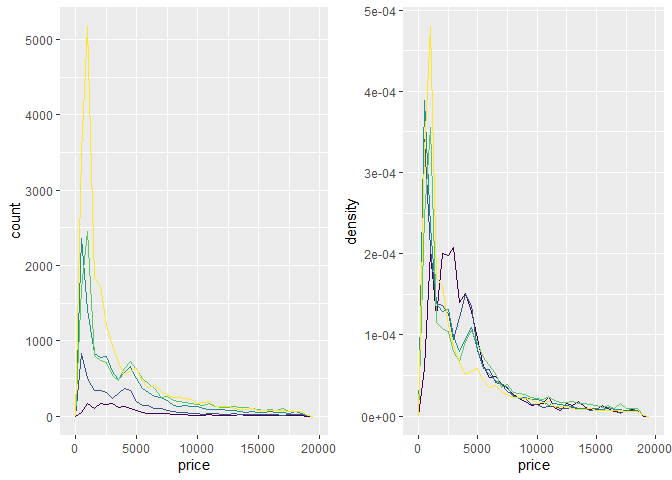<!-- -->
저품질의 다이아가 더 비싼 것처럼 보인다. 하지만 11장을 참고하라.

### Exercises

2.  
<!-- end list -->

  - ecdf

<!-- end list -->

``` r
ggplot(mpg, aes(displ))+
  stat_ecdf() 
```

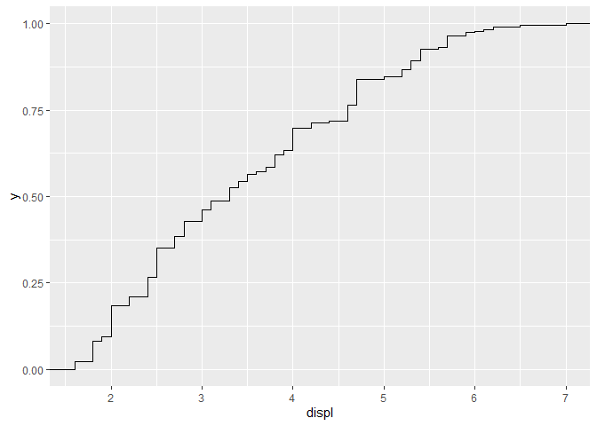<!-- -->

``` r
# geom_step(stat = "ecdf")
```

  - qqplot

<!-- end list -->

``` r
ggplot(mpg, aes(sample = displ))+
  stat_qq()
```

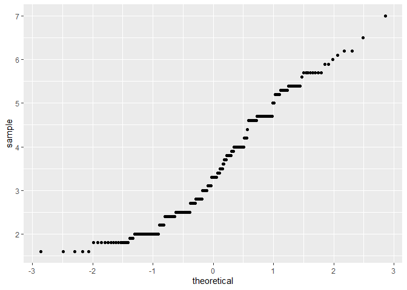<!-- -->

``` r
#geom_point(stat = "qq")
#geom_qq()
```

  - 정규분포를 겹쳐
그리기

<!-- end list -->

``` r
data_norm <- data.frame(displ_norm = rnorm(nrow(mpg), mean = mean(mpg$displ), sd = sd(mpg$displ)))
ggplot(data = mpg,aes(displ)) +
  geom_density(aes(colour = "data"), show.legend = FALSE) +
  stat_function(fun = dnorm, args = list(mean = mean(mpg$displ), sd = sd(mpg$displ)), aes(colour = "normal")) +
  guides(colour = guide_legend(title = "Dist"))
```

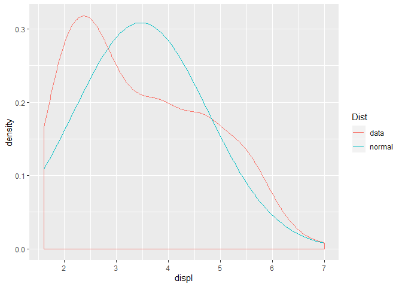<!-- -->

3.  Read the help for `stat_sum()` then use `geom_count()` to create a
    plot that shows the proportion of cars that have each combination of
    drv and trans.

답 : 아래 코드 기억하자\!

``` r
ggplot(mpg, aes(drv, trans)) +
  geom_count(aes(size = ..prop.., group = 1)) +
  scale_size_area()
```

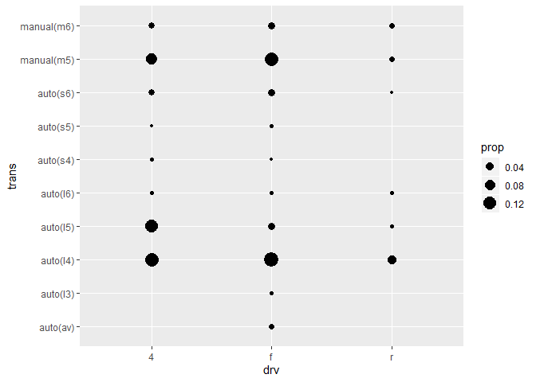<!-- -->

## Position Adjustments

• position stack(): stack overlapping bars (or areas) on top of each
other. • position fill(): stack overlapping bars, scaling so the top is
always at 1. • position dodge(): place overlapping bars (or boxplots)
side-by-side.

``` r
dplot <- ggplot(diamonds, aes(color, fill = cut)) +
  xlab(NULL) + ylab(NULL) + theme(legend.position = "none")
# position stack is the default for bars, so geom_bar()
# is equivalent to geom_bar(position = "stack")
a <- dplot + geom_bar()
b <- dplot + geom_bar(position = "fill")
c <- dplot + geom_bar(position = "dodge")
grid.arrange(a,b,c, ncol = 3)
```

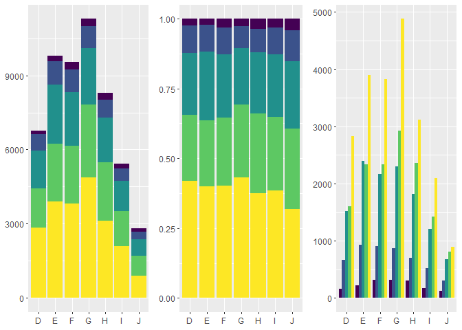<!-- -->

``` r
dplot + geom_bar(position = "identity", alpha = 1 / 2, colour = "grey50") 
```

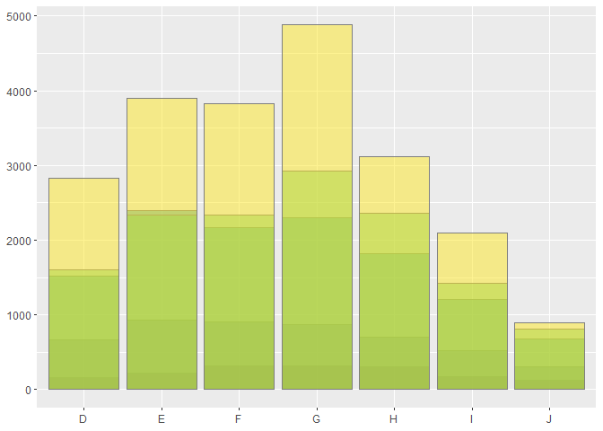<!-- -->
identity position adjustment는 막대에 유용하지 않다.

points에 주로 유용한 three position adjustments가 있다. 이산형 데이터에서 매우 유용하다.

  - position\_nudge() : move points by a fixed offset.
  - position\_jitter() : add a little random noise to every position
  - position\_jitterdodge() : dodge points within groups, then add a
    little random noise

### Exercises

1.  When might you use position nudge()? Read the documentation.

답 position\_nudge is generally useful for adjusting the position of
items on discrete scales by a small amount. Nudging is built in to
geom\_text() because it’s so useful for moving labels a small distance
from what they’re labelling.

``` r
df <- data.frame(
  x = c(1,3,2,5),
  y = c("a","c","d","c")
)

ggplot(df, aes(x, y)) +
  geom_point() +
  geom_text(aes(label = y))
```

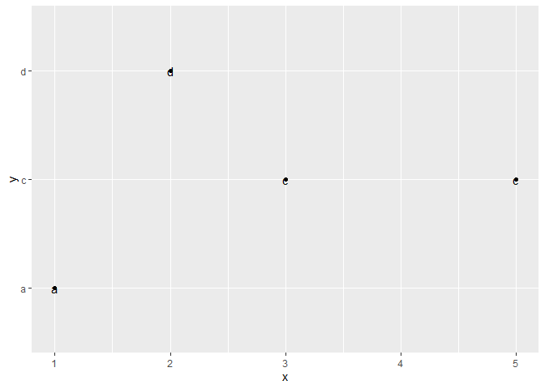<!-- -->

``` r
ggplot(df, aes(x, y)) +
  geom_point() +
  geom_text(aes(label = y), position = position_nudge(y = -0.1))
```

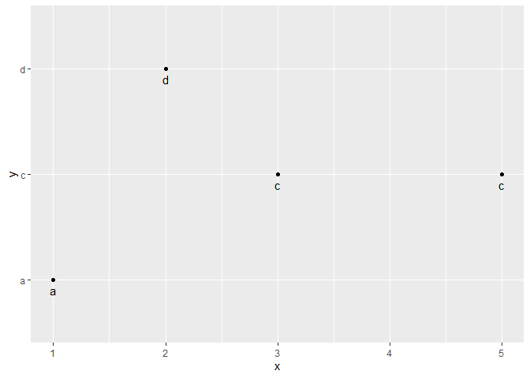<!-- -->

``` r
#geom_text(aes(label = y, nudge_y = -0.1))
```

2.  Why might you use geom jitter() instead of geom\_count()? What are
    the advantages and disadvantages of each technique?

`geom_count` : useful for small datasets with at least one discrete
position. 점들의 위치가 완전히 겹칠 때 사용

`geom_jitter` : useful when you have discrete data and overplotting

4.  When might you use a stacked area plot? What are the advantages and
    disadvantages compared to a line plot?

cf. <https://www.fusioncharts.com/blog/line-charts-vs-area-charts/>

  - 예를 들어 월별 수입과 지출에 관한 그래프라면 area plot을 사용하면 영역의 차이로부터 수익도 알 수 있다.
  - 여러개의 데이터 셋을 보여줄 때 선들이 겹친다면 line plot이용
  - stacked area plot을 이용하면 (지역별 월별 판매량의 누적 영역 그래프일때) 지역들의 총 판매량 뿐만 아니라
    각 지역의 판매량도 알 수 있다. 하지만 각 지역의 판매량은 패턴 때문에 해석이 어렵다. 반면에, line plot은
    월별 경향을 파악하는데 좀 더 유용하다. 하지만 총 판매량은 직접 그려야 하고 종종 총 판매량을 개별 판매량으로
    착각한다. 이를 해결하기 위해 개별 지역의 line plot을 반투명하게 둔다.

<!-- end list -->

``` r
ggplot(series, aes(time, value)) +
  geom_area(aes(fill = type)) +
  geom_line(aes(group = type)) + #윤곽선 추가
  scale_fill_discrete(breaks = c("a","b","c","d")) #범례 순서 변경
```

# Summary

## ch4

  - scale변환은 통계변환 이전에 일어나므로 통계량은 scale-transformed 데이터에서 계산되어 진다. 좌표변환은
    통계변환 후에 일어난다.

## ch5

  - `geom_freqpoly`와 `..density..`의 사용, `..prop..`와 `grop = 1`의 사용
  - `stat_function(fun = dnorm, args = list(mean = mean(), se = sd()))`
  - position = “fill”, “dodge”, “identity”, “nudge”, “jitter”
  - `geom_count()` 와 `geom_jitter()`의 차이
  - area plot과 line plot의 차이
