ggplot2 Elegant Graphics for Data Analysis
================
true
2018년 2월

<style>
mystyle{
    font-family :  Georgia;
    font-size : 26px;
    color : PaleVioletRed  ;
}
</style>

> <mystyle> Chapter 6 </mystyle>  
> <mystyle> Scales, Axes and Legends </mystyle>

# Modifying Scales

`ggplot(mpg, aes(displ, hwy)) + geom_point(aes(colour = class))` 이 코드가
사실은 `ggplot(mpg, aes(displ, hwy)) + geom_point(aes(colour = class))
+ scale_x_continuous() + scale_y_continuous() + scale_colour_discrete()`

``` r
ggplot(mpg, aes(displ, hwy)) +
  geom_point(aes(colour = class)) +
  scale_x_sqrt() +
  scale_colour_brewer()
```

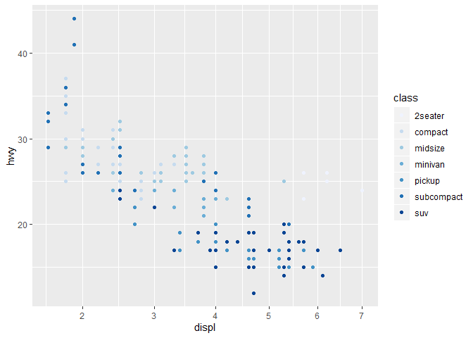<!-- -->

1.  scale
2.  The name of the aesthetic(e.g., colour, shape or x)
3.  The name of the scale(e.g., continuous, discrete, brewer)

# Guides : Legends and Axes


## Scale Title

scale함수의 첫번째 인자는 named이다. 문자열()이나 수식을 quote()로 사용가능

``` r
df <- data.frame(x = 1:2, y = 1, z = "a")
p <- ggplot(df, aes(x, y)) + geom_point()
p + scale_x_continuous(quote(a + mathematical ^ expression))
```

<!-- -->

``` r
p <- ggplot(df, aes(x, y)) + geom_point(aes(colour = z))
p +
  xlab("X axis") +
  ylab("Y axis")
```

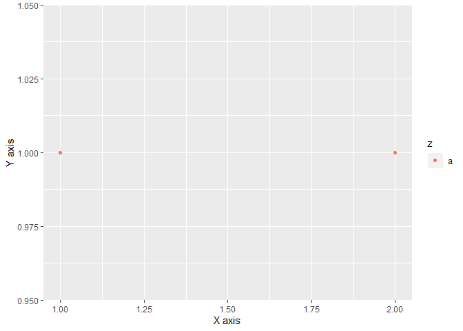<!-- -->

``` r
p + labs(x = "X axis", y = "Y axis", colour = "Colour\nlegend") # \n사용에 주목
```

<!-- -->

axis label 제거 방법에는 두가지가 있다. ""(공간이 남아있음)와 NULL이다.

``` r
p <- ggplot(df, aes(x, y)) +
geom_point() +
theme(plot.background = element_rect(colour = "grey50"))
p + labs(x = "", y = "")
```

<!-- -->

``` r
p + labs(x = NULL, y = NULL)
```

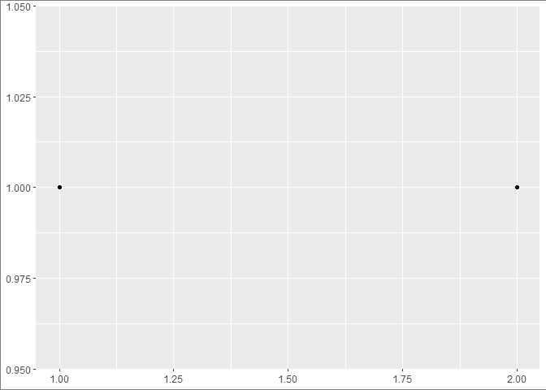<!-- -->

## Breaks and Labels

`breaks` 인자는 값이 축의 눈금과 범례의 key로써 나타내어짐을 통제한다. 각 break는 관련된 레이블을 가지고 있는데
`labels` 인자에 의해 통제된다. 만약 `labels`을 설정한다면 반드시 `breaks`도 설정해야 한다. 그렇지 않다면
데이터가 변한다면, breaks는 labels과 일치하지 않을 것이다.

``` r
df <- data.frame(x = c(1, 3, 5) * 1000, y = 1)
axs <- ggplot(df, aes(x, y)) +
  geom_point() +
  labs(x = NULL, y = NULL)
grid.arrange(axs,
axs + scale_x_continuous(breaks = c(2000, 4000)),
axs + scale_x_continuous(breaks = c(2000, 4000), labels = c("2k", "4k")), ncol = 3)
```

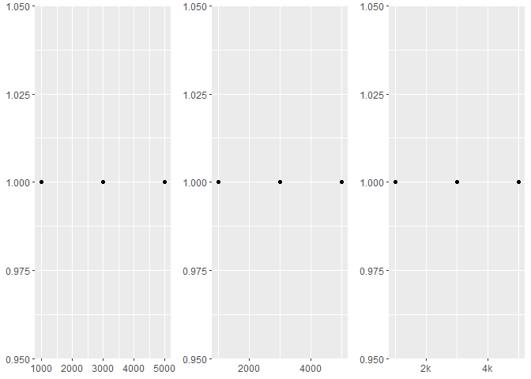<!-- -->

``` r
leg <- ggplot(df, aes(y, x, fill = x)) +
  geom_tile() +
  labs(x = NULL, y = NULL)
grid.arrange(leg,
leg + scale_fill_continuous(breaks = c(2000, 4000)),
leg + scale_fill_continuous(breaks = c(2000, 4000), labels = c("2k", "4k")), ncol = 3)
```

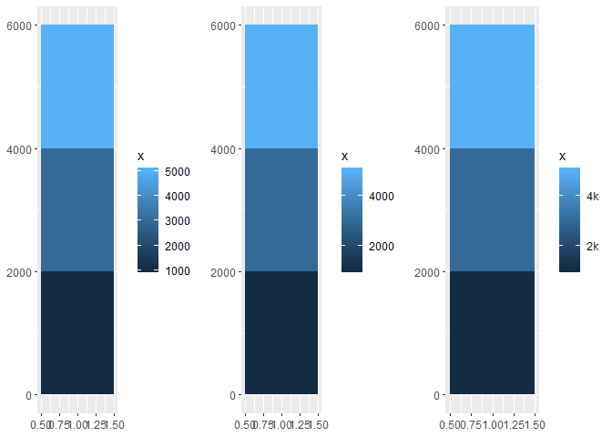<!-- -->

범주형 스케일에서 breaks를 relabel하고자 한다면, labels vecotr를 사용할 수 있다.

``` r
df2 <- data.frame(x = 1:3, y = c("a", "b", "c"))
grid.arrange(ggplot(df2, aes(x, y)) +
  geom_point(),
ggplot(df2, aes(x, y)) +
  geom_point() +
  scale_y_discrete(labels = c(a = "apple", b = "banana", c = "carrot")), ncol = 2)
```

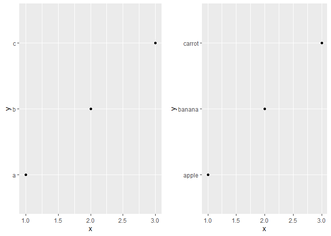<!-- -->

이렇게 제거하면 된다. breaks 제거시 label과 축과 범례가 함께 사라진다.

``` r
grid.arrange(axs + scale_x_continuous(breaks = NULL),
axs + scale_x_continuous(labels = NULL), ncol = 2)
```

<!-- -->

``` r
grid.arrange(leg + scale_fill_continuous(breaks = NULL),
leg + scale_fill_continuous(labels = NULL), ncol = 2)
```

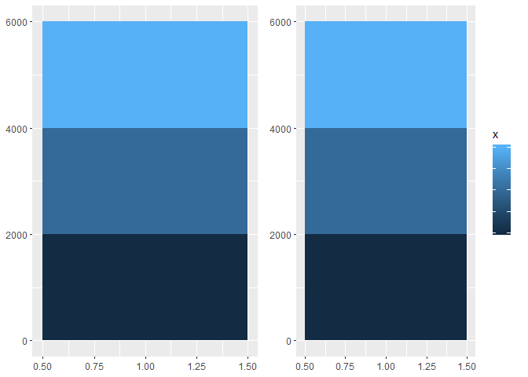<!-- -->

scales 패키지는 다수의 유용한 라벨링 함수를 제공한다.

  - scales::coma\_format() adds commas to make it easier to read large
    numbers.
  - scales::unit\_format(unit, scale) adds a unit suffix, optionally
    scaling.
  - scales::dollar\_format(prefix, suffix) displays currency values,
    rounding to two decimal places and adding a prefix or suffix
  - scales::wrap\_format() wraps long labels into multiple lines
  - scales::ordinal() : 1st, 2nd, 3rd, …로
나타낸다.

<!-- end list -->

``` r
grid.arrange(axs + scale_y_continuous(labels = scales::percent_format()),
axs + scale_y_continuous(labels = scales::dollar_format()),
leg + scale_fill_continuous(labels = scales::unit_format(suffix = "k", scale = 1e-3)), ncol = 3)
```

``` r
df <- data.frame(x = c(2, 3, 5, 10, 200, 3000), y = 1)
ggplot(df, aes(x, y)) +
  geom_point() +
  scale_x_log10()
```

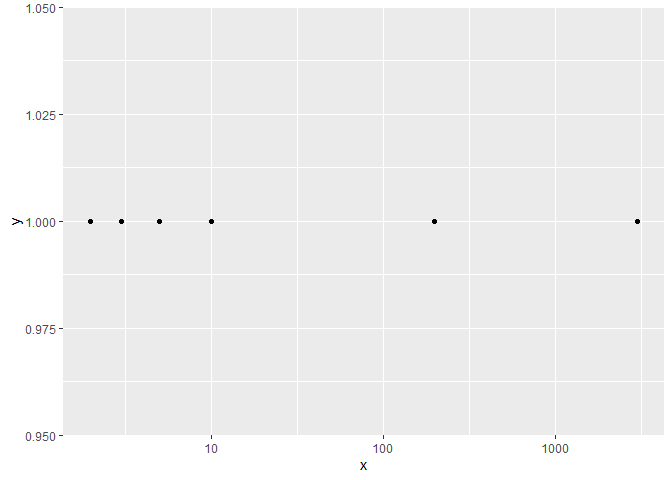<!-- -->

``` r
mb <- as.numeric(1:10 %o% 10 ^ (0:4))
ggplot(df, aes(x, y)) +
  geom_point() +
  scale_x_log10(minor_breaks = log10(mb))
```

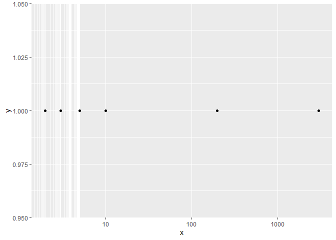<!-- --> 여기서
minor\_breaks는 숫자 벡터를 제공해 보조 눈금선을 조정한다.

## Exercises

1.Recreate the following graphic: 만약 scale\_x\_continuous가 아니라
scale\_x\_discrete을 하게 되면 축이 사라진다.

``` r
ggplot(mpg, aes(displ, hwy)) +
  geom_point() +
  scale_x_continuous("Displacement", labels = scales::unit_format(suffix = "L")) +
  scale_y_continuous(latex2exp::TeX("Highway \\left($\\frac{miles}{gallon}\\right)"))
```

<!-- -->

``` r
  #scale_y_continuous(quote(Highway*(frac(miles, gallon))))
```

2.  Recreate the following plot:

<!-- end list -->

``` r
ggplot(mpg, aes(displ, hwy, colour = drv)) +
  geom_point() +
  scale_color_discrete(labels = c("4" = "4wd", f = "fwd", r = "rwd")) 
```

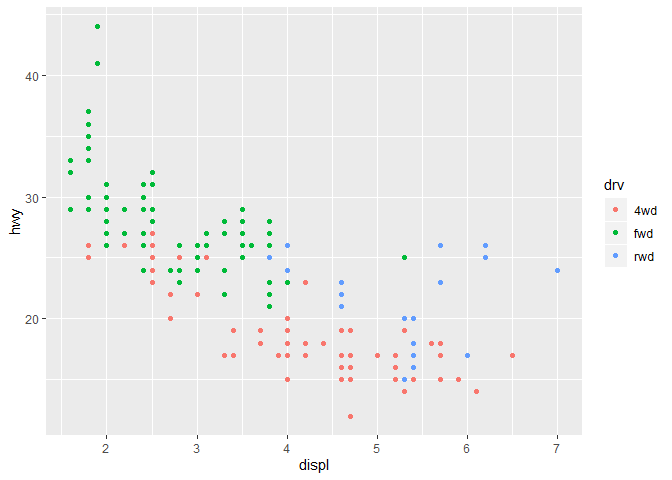<!-- -->

3.  What label function allows you to create mathematical
    expressions?What label function converts 1 to 1st, 2 to 2nd, and so
    on?

<!-- end list -->

``` r
scales::ordinal(1:10)
```

    ##  [1] "1st"  "2nd"  "3rd"  "4th"  "5th"  "6th"  "7th"  "8th"  "9th"  "10th"

# Legends

범례에만 적용되는 추가적인 옵션들이 있다. 범례는 축보다 좀 더 복잡하다. 그 이유는 다음과 같다

1.  범례는 여러개의 레이어로부터 다수의 미적요소를 나타낸다. 그리고 범례에서 보여지는 기호는 레이어에서 이용되는 기하객체에
    기반하여 다양하다.
2.  축들은 항상 같은 곳에서 나타난다. 범례는 다른 장소에서도 나타날 수 있으므로 범례를 통제할만한 포괄적인 방법이 필요하다.
3.  범례는 상당히 수정할 수 있는 좀 더 디테일한 면을 가지고 있다. 수직 또는 수평으로 나타낼 것인가? 열의 수는? key의
    크기는?

## Layers and Legends

범례는 다수의 레이어로부터 기호를 그릴 필요가 있다. 디폴트로 하나의 레이어는 오직 상응하는 미적요소가 aes()와 함께 변수로
매핑될 때 나타난다. `show.legend:FALSE(또는 TRUE)`로 레이어에서 범례의 출력여부를 결정할 수 있다.

``` r
df <- data.frame(x = 0, y = c(1,2,3), z=c("a","b","c"))
grid.arrange(ggplot(df, aes(y, y)) +
  geom_point(size = 4, colour = "grey20") +
  geom_point(aes(colour = z), size = 2),
ggplot(df, aes(y, y)) +
  geom_point(size = 4, colour = "grey20", show.legend = TRUE) +
  geom_point(aes(colour = z), size = 2), ncol = 2)
```

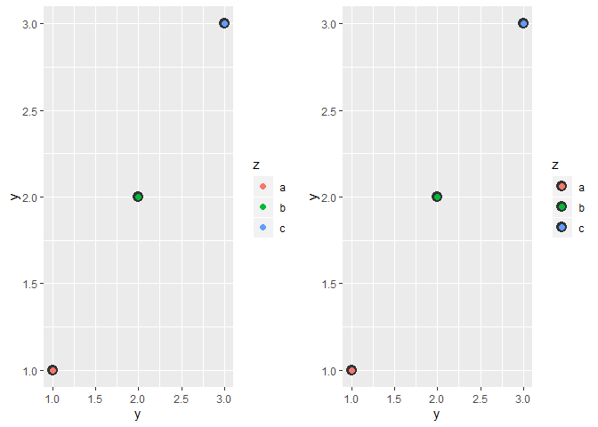<!-- --> 때때로 범례에
기하객체가 플랏에서의 기하객체와 다르게 나타났음을 바랄 수 있다. 이는 transparency or size를 오버플랏팅을
완화하는데 사용하고 또한 플랏에서 색상을 이용할 때 특히 유용하다. `guide_legend()`의
`override.aes` 매개변수를 이용하면 된다.

``` r
norm <- data.frame(x = rnorm(1000), y = rnorm(1000))
norm$z <- cut(norm$x, 3, labels = c("a", "b", "c"))
ggplot(norm, aes(x, y)) +
  geom_point(aes(colour = z), alpha = 0.1)
```

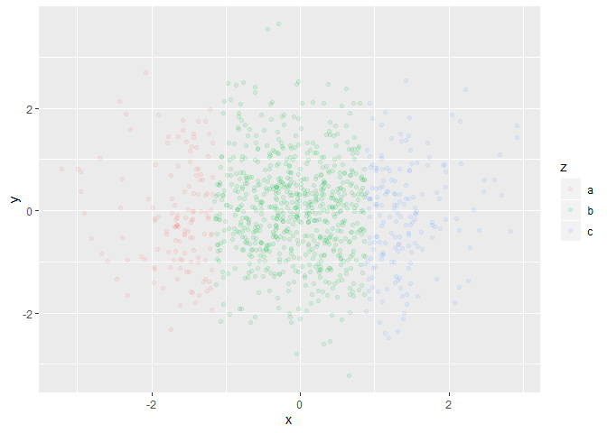<!-- -->

``` r
ggplot(norm, aes(x, y)) +
  geom_point(aes(colour = z), alpha = 0.1) +
  guides(colour = guide_legend(override.aes = list(alpha = 1)))
```

<!-- --> ggplot는
가장 적은 수의 범례로 정확하게 미적요소를 전달하게 끔 되어있다.

``` r
grid.arrange(ggplot(df, aes(x, y)) + geom_point(aes(colour = z)),
ggplot(df, aes(x, y)) + geom_point(aes(shape = z)),
ggplot(df, aes(x, y)) + geom_point(aes(shape = z, colour = z)), ncol = 3)
```

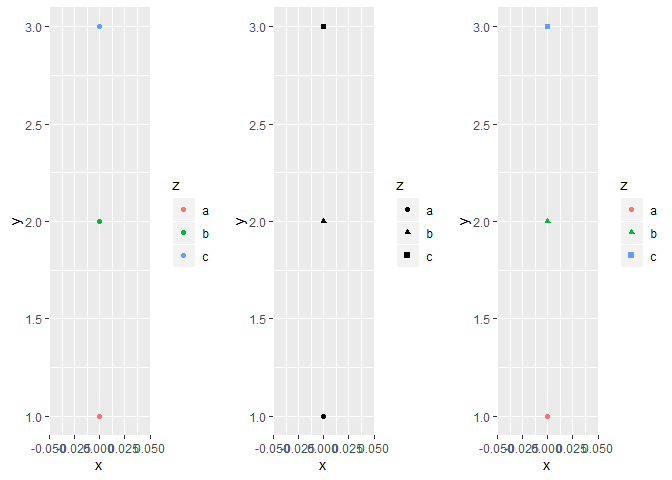<!-- --> 범례를 합치기
위해, 반드시 같은 name을 가져야 한다. 만약 sclae의 이름중 하나를 변경하고 싶다면, scale 모두 바꿔야 한다.

## Legend Layout

전반적인 범례의 상태에 영향을 주는 세팅의 수는 테마 시스템에 의하여 조정된다.

``` r
df <- data.frame(x = 1:3, y = 1:3, z = c("a", "b", "c"))
base <- ggplot(df, aes(x, y)) +
  geom_point(aes(colour = z), size = 3) +
  xlab(NULL) +
  ylab(NULL)
grid.arrange(base + theme(legend.position = "right"), # the default
base + theme(legend.position = "bottom"),
base + theme(legend.position = "none"), ncol = 3)
```

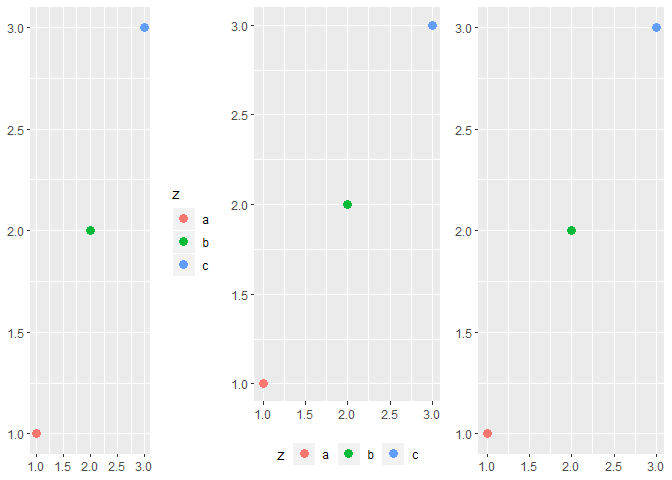<!-- -->

  - legend.direction : layout of items in legends(“horizontal” or
    “vertical”)
  - legend.box : arrangement of multiple legends(“horizontal” or
    “vertical”)
  - legend.box.just : justification of each legend within the overall
    bounding box, when there are multiple legends(“top”, “botton”,
    “left”, or “right”)
  - legend.margin : 범례 주위 여백 제거 `theme(legend.margin = unit(0, "mm"))`

만약 플랏에 공백이 많다면 범례를 플랏 내에 위치시킬 수 있다. legend.position으로 가능.

``` r
base <- ggplot(df, aes(x, y)) +
  geom_point(aes(colour = z), size = 3)
base + theme(legend.position = c(0, 1), legend.justification = c(0, 1))
```

<!-- -->

``` r
base + theme(legend.position = c(0.5, 0.5), legend.justification = c(0.5, 0.5))
```

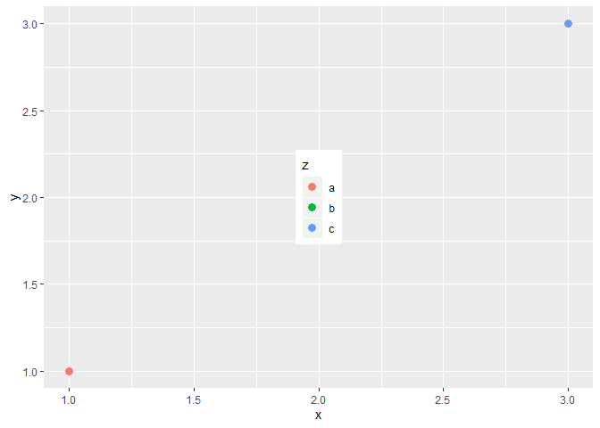<!-- -->

``` r
base + theme(legend.position = c(1, 0), legend.justification = c(1, 0))
```

<!-- -->

``` r
base + theme(legend.box.background = element_rect(),legend.box.margin = margin(6, 6, 6, 6))
```

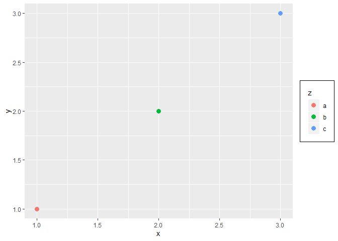<!-- -->

``` r
base + theme(legend.key = element_rect(fill = "white", colour = "black"))
```

<!-- -->

## Guide Functions

guide 함수, `guide_colourbar()` 그리고 `guide_legend()`는 추가적인 범례의 세부사항의 통졔권을
준다. legend guide는 어느 미적요소에 이용되어지는 반면에 colour bar guide는 오직 continuous
colour scales에만 이용될 수 있다.

default guide를 scale함수에 상응하는 guide 인자를 이용해서 오버라이딩 할 수 있다.

``` r
df <- data.frame(x = 1, y = 1:3, z = 1:3)
base <- ggplot(df, aes(x, y)) + geom_raster(aes(fill = z))
grid.arrange(base,
base + scale_fill_continuous(guide = guide_legend()),
base + guides(fill = guide_legend()), ncol = 3)
```

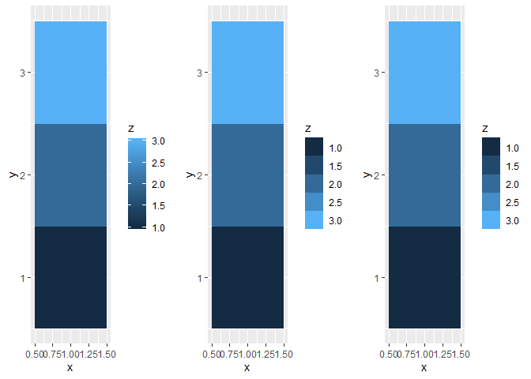<!-- -->
**guide\_legend()**

legend guide는 테이블의 개별 key를 보여준다. 가장 유용한 옵션은 :

  - `nrow` or `ncol`. `byrow`

<!-- end list -->

``` r
df <- data.frame(x = 1, y = 1:4, z = letters[1:4])
# Base plot
p <- ggplot(df, aes(x, y)) + geom_raster(aes(fill = z))
grid.arrange(p,
p + guides(fill = guide_legend(ncol = 2)),
p + guides(fill = guide_legend(ncol = 2, byrow = TRUE)), ncol = 3)
```

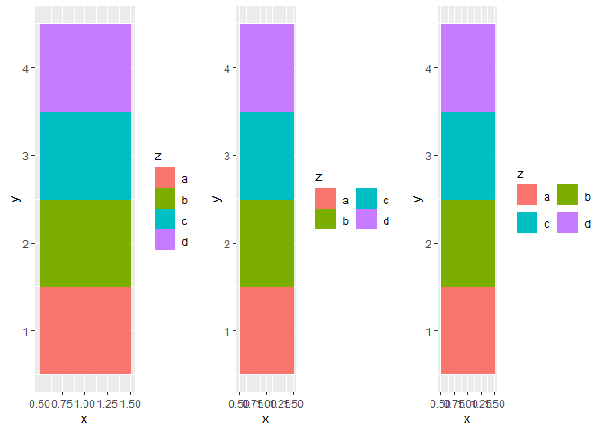<!-- --> -
`reverse` key의 순서. 막대를 쌓을때 특히 유용하다. default stacking과 legend의 순서가 다를 때.

``` r
p <- ggplot(df, aes(1, y)) + geom_bar(stat = "identity", aes(fill = z))
grid.arrange(p,
p + guides(fill = guide_legend(reverse = TRUE)), ncol =2)
```

<!-- -->

  - `override.aes` : 각 레이어로부터의 미적요소를 오버라이딩한다. 범례를 좀 더 시각적으로 두드러지게 할 때
    유용하다.

  - `keywidth and keyheight`

**guide\_colourbar**

colour bar guide는 연속적인 색의 범위로 디자인 된다.

  - `barwidth` and `barheight`은 막대의 size를 조정할 수 있다.
  - `nbin`은 slices의 수를 조정한다. 20이 default
  - `reverse`

<!-- end list -->

``` r
df <- data.frame(x = 1, y = 1:4, z = 4:1)
p <- ggplot(df, aes(x, y)) + geom_tile(aes(fill = z))
grid.arrange(p,
p + guides(fill = guide_colorbar(reverse = TRUE)),
p + guides(fill = guide_colorbar(barheight = unit(4, "cm"))), ncol = 3)
```

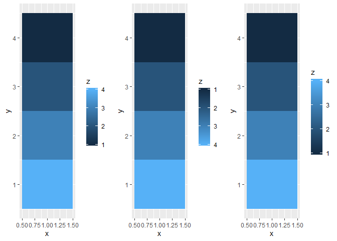<!-- -->
guide\_legend()에 비해 guide\_colourbar()은 연속적인 색에서만 사용가능 하다는것을 기억하자.

## Exercises

1.  How do you make legends appear to the left of the plot?

`theme(legend.position = c(1, 0), legend.justification = c(1, 0))` 여기서
legend.justification은 모서리의 위치 조정 범례 위치조정은 `theme`를 사용.

2.  What’s gone wrong with this plot? How could you fix it? ggplot(mpg,
    aes(displ, hwy)) + geom\_point(aes(colour = drv, shape = drv)) +
    scale\_colour\_discrete(“Drive train”)

<!-- end list -->

``` r
ggplot(mpg, aes(displ, hwy)) +
  geom_point(aes(colour = drv, shape = drv)) +
  scale_colour_discrete("Drive train") +
  scale_shape_discrete("Drive train")
```

<!-- -->

3.  Can you recreate the code for this plot? 

<!-- end list -->

``` r
ggplot(mpg, aes(displ, hwy, colour = class)) +
  geom_point(show.legend = FALSE) +
  geom_smooth(method = "lm", se = FALSE) +
  theme(legend.position = "bottom") +
  guides(colour = guide_legend(nrow = 1))
```

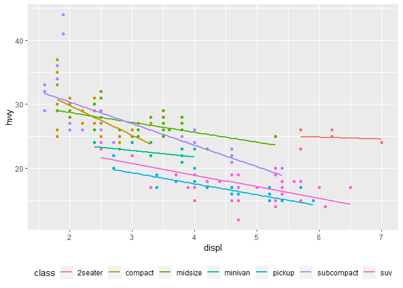<!-- -->

# 6.5 Limits

다음 두가지 이유로 limits를 명시한다.

1.  플랏의 관심있는 영역에 집중하기 위하여 범위를 축소한다.
2.  다수의 플랏을 맞추기 위해 범위를 확대시킨다.

limits는 축의 범위에 직접적으로 매핑시킬 뿐만 아니라(position scale) 범례, 색상, size, shape를
가지는 스케일에도 적용된다. 색상이 다수의 플랏에 걸쳐서 맞춰지는 것을 원한다면 이것을 깨닫는것은 특히 중요하다.
스케일의 `limits` 매개변수를 이용하여 limits를 수정한다.

  - 연속 스케일에서는 2 길이의 수치 벡터여야 한다. 하한과 상한을 설정하고 싶다면 NA 입력
  - 이산 스케일에서는 모든 가능한 값을 열거하는 문자 벡터이다.

<!-- end list -->

``` r
df <- data.frame(x = 1:3, y = 1:3)
base <- ggplot(df, aes(x, y)) + geom_point()
grid.arrange(base,
base + scale_x_continuous(limits = c(1.5, 2.5)),
#> Warning: Removed 2 rows containing missing values (geom_point).
base + scale_x_continuous(limits = c(0, 4)), ncol = 3)
```

    ## Warning: Removed 2 rows containing missing values (geom_point).

<!-- -->

• xlim(10, 20): a continuous scale from 10 to 20 • ylim(20, 10): a
reversed continuous scale from 20 to 10 • xlim(“a”, “b”, “c”): a
discrete scale • xlim(as.Date(c(“2008-05-01”, “2008-08-01”))): a date
scale fromMay 1 to August 1 2008. • lims(x = c( , ), y = c( , ))

축의 범위에는 약간의 공간이 있는데 이것은 데이터와 겹치지 않게 하기 위해서 존재한다. 이 공간을 제거 하고 싶다면,
`expand = c(0, 0)`

``` r
ggplot(faithfuld, aes(waiting, eruptions)) +
  geom_raster(aes(fill = density)) +
  theme(legend.position = "none")
```

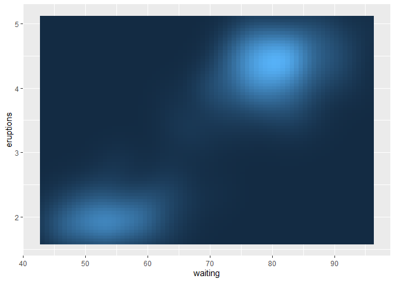<!-- -->

``` r
ggplot(faithfuld, aes(waiting, eruptions)) +
  geom_raster(aes(fill = density)) +
  scale_x_continuous(expand = c(0,0)) +
  scale_y_continuous(expand = c(0,0)) +
  theme(legend.position = "none")
```

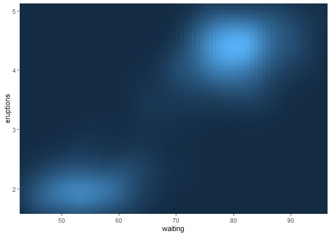<!-- -->
<span style="background : yellow"> 디폴트로, limits의 바깥은 **NA**로 전환된다. 이것은
플랏의 일부를 ZOOM-IN 하는 것과는 다르다.</span> (7장 참고) `oob(out of bounds)` 인자로
override 할 수 있다. oob의 디폴트는 `scales::sensor()`인데 이것은 limit의 바깥 범위를 NA로
변경시킨다. 또 다른 옵션은 `scales::squish()`인데 이것은 범위를 으깬다(squish).

``` r
df <- data.frame(x = 1:10)
p <- ggplot(df, aes(x, 1)) + geom_tile(aes(fill = x), colour = "white")
grid.arrange(
p,
p + scale_fill_gradient(limits = c(4, 6)),
p + scale_fill_gradient(limits = c(4, 6), oob = scales::squish), ncol = 3) # 1~4 같은색, 6~10 같은 색
```

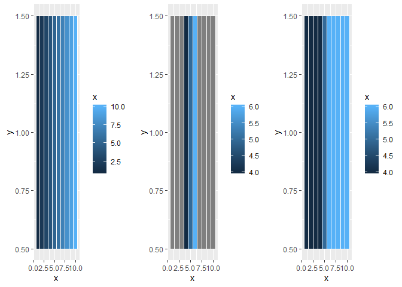<!-- --> \#\#
Exercises 1. The following code creates two plots of the mpg dataset.
Modify the code so that the legend and axes match, without using
facetting\! fwd \<- subset(mpg, drv == “f”) rwd \<- subset(mpg, drv ==
“r”) ggplot(fwd, aes(displ, hwy, colour = class)) + geom\_point()
ggplot(rwd, aes(displ, hwy, colour = class)) + geom\_point()

`drop` : If TRUE, the default, all factor levels not used in the data
will automatically be dropped. If FALSE, all factor levels will be
shown, regardless of whether or not they appear in the data.

``` r
mpg$class <- as.factor(mpg$class)
fwd <- subset(mpg, drv == "f")
rwd <- subset(mpg, drv == "r")
ggplot(fwd, aes(displ, hwy, colour = class))+
  geom_point() + lims(x = c(1, 7), y = c(15, 45))+
  scale_color_discrete(drop = FALSE)
```

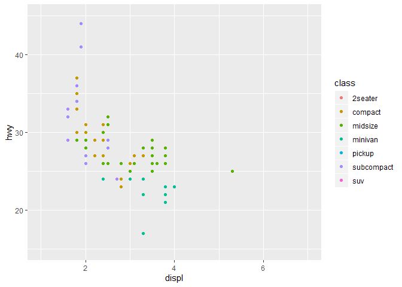<!-- -->

``` r
ggplot(rwd, aes(displ, hwy, colour = class)) + 
  geom_point() + lims(x = c(1, 7), y = c(15, 45))+
  scale_color_discrete(drop = FALSE)
```

<!-- -->

``` r
# ggplot(mpg[mpg$drv %in% c("f", "r"), ], aes(displ, hwy, colour = class)) +
#   geom_point() +
#   facet_wrap(~drv) 
```

2.  What does `expand_limits()` do and how does it work? Read the source
    code.

Sometimes you may want to ensure limits include a single value, for all
panels or all plots. This function is a thin wrapper around
geom\_blank() that makes it easy to add such values. expand\_limits()와
lims 차이 : `expand_limits(x = a, y = b)`를 하면 (a, b)과 플랏의 모든 점을 포함하는 limit
설정. <span style="background : yellow">원점을 포함하고 싶을 때 유용하다 </span>

3.  What does scale\_x\_continuous(limits = c(NA, NA)) do?

<!-- end list -->

``` r
ggplot(mpg, aes(displ, hwy, colour = class)) +
  geom_point() +
  scale_x_continuous(limits = c(NA, NA))
```

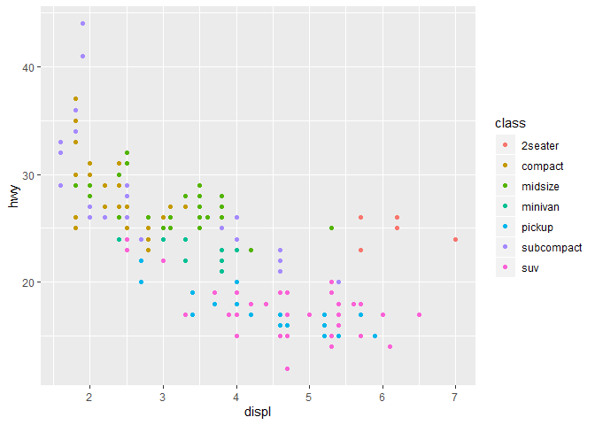<!-- --> Use NA
to refer to the existing minimum or maximum.

# Scales Toolbox

스케일의 디폴트 옵션을 조정할 뿐만 아니라 새로운 스케일로 완전히 오버라이딩 할 수 있다. 스케일은 4개의 family로
나눠진다.

  - 연속 위치 스케일은 정수, 수치, 날짜/시간 데어터에 x와 y position를 매핑할 수 있다.
  - 색상 스케일은 연속형과 이산형 데이터에 색상을 매핑할 수 있다.
  - Manual 스케일은 이산변수를 size, line type, shape or colour의 선택에 매핑할 수 있다.
  - Identity 스케일은 역설적으로 스케일링 하지 않고 플랏에 이요되어진다. 이것은 데이터가 이미 색상이름 벡터일 때
    유용하다.

# Continuous Position Scales

모든 연속형 스케일은 `trans` 인자를 가지고 있다.

``` r
# Convert from fuel economy to fuel consumption
ggplot(mpg, aes(displ, hwy)) +
  geom_point() +
  scale_y_continuous(trans = "reciprocal")
```

<!-- -->

``` r
# Log transform x and y axes
ggplot(diamonds, aes(price, carat)) +
  geom_bin2d() +
  scale_x_continuous(trans = "log10") +
  scale_y_continuous(trans = "log10")
```

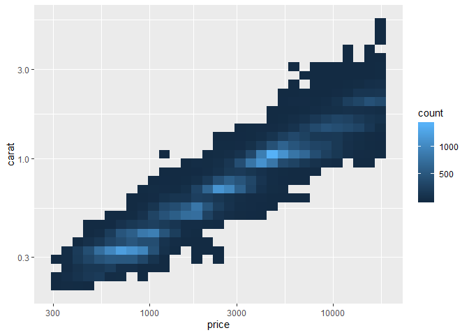<!-- --> 변환은
“transformer”에 의해 수행되어지고 이것은 변환, 역함수를 설명하고 레이블을 어떻게 그리는지를 설명한다.


``` r
ggplot(diamonds, aes(log10(price), log10(carat))) +
  geom_bin2d() 
```

<!-- --> scale
대신 미적요소에서 직접 log를 취하면 눈금이 변경됨을 알 수 있다. transformed scale을 사용하면 축이
원래의 데이터 공간에서 레이블 된다. 데이터 자체를 변환하면 축은 변환된 공간에서 레이블 된다.

<span style="background : yellow">통계요약 이전에 변환은 일어난다. 통계 계산후 변환을 하고자 한다면
`coord.trans()`를 사용하라.</span>

Date와 date/time data는 특별한 레이블을 가지는 연속형 변수이다. ggplot2는 `Date` 그리고
`POSIXct` 클래스와 함께 작동한다. 다른 포멧이라면 `as.Date()` 또는 `as.POSIXct()`로 변환시킬 수
있다. `scale_x_date()` 와 `scale_x_datetime()`은 `scale_x_continuous()`와
비슷하게 작동하지만 `date_breaks`와 `date_labels` 인자를 가지고 있다.

  - `date_breaks` 그리고 \``date_minor_breaks()`는 date units(년, 월, 주, 일,
    시간, 분, 초)에 의해 position breaks를 가능케한다. 예를 들어, `date_breaks = "2
    weeks"` 는 주눈금선을 격주마다 둘 것이다.
  - `date_labels`는 `strptime()` `format()`로써 같은 포맷의 문자열을 이용하여 레이블의 출현을
    통제한다.


예를 들어, 14/10/1979를 출력하고 싶다면,
“%d/%m/%Y”

``` r
base <- ggplot(economics, aes(date, psavert)) + # psavert : personal savings rate
  geom_line(na.rm = TRUE) +
  labs(x = NULL, y = NULL)
base # Default breaks and labels
```

<!-- -->

``` r
base + scale_x_date(date_labels = "%y", date_breaks = "5 years")
```

<!-- -->

``` r
base + scale_x_date(
  limits = as.Date(c("2004-01-01", "2005-01-01")),
  date_labels = "%b %y",
  date_minor_breaks = "1 month"
)
```

<!-- -->

``` r
base + scale_x_date(
  limits = as.Date(c("2004-01-01", "2004-06-01")),
  date_labels = "%m %d",
  date_minor_breaks = "2 weeks"
)
```

<!-- -->

## Colour

ggplot2의 값을 색상에 매핑하는 상당수 다른 방법들이 있다. 4개의 다른 연속형 변수에 대한 그레디언트 기반의 방법, 그리고
이산형 변수를 매핑하는 두 가지 방법.

기존의 RGB 방법은 지각적으로 균일하지 않기 때문에 HCL 방법을 이용한다.

  - Hue(색조)는 0과 360사이의 수 : blue, red, orange등을 의미
  - Chroma(채도)는 색순도를 의미한다. 채도0은 회색, 채도의 최댓값은 luminance(휘도)에 따라 다양하다.
  - Luminance(휘도)는 색상의 밝기를 의미한다. 휘도가 0이면 검은색, 1이면 흰색이다.

색조는 순서가 없고(초록색이 빨강색보다 크지 않다) 채도와 휘도는 순서가 있다. 앞으로 나올 것들은
`scale_colour(fill)_continuous(discrete)`처럼 사용 가능.

### Continuous

색 그레디언트는 2d 표면의 높이를 보여주는데 종종 이용한다.

``` r
erupt <- ggplot(faithfuld, aes(waiting, eruptions, fill = density)) +
  geom_raster() +
  scale_x_continuous(NULL, expand = c(0, 0)) +
  scale_y_continuous(NULL, expand = c(0, 0)) +
  theme(legend.position = "none")
```

연속 색상 스케일에는 네가지가 있다.

  - `scale_colour_gradient()` 그리고 `scale_fill_gradient()` : a two-colour
    gradient, low-high(light blue - dark blue).

일반적으로 연속 색상 스케일은 색조를 상수로, 채도와 휘도를 다양하게 한다. munsell(먼셀) 색상시스템은 HCL에 기반한
유용한 방법을 제공해 주기 때문에 유용하다.

``` r
grid.arrange(
erupt + scale_fill_gradient(low = "white", high = "black"),
erupt + scale_fill_gradient(
  low = munsell::mnsl("5G 9/2"),
  high = munsell::mnsl("5G 6/8")
), ncol = 2)
```

<!-- --> -
`scale_colour_gradient2()` and `scale_fill_gradient2()` : 세가지 색상의 그레디언트,
low-med-high(red - white - blue). low and high 색상 뿐 아니라, 이 스케일은 mid 색상도
지원한다. midpoint의 디폴트는 0이지만 다른 값으로 midpoint 인자로부터 설정할 수 있다.

``` r
mid <- median(faithfuld$density)
erupt + scale_fill_gradient2(midpoint = mid)
```

<!-- -->

  - `scale_colour_gradientn()` 그리고 `scale_fill_gradient()` : 커스텀 n개의 색상
    그레디언트. 데이터의 의미있는 색상을 가지고 있다면 유용하다.

<!-- end list -->

``` r
grid.arrange(
erupt + scale_fill_gradientn(colours = terrain.colors(7)),
erupt + scale_fill_gradientn(colours = colorspace::heat_hcl(7)),
erupt + scale_fill_gradientn(colours = colorspace::diverge_hcl(7)), ncol = 3)
```

<!-- --> -
`scale_color_distiller()` 그리고 `scale_fill_gradient()`는 Color-Brewer
colour sclaes를 연속형 데이터에 적용한다.

``` r
grid.arrange(
erupt + scale_fill_distiller(),
erupt + scale_fill_distiller(palette = "RdPu"),
erupt + scale_fill_distiller(palette = "YlOrBr"), ncol = 3)
```

<!-- --> 모든 연속형
colour scales는 `na.value` 매개변수로 결측값이 있을 때 처리할 수 있다.

검은색과 흰색 스케일을 이요한다면 다른것들을 좀 더 두드러지게 보이게끔 할 수 있다.

``` r
df <- data.frame(x = 1, y = 1:5, z = c(1, 3, 2, NA, 5))
p <- ggplot(df, aes(x, y)) + geom_tile(aes(fill = z), size = 5)
p
```

<!-- -->

``` r
# Make missing colours invisible
p + scale_fill_gradient(na.value = NA)
```

<!-- -->

``` r
# Customise on a black and white scale
p + scale_fill_gradient(low = "black", high = "white", na.value = "red")
```

<!-- -->

### Discrete

이산형 데이터에 대한 4가지 색상 스케일이 있다.

``` r
df <- data.frame(x = c("a", "b", "c", "d"), y = c(3, 4, 1, 2))
bars <- ggplot(df, aes(x, y, fill = x)) +
  geom_bar(stat = "identity") +
  labs(x = NULL, y = NULL) +
  theme(legend.position = "none")
```

  - 디폴트 색상 scheme, `scale_colour_hue()`, 은 균등하게 색조를 배치한다.

<!-- end list -->

``` r
grid.arrange(
bars,
bars + scale_fill_hue(c = 40), #채도 변경
bars + scale_fill_hue(h = c(180, 300)), ncol = 3) #휘도 변경
```

<!-- -->

디폴트 colour scheme의 한가지 단점은 모든 색상이 같은 휘도와 채도를 가지고 있기 때문에, 흑백으로 프린트 할 때 모두
동일한 회색으로 보인다는 것이다.

  - `sclae_colour_brewer()`는 엄선된 “ColorBrewer” 색상을 사용한다. 지도에 초점이 맞춰져있어서
    넓은 지역에 보일 때 더 잘 작동하지만 여러 상황에서 유용하다. <http://colorbrewer2.org/>

<!-- end list -->

``` r
grid.arrange(
bars + scale_fill_brewer(palette = "Set1"),
bars + scale_fill_brewer(palette = "Set2"),
bars + scale_fill_brewer(palette = "Accent"), ncol = 3)
```

<!-- --> -
`scale_colour_grey()`는 이상형 데이터를 회색에 매핑시킨다.

``` r
grid.arrange(
bars + scale_fill_grey(),
bars + scale_fill_grey(start = 0.5, end = 1),
bars + scale_fill_grey(start = 0, end = 0.5), ncol = 3)
```

<!-- --> -
`scale_colour_manual()` 은 이산형 색상 팔레트를 가지게 된다면 유용하다. 이것은 지각적인 균등함을 가지도록
설계되지 않았다.

``` r
library(wesanderson)
```

    ## Warning: package 'wesanderson' was built under R version 3.5.3

``` r
grid.arrange(
bars + scale_fill_manual(values = wes_palette("GrandBudapest1")),
bars + scale_fill_manual(values = wes_palette("Zissou1")),
bars + scale_fill_manual(values = wes_palette("Rushmore")), ncol = 3)
```

<!-- -->

<span style="background : yellow"> 밝은 색상은 점에 좋고 막대에서는 너무 강렬하다. 희미한 색상은
막대에 좋지만 점으로는 보기 힘들다. </span>

``` r
# Bright colours work best with points
df <- data.frame(x = 1:3 + runif(30), y = runif(30), z = c("a", "b", "c"))
point <- ggplot(df, aes(x, y)) +
  geom_point(aes(colour = z)) +
  theme(legend.position =  "none") +
  labs(x = NULL, y = NULL)
grid.arrange(
point + scale_color_brewer(palette = "set1"),
point + scale_color_brewer(palette = "set2"),
point + scale_color_brewer(palette = "Pastel1"), ncol = 3)
```

    ## Warning in pal_name(palette, type): Unknown palette set1

    ## Warning in pal_name(palette, type): Unknown palette set2

<!-- -->

``` r
# Subtler colours work better with areas
df <- data.frame(x = 1:3, y = 3:1, z = c("a", "b", "c"))
area <- ggplot(df, aes(x, y)) +
  geom_bar(aes(fill = z), stat = "identity") +
  theme(legend.position =  "none") +
  labs(x = NULL, y = NULL)
grid.arrange(
area + scale_fill_brewer(palette = "Set1"),
area + scale_fill_brewer(palette = "Set2"),
area + scale_fill_brewer(palette = "Pastel1"), ncol = 3)
```

<!-- -->

## The Manual Discrete Scale

manual scale은 한가지 중요한 인자 values 가 있는데 이것은 스케일이 생성하는 값을 구체화 한다. 벡터가 이름이
있다면, 이것은 출력값을 입력값에 매치시킨다. 그렇지않다면, 이산형변수의 레벨의 순서에 따라 매치시킨다.

``` r
plot <- ggplot(msleep, aes(brainwt, bodywt)) +
  scale_x_log10() +
  scale_y_log10()
plot +
  geom_point(aes(colour = vore)) +
  scale_colour_manual(
    values = c("red", "orange", "green", "blue"),
    na.value = "grey50"
  )
```

    ## Warning: Removed 27 rows containing missing values (geom_point).

<!-- -->

``` r
#> Warning: Removed 27 rows containing missing values (geom_point).
colours <- c(
  carni = "red",
  insecti = "orange",
  herbi = "green",
  omni = "blue"
)
plot +
  geom_point(aes(colour = vore)) +
  scale_colour_manual(values = colours)
```

    ## Warning: Removed 32 rows containing missing values (geom_point).

<!-- -->

``` r
#> Warning: Removed 27 rows containing missing values (geom_point).
```

다음 예시는 창의적인 `scale_colour_manual()`의 사용법인데 유용한 범례를 보여주고 같은 플랏에 다수의 변수를
나타내기 위해 사용한다.

``` r
huron <- data.frame(year = 1875:1972, level = as.numeric(LakeHuron))
ggplot(huron, aes(year)) +
  geom_line(aes(y = level + 5, colour = "above")) +
  geom_line(aes(y = level - 5, colour = "below")) +
  scale_colour_manual("Direction",
                      values = c("above" = "red", "below" = "blue")) # aes의 colour와 values가 일치해야한다.
```

<!-- --> \#\#
The Identity Scale

identity scale은 데이터가 이미 스케일 되어 있고, 데이터와 미적요소 공간이 동일할 때 사용한다.

``` r
head(luv_colours)
```

    ##          L             u         v           col
    ## 1 9341.570 -3.370649e-12    0.0000         white
    ## 2 9100.962 -4.749170e+02 -635.3502     aliceblue
    ## 3 8809.518  1.008865e+03 1668.0042  antiquewhite
    ## 4 8935.225  1.065698e+03 1674.5948 antiquewhite1
    ## 5 8452.499  1.014911e+03 1609.5923 antiquewhite2
    ## 6 7498.378  9.029892e+02 1401.7026 antiquewhite3

``` r
#> L u v col
#> 1 9342 -3.37e-12 0 white
#> 2 9101 -4.75e+02 -635 aliceblue
#> 3 8810 1.01e+03 1668 antiquewhite
#> 4 8935 1.07e+03 1675 antiquewhite1
#> 5 8452 1.01e+03 1610 antiquewhite2
#> 6 7498 9.03e+02 1402 antiquewhite3
ggplot(luv_colours, aes(u, v)) +
  geom_point(aes(colour = col), size = 3) +
  scale_color_identity() +
  coord_equal()
```

<!-- -->

# Summary

  - scale함수 제목 인자에 문자열(함께 사용가능)과 수식을 사용가능. 제목은 `labs`, 제거는 ""또는 NULL
  - scale함수는 `breaks` : 축의 눈금과 범례의 key, `labels` : 눈금 이름. `labels`를 설정할
    때는 `breaks` 도 함께 설정
  - breaks를 relabel하려면 labels vector사용( `scale_y_discrete(labels = c(a =
    "apple", b = "banana", c = "carrot"))`
  - scales패키지 라벨링 함수 사용
  - 특정 레이어의 미적요소의 범례를 `show.legend:FALSE(or TRUE)`로 출력여부 결정
  - 범례에만 접근할 수 있는 함수에는 `guides`, `theme`: 범례 위치 `theme(legend.position =
    "bottom")`, `theme(legend.position = c(1, 0), legend.justification =
    c(1, 0))`
  - `guides(colour = guide_legend(override.aes = list(alpha = 1)))` 과 같이
    key를 오버라이딩 해서 더 잘 보이도록 수정 가능, `guides(fill = guide_legend(ncol = 2,
    byrow = TRUE))`,`guides(fill = guide_legend(reverse = TRUE))` 와 같은
    설정가능
  - `guide_colourbar`는 연속적인 색의 범위로 디자인된다. 마찬가지로 `guides(fill =
    fuide_colorbar(reverse = TRUE))`
  - scale함수의 `drop = FALSE`옵션
  - `expand_limits(x = a, y = b)` (a, b)과 플랏의 모든 점을 포함하는 limit설정. 원점을
    포함하고 싶을 때 유용
  - 모든 연속형 스케일은 `trans`인자를 가지고 있다.
  - `scale(trans = "log10")`과 `coord_trans()`차이 이해
  - `scale_x_date( limits = as.Date(c("2004-01-01","2005-01-01")),
    date_labels = "%b %y", date_minor_breaks = "1 month")`
  - `scale_colour_brewer(palette = "set1")` 산점도에 사용
  - manual discrete scale은 같은 플랏에 다수의 변수를 나타내기 위하여 사용
    `scale_colour_manual("Direction", values = c("above" = "red",
    "below" = "blue"))`

> 참고자료

수식 : <http://vis.supstat.com/2013/04/mathematical-annotation-in-r/>
