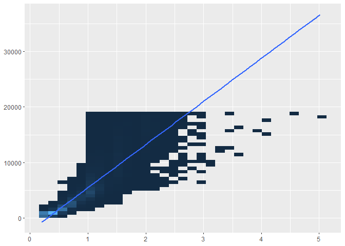

ggplot2 Elegant Graphics for Data Analysis
================
true
2019-08-10

<style>
mystyle{
    font-family :  Georgia;
    font-size : 26px;
    color : PaleVioletRed  ;
}
</style>

> <mystyle> Chapter 7 </mystyle>  
> <mystyle> Positioning </mystyle>

  - **Position adjustment** 레이어 내에 겹치는 객체를 조절하는 position. 막대와 interval
    geoms에 유용하다
  - **Position Scales** 플랏의 position에 매핑하는 방법을 통제한다.
  - **Facetting** 페이지에 다수의 플랏을 자동적으로 레이아웃하는 메커니즘. 데이터를 부분집합으로 나누고나서 각
    부분집합을 다른 페널에 그린다.
  - **Coordinate systems** 독립 position scale이 2d 좌표계에 조합되는 방법을 통제한다.

# Facetting

  - `facet_null()` : 하나의 플랏, 디폴트
  - `facet_wrap()` : “wraps” a 1d ribbon of panels into 2d
  - `facet_grid()` : 행과 열을 형성하는 변수에 의해 2d 그리드 패널을
만든다.


``` r
mpg2 <- subset(mpg, cyl != 5 & drv %in% c("4", "f") & class != "2seater")
```

## Facet Wrap

패널의 하나의 긴 리본을 만들어 2d로 wrap한다. 여러개의 레벨을 가진 하나의 변수를 효율적인 방식으로 배열하고자 할 때
유용하다.

ncol, nrow, as.table and dir.nocl, dir.nrow가 행과 열을 어떻게 통제해서 리본을 wrap할
것인지를 컨트롤할 수 있다. `as.table`은 facets가 table처럼 레이아웃 되게 하며, 이 옵션이
TRUE이면 가장 높은 값이 오른쪽 아래이고 FALSE이면 오른쪽 위에 가장 높은 값이 배치된다. `dir`은 wrap의
방향을 수평 또는 수직으로 조정한다.

``` r
base <- ggplot(mpg2, aes(displ, hwy)) +
  geom_blank() +
  xlab(NULL) +
  ylab(NULL)
grid.arrange(
base + facet_wrap(~class, ncol = 3),
base + facet_wrap(~class, ncol = 3, as.table = FALSE), ncol = 2)
```

<!-- -->

``` r
grid.arrange(
base + facet_wrap(~class, nrow = 3),
base + facet_wrap(~class, nrow = 3, dir = "v"), ncol = 2)
```

<!-- -->

## Facet Grid

facet\_grid()는 2d grid로 플랏을 레이아웃 한다.

  - `. ~ a`열에 따라 값을 분산시킨다. y축에 따라 비교할 때 용이하다.

<!-- end list -->

``` r
base + facet_grid(. ~ cyl)
```

<!-- -->

  - `b ~ .` 는 행에 따라 값을 분산시킨다. x축으로 비교할때 유용하다.
    <span style="background : yellow">특히 분포를 비교할 때 유용하다.</span>

<!-- end list -->

``` r
base + facet_grid(drv ~ .)
```

<!-- -->

  - `a ~ b`. a + b ~ c + d와 같이 다수의 변수를 행과 열에 사용가능하다.

<!-- end list -->

``` r
base + facet_grid(drv ~ cyl)
```

<!-- -->

## Controlling Scales

facet\_wrap()과 facet\_grid() 둘 다 다음 옵션을 제공한다. - scales = “fixed” : x and
y 스케일 고정 - scales = “free\_x” : x 스케일 free, y 스케일 고정 - scales =
“free\_y” : y 스케일 free, x 스케일 고정 - scales = “free” : x and y 스케일
free

``` r
p <- ggplot(mpg2, aes(cty, hwy)) +
  geom_abline() +
  geom_jitter(width = 0.1, height = 0.1)
p + facet_wrap(~cyl)
```

<!-- -->

``` r
p + facet_wrap(~cyl, scales = "free")
```

<!-- -->

free scales은 다른 스케일로 측정된 다수의 시계열을 나타내고자 할 때 유용하다.

``` r
ggplot(economics_long, aes(date, value)) +
  geom_line() +
  facet_wrap(~variable, scales = "free_y", ncol = 1)
```

<!-- -->

facet\_grid()는 추가적인 매개변수 **space**를 가지고 있는데, 이것은 **scales**와 같은 값을 취한다.
<span style="background : yellow"> space가 “free”면 각 열(또는 행)은 스케일의 범위에
비례하는 너비나 높이를 가진다. 이것은 전체 플랏에 걸쳐서 scaling을 동일하게 만든다: 각 패널에 대해 1cm를
데이터의 같은 범위에 매핑시킨다.</span> 예를 들어, 패널 a의 범위가 2, 패널 b의 범위가 1이면 각각 2/3,
1/3의 공간을 할당시킨다. 이것은 <span style="background : yellow">범주형 스케일에 매우 유용하다.
</span>

``` r
mpg2$model <- reorder(mpg2$model, mpg2$cty)
mpg2$manufacturer <- reorder(mpg2$manufacturer, -mpg2$cty)
ggplot(mpg2, aes(cty, model)) +
  geom_point() +
  facet_grid(manufacturer ~ ., scales = "free", space = "free") 
```

<!-- -->

``` r
  theme(strip.text.y = element_text(angle = 0))
```

    ## List of 1
    ##  $ strip.text.y:List of 11
    ##   ..$ family       : NULL
    ##   ..$ face         : NULL
    ##   ..$ colour       : NULL
    ##   ..$ size         : NULL
    ##   ..$ hjust        : NULL
    ##   ..$ vjust        : NULL
    ##   ..$ angle        : num 0
    ##   ..$ lineheight   : NULL
    ##   ..$ margin       : NULL
    ##   ..$ debug        : NULL
    ##   ..$ inherit.blank: logi FALSE
    ##   ..- attr(*, "class")= chr [1:2] "element_text" "element"
    ##  - attr(*, "class")= chr [1:2] "theme" "gg"
    ##  - attr(*, "complete")= logi FALSE
    ##  - attr(*, "validate")= logi TRUE

`reorder(mpg2$manufacturer, -mpg2$cty)` 에서 -가 붙는 이유는 facet는 아래값이 높은값이기
때문.

## Missing Facetting variables

``` r
df1 <- data.frame(x = 1:3, y = 1:3, gender = c("f", "f", "m"))
df2 <- data.frame(x = 2, y = 2)
ggplot(df1, aes(x, y)) +
  geom_point(data = df2, colour = "red", size = 2) +
  geom_point() +
  facet_wrap(~gender)
```

<!-- -->

## Grouping vs. Facetting

facetting을 사용하면 각 그룹이 서로 겹치지 않는다. 그룹들이 많이 겹칠때는 유용하지만 약간의 차이를 보기가 힘들다.
colour나 shape, size로 그룹들을 구분한다면 반대로 약간의 차이는 보기 쉽다.

``` r
df <- data.frame(
  x = rnorm(120, c(0, 2, 4)),
  y = rnorm(120, c(1, 2, 1)),
  z = letters[1:3]
)
ggplot(df, aes(x, y)) +
  geom_point(aes(colour = z))
```

<!-- -->

``` r
ggplot(df, aes(x, y))+
  geom_point() +
  facet_wrap(~z)
```

<!-- -->

facet간 비교는 annotation을 사용하면 좋다.

``` r
df_sum <- df %>% 
  group_by(z) %>% 
  summarise(x = mean(x), y = mean(y)) %>% 
  rename(z2 = z)
ggplot(df, aes(x, y)) +
  geom_point() +
  facet_wrap(~z) +
  geom_point(data = df_sum, aes(x, y , colour = z2), size = 4)
```

<!-- -->

또 다른 유용한 기술은 각 패널의 배경에 모든 데이터를 그려놓는것이다.

``` r
df2 <- select(df, -z)

ggplot(df, aes(x, y)) +
  geom_point(data = df2, colour = "grey70") +
  geom_point(aes(colour = z)) +
  facet_wrap(~z)
```

<!-- -->

## Continuous Variables

연속형 변수를 facet하기 위해서 먼저 이산화한다.

  - `cut_interval(x, n)` : 데이터를 같은 길이의 n개의 구간으로 나눈다.
  - `cut_width(x, width)` : 데이터를 너비로 나눈다.
  - `cut_number(x, n = 10)` : 데이터를 같은 수의 점을 포함하는 n개의 구간으로 나눈다.

<!-- end list -->

``` r
# Bins of width 1
mpg2$disp_w <- cut_width(mpg2$displ, 1)
# Six bins of equal length
mpg2$disp_i <- cut_interval(mpg2$displ, 6)
# Six bins containing equal numbers of points
mpg2$disp_n <- cut_number(mpg2$displ, 6)
plot <- ggplot(mpg2, aes(cty, hwy)) +
  geom_point() +
  labs(x = NULL, y = NULL)
plot + facet_wrap(~disp_w, nrow = 1)
```

<!-- -->

``` r
plot + facet_wrap(~disp_i, nrow = 1)
```

<!-- -->

``` r
plot + facet_wrap(~disp_n, nrow = 1)
```

<!-- -->
facetting formula는 함수를 연산하지 않기 때문에 반드시 새 변수를 만들자.

## Exercises

1.  Diamonds: display the distribution of price conditional on cut and
    carat. Try facetting by cut and grouping by carat. Try facetting by
    carat and grouping by cut. Which do you prefer?

<!-- end list -->

``` r
ggplot(diamonds, aes(carat, price)) +
  geom_point() +
  facet_wrap(~cut, ncol = 1, scales = "free_y")
```

<!-- -->

``` r
temp <- diamonds
temp <- temp %>% 
  mutate(carat_w = cut_width(carat, 1))
ggplot(temp, aes(cut, price)) +
  geom_point() +
  facet_wrap(~carat_w, ncol = 1, scales = "free_y")
```

<!-- --> 첫번째가
좋아보인다.

2.  Diamonds: compare the relationship between price and carat for each
    colour. What makes it hard to compare the groups? Is grouping better
    or facetting? If you use facetting, what annotation might you add to
    make it easier to see the differences between panels?

<!-- end list -->

``` r
ggplot(diamonds, aes(carat, price, colour = color)) +
  geom_point()
```

<!-- -->

``` r
temp <- select(diamonds, -color)
ggplot(diamonds, aes(carat, price)) +
  geom_point(data = temp, colour = "grey70") +
  geom_point(aes(colour = color)) +
  facet_wrap(~color) +
  theme_bw() # 회색 없애는게 가독성 더 좋아보임
```

<!-- -->

3.  Why is facet wrap() generally more useful than facet grid()?

This is generally a better use of screen space than facet\_grid()
because most displays are roughly rectangular. facet\_grid() is most
useful when you have two discrete variables, and all combinations of the
variables exist in the data.

4.  Recreate the following plot. It facets mpg2 by class, overlaying a
    smooth curve fit to the full dataset.

<!-- end list -->

``` r
temp <- select(mpg2, -class)
ggplot(mpg2, aes(displ, hwy)) +
  geom_point() +
  geom_smooth(data = temp,span =1, se = FALSE) + # span = 0.75가 디폴트
  facet_wrap(~class, nrow = 2)
```

    ## `geom_smooth()` using method = 'loess' and formula 'y ~ x'

<!-- -->

# Coordinate Systems

좌표계는 두가지 주요 일을 한다:

  - 플랏에 2d position을 만들기 위해 두 개의 position 미적요소를 조합한다. 미적요소는 x, y이지만
    position1, 2로 불리는 것이 더 나아보인다. 왜냐하면 의미가 좌표계에 의존하기 때문이다. 예를 들어,
    극좌표계에서는 각도와 반지름이다.
  - faceter와 함께 좌표에서 좌표계는 축과 패널 배경을 그린다. 스케일이 축에서의 출현하는 값을 통졔하고 데이터에
    position을 매핑하는 방법을 통졔하는 반면에, 좌표계는 실제로 그린다. 이것은 모습이 좌표계에 의존하기 때문이다(즉,
    각도축은 x축과는 다르다).

선형 좌표계는 기하객체의 모양을 보존한다.

  - `coord_cartesian()` : 디폴트 데카르트 좌표계, 2d position of an element가 x와 y
    position의 결합에 의해 주어진다.
  - `coord_flip()` :x와 y축을 뒤집은(flip) 데카르트 좌표계
  - `coord_fixed()` : 고정된 측면비율을 가지는 데카르트 좌표계

반면에, 비선형좌표계는 모양을 변경시킨다. 직선은 더 이상 직선이 아니며, 두점 사이의 가장 가까운 거리는 더 이상 직선이
아니다.

  - `coord_map() / coord_quickmap()` : 지도 사영
  - `coord_polar()` : 극좌표
  - `coord_trans()` : stat에 의한 데이터 처리 후에 임의의 x, y position 변환을 적용한다.

# Linear Coordinate Systems

## Zooming into a Plot with **coord\_cartesian()**

coord\_cartesian()은 xlim과 ylim 인자를 가지고 있다. scales 챕터를 떠올린다면 왜 이게 필요한지 알
것이다. 중요한 차이는 limits가 작동하는 방식에 있다. scale limits를 설정할 때에는 limit바깥 데이터가
버려지지만, 좌표계 limits를 설정할 때에는 우리는 여전히 모든 데이터를 사용한다. 플랏의 일부를 보여줄 뿐이다.

``` r
base <- ggplot(mpg, aes(displ, hwy)) +
  geom_point() +
  geom_smooth()
# Full dataset
base
```

    ## `geom_smooth()` using method = 'loess' and formula 'y ~ x'

<!-- -->

``` r
# Scaling to 5--7 throws away data outside that range
base + scale_x_continuous(limits = c(5, 7))
```

    ## `geom_smooth()` using method = 'loess' and formula 'y ~ x'

    ## Warning: Removed 196 rows containing non-finite values (stat_smooth).

    ## Warning: Removed 196 rows containing missing values (geom_point).

<!-- -->

``` r
#> Warning: Removed 196 rows containing non-finite values
#> (stat_smooth).
#> Warning: Removed 196 rows containing missing values (geom_point).
```

``` r
# Zooming to 5--7 keeps all the data but only shows some of it
base + coord_cartesian(xlim = c(5, 7))
```

    ## `geom_smooth()` using method = 'loess' and formula 'y ~ x'

<!-- --> 이 경우에는
좌표계limits를 사용하는게 맞겠다.

## Flipping the Axes with **coord\_flip()**

대부분의 통계량과 기하객체는 y|x이다. 대부분의 통계모델에서 x는 error없이 추정되어진다. 만약 x|y에 관심이 있다면
coord\_flip()을 사요해서 x y축을 교환하라.

``` r
ggplot(mpg, aes(displ, cty)) +
  geom_point() +
  geom_smooth()
```

    ## `geom_smooth()` using method = 'loess' and formula 'y ~ x'

<!-- -->

``` r
# Exchanging cty and displ rotates the plot 90 degrees, but the smooth
# is fit to the rotated data.
ggplot(mpg, aes(cty, displ)) +
  geom_point() +
  geom_smooth()
```

    ## `geom_smooth()` using method = 'loess' and formula 'y ~ x'

<!-- -->

``` r
# coord_flip() fits the smooth to the original data, and then rotates
# the output
ggplot(mpg, aes(displ, cty)) +
  geom_point() +
  geom_smooth() +
  coord_flip()
```

    ## `geom_smooth()` using method = 'loess' and formula 'y ~ x'

<!-- --> \#\#
Equal Scales with coord\_fixed()

coord\_fixed()는 x, y축 길이의 비율을 고정시킨다. 디폴트 ratio는 x, y축이 동일한 스케일을 가지도록
보장한다. 즉, x축이 1cm와 y축의 1cm는 동일한 범위이다.

``` r
p <- ggplot(mtcars, aes(mpg, wt)) + geom_point()
grid.arrange(
p,
p + coord_fixed(),
p + coord_fixed(ratio = 5), ncol = 3)
```

<!-- -->

# Non-linear Coordinate Systems

``` r
rect <- data.frame(x = 50, y = 50)
line <- data.frame(x = c(1, 200), y = c(100, 1))
base <- ggplot(mapping = aes(x, y)) +
  geom_tile(data = rect, aes(width = 50, height = 50)) +
  geom_line(data = line) +
  xlab(NULL) + ylab(NULL)
grid.arrange(
base,
base + coord_polar("x"),
base + coord_polar("y"), ncol = 3)
```

<!-- -->

``` r
grid.arrange(
base + coord_flip(),
base + coord_trans(y = "log10"),
base + coord_fixed(), ncol = 3)
```

<!-- -->

1.  We start with a line parameterised by its two endpoints:

<!-- end list -->

``` r
df <- data.frame(r = c(0, 1), theta = c(0, 3 / 2 * pi))
ggplot(df, aes(r, theta)) +
  geom_line() +
  geom_point(size = 2, colour = "red")
```

<!-- --> 2. We
break it into multiple line segments, each with two endpoints.

``` r
interp <- function(rng, n) {
  seq(rng[1], rng[2], length = n)
}
munched <- data.frame(
  r = interp(df$r, 15),
  theta = interp(df$theta, 15)
)
ggplot(munched, aes(r, theta)) +
  geom_line() +
  geom_point(size = 2, colour = "red")
```

<!-- -->

3.  We transform the locations of each piece:

<!-- end list -->

``` r
transformed <- transform(munched,
                         x = r * sin(theta),
                         y = r * cos(theta)
)
ggplot(transformed, aes(x, y)) +
  geom_path() +
  geom_point(size = 2, colour = "red") +
  coord_fixed()
```

<!-- -->

## Transformations with **coord\_trans()**

scale level에서의 변환은 기하객체의 모양을 변화시키지 않지만 coordinate system level에서의 변환은
통계량 계산 후, 변환되고 기하객체의 모양에 영향을 끼친다.
<span style="background : yellow"> 변환된 스케일의 데이터를 모델링하고 이것을 해석을 위해 역변환
시키는 방법을 사용하라. 분석의 흔한 패턴이다 </span>

``` r
# Linear model on original scale is poor fit
base <- ggplot(diamonds, aes(carat, price)) +
  stat_bin2d() +
  geom_smooth(method = "lm") +
  labs(x = NULL, y = NULL) +
  theme(legend.position = "none")
base
```

<!-- -->

``` r
# Better fit on log scale, but harder to interpret
base +
  scale_x_log10() + 
  scale_y_log10()
```

<!-- -->

``` r
# Fit on log scale, then backtransformation to original
# Highlights lack of expensive diamonds with large carats
pow10 <- scales::exp_trans(10)
base +
  scale_x_log10() +
  scale_y_log10() +
  coord_trans(x = pow10, y = pow10) 
```

    ## Warning in self$trans$x$inverse(panel_params$x.range): NaN이 생성되었습니다

    ## Warning in self$trans$y$inverse(panel_params$y.range): NaN이 생성되었습니다

    ## Warning in self$trans$x$inverse(panel_params$x.range): NaN이 생성되었습니다

    ## Warning in self$trans$y$inverse(panel_params$y.range): NaN이 생성되었습니다

    ## Warning in self$trans$x$inverse(panel_params$x.range): NaN이 생성되었습니다

    ## Warning in self$trans$y$inverse(panel_params$y.range): NaN이 생성되었습니다

    ## Warning in self$trans$x$inverse(panel_params$x.range): NaN이 생성되었습니다

    ## Warning in self$trans$y$inverse(panel_params$y.range): NaN이 생성되었습니다

    ## Warning in self$trans$x$inverse(panel_params$x.range): NaN이 생성되었습니다

    ## Warning in self$trans$y$inverse(panel_params$y.range): NaN이 생성되었습니다

    ## Warning in self$trans$x$inverse(panel_params$x.range): NaN이 생성되었습니다

    ## Warning in self$trans$y$inverse(panel_params$y.range): NaN이 생성되었습니다

    ## Warning in self$trans$x$inverse(panel_params$x.range): NaN이 생성되었습니다

    ## Warning in self$trans$y$inverse(panel_params$y.range): NaN이 생성되었습니다

    ## Warning in self$trans$x$inverse(panel_params$x.range): NaN이 생성되었습니다

    ## Warning in self$trans$y$inverse(panel_params$y.range): NaN이 생성되었습니다

    ## Warning in self$trans$x$inverse(panel_params$x.range): NaN이 생성되었습니다

    ## Warning in self$trans$y$inverse(panel_params$y.range): NaN이 생성되었습니다

    ## Warning in self$trans$x$inverse(panel_params$x.range): NaN이 생성되었습니다

    ## Warning in self$trans$y$inverse(panel_params$y.range): NaN이 생성되었습니다

    ## Warning in self$trans$x$inverse(panel_params$x.range): NaN이 생성되었습니다

    ## Warning in self$trans$y$inverse(panel_params$y.range): NaN이 생성되었습니다

    ## Warning in self$trans$x$inverse(panel_params$x.range): NaN이 생성되었습니다

    ## Warning in self$trans$y$inverse(panel_params$y.range): NaN이 생성되었습니다

    ## Warning in self$trans$x$inverse(panel_params$x.range): NaN이 생성되었습니다

    ## Warning in self$trans$y$inverse(panel_params$y.range): NaN이 생성되었습니다

    ## Warning in self$trans$x$inverse(panel_params$x.range): NaN이 생성되었습니다

    ## Warning in self$trans$y$inverse(panel_params$y.range): NaN이 생성되었습니다

    ## Warning in self$trans$x$inverse(panel_params$x.range): NaN이 생성되었습니다

    ## Warning in self$trans$y$inverse(panel_params$y.range): NaN이 생성되었습니다

    ## Warning in self$trans$x$inverse(panel_params$x.range): NaN이 생성되었습니다

    ## Warning in self$trans$y$inverse(panel_params$y.range): NaN이 생성되었습니다

    ## Warning in self$trans$x$inverse(panel_params$x.range): NaN이 생성되었습니다

    ## Warning in self$trans$y$inverse(panel_params$y.range): NaN이 생성되었습니다

    ## Warning in self$trans$x$inverse(panel_params$x.range): NaN이 생성되었습니다

    ## Warning in self$trans$y$inverse(panel_params$y.range): NaN이 생성되었습니다

    ## Warning in self$trans$x$inverse(panel_params$x.range): NaN이 생성되었습니다

    ## Warning in self$trans$y$inverse(panel_params$y.range): NaN이 생성되었습니다

    ## Warning in self$trans$x$inverse(panel_params$x.range): NaN이 생성되었습니다

    ## Warning in self$trans$y$inverse(panel_params$y.range): NaN이 생성되었습니다

    ## Warning in self$trans$x$inverse(panel_params$x.range): NaN이 생성되었습니다

    ## Warning in self$trans$y$inverse(panel_params$y.range): NaN이 생성되었습니다

    ## Warning in self$trans$x$inverse(panel_params$x.range): NaN이 생성되었습니다

    ## Warning in self$trans$y$inverse(panel_params$y.range): NaN이 생성되었습니다

    ## Warning in self$trans$x$inverse(panel_params$x.range): NaN이 생성되었습니다

    ## Warning in self$trans$y$inverse(panel_params$y.range): NaN이 생성되었습니다

    ## Warning in self$trans$x$inverse(panel_params$x.range): NaN이 생성되었습니다

    ## Warning in self$trans$y$inverse(panel_params$y.range): NaN이 생성되었습니다

    ## Warning in self$trans$x$inverse(panel_params$x.range): NaN이 생성되었습니다

    ## Warning in self$trans$y$inverse(panel_params$y.range): NaN이 생성되었습니다

    ## Warning in self$trans$x$inverse(panel_params$x.range): NaN이 생성되었습니다

    ## Warning in self$trans$y$inverse(panel_params$y.range): NaN이 생성되었습니다

    ## Warning in self$trans$x$inverse(panel_params$x.range): NaN이 생성되었습니다

    ## Warning in self$trans$y$inverse(panel_params$y.range): NaN이 생성되었습니다

    ## Warning in self$trans$x$inverse(panel_params$x.range): NaN이 생성되었습니다

    ## Warning in self$trans$y$inverse(panel_params$y.range): NaN이 생성되었습니다

    ## Warning in self$trans$x$inverse(panel_params$x.range): NaN이 생성되었습니다

    ## Warning in self$trans$y$inverse(panel_params$y.range): NaN이 생성되었습니다

    ## Warning in self$trans$x$inverse(panel_params$x.range): NaN이 생성되었습니다

    ## Warning in self$trans$y$inverse(panel_params$y.range): NaN이 생성되었습니다

    ## Warning in self$trans$x$inverse(panel_params$x.range): NaN이 생성되었습니다

    ## Warning in self$trans$y$inverse(panel_params$y.range): NaN이 생성되었습니다

    ## Warning in self$trans$x$inverse(panel_params$x.range): NaN이 생성되었습니다

    ## Warning in self$trans$y$inverse(panel_params$y.range): NaN이 생성되었습니다

    ## Warning in self$trans$x$inverse(panel_params$x.range): NaN이 생성되었습니다

    ## Warning in self$trans$y$inverse(panel_params$y.range): NaN이 생성되었습니다

    ## Warning in self$trans$x$inverse(panel_params$x.range): NaN이 생성되었습니다

    ## Warning in self$trans$y$inverse(panel_params$y.range): NaN이 생성되었습니다

    ## Warning in self$trans$x$inverse(panel_params$x.range): NaN이 생성되었습니다

    ## Warning in self$trans$y$inverse(panel_params$y.range): NaN이 생성되었습니다

    ## Warning in self$trans$x$inverse(panel_params$x.range): NaN이 생성되었습니다

    ## Warning in self$trans$y$inverse(panel_params$y.range): NaN이 생성되었습니다

    ## Warning in self$trans$x$inverse(panel_params$x.range): NaN이 생성되었습니다

    ## Warning in self$trans$y$inverse(panel_params$y.range): NaN이 생성되었습니다

    ## Warning in self$trans$x$inverse(panel_params$x.range): NaN이 생성되었습니다

    ## Warning in self$trans$y$inverse(panel_params$y.range): NaN이 생성되었습니다

    ## Warning in self$trans$x$inverse(panel_params$x.range): NaN이 생성되었습니다

    ## Warning in self$trans$y$inverse(panel_params$y.range): NaN이 생성되었습니다

    ## Warning in self$trans$x$inverse(panel_params$x.range): NaN이 생성되었습니다

    ## Warning in self$trans$y$inverse(panel_params$y.range): NaN이 생성되었습니다

    ## Warning in self$trans$x$inverse(panel_params$x.range): NaN이 생성되었습니다

    ## Warning in self$trans$y$inverse(panel_params$y.range): NaN이 생성되었습니다

    ## Warning in self$trans$x$inverse(panel_params$x.range): NaN이 생성되었습니다

    ## Warning in self$trans$y$inverse(panel_params$y.range): NaN이 생성되었습니다

    ## Warning in self$trans$x$inverse(panel_params$x.range): NaN이 생성되었습니다

    ## Warning in self$trans$y$inverse(panel_params$y.range): NaN이 생성되었습니다

    ## Warning in self$trans$x$inverse(panel_params$x.range): NaN이 생성되었습니다

    ## Warning in self$trans$y$inverse(panel_params$y.range): NaN이 생성되었습니다

    ## Warning in self$trans$x$inverse(panel_params$x.range): NaN이 생성되었습니다

    ## Warning in self$trans$y$inverse(panel_params$y.range): NaN이 생성되었습니다

    ## Warning in self$trans$x$inverse(panel_params$x.range): NaN이 생성되었습니다

    ## Warning in self$trans$y$inverse(panel_params$y.range): NaN이 생성되었습니다

    ## Warning in self$trans$x$inverse(panel_params$x.range): NaN이 생성되었습니다

    ## Warning in self$trans$y$inverse(panel_params$y.range): NaN이 생성되었습니다

    ## Warning in self$trans$x$inverse(panel_params$x.range): NaN이 생성되었습니다

    ## Warning in self$trans$y$inverse(panel_params$y.range): NaN이 생성되었습니다

    ## Warning in self$trans$x$inverse(panel_params$x.range): NaN이 생성되었습니다

    ## Warning in self$trans$y$inverse(panel_params$y.range): NaN이 생성되었습니다

    ## Warning in self$trans$x$inverse(panel_params$x.range): NaN이 생성되었습니다

    ## Warning in self$trans$y$inverse(panel_params$y.range): NaN이 생성되었습니다

    ## Warning in self$trans$x$inverse(panel_params$x.range): NaN이 생성되었습니다

    ## Warning in self$trans$y$inverse(panel_params$y.range): NaN이 생성되었습니다

    ## Warning in self$trans$x$inverse(panel_params$x.range): NaN이 생성되었습니다

    ## Warning in self$trans$y$inverse(panel_params$y.range): NaN이 생성되었습니다

    ## Warning in self$trans$x$inverse(panel_params$x.range): NaN이 생성되었습니다

    ## Warning in self$trans$y$inverse(panel_params$y.range): NaN이 생성되었습니다

    ## Warning in self$trans$x$inverse(panel_params$x.range): NaN이 생성되었습니다

    ## Warning in self$trans$y$inverse(panel_params$y.range): NaN이 생성되었습니다

    ## Warning in self$trans$x$inverse(panel_params$x.range): NaN이 생성되었습니다

    ## Warning in self$trans$y$inverse(panel_params$y.range): NaN이 생성되었습니다

    ## Warning in self$trans$x$inverse(panel_params$x.range): NaN이 생성되었습니다

    ## Warning in self$trans$y$inverse(panel_params$y.range): NaN이 생성되었습니다

    ## Warning in self$trans$x$inverse(panel_params$x.range): NaN이 생성되었습니다

    ## Warning in self$trans$y$inverse(panel_params$y.range): NaN이 생성되었습니다

    ## Warning in self$trans$x$inverse(panel_params$x.range): NaN이 생성되었습니다

    ## Warning in self$trans$y$inverse(panel_params$y.range): NaN이 생성되었습니다

    ## Warning in self$trans$x$inverse(panel_params$x.range): NaN이 생성되었습니다

    ## Warning in self$trans$y$inverse(panel_params$y.range): NaN이 생성되었습니다

    ## Warning in self$trans$x$inverse(panel_params$x.range): NaN이 생성되었습니다

    ## Warning in self$trans$y$inverse(panel_params$y.range): NaN이 생성되었습니다

    ## Warning in self$trans$x$inverse(panel_params$x.range): NaN이 생성되었습니다

    ## Warning in self$trans$y$inverse(panel_params$y.range): NaN이 생성되었습니다

    ## Warning in self$trans$x$inverse(panel_params$x.range): NaN이 생성되었습니다

    ## Warning in self$trans$y$inverse(panel_params$y.range): NaN이 생성되었습니다

    ## Warning in self$trans$x$inverse(panel_params$x.range): NaN이 생성되었습니다

    ## Warning in self$trans$y$inverse(panel_params$y.range): NaN이 생성되었습니다

    ## Warning in self$trans$x$inverse(panel_params$x.range): NaN이 생성되었습니다

    ## Warning in self$trans$y$inverse(panel_params$y.range): NaN이 생성되었습니다

    ## Warning in self$trans$x$inverse(panel_params$x.range): NaN이 생성되었습니다

    ## Warning in self$trans$y$inverse(panel_params$y.range): NaN이 생성되었습니다

    ## Warning in self$trans$x$inverse(panel_params$x.range): NaN이 생성되었습니다

    ## Warning in self$trans$y$inverse(panel_params$y.range): NaN이 생성되었습니다

    ## Warning in self$trans$x$inverse(panel_params$x.range): NaN이 생성되었습니다

    ## Warning in self$trans$y$inverse(panel_params$y.range): NaN이 생성되었습니다

    ## Warning in self$trans$x$inverse(panel_params$x.range): NaN이 생성되었습니다

    ## Warning in self$trans$y$inverse(panel_params$y.range): NaN이 생성되었습니다

    ## Warning in self$trans$x$inverse(panel_params$x.range): NaN이 생성되었습니다

    ## Warning in self$trans$y$inverse(panel_params$y.range): NaN이 생성되었습니다

    ## Warning in self$trans$x$inverse(panel_params$x.range): NaN이 생성되었습니다

    ## Warning in self$trans$y$inverse(panel_params$y.range): NaN이 생성되었습니다

    ## Warning in self$trans$x$inverse(panel_params$x.range): NaN이 생성되었습니다

    ## Warning in self$trans$y$inverse(panel_params$y.range): NaN이 생성되었습니다

    ## Warning in self$trans$x$inverse(panel_params$x.range): NaN이 생성되었습니다

    ## Warning in self$trans$y$inverse(panel_params$y.range): NaN이 생성되었습니다

    ## Warning in self$trans$x$inverse(panel_params$x.range): NaN이 생성되었습니다

    ## Warning in self$trans$y$inverse(panel_params$y.range): NaN이 생성되었습니다

    ## Warning in self$trans$x$inverse(panel_params$x.range): NaN이 생성되었습니다

    ## Warning in self$trans$y$inverse(panel_params$y.range): NaN이 생성되었습니다

    ## Warning in self$trans$x$inverse(panel_params$x.range): NaN이 생성되었습니다

    ## Warning in self$trans$y$inverse(panel_params$y.range): NaN이 생성되었습니다

    ## Warning in self$trans$x$inverse(panel_params$x.range): NaN이 생성되었습니다

    ## Warning in self$trans$y$inverse(panel_params$y.range): NaN이 생성되었습니다

    ## Warning in self$trans$x$inverse(panel_params$x.range): NaN이 생성되었습니다

    ## Warning in self$trans$y$inverse(panel_params$y.range): NaN이 생성되었습니다

    ## Warning in self$trans$x$inverse(panel_params$x.range): NaN이 생성되었습니다

    ## Warning in self$trans$y$inverse(panel_params$y.range): NaN이 생성되었습니다

    ## Warning in self$trans$x$inverse(panel_params$x.range): NaN이 생성되었습니다

    ## Warning in self$trans$y$inverse(panel_params$y.range): NaN이 생성되었습니다

    ## Warning in self$trans$x$inverse(panel_params$x.range): NaN이 생성되었습니다

    ## Warning in self$trans$y$inverse(panel_params$y.range): NaN이 생성되었습니다

    ## Warning in self$trans$x$inverse(panel_params$x.range): NaN이 생성되었습니다

    ## Warning in self$trans$y$inverse(panel_params$y.range): NaN이 생성되었습니다

    ## Warning in self$trans$x$inverse(panel_params$x.range): NaN이 생성되었습니다

    ## Warning in self$trans$y$inverse(panel_params$y.range): NaN이 생성되었습니다

    ## Warning in self$trans$x$inverse(panel_params$x.range): NaN이 생성되었습니다

    ## Warning in self$trans$y$inverse(panel_params$y.range): NaN이 생성되었습니다

    ## Warning in self$trans$x$inverse(panel_params$x.range): NaN이 생성되었습니다

    ## Warning in self$trans$y$inverse(panel_params$y.range): NaN이 생성되었습니다

    ## Warning in self$trans$x$inverse(panel_params$x.range): NaN이 생성되었습니다

    ## Warning in self$trans$y$inverse(panel_params$y.range): NaN이 생성되었습니다

    ## Warning in self$trans$x$inverse(panel_params$x.range): NaN이 생성되었습니다

    ## Warning in self$trans$y$inverse(panel_params$y.range): NaN이 생성되었습니다

    ## Warning in self$trans$x$inverse(panel_params$x.range): NaN이 생성되었습니다

    ## Warning in self$trans$y$inverse(panel_params$y.range): NaN이 생성되었습니다

    ## Warning in self$trans$x$inverse(panel_params$x.range): NaN이 생성되었습니다

    ## Warning in self$trans$y$inverse(panel_params$y.range): NaN이 생성되었습니다

    ## Warning in self$trans$x$inverse(panel_params$x.range): NaN이 생성되었습니다

    ## Warning in self$trans$y$inverse(panel_params$y.range): NaN이 생성되었습니다

    ## Warning in self$trans$x$inverse(panel_params$x.range): NaN이 생성되었습니다

    ## Warning in self$trans$y$inverse(panel_params$y.range): NaN이 생성되었습니다

    ## Warning in self$trans$x$inverse(panel_params$x.range): NaN이 생성되었습니다

    ## Warning in self$trans$y$inverse(panel_params$y.range): NaN이 생성되었습니다

    ## Warning in self$trans$x$inverse(panel_params$x.range): NaN이 생성되었습니다

    ## Warning in self$trans$y$inverse(panel_params$y.range): NaN이 생성되었습니다

    ## Warning in self$trans$x$inverse(panel_params$x.range): NaN이 생성되었습니다

    ## Warning in self$trans$y$inverse(panel_params$y.range): NaN이 생성되었습니다

    ## Warning in self$trans$x$inverse(panel_params$x.range): NaN이 생성되었습니다

    ## Warning in self$trans$y$inverse(panel_params$y.range): NaN이 생성되었습니다

    ## Warning in self$trans$x$inverse(panel_params$x.range): NaN이 생성되었습니다

    ## Warning in self$trans$y$inverse(panel_params$y.range): NaN이 생성되었습니다

    ## Warning in self$trans$x$inverse(panel_params$x.range): NaN이 생성되었습니다

    ## Warning in self$trans$y$inverse(panel_params$y.range): NaN이 생성되었습니다

    ## Warning in self$trans$x$inverse(panel_params$x.range): NaN이 생성되었습니다

    ## Warning in self$trans$y$inverse(panel_params$y.range): NaN이 생성되었습니다

    ## Warning in self$trans$x$inverse(panel_params$x.range): NaN이 생성되었습니다

    ## Warning in self$trans$y$inverse(panel_params$y.range): NaN이 생성되었습니다

    ## Warning in self$trans$x$inverse(panel_params$x.range): NaN이 생성되었습니다

    ## Warning in self$trans$y$inverse(panel_params$y.range): NaN이 생성되었습니다

    ## Warning in self$trans$x$inverse(panel_params$x.range): NaN이 생성되었습니다

    ## Warning in self$trans$y$inverse(panel_params$y.range): NaN이 생성되었습니다

    ## Warning in self$trans$x$inverse(panel_params$x.range): NaN이 생성되었습니다

    ## Warning in self$trans$y$inverse(panel_params$y.range): NaN이 생성되었습니다

    ## Warning in self$trans$x$inverse(panel_params$x.range): NaN이 생성되었습니다

    ## Warning in self$trans$y$inverse(panel_params$y.range): NaN이 생성되었습니다

    ## Warning in self$trans$x$inverse(panel_params$x.range): NaN이 생성되었습니다

    ## Warning in self$trans$y$inverse(panel_params$y.range): NaN이 생성되었습니다

    ## Warning in self$trans$x$inverse(panel_params$x.range): NaN이 생성되었습니다

    ## Warning in self$trans$y$inverse(panel_params$y.range): NaN이 생성되었습니다

    ## Warning in self$trans$x$inverse(panel_params$x.range): NaN이 생성되었습니다

    ## Warning in self$trans$y$inverse(panel_params$y.range): NaN이 생성되었습니다

    ## Warning in self$trans$x$inverse(panel_params$x.range): NaN이 생성되었습니다

    ## Warning in self$trans$y$inverse(panel_params$y.range): NaN이 생성되었습니다

    ## Warning in self$trans$x$inverse(panel_params$x.range): NaN이 생성되었습니다

    ## Warning in self$trans$y$inverse(panel_params$y.range): NaN이 생성되었습니다

    ## Warning in self$trans$x$inverse(panel_params$x.range): NaN이 생성되었습니다

    ## Warning in self$trans$y$inverse(panel_params$y.range): NaN이 생성되었습니다

    ## Warning in self$trans$x$inverse(panel_params$x.range): NaN이 생성되었습니다

    ## Warning in self$trans$y$inverse(panel_params$y.range): NaN이 생성되었습니다

    ## Warning in self$trans$x$inverse(panel_params$x.range): NaN이 생성되었습니다

    ## Warning in self$trans$y$inverse(panel_params$y.range): NaN이 생성되었습니다

    ## Warning in self$trans$x$inverse(panel_params$x.range): NaN이 생성되었습니다

    ## Warning in self$trans$y$inverse(panel_params$y.range): NaN이 생성되었습니다

    ## Warning in self$trans$x$inverse(panel_params$x.range): NaN이 생성되었습니다

    ## Warning in self$trans$y$inverse(panel_params$y.range): NaN이 생성되었습니다

    ## Warning in self$trans$x$inverse(panel_params$x.range): NaN이 생성되었습니다

    ## Warning in self$trans$y$inverse(panel_params$y.range): NaN이 생성되었습니다

    ## Warning in self$trans$x$inverse(panel_params$x.range): NaN이 생성되었습니다

    ## Warning in self$trans$y$inverse(panel_params$y.range): NaN이 생성되었습니다

    ## Warning in self$trans$x$inverse(panel_params$x.range): NaN이 생성되었습니다

    ## Warning in self$trans$y$inverse(panel_params$y.range): NaN이 생성되었습니다

    ## Warning in self$trans$x$inverse(panel_params$x.range): NaN이 생성되었습니다

    ## Warning in self$trans$y$inverse(panel_params$y.range): NaN이 생성되었습니다

    ## Warning in self$trans$x$inverse(panel_params$x.range): NaN이 생성되었습니다

    ## Warning in self$trans$y$inverse(panel_params$y.range): NaN이 생성되었습니다

    ## Warning in self$trans$x$inverse(panel_params$x.range): NaN이 생성되었습니다

    ## Warning in self$trans$y$inverse(panel_params$y.range): NaN이 생성되었습니다

    ## Warning in self$trans$x$inverse(panel_params$x.range): NaN이 생성되었습니다

    ## Warning in self$trans$y$inverse(panel_params$y.range): NaN이 생성되었습니다

    ## Warning in self$trans$x$inverse(panel_params$x.range): NaN이 생성되었습니다

    ## Warning in self$trans$y$inverse(panel_params$y.range): NaN이 생성되었습니다

    ## Warning in self$trans$x$inverse(panel_params$x.range): NaN이 생성되었습니다

    ## Warning in self$trans$y$inverse(panel_params$y.range): NaN이 생성되었습니다

    ## Warning in self$trans$x$inverse(panel_params$x.range): NaN이 생성되었습니다

    ## Warning in self$trans$y$inverse(panel_params$y.range): NaN이 생성되었습니다

    ## Warning in self$trans$x$inverse(panel_params$x.range): NaN이 생성되었습니다

    ## Warning in self$trans$y$inverse(panel_params$y.range): NaN이 생성되었습니다

    ## Warning in self$trans$x$inverse(panel_params$x.range): NaN이 생성되었습니다

    ## Warning in self$trans$y$inverse(panel_params$y.range): NaN이 생성되었습니다

    ## Warning in self$trans$x$inverse(panel_params$x.range): NaN이 생성되었습니다

    ## Warning in self$trans$y$inverse(panel_params$y.range): NaN이 생성되었습니다

    ## Warning in self$trans$x$inverse(panel_params$x.range): NaN이 생성되었습니다

    ## Warning in self$trans$y$inverse(panel_params$y.range): NaN이 생성되었습니다

    ## Warning in self$trans$x$inverse(panel_params$x.range): NaN이 생성되었습니다

    ## Warning in self$trans$y$inverse(panel_params$y.range): NaN이 생성되었습니다

    ## Warning in self$trans$x$inverse(panel_params$x.range): NaN이 생성되었습니다

    ## Warning in self$trans$y$inverse(panel_params$y.range): NaN이 생성되었습니다

    ## Warning in self$trans$x$inverse(panel_params$x.range): NaN이 생성되었습니다

    ## Warning in self$trans$y$inverse(panel_params$y.range): NaN이 생성되었습니다

    ## Warning in self$trans$x$inverse(panel_params$x.range): NaN이 생성되었습니다

    ## Warning in self$trans$y$inverse(panel_params$y.range): NaN이 생성되었습니다

    ## Warning in self$trans$x$inverse(panel_params$x.range): NaN이 생성되었습니다

    ## Warning in self$trans$y$inverse(panel_params$y.range): NaN이 생성되었습니다

    ## Warning in self$trans$x$inverse(panel_params$x.range): NaN이 생성되었습니다

    ## Warning in self$trans$y$inverse(panel_params$y.range): NaN이 생성되었습니다

    ## Warning in self$trans$x$inverse(panel_params$x.range): NaN이 생성되었습니다

    ## Warning in self$trans$y$inverse(panel_params$y.range): NaN이 생성되었습니다

    ## Warning in self$trans$x$inverse(panel_params$x.range): NaN이 생성되었습니다

    ## Warning in self$trans$y$inverse(panel_params$y.range): NaN이 생성되었습니다

    ## Warning in self$trans$x$inverse(panel_params$x.range): NaN이 생성되었습니다

    ## Warning in self$trans$y$inverse(panel_params$y.range): NaN이 생성되었습니다

    ## Warning in self$trans$x$inverse(panel_params$x.range): NaN이 생성되었습니다

    ## Warning in self$trans$y$inverse(panel_params$y.range): NaN이 생성되었습니다

    ## Warning in self$trans$x$inverse(panel_params$x.range): NaN이 생성되었습니다

    ## Warning in self$trans$y$inverse(panel_params$y.range): NaN이 생성되었습니다

    ## Warning in self$trans$x$inverse(panel_params$x.range): NaN이 생성되었습니다

    ## Warning in self$trans$y$inverse(panel_params$y.range): NaN이 생성되었습니다

    ## Warning in self$trans$x$inverse(panel_params$x.range): NaN이 생성되었습니다

    ## Warning in self$trans$y$inverse(panel_params$y.range): NaN이 생성되었습니다

    ## Warning in self$trans$x$inverse(panel_params$x.range): NaN이 생성되었습니다

    ## Warning in self$trans$y$inverse(panel_params$y.range): NaN이 생성되었습니다

    ## Warning in self$trans$x$inverse(panel_params$x.range): NaN이 생성되었습니다

    ## Warning in self$trans$y$inverse(panel_params$y.range): NaN이 생성되었습니다

    ## Warning in self$trans$x$inverse(panel_params$x.range): NaN이 생성되었습니다

    ## Warning in self$trans$y$inverse(panel_params$y.range): NaN이 생성되었습니다

    ## Warning in self$trans$x$inverse(panel_params$x.range): NaN이 생성되었습니다

    ## Warning in self$trans$y$inverse(panel_params$y.range): NaN이 생성되었습니다

    ## Warning in self$trans$x$inverse(panel_params$x.range): NaN이 생성되었습니다

    ## Warning in self$trans$y$inverse(panel_params$y.range): NaN이 생성되었습니다

    ## Warning in self$trans$x$inverse(panel_params$x.range): NaN이 생성되었습니다

    ## Warning in self$trans$y$inverse(panel_params$y.range): NaN이 생성되었습니다

    ## Warning in self$trans$x$inverse(panel_params$x.range): NaN이 생성되었습니다

    ## Warning in self$trans$y$inverse(panel_params$y.range): NaN이 생성되었습니다

    ## Warning in self$trans$x$inverse(panel_params$x.range): NaN이 생성되었습니다

    ## Warning in self$trans$y$inverse(panel_params$y.range): NaN이 생성되었습니다

    ## Warning in self$trans$x$inverse(panel_params$x.range): NaN이 생성되었습니다

    ## Warning in self$trans$y$inverse(panel_params$y.range): NaN이 생성되었습니다

    ## Warning in self$trans$x$inverse(panel_params$x.range): NaN이 생성되었습니다

    ## Warning in self$trans$y$inverse(panel_params$y.range): NaN이 생성되었습니다

    ## Warning in self$trans$x$inverse(panel_params$x.range): NaN이 생성되었습니다

    ## Warning in self$trans$y$inverse(panel_params$y.range): NaN이 생성되었습니다

    ## Warning in self$trans$x$inverse(panel_params$x.range): NaN이 생성되었습니다

    ## Warning in self$trans$y$inverse(panel_params$y.range): NaN이 생성되었습니다

    ## Warning in self$trans$x$inverse(panel_params$x.range): NaN이 생성되었습니다

    ## Warning in self$trans$y$inverse(panel_params$y.range): NaN이 생성되었습니다

    ## Warning in self$trans$x$inverse(panel_params$x.range): NaN이 생성되었습니다

    ## Warning in self$trans$y$inverse(panel_params$y.range): NaN이 생성되었습니다

    ## Warning in self$trans$x$inverse(panel_params$x.range): NaN이 생성되었습니다

    ## Warning in self$trans$y$inverse(panel_params$y.range): NaN이 생성되었습니다

    ## Warning in self$trans$x$inverse(panel_params$x.range): NaN이 생성되었습니다

    ## Warning in self$trans$y$inverse(panel_params$y.range): NaN이 생성되었습니다

    ## Warning in self$trans$x$inverse(panel_params$x.range): NaN이 생성되었습니다

    ## Warning in self$trans$y$inverse(panel_params$y.range): NaN이 생성되었습니다

    ## Warning in self$trans$x$inverse(panel_params$x.range): NaN이 생성되었습니다

    ## Warning in self$trans$y$inverse(panel_params$y.range): NaN이 생성되었습니다

    ## Warning in self$trans$x$inverse(panel_params$x.range): NaN이 생성되었습니다

    ## Warning in self$trans$y$inverse(panel_params$y.range): NaN이 생성되었습니다

    ## Warning in self$trans$x$inverse(panel_params$x.range): NaN이 생성되었습니다

    ## Warning in self$trans$y$inverse(panel_params$y.range): NaN이 생성되었습니다

    ## Warning in self$trans$x$inverse(panel_params$x.range): NaN이 생성되었습니다

    ## Warning in self$trans$y$inverse(panel_params$y.range): NaN이 생성되었습니다

    ## Warning in self$trans$x$inverse(panel_params$x.range): NaN이 생성되었습니다

    ## Warning in self$trans$y$inverse(panel_params$y.range): NaN이 생성되었습니다

    ## Warning in self$trans$x$inverse(panel_params$x.range): NaN이 생성되었습니다

    ## Warning in self$trans$y$inverse(panel_params$y.range): NaN이 생성되었습니다

    ## Warning in self$trans$x$inverse(panel_params$x.range): NaN이 생성되었습니다

    ## Warning in self$trans$y$inverse(panel_params$y.range): NaN이 생성되었습니다

    ## Warning in self$trans$x$inverse(panel_params$x.range): NaN이 생성되었습니다

    ## Warning in self$trans$y$inverse(panel_params$y.range): NaN이 생성되었습니다

    ## Warning in self$trans$x$inverse(panel_params$x.range): NaN이 생성되었습니다

    ## Warning in self$trans$y$inverse(panel_params$y.range): NaN이 생성되었습니다

    ## Warning in self$trans$x$inverse(panel_params$x.range): NaN이 생성되었습니다

    ## Warning in self$trans$y$inverse(panel_params$y.range): NaN이 생성되었습니다

    ## Warning in self$trans$x$inverse(panel_params$x.range): NaN이 생성되었습니다

    ## Warning in self$trans$y$inverse(panel_params$y.range): NaN이 생성되었습니다

    ## Warning in self$trans$x$inverse(panel_params$x.range): NaN이 생성되었습니다

    ## Warning in self$trans$y$inverse(panel_params$y.range): NaN이 생성되었습니다

    ## Warning in self$trans$x$inverse(panel_params$x.range): NaN이 생성되었습니다

    ## Warning in self$trans$y$inverse(panel_params$y.range): NaN이 생성되었습니다

    ## Warning in self$trans$x$inverse(panel_params$x.range): NaN이 생성되었습니다

    ## Warning in self$trans$y$inverse(panel_params$y.range): NaN이 생성되었습니다

    ## Warning in self$trans$x$inverse(panel_params$x.range): NaN이 생성되었습니다

    ## Warning in self$trans$y$inverse(panel_params$y.range): NaN이 생성되었습니다

    ## Warning in self$trans$x$inverse(panel_params$x.range): NaN이 생성되었습니다

    ## Warning in self$trans$y$inverse(panel_params$y.range): NaN이 생성되었습니다

    ## Warning in self$trans$x$inverse(panel_params$x.range): NaN이 생성되었습니다

    ## Warning in self$trans$y$inverse(panel_params$y.range): NaN이 생성되었습니다

    ## Warning in self$trans$x$inverse(panel_params$x.range): NaN이 생성되었습니다

    ## Warning in self$trans$y$inverse(panel_params$y.range): NaN이 생성되었습니다

    ## Warning in self$trans$x$inverse(panel_params$x.range): NaN이 생성되었습니다

    ## Warning in self$trans$y$inverse(panel_params$y.range): NaN이 생성되었습니다

    ## Warning in self$trans$x$inverse(panel_params$x.range): NaN이 생성되었습니다

    ## Warning in self$trans$y$inverse(panel_params$y.range): NaN이 생성되었습니다

    ## Warning in self$trans$x$inverse(panel_params$x.range): NaN이 생성되었습니다

    ## Warning in self$trans$y$inverse(panel_params$y.range): NaN이 생성되었습니다

    ## Warning in self$trans$x$inverse(panel_params$x.range): NaN이 생성되었습니다

    ## Warning in self$trans$y$inverse(panel_params$y.range): NaN이 생성되었습니다

    ## Warning in self$trans$x$inverse(panel_params$x.range): NaN이 생성되었습니다

    ## Warning in self$trans$y$inverse(panel_params$y.range): NaN이 생성되었습니다

    ## Warning in self$trans$x$inverse(panel_params$x.range): NaN이 생성되었습니다

    ## Warning in self$trans$y$inverse(panel_params$y.range): NaN이 생성되었습니다

    ## Warning in self$trans$x$inverse(panel_params$x.range): NaN이 생성되었습니다

    ## Warning in self$trans$y$inverse(panel_params$y.range): NaN이 생성되었습니다

    ## Warning in self$trans$x$inverse(panel_params$x.range): NaN이 생성되었습니다

    ## Warning in self$trans$y$inverse(panel_params$y.range): NaN이 생성되었습니다

    ## Warning in self$trans$x$inverse(panel_params$x.range): NaN이 생성되었습니다

    ## Warning in self$trans$y$inverse(panel_params$y.range): NaN이 생성되었습니다

    ## Warning in self$trans$x$inverse(panel_params$x.range): NaN이 생성되었습니다

    ## Warning in self$trans$y$inverse(panel_params$y.range): NaN이 생성되었습니다

    ## Warning in self$trans$x$inverse(panel_params$x.range): NaN이 생성되었습니다

    ## Warning in self$trans$y$inverse(panel_params$y.range): NaN이 생성되었습니다

    ## Warning in self$trans$x$inverse(panel_params$x.range): NaN이 생성되었습니다

    ## Warning in self$trans$y$inverse(panel_params$y.range): NaN이 생성되었습니다

    ## Warning in self$trans$x$inverse(panel_params$x.range): NaN이 생성되었습니다

    ## Warning in self$trans$y$inverse(panel_params$y.range): NaN이 생성되었습니다

    ## Warning in self$trans$x$inverse(panel_params$x.range): NaN이 생성되었습니다

    ## Warning in self$trans$y$inverse(panel_params$y.range): NaN이 생성되었습니다

    ## Warning in self$trans$x$inverse(panel_params$x.range): NaN이 생성되었습니다

    ## Warning in self$trans$y$inverse(panel_params$y.range): NaN이 생성되었습니다

    ## Warning in self$trans$x$inverse(panel_params$x.range): NaN이 생성되었습니다

    ## Warning in self$trans$y$inverse(panel_params$y.range): NaN이 생성되었습니다

    ## Warning in self$trans$x$inverse(panel_params$x.range): NaN이 생성되었습니다

    ## Warning in self$trans$y$inverse(panel_params$y.range): NaN이 생성되었습니다

    ## Warning in self$trans$x$inverse(panel_params$x.range): NaN이 생성되었습니다

    ## Warning in self$trans$y$inverse(panel_params$y.range): NaN이 생성되었습니다

    ## Warning in self$trans$x$inverse(panel_params$x.range): NaN이 생성되었습니다

    ## Warning in self$trans$y$inverse(panel_params$y.range): NaN이 생성되었습니다

    ## Warning in self$trans$x$inverse(panel_params$x.range): NaN이 생성되었습니다

    ## Warning in self$trans$y$inverse(panel_params$y.range): NaN이 생성되었습니다

    ## Warning in self$trans$x$inverse(panel_params$x.range): NaN이 생성되었습니다

    ## Warning in self$trans$y$inverse(panel_params$y.range): NaN이 생성되었습니다

    ## Warning in self$trans$x$inverse(panel_params$x.range): NaN이 생성되었습니다

    ## Warning in self$trans$y$inverse(panel_params$y.range): NaN이 생성되었습니다

    ## Warning in self$trans$x$inverse(panel_params$x.range): NaN이 생성되었습니다

    ## Warning in self$trans$y$inverse(panel_params$y.range): NaN이 생성되었습니다

    ## Warning in self$trans$x$inverse(panel_params$x.range): NaN이 생성되었습니다

    ## Warning in self$trans$y$inverse(panel_params$y.range): NaN이 생성되었습니다

    ## Warning in self$trans$x$inverse(panel_params$x.range): NaN이 생성되었습니다

    ## Warning in self$trans$y$inverse(panel_params$y.range): NaN이 생성되었습니다

    ## Warning in self$trans$x$inverse(panel_params$x.range): NaN이 생성되었습니다

    ## Warning in self$trans$y$inverse(panel_params$y.range): NaN이 생성되었습니다

    ## Warning in self$trans$x$inverse(panel_params$x.range): NaN이 생성되었습니다

    ## Warning in self$trans$y$inverse(panel_params$y.range): NaN이 생성되었습니다

    ## Warning in self$trans$x$inverse(panel_params$x.range): NaN이 생성되었습니다

    ## Warning in self$trans$y$inverse(panel_params$y.range): NaN이 생성되었습니다

    ## Warning in self$trans$x$inverse(panel_params$x.range): NaN이 생성되었습니다

    ## Warning in self$trans$y$inverse(panel_params$y.range): NaN이 생성되었습니다

    ## Warning in self$trans$x$inverse(panel_params$x.range): NaN이 생성되었습니다

    ## Warning in self$trans$y$inverse(panel_params$y.range): NaN이 생성되었습니다

    ## Warning in self$trans$x$inverse(panel_params$x.range): NaN이 생성되었습니다

    ## Warning in self$trans$y$inverse(panel_params$y.range): NaN이 생성되었습니다

    ## Warning in self$trans$x$inverse(panel_params$x.range): NaN이 생성되었습니다

    ## Warning in self$trans$y$inverse(panel_params$y.range): NaN이 생성되었습니다

    ## Warning in self$trans$x$inverse(panel_params$x.range): NaN이 생성되었습니다

    ## Warning in self$trans$y$inverse(panel_params$y.range): NaN이 생성되었습니다

    ## Warning in self$trans$x$inverse(panel_params$x.range): NaN이 생성되었습니다

    ## Warning in self$trans$y$inverse(panel_params$y.range): NaN이 생성되었습니다

    ## Warning in self$trans$x$inverse(panel_params$x.range): NaN이 생성되었습니다

    ## Warning in self$trans$y$inverse(panel_params$y.range): NaN이 생성되었습니다

    ## Warning in self$trans$x$inverse(panel_params$x.range): NaN이 생성되었습니다

    ## Warning in self$trans$y$inverse(panel_params$y.range): NaN이 생성되었습니다

    ## Warning in self$trans$x$inverse(panel_params$x.range): NaN이 생성되었습니다

    ## Warning in self$trans$y$inverse(panel_params$y.range): NaN이 생성되었습니다

    ## Warning in self$trans$x$inverse(panel_params$x.range): NaN이 생성되었습니다

    ## Warning in self$trans$y$inverse(panel_params$y.range): NaN이 생성되었습니다

    ## Warning in self$trans$x$inverse(panel_params$x.range): NaN이 생성되었습니다

    ## Warning in self$trans$y$inverse(panel_params$y.range): NaN이 생성되었습니다

    ## Warning in self$trans$x$inverse(panel_params$x.range): NaN이 생성되었습니다

    ## Warning in self$trans$y$inverse(panel_params$y.range): NaN이 생성되었습니다

    ## Warning in self$trans$x$inverse(panel_params$x.range): NaN이 생성되었습니다

    ## Warning in self$trans$y$inverse(panel_params$y.range): NaN이 생성되었습니다

    ## Warning in self$trans$x$inverse(panel_params$x.range): NaN이 생성되었습니다

    ## Warning in self$trans$y$inverse(panel_params$y.range): NaN이 생성되었습니다

    ## Warning in self$trans$x$inverse(panel_params$x.range): NaN이 생성되었습니다

    ## Warning in self$trans$y$inverse(panel_params$y.range): NaN이 생성되었습니다

    ## Warning in self$trans$x$inverse(panel_params$x.range): NaN이 생성되었습니다

    ## Warning in self$trans$y$inverse(panel_params$y.range): NaN이 생성되었습니다

    ## Warning in self$trans$x$inverse(panel_params$x.range): NaN이 생성되었습니다

    ## Warning in self$trans$y$inverse(panel_params$y.range): NaN이 생성되었습니다

    ## Warning in self$trans$x$inverse(panel_params$x.range): NaN이 생성되었습니다

    ## Warning in self$trans$y$inverse(panel_params$y.range): NaN이 생성되었습니다

    ## Warning in self$trans$x$inverse(panel_params$x.range): NaN이 생성되었습니다

    ## Warning in self$trans$y$inverse(panel_params$y.range): NaN이 생성되었습니다

    ## Warning in self$trans$x$inverse(panel_params$x.range): NaN이 생성되었습니다

    ## Warning in self$trans$y$inverse(panel_params$y.range): NaN이 생성되었습니다

    ## Warning in self$trans$x$inverse(panel_params$x.range): NaN이 생성되었습니다

    ## Warning in self$trans$y$inverse(panel_params$y.range): NaN이 생성되었습니다

    ## Warning in self$trans$x$inverse(panel_params$x.range): NaN이 생성되었습니다

    ## Warning in self$trans$y$inverse(panel_params$y.range): NaN이 생성되었습니다

    ## Warning in self$trans$x$inverse(panel_params$x.range): NaN이 생성되었습니다

    ## Warning in self$trans$y$inverse(panel_params$y.range): NaN이 생성되었습니다

    ## Warning in self$trans$x$inverse(panel_params$x.range): NaN이 생성되었습니다

    ## Warning in self$trans$y$inverse(panel_params$y.range): NaN이 생성되었습니다

    ## Warning in self$trans$x$inverse(panel_params$x.range): NaN이 생성되었습니다

    ## Warning in self$trans$y$inverse(panel_params$y.range): NaN이 생성되었습니다

    ## Warning in self$trans$x$inverse(panel_params$x.range): NaN이 생성되었습니다

    ## Warning in self$trans$y$inverse(panel_params$y.range): NaN이 생성되었습니다

    ## Warning in self$trans$x$inverse(panel_params$x.range): NaN이 생성되었습니다

    ## Warning in self$trans$y$inverse(panel_params$y.range): NaN이 생성되었습니다

    ## Warning in self$trans$x$inverse(panel_params$x.range): NaN이 생성되었습니다

    ## Warning in self$trans$y$inverse(panel_params$y.range): NaN이 생성되었습니다

    ## Warning in self$trans$x$inverse(panel_params$x.range): NaN이 생성되었습니다

    ## Warning in self$trans$y$inverse(panel_params$y.range): NaN이 생성되었습니다

    ## Warning in self$trans$x$inverse(panel_params$x.range): NaN이 생성되었습니다

    ## Warning in self$trans$y$inverse(panel_params$y.range): NaN이 생성되었습니다

    ## Warning in self$trans$x$inverse(panel_params$x.range): NaN이 생성되었습니다

    ## Warning in self$trans$y$inverse(panel_params$y.range): NaN이 생성되었습니다

    ## Warning in self$trans$x$inverse(panel_params$x.range): NaN이 생성되었습니다

    ## Warning in self$trans$y$inverse(panel_params$y.range): NaN이 생성되었습니다

    ## Warning in self$trans$x$inverse(panel_params$x.range): NaN이 생성되었습니다

    ## Warning in self$trans$y$inverse(panel_params$y.range): NaN이 생성되었습니다

    ## Warning in self$trans$x$inverse(panel_params$x.range): NaN이 생성되었습니다

    ## Warning in self$trans$y$inverse(panel_params$y.range): NaN이 생성되었습니다

    ## Warning in self$trans$x$inverse(panel_params$x.range): NaN이 생성되었습니다

    ## Warning in self$trans$y$inverse(panel_params$y.range): NaN이 생성되었습니다

    ## Warning in self$trans$x$inverse(panel_params$x.range): NaN이 생성되었습니다

    ## Warning in self$trans$y$inverse(panel_params$y.range): NaN이 생성되었습니다

    ## Warning in self$trans$x$inverse(panel_params$x.range): NaN이 생성되었습니다

    ## Warning in self$trans$y$inverse(panel_params$y.range): NaN이 생성되었습니다

    ## Warning in self$trans$x$inverse(panel_params$x.range): NaN이 생성되었습니다

    ## Warning in self$trans$y$inverse(panel_params$y.range): NaN이 생성되었습니다

    ## Warning in self$trans$x$inverse(panel_params$x.range): NaN이 생성되었습니다

    ## Warning in self$trans$y$inverse(panel_params$y.range): NaN이 생성되었습니다

    ## Warning in self$trans$x$inverse(panel_params$x.range): NaN이 생성되었습니다

    ## Warning in self$trans$y$inverse(panel_params$y.range): NaN이 생성되었습니다

    ## Warning in self$trans$x$inverse(panel_params$x.range): NaN이 생성되었습니다

    ## Warning in self$trans$y$inverse(panel_params$y.range): NaN이 생성되었습니다

    ## Warning in self$trans$x$inverse(panel_params$x.range): NaN이 생성되었습니다

    ## Warning in self$trans$y$inverse(panel_params$y.range): NaN이 생성되었습니다

    ## Warning in self$trans$x$inverse(panel_params$x.range): NaN이 생성되었습니다

    ## Warning in self$trans$y$inverse(panel_params$y.range): NaN이 생성되었습니다

    ## Warning in self$trans$x$inverse(panel_params$x.range): NaN이 생성되었습니다

    ## Warning in self$trans$y$inverse(panel_params$y.range): NaN이 생성되었습니다

    ## Warning in self$trans$x$inverse(panel_params$x.range): NaN이 생성되었습니다

    ## Warning in self$trans$y$inverse(panel_params$y.range): NaN이 생성되었습니다

    ## Warning in self$trans$x$inverse(panel_params$x.range): NaN이 생성되었습니다

    ## Warning in self$trans$y$inverse(panel_params$y.range): NaN이 생성되었습니다

    ## Warning in self$trans$x$inverse(panel_params$x.range): NaN이 생성되었습니다

    ## Warning in self$trans$y$inverse(panel_params$y.range): NaN이 생성되었습니다

    ## Warning in self$trans$x$inverse(panel_params$x.range): NaN이 생성되었습니다

    ## Warning in self$trans$y$inverse(panel_params$y.range): NaN이 생성되었습니다

    ## Warning in self$trans$x$inverse(panel_params$x.range): NaN이 생성되었습니다

    ## Warning in self$trans$y$inverse(panel_params$y.range): NaN이 생성되었습니다

    ## Warning in self$trans$x$inverse(panel_params$x.range): NaN이 생성되었습니다

    ## Warning in self$trans$y$inverse(panel_params$y.range): NaN이 생성되었습니다

    ## Warning in self$trans$x$inverse(panel_params$x.range): NaN이 생성되었습니다

    ## Warning in self$trans$y$inverse(panel_params$y.range): NaN이 생성되었습니다

    ## Warning in self$trans$x$inverse(panel_params$x.range): NaN이 생성되었습니다

    ## Warning in self$trans$y$inverse(panel_params$y.range): NaN이 생성되었습니다

    ## Warning in self$trans$x$inverse(panel_params$x.range): NaN이 생성되었습니다

    ## Warning in self$trans$y$inverse(panel_params$y.range): NaN이 생성되었습니다

    ## Warning in self$trans$x$inverse(panel_params$x.range): NaN이 생성되었습니다

    ## Warning in self$trans$y$inverse(panel_params$y.range): NaN이 생성되었습니다

    ## Warning in self$trans$x$inverse(panel_params$x.range): NaN이 생성되었습니다

    ## Warning in self$trans$y$inverse(panel_params$y.range): NaN이 생성되었습니다

    ## Warning in self$trans$x$inverse(panel_params$x.range): NaN이 생성되었습니다

    ## Warning in self$trans$y$inverse(panel_params$y.range): NaN이 생성되었습니다

    ## Warning in self$trans$x$inverse(panel_params$x.range): NaN이 생성되었습니다

    ## Warning in self$trans$y$inverse(panel_params$y.range): NaN이 생성되었습니다

    ## Warning in self$trans$x$inverse(panel_params$x.range): NaN이 생성되었습니다

    ## Warning in self$trans$y$inverse(panel_params$y.range): NaN이 생성되었습니다

    ## Warning in self$trans$x$inverse(panel_params$x.range): NaN이 생성되었습니다

    ## Warning in self$trans$y$inverse(panel_params$y.range): NaN이 생성되었습니다

    ## Warning in self$trans$x$inverse(panel_params$x.range): NaN이 생성되었습니다

    ## Warning in self$trans$y$inverse(panel_params$y.range): NaN이 생성되었습니다

    ## Warning in self$trans$x$inverse(panel_params$x.range): NaN이 생성되었습니다

    ## Warning in self$trans$y$inverse(panel_params$y.range): NaN이 생성되었습니다

    ## Warning in self$trans$x$inverse(panel_params$x.range): NaN이 생성되었습니다

    ## Warning in self$trans$y$inverse(panel_params$y.range): NaN이 생성되었습니다

    ## Warning in self$trans$x$inverse(panel_params$x.range): NaN이 생성되었습니다

    ## Warning in self$trans$y$inverse(panel_params$y.range): NaN이 생성되었습니다

    ## Warning in self$trans$x$inverse(panel_params$x.range): NaN이 생성되었습니다

    ## Warning in self$trans$y$inverse(panel_params$y.range): NaN이 생성되었습니다

    ## Warning in self$trans$x$inverse(panel_params$x.range): NaN이 생성되었습니다

    ## Warning in self$trans$y$inverse(panel_params$y.range): NaN이 생성되었습니다

    ## Warning in self$trans$x$inverse(panel_params$x.range): NaN이 생성되었습니다

    ## Warning in self$trans$y$inverse(panel_params$y.range): NaN이 생성되었습니다

    ## Warning in self$trans$x$inverse(panel_params$x.range): NaN이 생성되었습니다

    ## Warning in self$trans$y$inverse(panel_params$y.range): NaN이 생성되었습니다

    ## Warning in self$trans$x$inverse(panel_params$x.range): NaN이 생성되었습니다

    ## Warning in self$trans$y$inverse(panel_params$y.range): NaN이 생성되었습니다

    ## Warning in self$trans$x$inverse(panel_params$x.range): NaN이 생성되었습니다

    ## Warning in self$trans$y$inverse(panel_params$y.range): NaN이 생성되었습니다

    ## Warning in self$trans$x$inverse(panel_params$x.range): NaN이 생성되었습니다

    ## Warning in self$trans$y$inverse(panel_params$y.range): NaN이 생성되었습니다

    ## Warning in self$trans$x$inverse(panel_params$x.range): NaN이 생성되었습니다

    ## Warning in self$trans$y$inverse(panel_params$y.range): NaN이 생성되었습니다

    ## Warning in self$trans$x$inverse(panel_params$x.range): NaN이 생성되었습니다

    ## Warning in self$trans$y$inverse(panel_params$y.range): NaN이 생성되었습니다

    ## Warning in self$trans$x$inverse(panel_params$x.range): NaN이 생성되었습니다

    ## Warning in self$trans$y$inverse(panel_params$y.range): NaN이 생성되었습니다

    ## Warning in self$trans$x$inverse(panel_params$x.range): NaN이 생성되었습니다

    ## Warning in self$trans$y$inverse(panel_params$y.range): NaN이 생성되었습니다

    ## Warning in self$trans$x$inverse(panel_params$x.range): NaN이 생성되었습니다

    ## Warning in self$trans$y$inverse(panel_params$y.range): NaN이 생성되었습니다

    ## Warning in self$trans$x$inverse(panel_params$x.range): NaN이 생성되었습니다

    ## Warning in self$trans$y$inverse(panel_params$y.range): NaN이 생성되었습니다

    ## Warning in self$trans$x$inverse(panel_params$x.range): NaN이 생성되었습니다

    ## Warning in self$trans$y$inverse(panel_params$y.range): NaN이 생성되었습니다

    ## Warning in self$trans$x$inverse(panel_params$x.range): NaN이 생성되었습니다

    ## Warning in self$trans$y$inverse(panel_params$y.range): NaN이 생성되었습니다

    ## Warning in self$trans$x$inverse(panel_params$x.range): NaN이 생성되었습니다

    ## Warning in self$trans$y$inverse(panel_params$y.range): NaN이 생성되었습니다

    ## Warning in self$trans$x$inverse(panel_params$x.range): NaN이 생성되었습니다

    ## Warning in self$trans$y$inverse(panel_params$y.range): NaN이 생성되었습니다

    ## Warning in self$trans$x$inverse(panel_params$x.range): NaN이 생성되었습니다

    ## Warning in self$trans$y$inverse(panel_params$y.range): NaN이 생성되었습니다

    ## Warning in self$trans$x$inverse(panel_params$x.range): NaN이 생성되었습니다

    ## Warning in self$trans$y$inverse(panel_params$y.range): NaN이 생성되었습니다

    ## Warning in self$trans$x$inverse(panel_params$x.range): NaN이 생성되었습니다

    ## Warning in self$trans$y$inverse(panel_params$y.range): NaN이 생성되었습니다

    ## Warning in self$trans$x$inverse(panel_params$x.range): NaN이 생성되었습니다

    ## Warning in self$trans$y$inverse(panel_params$y.range): NaN이 생성되었습니다

    ## Warning in self$trans$x$inverse(panel_params$x.range): NaN이 생성되었습니다

    ## Warning in self$trans$y$inverse(panel_params$y.range): NaN이 생성되었습니다

    ## Warning in self$trans$x$inverse(panel_params$x.range): NaN이 생성되었습니다

    ## Warning in self$trans$y$inverse(panel_params$y.range): NaN이 생성되었습니다

    ## Warning in self$trans$x$inverse(panel_params$x.range): NaN이 생성되었습니다

    ## Warning in self$trans$y$inverse(panel_params$y.range): NaN이 생성되었습니다

    ## Warning in self$trans$x$inverse(panel_params$x.range): NaN이 생성되었습니다

    ## Warning in self$trans$y$inverse(panel_params$y.range): NaN이 생성되었습니다

    ## Warning in self$trans$x$inverse(panel_params$x.range): NaN이 생성되었습니다

    ## Warning in self$trans$y$inverse(panel_params$y.range): NaN이 생성되었습니다

    ## Warning in self$trans$x$inverse(panel_params$x.range): NaN이 생성되었습니다

    ## Warning in self$trans$y$inverse(panel_params$y.range): NaN이 생성되었습니다

    ## Warning in self$trans$x$inverse(panel_params$x.range): NaN이 생성되었습니다

    ## Warning in self$trans$y$inverse(panel_params$y.range): NaN이 생성되었습니다

    ## Warning in self$trans$x$inverse(panel_params$x.range): NaN이 생성되었습니다

    ## Warning in self$trans$y$inverse(panel_params$y.range): NaN이 생성되었습니다

    ## Warning in self$trans$x$inverse(panel_params$x.range): NaN이 생성되었습니다

    ## Warning in self$trans$y$inverse(panel_params$y.range): NaN이 생성되었습니다

    ## Warning in self$trans$x$inverse(panel_params$x.range): NaN이 생성되었습니다

    ## Warning in self$trans$y$inverse(panel_params$y.range): NaN이 생성되었습니다

    ## Warning in self$trans$x$inverse(panel_params$x.range): NaN이 생성되었습니다

    ## Warning in self$trans$y$inverse(panel_params$y.range): NaN이 생성되었습니다

    ## Warning in self$trans$x$inverse(panel_params$x.range): NaN이 생성되었습니다

    ## Warning in self$trans$y$inverse(panel_params$y.range): NaN이 생성되었습니다

    ## Warning in self$trans$x$inverse(panel_params$x.range): NaN이 생성되었습니다

    ## Warning in self$trans$y$inverse(panel_params$y.range): NaN이 생성되었습니다

    ## Warning in self$trans$x$inverse(panel_params$x.range): NaN이 생성되었습니다

    ## Warning in self$trans$y$inverse(panel_params$y.range): NaN이 생성되었습니다

    ## Warning in self$trans$x$inverse(panel_params$x.range): NaN이 생성되었습니다

    ## Warning in self$trans$y$inverse(panel_params$y.range): NaN이 생성되었습니다

    ## Warning in self$trans$x$inverse(panel_params$x.range): NaN이 생성되었습니다

    ## Warning in self$trans$y$inverse(panel_params$y.range): NaN이 생성되었습니다

    ## Warning in self$trans$x$inverse(panel_params$x.range): NaN이 생성되었습니다

    ## Warning in self$trans$y$inverse(panel_params$y.range): NaN이 생성되었습니다

    ## Warning in self$trans$x$inverse(panel_params$x.range): NaN이 생성되었습니다

    ## Warning in self$trans$y$inverse(panel_params$y.range): NaN이 생성되었습니다

    ## Warning in self$trans$x$inverse(panel_params$x.range): NaN이 생성되었습니다

    ## Warning in self$trans$y$inverse(panel_params$y.range): NaN이 생성되었습니다

    ## Warning in self$trans$x$inverse(panel_params$x.range): NaN이 생성되었습니다

    ## Warning in self$trans$y$inverse(panel_params$y.range): NaN이 생성되었습니다

    ## Warning in self$trans$x$inverse(panel_params$x.range): NaN이 생성되었습니다

    ## Warning in self$trans$y$inverse(panel_params$y.range): NaN이 생성되었습니다

    ## Warning in self$trans$x$inverse(panel_params$x.range): NaN이 생성되었습니다

    ## Warning in self$trans$y$inverse(panel_params$y.range): NaN이 생성되었습니다

    ## Warning in self$trans$x$inverse(panel_params$x.range): NaN이 생성되었습니다

    ## Warning in self$trans$y$inverse(panel_params$y.range): NaN이 생성되었습니다

    ## Warning in self$trans$x$inverse(panel_params$x.range): NaN이 생성되었습니다

    ## Warning in self$trans$y$inverse(panel_params$y.range): NaN이 생성되었습니다

    ## Warning in self$trans$x$inverse(panel_params$x.range): NaN이 생성되었습니다

    ## Warning in self$trans$y$inverse(panel_params$y.range): NaN이 생성되었습니다

    ## Warning in self$trans$x$inverse(panel_params$x.range): NaN이 생성되었습니다

    ## Warning in self$trans$y$inverse(panel_params$y.range): NaN이 생성되었습니다

    ## Warning in self$trans$x$inverse(panel_params$x.range): NaN이 생성되었습니다

    ## Warning in self$trans$y$inverse(panel_params$y.range): NaN이 생성되었습니다

    ## Warning in self$trans$x$inverse(panel_params$x.range): NaN이 생성되었습니다

    ## Warning in self$trans$y$inverse(panel_params$y.range): NaN이 생성되었습니다

    ## Warning in self$trans$x$inverse(panel_params$x.range): NaN이 생성되었습니다

    ## Warning in self$trans$y$inverse(panel_params$y.range): NaN이 생성되었습니다

    ## Warning in self$trans$x$inverse(panel_params$x.range): NaN이 생성되었습니다

    ## Warning in self$trans$y$inverse(panel_params$y.range): NaN이 생성되었습니다

    ## Warning in self$trans$x$inverse(panel_params$x.range): NaN이 생성되었습니다

    ## Warning in self$trans$y$inverse(panel_params$y.range): NaN이 생성되었습니다

    ## Warning in self$trans$x$inverse(panel_params$x.range): NaN이 생성되었습니다

    ## Warning in self$trans$y$inverse(panel_params$y.range): NaN이 생성되었습니다

    ## Warning in self$trans$x$inverse(panel_params$x.range): NaN이 생성되었습니다

    ## Warning in self$trans$y$inverse(panel_params$y.range): NaN이 생성되었습니다

    ## Warning in self$trans$x$inverse(panel_params$x.range): NaN이 생성되었습니다

    ## Warning in self$trans$y$inverse(panel_params$y.range): NaN이 생성되었습니다

    ## Warning in self$trans$x$inverse(panel_params$x.range): NaN이 생성되었습니다

    ## Warning in self$trans$y$inverse(panel_params$y.range): NaN이 생성되었습니다

    ## Warning in self$trans$x$inverse(panel_params$x.range): NaN이 생성되었습니다

    ## Warning in self$trans$y$inverse(panel_params$y.range): NaN이 생성되었습니다

    ## Warning in self$trans$x$inverse(panel_params$x.range): NaN이 생성되었습니다

    ## Warning in self$trans$y$inverse(panel_params$y.range): NaN이 생성되었습니다

    ## Warning in self$trans$x$inverse(panel_params$x.range): NaN이 생성되었습니다

    ## Warning in self$trans$y$inverse(panel_params$y.range): NaN이 생성되었습니다

    ## Warning in self$trans$x$inverse(panel_params$x.range): NaN이 생성되었습니다

    ## Warning in self$trans$y$inverse(panel_params$y.range): NaN이 생성되었습니다

    ## Warning in self$trans$x$inverse(panel_params$x.range): NaN이 생성되었습니다

    ## Warning in self$trans$y$inverse(panel_params$y.range): NaN이 생성되었습니다

    ## Warning in self$trans$x$inverse(panel_params$x.range): NaN이 생성되었습니다

    ## Warning in self$trans$y$inverse(panel_params$y.range): NaN이 생성되었습니다

    ## Warning in self$trans$x$inverse(panel_params$x.range): NaN이 생성되었습니다

    ## Warning in self$trans$y$inverse(panel_params$y.range): NaN이 생성되었습니다

    ## Warning in self$trans$x$inverse(panel_params$x.range): NaN이 생성되었습니다

    ## Warning in self$trans$y$inverse(panel_params$y.range): NaN이 생성되었습니다

    ## Warning in self$trans$x$inverse(panel_params$x.range): NaN이 생성되었습니다

    ## Warning in self$trans$y$inverse(panel_params$y.range): NaN이 생성되었습니다

    ## Warning in self$trans$x$inverse(panel_params$x.range): NaN이 생성되었습니다

    ## Warning in self$trans$y$inverse(panel_params$y.range): NaN이 생성되었습니다

    ## Warning in self$trans$x$inverse(panel_params$x.range): NaN이 생성되었습니다

    ## Warning in self$trans$y$inverse(panel_params$y.range): NaN이 생성되었습니다

    ## Warning in self$trans$x$inverse(panel_params$x.range): NaN이 생성되었습니다

    ## Warning in self$trans$y$inverse(panel_params$y.range): NaN이 생성되었습니다

<!-- --> 세번째
플랏에서 회귀직선과 bin의 색이 첫번째 플랏과 다른 이유는 통게량 계산 후 좌표변환이 이루어 지기 때문이다\!

## Polar Coordiantes with **coord\_polar()**

pie charts, wind roses, rader chart에서 사용한다. 극좌표는 시간이나 방향에 종종 이용되지만 지각적으로
좋지않다.

``` r
base <- ggplot(mtcars, aes(factor(1), fill = factor(cyl))) +
  geom_bar(width = 1) +
  theme(legend.position = "none") +
  scale_x_discrete(NULL, expand = c(0, 0)) +
  scale_y_continuous(NULL, expand = c(0, 0))

# Stacked barchart
base
```

<!-- -->

``` r
# Pie chart
base + coord_polar(theta = "y")
```

<!-- -->

``` r
# The bullseye chart
base + coord_polar()
```

<!-- -->

## Map Projections with **coord\_map()**

  - `coord_quickmap()`은 1m경도와 1m위도가 플랏에서 거리가 동일하다. 작은 지역에서 합리적이고 매우 빠르다.

<!-- end list -->

``` r
nzmap <- ggplot(map_data("nz"), aes(long, lat, group = group)) +
  geom_polygon(fill = "white", colour = "black") +
  xlab(NULL) + ylab(NULL)

# Plot it in cartesian coordinates
nzmap
```

<!-- -->

``` r
# With the aspect ratio approximation
nzmap + coord_quickmap()
```

<!-- -->

  - `coord_map()`은 mapproj 패키지를 사용한다.

<!-- end list -->

``` r
world <- map_data("world")
worldmap <- ggplot(world, aes(long, lat, group = group)) +
  geom_path() +
  scale_y_continuous(NULL, breaks = (-2:3) * 30, labels = NULL) +
  scale_x_continuous(NULL, breaks = (-4:4) * 45, labels = NULL)

worldmap + coord_map()
```

<!-- -->

``` r
# Some crazier projections
worldmap + coord_map("ortho")
```

<!-- -->

``` r
worldmap + coord_map("stereographic")
```

<!-- -->

# Summary

  - `facet_grid()` 에 있는 `space` 인자를 활용하여 범주형 변수를 표현하자. 두 개의 이상형 변수를 표현할
    때 유용.
  - `scales = "free_y", ncol = 1`은 다른 스케일로 측정된 다수의 시계열을 나타낼 때 유용하다.
  - 각 패널의 배경에 모든 데이터를 그려놓고 grouping하면 유용하다.
  - 연속형 변수를 이산화하기 : `cut_interval(x, n)` `cut_width(x, width)`
    `cut_number(x, n)`
  - 적절한 경우에 `coord_cartesian(xlim = c( , ))` 또는
    `scale_x_continuous(limits = c( , ))`를 사용하자.
  - 변환된 스케일의 데이터를 모델링하고 이것의 해석을 위해 역변환 시키자. `pow10 =
    scales::exp_trans(10)` `coord_trans(x = pow10, y = pow10)`
