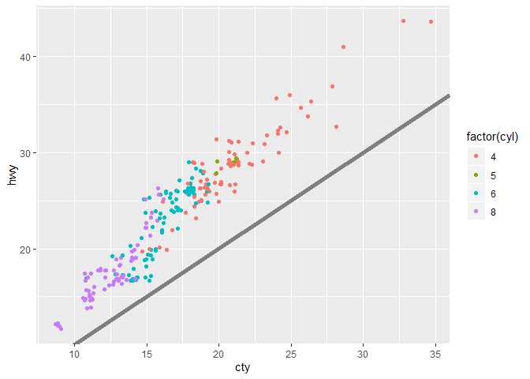
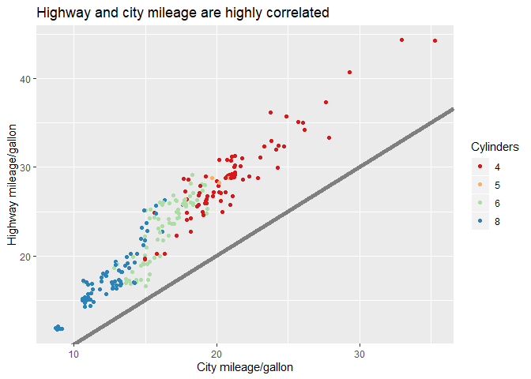
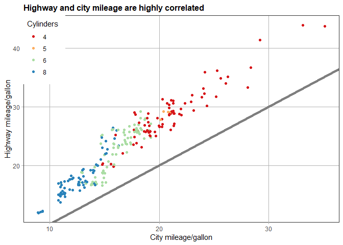
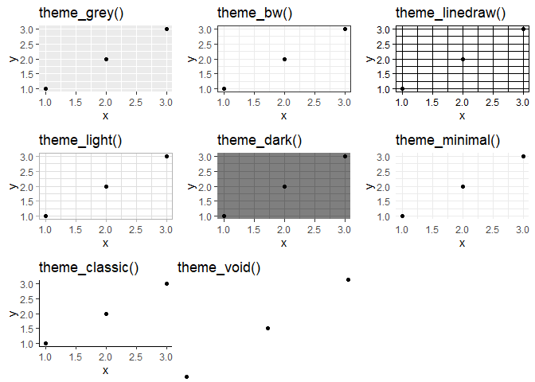
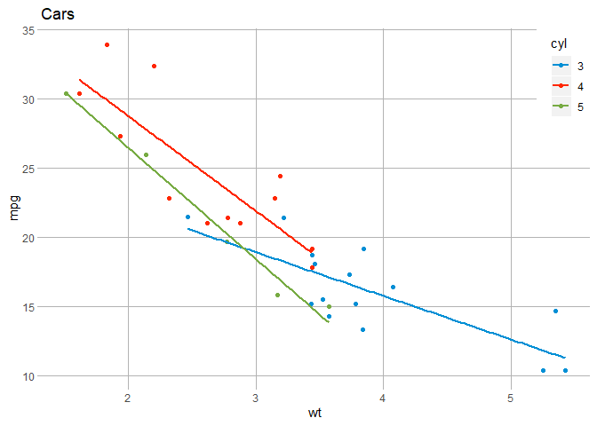
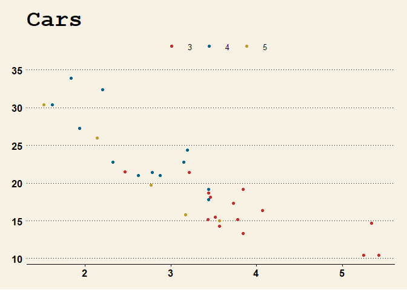

ggplot2 Elegant Graphics for Data Analysis
================
true
2018년 2월

<style>
mystyle{
    font-family :  Georgia;
    font-size : 26px;
    color : PaleVioletRed  ;
}
</style>

> <mystyle> Chapter 8 </mystyle>  
> <mystyle> Themes </mystyle>

테마 시스템은 4가지 주요소로 구성되어 있다:

  - Theme elements는 non-data요소를 명시한다. 예를 들어, plot.title요소는 플랏의 제목을,
    axis.ticks.x는 x축의 눈금을, legend.key.height는 범례의 키의 높이이다.
  - 각 성분은 element function와 연관되어 있고 이것은 성분의 시각적 요소를 설명한다. 예를 들어,
    element\_text()는 plot.title같은 폰트 사이즈, 색, 글꼴을 설정한다.
  - theme()함수는 디폴트 테마 요소를 element function을 호출함으로써 오버라이딩 한다.
    theme(plot.title = element\_text(colour = “red”))
  - 완성된 테마, theme\_grey()

<!-- end list -->

``` r
base <- ggplot(mpg, aes(cty, hwy, color = factor(cyl))) +
  geom_jitter() +
  geom_abline(colour = "grey50", size = 2)
base
```

<!-- -->

다른사람에게 플랏을 공유하거나 논문에 쓰려고 한다. 먼저,

  - 축과 범례의 레이블을 개선한다.
  - 플랏의 제목을 단다.
  - 색을 조정한다.

<!-- end list -->

``` r
labelled <- base +
  labs(
    x = "City mileage/gallon",
    y = "Highway mileage/gallon",
    colour = "Cylinders",
    title = "Highway and city mileage are highly correlated"
  ) +
  scale_colour_brewer(type = "seq", palette = "Spectral")
labelled
```

<!-- -->

다음으로, 플랏이 style guidelines of journal에 매치되도록 한다.

  - 배경색은 흰색이 되도록 하자.
  - 범례는 공간이 있다면 플랏 내부에 위치 시키자
  - 주요 가이드라인은 옅은 회색으로 부 가이드 라인은 제거한다.
  - 플랏의 제목은 12pt bold text

<!-- end list -->

``` r
styled <- labelled + 
  theme_bw() +
  theme(
    plot.title = element_text(face = "bold", size = 12),
    legend.background = element_rect(fill = "white", size = 4, colour = "white"),
    legend.position = c(0, 1),
    legend.justification = c(0, 1), # 범례 왼쪽 위 모서리 위치 설정
    axis.ticks = element_line(colour = "grey70", size = 0.2),
    panel.grid.major = element_line(colour = "grey70", size = 0.1),
    panel.grid.minor = element_blank()
  )
styled
```

<!-- --> 마지막으로
jounal은 600dpi TIFF file을 원한다.

  - theme\_bw() : 흰색 배경에 grey grid line
  - theme\_linedraw() : 흰색 배경의 다양한 검은색 선
  - theme\_light() : theme\_linedraw()에 비해 데이터에 좀 더 집중
  - theme\_dark() : theme\_light()의 dark 버전. 색상있는 선을 강조하는데 유용
  - theme\_minimal() : 배경주석이 없다.
  - theme\_classic() : x, y축과 격자선이 없다.
  - theme\_void() : 완전히 빈 테마마

<!-- end list -->

``` r
df <- data.frame(x = 1:3, y = 1:3)
base <- ggplot(df, aes(x, y)) + geom_point()
grid.arrange(
base + theme_grey() + ggtitle("theme_grey()"),
base + theme_bw() + ggtitle("theme_bw()"),
base + theme_linedraw() + ggtitle("theme_linedraw()"),
base + theme_light() + ggtitle("theme_light()"),
base + theme_dark() + ggtitle("theme_dark()"),
base + theme_minimal() + ggtitle("theme_minimal()"),
base + theme_classic() + ggtitle("theme_classic()"),
base + theme_void() + ggtitle("theme_void()"), nrow = 3, ncol = 3)
```

<!-- -->
`theme_set(theme_bw())` 와 같이 theme\_set()을 사용하면 ggplot2의 디폴트 테마를 변경할 수
있다.

``` r
library(ggthemes)
```

    ## Warning: package 'ggthemes' was built under R version 3.5.3

``` r
grid.arrange(
base + theme_tufte() + ggtitle("theme_tufte()"),
base + theme_solarized() + ggtitle("theme_solarized()"),
base + theme_excel() + ggtitle("theme_excel()"), ncol = 3)
```

<!-- -->

## Exercises

Try out all the themes in ggthemes. Which do you like the best?

``` r
p <- ggplot(mtcars, aes(x = wt, y = mpg)) +
    geom_point() +
    ggtitle("Cars")

p + geom_rangeframe() +
    theme_tufte() +
    scale_x_continuous(breaks = extended_range_breaks()(mtcars$wt)) + # 축의 구분을 변수의 범위로한다.
    scale_y_continuous(breaks = extended_range_breaks()(mtcars$mpg))
```

<!-- -->

``` r
p2 <- ggplot(mtcars, aes(x = wt, y = mpg, colour = factor(gear))) +
    geom_point() +
    ggtitle("Cars")

p2 + theme_igray() # 회색과 흰색을 inverse 
```

<!-- -->

``` r
p2 + geom_smooth(method = "lm", se = FALSE) +
    scale_color_fivethirtyeight("cyl") +
    theme(
          panel.background = element_rect(fill = "white"),
          axis.ticks = element_line(colour = "grey70"),
          panel.grid.major = element_line(colour = "grey70"),
          legend.background = element_rect(fill = "white", size = 6, colour = "white"),
          legend.justification = c(1, 1),
          legend.position = c(1, 1)
          )
```

<!-- -->

``` r
p2 + geom_smooth(method = "lm", se = FALSE) +
    scale_color_ptol("cyl") +
    theme_minimal()
```

<!-- -->

``` r
p2 + theme_wsj() + scale_colour_wsj("colors6", "") # The Wall Street Journal. 
```

<!-- -->

``` r
# 두 번째 인자를 설정해줘야한다.
```

# Modifying Theme Components

테마의 성분을 수정하기 위해서 \`plot + theme(element.name = element\_function())과 같이
코드를 작성하라. 4가지 기본 타입의 built-in element functions이 있다. 각 element
function은 외관을 통제할 매개변수의 집합을 가지고 있다.

  - `element_text()`는 레이블과 headings를 그린다. 글꼴, 글자체 , 색상, 크기, hjust,
    vjust, angle and lineheight를 조절할 수
있다.

<!-- end list -->

``` r
base_t <- base + labs(title = "This is a ggplot") + xlab(NULL) + ylab(NULL)
grid.arrange(
base_t + theme(plot.title = element_text(size = 16)),
base_t + theme(plot.title = element_text(face = "bold", colour = "red")),
base_t + theme(plot.title = element_text(hjust = 1)), ncol = 3)
```

<!-- -->

text는 또한 `margin`인자와 `margin()`함수를 가지고 있다. margin()는 네가지 인자를 가지고 있는데,
top(t), right(r), bottom(b) and left(l) sides of the text.

``` r
# The margins here look asymmetric because there are also plot margins
grid.arrange(
base_t + theme(plot.title = element_text(margin = margin())), # 제목주변의 여백이 사라짐
base_t + theme(plot.title = element_text(margin = margin(t = 10, b = 10))), # 제목 위와 아래의 여백이 생김
base_t + theme(axis.title.y = element_text(margin = margin(r = 10))), ncol = 3)
```

<!-- -->

  - `element_line()`는 색, 사이즈, linetype를 조정해 선을 그린다.

<!-- end list -->

``` r
grid.arrange(
  base + theme(panel.grid.major = element_line(colour = "black")),
  base + theme(panel.grid.major = element_line(size = 2)),
  base + theme(panel.grid.major = element_line(linetype = "dotted")), ncol = 3
)
```

<!-- -->

  - `element_rect()`는 사각형을 그린다. 대부분 배경에 이용되며 fill, colour and border
    colour, size and linetype 매개변수를 가지고 있다. plot과 panel차이 이해

<!-- end list -->

``` r
grid.arrange(
base + theme(plot.background = element_rect(fill = "grey80", colour = NA)),
base + theme(plot.background = element_rect(colour = "red", size = 2)),
base + theme(panel.background = element_rect(fill = "linen")), ncol = 3)
```

<!-- -->

  - `element_blank()` 는 아무것도 그리지 않는다.

<!-- end list -->

``` r
base
```

<!-- -->

``` r
last_plot() + theme(panel.grid.minor = element_blank())
```

<!-- -->

``` r
last_plot() + theme(panel.grid.major = element_blank()) 
```

<!-- -->

``` r
last_plot() + theme(panel.background = element_blank())
```

<!-- -->

``` r
last_plot() + theme(
  axis.title.x = element_blank(),
  axis.title.y = element_blank()
)
```

<!-- -->

``` r
last_plot() + theme(axis.line = element_line(colour = "grey50"))
```

<!-- -->

  - 그리드 단위를 설정하는 몇가지 다른 세팅이 있다. unit(1, “cm”) 또는 unit(0.25, “in”)

모든 미래의 플랏을 위해 테마 성분을 수정하기 위해 `theme_update()`를 사용해라. 이것은 이전 테마 세팅을 불러오고
본래의 매개변수를 쉽게 복구할 수 있다.

``` r
old_theme <- theme_update(
  plot.background = element_rect(fill = "lightblue3", colour = NA),
  panel.background = element_rect(fill = "lightblue", colour = NA),
  axis.text = element_text(colour = "linen"),
  axis.title = element_text(colour = "linen")
)
base
```

<!-- -->

``` r
theme_set(old_theme)
base
```

<!-- -->

# Theme Elements

plot, axis, legend, panel and facet

## Plot Elements


plot.backgorund는 플랏의 모든 것들의 기저를 이루는 사각형을 그린다. 다른 시스템에 플랏을 보낼 때 배경이 투명하도록
fill = NA를 설정할 수 있다. 마찬가지로, 이미 margin을 가지고 있는 시스템에 플랏을 끼워넣는다면 내장되어있는 여백을
제거할 수 있다. 약간의 여백은 여전히
필요하다.

``` r
base + theme(plot.background = element_rect(colour = "grey50", size = 2))
```

<!-- -->

``` r
base + theme(
  plot.background = element_rect(colour = "grey50", size = 2),
  plot.margin = margin(2, 2, 2, 2)
)
```

<!-- -->

``` r
base + theme(plot.background = element_rect(fill = "lightblue"))
```

<!-- -->

## Axis Elements


axis.text (and axis. title)은 세가지 형태에서 온다.:axis.text, axis.text.x and
axis.text.y. 두 축을 모두 수정하고 싶다면 첫번째 형태를 사용하라.

``` r
df <- data.frame(x = 1:3, y = 1:3)
base <- ggplot(df, aes(x, y)) + geom_point()

# Accentuate the axes
base + theme(axis.line = element_line(colour = "grey50", size = 1))
```

<!-- -->

``` r
# Style both x and y axis labels
base + theme(axis.text = element_text(color = "blue", size = 12))
```

<!-- -->

``` r
# Useful for long labels
base + theme(axis.text.x = element_text(angle = -90, vjust = 0.5))
```

<!-- -->

가장 흔한 조정은 x축 레이블을 오버래핑을 방지하기 위하여 회전시키는 것이다. 음수 각도가 보기 좋다. `hjust = 0`
`vjust = 1`을 설정하라.

``` r
df <- data.frame(
  x = c("label", "a long label", "an even longer label"),
  y = 1:3
)
base <- ggplot(df, aes(x, y)) + geom_point()
base
```

<!-- -->

``` r
base +
  theme(axis.text.x = element_text(angle = -30, vjust = 1, hjust = 0)) +
  xlab(NULL) +
  ylab(NULL)
```

<!-- -->

## Legend Elements


``` r
df <- data.frame(x = 1:4, y = 1:4, z = rep(c("a", "b"), each = 2))
base <- ggplot(df, aes(x, y, colour = z)) + geom_point()
grid.arrange(
base + theme(
  legend.background = element_rect(
    fill = "lemonchiffon",
    colour = "grey50",
    size = 1
  )
),
base + theme(
  legend.key = element_rect(color = "grey50"),
  legend.key.width = unit(0.9, "cm"),
  legend.key.height = unit(0.75, "cm")
),
base + theme(
  legend.text = element_text(size = 15),
  legend.title = element_text(size = 15, face = "bold")
), ncol = 3)
```

<!-- -->

이 밖에도 legned.position, legend.direction, legend.justification,
legend.box가 있다.

## Panel Elements


panel.background 와 panel.border의 차이는 background는 데이터 아래에 그려지고 border은
데이터 위에 그려진다는 것이다. panel.border를 오버라이딩 할 때는 fill = NA할당이 필요하다.

``` r
base <- ggplot(df, aes(x, y)) + geom_point()
grid.arrange(
# Modify background
base + theme(panel.background = element_rect(fill = "lightblue")),
# Tweak major grid lines
base + theme(
  panel.grid.major = element_line(color = "gray60", size = 0.8)
),
# Just in one direction
base + theme(
  panel.grid.major.x = element_line(color = "gray60", size = 0.8)
), ncol = 3)
```

<!-- -->

``` r
base2 <- base + theme(plot.background = element_rect(colour = "grey50"))
grid.arrange(
# Wide screen
base2 + theme(aspect.ratio = 9/16), #aspect ratio : 가로세로 비율
# Long and skiny
base2 + theme(aspect.ratio = 2/1),
# Square
base2 + theme(aspect.ratio = 1), ncol = 3)
```

<!-- -->

## Facetting Elements


`panel.margin`은 `panel.spacing`으로 변경되었다.

strip.text.x는 facet\_wrat()이나 facet\_grid()에게 둘다 영향을 주지만 strip.text.y는
오직 facet\_grid()에게만 영향을 준다.

``` r
df <- data.frame(x = 1:4, y = 1:4, z = c("a", "a", "b", "b"))
base_f <- ggplot(df, aes(x, y)) + geom_point() + facet_wrap(~z)
base_f
```

<!-- -->

``` r
base_f + theme(panel.spacing = unit(0.5, "in"))
```

<!-- -->

``` r
base_f + theme(
  strip.background = element_rect(fill = "grey20", color = "grey80", size = 1),
  strip.text = element_text(colour = "white")
)
```

<!-- -->

## Exercises

1.  theme dark() makes the inside of the plot dark, but not the outside.
    Change the plot background to black, and then update the text
    settings so you can still read the labels.

<!-- end list -->

``` r
base_f + theme_dark() + 
  theme(
  plot.background = element_rect(fill = "black"),
  axis.text = element_text(colour = "white"),
  axis.title = element_text(colour = "white"),
  axis.ticks = element_line(colour = "white")
                              )
```

<!-- -->

2.  Make an elegant theme that uses “linen” as the background colour and
    a serif font for the text.

<!-- end list -->

``` r
base_f + 
  ggtitle("Elegant theme using linen and serif font") +
  theme(panel.background = element_rect(fill = "linen"),
        plot.title = element_text(family = "serif"))
```

<!-- -->

3.  Systematically explore the effects of hjust when you have a
    multiline title. Why doesn’t vjust do anything?

<!-- end list -->

``` r
base_f + 
  ggtitle("Elegant theme using linen and serif font", subtitle = "Explor the effects of hjust") +
  theme(panel.background = element_rect(fill = "linen"),
        plot.title = element_text(hjust = 0.5, family = "serif"))
```

<!-- -->

# Saving Your Output

다른 프로그램에 플랏을 저장할 때 raster와 vector의 두가지 선택권이 있다.

  - Vector그래픽 : 선을 (x1, y1)에서 (x2, y2)로 그리고, (x3, x4)에서 반지름 r로 원을 그린다.
    세부사항의 손실이 없다. 가장 유용한 벡터 그래픽 포멧은 pdf와 svg이다.
  - Raster그래픽 : 픽셀의 배열로 저장되어지고 최적의 사이즈를 가진다. 가장 유욕한 레스터 그래픽은 png이다


특별한 이유가 없다면 벡터 그래픽을 사용하라. 더 보기 좋다. 레스터 그래픽을 사용하는 두 가지 주된 이유

  - 플랏에 그래픽 객체가 굉장히 많다. 벡터버전은 크고 랜더링이 느리다.
  - MS Office에 끼워 넣을때. MS는 벡터 그래픽에 대한 지원이 좋지 않다.

표준 R 접근법은 그래픽 디바이스를 열어서 플랏을 생성하여 디바이스를 닫는방법이다.

``` r
pdf("output.pdf", width = 6, height = 6)
ggplot(mpg, aes(displ, cty)) + geom_point()
dev.off()
```

이 방법은 장황하므로 `ggsave()`사용

``` r
ggplot(mpg, aes(displ, cty)) + geom_point()
ggsave("output.pdf")
```

ggsave()는 상호적인 사용에 최적화되어있다.

  - 첫번째 인자, path, 이미지가 저장되어야 할 path를 명시한다. ggsave()는 .eps, .pdf, .svg,
    .wmf, .png, .jpg, .bmp, .tiff를 생성할 수 있다.
  - width그리고 height는 출력 크기를 통제한다.
  - 레서트 그래픽을 위해(즉, .png, .jpg) dpi 인자가 플랏의 해상도를 통제한다. 디폴트는 300이지만 고출력
    해상도(600)나 web에서 사용하도록 96이 필요할 수 있다.
