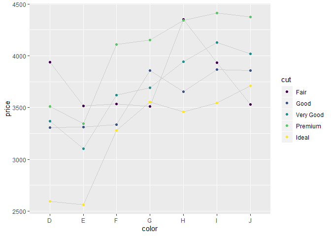
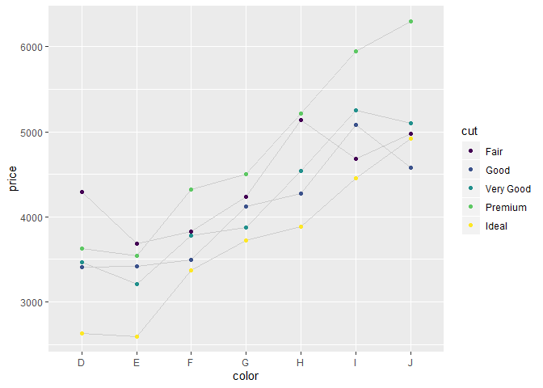
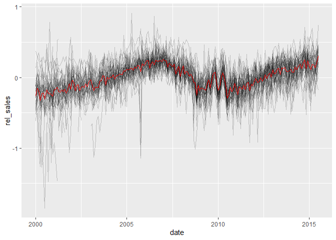

ggplot2 Elegant Graphics for Data Analysis
================
true
2018년 2월

<style>
mystyle{
    font-family :  Georgia;
    font-size : 26px;
    color : PaleVioletRed  ;
}

highlight {
  font-size: 22px;
  color: DarkRed;
}
</style>

> <mystyle> Chapter 11 </mystyle>  
> <mystyle>Modelling for Visualisation </mystyle>

**reference** :
<https://cran.r-project.org/web/packages/broom/vignettes/broom.html>

# Removing Trend

diamonds데이터에서 price는 size에 대해 강한 선형 관계를 가지고 있다. 이것은 좋은 품질의 다이아는 싸기 때문에
cut, colour 그리고 clarity에 대한 영향을 보기가 어렵다. 이러한 문제를 **confounding**(혼합) 라고
한다. 선형 모델을 사용하여 price에 대한 size의 영향을 제거해보자. *raw price* 대신에 *relative
price*(같은 크기의 평균 다이아와 비교해 얼마나 가치가 있는가)를 살펴보자.

<!-- -->

크기가 2케럿 이하인 다이아몬드(데이터셋의 96%)에 중점을 둘 것이다. 이것은 몇가지 부수적인 문제를 해결 해 줄 것이다.

<!-- -->

<span style="background : yellow">잔차를 살펴봄으로써 경향을 뺄 수 있다. </span> 잔차는 그
크기의 ‘평균’ 다이아에 비례하는 가격을 알려준다. y축에 해당하는 rel\_price는 잔차이다.

<!-- -->

로그 변환 가격이기 때문에 해석하는 것이 조금
어렵다.\(log2(price) - log2(expetedprice) = log2(price/expectedprice)\).
원래의 스케일에 역변환(\(2^x\))를 하면 price/expetedprice를 얻는다. 이것이 값을 좀 더 해석가능하게 하지만
로그의 대칭속성은 희생한다.

``` r
xgrid <- seq(-2, 1, by = 1/3)
data.frame(logx = xgrid, x = round(2 ^ xgrid, 2))
```

    ##          logx    x
    ## 1  -2.0000000 0.25
    ## 2  -1.6666667 0.31
    ## 3  -1.3333333 0.40
    ## 4  -1.0000000 0.50
    ## 5  -0.6666667 0.63
    ## 6  -0.3333333 0.79
    ## 7   0.0000000 1.00
    ## 8   0.3333333 1.26
    ## 9   0.6666667 1.59
    ## 10  1.0000000 2.00

log스케일의 1의 변화가 기존 스케일의 2배에 대응하기 때문에 \(log2()\)를 \(log()\)대신에 사용한다.

가격과 상대가격 둘 다를 이용해서 색과 cut이 다이아 값에 영향을 얼마나 끼치는지를 보자.

``` r
color_cut <- diamonds2 %>%
  group_by(color, cut) %>%
  summarise(
    price = mean(price),
    rel_price = mean(rel_price)
  )
```

가격을 살펴보는 것만으로는 품질이 가격에 어떤 영향을 끼치는지 알기 어렵다. 크기와 품질이 뒤죽박죽이다.

``` r
ggplot(color_cut, aes(color, price)) +
  geom_line(aes(group = cut), colour = "grey80") +
  geom_point(aes(colour = cut))

ggplot(color_cut, aes(color, rel_price)) +
  geom_line(aes(group = cut), colour = "grey80") +
  geom_point(aes(colour = cut))
```



이 기법은 다양한 상황에서 사용되어진다. <span style="background : yellow">플랏에서 강한 패턴을
명시적으로 모델링 할 수 있는 곳이라면 강한 패턴을 제거해서 흥미로운 추세를 확인 할 수 있다. </span>

## Exercises

1.  What happens if you repeat the above analysis with all diamonds?
    (Not just all diamonds with two or fewer carats). What does the
    strange geometry of log(carat) vs relative price represent? What
    does the diagonal line without any points represent?

<!-- end list -->

``` r
diamonds3 <- diamonds %>% 
  mutate(
    lprice = log2(price),
    lcarat = log2(carat)
  )
ggplot(diamonds3, aes(lprice, lcarat)) +
  geom_bin2d() +
  geom_smooth(method = "lm", se = FALSE, colour = "yellow", size = 2)
```

<!-- -->

``` r
mod2 <- lm(lprice ~ lcarat, data = diamonds3)
diamonds3 <- diamonds3 %>% 
  mutate(rel_price = resid(mod2))
ggplot(diamonds3, aes(lcarat, rel_price)) +
  geom_bin2d()
```

<!-- -->

``` r
color_cut2 <- diamonds3 %>% 
  group_by(color, cut) %>% 
  summarise(
    price = mean(price),
    rel_price = mean(rel_price)
  )
```

``` r
ggplot(color_cut2, aes(color, price)) +
  geom_line(aes(group = cut), colour = "grey80") +
  geom_point(aes(colour = cut))
ggplot(color_cut2, aes(color, rel_price)) +
  geom_line(aes(group = cut), colour = "grey80") +
  geom_point(aes(colour = cut))
```


2. I made an unsupported assertion that lower-quality diamonds tend to
be larger. Support my claim with a plot.

``` r
model <- lm(log2(carat) ~ log2(price), data = diamonds)
diamonds_carat <- diamonds %>% 
  mutate(rel_carat = resid(model))

color_cut2 <- diamonds_carat %>%
  group_by(color, cut, clarity) %>% 
  mutate(
    n = n(),
    mean_carat = mean(carat),
    rel_carat = mean(rel_carat),
    lq = quantile(carat, 0.25),
    uq = quantile(carat, 0.75)
    )

ggplot(color_cut2, aes(color, carat)) +
  geom_line(aes(group = cut)) +
  geom_point(aes(colour = cut, size = n)) +
  facet_wrap(~clarity) +
  scale_size_area() +
  theme_bw()
```

<!-- -->

``` r
ggplot(color_cut2, aes(color, rel_carat)) +
  geom_line(aes(group = cut)) +
  geom_point(aes(colour = cut, size = n)) +
  facet_wrap(~clarity) +
  scale_size_area() +
  theme_bw()
```

<!-- --> n이 작은
품질을 제외하면 품질이 좋지 않은 다이아가 케럿이 크다고 할 수 있다. 상대케럿을 사용했을 때 두드러진다.

3.  Can you create a plot that simultaneously shows the effect of
    colour, cut, and clarity on relative price? If there’s too much
    information to show on one plot, think about how you might create a
    sequence of plots to convey he same message.

<!-- end list -->

``` r
model <- lm(log2(price) ~ log2(carat), data = diamonds)
diamonds_temp <- mutate(diamonds, rel_price = resid(model))
diamonds_price <- diamonds_temp %>% 
  group_by(color, cut, clarity) %>% 
  summarise(
    mean_price = mean(price),
    rel_price = mean(rel_price),
    n = n()
  )

ggplot(diamonds_price, aes(color, rel_price, colour = cut)) +
  geom_point(aes(size = n)) +
  geom_line(aes(group = cut)) +
  facet_wrap(~clarity) +
  scale_size_area()
```

<!-- --> n이 작은것을
다이아를 제외하면 높은 품질의 다이아가 더 비싸다.

# Texax Housing data

2000년 1월부터 2015년 4월까지 기록된 46개의 텍사스 도시에 대한 데이터이다.

  - sales : 판매된 주택 수
  - volume : 총판매액
  - median : 판매 중앙값
  - listings : 판매용으로 목록에 오른 주택수
  - inventory : 재고 보유 개월 수

<!-- end list -->

``` r
ggplot(txhousing, aes(date, sales)) +
geom_line(aes(group = city), alpha = 1/2)
```

    ## Warning: Removed 430 rows containing missing values (geom_path).

<!-- -->

위 그래프는 두가지 문제가 있다.

  - 도시의 규모에 따라 판매량 범위의 차이
  - 강한 계절 추세가 있다. 여름이 겨울보다 판매량이 높다.

첫번째 문제를 해결하기 위해 판매량에 로그를 취했다.

``` r
ggplot(txhousing, aes(date, log(sales))) +
  geom_line(aes(group = city), alpha = 1/2)
```

    ## Warning: Removed 430 rows containing missing values (geom_path).

<!-- -->

이번에 월별 효과를 제거하기 위해 범주형 변수를 사용할 것이다. 먼저, 하나의 도시에 작동하는 기술을 확인한다. 문제가 발생하면
원인을 정확히 찾아내기 위해 간단한 문제부터 시작하는것은 좋은 생각이다.

``` r
abilene <- txhousing %>% filter(city == "Abilene")
ggplot(abilene, aes(date, log(sales))) +
  geom_line()
```

<!-- -->

``` r
mod <- lm(log(sales) ~ factor(month), data = abilene)
abilene$rel_sales <- resid(mod)
ggplot(abilene, aes(date, rel_sales)) +
  geom_line()
```

<!-- -->

`na.action = na.exclude` 에 주의하자. 이 인수가 없다면 NA가 있던 자리가 사라지므로 값들의 순서가 이상해
진다.

  - na.action = na.omit : NA가 포함된 행을 제외하고 모델을 만들고 resid()의 결과도 제외
  - na.action = na.exlude : NA가 포함된 행을 제외하지만 resid()의 결과에서 NA가 포함된 행은
    잔차를 NA로 해서 추가한다.

<!-- end list -->

``` r
deseas <- function(x, month) {
  resid(lm(x ~ factor(month), na.action = na.exclude))
}
txhousing <- txhousing %>%
  group_by(city) %>%
  mutate(rel_sales = deseas(log(sales), month))
ggplot(txhousing, aes(date, rel_sales)) +
  geom_line(aes(group = city), alpha = 1/5) +
  stat_summary(geom = "line", fun.y = "mean", colour = "red")
```

    ## Warning: Removed 568 rows containing non-finite values (stat_summary).

    ## Warning: Removed 430 rows containing missing values (geom_path).

<!-- --> 2002 ~
2007년에 증가 2010년에 떨어졌다가(노이즈있음) 그 이후 반등한다. 계절적 추세를 제거하면서 절편 또 한 제거되었다. 각
도시의 평균 판매량 수 대비 추세를 볼 수 있다.

## Exercises

1.  The final plot shows a lot of short-term noise in the overall trend.
    How could you smooth this further to focus on long-term changes?

<!-- end list -->

``` r
deseas <- function(x, month) {
  resid(lm(x ~ factor(month), na.action = na.exclude))
}
ggplot(txhousing, aes(date, rel_sales)) +
  geom_line(aes(group = city), alpha = 1/5) +
  geom_smooth(stat = "smooth", colour = "red", method="auto")
```

    ## `geom_smooth()` using method = 'gam' and formula 'y ~ s(x, bs = "cs")'

    ## Warning: Removed 568 rows containing non-finite values (stat_smooth).

    ## Warning: Removed 430 rows containing missing values (geom_path).

<!-- -->

``` r
ggplot(txhousing, aes(date, rel_sales)) +
  geom_line(aes(group = city), alpha = 1/5) +
  geom_smooth(method = "lm", formula = y ~ splines::bs(x, df = 15, degree = 3), se = FALSE)
```

    ## Warning: Removed 568 rows containing non-finite values (stat_smooth).
    
    ## Warning: Removed 430 rows containing missing values (geom_path).

<!-- -->

2.  If you look closely (e.g. + xlim(2008, 2012)) at the long-term trend
    you’ll notice a weird pattern in 2009–2011. It looks like there was
    a big dip in 2010. Is this dip “real”? (i.e. can you spot it in the
    original data)

<!-- end list -->

``` r
ggplot(txhousing, aes(date, rel_sales)) +
  geom_line(aes(group = city), alpha = 1/5) +
  stat_summary(geom = "line", fun.y = "mean", colour = "red") +
  xlim(2008, 2012)
```

    ## Warning: Removed 6377 rows containing non-finite values (stat_summary).

    ## Warning: Removed 6376 rows containing missing values (geom_path).

<!-- -->

``` r
txhousing %>% 
  filter(year >= 2009 & year <= 2011) %>% 
  select(city, year, month, sales)
```

    ## # A tibble: 1,656 x 4
    ## # Groups:   city [46]
    ##    city     year month sales
    ##    <chr>   <int> <int> <dbl>
    ##  1 Abilene  2009     1    70
    ##  2 Abilene  2009     2   106
    ##  3 Abilene  2009     3   131
    ##  4 Abilene  2009     4   157
    ##  5 Abilene  2009     5   143
    ##  6 Abilene  2009     6   187
    ##  7 Abilene  2009     7   158
    ##  8 Abilene  2009     8   149
    ##  9 Abilene  2009     9   128
    ## 10 Abilene  2009    10   151
    ## # ... with 1,646 more rows

3.  What other variables in the TX housing data show strong seasonal
    effects? Does this technique help to remove them?

<!-- end list -->

``` r
deseas <- function(x, month) {
  resid(lm(log(x) ~ factor(month), na.action = na.exclude))
}
library(lazyeval)
```

    ## Warning: package 'lazyeval' was built under R version 3.5.3

    ## 
    ## Attaching package: 'lazyeval'

    ## The following objects are masked from 'package:purrr':
    ## 
    ##     is_atomic, is_formula

``` r
rel <- function(df, grp.var, y, month, date) {
  temp <- df %>% 
   group_by_(grp.var) %>% 
   mutate_(rel_volume = interp(~deseas(y, month), y = as.name(y), month = as.name(month)))
   g <- ggplot(temp, aes_string(date, "rel_volume")) +
  geom_line(aes_string(group = grp.var)) +
  stat_summary(geom = "line", fun.y = "mean", colour = "red", size = 1)
  g
}
rel(txhousing, "city", "volume", "month", "date")
```

    ## Warning: group_by_() is deprecated. 
    ## Please use group_by() instead
    ## 
    ## The 'programming' vignette or the tidyeval book can help you
    ## to program with group_by() : https://tidyeval.tidyverse.org
    ## This warning is displayed once per session.

    ## Warning: mutate_() is deprecated. 
    ## Please use mutate() instead
    ## 
    ## The 'programming' vignette or the tidyeval book can help you
    ## to program with mutate() : https://tidyeval.tidyverse.org
    ## This warning is displayed once per session.

    ## Warning: Removed 568 rows containing non-finite values (stat_summary).

    ## Warning: Removed 430 rows containing missing values (geom_path).

<!-- -->

``` r
rel(txhousing, "city", "median", "month", "date")
```

    ## Warning: Removed 616 rows containing non-finite values (stat_summary).

    ## Warning: Removed 446 rows containing missing values (geom_path).

<!-- -->

``` r
# rel(txhousing, "city", "listings", "month", "date")
# rel(txhousing, "city", "inventory", "month", "date")
# 0을 제거해야한다.
```

lazy evaluation에 관해서는 adv-R과
<https://cran.r-project.org/web/packages/lazyeval/vignettes/lazyeval.html>
를 참고하자. `?interp`

4.  Not all the cities in this data set have complete time series. Use
    your dplyr skills to figure out how much data each city is missing.
    Display the results with a visualisation.

완전한 시계열이 특정월이 없다는 뜻인가 싶어서 확인해보았다.

``` r
count <- txhousing %>% 
  group_by(city) %>% 
  summarise(n = n()) 
count$true <- ifelse(count$n != 187, 1, 0)
ggplot(count, aes(true)) +
  geom_bar()
```

<!-- --> 아닌 것
같다.

따라서 각 변수들이 결측치가 있는지로 확인.

``` r
f <- function(x) {
  ifelse(sum(is.na(x)) != 0,"incomplete","complete")
}
count <- txhousing %>% 
  group_by(city) %>% 
  summarise_at(vars(sales:inventory), f) %>% 
  gather(var, is_complete, -city)
  
ggplot(count, aes(is_complete)) +
  geom_bar() +
  facet_wrap(~var, ncol = 1)
```

<!-- --> 여기서
`summarise_at` 대신 `for`문이나 `apply`를 사용하면 느리다.

# Visualising Models

앞의 예제에서는 선형 모델을 경향 제거 도구로만 이용하였다. 하지만 모델 자체에는 유용한 정보가 포함되어 있고, 해결 할 수 있는
많은 새로운 문제가 있다.

  - 모델이 잘 적합하지 않는 도시에 관심이 있을 수 있다. 형편없이 적합된 모델은 계절적 패턴이 없고 모든 도시가 비슷한
    패턴을 공유한다는 암시적 가설을 모순시킨다.
  - 계수 자체도 흥미롭다. 이 경우, 계수를 보면 계절적 패턴이 도시마다 어떻게 다양한지를 알 수 있다.
  - 모델 자체의 세부 사항에 대해 자세히 살펴보고 각 관찰에 대해 내용을 정확히 볼 수 있다. 이 데이터의 경우 데이터 입력
    오류를 나타내는 의심스러운 데이터 점을 찾는 데 도움이 될 수 있다.

데이터를 이용하기 위해서, 모델을 저장할 필요가 있다. `dplyr::do()`를 사용하자. 이것은 임의의 계산 결과를 한 열에
저장할 수 있게 해준다.

``` r
models <- txhousing %>% 
  group_by(city) %>% 
  do(mod = lm(
    log2(sales) ~ factor(month),
    data = .,
    na.action = na.exclude
  ))
models
```

    ## Source: local data frame [46 x 2]
    ## Groups: <by row>
    ## 
    ## # A tibble: 46 x 2
    ##    city                  mod   
    ##  * <chr>                 <list>
    ##  1 Abilene               <lm>  
    ##  2 Amarillo              <lm>  
    ##  3 Arlington             <lm>  
    ##  4 Austin                <lm>  
    ##  5 Bay Area              <lm>  
    ##  6 Beaumont              <lm>  
    ##  7 Brazoria County       <lm>  
    ##  8 Brownsville           <lm>  
    ##  9 Bryan-College Station <lm>  
    ## 10 Collin County         <lm>  
    ## # ... with 36 more rows

이 코드에는 중요한 두 가지 사항이 있다.

  - `do()`는 새로운 열 **mod**를 생성한다. 이것은 열의 특수한 타입이다. 원자형 벡터(논리, 정수, 수치,
    문자)를 포함하는 대신에 리스트이다. 리스트는 R의 가장 유연한 데이터 구조이며 선형 모형을 포함해서 어떤 것도
    담을 수 있다.
  - `.`은 `do()`가 사용하는 특수항 대명사이다. ‘현재’ 데이터 프레임을 나타낸다. 이 예제에서는 `do()`는 모델을
    46번 적합하는데(즉, 각 도시에 한번씩) 매번 .을 한 도시에 대한 데이터로 대체한다.

숙련된 모델러라면, 왜 모든 도시를 동시에 적합하지 않는지 궁굼해 할 것이다. 간단하게 시작하는 것이 유용하다. 도시마다
개별적으로 작동하는 모델이 생기면, 모든 도시를 동시에 적합하는데 일반화하는 방법을 알아 낼 수 있다.

이러한 모델을 시각화하기 위해, tidy데이터 프레임으로 바꿀 것이다. **broom**패키지를 사용할 것이다.

  - `glance()`는 각 모델에 대해 한 행의 데이터로 **model-level summarises**을 추출한다.
    \(R^2\)와 자유도 같은 요약 통계를 포함한다.
  - `tidy()`는 각 모델에 대해 각 계수에 대한 하나의 행을 가지는 **coefficient-level
    summaries**을 추출한다. 추정치 및 표준 오차 같은 개별 계수에 관한 정보를 포함한다.
  - `augment()`는 각 모델의 각 관측에 대해 하나의 행을 가지는 **observation-level
    summaries**을 추출한다. 이상치 진단에 유용한 잔차와 영향 행렬같은 변수를 포함한다.

# Model-Level Summaries

``` r
model_sum <- models %>% glance(mod)
ggplot(model_sum, aes(r.squared, reorder(city, r.squared))) +
  geom_point()
```

<!-- -->

\(r^2\)가 정확히 무엇을 의미하는 지 알기 어렵기 때문에 \(r^2\)가 가장큰 3개의 도시와 가장작은 3개의 도시를 보자.

``` r
bottom3 <- model_sum %>% 
  arrange(r.squared) %>% 
  pull(city) %>% 
  head(3)
top3 <- model_sum %>% 
  arrange(desc(r.squared)) %>% 
  pull(city) %>% 
  head(3)

extreme <- txhousing %>% ungroup() %>%
  filter(city %in% c(top3, bottom3), !is.na(sales)) %>%
  mutate(city = factor(city, c(top3, bottom3)))

ggplot(extreme, aes(month, log(sales))) +
  geom_line(aes(group = year)) +
  facet_wrap(~city)
```

<!-- -->

\(r^2\)가 높은 도시에 대해서는 년도별 sales의 분산이 작고 계절적 추세가 강하며 낮은 도시에 대해서는 년도별
sales의 분산이 크고 계절적 추세가 약하다.

## Exercises

1.  Do your conclusions change if you use a different measurement of
    model fit like AIC or deviance? Why/why not?

우선 devaince에 대해서는 GLM공부를 하자.

``` r
ggplot(model_sum, aes(reorder(city, AIC), AIC)) +
  geom_point() +
  coord_flip()
```

<!-- -->

``` r
bottom3 <- model_sum %>% 
  arrange(AIC) %>% 
  pull(city) %>% 
  head(3)

top3 <- model_sum %>% 
  arrange(desc(AIC)) %>% 
  pull(city) %>% 
  head(3)

extreme <- txhousing %>% ungroup() %>% 
  filter(city %in% c(top3, bottom3), !is.na(sales)) %>% 
  mutate(city = factor(city, c(top3, bottom3)))

ggplot(extreme, aes(month, log(sales))) +
  geom_line(aes(group = year)) +
  facet_wrap(~city)
```

<!-- -->

\(AIC = nlog(RSS_{pc}/n) + 2p_c\) AIC는 RSS(Lack of fit)가 작고 변수의
수(Complexity)가 작을수록 작다. AIC가 큰 모형은 노이즈가 큰, 자기상관이 없는 모형이다.

2.  One possible hypothesis that explains why McAllen, Harlingen and
    Brownsville have lower R2 is that they’re smaller towns so there are
    fewer sales and more noise. Confirm or refute this hypothesis.

<!-- end list -->

``` r
low_volume_city <- txhousing %>% 
  filter(!is.na(volume)) %>% 
  group_by(city) %>% 
  summarise(mean_volume = mean(volume)) %>% 
  arrange(mean_volume) %>% 
  head(20) %>% 
  select(city)
low_rsq_city <- model_sum %>% 
  arrange(r.squared) %>% 
  head(20) %>% 
  select(city)
sum(low_volume_city$city %in% low_rsq_city$city)
```

    ## [1] 12

작은 마을이 노이즈가 큰지(알스퀘어가 작은지)를 작은 마을 20개와 알스퀘어가 작은 마을 20개를 서로 비교하였더니 20개중 단
12개 만이 일치하였다. 따라서 귀무가설을 기각하지 못한다.

3.  McAllen, Harlingen and Brownsville seem to have much more
    year-to-year variation than Bryan-College Station, Lubbock, and NE
    Tarrant County.How does the model change if you also include a
    linear trend for year? (i.e.log(sales) ˜ factor(month) + year)

<!-- end list -->

``` r
models <- txhousing %>%
  group_by(city) %>%
  do(mod = lm(
    log2(sales) ~ factor(month) + year,
    data = .,
    na.action = na.exclude
  ))
model_sum <- models %>% glance(mod)

ggplot(model_sum, aes(r.squared, reorder(city, r.squared))) +
  geom_point()
```

<!-- -->

``` r
top3 <- c("Bryan-College Station", "Fort Bend", "Lubbock")
bottom3 <- c("McAllen", "Brownsville", "Port Arthur")

extreme <- txhousing %>% ungroup() %>%
  filter(city %in% c(top3, bottom3), !is.na(sales)) %>%
  mutate(city = factor(city, c(top3, bottom3)))

ggplot(extreme, aes(month, log(sales))) +
  geom_line(aes(group = year)) +
  facet_wrap(~city)
```

<!-- -->

``` r
ggplot(extreme, aes(year + (month - 1) / 12, log(sales))) +
  geom_line() +
  facet_wrap(~city)
```

<!-- -->
\(R^2\)가 큰 도시가 확실히 noise가 작음을 알 수 있다.

4.  Create a faceted plot that shows the seasonal patterns for all
    cities. Order the facets by the R2 for the city.

<!-- end list -->

``` r
models <- txhousing %>% 
  group_by(city) %>% 
  do(mod = lm(log(sales) ~ factor(month),
              data = .,
              na.action = na.exclude)
     )
model_sum <- models %>% glance(mod)

order_rsq <- model_sum %>% 
  arrange(r.squared) %>% 
  pull(city)

temp <- txhousing %>% ungroup() %>% 
  filter(!is.na(sales)) %>% 
  mutate(city = factor(city, order_rsq))

ggplot(temp, aes(month, log(sales))) +
  geom_line(aes(group = year)) +
  facet_wrap(~city)
```

<!-- -->

# Coefficient-Level Summaries

모델 수준 요약에서는 계절성에 중요한 차이가 있다는 것을 의미했다. 좀 더 자세히 알아보기 위해 `tidy()`로 계수를 추출해
보자.

정규표현식 “+” 에서 “”는 0-9(임의의 수)을 찾고 “+”는 1개 이상의 수를 의미한다. `grep()` 와
`grepl()`의 차이점은 grep는 행 번호를 출력하지만, grepl은 논리값으로 출력한다.

`extract(data, col, into, regex = "([[:alnum:]]+)", remove = TRUE,
convert = FALSE, ...)` into : 새로운 변수의 이름 regex : a regular expression

``` r
coefs <- models %>% tidy(mod)
months <- coefs %>% 
  filter(grepl("factor", term)) %>% 
  extract(term, "month", "(\\d+)", convert = TRUE)
ggplot(months, aes(month, 2 ^ estimate)) + #계수를 해석하기 쉽고자
  geom_line(aes(group = city))
```

<!-- -->

패턴은 도시별로 비슷해 보이고 주요 차이점은 계절적 영향의 강도이다.

``` r
coef_sum <- months %>%
  group_by(city) %>%
  summarise(max = max(estimate))
ggplot(coef_sum, aes(2 ^ max, reorder(city, max))) +
  geom_point()
```

<!-- -->

The cities with the strongest seasonal effect are College Station and
San Marcos (both college towns) and Galveston and South Padre Island
(beach cities). It makes sense that these cities would have very strong
seasonal effects. 하지만 왜 계수가 큰 것이 강한 계절적 추세를 의미하는 것일까? 나의 답 : max보다는
mean으로 해야 할 것 같긴 한데..일단 받아 들이고 실험계획법에 따르면 effect는 회귀 계수의 배수.

## Exercises

1.  Pull out the three cities with highest and lowest seasonal effect.
    Plot their coefficients.

<!-- end list -->

``` r
bottom3 <- coef_sum %>% 
  arrange(max) %>% 
  pull(city) %>% 
  head(3)

top3 <- coef_sum %>% 
  arrange(desc(max)) %>% 
  pull(city) %>% 
  head(3)

temp <- coefs %>% 
  filter(city %in% c(top3, bottom3), grepl("factor", term)) %>%
  mutate(city_top = ifelse(city %in% top3, "top3", "bottom3")) %>% 
  extract(term, "month", "(\\d+)", convert = TRUE)

ggplot(temp, aes(month, 2^estimate, colour = factor(city_top))) +
  geom_line(aes(group = city)) +
  scale_color_discrete("계절적 효과")
```

<!-- -->

2.  How does strength of seasonal effect relate to the R2 for the model?
    Answer with a plot.

<!-- end list -->

``` r
temp <- left_join(model_sum, coef_sum, by = "city")
ggplot(temp, aes(2^max, r.squared)) +
  geom_point() +
  geom_smooth(method = "lm")
```

<!-- --> 계절적 추세가
강할수록 R^2도 증가한다.

3.  You should be extra cautious when your results agree with your prior
    beliefs. How can you confirm or refute my hypothesis about the
    causes of strong seasonal patterns?

내가 생각한 계절적 추세의 강함은 도시의 크기와 비례한다.

``` r
volume <- txhousing %>% 
  group_by(city) %>% 
  summarise(mean_vol = mean(volume))
temp <- left_join(coef_sum, volume, by = "city")
ggplot(temp, aes(log(mean_vol), 2^max)) +
  geom_point() +
  geom_smooth(method = "lm")
```

    ## Warning: Removed 20 rows containing non-finite values (stat_smooth).

    ## Warning: Removed 20 rows containing missing values (geom_point).

<!-- -->

크기와 계절적 추세의 강함은 전혀 관련이 없어 보인다.

이전에 계절적 효과가 가장 큰 도시가 대학 도시와 해변 도시임을 고려했을 때 이런 도시가 실제로 계절적 효과가 큰것인가를 확인
해보고싶지만 txhousing데이터에서 이런 위치에 있는 도시인지를 확인하는 것은 어렵다. 위치를 나타내는 데이터를 추가로
확보해야 한다.

<highlight>중요\!\!</highlight> 4. Group the diamonds data by cut, clarity
and colour. Fit a linear model log(price) ~ log(carat). What does the
intercept tell you? What does the slope tell you? How do the slope and
intercept vary across the groups? Answer with a plot.

절편의 의미는 케럿이 고정되어 있을 때, 품질에 따른 다이아 가격의 차이를 알 수 있고, slope는 품질에 따라 케럿이 커짐에
따라 가격의 높아짐의 정도를 측정할 수 있다(회귀 계수의 의미).

``` r
models <- diamonds %>% 
  group_by(cut, clarity, color) %>%
  do(mod = lm(
              log(price) ~ log(carat),
              data = .,
              na.action = na.exclude
              )
     )
models_sum <- models %>% glance(mod)
models_coef <- models %>% tidy(mod)

temp <- models_coef %>% 
  left_join(models_sum, by = c("cut", "clarity", "color"))

ggplot(filter(temp, term == "log(carat)"), aes(color, exp(estimate))) +
  geom_point(aes(colour = cut, size = df.residual)) +
  geom_line(aes(group = cut), colour = "grey60") +
  facet_wrap(~clarity) +
  scale_size_area()
```

좋은 품질의 다이아의 케럿에 따른 가격의 효과는 품질이 더 좋다고 해서 효과의 크기가 크다고 할 수 없다. 즉, 효과의 크기는
선형성이 없다.

``` r
ggplot(filter(temp, term != "log(carat)"), aes(color, exp(estimate))) +
  geom_point(aes(colour = cut, size = df.residual)) +
  geom_line(aes(group = cut), colour = "grey60") +
  facet_wrap(~clarity) +
  scale_size_area()
```

절편은 좋은 품질의 다이아 일수록 가격이 더 비쌈을 의미한다.

결론을 내리면, 좋은 품질의 다이아가 비싸다고 말할 수 있지만 케럿이 커짐에 따라 가격이 비싸지는 정도는 품질에 따라 관련이
없다.

# Observation Data

Observation-level data란 회귀진단을 할 때 유용한 레버리지 포인트, 잔차 등을 포함한 데이터.
`augment()`로 추출.

``` r
models <- txhousing %>%
group_by(city) %>%
do(mod = lm(
            log2(sales) ~ factor(month),
            data = .,
            na.action = na.exclude
))
model_sum <- models %>% glance(mod) %>% 
  arrange(desc(r.squared))
obs_sum <- models %>% augment(mod)

ggplot(obs_sum, aes(.std.resid)) +
geom_histogram(binwidth = 0.1)
```

<!-- -->

``` r
ggplot(obs_sum, aes(abs(.std.resid))) +
geom_histogram(binwidth = 0.1)
```

<!-- -->

``` r
 obs_sum %>%
 filter(abs(.std.resid) > 2) %>%
 group_by(city) %>%
 summarise(n = n(), avg = mean(abs(.std.resid))) %>%
 arrange(desc(n))
```

    ## # A tibble: 43 x 3
    ##    city                      n   avg
    ##    <chr>                 <int> <dbl>
    ##  1 Texarkana                12  2.43
    ##  2 Harlingen                11  2.73
    ##  3 Waco                     11  2.96
    ##  4 Victoria                 10  2.49
    ##  5 Brazoria County           9  2.31
    ##  6 Brownsville               9  2.48
    ##  7 Bryan-College Station     9  2.27
    ##  8 Killeen-Fort Hood         9  2.23
    ##  9 Laredo                    9  2.87
    ## 10 Nacogdoches               9  2.15
    ## # ... with 33 more rows

## Exercises

1.  A common diagnostic plot is fitted values (.fitted) vs. residuals
    (.resid). Do you see any patterns? What if you include the city or
    month on the same plot?

<!-- end list -->

``` r
ggplot(obs_sum, aes(.fitted, .resid)) +
  geom_point(aes(colour = factor.month.)) +
  facet_wrap(~city)
```

<!-- --> 여름이
적합치가 높음을 알 수 있다.

2.  Create a time series of log(sales) for each city. Highlight points
    that have a standardised residual of greater than 2.

<!-- end list -->

``` r
temp <- left_join(txhousing, obs_sum, by = "city")
temp$outlier <- ifelse(abs(temp$.std.resid) > 2, 1, 0)
sum(temp$outlier)
```

    ## [1] 50116

``` r
nrow(temp)
```

    ## [1] 1502358

``` r
ggplot(temp, aes(date, log(sales))) +
   geom_line() +
   geom_point(data = filter(temp, outlier==1), colour = "red") +
   facet_wrap(~city)
```

    ## Warning: Removed 3224 rows containing missing values (geom_point).

<!-- -->

150만개의 관측치 중에 5만개가 outlier로 의심되는 상황이다. 지나치게 점들이 많아서 빨갛게 보인다..

# Bonus

``` r
# An example with highly skewed distributions:
if (require("ggplot2movies")) {
  set.seed(596)
  mov <- movies[sample(nrow(movies), 1000), ]
  m2 <- ggplot(mov, aes(x = factor(round(rating)), y = votes)) + geom_point()
  m2 <- m2 + stat_summary(fun.data = "mean_cl_boot", geom = "crossbar",
                          colour = "red", width = 0.3) + xlab("rating")
  m2
  # Notice how the overplotting skews off visual perception of the mean
  # supplementing the raw data with summary statistics is _very_ important
  
  # Next, we'll look at votes on a log scale.
  
  # Transforming the scale means the data are transformed
  # first, after which statistics are computed:
  m2 + scale_y_log10()
  # Transforming the coordinate system occurs after the
  # statistic has been computed. This means we're calculating the summary on the raw data
  # and stretching the geoms onto the log scale.  Compare the widths of the
  # standard errors.
  m2 + coord_trans(y="log10")
}
```

    ## Loading required package: ggplot2movies

    ## Warning: package 'ggplot2movies' was built under R version 3.5.2

    ## Warning: Computation failed in `stat_summary()`:
    ## Hmisc package required for this function

<!-- -->

  - `require()` : require is designed for use inside other functions; it
    returns FALSE and gives a warning if the package does not exist.
  - `library()` : 로드된 패키지를 문자벡터로 반환. 패키지가 없으면 에러 메세지 반환

# Summary

  - removing trend : 가장 강한 추세를 경우에 따라 걷어내자. 상대가격을 통해 추세를 살펴보자.
  - backtransformation : 해석을 용이하게 하기 위하여
  - 규모에 따른 차이를 제거하기 위해 로그를 취한다.
  - 계절적 추세를 제거하기위해 lm(반응변수 ~ factor(month))에서 resid사용
  - na.action = na.xclude : NA가 있는 행을 제거하지 않고 NA로 채움.
  - 장기적 추세를 확인하는 방법중 하나는 `geom_smooth(method = "lm", formula = y ~
    splines::bs(x, df = 15, degree = 3), se = FALSE)`
  - lazay-evaluation 대신에 standard-evaluation을 사용하기 위해 `함수이름_`을 사용한다.
  - `grepl()`과 `extract()`과 정규표현식 : `"\\d+"`의 사용
  - `glance()` : 모형비교의 유용한
    \(R^2, AIC, BIC, deviation, df.residual, p.value\) 등을 제공
  - `tidy()` : 모형의 계수들을 알 수 있다. \(estimate, std.error, p.value\)
  - `augment()` : 회귀진단을 할 때 유용한
    \(fitted, se.fit, resid, hat, cook's distance, 표준화잔차\)
