ggplot2 Elegant Graphics for Data Analysis
================
true
2018년 2월

<style>
mystyle{
    font-family :  Georgia;
    font-size : 26px;
    color : PaleVioletRed  ;
}
</style>

> <mystyle> Chapter 12</mystyle>  
> <mystyle>Programming with ggplot2</mystyle>

좋은 데이터 분석의 주요 요건은 유연성이다. 데이터가 변하거나 기본 가정을 다시 생각하게끔 하는 것을 발견하게 되면 여러 플랏들을
한번에 쉽게 바꿀 필요가 있다. 코드의 중복은 유연성에 장애가 된다. 코드를 좀 더 유연하게 작성하기 위하여 함수를 작성할 필요가
있다.

In this chapter I’ll show how to write functions that create:

  - A single ggplot2 component.
  - Multiple ggplot2 components.
  - A complete plot.

<font size = 4 >cf. ***cowplot & ggthemes***</font>

`library(cowplot)`

**reference** :
<https://cran.r-project.org/web/packages/cowplot/vignettes/introduction.html>

1.  플랏 여러개를 쉽게 합칠 수 있다.
2.  플랏 위에 쉽게 주석을 달 수 있다.
3.  플랏 여백에 플랏을 넣을 수 있다.
4.  플랏에 이미지를 넣을 수 있다.

<font color = "red"> 주의 </font> : library(cowplot)을 하게 되면 기본 theme 설정이
바뀐다.

`library(ggthemes)`

**reference** : <https://github.com/jrnold/ggthemes>

# Single Components

<span style = "background : yellow">ggplot의 각각의 컴포넌트는 객체이다.<span> 컴포넌트를
변수에 저장하고 다수의 플랏에 더하라\!

``` r
bestfit <- geom_smooth(
  method = "lm", 
  se = FALSE,
  colour = alpha("steelblue", 0.5),
  size = 2
)
ggplot(mpg, aes(cty, hwy)) +
  geom_point() +
  bestfit
```

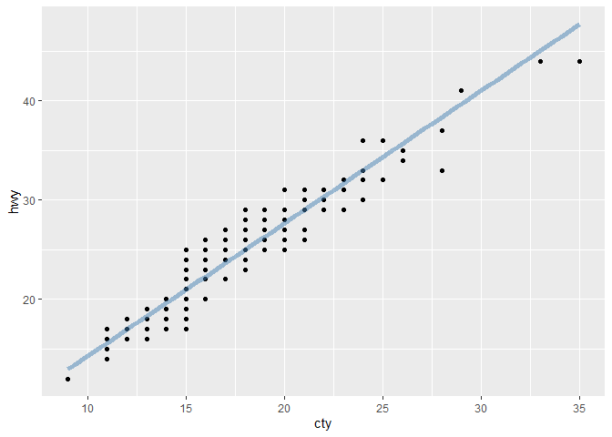<!-- -->

``` r
ggplot(mpg, aes(displ, hwy)) +
  geom_point() +
  bestfit
```

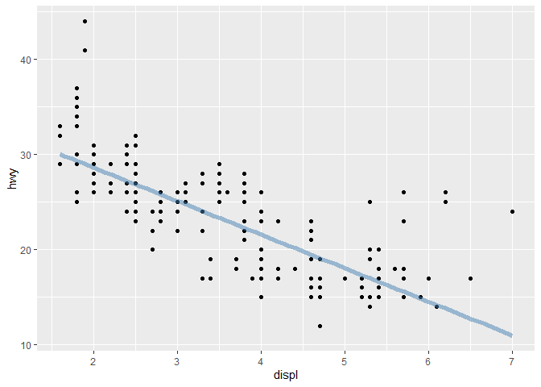<!-- -->

bestfit을
확장시켜보자.

``` r
geom_lm <- function(formula = y ~ x, colour = alpha("steelblue", 0.5), size = 2, ...) {
    geom_smooth(formula = formula, se = FALSE, method = "lm", colour =  colour,size = size, ...)
}
ggplot(mpg, aes(displ, 1 / hwy)) +
    geom_point() +
    geom_lm()
```

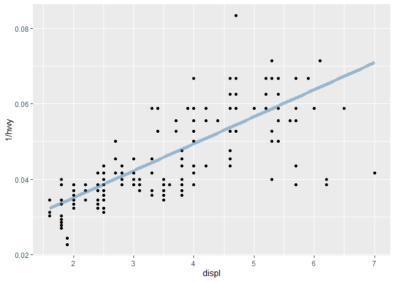<!-- -->

``` r
ggplot(mpg, aes(displ, 1 / hwy)) +
    geom_point() +
    geom_lm(y ~ poly(x, 2), size = 1, colour = "red")
```

<!-- -->

## Exercises

1.  Create an object that represents a pink histogram with 100 bins.

<!-- end list -->

``` r
geom_hist_pink100 <- function(bins = 100, fill = "pink") {
  geom_histogram(bins = bins, fill = fill)
}
ggplot(mpg, aes(hwy)) +
  geom_hist_pink100()
```

<!-- --> 2.
Create an object that represents a fill scale with the Blues ColorBrewer
palette

``` r
df <- data.frame(x = c("a", "b", "c", "d"), y = c(3, 4, 1, 2))
bars <- ggplot(df, aes(x, y, fill = x)) +
  geom_bar(stat = "identity") +
  labs(x = NULL, y = NULL) +
  theme(legend.position = "none")

scale_fill_brewer_blue <- function(palette = "Blues", ...) {
  scale_fill_brewer(palette = palette, ...)
}

bars + scale_fill_brewer_blue()
```

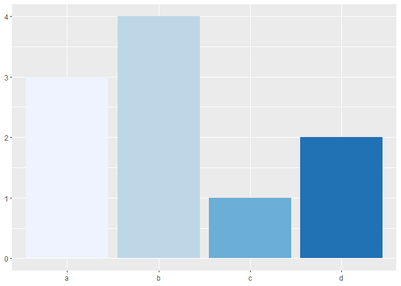<!-- -->

3.  Read the source code for theme grey(). What are its arguments? How
    does it work?

<!-- end list -->

``` r
bars + theme_grey(base_size = 50, base_family = "serif")
```

<!-- -->

base\_size : 폰트 사이즈 base\_family : 글자체 base\_line\_size : 선 성분의 크기
base\_rect\_szie : 사각형 성분의 크기

4.  Create scale colour wesanderson(). It should have a parameter to
    pick the palette from the wesanderson package, and create either a
    continuous or discrete scale.

이럴 때 `scale_colour_manual()`사용.

``` r
#install.packages("wesanderson")
library(wesanderson)
```

    ## Warning: package 'wesanderson' was built under R version 3.5.3

``` r
scale_colour_wesanderson <- function(values = wes_palette("Royal2"), ...){
  scale_color_manual(values = values, ...)
}
ggplot(mpg, aes(hwy, cty, colour = fl)) +
  geom_point() +
  facet_wrap(~drv) +
  scale_colour_wesanderson(values = wes_palette("Moonrise3")) +
  theme_wsj() +
  theme(panel.background = element_rect(fill = "white")) +
  guides(colour = guide_legend(title = "fuel type"))
```

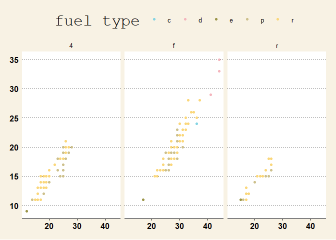<!-- -->

<font color = "red"> scale\_colour\_manual(values = "") </font>에 주의하자.

**reference** : <https://github.com/karthik/wesanderson>

# Multiple Components

다중컴포넌트는 리스트를 이용하여 더할 수 있다.

``` r
geom_mean <- function() {
list(
stat_summary(fun.y = "mean", geom = "bar", fill = "grey70"),
stat_summary(fun.data = "mean_cl_normal", geom = "errorbar", width = 0.4)
)
}
ggplot(mpg, aes(class, cty)) + geom_mean()
```

    ## Warning: Computation failed in `stat_summary()`:
    ## Hmisc package required for this function

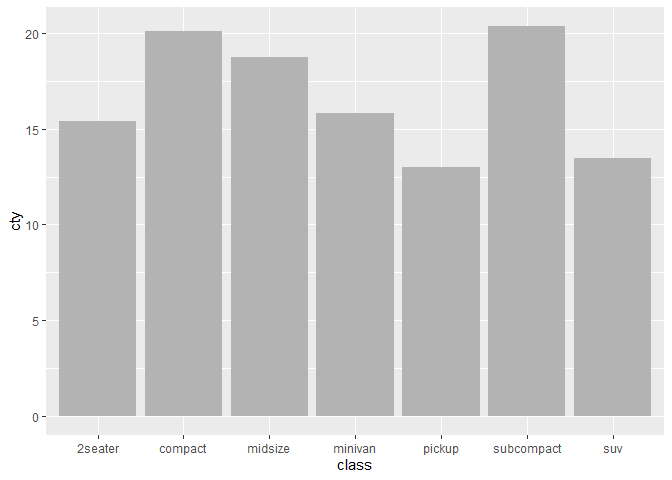<!-- -->

``` r
ggplot(mpg, aes(drv, cty)) + geom_mean()
```

    ## Warning: Computation failed in `stat_summary()`:
    ## Hmisc package required for this function

<!-- -->

``` r
geom_mean <- function(se = TRUE) {
list(
stat_summary(fun.y = "mean", geom = "bar", fill = "grey70"),
if (se) # 인자에 따라 조건적으로 에러바의 출력 유무 결정
stat_summary(fun.data = "mean_cl_normal", geom = "errorbar", width = 0.4)
)
}
ggplot(mpg, aes(drv, cty)) + geom_mean()
```

    ## Warning: Computation failed in `stat_summary()`:
    ## Hmisc package required for this function

<!-- -->

``` r
ggplot(mpg, aes(drv, cty)) + geom_mean(se = FALSE)
```

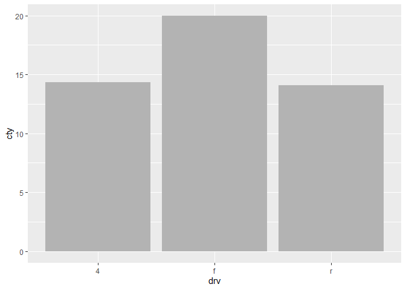<!-- -->

## Plot Components

이 방법은 레이어를 추가하는 일에만 한정되지 않는다. 리스트에 다음과 같은 객체 유형을 포함할 수도 있다.

\-<span style="background : yellow"> A data.frame</span>, which will
override the default dataset associated with the plot. (If you add a
data frame by itself, you’ll need to use %+%, but this is not necessary
if the data frame is in a list.)

``` r
base <- ggplot(mpg, aes(displ, hwy)) + geom_point()
base + geom_smooth()
```

    ## `geom_smooth()` using method = 'loess' and formula 'y ~ x'

<!-- -->

``` r
# To override the data, you must use %+%
base %+% filter(mpg, fl == "p") #filter 대신 subset사용 가능
```

<!-- -->

``` r
# Alternatively, you can add multiple components with a list.
# This can be useful to return from a function.
base + list(filter(mpg, fl == "p"), geom_smooth())
```

    ## `geom_smooth()` using method = 'loess' and formula 'y ~ x'

<!-- --> `%+%`대신
`+` 를 사용하면 `list()`를 꼭 써줘야 한다.

  - <span style="background : yellow"> An aes() object</span>, which
    will be combined with the existing default aesthetic mapping.

aes() is a quoting function, so you need to used tidy evaluation.

굉장히 어려운내용이고 아직 버그가 많아서 몇년후에 다시..

``` r
scatter_by <- function(data, x, y) {

  ggplot(data) + 
    geom_point(aes_string(x= quo_name(enquo(x)), y=quo_name(enquo(y))))

}
scatter_by(mtcars, disp, drat)
```

<!-- -->

  - <span style="background : yellow"> Scales</span>, which override
    existing scales, with a warning if they’ve already been set by the
    user.
  - <span style="background : yellow"> Coordinate systems and facetting
    specification</span>, which override the existing settings
  - <span style="background : yellow"> Theme components</span>, which
    override the specified components

## Annotation

플랏에 표준 주석을 추가하면 종종 유용하다. 이 경우에는 함수가 플랏으로부터 상속하지 않고 레이어 함수에 데이터를 설정한다.

  - **inherit.ase = FALSE** 부모플랏으로 부터 레이어에 미적요소가 상속받지 못하게 한다. 이것은 플랏에 있는
    것에 관계없이 주석이 작동하게끔 한다.
  - **show.legend = FALSE** 주석이 범례에 나타나지 않도록 한다.

두 매개변수를 사용하는 예제는 다음과 같다. borders함수는 다음과 같이 정의되어 있다. help 예제에서는 오류가 뜬다.

``` r
borders <- function(database = "world", regions = ".", fill = NA,
                    colour = "grey50", ...) {
  df <- map_data(database, regions)
  geom_polygon(
    aes_(˜lat, ˜long, group = ˜group),
    data = df, fill = fill, colour = colour, ...,
    inherit.aes = FALSE, show.legend = FALSE
  )
}
```

``` r
ggplot(mpg, aes(displ, hwy, colour = class)) +
  geom_point(show.legend = FALSE) + 
  directlabels::geom_dl(aes(label = class), method = "smart.grid")
```

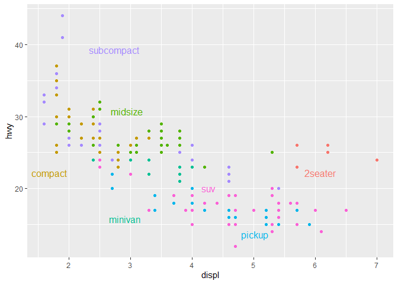<!-- -->

show.legend = FALSE와 theme(legend.position = “none”) 의 차이는 다음과 같다.

``` r
df <- data.frame( y = c(1, 2, 3), z = c("a", "b", "c"))
ggplot(df, aes(y, y)) +
  geom_point(size = 4, colour = "grey20") +
  geom_point(aes(colour = z), size = 2)
```

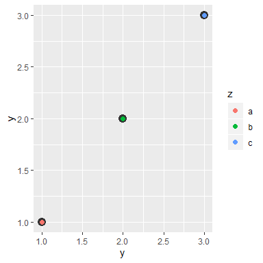<!-- -->

``` r
ggplot(df, aes(y, y)) +
  geom_point(size = 4, colour = "grey20", show.legend = TRUE) +
  geom_point(aes(colour = z), size = 2)
```

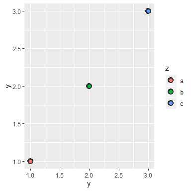<!-- -->

``` r
ggplot(df, aes(y, y)) +
  geom_point(size = 4, colour = "grey20") +
  geom_point(aes(colour = z), size = 2) +
  theme(legend.position = "none")
```

<!-- -->

## Additional Arguments

함수의 컴포넌트에 추가 인수를 전달하려는 경우 ’…’은 좋지 않다. 다른 컴포넌트에 다른 인자를 직접적으로 전달 할 방법이 없다.
대신에 함수가 어떻게 작동할 지를 생각해보자. 모든 것을 할 수 있는 하나의 함수와 이해하기 어려운 함수를 사용하는 데에 비용
사이를 조율하자.

### modifyList

시작하기 앞서, modifyList함수를 짚고 넘어가자

Description 구성요소의 부분집합을 두번째 리스트에 각 수준에 매치시키면서 중첩된 리스트를 재귀적으로 가능한 대로
수정한다.

Arguments

  - x : A named <span style="background : yellow">list. \<possibly empty
    </span>
  - val : A named <span style="background : yellow">list with componets
    to replace corresponding components in x.</span>
  - keep.null : If TRUE, NULL elements in val become NULL elements in x.
    Otherwise, the corresponding element, if present, is deleted from x.

<!-- end list -->

``` r
foo <- list(a = 1, b = list(c = "a", d = FALSE))
bar <- modifyList(foo, list(e = 2, b = list(d = TRUE)))
str(foo)
```

    ## List of 2
    ##  $ a: num 1
    ##  $ b:List of 2
    ##   ..$ c: chr "a"
    ##   ..$ d: logi FALSE

``` r
str(bar) # b의 d가 FALSE에서 TRUE로 바뀜.
```

    ## List of 3
    ##  $ a: num 1
    ##  $ b:List of 2
    ##   ..$ c: chr "a"
    ##   ..$ d: logi TRUE
    ##  $ e: num 2

``` r
# if we already have a list (e.g., a data frame)
## we need c() to add further arguments
temp <- expand.grid(letters[1:2], 1:3, c("+", "-"))
do.call("paste", c(temp, sep = ""))
```

    ##  [1] "a1+" "b1+" "a2+" "b2+" "a3+" "b3+" "a1-" "b1-" "a2-" "b2-" "a3-"
    ## [12] "b3-"

``` r
unite(temp, var, sep = "")[[1]] #위와 동일
```

    ##  [1] "a1+" "b1+" "a2+" "b2+" "a3+" "b3+" "a1-" "b1-" "a2-" "b2-" "a3-"
    ## [12] "b3-"

`expand.grid()`는 주어진 벡터나 팩터에 대해 모든 조합의 데이터프레임을 만든다.

``` r
g <- ggplot(mpg, aes(hwy, cty)) + geom_point()
typeof(g)
```

    ## [1] "list"

ggplot객체의 데이터 타입은
리스트이다.

``` r
geom_mean <- function(..., bar.params = list(), errorbar.params = list()) {
  params <- list(...)
  bar.params <- modifyList(params, bar.params)
  errorbar.params <- modifyList(params, errorbar.params)
  
  bar <- do.call("stat_summary", modifyList(
    list(fun.y = "mean", geom = "bar", fill = "grey70"),
    bar.params)
  )
  errorbar <- do.call("stat_summary", modifyList(
    list(fun.data = "mean_cl_normal", geom = "errorbar", width = 0.4),
    errorbar.params)
  )
  
  list(bar, errorbar)
}

a <- ggplot(mpg, aes(class, cty)) +
  geom_mean(
    colour = "steelblue",
    errorbar.params = list(width = 0.5, size = 1)
  )
b <- ggplot(mpg, aes(class, cty)) +
  geom_mean(
    bar.params = list(fill = "steelblue"),
    errorbar.params = list(colour = "blue")
  )
cowplot::plot_grid(a, b, labels = c("1", "2"))
```

    ## Warning: Computation failed in `stat_summary()`:
    ## Hmisc package required for this function
    
    ## Warning: Computation failed in `stat_summary()`:
    ## Hmisc package required for this function

<!-- -->
`list(params, bar.params)`가 아니라 `modifyList(params, bar.params)`인 이유는
list를 사용하면 리스트가 중첩되어 버린다.

### do.call

do call의 첫번째 인자는 함수, 두번째 인자는 인자의 list

여기서 `do.call`을 사용하는 이유는 다음과 같다

우선, `do.call("plot", list(x = 1:10, y = 1:10))` 과 `plot(x = 1:10, y
= 1:10)`은 동일하다.

하지만 이러한 접근법은 `params <- list(...)` 를 이용하여 가변인자를 사용할 수 있게 해준다.

문서를 보면 `stat_summary()`는 가변인자를 취하고 있다. 따라서 `do.call("stat_summary",
params)`가 가능하고 이는 함수를 좀 더 유연하게 할 수 있다.

a에서 `colour = "steelblue"`가 …에 해당하는 인자이다. 이것이 이 매개변수를 입력했을 때 막대의 윤곽선과
에러바의 색이 둘 다 변하는 이유이다.

`vignette("extending-ggplot2")` 를 읽어보라.

## Exercises

1.  To make the best use of space, many examples in this book hide the
    axes labels and legend. I’ve just copied-and-pasted the same code
    into multiple places, but it would make more sense to create a
    reusable function. What would that function look like?

<!-- end list -->

``` r
theme_hide <- function(...){
  list(
    labs(x = NULL, y = NULL),
    theme(
      legend.position = "none",
      axis.text = element_blank(),
      axis.ticks = element_blank(),
      panel.background = element_rect("white"),
      plot.background = element_rect("goldenrod1"), ...
    )
  )
}
ggplot(mpg, aes(cty, hwy, colour = drv)) +
  geom_point() +
  theme_hide()
```

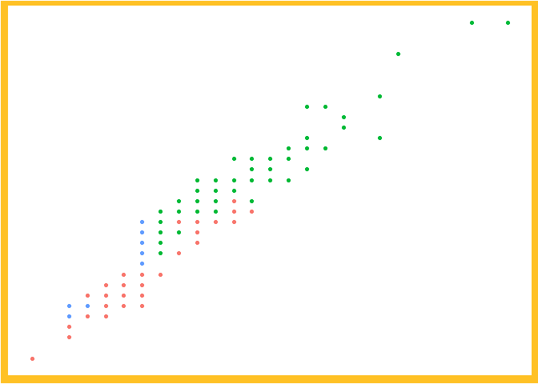<!-- -->

2.  Extend the borders() function to also add coord quickmap() to the
    plot.

<!-- end list -->

``` r
world <- map_data("world")
worldmap <- ggplot(world, aes(long, lat, group = group)) +
  geom_path() +
  scale_y_continuous(NULL, breaks = (-2:3) * 30, labels = NULL) +
  scale_x_continuous(NULL, breaks = (-4:4) * 45, labels = NULL)
worldmap + coord_map()
```

<!-- -->

``` r
# Some crazier projections
worldmap + coord_map("ortho")
```

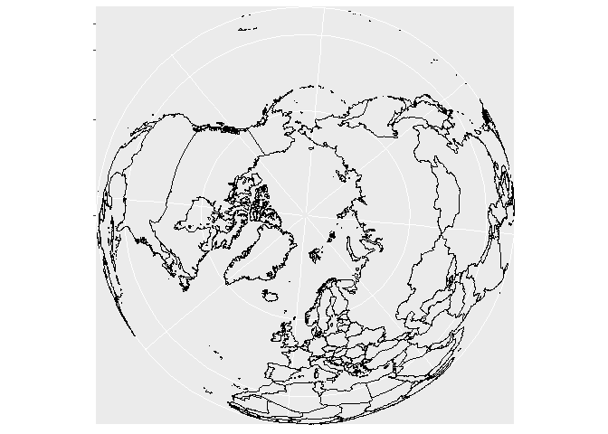<!-- -->

``` r
borders <- function(database = "world", regions = ".", fill = NA,
                    colour = "grey50", ...) {
df <- map_data(database, regions)
  geom_polygon(
    aes_(~long, ~lat, group = ~group),
    data = df, fill = fill, colour = colour, ...,
    inherit.aes = FALSE, show.legend = FALSE
  )
}

worldmap + borders()
```

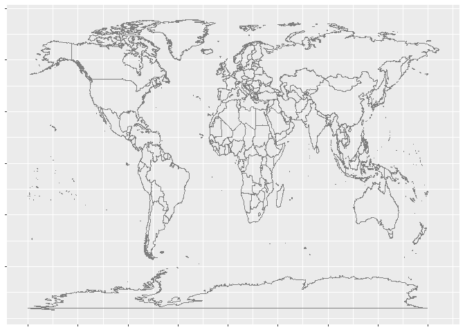<!-- -->

``` r
coord_quickmap_extend <- function() {
  list(
    borders(),
    coord_quickmap()
  )
}

worldmap + coord_quickmap_extend()
```

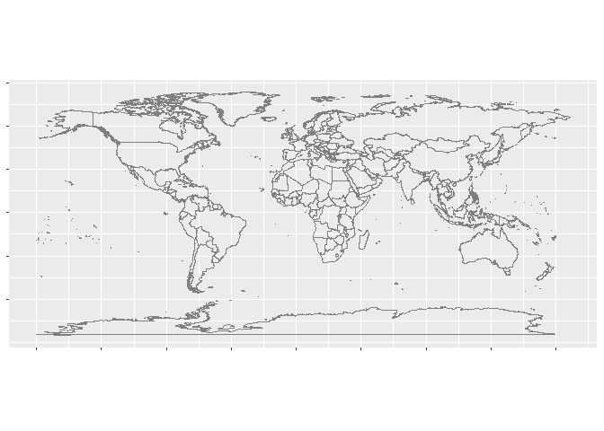<!-- --> 예시가
적합하지 않지만 이런 느낌으로 확장시키면 될듯.

3.  Look through your own code. What combinations of geoms or scales do
    you use all the time? How could you extract the pattern into a
    reusable
function?

<!-- end list -->

``` r
theme_mine <- function(panel.background = element_rect(fill = "white")) {
  list(
   theme_wsj(),
   theme(
     panel.background = panel.background)
   )
}
g <- ggplot(economics, aes(date, unemploy/pop))+
  geom_line() +
  theme_mine(panel.background = element_rect(fill = "floralwhite"))

g %+% filter(economics, lubridate::year(date) > 2000)
```

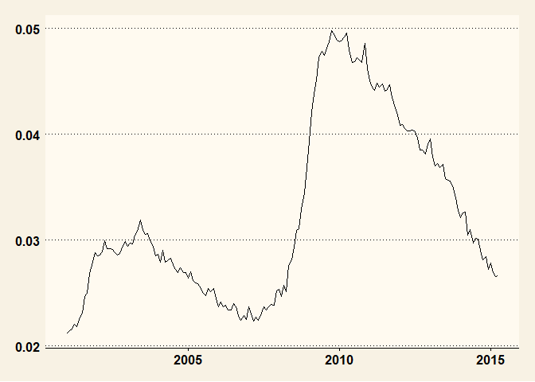<!-- -->

``` r
#g + list(filter(economics, lubridate::year(date) > 2000)) 이건 list를 꼭 쓰자.

ggplot(mpg, aes(cty, hwy, colour = drv)) +
  geom_point() +
  facet_wrap(~cyl) +
  theme_mine() 
```

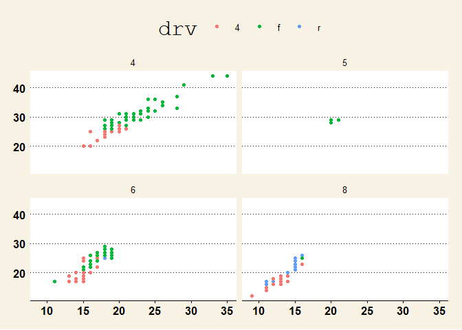<!-- -->

# Plot Functions

때떄로 동일한 플랏을 반복해서 만들 때가 있는데, 이 때는 유연성이 필요하지 않다. 컴포넌트를 만드는 대신에, 데이터와 매게
변수를 사용해서 완전한 플랏을 반환하는 함수를 작성할 필요가 있을 지도 모른다.

``` r
piechart <- function(data, mapping) {
  ggplot(data, mapping) +
    geom_bar(width = 1) +
    coord_polar(theta = "y") +
    labs(x = NULL, y = NULL) +
    scale_x_discrete(breaks = NULL) # 눈금과 1을 없애기 위함
}
piechart(mpg, aes(factor(1), fill = class))
```

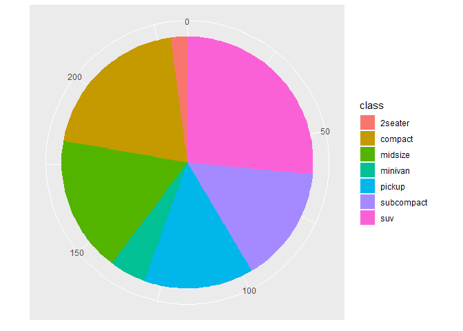<!-- --> 컴포넌트
기반의 접근법보다는 유연성이 떨어지지만, 정확하다.

## vapply vs. sapply

``` r
iris_2 <- iris[, 1:4]
sapply(iris_2, fivenum)
```

    ##      Sepal.Length Sepal.Width Petal.Length Petal.Width
    ## [1,]          4.3         2.0         1.00         0.1
    ## [2,]          5.1         2.8         1.60         0.3
    ## [3,]          5.8         3.0         4.35         1.3
    ## [4,]          6.4         3.3         5.10         1.8
    ## [5,]          7.9         4.4         6.90         2.5

``` r
vapply(iris_2, fivenum, c("Min." = 0,"1st Qu." = 0, "Median" = 0, "3rd Qu." = 0, "Max." = 0))
```

    ##         Sepal.Length Sepal.Width Petal.Length Petal.Width
    ## Min.             4.3         2.0         1.00         0.1
    ## 1st Qu.          5.1         2.8         1.60         0.3
    ## Median           5.8         3.0         4.35         1.3
    ## 3rd Qu.          6.4         3.3         5.10         1.8
    ## Max.             7.9         4.4         6.90         2.5

``` r
x <- list(a = 1:5, b = rnorm(10))
lapply(x, mean)
```

    ## $a
    ## [1] 3
    ## 
    ## $b
    ## [1] -0.2382863

``` r
sapply(x, mean)
```

    ##          a          b 
    ##  3.0000000 -0.2382863

``` r
vapply(x, mean, double(1)) # 출력 값을 지정해줘야 한다.
```

    ##          a          b 
    ##  3.0000000 -0.2382863

vapply 함수는 sapply 함수와 유사한데 추가적으로 출력되는 결과의 양식(Template)을 지정할 수 있다. 따라서 좀
더 안정적이다.

Cf.
<https://stackoverflow.com/questions/12339650/why-is-vapply-safer-than-sapply>

## PCPs (parallel coordinated plots)

PCPs는 데이터 변환이 필요하므로 데이터를 변환시키는 함수와 플랏을 생성하는 함수로 나누어 작성하는 것이 좋다. 두 개의
조각으로 분리하면 나중에 다른 시각화를 위해 동일한 변환을 다시 사용하기에 쉽다.

``` r
pcp_data <- function(df) {
  is_numeric <- vapply(df, is.numeric, logical(1))
  # Rescale numeric columns
  rescale01 <- function(x) {
    rng <- range(x, na.rm = TRUE)
    (x - rng[1]) / (rng[2] - rng[1])
  }
  df[is_numeric] <- lapply(df[is_numeric], rescale01)
  # Add row identifier
  
  df$.row <- rownames(df)
  
  # Treat numerics as value (aka measure) variables
  # gather_ is the standard-evaluation version of gather, and
  # is usually easier to program with.
  gather_(df, "variable", "value", colnames(df)[is_numeric])
}

pcp <- function(df, ...) {
  df <- pcp_data(df)
  ggplot(df, aes(variable, value, group = .row)) + geom_line(...)
}

pcp(mpg)
```

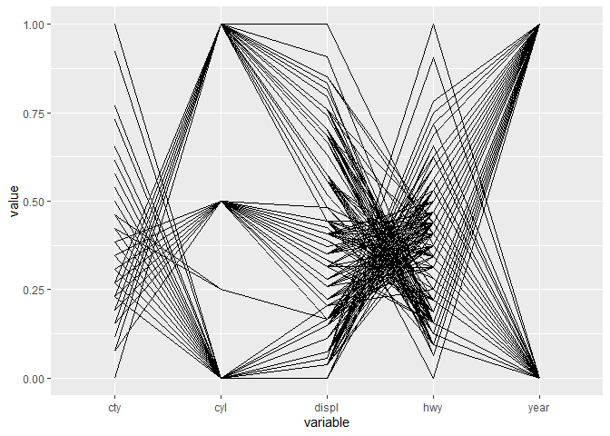<!-- -->

``` r
pcp(mpg, aes(colour = drv), alpha = 1/3) +
  scale_colour_brewer(palette = "Set1") +
  theme_tufte() +
  theme(
    panel.grid.major.x = element_line(colour = "grey60"),
    panel.grid.major.y = element_line(colour = "grey92")
  )
```

<!-- -->

위 함수 코드는 반복해서 숙달해보자.

## Indirectly Referring to Variables

이전에 `piecahrt()`는 파이차트를 그리기 위한 정확한`aes()`를 알아야 하기 때문에 별로 매력적이지 않다.

aes() 는 non-standard evaluation 을 사용한다. aes()는 인자의 값 보다는 표현식을 살펴본다. 따라서
객체에 변수 이름을 저장하고 나중에 참조할 방법이 없으므로 프로그래밍방식으로 작업하기 어렵다.

``` r
x_var <- "displ"
aes(x_var)
```

    ## Aesthetic mapping: 
    ## * `x` -> `x_var`

aes() 대신에 regular evaluation을 사용하는 <font color = "red"> aes\_() </font>
를 사용한다. aes\_()를 사용해 매핑을 만드는 두가지 기본 방법이 있다.

1.  Using a quoted call, created by quote(), substitute(), as.name(), or
    parse().

<!-- end list -->

``` r
aes_(quote(displ))
```

    ## Aesthetic mapping: 
    ## * `x` -> `displ`

``` r
aes_(as.name(x_var))
```

    ## Aesthetic mapping: 
    ## * `x` -> `displ`

``` r
aes_(parse(text = x_var)[[1]])
```

    ## Aesthetic mapping: 
    ## * `x` -> `displ`

``` r
f <- function(x_var) {
  aes_(substitute(x_var))
}
f(displ)
```

    ## Aesthetic mapping: 
    ## * `x` -> `displ`

``` r
aes_(substitute(displ))
```

    ## Aesthetic mapping: 
    ## * `x` -> `displ`

``` r
#> * x ->
```

as.name() 과 parse() 의 차이는 미묘하다. x\_var이 “a + b”이면 as.name()은 변수 ’a + b’로
변환하고 parse()는 함수 호출 a + b로 변환한다.

2.  Using a formula, created with ~.

<!-- end list -->

``` r
aes_(~displ)
```

    ## Aesthetic mapping: 
    ## * `x` -> `displ`

aes\_() gives us three options for how a user can supply variables: as a
<span style="background : yellow">string, as formula, or as a bare
expression</span>.

``` r
# factor(1) 앞에  ~가 있음에 주의 
piechart1 <- function(data, var, ...) {
 piechart(data, aes_(~factor(1), fill = as.name(var)))
}
a <- piechart1(mpg, "class") + theme(legend.position = "none")
piechart2 <- function(data, var, ...) {
 piechart(data, aes_(~factor(1), fill = var))
}
b <- piechart2(mpg, ~class) + theme(legend.position = "none")
piechart3 <- function(data, var, ...) {
  piechart(data, aes_(~factor(1), fill = substitute(var)))
}
c <- piechart3(mpg, class) + theme(legend.position = "none")
cowplot::plot_grid(a, b, c, labels = c("a", "b", "c"))
```

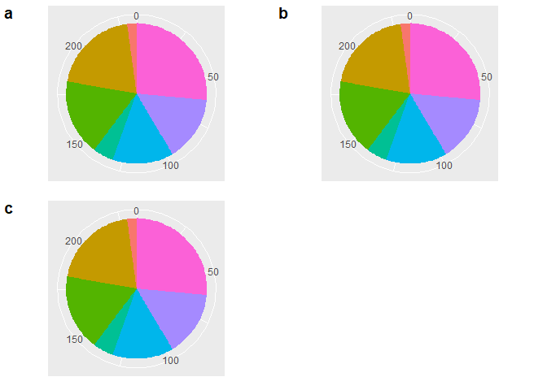<!-- -->
aes\_()의 aes()와 비교해서 또 다른 장점은 패키지내에 ggplot 플랏을 작성 할 때 이다. R CMD 검사에서
전역 변수 NOTE를 피하기 위해 aes(x, y) 대신에 aes\_(~x, ~y)를 사용해라.

### Non-standard evaluation

**reference** : <http://adv-r.had.co.nz/Computing-on-the-language.html>

<http://cojette-wiki.appspot.com/Non_Standard_Evaluation_in_R>

NSE의 주요한 특징은 NSE로 쓴 내용은 다른 변수로 대체 할 수 없다.

``` r
df <- tibble(x = 1:3, y = 3:1)
df %>% filter( x == 1)
```

    ## # A tibble: 1 x 2
    ##       x     y
    ##   <int> <int>
    ## 1     1     3

`my_var <- x`

`filter(df, my_var == 1)`

`Error in filter_impl(.data, quo) : Evaluation error: (list) object
cannot be coerced to type 'double'.`

``` r
my_var <- rlang::quo(x)
df %>% filter(!!my_var == 1)
```

    ## # A tibble: 1 x 2
    ##       x     y
    ##   <int> <int>
    ## 1     1     3

## The Plot Environment

정교한 plotting functions를 만들 때 ggplot의 스코프 룰을 좀 더 이해해야 한다. *data*에 변수를 찾을
수 없다면, *plot environment* 에서 찾는다. 한 플랏에(각 레이어가 아닌) 한 개 환경만 있으며, 이 환경은
ggplot()이 호출되는 환경(i.e. the parent.frame())이다.

n이 접근 가능한 환경에 저장되어 있지 않기 때문에 다음 함수는 작동하지 않는다.

``` r
f <- function() {
  n <- 10
  geom_line(aes(x / n))
}
df <- data.frame(x = 1:3, y = 1:3)
ggplot(df, aes(x, y)) + f()
```

`Error in x/n : non-numeric argument to binary operator`

이 문제는 *mapping* 인자에 대해서만 일어난다. 다른 모든 인자는 즉이 연산되어서 플랏 객체에 저장된다. 다음 함수는 잘
작동한다.

``` r
f <- function() {
  colour <- "blue"
  geom_line(colour = colour)
}
ggplot(df, aes(x, y)) + f()
```

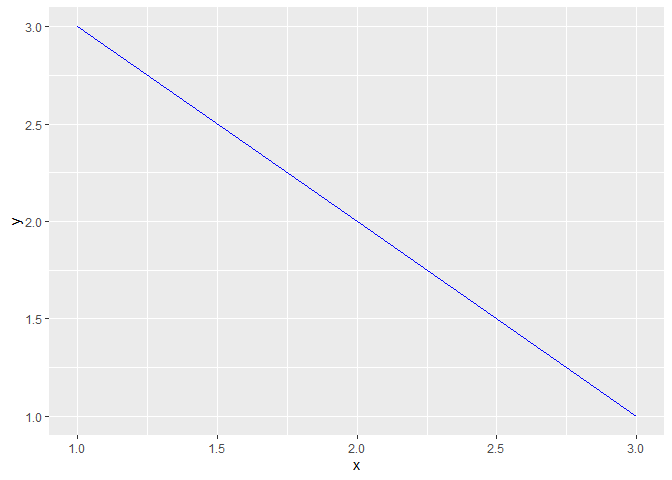<!-- -->

## Exercises

1.  Create a distribution() function specially designed for visualising
    continuous distributions. Allow the user to supply a dataset and the
    name of a variable to visualise. Let them choose between histograms,
    frequency polygons, and density plots. What other arguments might
    you want to include?

두가지 방법이 있다.

첫번째 방법은 aes를 직접 입력하는것.

``` r
distribution <- function(data, mapping, type = "density", ...) {
  
  
  if(type == "histogram") {
    ggplot(data, mapping) +
      geom_histogram(...) 
  }
  else if (type == "freq_polygon"){
    ggplot(data, mapping) +
      geom_freqpoly(...)
  }
  else
    ggplot(data, mapping) +
      geom_density(...)
}

df <- data.frame(value = rnorm(seq(-3, 3,by = 0.01)))
df <- df %>% 
  mutate(x = rep(c("a","b","c"), length = nrow(df)))
distribution(mpg, aes(hwy, colour = drv), alpha = 1/3)
```

<!-- -->

두번째는 원하는 변수의 분포를 aes를 입력 하지 않아도 되는 방법.

``` r
distribution <- function(df, var, fun, ...) {
  var <- rlang::quo_text(enquo(var))
  g <- ggplot(df, aes_string(var)) + theme_tufte() +
    theme(
      panel.grid.major = element_line(colour = "grey70")
    )
  
   if(fun == "histogram") {
      g + geom_histogram(...) 
  }
  else if (fun == "freq_polygon"){
      g + geom_freqpoly(...)
  }
  else
    g + geom_density(...)
}
distribution(mpg, hwy, "histogram", aes(fill = drv), position = "dodge")
```

    ## `stat_bin()` using `bins = 30`. Pick better value with `binwidth`.

<!-- -->

2.  What additional arguments should pcp() take? What are the downsides
    of how … is used in the current code?

<!-- end list -->

1.  어떻게 쓰는지 이해하기 어렵다.
2.  documentation에 쓰여 있지 않은 특징이 있을 수 있다.
3.  스펠링을 틀려도 에러를 발생시키지 않는다.(pcp에서는 아님)

<!-- end list -->

``` r
#c에 해당하는 예
sum(1, 2, NA, na.mr = TRUE)
```

    ## [1] NA

3.  Advanced: why doesn’t this code work? How can you fix it?

<!-- end list -->

``` r
f <- function() {
  levs <- c("2seater", "compact", "midsize", "minivan", "pickup",
  "subcompact", "suv")
  piechart3(mpg, factor(class, levels = levs))
}
f()
#> Error in factor(class, levels = levs): object 'levs' not found
```

Sol.1)우선 함수를 살펴보자. levs가 접근 가능한 환경에 있지 않다. levs를 매개변수로 받아버리자.

``` r
f <- function(levs) {
  piechart3(mpg, factor(class, levels = levs))
}
levs <- c("2seater", "compact", "midsize", "minivan", "pickup",
          "subcompact", "suv")
f(levs)
```

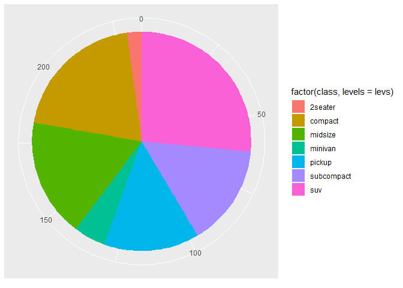<!-- -->

<font color = "red"> Sol.2)enviornment를 활용</font> … 인자와 enviornment인자를
추가시켰다.

``` r
 piechart <- function(data, mapping, ...) {
    ggplot(data, mapping, ...) +
      geom_bar(width = 1) +
      coord_polar(theta = "y") +
      xlab(NULL) +
      ylab(NULL)
  }
#piechart(mpg, aes(factor(1), fill = class)) #오류 없음

  piechart3 <- function(data, var, ...) {
    piechart(data, aes_(~factor(1), fill = substitute(var)), ...)
  }
#piechart3(mpg, class) + theme(legend.position = "none") #오류 없음 
f <- function() {
     .e <- environment()
  levs <- c("2seater", "compact", "midsize", "minivan", "pickup",
  "subcompact", "suv")
  piechart3(mpg, factor(class, levels = levs), environment = .e)
}
f()
```

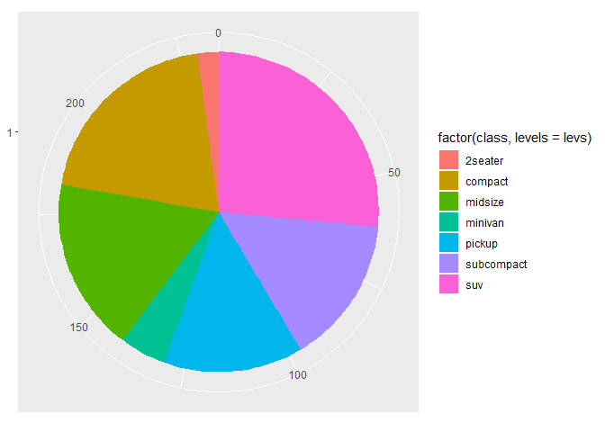<!-- -->

levs가 f바깥에 있는 경우 : 오류 x levs가 f바깥에 있고 f의 인자가 levs = levs인 경우 : 오류 levs가
f바깥에 있고 .e도 바깥에 있는 경우 : 오류 x

advanced-R 8장을 참고하라.

# Functional Programming

**reference** : <http://rpubs.com/cardiomoon/253966>

<http://adv-r.had.co.nz/Functional-programming.html>

``` r
geoms <- list(
  geom_point(),
  geom_boxplot(aes(group = cut_width(displ, 1))),
  list(geom_point(), geom_smooth())
)
p <- ggplot(mpg, aes(displ, hwy))
lapply(geoms, function(g) p + g) 
```

    ## [[1]]

<!-- -->

    ## 
    ## [[2]]

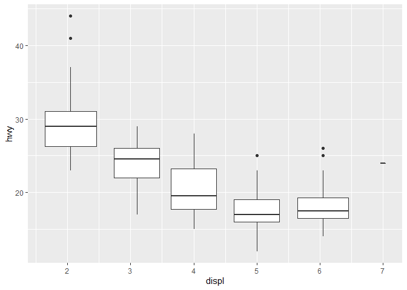<!-- -->

    ## 
    ## [[3]]

    ## `geom_smooth()` using method = 'loess' and formula 'y ~ x'

<!-- -->

### Redue

base의 `Reduce`를 purr의 `reduce`로 대체.

``` r
pasteadd <- function(...) {
  paste(..., sep = "+")
}
purrr::reduce(month.name, pasteadd)
```

    ## [1] "January+February+March+April+May+June+July+August+September+October+November+December"

## Exercises

1.  How could you add a geom point() layer to each element of the
    following list?

<!-- end list -->

``` r
plots <- list(
  ggplot(mpg, aes(displ, hwy)),
  ggplot(diamonds, aes(carat, price)),
  ggplot(faithfuld, aes(waiting, eruptions, size = density))
)
```

lapply를 이해하면 쉽다.

``` r
plots <- list(
  ggplot(mpg, aes(displ, hwy)),
  ggplot(diamonds, aes(carat, price)),
  ggplot(faithfuld, aes(waiting, eruptions, size = density))
)
g <- geom_point()
lapply(plots, function(p) p + g)
```

    ## [[1]]

<!-- -->

    ## 
    ## [[2]]

<!-- -->

    ## 
    ## [[3]]

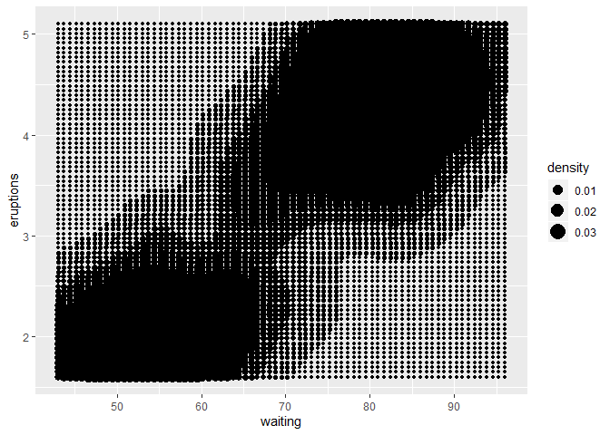<!-- -->

3번째 그림에 scale\_size\_area() 레이어를 어떻게 추가시킬까?

2.  What does the following function do? What’s a better name for it?

<!-- end list -->

``` r
mystery <- function(...) {
  Reduce('+', list(...), accumulate = TRUE)
}
mystery(
  ggplot(mpg, aes(displ, hwy)) + geom_point(),
  geom_smooth(),
  xlab(NULL),
  ylab(NULL)
)
```

    ## [[1]]

<!-- -->

    ## 
    ## [[2]]

    ## `geom_smooth()` using method = 'loess' and formula 'y ~ x'

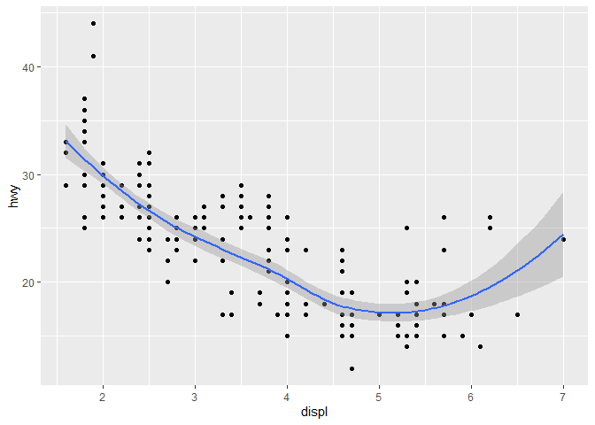<!-- -->

    ## 
    ## [[3]]

    ## `geom_smooth()` using method = 'loess' and formula 'y ~ x'

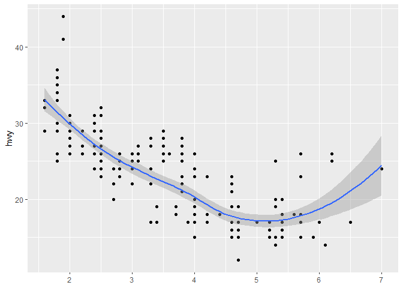<!-- -->

    ## 
    ## [[4]]

    ## `geom_smooth()` using method = 'loess' and formula 'y ~ x'

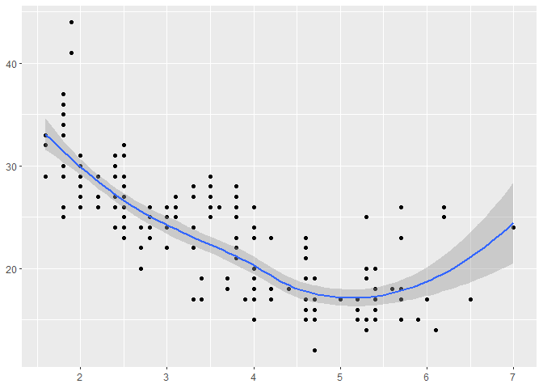<!-- --> Reduce
함수를 이해하면 충분히 풀 수 있는 문제.

# Summary

  - tidyverse패키지의 함수를 사용할 때 인자를 변수로 접근하고 싶을 때(즉, 변수 간접 참조)
    <font color = "red"> NSE </font>가 아닌
    <font color = "red">standard-evaluation</font>을 사용하는 함수들을
    이용하자.(e.g. aes\_(), gather\_(),…) 또한 quote(), substitue(),
    “~” 도 필요시 이용하자.

  - 코드의 길이를 줄이고 여러 플랏을 출력시키고 싶을때 <span style="background : yellow">list,
    lapply, Reduce를 활용하자.</span>

  - ggplot의 인자들을 변수로 접근하고 싶을 때 <span style="background : yellow">ggplot의
    스코프 룰에 주의하자.</span>

  - 모든 조합을 df로 반환하는 함수 : `expand.grid`

  - 여러 열을 합치는 함수 : `unite()`

  - 가변인자를 매개변수로 받아와서 리스트로 변환한 뒤, `do.call(function, params)`를 사용하여 함수의
    유연성을 증가시킨다. 또한 `modifyList()`를 사용하면 두 객체 모두 적용할 매개변수와 하나의 객체만
    적용시킬 매개변수를 구분할 수 있다.

  - plot 환경에 대한 이해

  - reduce에 대한 이해
